# Abstract Reasoning

Formato deduplicado para estudio.

## Pregunta 1

Fuente: https://www.epsoprep.com/practice/attempt/en/UXVlc3Rpb25Qb29sQXR0ZW1wdDpXUk1ZU0ZMMXQwMnpJZ2plMHIwTnVn/review?q=1

### Enunciado

From the options available, please choose which diagram would come next in the series.

### Imagen

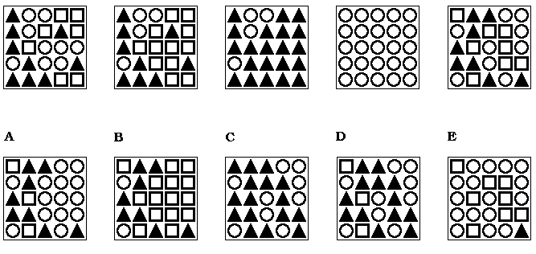

### Opciones disponibles

- **A.** A
- **B.** B
- **C.** C
- **D.** D
- **E.** E

---

### Respuesta y explicacion

La respuesta correcta es la **D**: D

A ‘group’ is a set of identical items, all of which are directly adjacent to at least one identical item, either horizontally or vertically (not diagonally).

In each diagram, the largest such group is identified (e.g. in diagram one there is a group of five circles; the next largest being a group of four triangles).

All items in this connected group are then replaced, according to these rules: circles become squares, squares become triangles and triangles become circles.

Once all items have become identical in this way (as in diagram four), a new pattern begins, which will follow the same rules.

The largest group in diagram five is a set of five squares, which will thus be replaced with triangles.

Other squares are not affected as they don't belong to the connected group of squares.

## Pregunta 2

Fuente: https://www.epsoprep.com/practice/attempt/en/UXVlc3Rpb25Qb29sQXR0ZW1wdDpXUk1ZU0ZMMXQwMnpJZ2plMHIwTnVn/review?q=2

### Enunciado

From the options available, please choose which diagram would come next in the series.

### Imagen

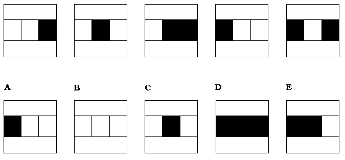

### Opciones disponibles

- **A.** A
- **B.** B
- **C.** C
- **D.** D
- **E.** E

---

### Respuesta y explicacion

La respuesta correcta es la **E**: E

The squares represent binary digits: 1 (when black) for the right square (or when white), 2 for the middle square, and 4 for the left square.

Thus the first diagram is number 1, expressed in binary, the second is 2, the third 3, and so on.

The correct answer is, therefore, the number 6 (i.e. 4 + 2).

## Pregunta 3

Fuente: https://www.epsoprep.com/practice/attempt/en/UXVlc3Rpb25Qb29sQXR0ZW1wdDpXUk1ZU0ZMMXQwMnpJZ2plMHIwTnVn/review?q=3

### Enunciado

From the options available, please choose which diagram would come next in the series.

### Imagen

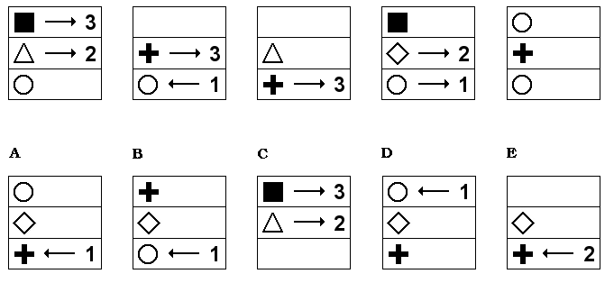

### Opciones disponibles

- **A.** A
- **B.** B
- **C.** C
- **D.** D
- **E.** E

---

### Respuesta y explicacion

La respuesta correcta es la **D**: D

The six diagrams (including the correct answer) have various shapes moving between them.

Shapes with a direction and number are departures: that shape must appear, in the same location (top, middle, or bottom) in the diagram n positions along in the direction indicated (n being the number specified). Shapes with no direction/number are arrivals.

The correct answer must, therefore, include (in the correct positions) all arrivals which previous diagrams have indicated should appear, and should also account for any otherwise unexplained arrivals in previous diagrams.

## Pregunta 4

Fuente: https://www.epsoprep.com/practice/attempt/en/UXVlc3Rpb25Qb29sQXR0ZW1wdDpXUk1ZU0ZMMXQwMnpJZ2plMHIwTnVn/review?q=4

### Enunciado

From the options available, please choose which diagram would come next in the series.

### Imagen

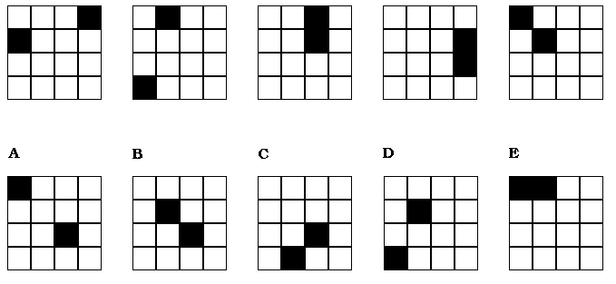

### Opciones disponibles

- **A.** A
- **B.** B
- **C.** C
- **D.** D
- **E.** E

---

### Respuesta y explicacion

La respuesta correcta es la **C**: C

The two black blocks move within the 4x4 grid, according to rules assigned to their current row and column.

First, they move within their row: blocks in the top two rows move right one space, while blocks in the bottom two rows move right two spaces.

Second (having moved within their row as described), they move within their new column: blocks in the left two columns move up one space, while blocks in the right two columns move down one space.

## Pregunta 5

Fuente: https://www.epsoprep.com/practice/attempt/en/UXVlc3Rpb25Qb29sQXR0ZW1wdDpXUk1ZU0ZMMXQwMnpJZ2plMHIwTnVn/review?q=5

### Enunciado

From the options available, please choose which diagram would come next in the series.

### Imagen

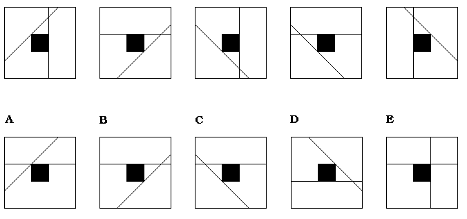

### Opciones disponibles

- **A.** A
- **B.** B
- **C.** C
- **D.** D
- **E.** E

---

### Respuesta y explicacion

La respuesta correcta es la **B**: B

The two lines are each attached to a corner of the square (the top left and top right corners, in the first diagram). Both lines follow the same pattern.

Every time, the attachment point of each line changes clockwise to the next corner around the square (e.g. the line attached to the top left corner in diagram one is attached to the top right in diagram two).

At the same time, each line rotates according to a three-diagram pattern: 45 degrees clockwise, 90 degrees, then 45 degrees anticlockwise.

## Pregunta 6

Fuente: https://www.epsoprep.com/practice/attempt/en/UXVlc3Rpb25Qb29sQXR0ZW1wdDpXUk1ZU0ZMMXQwMnpJZ2plMHIwTnVn/review?q=6

### Enunciado

From the options available, please choose which diagram would come next in the series.

### Imagen

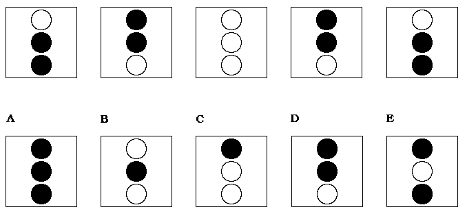

### Opciones disponibles

- **A.** A
- **B.** B
- **C.** C
- **D.** D
- **E.** E

---

### Respuesta y explicacion

La respuesta correcta es la **E**: E

The three circles each follow their own pattern.

The top circle simply alternates between white and black. The middle circle follows a three diagram pattern: black, black, white.

The bottom circle reacts to the status of the others: it is white when the other two circles share the same status (i.e. both black or both white), and black otherwise.

## Pregunta 7

Fuente: https://www.epsoprep.com/practice/attempt/en/UXVlc3Rpb25Qb29sQXR0ZW1wdDpXUk1ZU0ZMMXQwMnpJZ2plMHIwTnVn/review?q=7

### Enunciado

From the options available, please choose which diagram would come next in the series.

### Imagen

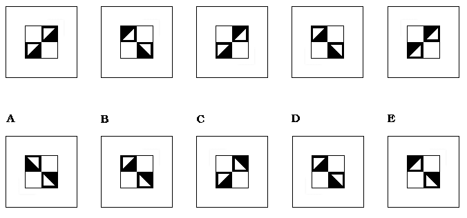

### Opciones disponibles

- **A.** A
- **B.** B
- **C.** C
- **D.** D
- **E.** E

---

### Respuesta y explicacion

La respuesta correcta es la **B**: B

ln even-numbered steps (including the correct answer), the entire diagram is mirrored in the y-axis (i.e., horizontally).

Then the half-shaded square on the left rotates 90 degrees clockwise.

n odd-numbered steps, the entire diagram is mirrored in the x-axis (i.e. vertically), then the half-shaded square on the left rotates 90 degrees anticlockwise.

## Pregunta 8

Fuente: https://www.epsoprep.com/practice/attempt/en/UXVlc3Rpb25Qb29sQXR0ZW1wdDpXUk1ZU0ZMMXQwMnpJZ2plMHIwTnVn/review?q=8

### Enunciado

From the options available, please choose which diagram would come next in the series.

### Imagen

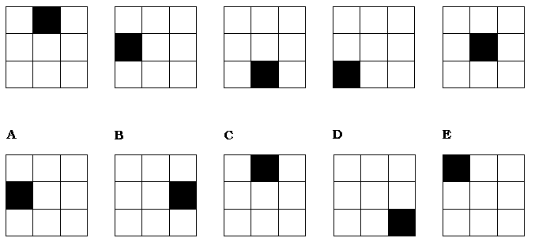

### Opciones disponibles

- **A.** A
- **B.** B
- **C.** C
- **D.** D
- **E.** E

---

### Respuesta y explicacion

La respuesta correcta es la **E**: E

The 3x3 grid represents the numbers 1-9: 1-3 on the top row, 4-6 on the middle row, etc.

The position of the black square thus represents a number.

Each time, the black square advances by the number of squares represented by its previous position (looping back from the bottom right (9) to the top left (1) as required).

## Pregunta 9

Fuente: https://www.epsoprep.com/practice/attempt/en/UXVlc3Rpb25Qb29sQXR0ZW1wdDpXUk1ZU0ZMMXQwMnpJZ2plMHIwTnVn/review?q=9

### Enunciado

From the options available, please choose which diagram would come next in the series.

### Imagen

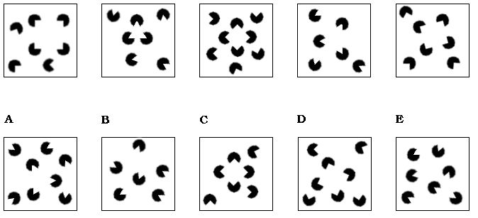

### Opciones disponibles

- **A.** A
- **B.** B
- **C.** C
- **D.** D
- **E.** E

---

### Respuesta y explicacion

La respuesta correcta es la **A**: A

Each diagram shows a number of circles with a segment removed.

There is no pattern in the numbers or orientations of these items, except as follows: in each diagram, the arrangement of some of the circles suggests that they have been partially overlapped behind a large illusionary white shape.

In odd-numbered diagrams, this illusionary shape is a square (in various arbitrary rotations). In even-numbered diagrams, including the correct answer, it is a triangle.

## Pregunta 10

Fuente: https://www.epsoprep.com/practice/attempt/en/UXVlc3Rpb25Qb29sQXR0ZW1wdDpXUk1ZU0ZMMXQwMnpJZ2plMHIwTnVn/review?q=10

### Enunciado

From the options available, please choose which diagram would come next in the series.

### Imagen

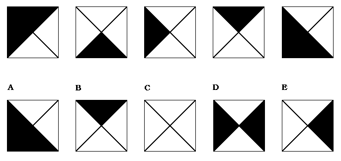

### Opciones disponibles

- **A.** A
- **B.** B
- **C.** C
- **D.** D
- **E.** E

---

### Respuesta y explicacion

La respuesta correcta es la **C**: C

The four quadrants each follow completely independent repeating patterns.

The top quadrant follows a three-diagram pattern: black, white, white.

The bottom quadrant follows a different three-diagram pattern: white, black, white.

The left quadrant simply alternates between black and white, while the right quadrant remains white throughout the sequence.

In the correct answer, all four quadrants are in a white phase.

## Pregunta 11

Fuente: https://www.epsoprep.com/practice/attempt/en/UXVlc3Rpb25Qb29sQXR0ZW1wdDotckZ4TXZGbUdVQ3VVZ2plMHIwTnVn/review?q=1

### Enunciado

From the options available, please choose which diagram would come next in the series.

### Imagen

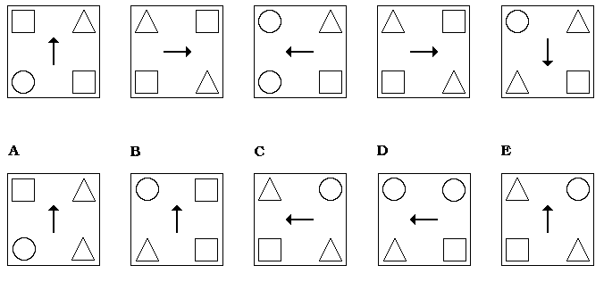

### Opciones disponibles

- **A.** A
- **B.** B
- **C.** C
- **D.** D
- **E.** E

---

### Respuesta y explicacion

La respuesta correcta es la **E**: E

The arrow rotates, always clockwise, in a three-diagram pattern: 90 degrees, 180 degrees, 180 degrees.

Shapes passed by the arrowhead during its rotation change according to these rules: circles change to triangles, triangles to squares, squares to circles.

All other shapes in the diagram change in the opposite direction: squares to triangles, triangles to circles, circles to squares.

## Pregunta 12

Fuente: https://www.epsoprep.com/practice/attempt/en/UXVlc3Rpb25Qb29sQXR0ZW1wdDotckZ4TXZGbUdVQ3VVZ2plMHIwTnVn/review?q=2

### Enunciado

From the options available, please choose which diagram would come next in the series.

### Imagen

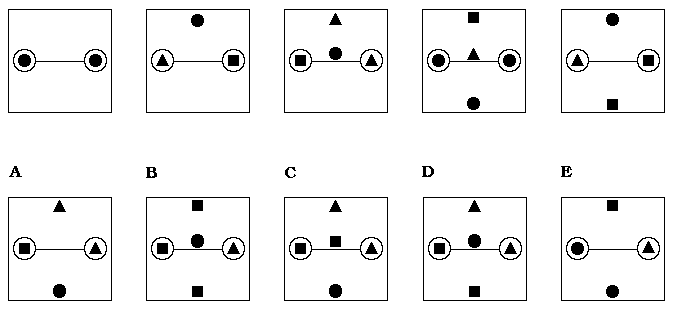

### Opciones disponibles

- **A.** A
- **B.** B
- **C.** C
- **D.** D
- **E.** E

---

### Respuesta y explicacion

La respuesta correcta es la **D**: D

The icon in the left ring cycles through this sequence: circle, triangle, square; the right ring cycles through this sequence: circle, square, triangle.

In each diagram, an item appears at the top which matches the icon from the left ring in the previous diagram.

After their initial appearance at the top, ‘gravity’ acts on all items, such that they fall towards the bottom of the diagram.

If an item matches the current icon in the right ring, it falls to the bottom; otherwise, it stops on the line between the rings.

Whenever one item falls on top of (or through) another, the lower item is removed.

## Pregunta 13

Fuente: https://www.epsoprep.com/practice/attempt/en/UXVlc3Rpb25Qb29sQXR0ZW1wdDotckZ4TXZGbUdVQ3VVZ2plMHIwTnVn/review?q=3

### Enunciado

From the options available, please choose which diagram would come next in the series.

### Imagen

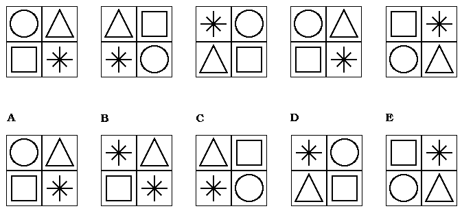

### Opciones disponibles

- **A.** A
- **B.** B
- **C.** C
- **D.** D
- **E.** E

---

### Respuesta y explicacion

La respuesta correcta es la **D**: D

There is a fixed sequence of four shapes: circle -> triangle -> square-> star (then back-> circle).

ln even-numbered diagrams (including the correct answer), the shape in each position will be the shape from that position in the previous diagram, plus one (e.g., if the previous diagram had a triangle in that location, this diagram will have a square meaning it follows the sequence).

ln odd-numbered diagrams, shapes will be the previous diagram’s shape, plus two (e.g., a triangle becomes a star, meaning it skips one step in the sequence ).

## Pregunta 14

Fuente: https://www.epsoprep.com/practice/attempt/en/UXVlc3Rpb25Qb29sQXR0ZW1wdDotckZ4TXZGbUdVQ3VVZ2plMHIwTnVn/review?q=4

### Enunciado

From the options available, please choose which diagram would come next in the series.

### Imagen

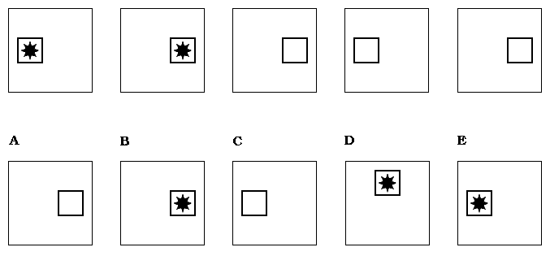

### Opciones disponibles

- **A.** A
- **B.** B
- **C.** C
- **D.** D
- **E.** E

---

### Respuesta y explicacion

La respuesta correcta es la **B**: B

There are two positions: left and right.

The star simply alternates between the two positions.

The square follows a repeating three-diagram pattern: right, right, left.

The square acts as a window: the star is visible only when it is in the same position as the square.

## Pregunta 15

Fuente: https://www.epsoprep.com/practice/attempt/en/UXVlc3Rpb25Qb29sQXR0ZW1wdDotckZ4TXZGbUdVQ3VVZ2plMHIwTnVn/review?q=5

### Enunciado

From the options available, please choose which diagram would come next in the series.

### Imagen

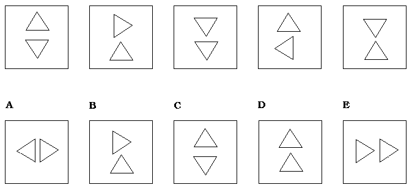

### Opciones disponibles

- **A.** A
- **B.** B
- **C.** C
- **D.** D
- **E.** E

---

### Respuesta y explicacion

La respuesta correcta es la **B**: B

The two triangles follow different rotational patterns: the top triangle rotates 90 degrees clockwise each time, while the bottom triangle rotates 180 degrees.

In addition, on every 3rd diagram the two triangles swap positions, but they retain theft- own rotational rule.

Note that the swap takes place in the third diagram but the orientation of the triangles happens to be in line with what they would have had even if they didn't swap positions.

Therefore, in the next diagram. the triangles will have switched again, with the 180 degree-rotating triangle on the bottom, as in B.

## Pregunta 16

Fuente: https://www.epsoprep.com/practice/attempt/en/UXVlc3Rpb25Qb29sQXR0ZW1wdDotckZ4TXZGbUdVQ3VVZ2plMHIwTnVn/review?q=6

### Enunciado

From the options available, please choose which diagram would come next in the series.

### Imagen

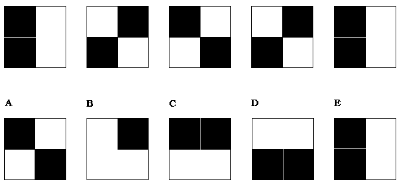

### Opciones disponibles

- **A.** A
- **B.** B
- **C.** C
- **D.** D
- **E.** E

---

### Respuesta y explicacion

La respuesta correcta es la **C**: C

There are two black blocks, moving independently within a 2x2 grid.

One of them (in the top left in diagram one) moves in a four-diagram pattern: right down, up, left.

The other (bottom left in diagram one) moves in a three diagram pattern: stationary, up, down.

## Pregunta 17

Fuente: https://www.epsoprep.com/practice/attempt/en/UXVlc3Rpb25Qb29sQXR0ZW1wdDotckZ4TXZGbUdVQ3VVZ2plMHIwTnVn/review?q=7

### Enunciado

From the options available, please choose which diagram would come next in the series.

### Imagen

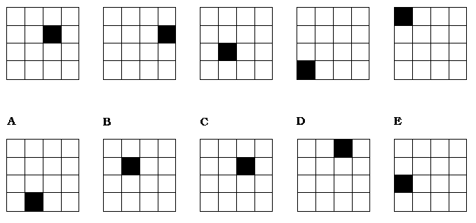

### Opciones disponibles

- **A.** A
- **B.** B
- **C.** C
- **D.** D
- **E.** E

---

### Respuesta y explicacion

La respuesta correcta es la **B**: B

The 16 squares within each diagram represent the numbers 1-16 (1-4 for the top row 5-8 for the row below etc.).

The position of the black square advances by incrementally increasing numbers: first by 1 position, then by 2, then 3, etc.

After the 16th position (i.e. the bottom right of the diagram) the square loops back to the 1st (top left).

## Pregunta 18

Fuente: https://www.epsoprep.com/practice/attempt/en/UXVlc3Rpb25Qb29sQXR0ZW1wdDotckZ4TXZGbUdVQ3VVZ2plMHIwTnVn/review?q=8

### Enunciado

From the options available, please choose which diagram would come next in the series.

### Imagen

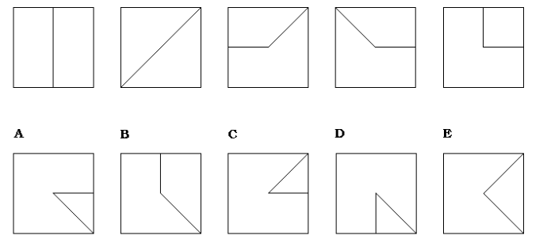

### Opciones disponibles

- **A.** A
- **B.** B
- **C.** C
- **D.** D
- **E.** E

---

### Respuesta y explicacion

La respuesta correcta es la **E**: E

There are two lines, each radiating from the centre of the diagram: it does not become clear that they are separate until diagram three.

One of these lines (the one radiating from the centre to the bottom of the diagram) rotates around the centre by 45 degrees clockwise each time.

The other line alternates between rotating 45 degrees clockwise, and remaining stationary.

## Pregunta 19

Fuente: https://www.epsoprep.com/practice/attempt/en/UXVlc3Rpb25Qb29sQXR0ZW1wdDotckZ4TXZGbUdVQ3VVZ2plMHIwTnVn/review?q=9

### Enunciado

From the options available, please choose which diagram would come next in the series.

### Imagen

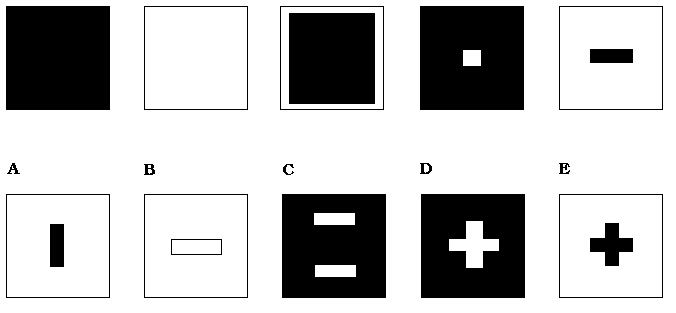

### Opciones disponibles

- **A.** A
- **B.** B
- **C.** C
- **D.** D
- **E.** E

---

### Respuesta y explicacion

La respuesta correcta es la **D**: D

The patterns are given in paired images; in each pair, the second diagram is in some way the negative of the first.

In the first pair, this is shown with colour, black and white.

In the second pair it is by color and by shape. In the third frame a large black square is presented while the fourh frame represents the opposite or large, a small square.

ln the third pair, the second diagram (the correct answer) is a conceptual negative of the first - a plus sign as opposed to a minus sign; as colours are also always inverted, the cross should be white on a black background.

## Pregunta 20

Fuente: https://www.epsoprep.com/practice/attempt/en/UXVlc3Rpb25Qb29sQXR0ZW1wdDotckZ4TXZGbUdVQ3VVZ2plMHIwTnVn/review?q=10

### Enunciado

From the options available, please choose which diagram would come next in the series.

### Imagen

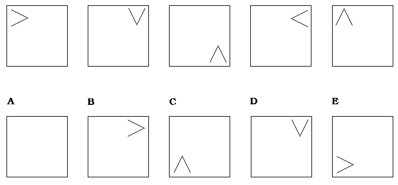

### Opciones disponibles

- **A.** A
- **B.** B
- **C.** C
- **D.** D
- **E.** E

---

### Respuesta y explicacion

La respuesta correcta es la **A**: A

The arrow always moves in its indicated direction, then rotates according to a 3-diagram sequence: 90 degrees clockwise, then 180 degrees, then 90degrees anticlockwise.

ln the fifth diagram, the arrow points upwards, so its movement will cause it to leave the diagram.

From the observed pattern, there is no way to deduce whether the diagram is considered curved (i.e. whether the top loops to the bottom, etc.).

However, we know the arrow’s expected rotational behavior at this point in the sequence (180 degrees), and none of the possible answers account for this.

Thus the diagram is not looped; the arrow is gone.

## Pregunta 21

Fuente: https://www.epsoprep.com/practice/attempt/en/UXVlc3Rpb25Qb29sQXR0ZW1wdDpUT1h6QVpZZWtrWUhaZ2plMHIwTnVn/review?q=1

### Enunciado

From the options available, please choose which diagram would come next in the series.

### Imagen

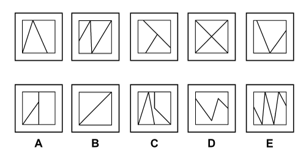

### Opciones disponibles

- **A.** A
- **B.** B
- **C.** C
- **D.** D
- **E.** E

---

### Respuesta y explicacion

La respuesta correcta es la **C**: C

The odd frames like 1, 3 and 5 are always divided in three parts while the even frames like 2 and 4 are always divided in four parts.

The correct answer (frame 6) must therefore have four parts which only option C does.

## Pregunta 22

Fuente: https://www.epsoprep.com/practice/attempt/en/UXVlc3Rpb25Qb29sQXR0ZW1wdDpUT1h6QVpZZWtrWUhaZ2plMHIwTnVn/review?q=2

### Enunciado

From the options available, please choose which diagram would come next in the series.

### Imagen

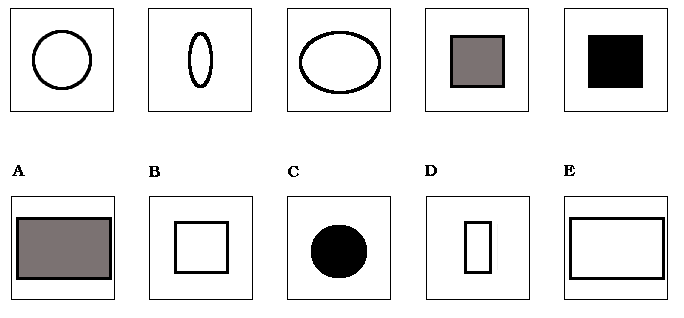

### Opciones disponibles

- **A.** A
- **B.** B
- **C.** C
- **D.** D
- **E.** E

---

### Respuesta y explicacion

La respuesta correcta es la **B**: B

The shape in the first diagram undergoes a transformation in the second diagram (i.e., reducing its width), which is then reversed in the third (i.e., increasing its width).

Then a new sequence begins, with a lightly shaded square.

As with the first sequence, the shape undergoes a transformation (darkening its shading) in the next diagram.

As before, the third diagram (the correct answer) must depict the reversal of this transformation.

## Pregunta 23

Fuente: https://www.epsoprep.com/practice/attempt/en/UXVlc3Rpb25Qb29sQXR0ZW1wdDpUT1h6QVpZZWtrWUhaZ2plMHIwTnVn/review?q=3

### Enunciado

From the options available, please choose which diagram would come next in the series.

### Imagen

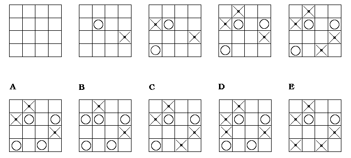

### Opciones disponibles

- **A.** A
- **B.** B
- **C.** C
- **D.** D
- **E.** E

---

### Respuesta y explicacion

La respuesta correcta es la **C**: C

The Xs and Os are placed on alternate 'turns', Os going first, and each following a different pattern: each new 0 is placed 2 squares up and 1 square left from the position of the last-placed 0, while each X is placed 1 square right and 3 down from position of the last-placed X.

In the next diagram, the new 0 and X will replace the existing 0 and X in the 2nd and 4th columns, respectively; the configuration will, therefore, be unchanged, as in C, and will remain unchanged, continuing to cycle.

## Pregunta 24

Fuente: https://www.epsoprep.com/practice/attempt/en/UXVlc3Rpb25Qb29sQXR0ZW1wdDpUT1h6QVpZZWtrWUhaZ2plMHIwTnVn/review?q=4

### Enunciado

From the options available, please choose which diagram would come next in the series.

### Imagen

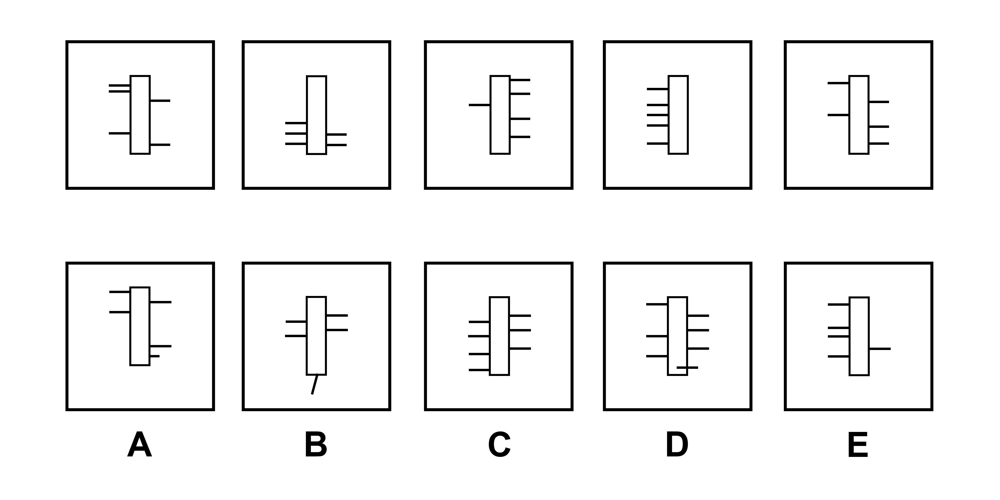

### Opciones disponibles

- **A.** A
- **B.** B
- **C.** C
- **D.** D
- **E.** E

---

### Respuesta y explicacion

La respuesta correcta es la **E**: E

There is only one rule and that is that the toal number of lines on both sides must be equal to five (5). The lines need to be positioned horizontally of the same lenght which is why option A cannot be correct.

## Pregunta 25

Fuente: https://www.epsoprep.com/practice/attempt/en/UXVlc3Rpb25Qb29sQXR0ZW1wdDpUT1h6QVpZZWtrWUhaZ2plMHIwTnVn/review?q=5

### Enunciado

From the options available, please choose which diagram would come next in the series.

### Imagen

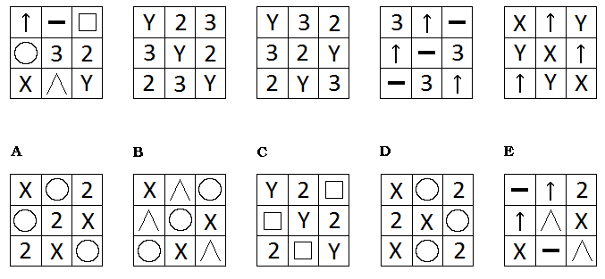

### Opciones disponibles

- **A.** A
- **B.** B
- **C.** C
- **D.** D
- **E.** E

---

### Respuesta y explicacion

La respuesta correcta es la **A**: A

The first diagram acts as an index. In every other diagram, the symbols which will appear are 1) the symbol that appeared in the bottom right corner of the previous diagram. 2) the symbol above that item in the index and 3) the symbol to the left of 2) in the index.

Three of each of these three symbols will then appear in the diagram.

There is no pattern to their layout, except that no two copies of the same symbol may appear in any single row or column.

## Pregunta 26

Fuente: https://www.epsoprep.com/practice/attempt/en/UXVlc3Rpb25Qb29sQXR0ZW1wdDpUT1h6QVpZZWtrWUhaZ2plMHIwTnVn/review?q=6

### Enunciado

From the options available, please choose which diagram would come next in the series.

### Imagen

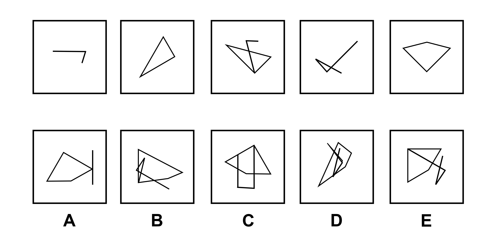

### Opciones disponibles

- **A.** A
- **B.** B
- **C.** C
- **D.** D
- **E.** E

---

### Respuesta y explicacion

La respuesta correcta es la **E**: E

This frames come in sets of three (3) boxes. The 3rd box is the resulting combination of the shapes found in the 1st and 2nd boxes. Thus, this alternative shows the combination of the shapes found in 4th and 5th boxes.

## Pregunta 27

Fuente: https://www.epsoprep.com/practice/attempt/en/UXVlc3Rpb25Qb29sQXR0ZW1wdDpUT1h6QVpZZWtrWUhaZ2plMHIwTnVn/review?q=7

### Enunciado

From the options available, please choose which diagram would come next in the series.

### Imagen

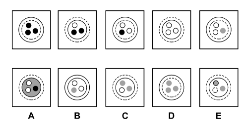

### Opciones disponibles

- **A.** A
- **B.** B
- **C.** C
- **D.** D
- **E.** E

---

### Respuesta y explicacion

La respuesta correcta es la **C**: C

There are two circles in each frame, one with a solid line and the other which has a dashed line. They switch positions each frame.

The circles inside change shading one circle at the time until all the three circles have the same shading.

In the fifth frame we can see that the one circle has turned grey which means that we should have another grey circle in the next frame (totalling 2 grey circles). Additionally as per the first rule we should also see the outer circle as dashed.

## Pregunta 28

Fuente: https://www.epsoprep.com/practice/attempt/en/UXVlc3Rpb25Qb29sQXR0ZW1wdDpUT1h6QVpZZWtrWUhaZ2plMHIwTnVn/review?q=8

### Enunciado

From the options available, please choose which diagram would come next in the series.

### Imagen

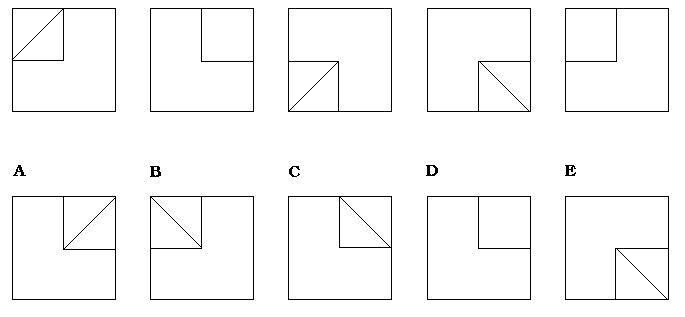

### Opciones disponibles

- **A.** A
- **B.** B
- **C.** C
- **D.** D
- **E.** E

---

### Respuesta y explicacion

La respuesta correcta es la **C**: C

The square and line follow two different logical patterns. The square is reflected in the Y-axis, then in both the Y and X axes, with this pattern continuing to repeat; the next diagram should, therefore, show the square reflected in the Y-axis, as in A, C, and D.

The line follows a simple pattern of disappearing, reappearing in the same orientation, changing orientation, disappearing - we would, therefore, expect the next diagram to show the line in the same orientation as diagram 4.

This is found in B, C, and E. C is, therefore, the correct answer.

## Pregunta 29

Fuente: https://www.epsoprep.com/practice/attempt/en/UXVlc3Rpb25Qb29sQXR0ZW1wdDpUT1h6QVpZZWtrWUhaZ2plMHIwTnVn/review?q=9

### Enunciado

From the options available, please choose which diagram would come next in the series.

### Imagen

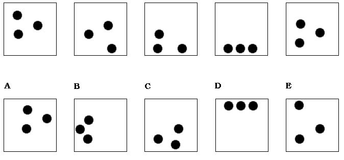

### Opciones disponibles

- **A.** A
- **B.** B
- **C.** C
- **D.** D
- **E.** E

---

### Respuesta y explicacion

La respuesta correcta es la **C**: C

Each time, the circle which was closest to the top of the previous diagram falls between the other two circles, coming to rest at the bottom of the diagram.

Once all the circles have reached the bottom (in diagram four), a new sequence begins (diagram five).

As before, the top circle will move to the bottom in the next diagram, while the others do not move; the configuration in C.

## Pregunta 30

Fuente: https://www.epsoprep.com/practice/attempt/en/UXVlc3Rpb25Qb29sQXR0ZW1wdDpUT1h6QVpZZWtrWUhaZ2plMHIwTnVn/review?q=10

### Enunciado

From the options available, please choose which diagram would come next in the series.

### Imagen

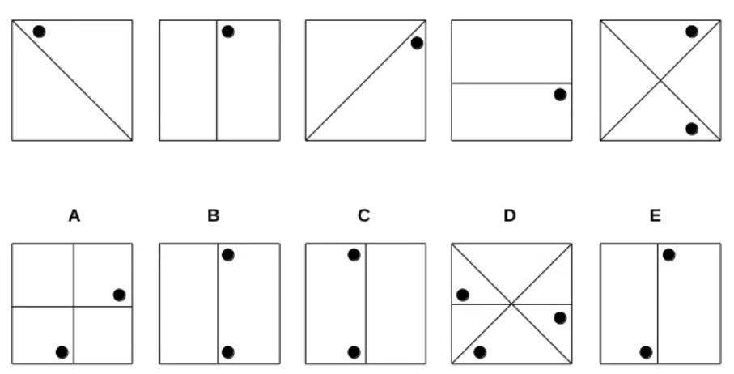

### Opciones disponibles

- **A.** A
- **B.** B
- **C.** C
- **D.** D
- **E.** E

---

### Respuesta y explicacion

La respuesta correcta es la **C**: C

The black line in the first four diagrams rotates 45 degrees around the midpoint each time, with the dot indicating the direction of rotation (i.e. clockwise).

In the final diagram, a new black line appears, with the dot on the opposite side.

Thus the first line will continue to rotate 45 degrees clockwise (making it vertical, with the dot at its bottom left); the position of the new dot indicates that the new line will rotate 45 degrees anticlockwise, also resulting in a vertical line, with the dot at its top left.

## Pregunta 31

Fuente: https://www.epsoprep.com/practice/attempt/en/UXVlc3Rpb25Qb29sQXR0ZW1wdDpUT1h6QVpZZWtrWUhaZ2plMHIwTnVn/review?q=11

### Enunciado

From the options available, please choose which diagram would come next in the series.

### Imagen

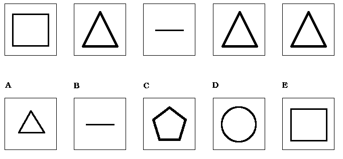

### Opciones disponibles

- **A.** A
- **B.** B
- **C.** C
- **D.** D
- **E.** E

---

### Respuesta y explicacion

La respuesta correcta es la **D**: D

The first three diagrams represent a sequence that is replicated conceptually in the second set of three diagrams (the third being the correct answer).

In the first three, the number of sides of the first shape (square) is subtracted from the number of sides of the second shape (triangle) to give a 'one-sided' figure (the line).

Thus the number of sides of the triangle (diagram four) should be subtracted from the number of sides of the triangle (diagram five) giving us: 3 - 3 = 0, so a circle is the correct answer since it doesn't have any sides.

## Pregunta 32

Fuente: https://www.epsoprep.com/practice/attempt/en/UXVlc3Rpb25Qb29sQXR0ZW1wdDpUT1h6QVpZZWtrWUhaZ2plMHIwTnVn/review?q=12

### Enunciado

From the options available, please choose which diagram would come next in the series.

### Imagen

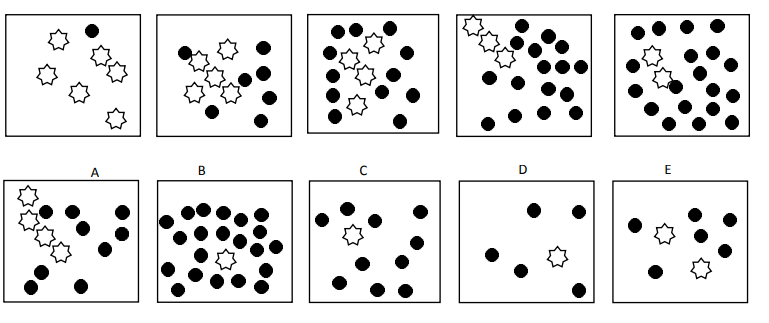

### Opciones disponibles

- **A.** A
- **B.** B
- **C.** C
- **D.** D
- **E.** E

---

### Respuesta y explicacion

La respuesta correcta es la **B**: B

The frames include two types of objects, stars, and dots. The number of stars decreases by one each frame.

The number of dots increases with the number of stars from the former frame.

For example, frame 2 increases with 6 dots because frame 1 includes 6 stars.

## Pregunta 33

Fuente: https://www.epsoprep.com/practice/attempt/en/UXVlc3Rpb25Qb29sQXR0ZW1wdDpUT1h6QVpZZWtrWUhaZ2plMHIwTnVn/review?q=13

### Enunciado

From the options available, please choose which diagram would come next in the series.

### Imagen

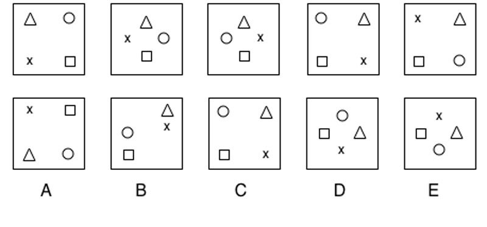

### Opciones disponibles

- **A.** A
- **B.** B
- **C.** C
- **D.** D
- **E.** E

---

### Respuesta y explicacion

La respuesta correcta es la **E**: E

Between odd and even frames, all figures move clockwise 1/8 circle.

Between even and odd frames, the cross and circle switch places.

## Pregunta 34

Fuente: https://www.epsoprep.com/practice/attempt/en/UXVlc3Rpb25Qb29sQXR0ZW1wdDpUT1h6QVpZZWtrWUhaZ2plMHIwTnVn/review?q=14

### Enunciado

From the options available, please choose which diagram would come next in the series.

### Imagen

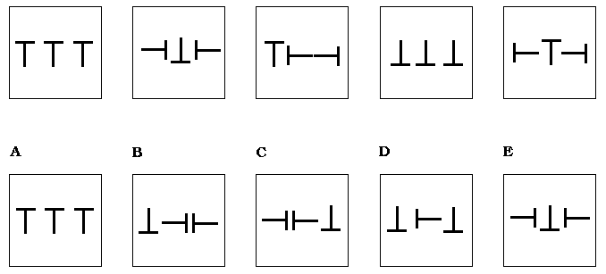

### Opciones disponibles

- **A.** A
- **B.** B
- **C.** C
- **D.** D
- **E.** E

---

### Respuesta y explicacion

La respuesta correcta es la **B**: B

In this puzzle, the T shapes rotate according to different rules. The 1st T shape rotates 90 degrees clockwise, the 2nd 180 degrees, and the 3rd 90 degrees anticlockwise.

The rotational rule applying to the shapes shuffles forward one place each time: the rule originally affecting T1 is applied instead to T2, T2's original rule transfers to T3, and T3's to T1.

Once every permutation has been applied (i.e. three diagrams), a new sequence begins (diagram four), following the same pattern.

## Pregunta 35

Fuente: https://www.epsoprep.com/practice/attempt/en/UXVlc3Rpb25Qb29sQXR0ZW1wdDpUT1h6QVpZZWtrWUhaZ2plMHIwTnVn/review?q=15

### Enunciado

From the options available, please choose which diagram would come next in the series.

### Imagen

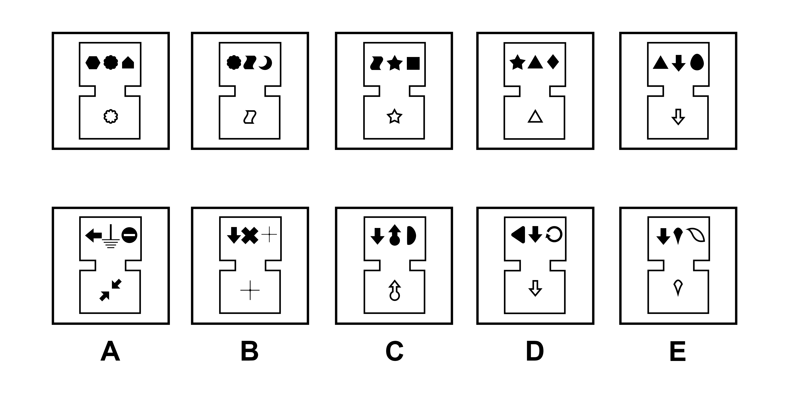

### Opciones disponibles

- **A.** A
- **B.** B
- **C.** C
- **D.** D
- **E.** E

---

### Respuesta y explicacion

La respuesta correcta es la **C**: C

Each box contain 3 black objects on the upper part of the closed figure. The shape in the center is duplicated and placed in the lower part of the figure and is shaded in white. The next box will use the middle black shape and position it as the first shape on the upper part of the figure. This continues and the next sequence will use a downward arrow as its first shape on the upper part of the figure. Alternative E looks like the correct answer but the leaf is coloured white. Alternative C is the correct answer since all three shapes are coloured in black and it meets the other rules.

## Pregunta 36

Fuente: https://www.epsoprep.com/practice/attempt/en/UXVlc3Rpb25Qb29sQXR0ZW1wdDpUT1h6QVpZZWtrWUhaZ2plMHIwTnVn/review?q=16

### Enunciado

From the options available, please choose which diagram would come next in the series.

### Imagen

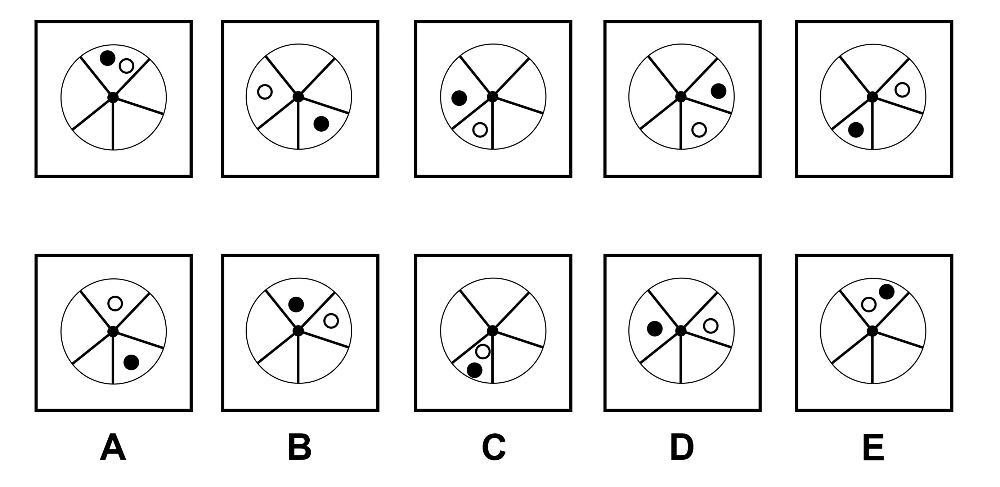

### Opciones disponibles

- **A.** A
- **B.** B
- **C.** C
- **D.** D
- **E.** E

---

### Respuesta y explicacion

La respuesta correcta es la **E**: E

Two circles are found inside a five (5) sliced pie. The black circle moves two slices at a time in a clockwise direction. The white circle transfers one slice at a time in a counter-clockwise direction.

## Pregunta 37

Fuente: https://www.epsoprep.com/practice/attempt/en/UXVlc3Rpb25Qb29sQXR0ZW1wdDpUT1h6QVpZZWtrWUhaZ2plMHIwTnVn/review?q=17

### Enunciado

From the options available, please choose which diagram would come next in the series.

### Imagen

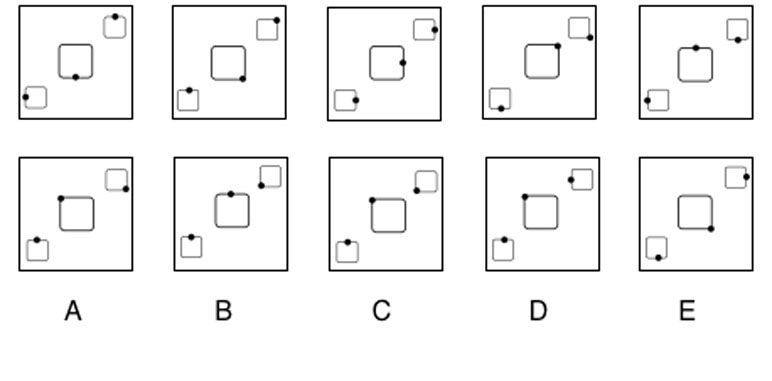

### Opciones disponibles

- **A.** A
- **B.** B
- **C.** C
- **D.** D
- **E.** E

---

### Respuesta y explicacion

La respuesta correcta es la **C**: C

The dot on the right top square moves clockwise at 1/8 circle per frame.

The dot on the center square moves counterclockwise at 1/8 circle per frame.

The dot on the bottom left square moves clockwise at ¼ circle per frame.

## Pregunta 38

Fuente: https://www.epsoprep.com/practice/attempt/en/UXVlc3Rpb25Qb29sQXR0ZW1wdDpUT1h6QVpZZWtrWUhaZ2plMHIwTnVn/review?q=18

### Enunciado

From the options available, please choose which diagram would come next in the series

### Imagen

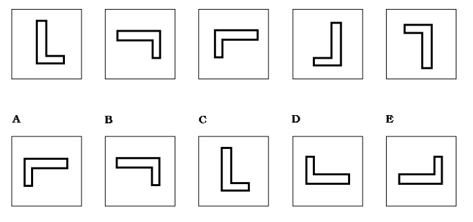

### Opciones disponibles

- **A.** A
- **B.** B
- **C.** C
- **D.** D
- **E.** E

---

### Respuesta y explicacion

La respuesta correcta es la **D**: D

The L-shape alternately rotates 90 degrees or 180 degrees anti-clockwise.

When the L is vertical (i.e. with the shorter line at the top or bottom), in the next diagram it is mirrored in the Y-axis (i.e. horizontally).

When it is horizontal (with the shorter line at the left or right), in the next diagram it is mirrored in the X-axis (i.e. vertically).

## Pregunta 39

Fuente: https://www.epsoprep.com/practice/attempt/en/UXVlc3Rpb25Qb29sQXR0ZW1wdDpUT1h6QVpZZWtrWUhaZ2plMHIwTnVn/review?q=19

### Enunciado

From the options available, please choose which diagram would come next in the series.

### Imagen

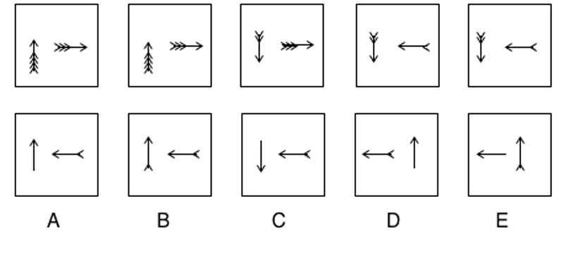

### Opciones disponibles

- **A.** A
- **B.** B
- **C.** C
- **D.** D
- **E.** E

---

### Respuesta y explicacion

La respuesta correcta es la **A**: A

The rule:

The direction of the arrows always repeats 3 times and then changes to the opposite direction and loses two feathers (V-shapes).

In the first frame, the arrow that points upwards has already started on frame two which is why it only points up for two frames.

The result:

As the left arrow in the frames 3,4 and 5 is pointing down it will change direction and point up because it has remained in that position for three frames. It will also lose 2 "feathers".

The right arrow has only been in its position for two frames (4 and 5) and will keep pointing to the left.

The correct answer is therefore option A

## Pregunta 40

Fuente: https://www.epsoprep.com/practice/attempt/en/UXVlc3Rpb25Qb29sQXR0ZW1wdDpUT1h6QVpZZWtrWUhaZ2plMHIwTnVn/review?q=20

### Enunciado

From the options available, please choose which diagram would come next in the series.

### Imagen

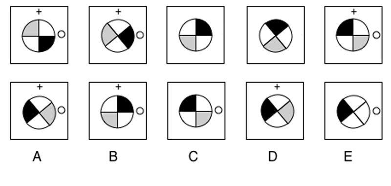

### Opciones disponibles

- **A.** A
- **B.** B
- **C.** C
- **D.** D
- **E.** E

---

### Respuesta y explicacion

La respuesta correcta es la **A**: A

The large circle and its contents turn counter-clockwise at 1/8 circle per frame.

The top cross alternates between being visible for two frames and being invisible for two frames.

The small circle alternates between being visible for two frames and being invisible for two frames.

## Pregunta 41

Fuente: https://www.epsoprep.com/practice/attempt/en/UXVlc3Rpb25Qb29sQXR0ZW1wdDpUT1h6QVpZZWtrWUhaZ2plMHIwTnVn/review?q=21

### Enunciado

From the options available, please choose which diagram would come next in the series.

### Imagen

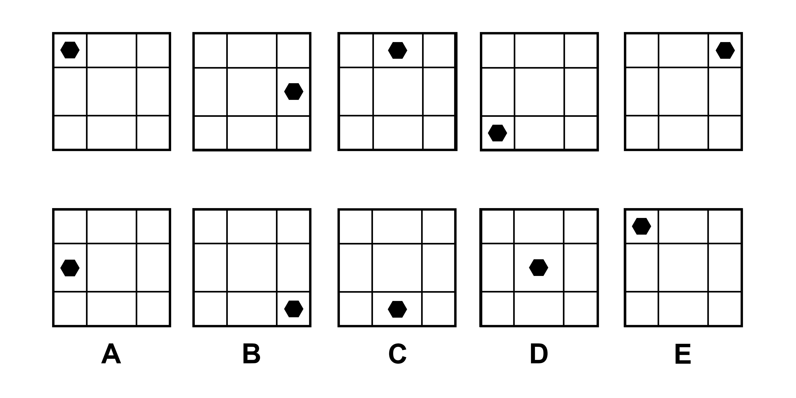

### Opciones disponibles

- **A.** A
- **B.** B
- **C.** C
- **D.** D
- **E.** E

---

### Respuesta y explicacion

La respuesta correcta es la **C**: C

The black hexagon moves each time 5 tiles in a 3x3 cube. The movement is from left to right, and downward. Thus, the next sequence must place the black hexagon on the last row at the center tile.

## Pregunta 42

Fuente: https://www.epsoprep.com/practice/attempt/en/UXVlc3Rpb25Qb29sQXR0ZW1wdDpUT1h6QVpZZWtrWUhaZ2plMHIwTnVn/review?q=22

### Enunciado

From the options available, please choose which diagram would come next in the series.

### Imagen

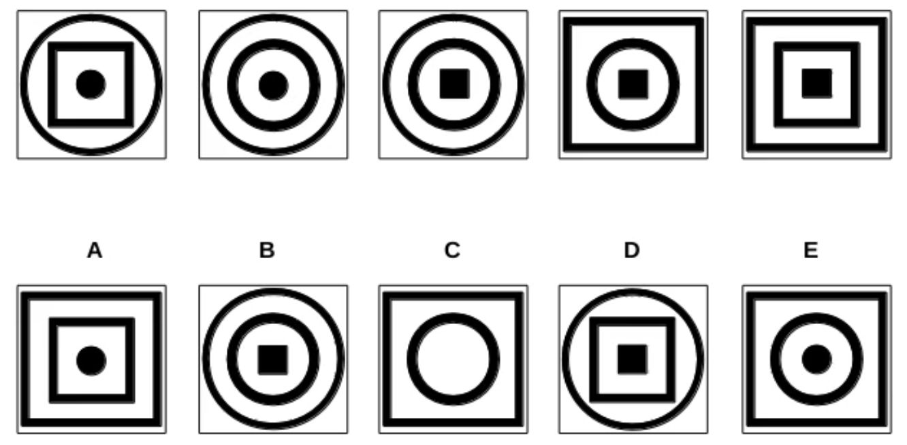

### Opciones disponibles

- **A.** A
- **B.** B
- **C.** C
- **D.** D
- **E.** E

---

### Respuesta y explicacion

La respuesta correcta es la **A**: A

The diagrams represent a repeating six-part sequence, in which the shape in the center determines the change to be made in the next diagram.

First, the outermost surrounding shape changes to match it, then the inner one; once both match the central shape, it changes to the other form (i.e. the central circle becomes a square, or vice versa).

In the fifth diagram, both surrounding shapes have changed to match the central square, so in the next diagram, the central shape will revert to a circle again.

## Pregunta 43

Fuente: https://www.epsoprep.com/practice/attempt/en/UXVlc3Rpb25Qb29sQXR0ZW1wdDpUT1h6QVpZZWtrWUhaZ2plMHIwTnVn/review?q=23

### Enunciado

From the options available, please choose which diagram would come next in the series.

### Imagen

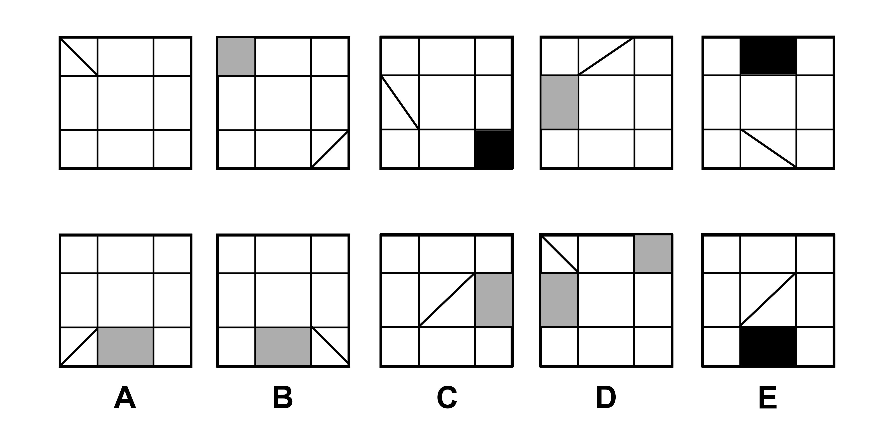

### Opciones disponibles

- **A.** A
- **B.** B
- **C.** C
- **D.** D
- **E.** E

---

### Respuesta y explicacion

La respuesta correcta es la **A**: A

This item shows an alternate use of \ and / on any of the tiles. Odd numbered frames (1,3,5) will include a \ (backslash) and even numbered frames will include a (/) forward slash.

A tile containing \ will be shaded with gray in the next frame, while the / will turn black. Hence, the next sequence must have a gray shade on the lower middle row, and must have a tile with /.

## Pregunta 44

Fuente: https://www.epsoprep.com/practice/attempt/en/UXVlc3Rpb25Qb29sQXR0ZW1wdDpUT1h6QVpZZWtrWUhaZ2plMHIwTnVn/review?q=24

### Enunciado

From the options available, please choose which diagram would come next in the series.

### Imagen

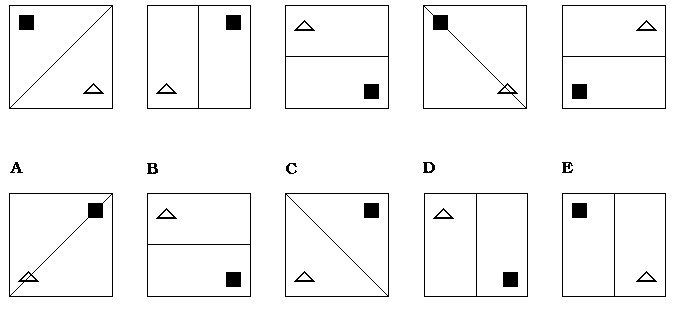

### Opciones disponibles

- **A.** A
- **B.** B
- **C.** C
- **D.** D
- **E.** E

---

### Respuesta y explicacion

La respuesta correcta es la **D**: D

There are two patterns, each beginning in the first diagram.

The line rotates 45 degrees anticlockwise, then 90 degrees anticlockwise, then 45 degrees clockwise; then this pattern begins again.

Meanwhile, the shapes (square and triangle, always diagonal from each other) move clockwise twice, then reset to their original positions, then move 90 degrees anti-clockwise twice, then reset again, and so on.

## Pregunta 45

Fuente: https://www.epsoprep.com/practice/attempt/en/UXVlc3Rpb25Qb29sQXR0ZW1wdDpUT1h6QVpZZWtrWUhaZ2plMHIwTnVn/review?q=25

### Enunciado

From the options available, please choose which diagram would come next in the series.

### Imagen

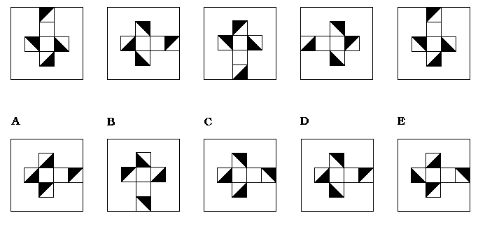

### Opciones disponibles

- **A.** A
- **B.** B
- **C.** C
- **D.** D
- **E.** E

---

### Respuesta y explicacion

La respuesta correcta es la **D**: D

The whole diagram rotates 90 degrees clockwise each time.

In addition, each of the small squares within the diagram also rotates by 90 degrees; first anticlockwise, then clockwise, then anticlockwise again, and so on.

For the next diagram, the small squares must, therefore, rotate 90 degrees anticlockwise, effectively canceling the clockwise rotation applied to the whole diagram.

## Pregunta 46

Fuente: https://www.epsoprep.com/practice/attempt/en/UXVlc3Rpb25Qb29sQXR0ZW1wdDpUT1h6QVpZZWtrWUhaZ2plMHIwTnVn/review?q=26

### Enunciado

From the options available, please choose which diagram would come next in the series.

### Imagen

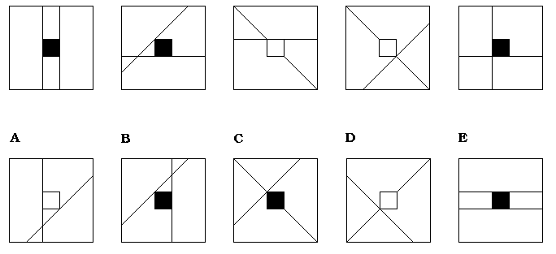

### Opciones disponibles

- **A.** A
- **B.** B
- **C.** C
- **D.** D
- **E.** E

---

### Respuesta y explicacion

La respuesta correcta es la **B**: B

There are two lines. One is attached to the top left corner of the square and rotates around this point by 45 degrees clockwise each time.

The other line is attached to the bottom right corner of the square and rotates around this point in an alternating pattern: 90 degrees, then 45 degrees clockwise, and so on.

The square is unshaded when one of the lines passes diagonally through it (but it still occludes the line), and shaded otherwise.

## Pregunta 47

Fuente: https://www.epsoprep.com/practice/attempt/en/UXVlc3Rpb25Qb29sQXR0ZW1wdDpUT1h6QVpZZWtrWUhaZ2plMHIwTnVn/review?q=27

### Enunciado

From the options available, please choose which diagram would come next in the series.

### Imagen

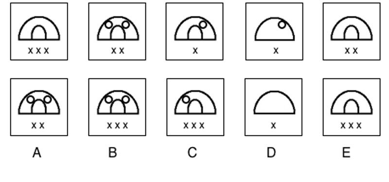

### Opciones disponibles

- **A.** A
- **B.** B
- **C.** C
- **D.** D
- **E.** E

---

### Respuesta y explicacion

La respuesta correcta es la **C**: C

The number of shapes inside the half-circle is equal to the number of crosses in the previous frame.

The number of crosses follows the pattern 3 – 2 – 1 – 1 – 2 – 3 – etc.

## Pregunta 48

Fuente: https://www.epsoprep.com/practice/attempt/en/UXVlc3Rpb25Qb29sQXR0ZW1wdDpUT1h6QVpZZWtrWUhaZ2plMHIwTnVn/review?q=28

### Enunciado

From the options available, please choose which diagram would come next in the series.

### Imagen

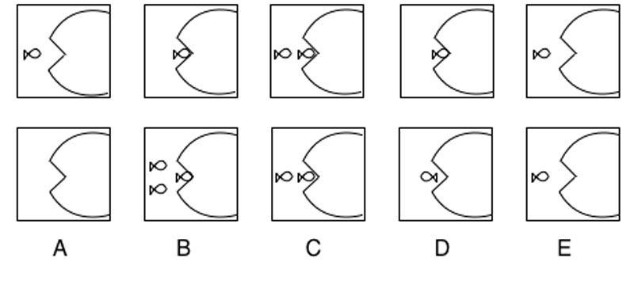

### Opciones disponibles

- **A.** A
- **B.** B
- **C.** C
- **D.** D
- **E.** E

---

### Respuesta y explicacion

La respuesta correcta es la **C**: C

If a small fish appears on the left, in the next frame it has moved to the right but is still visible.

In the frame after that, it is no longer visible.

## Pregunta 49

Fuente: https://www.epsoprep.com/practice/attempt/en/UXVlc3Rpb25Qb29sQXR0ZW1wdDpUT1h6QVpZZWtrWUhaZ2plMHIwTnVn/review?q=29

### Enunciado

From the options available, please choose which diagram would come next in the series.

### Imagen

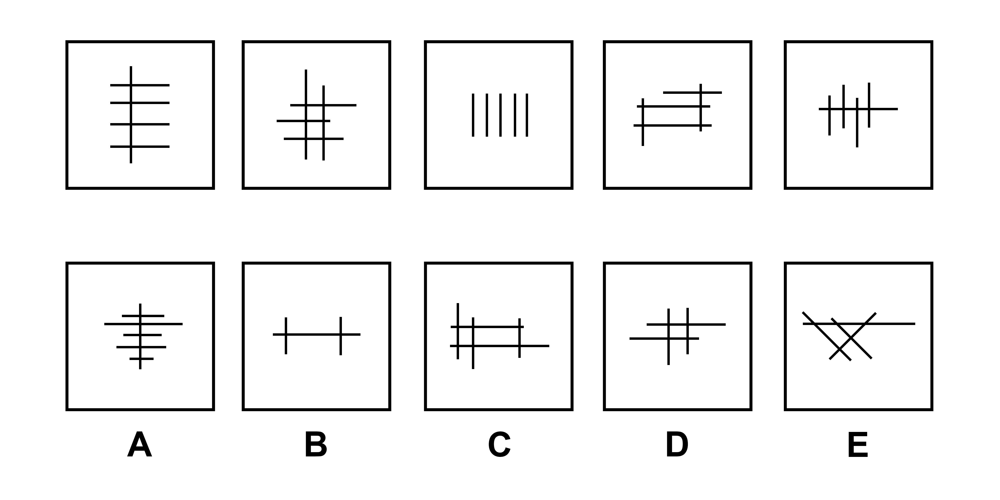

### Opciones disponibles

- **A.** A
- **B.** B
- **C.** C
- **D.** D
- **E.** E

---

### Respuesta y explicacion

La respuesta correcta es la **C**: C

There is only one rule to this question. All boxes contain a total of five (5) lines in any orientation. The orientation and the lengths of the lines is irrelevant. Hence, the next sequence must also have five (5) lines on it. Option C is therefore the correct options as it is the only one containing 5 lines.

## Pregunta 50

Fuente: https://www.epsoprep.com/practice/attempt/en/UXVlc3Rpb25Qb29sQXR0ZW1wdDpUT1h6QVpZZWtrWUhaZ2plMHIwTnVn/review?q=30

### Enunciado

From the options available, please choose which diagram would come next in the series.

### Imagen

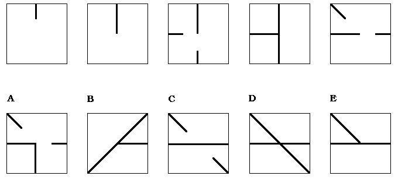

### Opciones disponibles

- **A.** A
- **B.** B
- **C.** C
- **D.** D
- **E.** E

---

### Respuesta y explicacion

La respuesta correcta es la **E**: E

This puzzle involves four-diagram patterns:

1. A short line appears (as in diagram one),

2. It doubles in length.

3. The original short line reappears on the opposite side. and

4. These lines meet, fully bisecting the diagram. Once this pattern is complete. the line disappears and a new sequence begins (the diagonal line in diagram five).

In addition, lines constructed as above are duplicated two diagrams later. rotated 90 degrees anticlockwise.

## Pregunta 51

Fuente: https://www.epsoprep.com/practice/attempt/en/UXVlc3Rpb25Qb29sQXR0ZW1wdDpUT1h6QVpZZWtrWUhaZ2plMHIwTnVn/review?q=31

### Enunciado

From the options available, please choose which diagram would come next in the series.

### Imagen

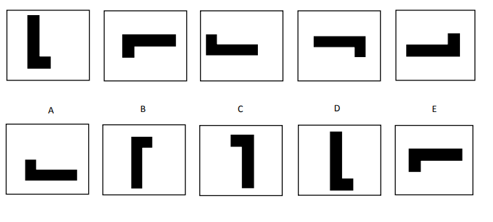

### Opciones disponibles

- **A.** A
- **B.** B
- **C.** C
- **D.** D
- **E.** E

---

### Respuesta y explicacion

La respuesta correcta es la **C**: C

There are two rules in this question. Rotation and axial reflection. Every other frame the object rotates and it increases 90 degrees every time.

The rotation from frame 1 to 2 is 90 degrees clockwise, from frame 3 to 4 its 180 degrees clockwise, and 5 to 6 its 270 degrees. from frame 2 to 3 the object flips over horizontally (on its x-axis).

The same rule applies to frame 4 to 5. So in frame 6, we are looking for a frame where the object from frame 5 rotates 270 degrees clockwise.

## Pregunta 52

Fuente: https://www.epsoprep.com/practice/attempt/en/UXVlc3Rpb25Qb29sQXR0ZW1wdDpUT1h6QVpZZWtrWUhaZ2plMHIwTnVn/review?q=32

### Enunciado

From the options available, please choose which diagram would come next in the series.

### Imagen

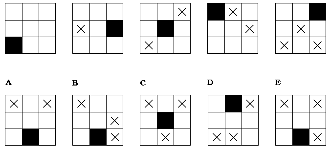

### Opciones disponibles

- **A.** A
- **B.** B
- **C.** C
- **D.** D
- **E.** E

---

### Respuesta y explicacion

La respuesta correcta es la **E**: E

The black square alternates between two movement patterns: first, it moves up one and left one, then it moves left one, and so on.

In each diagram, a cross appears in the location immediately above the black square´s location in the previous diagram.

After its initial placement, all crosses move down one in each diagram.

Whenever a cross and the black square end in the same location, the cross is permanently removed.

Note: Between the first and second frame the square appears on the right side of the frame because as it moves up and left it exits the frame and appears on the opposite side.

## Pregunta 53

Fuente: https://www.epsoprep.com/practice/attempt/en/UXVlc3Rpb25Qb29sQXR0ZW1wdDpUT1h6QVpZZWtrWUhaZ2plMHIwTnVn/review?q=33

### Enunciado

From the options available, please choose which diagram would come next in the series.

### Imagen

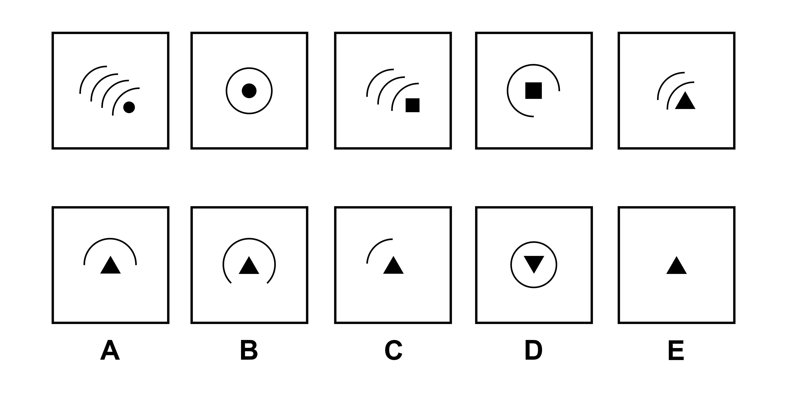

### Opciones disponibles

- **A.** A
- **B.** B
- **C.** C
- **D.** D
- **E.** E

---

### Respuesta y explicacion

La respuesta correcta es la **A**: A

The frames come in pairs. The black shaded shape alternates between a circle, square and a triangle, each appearing twice in a row.

The curved lines appearing in first frame of each pair are then used to form a circle or parts of a circle in the next diagram depending of how any curved lines there are.

Because frame 5 only has two curved lines and includes a triangle we need to look for a frame that includes a half a circle and a triangle

## Pregunta 54

Fuente: https://www.epsoprep.com/practice/attempt/en/UXVlc3Rpb25Qb29sQXR0ZW1wdDpUT1h6QVpZZWtrWUhaZ2plMHIwTnVn/review?q=34

### Enunciado

From the options available, please choose which diagram would come next in the series.

### Imagen

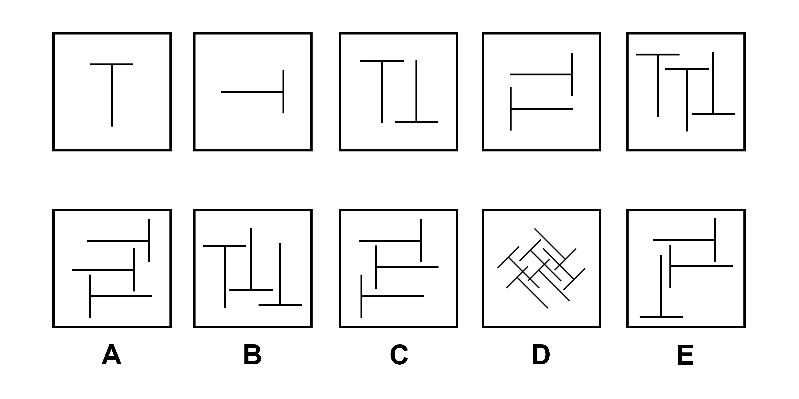

### Opciones disponibles

- **A.** A
- **B.** B
- **C.** C
- **D.** D
- **E.** E

---

### Respuesta y explicacion

La respuesta correcta es la **A**: A

There are two rules in this question. The first rule is that the whole frame rotates 90 degrees clockwise each frame.

The second rule is that the every second frame another T shape is added.

## Pregunta 55

Fuente: https://www.epsoprep.com/practice/attempt/en/UXVlc3Rpb25Qb29sQXR0ZW1wdDpUT1h6QVpZZWtrWUhaZ2plMHIwTnVn/review?q=35

### Enunciado

From the options available, please choose which diagram would come next in the series.

### Imagen

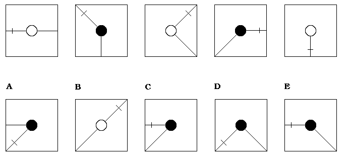

### Opciones disponibles

- **A.** A
- **B.** B
- **C.** C
- **D.** D
- **E.** E

---

### Respuesta y explicacion

La respuesta correcta es la **A**: A

The central circle changes shading with each diagram.

The barbed line will alternate between rotating 45 and 90 degrees clockwise as the sequence progresses.

The other line alternates between rotating 90 degrees clockwise and 45 degrees anti-clockwise as the sequence progresses.

## Pregunta 56

Fuente: https://www.epsoprep.com/practice/attempt/en/UXVlc3Rpb25Qb29sQXR0ZW1wdDpUT1h6QVpZZWtrWUhaZ2plMHIwTnVn/review?q=36

### Enunciado

From the options available, please choose which diagram would come next in the series.

### Imagen

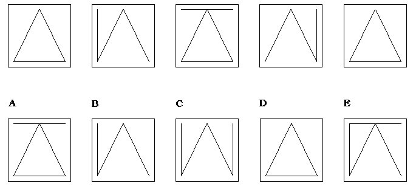

### Opciones disponibles

- **A.** A
- **B.** B
- **C.** C
- **D.** D
- **E.** E

---

### Respuesta y explicacion

La respuesta correcta es la **B**: B

Every second diagram (beginning with the first), a horizontal line appears at the bottom. Each time, it rotates by 90 degrees and moves around the diagram; the first such line moves clockwise (to the left, then the top, etc.), and each new line thereafter moves in the opposite direction.

The third line, appearing in the fifth diagram, is identical in location and behaviour to the first line (which has now returned to the bottom), so will never be seen.

In the next diagram, the first (and third) lines will move (clockwise) from the bottom to the left, while the second line will move (anticlockwise) from the top to the left. All three lines will thus be in the same location.

## Pregunta 57

Fuente: https://www.epsoprep.com/practice/attempt/en/UXVlc3Rpb25Qb29sQXR0ZW1wdDpUT1h6QVpZZWtrWUhaZ2plMHIwTnVn/review?q=37

### Enunciado

From the options available, please choose which diagram would come next in the series.

### Imagen

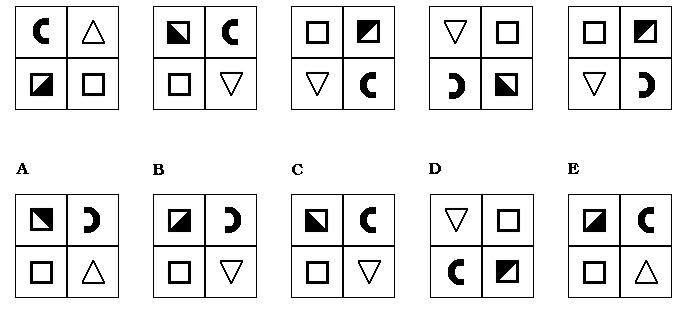

### Opciones disponibles

- **A.** A
- **B.** B
- **C.** C
- **D.** D
- **E.** E

---

### Respuesta y explicacion

La respuesta correcta es la **A**: A

The diagrams are divided into quadrants. There are two interacting patterns.

First, each item shifts position: all movement is clockwise until each item has occupied every position (i.e. ending in the fourth diagram), then the direction of movement reverses.

Second, items in the two left quadrants are mirrored horizontally, while items in the two right quadrants are mirrored vertically.

Since the hollow square item is symmetrical, and the crescent and triangle items each have one axis of symmetry, the mirroring is not always apparent.

## Pregunta 58

Fuente: https://www.epsoprep.com/practice/attempt/en/UXVlc3Rpb25Qb29sQXR0ZW1wdDpUT1h6QVpZZWtrWUhaZ2plMHIwTnVn/review?q=38

### Enunciado

From the options available, please choose which diagram would come next in the series.

### Imagen

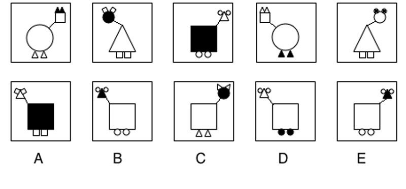

### Opciones disponibles

- **A.** A
- **B.** B
- **C.** C
- **D.** D
- **E.** E

---

### Respuesta y explicacion

La respuesta correcta es la **B**: B

A shape that has the bottom position moves up in the next frame, up again in the next frame, up again in the next frame, then back to the bottom.

The position of a shape dictates its size and number (two small at the bottom position, one large at the next position, one medium at the third position, and two small at the top position).

The position where the shape(s) are black follows the pattern top – second from top – third from top-bottom – top.

## Pregunta 59

Fuente: https://www.epsoprep.com/practice/attempt/en/UXVlc3Rpb25Qb29sQXR0ZW1wdDpUT1h6QVpZZWtrWUhaZ2plMHIwTnVn/review?q=39

### Enunciado

From the options available, please choose which diagram would come next in the series.

### Imagen

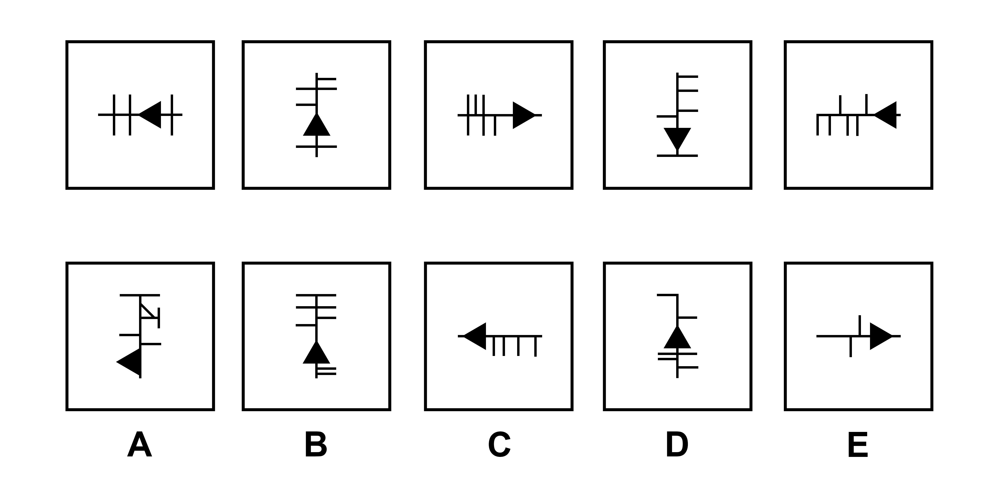

### Opciones disponibles

- **A.** A
- **B.** B
- **C.** C
- **D.** D
- **E.** E

---

### Respuesta y explicacion

La respuesta correcta es la **D**: D

The central line and the triangle are rotated simultaneously at 90 degrees in a clockwise direction. Attached on the central line are always a total six short lines drawn on either side. The position of the lines is random.

## Pregunta 60

Fuente: https://www.epsoprep.com/practice/attempt/en/UXVlc3Rpb25Qb29sQXR0ZW1wdDpUT1h6QVpZZWtrWUhaZ2plMHIwTnVn/review?q=40

### Enunciado

From the options available, please choose which diagram would come next in the series.

### Imagen

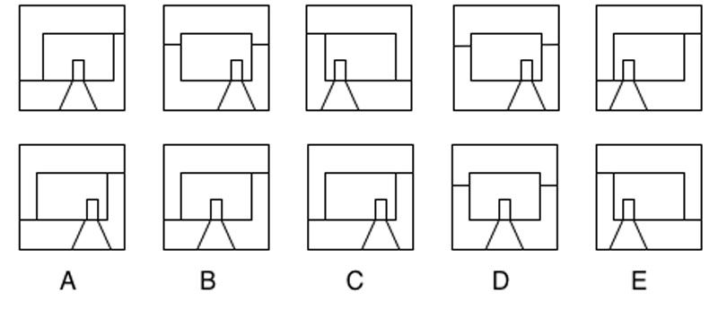

### Opciones disponibles

- **A.** A
- **B.** B
- **C.** C
- **D.** D
- **E.** E

---

### Respuesta y explicacion

La respuesta correcta es la **D**: D

The horizontal lines left and right of the large rectangle follows the pattern bottom of the rectangle – centre of the rectangle – top of the rectangle – centre of the rectangle – bottom of the rectangle – etc.

The small rectangle and trapezium follow the pattern centre – right – left – right – left – centre – centre – right – etc.

## Pregunta 61

Fuente: https://www.epsoprep.com/practice/attempt/en/UXVlc3Rpb25Qb29sQXR0ZW1wdDpzbHhveHQ2cFdVQUdzZ2plMHIwTnVn/review?q=1

### Enunciado

From the options available, please choose which diagram would come next in the series.

### Imagen

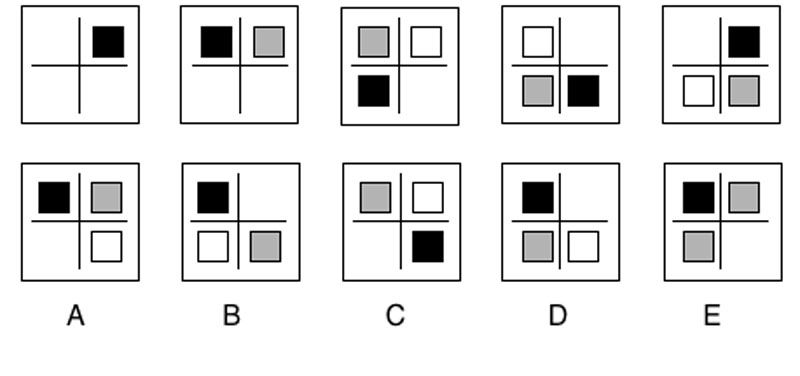

### Opciones disponibles

- **A.** A
- **B.** B
- **C.** C
- **D.** D
- **E.** E

---

### Respuesta y explicacion

La respuesta correcta es la **A**: A

The black square moves counterclockwise at one corner per frame.

Where a black square has been in the previous frame, there is a gray square.

Where a gray square has been in the previous square, there is a white square.

Where a white frame has been in the previous square, there is an empty corner.

## Pregunta 62

Fuente: https://www.epsoprep.com/practice/attempt/en/UXVlc3Rpb25Qb29sQXR0ZW1wdDpzbHhveHQ2cFdVQUdzZ2plMHIwTnVn/review?q=2

### Enunciado

From the options available, please choose which diagram would come next in the series.

### Imagen

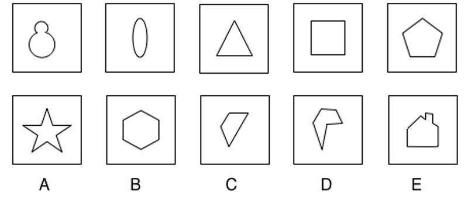

### Opciones disponibles

- **A.** A
- **B.** B
- **C.** C
- **D.** D
- **E.** E

---

### Respuesta y explicacion

La respuesta correcta es la **B**: B

Each shape has a number of axes of symmetry.

In the first frame, there is one axis, in the second frame, there are two, in the third there are three, in the fourth, there are four, etc.

## Pregunta 63

Fuente: https://www.epsoprep.com/practice/attempt/en/UXVlc3Rpb25Qb29sQXR0ZW1wdDpzbHhveHQ2cFdVQUdzZ2plMHIwTnVn/review?q=3

### Enunciado

From the options available, please choose which diagram would come next in the series.

### Imagen

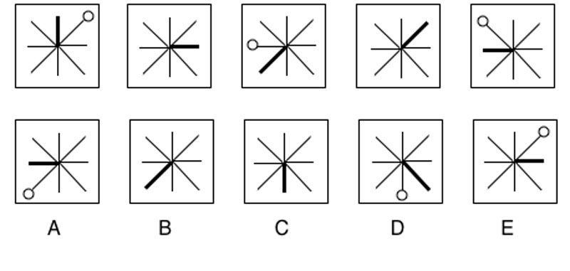

### Opciones disponibles

- **A.** A
- **B.** B
- **C.** C
- **D.** D
- **E.** E

---

### Respuesta y explicacion

La respuesta correcta es la **C**: C

The thick line moves clockwise, skipping a number of lines each frame.

This number of lines skipped follows the pattern 1 – 2 – 3 – 4 – 5 – etc.

In odd frames, there is a circle at the end of the line on the clockwise side of the thick line.

## Pregunta 64

Fuente: https://www.epsoprep.com/practice/attempt/en/UXVlc3Rpb25Qb29sQXR0ZW1wdDpzbHhveHQ2cFdVQUdzZ2plMHIwTnVn/review?q=4

### Enunciado

From the options available, please choose which diagram would come next in the series.

### Imagen

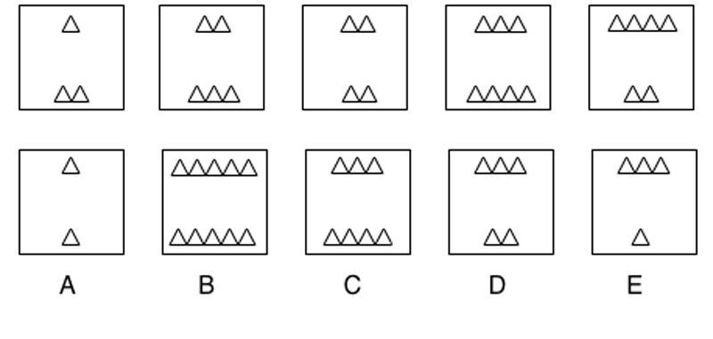

### Opciones disponibles

- **A.** A
- **B.** B
- **C.** C
- **D.** D
- **E.** E

---

### Respuesta y explicacion

La respuesta correcta es la **B**: B

If the number of triangles at the bottom is even, the number of triangles at the top increases by one in the next frame.

For that reason, we are looking for an answer option that has five triangles at the top.

## Pregunta 65

Fuente: https://www.epsoprep.com/practice/attempt/en/UXVlc3Rpb25Qb29sQXR0ZW1wdDpzbHhveHQ2cFdVQUdzZ2plMHIwTnVn/review?q=5

### Enunciado

From the options available, please choose which diagram would come next in the series.

### Imagen

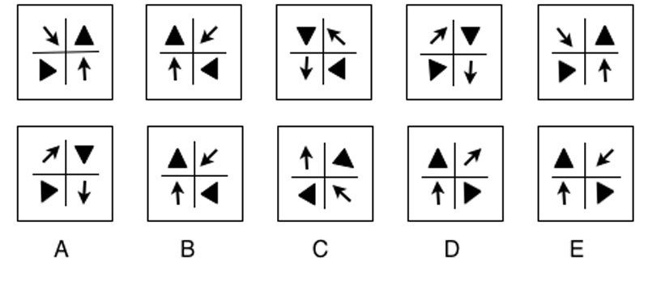

### Opciones disponibles

- **A.** A
- **B.** B
- **C.** C
- **D.** D
- **E.** E

---

### Respuesta y explicacion

La respuesta correcta es la **B**: B

Between odd and even frames, the entire shape including the plus is flipped along a vertical line.

Between even and odd frames, the small shapes remain in place but are flipped along a horizontal line.

## Pregunta 66

Fuente: https://www.epsoprep.com/practice/attempt/en/UXVlc3Rpb25Qb29sQXR0ZW1wdDpzbHhveHQ2cFdVQUdzZ2plMHIwTnVn/review?q=6

### Enunciado

From the options available, please choose which diagram would come next in the series.

### Imagen

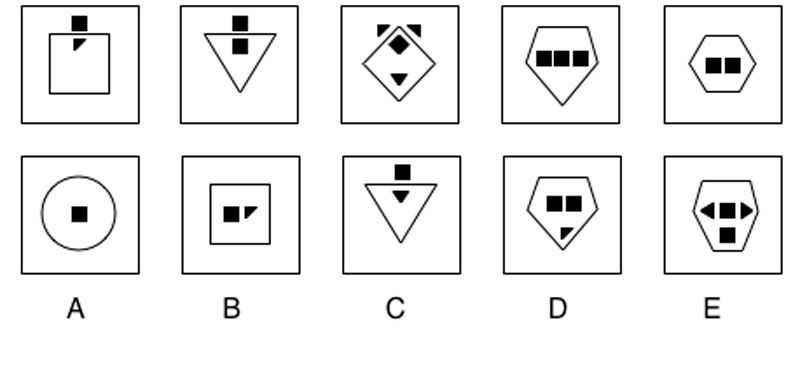

### Opciones disponibles

- **A.** A
- **B.** B
- **C.** C
- **D.** D
- **E.** E

---

### Respuesta y explicacion

La respuesta correcta es la **B**: B

The number of sides of the white shape is equal to twice the number of squares in the previous frame.

The black triangles are counted as half squares. So for example, frame two consists of 2 black squares.

That means that the bigger white shape in the next frame should have four sides (2*2) which it also does.

Similarly, we see that the fifth frame also consists of two whole black squares which means that the sixth frame should also have only four sides (2 squares *2)

## Pregunta 67

Fuente: https://www.epsoprep.com/practice/attempt/en/UXVlc3Rpb25Qb29sQXR0ZW1wdDpzbHhveHQ2cFdVQUdzZ2plMHIwTnVn/review?q=7

### Enunciado

From the options available, please choose which diagram would come next in the series.

### Imagen

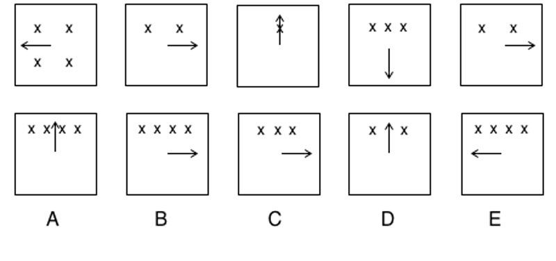

### Opciones disponibles

- **A.** A
- **B.** B
- **C.** C
- **D.** D
- **E.** E

---

### Respuesta y explicacion

La respuesta correcta es la **E**: E

The sides of the frame are numbered: the top side is 1, the right side is 2, the bottom side is 3 and the left side is 4.

The number of crosses equals the direction that the arrow is pointing into.

## Pregunta 68

Fuente: https://www.epsoprep.com/practice/attempt/en/UXVlc3Rpb25Qb29sQXR0ZW1wdDpzbHhveHQ2cFdVQUdzZ2plMHIwTnVn/review?q=8

### Enunciado

From the options available, please choose which diagram would come next in the series.

### Imagen

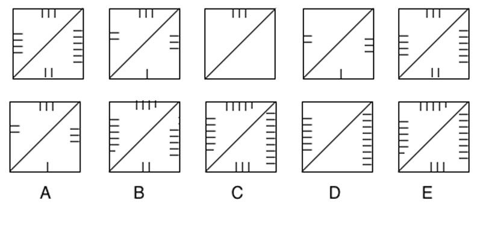

### Opciones disponibles

- **A.** A
- **B.** B
- **C.** C
- **D.** D
- **E.** E

---

### Respuesta y explicacion

La respuesta correcta es la **A**: A

The lines at the bottom follow the pattern 2 – 1 – 0 – 1 – 2 – 1 – etc.

The lines on the right follow the pattern 6 -3 – 0 – 3 – 6 – 3 – etc.

The lines on the left equal the lines on the right minus the lines in the bottom.

The lines at the top equal the lines on the right in the preceding frame divided by the lines at the bottom also in the preceding frame.

## Pregunta 69

Fuente: https://www.epsoprep.com/practice/attempt/en/UXVlc3Rpb25Qb29sQXR0ZW1wdDpzbHhveHQ2cFdVQUdzZ2plMHIwTnVn/review?q=9

### Enunciado

From the options available, please choose which diagram would come next in the series.

### Imagen

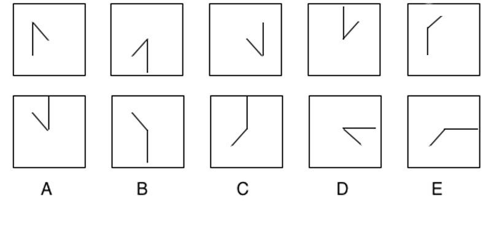

### Opciones disponibles

- **A.** A
- **B.** B
- **C.** C
- **D.** D
- **E.** E

---

### Respuesta y explicacion

La respuesta correcta es la **B**: B

The figure is flipped along a vertical line, then a horizontal line, then a vertical line, then the corner between the lines turns from blunt to sharp.

This process is repeated.

## Pregunta 70

Fuente: https://www.epsoprep.com/practice/attempt/en/UXVlc3Rpb25Qb29sQXR0ZW1wdDpzbHhveHQ2cFdVQUdzZ2plMHIwTnVn/review?q=10

### Enunciado

From the options available, please choose which diagram would come next in the series.

### Imagen

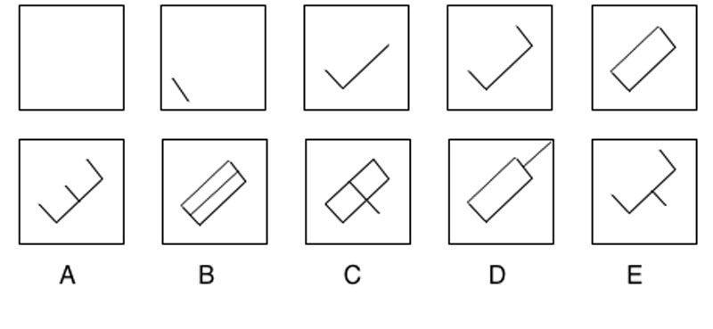

### Opciones disponibles

- **A.** A
- **B.** B
- **C.** C
- **D.** D
- **E.** E

---

### Respuesta y explicacion

La respuesta correcta es la **C**: C

In each frame, one new line is added. Each line that is added is rotated 90 degrees anticlockwise compared to the last added line.

## Pregunta 71

Fuente: https://www.epsoprep.com/practice/attempt/en/UXVlc3Rpb25Qb29sQXR0ZW1wdDpzbHhveHQ2cFdVQUdzZ2plMHIwTnVn/review?q=11

### Enunciado

From the options available, please choose which diagram would come next in the series.

### Imagen

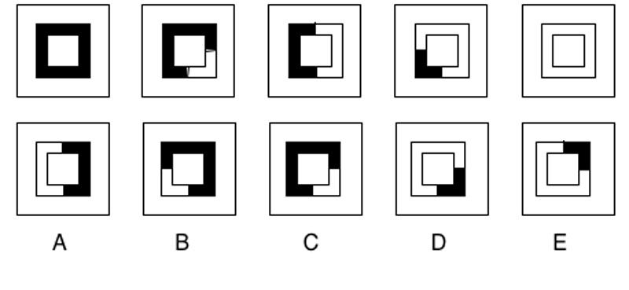

### Opciones disponibles

- **A.** A
- **B.** B
- **C.** C
- **D.** D
- **E.** E

---

### Respuesta y explicacion

La respuesta correcta es la **D**: D

The outer square changes colour in a counterclockwise direction at ¼ square per frame, starting in the right bottom corner.

## Pregunta 72

Fuente: https://www.epsoprep.com/practice/attempt/en/UXVlc3Rpb25Qb29sQXR0ZW1wdDpzbHhveHQ2cFdVQUdzZ2plMHIwTnVn/review?q=12

### Enunciado

From the options available, please choose which diagram would come next in the series.

### Imagen

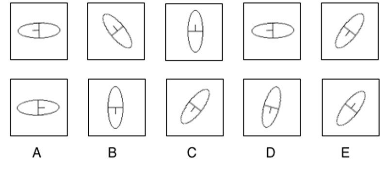

### Opciones disponibles

- **A.** A
- **B.** B
- **C.** C
- **D.** D
- **E.** E

---

### Respuesta y explicacion

La respuesta correcta es la **B**: B

The oval moves clockwise at 1/8 circle per frame for two frames, then returns to the first position and moves counter clockwise at 1/8 circle per frame for two frames.

## Pregunta 73

Fuente: https://www.epsoprep.com/practice/attempt/en/UXVlc3Rpb25Qb29sQXR0ZW1wdDpzbHhveHQ2cFdVQUdzZ2plMHIwTnVn/review?q=13

### Enunciado

From the options available, please choose which diagram would come next in the series.

### Imagen

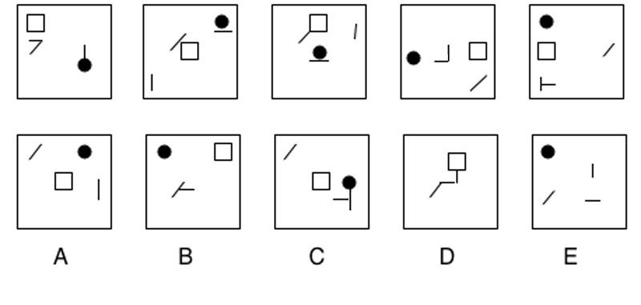

### Opciones disponibles

- **A.** A
- **B.** B
- **C.** C
- **D.** D
- **E.** E

---

### Respuesta y explicacion

La respuesta correcta es la **C**: C

Each frame contains a square, a black circle, a horizontal line, a vertical line, and a line slanted to the right.

## Pregunta 74

Fuente: https://www.epsoprep.com/practice/attempt/en/UXVlc3Rpb25Qb29sQXR0ZW1wdDpzbHhveHQ2cFdVQUdzZ2plMHIwTnVn/review?q=14

### Enunciado

From the options available, please choose which diagram would come next in the series.

### Imagen

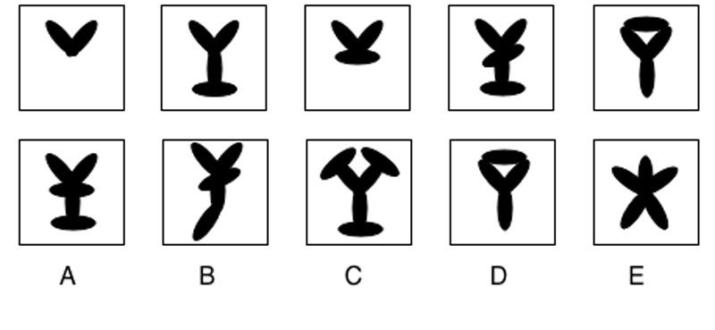

### Opciones disponibles

- **A.** A
- **B.** B
- **C.** C
- **D.** D
- **E.** E

---

### Respuesta y explicacion

La respuesta correcta es la **C**: C

The number of ellipses in the figure increases with two ellipses in even frames and decreases by one in odd frames.

As we have four ellipses in frame 5 we need to look for an answer option that has six ellipses as even frames increase by two in even frames.

## Pregunta 75

Fuente: https://www.epsoprep.com/practice/attempt/en/UXVlc3Rpb25Qb29sQXR0ZW1wdDpzbHhveHQ2cFdVQUdzZ2plMHIwTnVn/review?q=15

### Enunciado

From the options available, please choose which diagram would come next in the series.

### Imagen

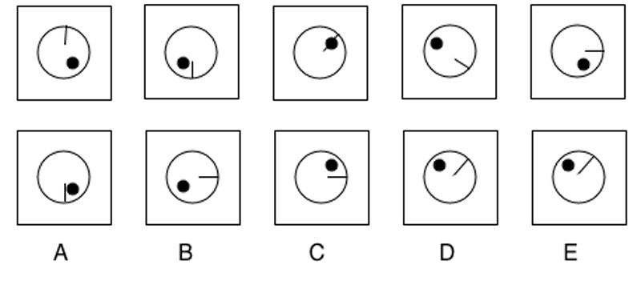

### Opciones disponibles

- **A.** A
- **B.** B
- **C.** C
- **D.** D
- **E.** E

---

### Respuesta y explicacion

La respuesta correcta es la **B**: B

The black dot follows the pattern bottom right – bottom left – top right – bottom left – etc.

The line turns clockwise 4/8 circle, counterclockwise 3/8 circle, clockwise 2/8 circle, counterclockwise 1/8 circle, clockwise 0/8 circle.

## Pregunta 76

Fuente: https://www.epsoprep.com/practice/attempt/en/UXVlc3Rpb25Qb29sQXR0ZW1wdDpzbHhveHQ2cFdVQUdzZ2plMHIwTnVn/review?q=16

### Enunciado

From the options available, please choose which diagram would come next in the series.

### Imagen

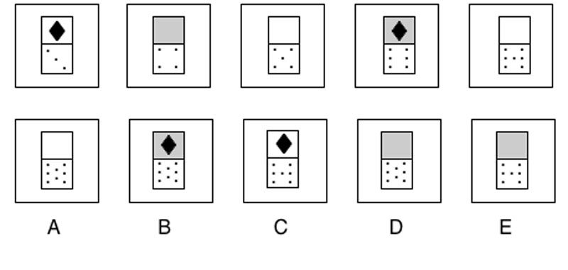

### Opciones disponibles

- **A.** A
- **B.** B
- **C.** C
- **D.** D
- **E.** E

---

### Respuesta y explicacion

La respuesta correcta es la **D**: D

The top square contains a diamond shape once every three frames.

It also includes a grey shade every second frame.

In the bottom square, the number of dots increases by one each frame.

## Pregunta 77

Fuente: https://www.epsoprep.com/practice/attempt/en/UXVlc3Rpb25Qb29sQXR0ZW1wdDpzbHhveHQ2cFdVQUdzZ2plMHIwTnVn/review?q=17

### Enunciado

From the options available, please choose which diagram would come next in the series.

### Imagen

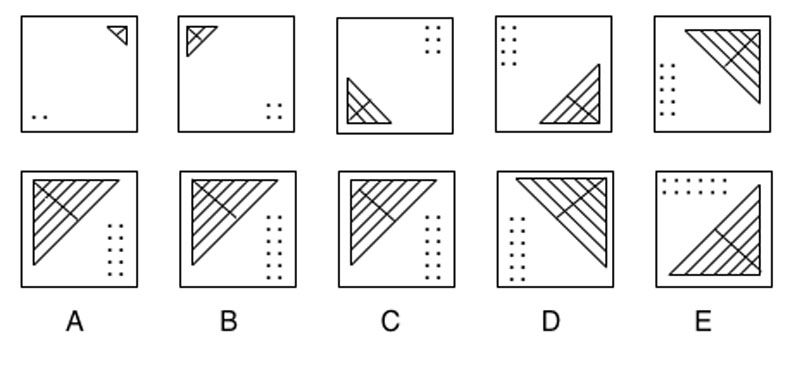

### Opciones disponibles

- **A.** A
- **B.** B
- **C.** C
- **D.** D
- **E.** E

---

### Respuesta y explicacion

La respuesta correcta es la **B**: B

The triangle moves counter-clockwise along the frame’s corner at one corner per frame. In each frame, a bottom section is added to the triangle.

The triangle is cut through by a line running perpendicular to its base.

In the corner opposing the triangle, there is a number of dots that increases by two each frame.

## Pregunta 78

Fuente: https://www.epsoprep.com/practice/attempt/en/UXVlc3Rpb25Qb29sQXR0ZW1wdDpzbHhveHQ2cFdVQUdzZ2plMHIwTnVn/review?q=18

### Enunciado

From the options available, please choose which diagram would come next in the series.

### Imagen

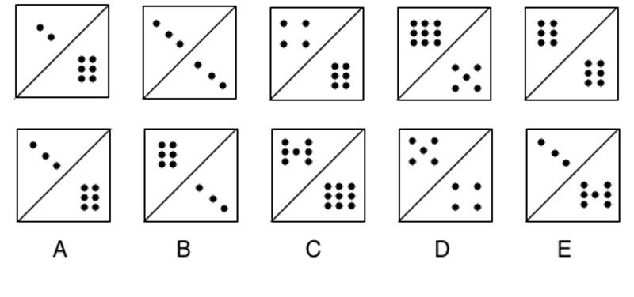

### Opciones disponibles

- **A.** A
- **B.** B
- **C.** C
- **D.** D
- **E.** E

---

### Respuesta y explicacion

La respuesta correcta es la **E**: E

The number of dots at the top left of the first frame alternates between the top left and bottom right of the frame and increases by one dot per frame.

As we have six dots in the top left part of the last frame we would expect seven dots in the bottom right frame.

The number at the bottom right (starting from the first frame) of the frame alternates between bottom right and top left and fluctuates between 3 and 9 dots with the increments of three dots.

## Pregunta 79

Fuente: https://www.epsoprep.com/practice/attempt/en/UXVlc3Rpb25Qb29sQXR0ZW1wdDpzbHhveHQ2cFdVQUdzZ2plMHIwTnVn/review?q=19

### Enunciado

From the options available, please choose which diagram would come next in the series.

### Imagen

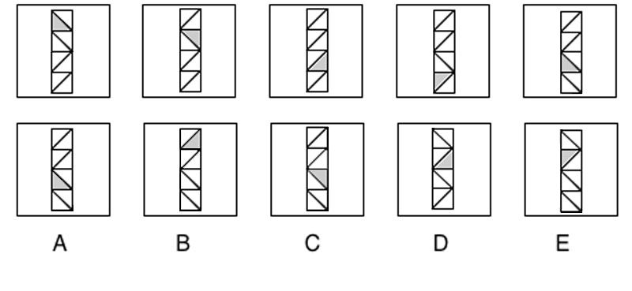

### Opciones disponibles

- **A.** A
- **B.** B
- **C.** C
- **D.** D
- **E.** E

---

### Respuesta y explicacion

La respuesta correcta es la **E**: E

In each frame, there are four squares stacked on top of each other.

Each square is divided diagonally by a line that shifts direction (leaning left or right). The direction is always random. In each frame, there is a grey triangle that changes position. There is a simple rule to how it changes position. In each frame, it jumps to the next of the four squares and as it does that, it occupies the upper half of the square or the lower half.

It moves down until it reaches the last square and then goes back.

Frame 1: Lower half of square one.

Frame 2: Upper half of square two

Frame 3: Lower half of square three

Frame 4: Upper half of square four

Frame 5: Lower half of square three (it has turned back and moved upwards now)

Frame 6: We are looking for a frame where the triangle occupies the upper half of square two (it continues moving upward)

## Pregunta 80

Fuente: https://www.epsoprep.com/practice/attempt/en/UXVlc3Rpb25Qb29sQXR0ZW1wdDpzbHhveHQ2cFdVQUdzZ2plMHIwTnVn/review?q=20

### Enunciado

From the options available, please choose which diagram would come next in the series.

### Imagen

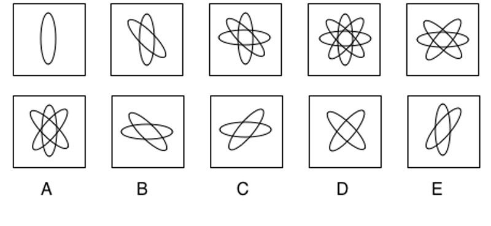

### Opciones disponibles

- **A.** A
- **B.** B
- **C.** C
- **D.** D
- **E.** E

---

### Respuesta y explicacion

La respuesta correcta es la **C**: C

There is a new oval each frame, turned counterclockwise 1/8 of a circle compared to the previously added oval.

When there are four ovals, the oldest oval is removed from each frame.

## Pregunta 81

Fuente: https://www.epsoprep.com/practice/attempt/en/UXVlc3Rpb25Qb29sQXR0ZW1wdDpzbHhveHQ2cFdVQUdzZ2plMHIwTnVn/review?q=21

### Enunciado

From the options available, please choose which diagram would come next in the series.

### Imagen

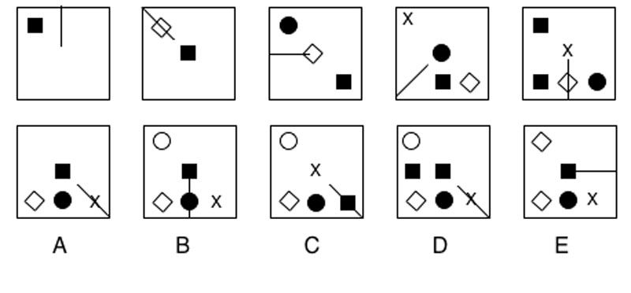

### Opciones disponibles

- **A.** A
- **B.** B
- **C.** C
- **D.** D
- **E.** E

---

### Respuesta y explicacion

La respuesta correcta es la **D**: D

The line turns counter clockwise at an eighth of a circle per frame.

A new figure enters the frame at the top left.

Each new frame, this figure moves along the diagonal and then along the bottom border

## Pregunta 82

Fuente: https://www.epsoprep.com/practice/attempt/en/UXVlc3Rpb25Qb29sQXR0ZW1wdDpzbHhveHQ2cFdVQUdzZ2plMHIwTnVn/review?q=22

### Enunciado

From the options available, please choose which diagram would come next in the series.

### Imagen

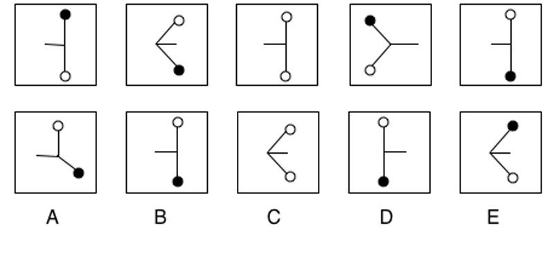

### Opciones disponibles

- **A.** A
- **B.** B
- **C.** C
- **D.** D
- **E.** E

---

### Respuesta y explicacion

La respuesta correcta es la **C**: C

The horizontal line alternates between left and right.

The vertical lines follow the pattern: pointing right of the centre, pointing up/down, pointing left of the centre, etc.

The top circle follows the pattern black – white – white – etc. The bottom circle follows the same pattern.

## Pregunta 83

Fuente: https://www.epsoprep.com/practice/attempt/en/UXVlc3Rpb25Qb29sQXR0ZW1wdDpzbHhveHQ2cFdVQUdzZ2plMHIwTnVn/review?q=23

### Enunciado

From the options available, please choose which diagram would come next in the series.

### Imagen

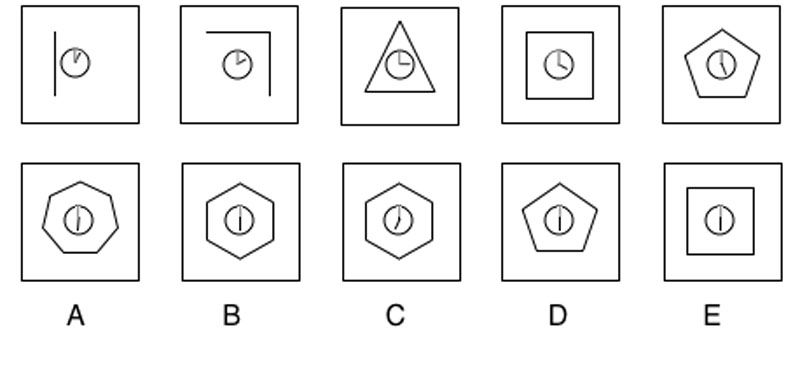

### Opciones disponibles

- **A.** A
- **B.** B
- **C.** C
- **D.** D
- **E.** E

---

### Respuesta y explicacion

La respuesta correcta es la **B**: B

Outside the circle, the number of lines increases by one each frame.

Inside the circle, the clock indicates the time, where the number of hours is equal to the number of lines outside the circle.

## Pregunta 84

Fuente: https://www.epsoprep.com/practice/attempt/en/UXVlc3Rpb25Qb29sQXR0ZW1wdDpzbHhveHQ2cFdVQUdzZ2plMHIwTnVn/review?q=24

### Enunciado

From the options available, please choose which diagram would come next in the series.

### Imagen

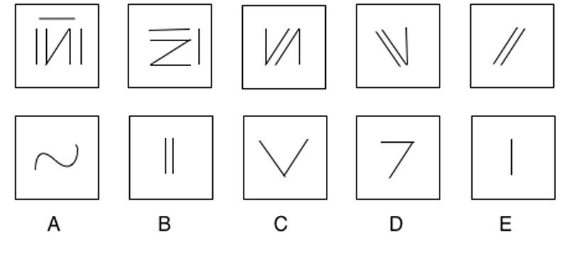

### Opciones disponibles

- **A.** A
- **B.** B
- **C.** C
- **D.** D
- **E.** E

---

### Respuesta y explicacion

La respuesta correcta es la **E**: E

The number of lines (separated from the others by either white space or a corner) decreases by one line per frame. Lines are always straight.

## Pregunta 85

Fuente: https://www.epsoprep.com/practice/attempt/en/UXVlc3Rpb25Qb29sQXR0ZW1wdDpzbHhveHQ2cFdVQUdzZ2plMHIwTnVn/review?q=25

### Enunciado

From the options available, please choose which diagram would come next in the series.

### Imagen

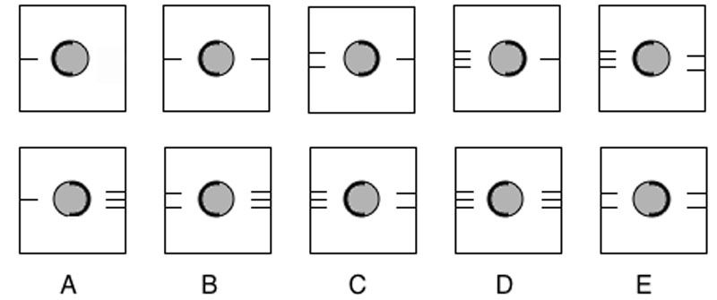

### Opciones disponibles

- **A.** A
- **B.** B
- **C.** C
- **D.** D
- **E.** E

---

### Respuesta y explicacion

La respuesta correcta es la **D**: D

The thick half of the circle’s outline is left for two frames, then right for two frames, then left for two frames, etc.

The number of lines on the sides will increase by one depending on where the thick part pointed two frames earlier.

We see this in frame 3 where the number of lines to the left increases by one because in frame 1 the thick outline was pointing to the left.

## Pregunta 86

Fuente: https://www.epsoprep.com/practice/attempt/en/UXVlc3Rpb25Qb29sQXR0ZW1wdDpzbHhveHQ2cFdVQUdzZ2plMHIwTnVn/review?q=26

### Enunciado

From the options available, please choose which diagram would come next in the series.

### Imagen

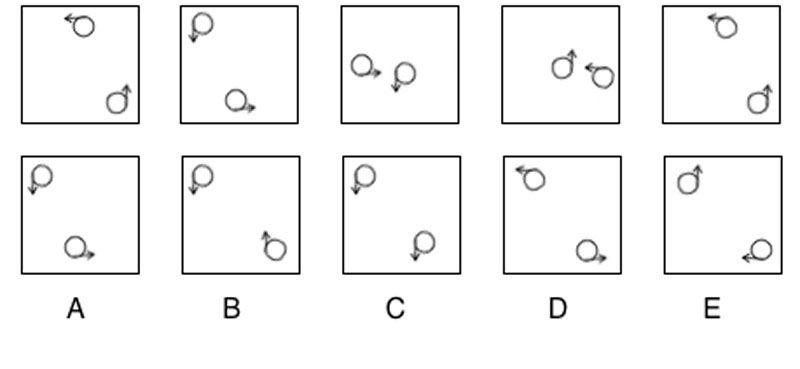

### Opciones disponibles

- **A.** A
- **B.** B
- **C.** C
- **D.** D
- **E.** E

---

### Respuesta y explicacion

La respuesta correcta es la **A**: A

The top left circle moves counter clockwise, from corner to corner on an imaginary square that has its bottom right corner in the center of the frame.

The arrow always points in the direction that the square will move next.

The bottom right circle does the same, but it moves clockwise and the square has its top right corner in the center of the frame.

The arrow always points in the direction that the square moved in the previous frame transition.

## Pregunta 87

Fuente: https://www.epsoprep.com/practice/attempt/en/UXVlc3Rpb25Qb29sQXR0ZW1wdDpzbHhveHQ2cFdVQUdzZ2plMHIwTnVn/review?q=27

### Enunciado

From the options available, please choose which diagram would come next in the series.

### Imagen

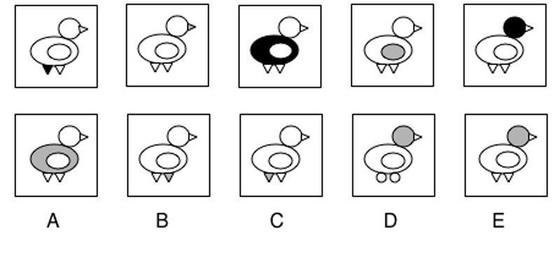

### Opciones disponibles

- **A.** A
- **B.** B
- **C.** C
- **D.** D
- **E.** E

---

### Respuesta y explicacion

La respuesta correcta es la **B**: B

Each frame has one coloured area. The colour alternates between black and grey.

Each time, an area is coloured that was not coloured before.

## Pregunta 88

Fuente: https://www.epsoprep.com/practice/attempt/en/UXVlc3Rpb25Qb29sQXR0ZW1wdDpzbHhveHQ2cFdVQUdzZ2plMHIwTnVn/review?q=28

### Enunciado

From the options available, please choose which diagram would come next in the series.

### Imagen

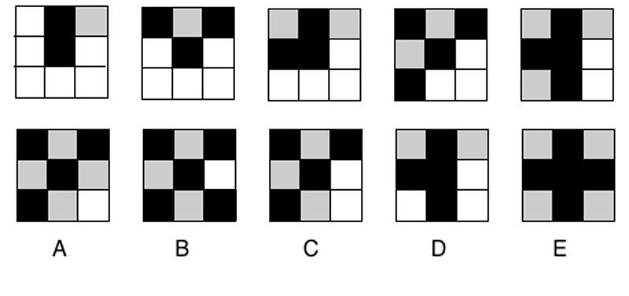

### Opciones disponibles

- **A.** A
- **B.** B
- **C.** C
- **D.** D
- **E.** E

---

### Respuesta y explicacion

La respuesta correcta es la **B**: B

Each frame shows a number of white squares that decreases by one per frame.

The next frame to turn nonwhite moves counterclockwise along the edge of the grid at one square per frame.

The nonwhite squares show a pattern of gray and black squares that shows a black plus (with remaining squares gray) in odd frames and a black X (with remaining squares gray) in even frames.

## Pregunta 89

Fuente: https://www.epsoprep.com/practice/attempt/en/UXVlc3Rpb25Qb29sQXR0ZW1wdDpzbHhveHQ2cFdVQUdzZ2plMHIwTnVn/review?q=29

### Enunciado

From the options available, please choose which diagram would come next in the series.

### Imagen

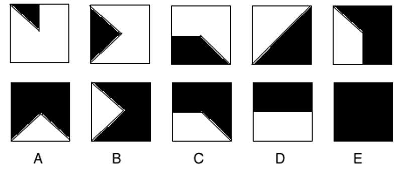

### Opciones disponibles

- **A.** A
- **B.** B
- **C.** C
- **D.** D
- **E.** E

---

### Respuesta y explicacion

La respuesta correcta es la **A**: A

The black portion becomes larger by 1/8 square per frame.

At the same time, the whole black portion moves anti-clockwise 90 degrees per frame from the perspective of the side of the block that is facing that direction.

## Pregunta 90

Fuente: https://www.epsoprep.com/practice/attempt/en/UXVlc3Rpb25Qb29sQXR0ZW1wdDpzbHhveHQ2cFdVQUdzZ2plMHIwTnVn/review?q=30

### Enunciado

From the options available, please choose which diagram would come next in the series.

### Imagen

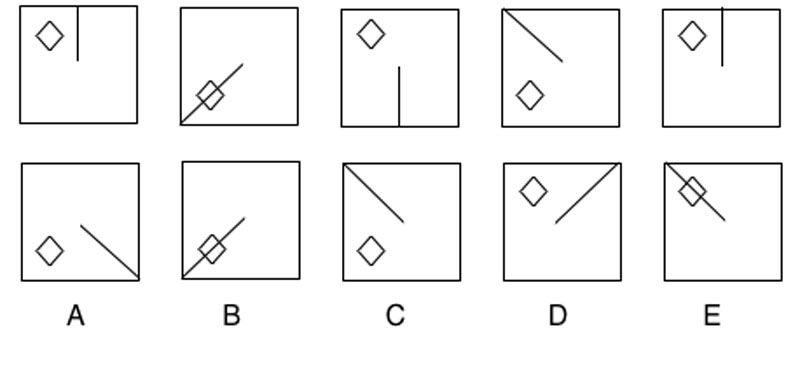

### Opciones disponibles

- **A.** A
- **B.** B
- **C.** C
- **D.** D
- **E.** E

---

### Respuesta y explicacion

La respuesta correcta es la **B**: B

The diamond location alternates between top left and bottom left.

The slanted line’s direction from the centre follows the pattern top – left bottom – bottom – left top – top – left bottom – bottom – left top – etc.

## Pregunta 91

Fuente: https://www.epsoprep.com/practice/attempt/en/UXVlc3Rpb25Qb29sQXR0ZW1wdDpzbHhveHQ2cFdVQUdzZ2plMHIwTnVn/review?q=31

### Enunciado

From the options available, please choose which diagram would come next in the series.

### Imagen

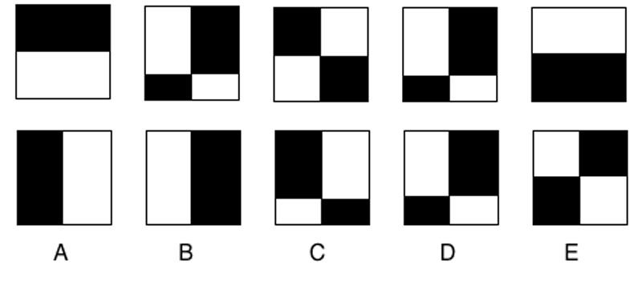

### Opciones disponibles

- **A.** A
- **B.** B
- **C.** C
- **D.** D
- **E.** E

---

### Respuesta y explicacion

La respuesta correcta es la **C**: C

The frame is divided into two halves.

The dividing line turns counterclockwise ¼ circle per frame.

The white half turns black from bottom to top at ¼ frame length per frame.

The black half turns white from top to bottom at ¼ frame length per frame.

## Pregunta 92

Fuente: https://www.epsoprep.com/practice/attempt/en/UXVlc3Rpb25Qb29sQXR0ZW1wdDpzbHhveHQ2cFdVQUdzZ2plMHIwTnVn/review?q=32

### Enunciado

From the options available, please choose which diagram would come next in the series.

### Imagen

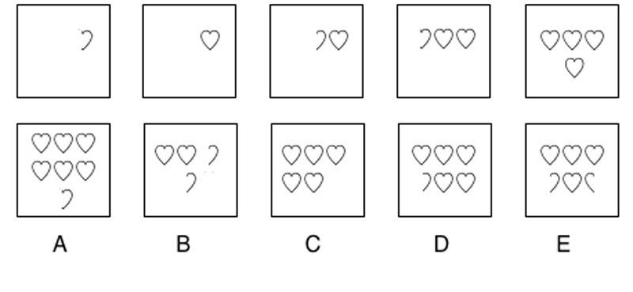

### Opciones disponibles

- **A.** A
- **B.** B
- **C.** C
- **D.** D
- **E.** E

---

### Respuesta y explicacion

La respuesta correcta es la **A**: A

The number of hearts in the frame is the sum of the number of hearts and half hearts in the previous two frames.

As frames 4 and 5 hold 2,5 hearts and 4 hearts the next frame should hold 6,5 hearts.

## Pregunta 93

Fuente: https://www.epsoprep.com/practice/attempt/en/UXVlc3Rpb25Qb29sQXR0ZW1wdDpzbHhveHQ2cFdVQUdzZ2plMHIwTnVn/review?q=33

### Enunciado

From the options available, please choose which diagram would come next in the series.

### Imagen

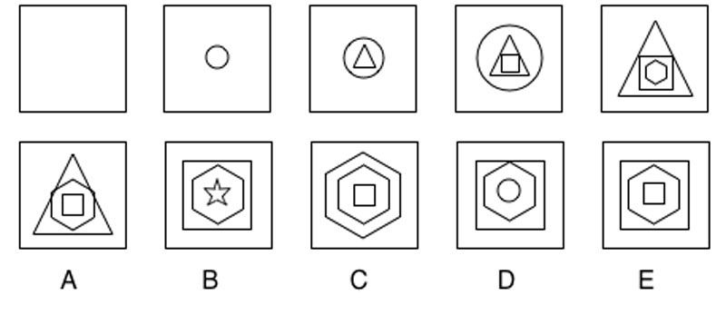

### Opciones disponibles

- **A.** A
- **B.** B
- **C.** C
- **D.** D
- **E.** E

---

### Respuesta y explicacion

La respuesta correcta es la **B**: B

A new figure appears each frame inside of any existing figures.

The existing figures become larger each frame.

The number of sides of the smallest figure increases in each frame.

## Pregunta 94

Fuente: https://www.epsoprep.com/practice/attempt/en/UXVlc3Rpb25Qb29sQXR0ZW1wdDpzbHhveHQ2cFdVQUdzZ2plMHIwTnVn/review?q=34

### Enunciado

From the options available, please choose which diagram would come next in the series.

### Imagen

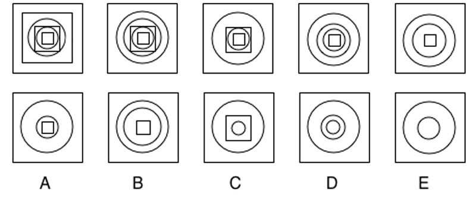

### Opciones disponibles

- **A.** A
- **B.** B
- **C.** C
- **D.** D
- **E.** E

---

### Respuesta y explicacion

La respuesta correcta es la **D**: D

There are two rules that affect the shapes (squares and circles). They start with the outer most shape and move inwards.

The first rule is that the squares change into circles in even frames. This rule starts with the outer most square as we can see in frame 2 where the square on outside changed shape into a circle.

The second rule is that the next shape in the sequence disappears.

## Pregunta 95

Fuente: https://www.epsoprep.com/practice/attempt/en/UXVlc3Rpb25Qb29sQXR0ZW1wdDpzbHhveHQ2cFdVQUdzZ2plMHIwTnVn/review?q=35

### Enunciado

From the options available, please choose which diagram would come next in the series.

### Imagen

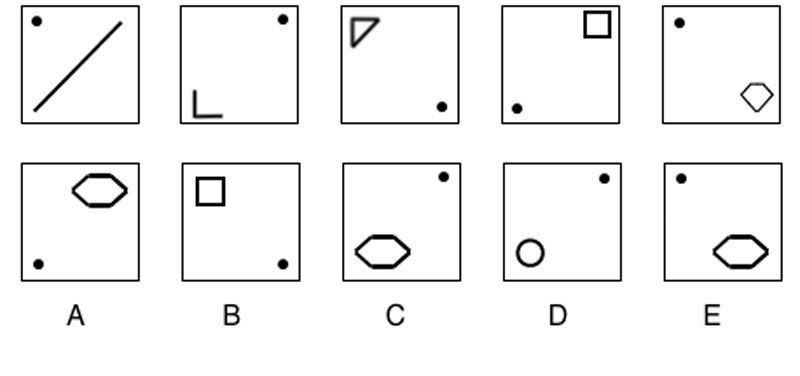

### Opciones disponibles

- **A.** A
- **B.** B
- **C.** C
- **D.** D
- **E.** E

---

### Respuesta y explicacion

La respuesta correcta es la **C**: C

The dot moves from corner to corner in a clockwise direction at one corner per frame.

On the opposite side of the dot are a number of lines.

This number increases with one per frame.

## Pregunta 96

Fuente: https://www.epsoprep.com/practice/attempt/en/UXVlc3Rpb25Qb29sQXR0ZW1wdDpzbHhveHQ2cFdVQUdzZ2plMHIwTnVn/review?q=36

### Enunciado

From the options available, please choose which diagram would come next in the series.

### Imagen

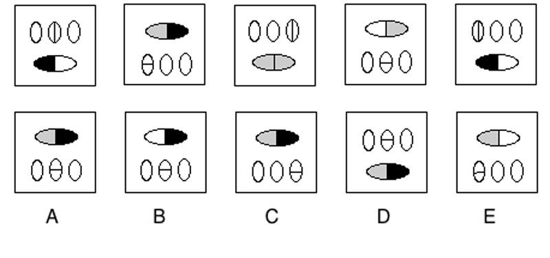

### Opciones disponibles

- **A.** A
- **B.** B
- **C.** C
- **D.** D
- **E.** E

---

### Respuesta y explicacion

La respuesta correcta es la **C**: C

The vertical position of the horizontal ellipse and the vertical ellipses alternates between the frames.

The colour of each half of the ellipse follows the pattern black – grey – grey – white – black – grey – grey – white – etc.

The vertical ellipse that contains an inner line follows the pattern centre – left – right – centre – left-right.

The orientation of the inner line alternates between vertical and horizontal.

## Pregunta 97

Fuente: https://www.epsoprep.com/practice/attempt/en/UXVlc3Rpb25Qb29sQXR0ZW1wdDpzbHhveHQ2cFdVQUdzZ2plMHIwTnVn/review?q=37

### Enunciado

From the options available, please choose which diagram would come next in the series.

### Imagen

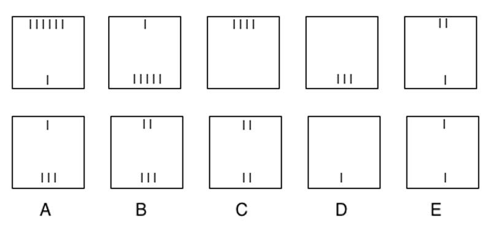

### Opciones disponibles

- **A.** A
- **B.** B
- **C.** C
- **D.** D
- **E.** E

---

### Respuesta y explicacion

La respuesta correcta es la **E**: E

The number of lines at the top (starting from frame 1) alternates between top and bottom and decreases by one per frame.

The number of lines on the other end follows the pattern 1 – 1 – 0 – 0 – 1 – 1 - 0 – 0 – etc.

## Pregunta 98

Fuente: https://www.epsoprep.com/practice/attempt/en/UXVlc3Rpb25Qb29sQXR0ZW1wdDpzbHhveHQ2cFdVQUdzZ2plMHIwTnVn/review?q=38

### Enunciado

From the options available, please choose which diagram would come next in the series.

### Imagen

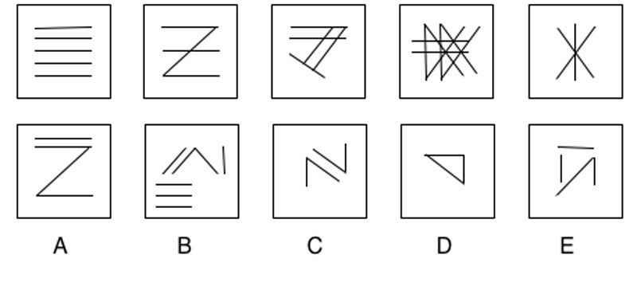

### Opciones disponibles

- **A.** A
- **B.** B
- **C.** C
- **D.** D
- **E.** E

---

### Respuesta y explicacion

La respuesta correcta es la **C**: C

In each frame, one line orientation is added.

In the first shape, there is one orientation, in the second there are two, in the third, there are three, in the fourth, there are four.

Then in the next frame, the oldest orientation is removed, and so on in the next frame, etc.

Only two frames have lines pointing in different directions, frame A and C.

However, frame A includes horizontal lines that have already been removed. The correct answer is therefore frame C.

## Pregunta 99

Fuente: https://www.epsoprep.com/practice/attempt/en/UXVlc3Rpb25Qb29sQXR0ZW1wdDpzbHhveHQ2cFdVQUdzZ2plMHIwTnVn/review?q=39

### Enunciado

From the options available, please choose which diagram would come next in the series.

### Imagen

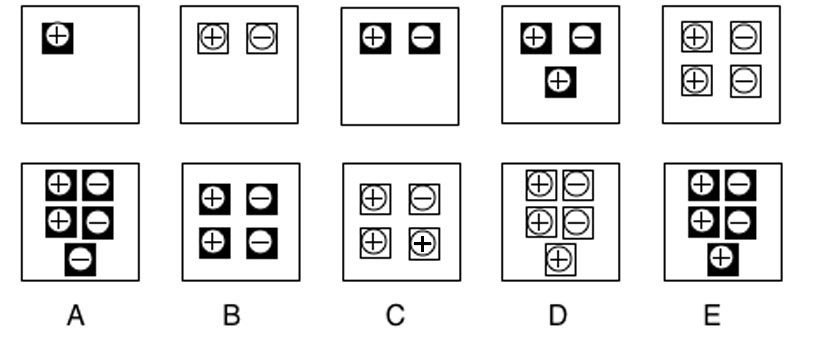

### Opciones disponibles

- **A.** A
- **B.** B
- **C.** C
- **D.** D
- **E.** E

---

### Respuesta y explicacion

La respuesta correcta es la **B**: B

If the squares have a black background, there will be a new square in the next frame.

If there is a new square, it contains a plus if the previously added square contained a minus and it contains a minus if the previously added square contained a plus.

When all the squares are white they turn black in the next square and the plus and minus signs remain unchanged like we see in the transition between frame 2 and 3.

## Pregunta 100

Fuente: https://www.epsoprep.com/practice/attempt/en/UXVlc3Rpb25Qb29sQXR0ZW1wdDpzbHhveHQ2cFdVQUdzZ2plMHIwTnVn/review?q=40

### Enunciado

From the options available, please choose which diagram would come next in the series.

### Imagen

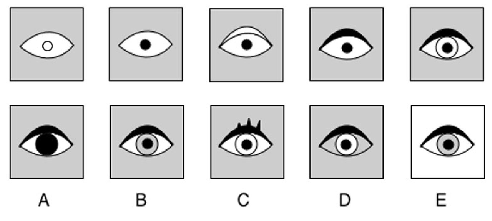

### Opciones disponibles

- **A.** A
- **B.** B
- **C.** C
- **D.** D
- **E.** E

---

### Respuesta y explicacion

La respuesta correcta es la **A**: A

Each shape that is hollow/white is colored black in the next frame.

In the first frame we see a pupil that is not colored and is eventually filled in frame 2.

In the next sequence an eyelid is added that at first is not colored (white) and the patterns repeats.

## Pregunta 101

Fuente: https://www.epsoprep.com/practice/attempt/en/UXVlc3Rpb25Qb29sQXR0ZW1wdDo3QXpzSUdDaVlrTUZyZ2plMHIwTnVn/review?q=1

### Enunciado

From the options available, please choose which diagram would come next in the series.

### Imagen

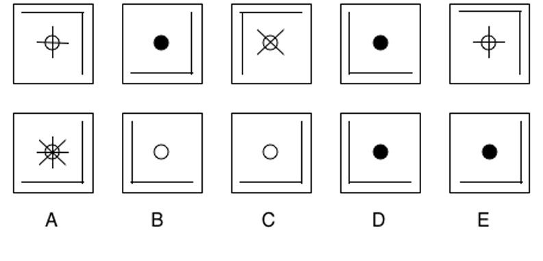

### Opciones disponibles

- **A.** A
- **B.** B
- **C.** C
- **D.** D
- **E.** E

---

### Respuesta y explicacion

La respuesta correcta es la **E**: E

The corner in the L shape moves clockwise by ¼ circle, then moves to the opposing corner of the frame, then moves counterclockwise by ¼ circle, then moves to the opposing corner of the frame, etc.

The circle alternates between white and black.

In each odd frame, there is a shape that alternates between a plus and a cross.

## Pregunta 102

Fuente: https://www.epsoprep.com/practice/attempt/en/UXVlc3Rpb25Qb29sQXR0ZW1wdDo3QXpzSUdDaVlrTUZyZ2plMHIwTnVn/review?q=2

### Enunciado

From the options available, please choose which diagram would come next in the series.

### Imagen

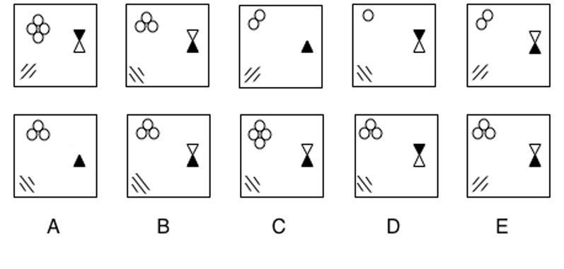

### Opciones disponibles

- **A.** A
- **B.** B
- **C.** C
- **D.** D
- **E.** E

---

### Respuesta y explicacion

La respuesta correcta es la **A**: A

The number of circles at the top left follows the pattern 4 -3 -2 -1 -2 -3 - 4 -3 – etc.

The set of triangles on the right follows the pattern: white bottom, white top, white missing, white bottom, white bottom, white top, white top, white missing, white missing, etc.

The slanted lines at the bottom left changes direction by ¼ circle each new frame (direction is irrelevant).

## Pregunta 103

Fuente: https://www.epsoprep.com/practice/attempt/en/UXVlc3Rpb25Qb29sQXR0ZW1wdDo3QXpzSUdDaVlrTUZyZ2plMHIwTnVn/review?q=3

### Enunciado

From the options available, please choose which diagram would come next in the series.

### Imagen

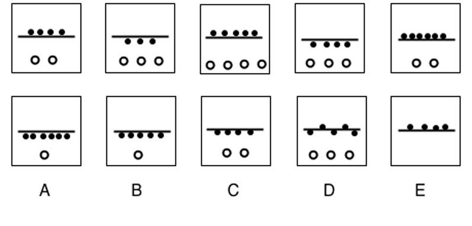

### Opciones disponibles

- **A.** A
- **B.** B
- **C.** C
- **D.** D
- **E.** E

---

### Respuesta y explicacion

La respuesta correcta es la **B**: B

The location of the black dots alternates between above and below the line.

The number of black dots decreases by one in the evenly numbered frames and then increases with two dots in odd frames. This pattern repeats. As we have 6 black dots in frame 5 we will be looking for 5 black dots in the next frame as the number should decrease by one per the rule.

The number of white circles increases by one by each frame until they reach frame 3 and start decreasing by one. We are therefore looking for a frame with one circle among the options.

## Pregunta 104

Fuente: https://www.epsoprep.com/practice/attempt/en/UXVlc3Rpb25Qb29sQXR0ZW1wdDo3QXpzSUdDaVlrTUZyZ2plMHIwTnVn/review?q=4

### Enunciado

From the options available, please choose which diagram would come next in the series.

### Imagen

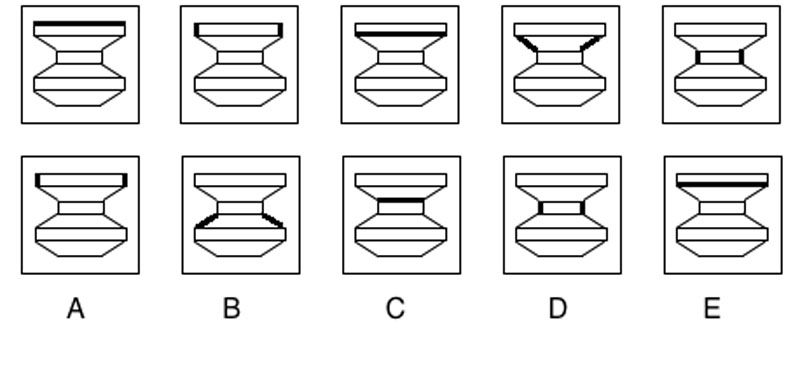

### Opciones disponibles

- **A.** A
- **B.** B
- **C.** C
- **D.** D
- **E.** E

---

### Respuesta y explicacion

La respuesta correcta es la **B**: B

In each frame, the thick line is lower than in the previous frame.

## Pregunta 105

Fuente: https://www.epsoprep.com/practice/attempt/en/UXVlc3Rpb25Qb29sQXR0ZW1wdDo3QXpzSUdDaVlrTUZyZ2plMHIwTnVn/review?q=5

### Enunciado

From the options available, please choose which diagram would come next in the series.

### Imagen

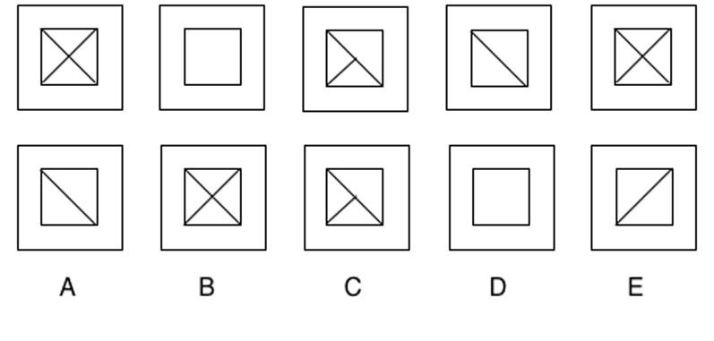

### Opciones disponibles

- **A.** A
- **B.** B
- **C.** C
- **D.** D
- **E.** E

---

### Respuesta y explicacion

La respuesta correcta es la **C**: C

The number of areas inside the square follows the sequence 4 – 1 – 3 – 2 – 4 – 3 – 1 – 4 – etc.

## Pregunta 106

Fuente: https://www.epsoprep.com/practice/attempt/en/UXVlc3Rpb25Qb29sQXR0ZW1wdDo3QXpzSUdDaVlrTUZyZ2plMHIwTnVn/review?q=6

### Enunciado

From the options available, please choose which diagram would come next in the series.

### Imagen

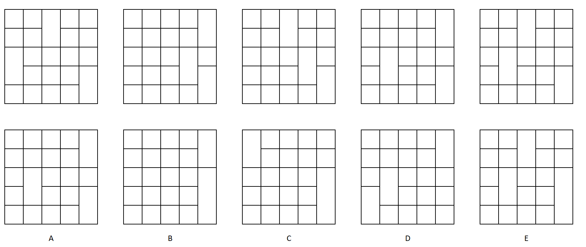

### Opciones disponibles

- **A.** A
- **B.** B
- **C.** C
- **D.** D
- **E.** E

---

### Respuesta y explicacion

La respuesta correcta es la **B**: B

In certain rows, the bottom line is removed. In the first row, the bottomless square moves 2 frames to the right in odd frames and 3 in the even frames.

The bottomless square in the third row moves three rows to the right in even frames and stays in place in odd frames.

The bottomless square in the fourth row always stays in place.

## Pregunta 107

Fuente: https://www.epsoprep.com/practice/attempt/en/UXVlc3Rpb25Qb29sQXR0ZW1wdDo3QXpzSUdDaVlrTUZyZ2plMHIwTnVn/review?q=7

### Enunciado

From the options available, please choose which diagram would come next in the series.

### Imagen

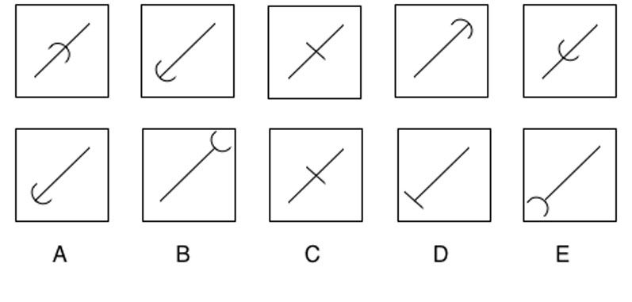

### Opciones disponibles

- **A.** A
- **B.** B
- **C.** C
- **D.** D
- **E.** E

---

### Respuesta y explicacion

La respuesta correcta es la **D**: D

The position where the short line crosses the long line moves from top to bottom and back at ½ length of the long line per frame.

The shape of the short line alternates between curved upward, curved downward, straight.

## Pregunta 108

Fuente: https://www.epsoprep.com/practice/attempt/en/UXVlc3Rpb25Qb29sQXR0ZW1wdDo3QXpzSUdDaVlrTUZyZ2plMHIwTnVn/review?q=8

### Enunciado

From the options available, please choose which diagram would come next in the series.

### Imagen

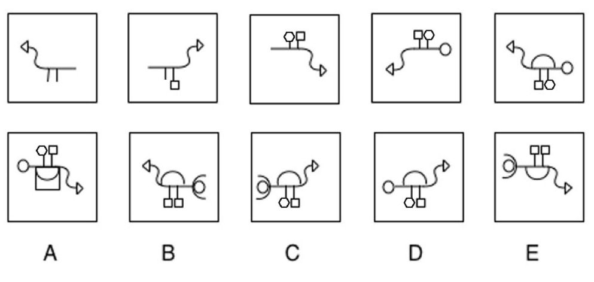

### Opciones disponibles

- **A.** A
- **B.** B
- **C.** C
- **D.** D
- **E.** E

---

### Respuesta y explicacion

La respuesta correcta es la **C**: C

The shape is alternately flipped along a vertical line and flipped along a horizontal line.

In each frame, one type of shape is added to the figure that was not in the figure before.

## Pregunta 109

Fuente: https://www.epsoprep.com/practice/attempt/en/UXVlc3Rpb25Qb29sQXR0ZW1wdDo3QXpzSUdDaVlrTUZyZ2plMHIwTnVn/review?q=9

### Enunciado

From the options available, please choose which diagram would come next in the series.

### Imagen

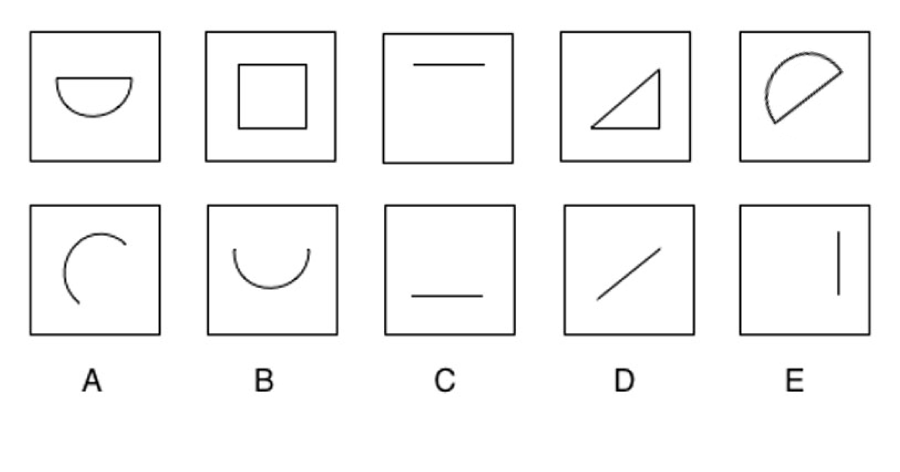

### Opciones disponibles

- **A.** A
- **B.** B
- **C.** C
- **D.** D
- **E.** E

---

### Respuesta y explicacion

La respuesta correcta es la **D**: D

The first two frames show two different shapes and the third frame shows the line that both shapes have in common.

In this case frame 4 and 5 have the diagonal line in common which is why the correct answer is D.

## Pregunta 110

Fuente: https://www.epsoprep.com/practice/attempt/en/UXVlc3Rpb25Qb29sQXR0ZW1wdDo3QXpzSUdDaVlrTUZyZ2plMHIwTnVn/review?q=10

### Enunciado

From the options available, please choose which diagram would come next in the series.

### Imagen

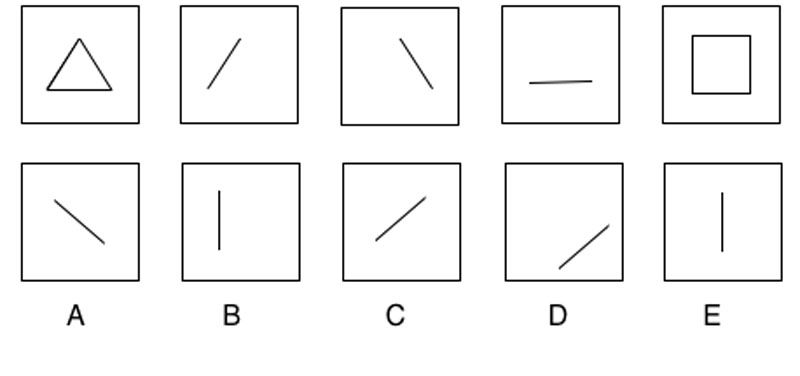

### Opciones disponibles

- **A.** A
- **B.** B
- **C.** C
- **D.** D
- **E.** E

---

### Respuesta y explicacion

La respuesta correcta es la **B**: B

A frame with a full shape is followed by each line that makes up the shape in the same position, with one line per frame.

As none of the other options represent a line that we can see in frame 5 the only correct option is B as it represents the left line of the square in frame 5.

## Pregunta 111

Fuente: https://www.epsoprep.com/practice/attempt/en/UXVlc3Rpb25Qb29sQXR0ZW1wdDo3QXpzSUdDaVlrTUZyZ2plMHIwTnVn/review?q=11

### Enunciado

From the options available, please choose which diagram would come next in the series.

### Imagen

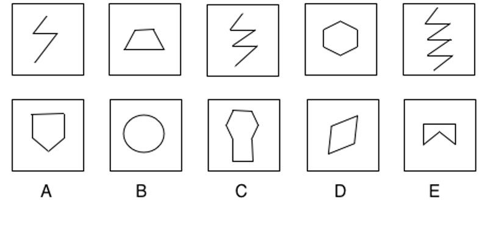

### Opciones disponibles

- **A.** A
- **B.** B
- **C.** C
- **D.** D
- **E.** E

---

### Respuesta y explicacion

La respuesta correcta es la **C**: C

The number of line pieces (separated by a corner from other line pieces) increases by one each frame.

## Pregunta 112

Fuente: https://www.epsoprep.com/practice/attempt/en/UXVlc3Rpb25Qb29sQXR0ZW1wdDo3QXpzSUdDaVlrTUZyZ2plMHIwTnVn/review?q=12

### Enunciado

From the options available, please choose which diagram would come next in the series.

### Imagen

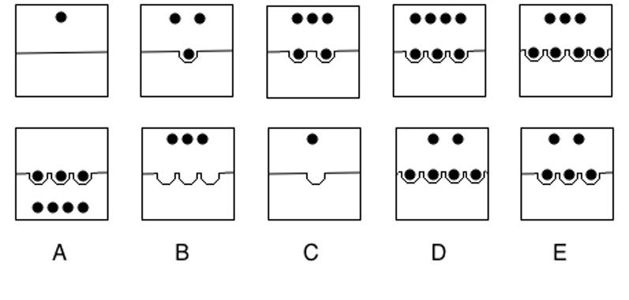

### Opciones disponibles

- **A.** A
- **B.** B
- **C.** C
- **D.** D
- **E.** E

---

### Respuesta y explicacion

La respuesta correcta es la **E**: E

The number of black circles at the top of a frame is the number of cavities with black circles in the line in the next frame.

The number of black circles at the top follows the pattern 1 – 2 – 3 – 4 – 3 - 2 - 1 -0 – 1 – etc.

## Pregunta 113

Fuente: https://www.epsoprep.com/practice/attempt/en/UXVlc3Rpb25Qb29sQXR0ZW1wdDo3QXpzSUdDaVlrTUZyZ2plMHIwTnVn/review?q=13

### Enunciado

From the options available, please choose which diagram would come next in the series.

### Imagen

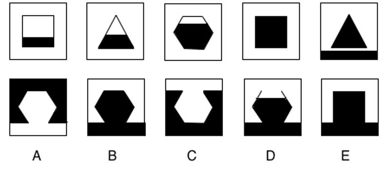

### Opciones disponibles

- **A.** A
- **B.** B
- **C.** C
- **D.** D
- **E.** E

---

### Respuesta y explicacion

La respuesta correcta es la **B**: B

The shape is open at the top and changes in the order square – trapezium – hexagon.

The shape is first ¼ full, then ½ full, then ¾ full, then 1/1 full, then the background is filled to halfway toward the bottom of the shape, and increases being filled at the same rate.

## Pregunta 114

Fuente: https://www.epsoprep.com/practice/attempt/en/UXVlc3Rpb25Qb29sQXR0ZW1wdDo3QXpzSUdDaVlrTUZyZ2plMHIwTnVn/review?q=14

### Enunciado

From the options available, please choose which diagram would come next in the series.

### Imagen

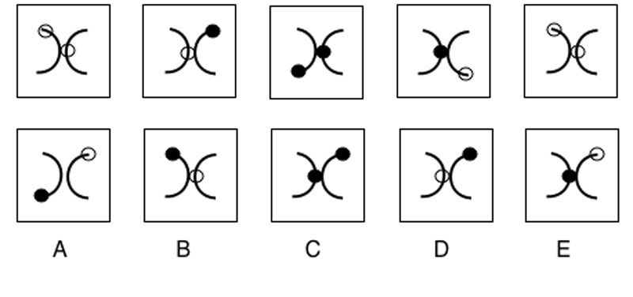

### Opciones disponibles

- **A.** A
- **B.** B
- **C.** C
- **D.** D
- **E.** E

---

### Respuesta y explicacion

La respuesta correcta es la **D**: D

Both circles move up and down the curve by ½ curve per frame.

When the left circle reaches the bottom, it becomes black and when it reaches the top, it becomes white.

When the right circle reaches the bottom, it becomes white and when it reaches the top, it becomes black.

## Pregunta 115

Fuente: https://www.epsoprep.com/practice/attempt/en/UXVlc3Rpb25Qb29sQXR0ZW1wdDo3QXpzSUdDaVlrTUZyZ2plMHIwTnVn/review?q=15

### Enunciado

From the options available, please choose which diagram would come next in the series.

### Imagen

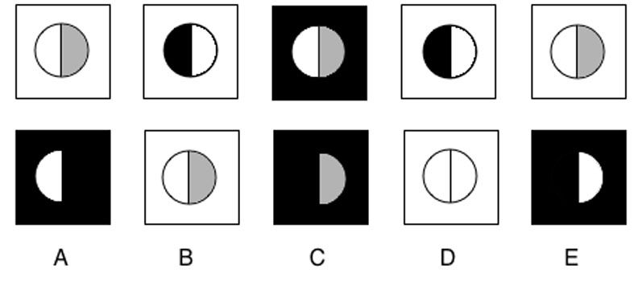

### Opciones disponibles

- **A.** A
- **B.** B
- **C.** C
- **D.** D
- **E.** E

---

### Respuesta y explicacion

La respuesta correcta es la **E**: E

The background is black every third frame.

The right half of the circle is gray every third frame.

The left side of the circle is black every second frame.

## Pregunta 116

Fuente: https://www.epsoprep.com/practice/attempt/en/UXVlc3Rpb25Qb29sQXR0ZW1wdDo3QXpzSUdDaVlrTUZyZ2plMHIwTnVn/review?q=16

### Enunciado

From the options available, please choose which diagram would come next in the series.

### Imagen

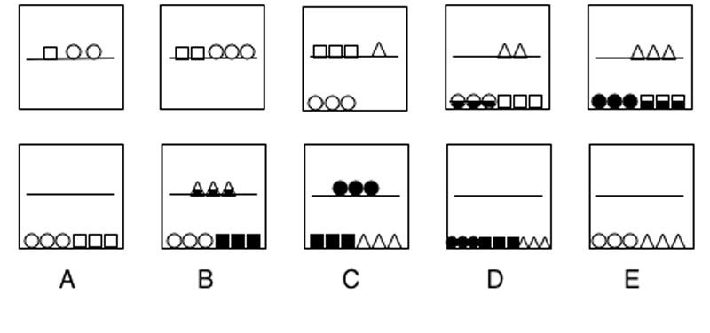

### Opciones disponibles

- **A.** A
- **B.** B
- **C.** C
- **D.** D
- **E.** E

---

### Respuesta y explicacion

La respuesta correcta es la **D**: D

Each set of shapes increases by one shape per frame unless it has three shapes, in which case it moves to the bottom of the frame.

At the bottom of the frame, the number of shapes in a set does not increase, but it becomes ½ shaded in the next frame and completely black in the frame after that.

## Pregunta 117

Fuente: https://www.epsoprep.com/practice/attempt/en/UXVlc3Rpb25Qb29sQXR0ZW1wdDo3QXpzSUdDaVlrTUZyZ2plMHIwTnVn/review?q=17

### Enunciado

From the options available, please choose which diagram would come next in the series.

### Imagen

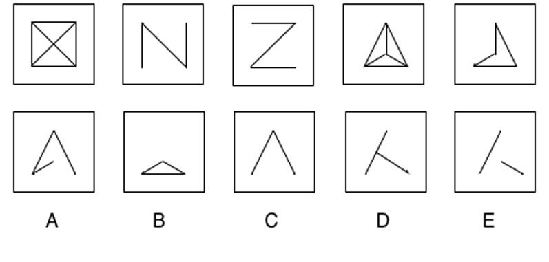

### Opciones disponibles

- **A.** A
- **B.** B
- **C.** C
- **D.** D
- **E.** E

---

### Respuesta y explicacion

La respuesta correcta es la **E**: E

The first frame shows a shape, the second frame shows a number of lines that are part of this shape, but not all.

The third frame shows the lines that make up the shape from the first frame, but not the lines that are already shown in the second frame. This repeats itself.

## Pregunta 118

Fuente: https://www.epsoprep.com/practice/attempt/en/UXVlc3Rpb25Qb29sQXR0ZW1wdDo3QXpzSUdDaVlrTUZyZ2plMHIwTnVn/review?q=18

### Enunciado

From the options available, please choose which diagram would come next in the series.

### Imagen

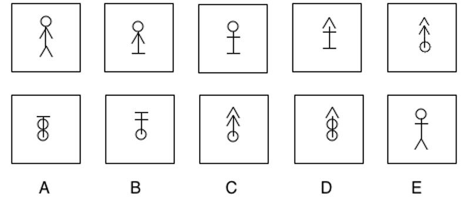

### Opciones disponibles

- **A.** A
- **B.** B
- **C.** C
- **D.** D
- **E.** E

---

### Respuesta y explicacion

La respuesta correcta es la **C**: C

There are three elements of the body that can change throughout the frames. The head, the arms and the legs.

They can be represented with different shapes like an arrow (like the arms and the legs are in frame 1), a straight line like in frame 3 or circle like the head is in frames 1 to 3.

The shapes change but they do not change with the same frequency.

The top shape (circle) retains its shape for three frames and then changes as illustrated by fram 1 to 3. This means that it will have to remain an arrow in frame 6.

The second shape from the top (the arms) changes after 2 shapes. This means that it too will retain its shape from frame 5 to frame 6

The bottom figure changes after 3 frames. As it has just changed shape in frame 5 we expect it to retain its shape in frame 6 as well.

THis means that none of the three shapes are going to change.

## Pregunta 119

Fuente: https://www.epsoprep.com/practice/attempt/en/UXVlc3Rpb25Qb29sQXR0ZW1wdDo3QXpzSUdDaVlrTUZyZ2plMHIwTnVn/review?q=19

### Enunciado

From the options available, please choose which diagram would come next in the series.

### Imagen

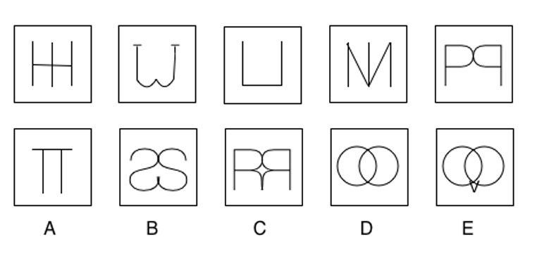

### Opciones disponibles

- **A.** A
- **B.** B
- **C.** C
- **D.** D
- **E.** E

---

### Respuesta y explicacion

La respuesta correcta es la **C**: C

Each frame is a set of a letter from the alphabet and its mirror image.

Each successive frame, one letter of the alphabet is skipped and the next one is shown.

As the next letter after P is Q is skipped the letter after and the correct answer is R

## Pregunta 120

Fuente: https://www.epsoprep.com/practice/attempt/en/UXVlc3Rpb25Qb29sQXR0ZW1wdDo3QXpzSUdDaVlrTUZyZ2plMHIwTnVn/review?q=20

### Enunciado

From the options available, please choose which diagram would come next in the series.

### Imagen

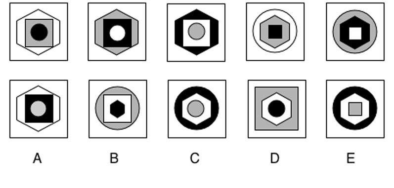

### Opciones disponibles

- **A.** A
- **B.** B
- **C.** C
- **D.** D
- **E.** E

---

### Respuesta y explicacion

La respuesta correcta es la **E**: E

The three shapes are the same for three frames.

The first of the three, the smallest is black, the second smallest is gray and the largest is white. In the second, the smallest is white, the second smallest is black and the largest is gray.

In the third, the smallest is gray, the second smallest is white and the largest is black.

Then the smallest shape becomes the largest, the largest becomes the second smallest and the second smallest becomes the smallest shape.

The process repeats.

## Pregunta 121

Fuente: https://www.epsoprep.com/practice/attempt/en/UXVlc3Rpb25Qb29sQXR0ZW1wdDo3QXpzSUdDaVlrTUZyZ2plMHIwTnVn/review?q=21

### Enunciado

From the options available, please choose which diagram would come next in the series.

### Imagen

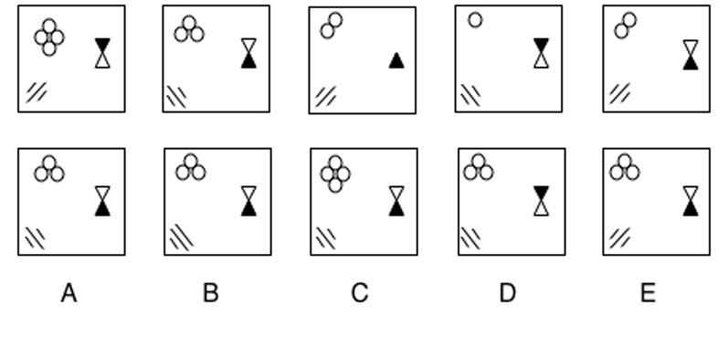

### Opciones disponibles

- **A.** A
- **B.** B
- **C.** C
- **D.** D
- **E.** E

---

### Respuesta y explicacion

La respuesta correcta es la **A**: A

The black half alternates between the top and bottom between frames. The number of circles increases by one each frame, where the location of the new circle moves clockwise at one corner per frame and the new circle is placed at the same height as its neighbour, towards the center of the frame.

## Pregunta 122

Fuente: https://www.epsoprep.com/practice/attempt/en/UXVlc3Rpb25Qb29sQXR0ZW1wdDo3QXpzSUdDaVlrTUZyZ2plMHIwTnVn/review?q=22

### Enunciado

From the options available, please choose which diagram would come next in the series.

### Imagen

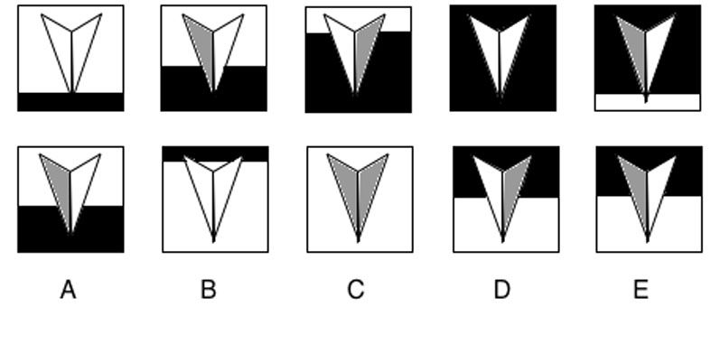

### Opciones disponibles

- **A.** A
- **B.** B
- **C.** C
- **D.** D
- **E.** E

---

### Respuesta y explicacion

La respuesta correcta es la **D**: D

The background changes colour, starting at the bottom, at a pace of ¼ frame height per frame.

When it has changed colour completely, it changes back, starting at the bottom, at the same pace.

The arrow shape alternates between empty, gray left side, gray right side, etc.

## Pregunta 123

Fuente: https://www.epsoprep.com/practice/attempt/en/UXVlc3Rpb25Qb29sQXR0ZW1wdDo3QXpzSUdDaVlrTUZyZ2plMHIwTnVn/review?q=23

### Enunciado

From the options available, please choose which diagram would come next in the series.

### Imagen

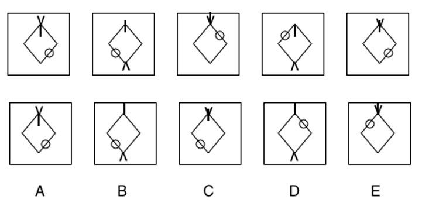

### Opciones disponibles

- **A.** A
- **B.** B
- **C.** C
- **D.** D
- **E.** E

---

### Respuesta y explicacion

La respuesta correcta es la **B**: B

The ‘v’ shape alternates between being at the top of the diamond and at its bottom.

The vertical line moves between three different vertical positions, the middle position intersecting the diamond.

The white circle moves clockwise by one side of the diamond, then moves to the opposite side of the diamond, then moves counterclockwise by one side of the diamond, then moves to the opposite side of the diamond, etc.

## Pregunta 124

Fuente: https://www.epsoprep.com/practice/attempt/en/UXVlc3Rpb25Qb29sQXR0ZW1wdDo3QXpzSUdDaVlrTUZyZ2plMHIwTnVn/review?q=24

### Enunciado

From the options available, please choose which diagram would come next in the series.

### Imagen

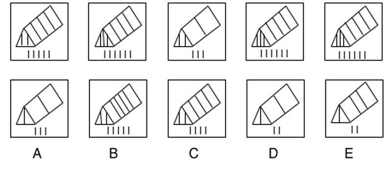

### Opciones disponibles

- **A.** A
- **B.** B
- **C.** C
- **D.** D
- **E.** E

---

### Respuesta y explicacion

La respuesta correcta es la **D**: D

The number of vertical arrows on the tent that are not part of the tent’s outline is equal to the number of vertical lines at the bottom.

So for example in frame one we see two lines at the short side of the entrance and three lines ate the long side of the tent. Therefore we should se 2+3 = 5 lines at the bottom of the frame.

## Pregunta 125

Fuente: https://www.epsoprep.com/practice/attempt/en/UXVlc3Rpb25Qb29sQXR0ZW1wdDo3QXpzSUdDaVlrTUZyZ2plMHIwTnVn/review?q=25

### Enunciado

From the options available, please choose which diagram would come next in the series.

### Imagen

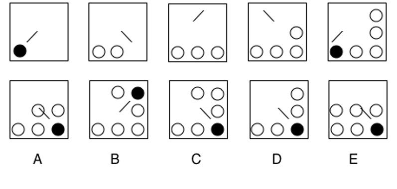

### Opciones disponibles

- **A.** A
- **B.** B
- **C.** C
- **D.** D
- **E.** E

---

### Respuesta y explicacion

La respuesta correcta es la **C**: C

The slanted line moves counterclockwise at ¼ circle per frame.

If there is a circle in the direction that the line points to (outward), this circle is black.

One circle per frame is added along the edge of the frame in a counterclockwise direction.

## Pregunta 126

Fuente: https://www.epsoprep.com/practice/attempt/en/UXVlc3Rpb25Qb29sQXR0ZW1wdDo3QXpzSUdDaVlrTUZyZ2plMHIwTnVn/review?q=26

### Enunciado

From the options available, please choose which diagram would come next in the series.

### Imagen

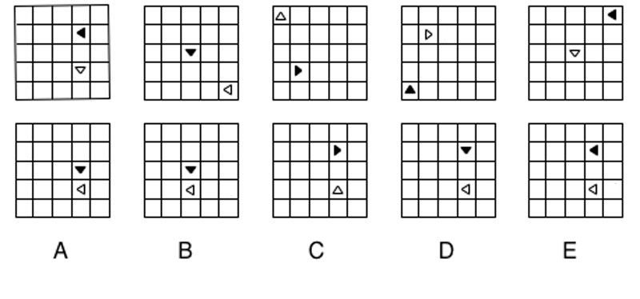

### Opciones disponibles

- **A.** A
- **B.** B
- **C.** C
- **D.** D
- **E.** E

---

### Respuesta y explicacion

La respuesta correcta es la **D**: D

The black triangle moves one square down and one square left and turns counterclockwise ¼ circle each frame.

The white triangle moves one square down and one square right and turns clockwise ¼ circle each frame.

All triangles move along a diagonal path: when a triangle reaches the edge of the grid it continues at the beginning of its diagonal path.

## Pregunta 127

Fuente: https://www.epsoprep.com/practice/attempt/en/UXVlc3Rpb25Qb29sQXR0ZW1wdDo3QXpzSUdDaVlrTUZyZ2plMHIwTnVn/review?q=27

### Enunciado

From the options available, please choose which diagram would come next in the series.

### Imagen

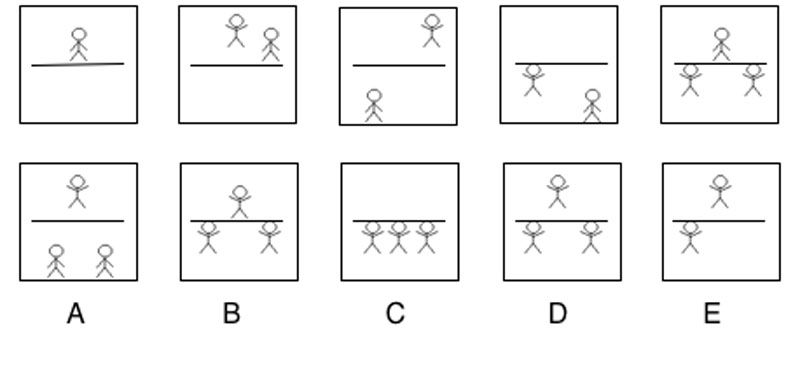

### Opciones disponibles

- **A.** A
- **B.** B
- **C.** C
- **D.** D
- **E.** E

---

### Respuesta y explicacion

La respuesta correcta es la **D**: D

A stick figure that is on the line is going to be above the line with the arms up in the next frame, as we see with the left figure in frame 2.

In the next frame, the same figure will appear at the bottom of the frame as we see in frame 3 with the figure in the bottom left corner.

The next move will be to appear below the line with arms up touching the line as seen with the left figure in frame 4. Lastly, it will stay in that position.

The correct answer, therefore, has to have two figures just below the line with their arms up. It also has to have a figure with the arms up above the line AND jumping as we saw that pattern between frame 1 and 2.

## Pregunta 128

Fuente: https://www.epsoprep.com/practice/attempt/en/UXVlc3Rpb25Qb29sQXR0ZW1wdDo3QXpzSUdDaVlrTUZyZ2plMHIwTnVn/review?q=28

### Enunciado

From the options available, please choose which diagram would come next in the series.

### Imagen

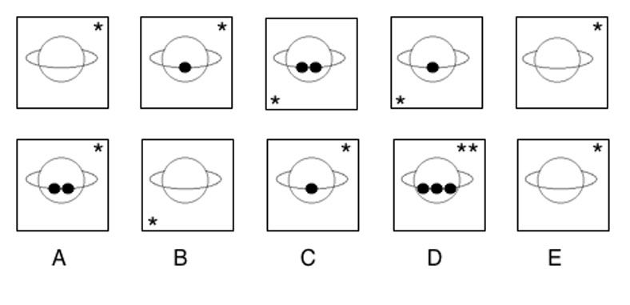

### Opciones disponibles

- **A.** A
- **B.** B
- **C.** C
- **D.** D
- **E.** E

---

### Respuesta y explicacion

La respuesta correcta es la **C**: C

If a star appears in the right top corner, the number of black circles on the elliptical line increases by one.

If a star appears in the left bottom corner, the number of black circles on the elliptical line decreases by one.

## Pregunta 129

Fuente: https://www.epsoprep.com/practice/attempt/en/UXVlc3Rpb25Qb29sQXR0ZW1wdDo3QXpzSUdDaVlrTUZyZ2plMHIwTnVn/review?q=29

### Enunciado

From the options available, please choose which diagram would come next in the series.

### Imagen

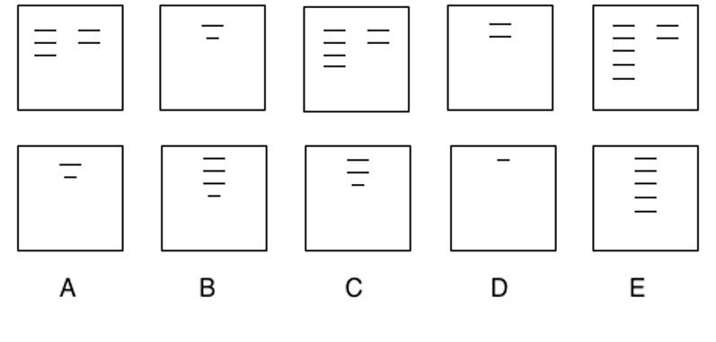

### Opciones disponibles

- **A.** A
- **B.** B
- **C.** C
- **D.** D
- **E.** E

---

### Respuesta y explicacion

La respuesta correcta es la **C**: C

The number of lines in even frames is equal to the number of lines in the previous frame on the left divided by the number of lines in the previous frame on the right.

Half-length lines represent halves. In the odd frames, the number of lines on the left increases by one each odd frame, the number on the right is always two.

## Pregunta 130

Fuente: https://www.epsoprep.com/practice/attempt/en/UXVlc3Rpb25Qb29sQXR0ZW1wdDo3QXpzSUdDaVlrTUZyZ2plMHIwTnVn/review?q=30

### Enunciado

From the options available, please choose which diagram would come next in the series.

### Imagen

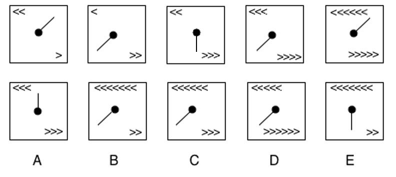

### Opciones disponibles

- **A.** A
- **B.** B
- **C.** C
- **D.** D
- **E.** E

---

### Respuesta y explicacion

La respuesta correcta es la **D**: D

The slanted line with a dot at the centre of the frame turns clockwise ½ circle in the first frame transition, then counterclockwise 1/8 circle, then clockwise 1/8 circle, then counterclockwise ½ circle.

This process repeats. The lower number of arrows increases by one per frame.

The upper number of arrows is one larger than the lower number if the slanted line points up, one smaller than the lower number if the slanted line points down.

## Pregunta 131

Fuente: https://www.epsoprep.com/practice/attempt/en/UXVlc3Rpb25Qb29sQXR0ZW1wdDo3QXpzSUdDaVlrTUZyZ2plMHIwTnVn/review?q=31

### Enunciado

From the options available, please choose which diagram would come next in the series.

### Imagen

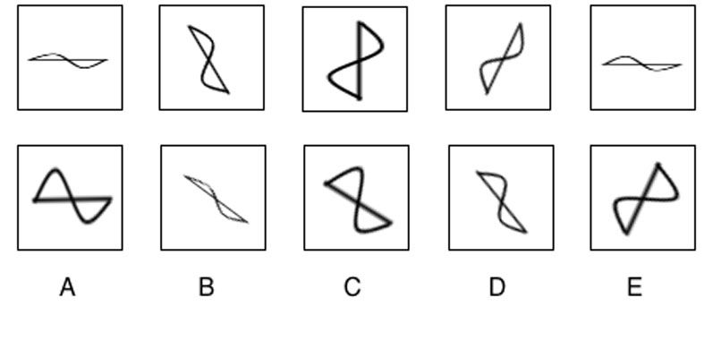

### Opciones disponibles

- **A.** A
- **B.** B
- **C.** C
- **D.** D
- **E.** E

---

### Respuesta y explicacion

La respuesta correcta es la **D**: D

The figure has three versions: narrow, medium and wide.

Each frame the versions follow the pattern narrow – medium – wide – medium – narrow – medium – etc.

The figure turns clockwise at 1/8 of a circle per frame.

## Pregunta 132

Fuente: https://www.epsoprep.com/practice/attempt/en/UXVlc3Rpb25Qb29sQXR0ZW1wdDo3QXpzSUdDaVlrTUZyZ2plMHIwTnVn/review?q=32

### Enunciado

From the options available, please choose which diagram would come next in the series.

### Imagen

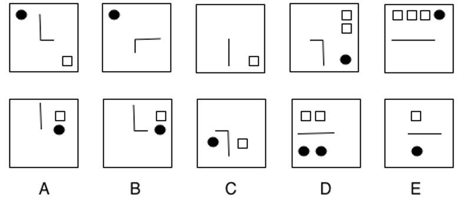

### Opciones disponibles

- **A.** A
- **B.** B
- **C.** C
- **D.** D
- **E.** E

---

### Respuesta y explicacion

La respuesta correcta es la **A**: A

The minute hand moves at one-quarter hour per frame if a black dot appears.

The hour hand moves as many quarters of an hour per frame as there are white squares in the frame.

## Pregunta 133

Fuente: https://www.epsoprep.com/practice/attempt/en/UXVlc3Rpb25Qb29sQXR0ZW1wdDo3QXpzSUdDaVlrTUZyZ2plMHIwTnVn/review?q=33

### Enunciado

From the options available, please choose which diagram would come next in the series.

### Imagen

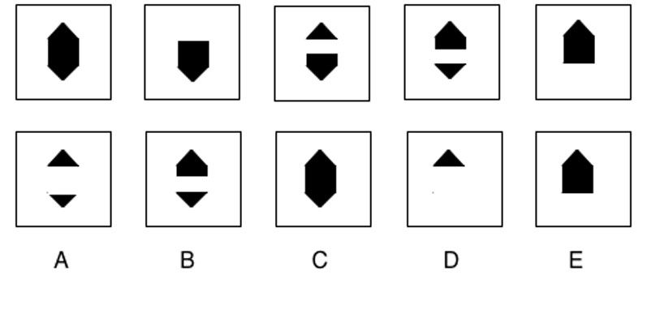

### Opciones disponibles

- **A.** A
- **B.** B
- **C.** C
- **D.** D
- **E.** E

---

### Respuesta y explicacion

La respuesta correcta es la **C**: C

The shape is fully visible, then the top ¼ is invisible, then the second ¼ is invisible, and so on until the shape is fully visible again.

## Pregunta 134

Fuente: https://www.epsoprep.com/practice/attempt/en/UXVlc3Rpb25Qb29sQXR0ZW1wdDo3QXpzSUdDaVlrTUZyZ2plMHIwTnVn/review?q=34

### Enunciado

From the options available, please choose which diagram would come next in the series.

### Imagen

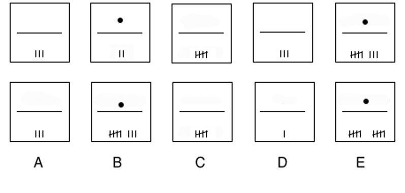

### Opciones disponibles

- **A.** A
- **B.** B
- **C.** C
- **D.** D
- **E.** E

---

### Respuesta y explicacion

La respuesta correcta es la **C**: C

The number of lines at the bottom of the frame alternately increases and decreases by the number in the previous frame. Frame 3 has 5 lines as the lines from Frame 1 & 2 are summed.

Frame 4 holds 3 lines as we now decrease the number of lines from frame 3 with the number of lines from frame 2.

Finally, in frame 5 we increase the number of lines by summing up the lines from the previous two frames.

The dot appears every time the number of lines is an even number.

## Pregunta 135

Fuente: https://www.epsoprep.com/practice/attempt/en/UXVlc3Rpb25Qb29sQXR0ZW1wdDo3QXpzSUdDaVlrTUZyZ2plMHIwTnVn/review?q=35

### Enunciado

From the options available, please choose which diagram would come next in the series.

### Imagen

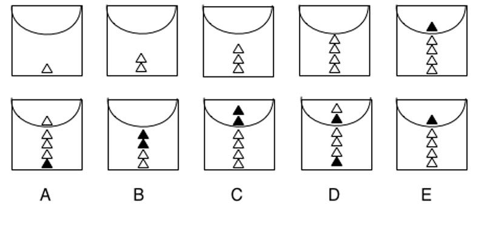

### Opciones disponibles

- **A.** A
- **B.** B
- **C.** C
- **D.** D
- **E.** E

---

### Respuesta y explicacion

La respuesta correcta es la **C**: C

The number of triangles increases and each new triangle is placed on top of the previous one.

The curved line at the top does not change.

Triangles that are placed above the curved line are black.

## Pregunta 136

Fuente: https://www.epsoprep.com/practice/attempt/en/UXVlc3Rpb25Qb29sQXR0ZW1wdDo3QXpzSUdDaVlrTUZyZ2plMHIwTnVn/review?q=36

### Enunciado

From the options available, please choose which diagram would come next in the series.

### Imagen

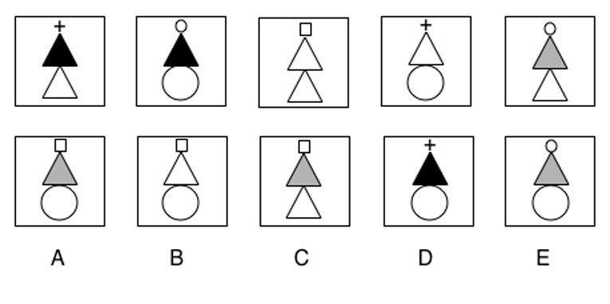

### Opciones disponibles

- **A.** A
- **B.** B
- **C.** C
- **D.** D
- **E.** E

---

### Respuesta y explicacion

La respuesta correcta es la **A**: A

The top shape alternates between plus-circle –square.

The middle shape is a triangle that is black for two frames, then white for two frames, then gray for two frames, etc.

The bottom shape alternates between triangle and circle.

## Pregunta 137

Fuente: https://www.epsoprep.com/practice/attempt/en/UXVlc3Rpb25Qb29sQXR0ZW1wdDo3QXpzSUdDaVlrTUZyZ2plMHIwTnVn/review?q=37

### Enunciado

From the options available, please choose which diagram would come next in the series.

### Imagen

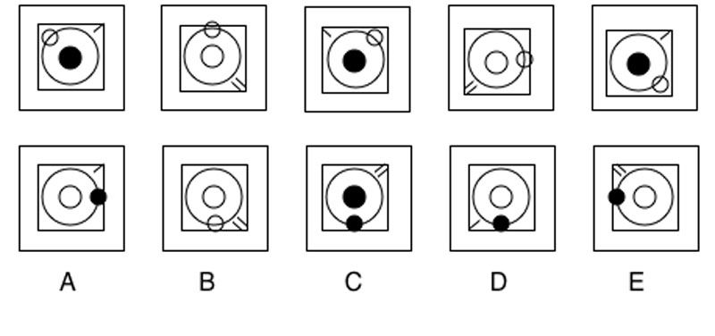

### Opciones disponibles

- **A.** A
- **B.** B
- **C.** C
- **D.** D
- **E.** E

---

### Respuesta y explicacion

La respuesta correcta es la **B**: B

The odd frames alternate between a slanted line in the right top corner and in the left top corner.

The even frames alternate between two slanted lines in the right bottom corner and the left bottom corner.

The small circle alternates between black in odd frames and white in even frames.

## Pregunta 138

Fuente: https://www.epsoprep.com/practice/attempt/en/UXVlc3Rpb25Qb29sQXR0ZW1wdDo3QXpzSUdDaVlrTUZyZ2plMHIwTnVn/review?q=38

### Enunciado

From the options available, please choose which diagram would come next in the series.

### Imagen

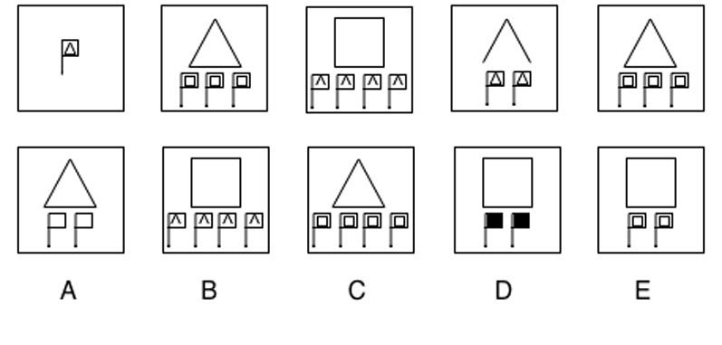

### Opciones disponibles

- **A.** A
- **B.** B
- **C.** C
- **D.** D
- **E.** E

---

### Respuesta y explicacion

La respuesta correcta es la **B**: B

The shape inside the flag(s) is the same shape as the large shape in the next frame.

Below each large shape are as many flags as there are sides.

## Pregunta 139

Fuente: https://www.epsoprep.com/practice/attempt/en/UXVlc3Rpb25Qb29sQXR0ZW1wdDo3QXpzSUdDaVlrTUZyZ2plMHIwTnVn/review?q=39

### Enunciado

From the options available, please choose which diagram would come next in the series.

### Imagen

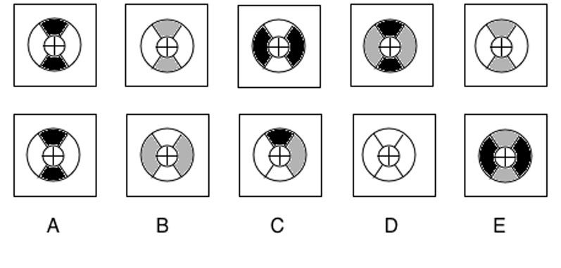

### Opciones disponibles

- **A.** A
- **B.** B
- **C.** C
- **D.** D
- **E.** E

---

### Respuesta y explicacion

La respuesta correcta es la **D**: D

The upper and lower sections of the outer circle are coloured black – gray – white – black – gray – white – etc.

The left and right sections are coloured white – white – black – gray – white – white- black – gray. The rest of the figure does not change.

## Pregunta 140

Fuente: https://www.epsoprep.com/practice/attempt/en/UXVlc3Rpb25Qb29sQXR0ZW1wdDo3QXpzSUdDaVlrTUZyZ2plMHIwTnVn/review?q=40

### Enunciado

From the options available, please choose which diagram would come next in the series.

### Imagen

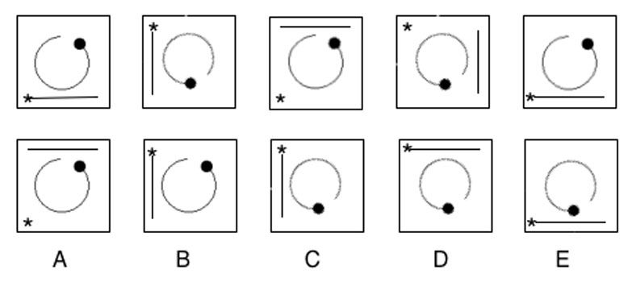

### Opciones disponibles

- **A.** A
- **B.** B
- **C.** C
- **D.** D
- **E.** E

---

### Respuesta y explicacion

La respuesta correcta es la **C**: C

The gap in the circle moves clockwise by 3/8 circle per frame.

On the clockwise side of the gap is a black circle.

The line moves clockwise from side to side at one side per frame.

The star alternates between the bottom left and top left.

## Pregunta 141

Fuente: https://www.epsoprep.com/practice/attempt/en/UXVlc3Rpb25Qb29sQXR0ZW1wdDo5enE5WWJ4ZG5rOERiQWplMHIwTnVn/review?q=1

### Enunciado

From the options available, please choose which diagram would come next in the series.

### Imagen

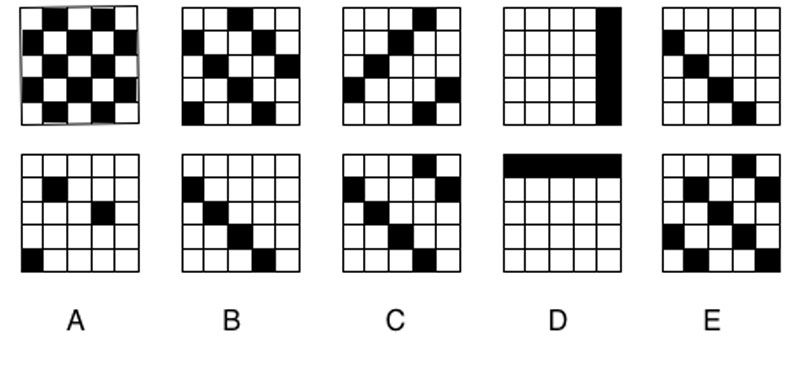

### Opciones disponibles

- **A.** A
- **B.** B
- **C.** C
- **D.** D
- **E.** E

---

### Respuesta y explicacion

La respuesta correcta es la **A**: A

In the first frame, a square is coloured black every two frames.

In the next frame, a square is coloured black every three frames.

In the next frame, a square is coloured black every four frames, etc.

The counting starts from the first square every frame and is not inherited from the previous frames.

## Pregunta 142

Fuente: https://www.epsoprep.com/practice/attempt/en/UXVlc3Rpb25Qb29sQXR0ZW1wdDo5enE5WWJ4ZG5rOERiQWplMHIwTnVn/review?q=2

### Enunciado

From the options available, please choose which diagram would come next in the series.

### Imagen

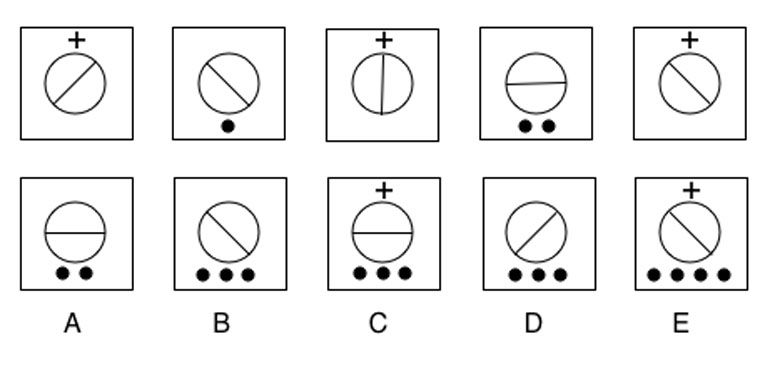

### Opciones disponibles

- **A.** A
- **B.** B
- **C.** C
- **D.** D
- **E.** E

---

### Respuesta y explicacion

La respuesta correcta es la **D**: D

Odd frames have a plus at the top, even frames have a number of dots at the bottom that increases by one each even frame.

The line in the circle turns clockwise by 1/8 circle in odd frames and 1/4 anti-clockwise in even frames.

## Pregunta 143

Fuente: https://www.epsoprep.com/practice/attempt/en/UXVlc3Rpb25Qb29sQXR0ZW1wdDo5enE5WWJ4ZG5rOERiQWplMHIwTnVn/review?q=3

### Enunciado

From the options available, please choose which diagram would come next in the series.

### Imagen

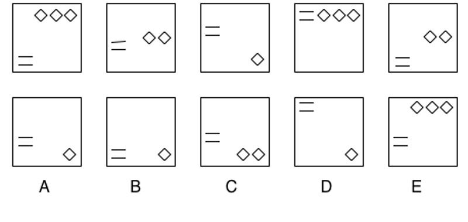

### Opciones disponibles

- **A.** A
- **B.** B
- **C.** C
- **D.** D
- **E.** E

---

### Respuesta y explicacion

La respuesta correcta es la **A**: A

The two horizontal lines can be in four positions and move up by one position per frame. When they reach the edge of the frame, they continue in the opposite direction.

The diamonds can be in three positions and move down by one position per frame. When they reach the edge of the frame, they continue in the opposite direction.

The number of diamonds follows the pattern 3, 2, 1, 3, 2, 1, 3, 2, 1, etc.

## Pregunta 144

Fuente: https://www.epsoprep.com/practice/attempt/en/UXVlc3Rpb25Qb29sQXR0ZW1wdDo5enE5WWJ4ZG5rOERiQWplMHIwTnVn/review?q=4

### Enunciado

From the options available, please choose which diagram would come next in the series.

### Imagen

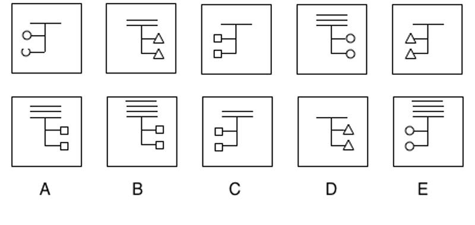

### Opciones disponibles

- **A.** A
- **B.** B
- **C.** C
- **D.** D
- **E.** E

---

### Respuesta y explicacion

La respuesta correcta es la **B**: B

The number of long horizontal lines follows the pattern 1, 2, 1, 3, 1, 4, 1, 5, etc.

The direction of the short horizontal lines alternates between left and right.

The shapes at the ends of the short horizontal lines alternate between circle, triangle, square, etc.

## Pregunta 145

Fuente: https://www.epsoprep.com/practice/attempt/en/UXVlc3Rpb25Qb29sQXR0ZW1wdDo5enE5WWJ4ZG5rOERiQWplMHIwTnVn/review?q=5

### Enunciado

From the options available, please choose which diagram would come next in the series.

### Imagen

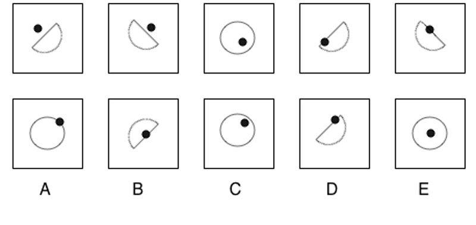

### Opciones disponibles

- **A.** A
- **B.** B
- **C.** C
- **D.** D
- **E.** E

---

### Respuesta y explicacion

La respuesta correcta es la **C**: C

The black dot moves clockwise around the center at ¼ circle per frame.

The white shape starts with the round part facing the bottom right, then moves clockwise by ¼ circle, then becomes a full circle.

The black dot does not cross the line of the full circle just like in the third frame.

## Pregunta 146

Fuente: https://www.epsoprep.com/practice/attempt/en/UXVlc3Rpb25Qb29sQXR0ZW1wdDo5enE5WWJ4ZG5rOERiQWplMHIwTnVn/review?q=6

### Enunciado

From the options available, please choose which diagram would come next in the series.

### Imagen

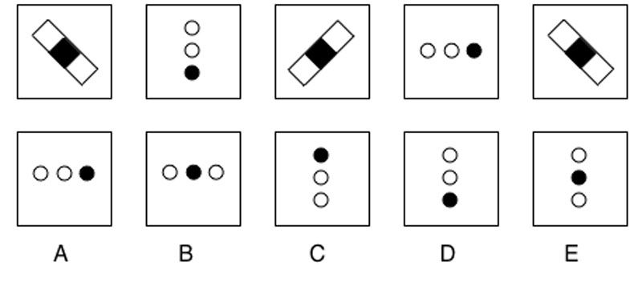

### Opciones disponibles

- **A.** A
- **B.** B
- **C.** C
- **D.** D
- **E.** E

---

### Respuesta y explicacion

La respuesta correcta es la **C**: C

Odd frames consist of three squares next to each other in a line, even frames consist of three dots next to each other in a line.

The direction of the line changes clockwise by 45 degrees per frame.

Inside the three shapes, regardless if they are circles or squares, the shape that is coloured black moves from one end of the line to the other end of the line and back, one shape per frame.

The correct answer is thus option C as the black shape is moving "upwards".

## Pregunta 147

Fuente: https://www.epsoprep.com/practice/attempt/en/UXVlc3Rpb25Qb29sQXR0ZW1wdDo5enE5WWJ4ZG5rOERiQWplMHIwTnVn/review?q=7

### Enunciado

From the options available, please choose which diagram would come next in the series.

### Imagen

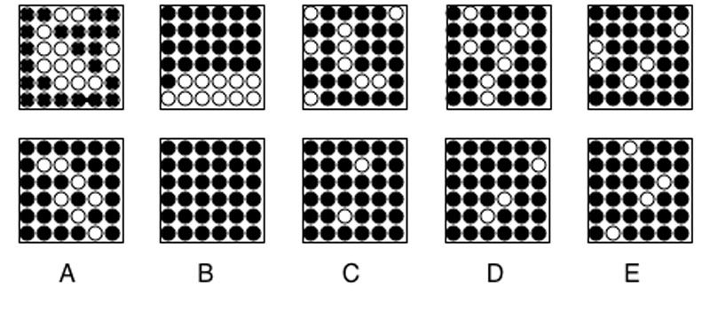

### Opciones disponibles

- **A.** A
- **B.** B
- **C.** C
- **D.** D
- **E.** E

---

### Respuesta y explicacion

La respuesta correcta es la **D**: D

In each frame, the number of white circles is reduced by 2.

Frame one contains 13 circles, frame two 11, frame 3 has 9.

As the last frame only contains 5 circles we should be looking for an alternative that holds 3 circles.

That is option D.

## Pregunta 148

Fuente: https://www.epsoprep.com/practice/attempt/en/UXVlc3Rpb25Qb29sQXR0ZW1wdDo5enE5WWJ4ZG5rOERiQWplMHIwTnVn/review?q=8

### Enunciado

From the options available, please choose which diagram would come next in the series.

### Imagen

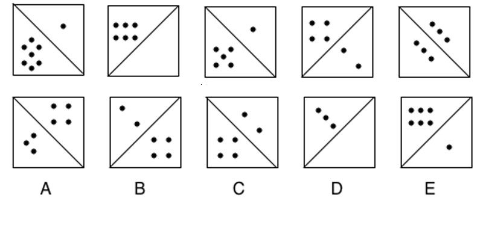

### Opciones disponibles

- **A.** A
- **B.** B
- **C.** C
- **D.** D
- **E.** E

---

### Respuesta y explicacion

La respuesta correcta es la **B**: B

The diagonal line moves by ¼ circle each frame (direction is irrelevant).

The number of dots that is above the diagonal in even frames moves below the diagonal in odd frames and the number decreases by one each frame.

The number of dots below the diagonal in even frames moves above the diagonal in odd frames and the number increases by one each frame.

## Pregunta 149

Fuente: https://www.epsoprep.com/practice/attempt/en/UXVlc3Rpb25Qb29sQXR0ZW1wdDo5enE5WWJ4ZG5rOERiQWplMHIwTnVn/review?q=9

### Enunciado

From the options available, please choose which diagram would come next in the series.

### Imagen

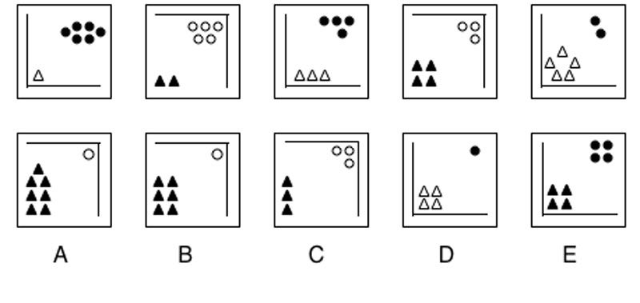

### Opciones disponibles

- **A.** A
- **B.** B
- **C.** C
- **D.** D
- **E.** E

---

### Respuesta y explicacion

La respuesta correcta es la **B**: B

The L shape alternates between the bottom left and top right.

The triangles are bottom left and alternate between white and black. Their number increases by one per frame.

The circles are top right and alternate between black and white. Their number decreases by one per frame.

## Pregunta 150

Fuente: https://www.epsoprep.com/practice/attempt/en/UXVlc3Rpb25Qb29sQXR0ZW1wdDo5enE5WWJ4ZG5rOERiQWplMHIwTnVn/review?q=10

### Enunciado

From the options available, please choose which diagram would come next in the series.

### Imagen

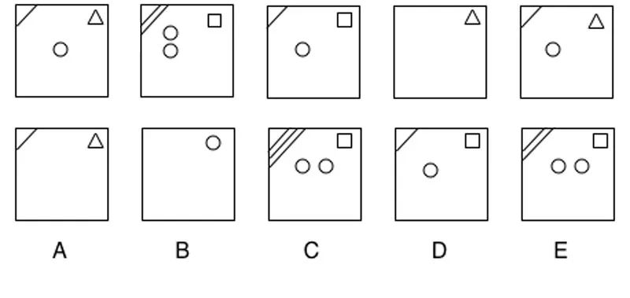

### Opciones disponibles

- **A.** A
- **B.** B
- **C.** C
- **D.** D
- **E.** E

---

### Respuesta y explicacion

La respuesta correcta es la **E**: E

The number of lines follows the pattern 1, 2, 1, 0, 1, 2, 1, 0, etc.

The same is true for the number of circles.

There are two frames with a square followed by two frames with a triangle, etc.

## Pregunta 151

Fuente: https://www.epsoprep.com/practice/attempt/en/UXVlc3Rpb25Qb29sQXR0ZW1wdDo5enE5WWJ4ZG5rOERiQWplMHIwTnVn/review?q=11

### Enunciado

From the options available, please choose which diagram would come next in the series.

### Imagen

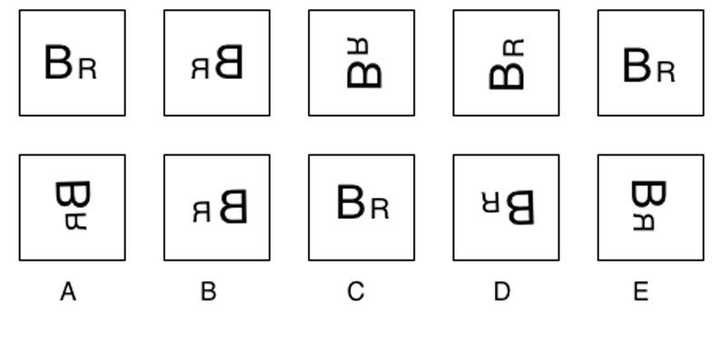

### Opciones disponibles

- **A.** A
- **B.** B
- **C.** C
- **D.** D
- **E.** E

---

### Respuesta y explicacion

La respuesta correcta es la **B**: B

In the first transition, the image is flipped along a vertical axis, in the next transition it moves clockwise by ¼ circle. This repeats.

## Pregunta 152

Fuente: https://www.epsoprep.com/practice/attempt/en/UXVlc3Rpb25Qb29sQXR0ZW1wdDo5enE5WWJ4ZG5rOERiQWplMHIwTnVn/review?q=12

### Enunciado

From the options available, please choose which diagram would come next in the series.

### Imagen

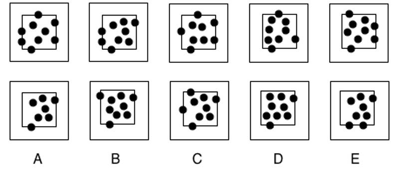

### Opciones disponibles

- **A.** A
- **B.** B
- **C.** C
- **D.** D
- **E.** E

---

### Respuesta y explicacion

La respuesta correcta es la **D**: D

In the first transition, two dots on the line move inside the square.

In the second transition, one dot inside the square moves on the line. This repeats.

We can therefore see that in diagram 1 there are six dots on the line and in diagram 2 there are four.

At the same time the number of dots in diagram two inside the square increased from three to five.

As such there should always be a total of 9 dots in each diagram. This helps us faster exclude some answer options.

## Pregunta 153

Fuente: https://www.epsoprep.com/practice/attempt/en/UXVlc3Rpb25Qb29sQXR0ZW1wdDo5enE5WWJ4ZG5rOERiQWplMHIwTnVn/review?q=13

### Enunciado

From the options available, please choose which diagram would come next in the series.

### Imagen

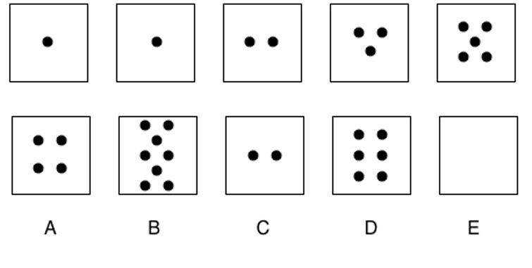

### Opciones disponibles

- **A.** A
- **B.** B
- **C.** C
- **D.** D
- **E.** E

---

### Respuesta y explicacion

La respuesta correcta es la **B**: B

The number of dots in a frame is equal to the sum of dots in the two previous frames.

## Pregunta 154

Fuente: https://www.epsoprep.com/practice/attempt/en/UXVlc3Rpb25Qb29sQXR0ZW1wdDo5enE5WWJ4ZG5rOERiQWplMHIwTnVn/review?q=14

### Enunciado

From the options available, please choose which diagram would come next in the series.

### Imagen

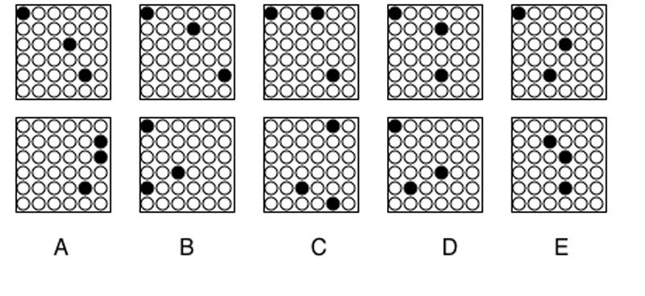

### Opciones disponibles

- **A.** A
- **B.** B
- **C.** C
- **D.** D
- **E.** E

---

### Respuesta y explicacion

La respuesta correcta es la **D**: D

The dot at the top left never moves.

The dot in the third row moves at one circle per frame, starting up.

The dot in the fifth row moves at one circle per frame, starting right.

When a dot reaches the edge of the grid it continues in the opposite direction.

## Pregunta 155

Fuente: https://www.epsoprep.com/practice/attempt/en/UXVlc3Rpb25Qb29sQXR0ZW1wdDo5enE5WWJ4ZG5rOERiQWplMHIwTnVn/review?q=15

### Enunciado

From the options available, please choose which diagram would come next in the series.

### Imagen

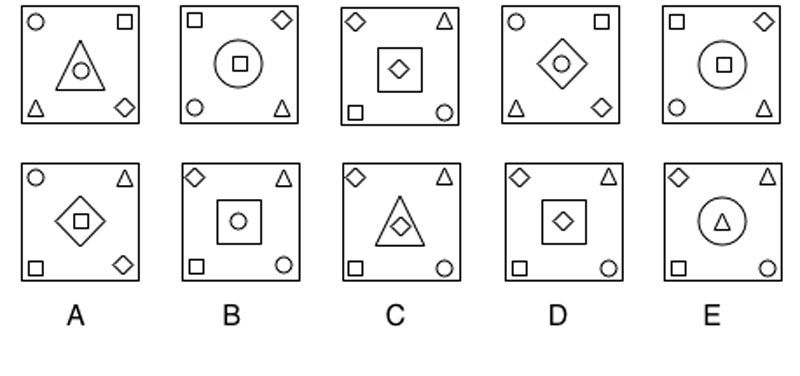

### Opciones disponibles

- **A.** A
- **B.** B
- **C.** C
- **D.** D
- **E.** E

---

### Respuesta y explicacion

La respuesta correcta es la **D**: D

The shapes in the corner all move counterclockwise by 1 corner per frame for three frames, then the circle and diamond switch places and the square and triangle also switch places.

After that, the counterclockwise motion continues for another three frames.

Of the shapes in the middle, the inner shape becomes the outer shape in the next frame.

The inner shape is always the same as the shape at the top left corner.

## Pregunta 156

Fuente: https://www.epsoprep.com/practice/attempt/en/UXVlc3Rpb25Qb29sQXR0ZW1wdDo5enE5WWJ4ZG5rOERiQWplMHIwTnVn/review?q=16

### Enunciado

From the options available, please choose which diagram would come next in the series.

### Imagen

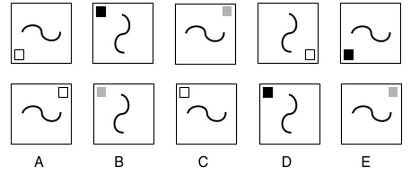

### Opciones disponibles

- **A.** A
- **B.** B
- **C.** C
- **D.** D
- **E.** E

---

### Respuesta y explicacion

La respuesta correcta es la **B**: B

The middle shape moves ¼ circle per frame (direction is irrelevant).

The square moves clockwise by one corner per frame and changes colour in the order white – black – gray – white – black – gray – etc.

## Pregunta 157

Fuente: https://www.epsoprep.com/practice/attempt/en/UXVlc3Rpb25Qb29sQXR0ZW1wdDo5enE5WWJ4ZG5rOERiQWplMHIwTnVn/review?q=17

### Enunciado

From the options available, please choose which diagram would come next in the series.

### Imagen

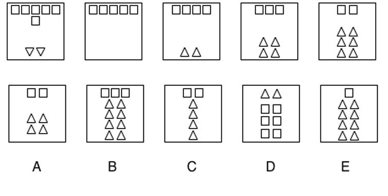

### Opciones disponibles

- **A.** A
- **B.** B
- **C.** C
- **D.** D
- **E.** E

---

### Respuesta y explicacion

La respuesta correcta es la **E**: E

The number of squares at the top decreases by one each frame.

The number of triangles at the bottom increases by two each frame if the triangles pointed upwards in the previous frame and down if they pointed down.

The triangles reappear pointing the opposite direction if there were no triangles in the previous frame.

## Pregunta 158

Fuente: https://www.epsoprep.com/practice/attempt/en/UXVlc3Rpb25Qb29sQXR0ZW1wdDo5enE5WWJ4ZG5rOERiQWplMHIwTnVn/review?q=18

### Enunciado

From the options available, please choose which diagram would come next in the series.

### Imagen

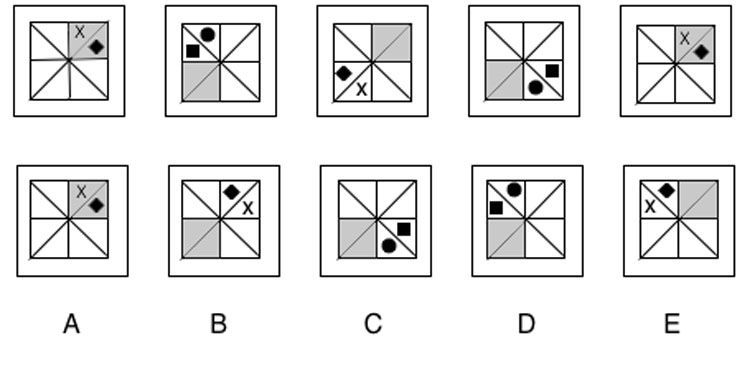

### Opciones disponibles

- **A.** A
- **B.** B
- **C.** C
- **D.** D
- **E.** E

---

### Respuesta y explicacion

La respuesta correcta es la **D**: D

The quarter of the square that is gray alternates between the top right to the bottom left.

The two black shapes move counterclockwise at ¼ circle per frame.

In even frames, the shapes are a circle and a square. In odd frames, the shapes are a diamond and a cross.

## Pregunta 159

Fuente: https://www.epsoprep.com/practice/attempt/en/UXVlc3Rpb25Qb29sQXR0ZW1wdDo5enE5WWJ4ZG5rOERiQWplMHIwTnVn/review?q=19

### Enunciado

From the options available, please choose which diagram would come next in the series.

### Imagen

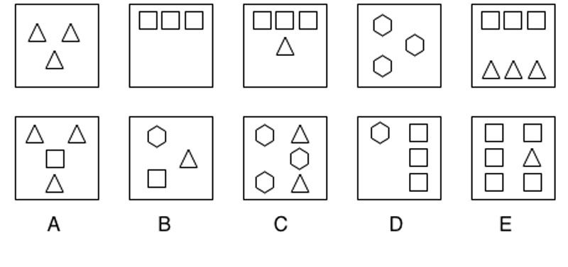

### Opciones disponibles

- **A.** A
- **B.** B
- **C.** C
- **D.** D
- **E.** E

---

### Respuesta y explicacion

La respuesta correcta es la **C**: C

The total number of sides of the shapes in a frame increases by three per frame.

## Pregunta 160

Fuente: https://www.epsoprep.com/practice/attempt/en/UXVlc3Rpb25Qb29sQXR0ZW1wdDo5enE5WWJ4ZG5rOERiQWplMHIwTnVn/review?q=20

### Enunciado

From the options available, please choose which diagram would come next in the series.

### Imagen

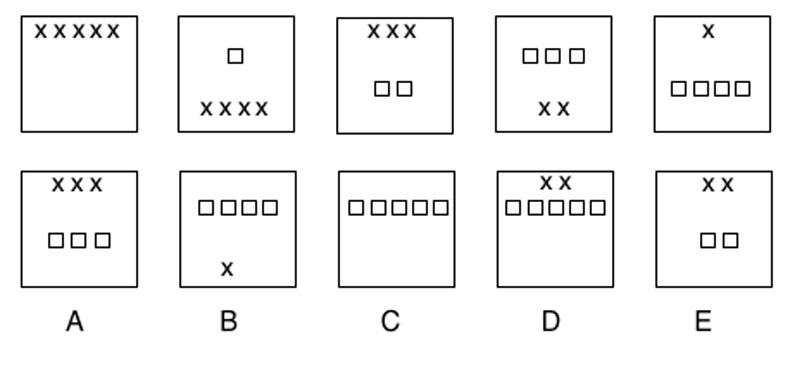

### Opciones disponibles

- **A.** A
- **B.** B
- **C.** C
- **D.** D
- **E.** E

---

### Respuesta y explicacion

La respuesta correcta es la **C**: C

The position of the squares and the crosses alternate from top to bottom.

In each frame, there is one less cross and one more square.

## Pregunta 161

Fuente: https://www.epsoprep.com/practice/attempt/en/UXVlc3Rpb25Qb29sQXR0ZW1wdDo5enE5WWJ4ZG5rOERiQWplMHIwTnVn/review?q=21

### Enunciado

From the options available, please choose which diagram would come next in the series.

### Imagen

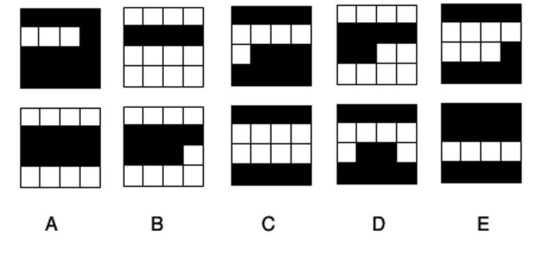

### Opciones disponibles

- **A.** A
- **B.** B
- **C.** C
- **D.** D
- **E.** E

---

### Respuesta y explicacion

La respuesta correcta es la **A**: A

In even frames, there is a black shape against a white background.

In the odd frames, there is a white shape against a black background.

The shape increases by one square in each frame.

## Pregunta 162

Fuente: https://www.epsoprep.com/practice/attempt/en/UXVlc3Rpb25Qb29sQXR0ZW1wdDo5enE5WWJ4ZG5rOERiQWplMHIwTnVn/review?q=22

### Enunciado

From the options available, please choose which diagram would come next in the series.

### Imagen

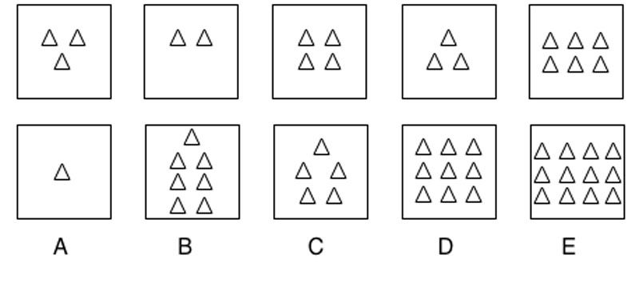

### Opciones disponibles

- **A.** A
- **B.** B
- **C.** C
- **D.** D
- **E.** E

---

### Respuesta y explicacion

La respuesta correcta es la **C**: C

In the first transition, one triangle is removed, in the next transition the number of triangles doubles, etc.

For that reason, we are looking for an option that consists of 5 triangles.

## Pregunta 163

Fuente: https://www.epsoprep.com/practice/attempt/en/UXVlc3Rpb25Qb29sQXR0ZW1wdDo5enE5WWJ4ZG5rOERiQWplMHIwTnVn/review?q=23

### Enunciado

From the options available, please choose which diagram would come next in the series.

### Imagen

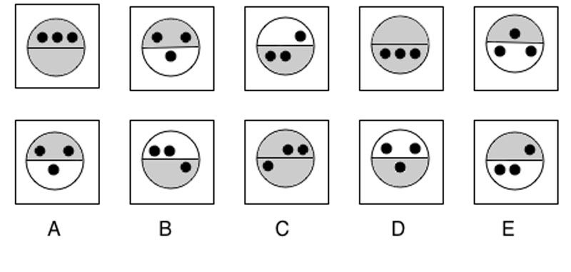

### Opciones disponibles

- **A.** A
- **B.** B
- **C.** C
- **D.** D
- **E.** E

---

### Respuesta y explicacion

La respuesta correcta es la **B**: B

First, both halves of the circle are gray, then the top one, then the bottom one.

In the first transition, the middle dot moves to the other side of the line, then the right dot moves, then the left dot moves.

## Pregunta 164

Fuente: https://www.epsoprep.com/practice/attempt/en/UXVlc3Rpb25Qb29sQXR0ZW1wdDo5enE5WWJ4ZG5rOERiQWplMHIwTnVn/review?q=24

### Enunciado

From the options available, please choose which diagram would come next in the series.

### Imagen

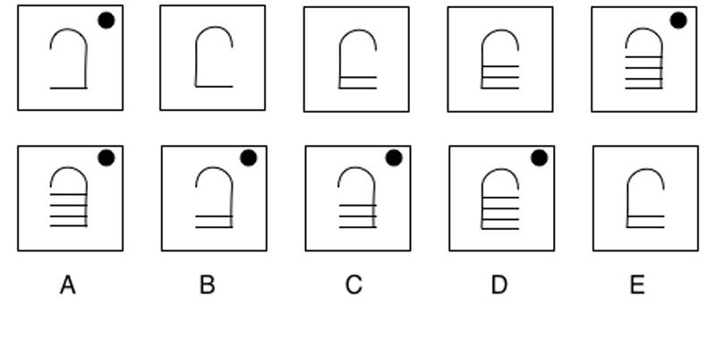

### Opciones disponibles

- **A.** A
- **B.** B
- **C.** C
- **D.** D
- **E.** E

---

### Respuesta y explicacion

La respuesta correcta es la **A**: A

If a dot appears in the frame, the figure’s open and points left, otherwise, it points right.

The number of horizontal lines increases by one unless the previous frame contained a dot.

As the last frame did include a circle and four lines we should be looking at an answer alternative that has four lines.

Only option A and D and both do include a dot but per our first rule, if a dot is present the figure has to point left which only A does.

## Pregunta 165

Fuente: https://www.epsoprep.com/practice/attempt/en/UXVlc3Rpb25Qb29sQXR0ZW1wdDo5enE5WWJ4ZG5rOERiQWplMHIwTnVn/review?q=25

### Enunciado

From the options available, please choose which diagram would come next in the series.

### Imagen

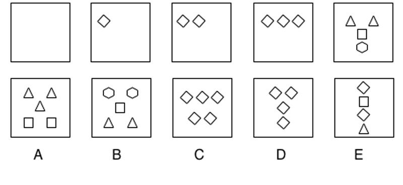

### Opciones disponibles

- **A.** A
- **B.** B
- **C.** C
- **D.** D
- **E.** E

---

### Respuesta y explicacion

La respuesta correcta es la **C**: C

The number of elements increases by one each frame which is the first criterion.

Furthermore, the total number of sides increases by 4 each frame. In the second frame the number of sides id 4, in the third 8, in the fourth it is 12 and in the fifth, it is 16.

The correct alternative has to include 20 sides and option C is the only one that meets BOTH criteria.

## Pregunta 166

Fuente: https://www.epsoprep.com/practice/attempt/en/UXVlc3Rpb25Qb29sQXR0ZW1wdDo5enE5WWJ4ZG5rOERiQWplMHIwTnVn/review?q=26

### Enunciado

From the options available, please choose which diagram would come next in the series.

### Imagen

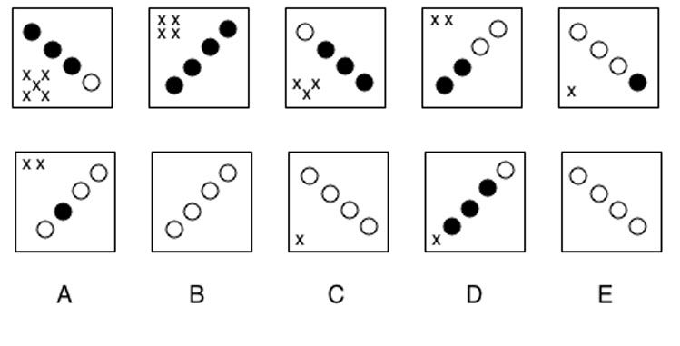

### Opciones disponibles

- **A.** A
- **B.** B
- **C.** C
- **D.** D
- **E.** E

---

### Respuesta y explicacion

La respuesta correcta es la **B**: B

The direction of the four diagonal circles moves clockwise by ¼ circle per frame.

The number of white circles first decreases by one circle per frame, then when all circles are black, increases by one circle per frame.

The crosses alternate between the top left and bottom left and their number decreases by one per frame.

## Pregunta 167

Fuente: https://www.epsoprep.com/practice/attempt/en/UXVlc3Rpb25Qb29sQXR0ZW1wdDo5enE5WWJ4ZG5rOERiQWplMHIwTnVn/review?q=27

### Enunciado

From the options available, please choose which diagram would come next in the series.

### Imagen

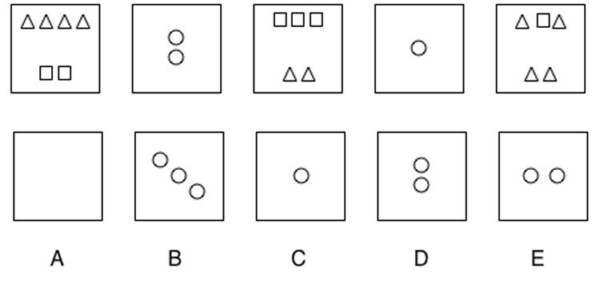

### Opciones disponibles

- **A.** A
- **B.** B
- **C.** C
- **D.** D
- **E.** E

---

### Respuesta y explicacion

La respuesta correcta es la **C**: C

Odd frames contain triangles and squares.

The even frames contain a number of circles.

The number equals the number of shapes at the top in the previous frame minus the number of shapes at the bottom of the previous frame.

## Pregunta 168

Fuente: https://www.epsoprep.com/practice/attempt/en/UXVlc3Rpb25Qb29sQXR0ZW1wdDo5enE5WWJ4ZG5rOERiQWplMHIwTnVn/review?q=28

### Enunciado

From the options available, please choose which diagram would come next in the series.

### Imagen

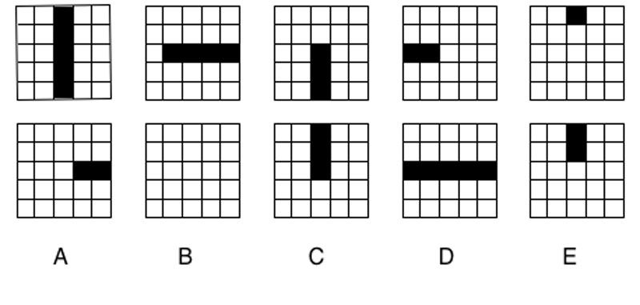

### Opciones disponibles

- **A.** A
- **B.** B
- **C.** C
- **D.** D
- **E.** E

---

### Respuesta y explicacion

La respuesta correcta es la **B**: B

The number of dots form a line. The base of the line moves clockwise at ¼ circle per frame.

The number of dots in the line is reduced by one each frame on the side opposite of the base.

## Pregunta 169

Fuente: https://www.epsoprep.com/practice/attempt/en/UXVlc3Rpb25Qb29sQXR0ZW1wdDo5enE5WWJ4ZG5rOERiQWplMHIwTnVn/review?q=29

### Enunciado

From the options available, please choose which diagram would come next in the series.

### Imagen

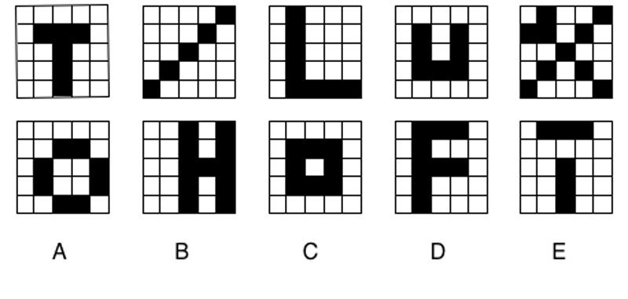

### Opciones disponibles

- **A.** A
- **B.** B
- **C.** C
- **D.** D
- **E.** E

---

### Respuesta y explicacion

La respuesta correcta es la **D**: D

The number of black squares increases by three then decreases by one, then increases by three, then decreases by one, etc.

## Pregunta 170

Fuente: https://www.epsoprep.com/practice/attempt/en/UXVlc3Rpb25Qb29sQXR0ZW1wdDo5enE5WWJ4ZG5rOERiQWplMHIwTnVn/review?q=30

### Enunciado

From the options available, please choose which diagram would come next in the series.

### Imagen

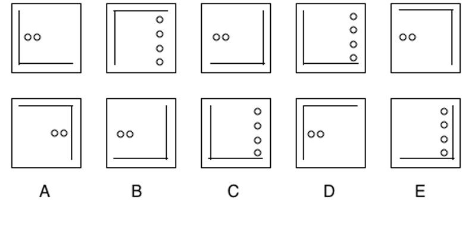

### Opciones disponibles

- **A.** A
- **B.** B
- **C.** C
- **D.** D
- **E.** E

---

### Respuesta y explicacion

La respuesta correcta es la **E**: E

The L shape moves clockwise, first by 1/4 circle, then by 1/2 circle per frame.

The location of the circles alternates from left to right.

On the left, there are always two circles arranged horizontally, on the right, there are always four circles arranged vertically.

## Pregunta 171

Fuente: https://www.epsoprep.com/practice/attempt/en/UXVlc3Rpb25Qb29sQXR0ZW1wdDo5enE5WWJ4ZG5rOERiQWplMHIwTnVn/review?q=31

### Enunciado

From the options available, please choose which diagram would come next in the series.

### Imagen

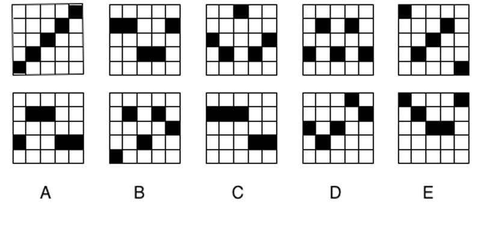

### Opciones disponibles

- **A.** A
- **B.** B
- **C.** C
- **D.** D
- **E.** E

---

### Respuesta y explicacion

La respuesta correcta es la **A**: A

Each dot moves up/down in its column at a number of squares per frame.

The first (left) black dot moves at three squares per frame.

The second black dot moves at four squares per frame.

The third moves at five squares per frame.

The fourth moves at two squares per frame starting downward.

The fifth moves at one square per frame.

When any of the black dots reach the edge of the grid they "bounce" and continue their way in the opposite direction.

## Pregunta 172

Fuente: https://www.epsoprep.com/practice/attempt/en/UXVlc3Rpb25Qb29sQXR0ZW1wdDo5enE5WWJ4ZG5rOERiQWplMHIwTnVn/review?q=32

### Enunciado

From the options available, please choose which diagram would come next in the series.

### Imagen

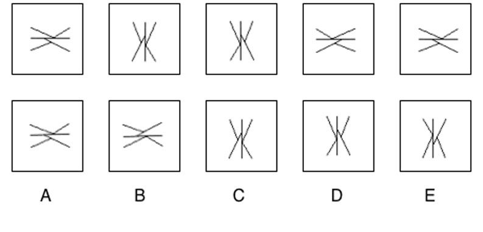

### Opciones disponibles

- **A.** A
- **B.** B
- **C.** C
- **D.** D
- **E.** E

---

### Respuesta y explicacion

La respuesta correcta es la **C**: C

In the first frame transition, the image is moved clockwise by ¼ circle.

In the next frame transition, the figure is flipped along a vertical axis.

## Pregunta 173

Fuente: https://www.epsoprep.com/practice/attempt/en/UXVlc3Rpb25Qb29sQXR0ZW1wdDo5enE5WWJ4ZG5rOERiQWplMHIwTnVn/review?q=33

### Enunciado

From the options available, please choose which diagram would come next in the series.

### Imagen

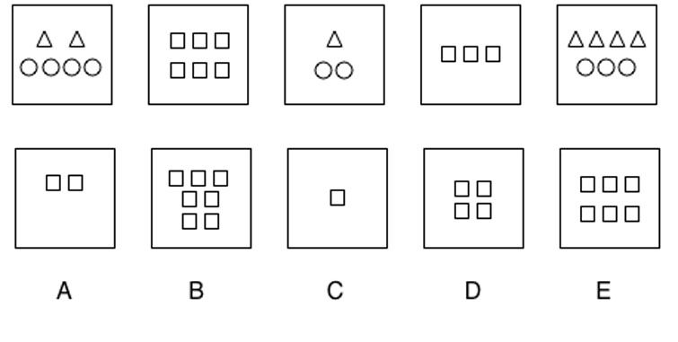

### Opciones disponibles

- **A.** A
- **B.** B
- **C.** C
- **D.** D
- **E.** E

---

### Respuesta y explicacion

La respuesta correcta es la **B**: B

The odd frames contain triangles at the top and circles at the bottom.

The even frames contain squares and each even frame has as many squares as the number of triangles and circles of the previous frame combined.

The increase/decrease in the number of triangles/circles is irrelevant (not necessary to answer the question).

## Pregunta 174

Fuente: https://www.epsoprep.com/practice/attempt/en/UXVlc3Rpb25Qb29sQXR0ZW1wdDo5enE5WWJ4ZG5rOERiQWplMHIwTnVn/review?q=34

### Enunciado

From the options available, please choose which diagram would come next in the series.

### Imagen

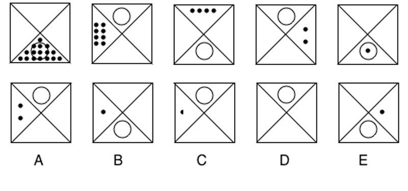

### Opciones disponibles

- **A.** A
- **B.** z
- **C.** B
- **D.** C
- **E.** E

---

### Respuesta y explicacion

La respuesta correcta es la **D**: C

The section containing the black dots moves by ¼ circle each frame and the number of dots is halved each frame. The section containing the white dot alternates between the bottom and the top section.

D

## Pregunta 175

Fuente: https://www.epsoprep.com/practice/attempt/en/UXVlc3Rpb25Qb29sQXR0ZW1wdDo5enE5WWJ4ZG5rOERiQWplMHIwTnVn/review?q=35

### Enunciado

From the options available, please choose which diagram would come next in the series.

### Imagen

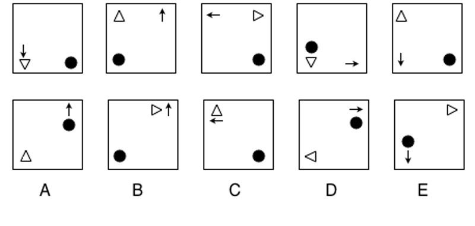

### Opciones disponibles

- **A.** A
- **B.** B
- **C.** C
- **D.** D
- **E.** E

---

### Respuesta y explicacion

La respuesta correcta es la **B**: B

The triangle moves from the bottom left (pointing down) to the top left (pointing up) to the top right (pointing right).

The arrow moves from the bottom left (pointing down) to the top right (pointing up) to the top left (pointing left) to the bottom right (pointing right).

The circle moves from the bottom right to the bottom left.

## Pregunta 176

Fuente: https://www.epsoprep.com/practice/attempt/en/UXVlc3Rpb25Qb29sQXR0ZW1wdDo5enE5WWJ4ZG5rOERiQWplMHIwTnVn/review?q=36

### Enunciado

From the options available, please choose which diagram would come next in the series.

### Imagen

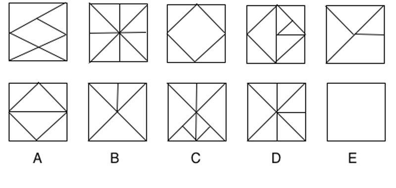

### Opciones disponibles

- **A.** A
- **B.** B
- **C.** C
- **D.** D
- **E.** E

---

### Respuesta y explicacion

La respuesta correcta es la **C**: C

Each frame is divided into several pieces. In odd frames, the number of pieces decreases by one piece.

So, frame 1 starts off with 6 pieces, and in frame 3 the frame is divided into 5 pieces.

On the other side, even frames are always divided into 8 pieces. So in frame 6, we are looking for a frame that is divided into 8 pieces.

Only frame C meets that criterion.

## Pregunta 177

Fuente: https://www.epsoprep.com/practice/attempt/en/UXVlc3Rpb25Qb29sQXR0ZW1wdDo5enE5WWJ4ZG5rOERiQWplMHIwTnVn/review?q=37

### Enunciado

From the options available, please choose which diagram would come next in the series.

### Imagen

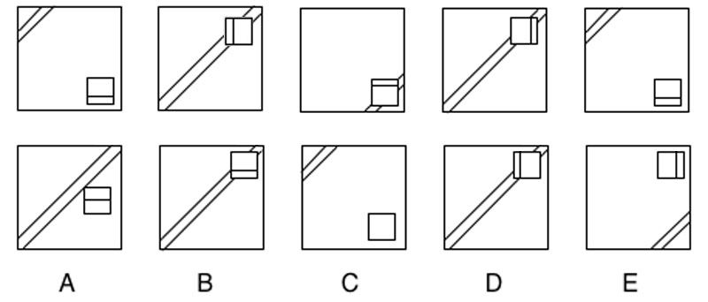

### Opciones disponibles

- **A.** A
- **B.** B
- **C.** C
- **D.** D
- **E.** E

---

### Respuesta y explicacion

La respuesta correcta es la **D**: D

The set of two lines moves from top left to middle to bottom right, back to the middle, etc.

The square’s position moves from corner to corner by 1 corner per frame.

The position of the line inside the square moves clockwise from side to side at one side per frame.

## Pregunta 178

Fuente: https://www.epsoprep.com/practice/attempt/en/UXVlc3Rpb25Qb29sQXR0ZW1wdDo5enE5WWJ4ZG5rOERiQWplMHIwTnVn/review?q=38

### Enunciado

From the options available, please choose which diagram would come next in the series.

### Imagen

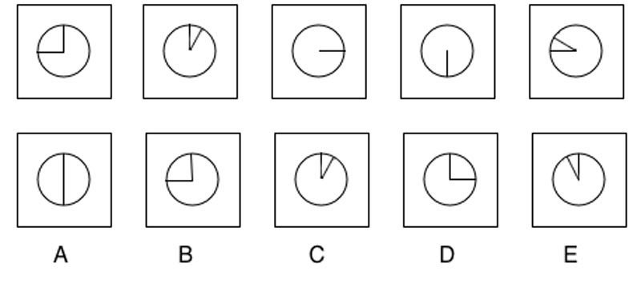

### Opciones disponibles

- **A.** A
- **B.** B
- **C.** C
- **D.** D
- **E.** E

---

### Respuesta y explicacion

La respuesta correcta es la **D**: D

One line (starting pointing left) moves clockwise by ¼ circle per frame.

The other line moves /12 circle in the 1first transition, then 2/12 circle, then 3/12 circle, etc.

## Pregunta 179

Fuente: https://www.epsoprep.com/practice/attempt/en/UXVlc3Rpb25Qb29sQXR0ZW1wdDo5enE5WWJ4ZG5rOERiQWplMHIwTnVn/review?q=39

### Enunciado

From the options available, please choose which diagram would come next in the series.

### Imagen

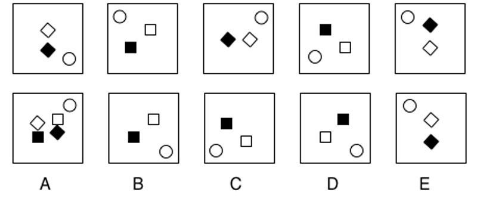

### Opciones disponibles

- **A.** A
- **B.** B
- **C.** C
- **D.** D
- **E.** E

---

### Respuesta y explicacion

La respuesta correcta es la **D**: D

The circle moves clockwise from corner to corner.

In even frames 2 corners per frame and in odd frames 1 corner per frame.

The set of two diamonds turn clockwise by 1/8 circle each frame.

## Pregunta 180

Fuente: https://www.epsoprep.com/practice/attempt/en/UXVlc3Rpb25Qb29sQXR0ZW1wdDo5enE5WWJ4ZG5rOERiQWplMHIwTnVn/review?q=40

### Enunciado

From the options available, please choose which diagram would come next in the series.

### Imagen

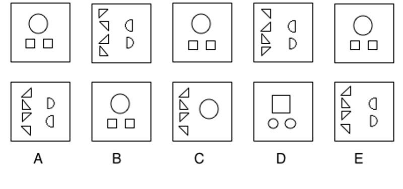

### Opciones disponibles

- **A.** A
- **B.** B
- **C.** C
- **D.** D
- **E.** E

---

### Respuesta y explicacion

La respuesta correcta es la **E**: E

In every odd frame, there is one circle with two squares below it.

In every even frame, two half circles appear and four triangles.

Each triangle moves clockwise by ¼ circle every next even square.

Note: Option A looks very similar to E but the half circles are pointing the opposite direction making it easy to make a mistake and pick the wrong answer.

## Pregunta 181

Fuente: https://www.epsoprep.com/practice/attempt/en/UXVlc3Rpb25Qb29sQXR0ZW1wdDozbWtjRndKWmlFVDNjQWplMHIwTnVR/review?q=1

### Enunciado

From the options available, please choose which diagram would come next in the series.

### Imagen

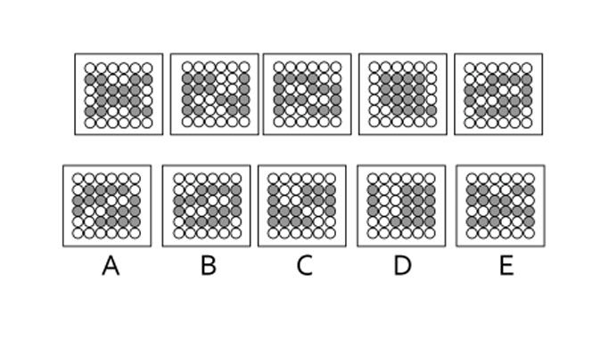

### Opciones disponibles

- **A.** A
- **B.** B
- **C.** C
- **D.** D
- **E.** E

---

### Respuesta y explicacion

La respuesta correcta es la **C**: C

In the first row with gray dots, each dot moves to the right by one dot per frame.

A dot that moves off the row on the right is added to that same row on the left. In the second row, each dot moves to the right by four dots per frame.

In the third row, each dot moves to the right by two dots per frame. In the final row, each dot moves to the left by one dot per frame.

## Pregunta 182

Fuente: https://www.epsoprep.com/practice/attempt/en/UXVlc3Rpb25Qb29sQXR0ZW1wdDozbWtjRndKWmlFVDNjQWplMHIwTnVR/review?q=2

### Enunciado

From the options available, please choose which diagram would come next in the series.

### Imagen

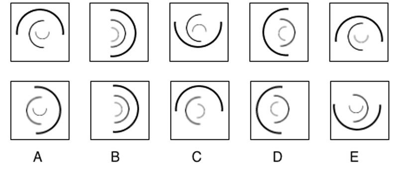

### Opciones disponibles

- **A.** A
- **B.** B
- **C.** C
- **D.** D
- **E.** E

---

### Respuesta y explicacion

La respuesta correcta es la **B**: B

The outer half-circle turns clockwise at ¼ circle per frame.

The middle half-circle flips along a vertical line with each new frame.

The inner half-circle turns counterclockwise at ¼ circle per frame.

## Pregunta 183

Fuente: https://www.epsoprep.com/practice/attempt/en/UXVlc3Rpb25Qb29sQXR0ZW1wdDozbWtjRndKWmlFVDNjQWplMHIwTnVR/review?q=3

### Enunciado

From the options available, please choose which diagram would come next in the series.

### Imagen

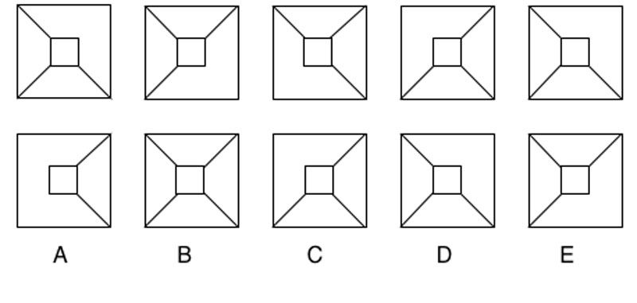

### Opciones disponibles

- **A.** A
- **B.** B
- **C.** C
- **D.** D
- **E.** E

---

### Respuesta y explicacion

La respuesta correcta es la **E**: E

The corner of the shape without a diagonal line moves clockwise at one corner per frame.

## Pregunta 184

Fuente: https://www.epsoprep.com/practice/attempt/en/UXVlc3Rpb25Qb29sQXR0ZW1wdDozbWtjRndKWmlFVDNjQWplMHIwTnVR/review?q=4

### Enunciado

From the options available, please choose which diagram would come next in the series.

### Imagen

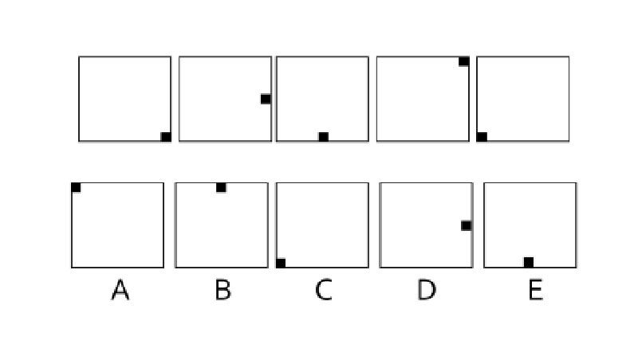

### Opciones disponibles

- **A.** A
- **B.** B
- **C.** C
- **D.** D
- **E.** E

---

### Respuesta y explicacion

La respuesta correcta es la **B**: B

The small square moves along the edge of the large one.

It goes one half-length counterclockwise, then goes two half-lengths clockwise, then three half-lengths counterclockwise, etc.

## Pregunta 185

Fuente: https://www.epsoprep.com/practice/attempt/en/UXVlc3Rpb25Qb29sQXR0ZW1wdDozbWtjRndKWmlFVDNjQWplMHIwTnVR/review?q=5

### Enunciado

From the options available, please choose which diagram would come next in the series.

### Imagen

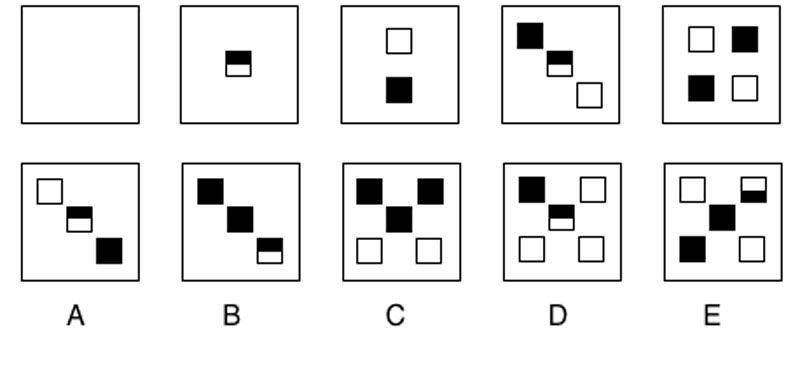

### Opciones disponibles

- **A.** A
- **B.** B
- **C.** C
- **D.** D
- **E.** E

---

### Respuesta y explicacion

La respuesta correcta es la **E**: E

There are two rules in this question:

1. The number of squares increases by one square per frame.

2. The shading of the squares is always even meaning that if there are an even number of squares, half of them will be white and half will be black. If the number of squares is odd then one of the squares will be half shaded like in frame 2 and 4.

As frame 5 has four squares our correct answer must include 5 squares and they must be equally shaded.

## Pregunta 186

Fuente: https://www.epsoprep.com/practice/attempt/en/UXVlc3Rpb25Qb29sQXR0ZW1wdDozbWtjRndKWmlFVDNjQWplMHIwTnVR/review?q=6

### Enunciado

From the options available, please choose which diagram would come next in the series.

### Imagen

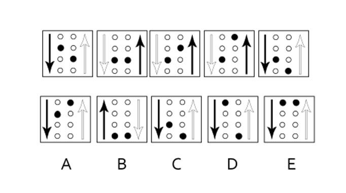

### Opciones disponibles

- **A.** A
- **B.** B
- **C.** C
- **D.** D
- **E.** E

---

### Respuesta y explicacion

La respuesta correcta es la **B**: B

The arrows act as indicators. If an arrow is black, the black dot on the side of the arrow will move in the arrow’s direction in the next frame.

If the arrow is white, the dot does not move.

Although you can never see the left arrow moving upwards in the frame, that does not rule it out, and so B is the correct answer

## Pregunta 187

Fuente: https://www.epsoprep.com/practice/attempt/en/UXVlc3Rpb25Qb29sQXR0ZW1wdDozbWtjRndKWmlFVDNjQWplMHIwTnVR/review?q=7

### Enunciado

From the options available, please choose which diagram would come next in the series.

### Imagen

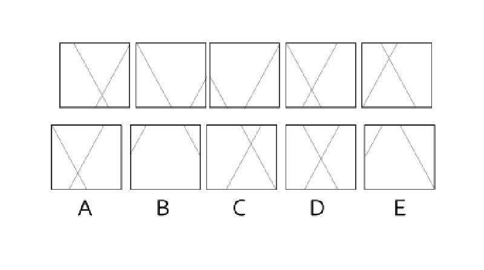

### Opciones disponibles

- **A.** A
- **B.** B
- **C.** C
- **D.** D
- **E.** E

---

### Respuesta y explicacion

La respuesta correcta es la **E**: E

The line on the left moves left by a quarter length per frame.

Whatever part of the line does not fit into the frame is not visible.

When it reaches the point where only half of the line is visible, it changes direction.

The same is true for the line on the right, only it starts out moving to the right.

## Pregunta 188

Fuente: https://www.epsoprep.com/practice/attempt/en/UXVlc3Rpb25Qb29sQXR0ZW1wdDozbWtjRndKWmlFVDNjQWplMHIwTnVR/review?q=8

### Enunciado

From the options available, please choose which diagram would come next in the series.

### Imagen

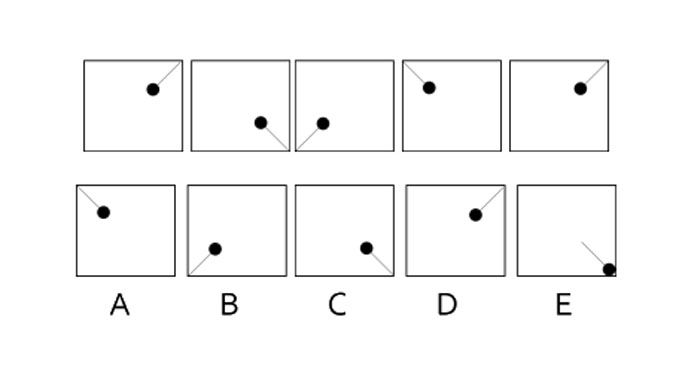

### Opciones disponibles

- **A.** A
- **B.** B
- **C.** C
- **D.** D
- **E.** E

---

### Respuesta y explicacion

La respuesta correcta es la **C**: C

The shape always ends in a corner and has the end with the dot in the middle.

The corner that the shape points into moves clockwise at a speed of one length per frame.

## Pregunta 189

Fuente: https://www.epsoprep.com/practice/attempt/en/UXVlc3Rpb25Qb29sQXR0ZW1wdDozbWtjRndKWmlFVDNjQWplMHIwTnVR/review?q=9

### Enunciado

From the options available, please choose which diagram would come next in the series.

### Imagen

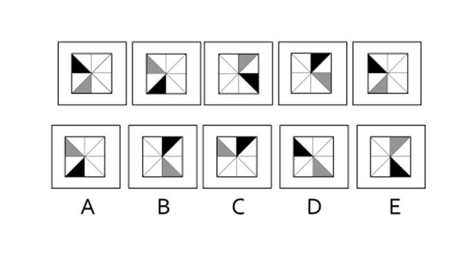

### Opciones disponibles

- **A.** A
- **B.** B
- **C.** C
- **D.** D
- **E.** E

---

### Respuesta y explicacion

La respuesta correcta es la **A**: A

The gray triangle moves clockwise at a speed of two triangles per frame.

The black triangle moves counterclockwise at a speed of two triangles per frame.

## Pregunta 190

Fuente: https://www.epsoprep.com/practice/attempt/en/UXVlc3Rpb25Qb29sQXR0ZW1wdDozbWtjRndKWmlFVDNjQWplMHIwTnVR/review?q=10

### Enunciado

From the options available, please choose which diagram would come next in the series.

### Imagen

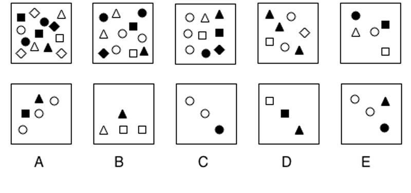

### Opciones disponibles

- **A.** A
- **B.** B
- **C.** C
- **D.** D
- **E.** E

---

### Respuesta y explicacion

La respuesta correcta es la **C**: C

The number of black objects decreases with one each frame. The same rule applies to the white objects.

## Pregunta 191

Fuente: https://www.epsoprep.com/practice/attempt/en/UXVlc3Rpb25Qb29sQXR0ZW1wdDpXQVF0bW1zZldVajJwZ2plMHIwTnVR/review?q=1

### Enunciado

From the options available, please choose which diagram would come next in the series.

### Imagen

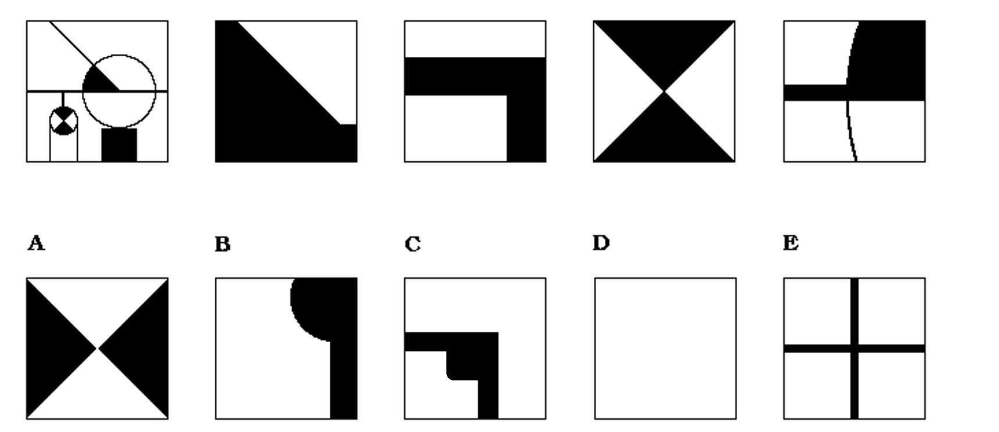

### Opciones disponibles

- **A.** A
- **B.** B
- **C.** C
- **D.** D
- **E.** E

---

### Respuesta y explicacion

La respuesta correcta es la **D**: D

The first diagram depicts a complex set of objects with various shadings.

Thereafter each diagram shows a random portion of the first diagram. Zoomed in to an arbitrary degree; the correct answer must thus do the same.

None of the patterns shown in A, B, C or E appear in the first diagram.

So the solution must be D, showing a close-up of one of the unfilled white areas.

## Pregunta 192

Fuente: https://www.epsoprep.com/practice/attempt/en/UXVlc3Rpb25Qb29sQXR0ZW1wdDpXQVF0bW1zZldVajJwZ2plMHIwTnVR/review?q=2

### Enunciado

From the options available, please choose which diagram would come next in the series.

### Imagen

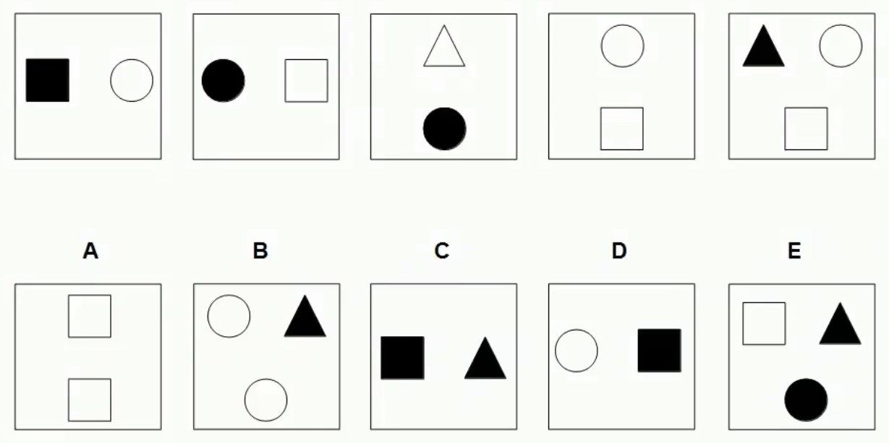

### Opciones disponibles

- **A.** A
- **B.** B
- **C.** C
- **D.** D
- **E.** E

---

### Respuesta y explicacion

La respuesta correcta es la **A**: A

Each shape represents a value dependant on how many straight lines it contains.

Squares are therefore valued as 4 while circles are valued as 0 because they don't have any straight lines. Shaded items add an additional value so a black square is 5 and a black circle is a 1.

The diagrams are paired. Thus the first two diagrams each have a value of 5 (they both have four straight lines forming their respective squares, plus one shaded item).

Likewise, the next two diagrams (3&4) each have a value of 4. Diagram five has a value of 8, thus option A must be the correct answer.

## Pregunta 193

Fuente: https://www.epsoprep.com/practice/attempt/en/UXVlc3Rpb25Qb29sQXR0ZW1wdDpXQVF0bW1zZldVajJwZ2plMHIwTnVR/review?q=3

### Enunciado

From the options available, please choose which diagram would come next in the series.

### Imagen

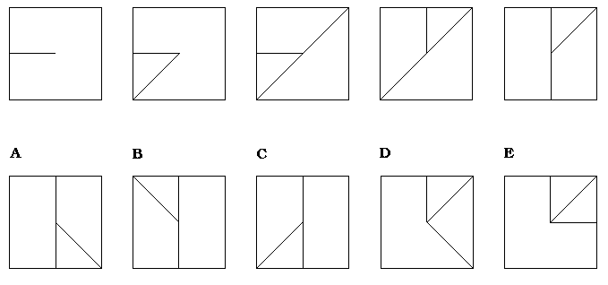

### Opciones disponibles

- **A.** A
- **B.** B
- **C.** C
- **D.** D
- **E.** E

---

### Respuesta y explicacion

La respuesta correcta es la **A**: A

All lines extend from the center to the edge of the diagram.

A new line is added each time, according to a repeating two-diagram sequence: first, a line is added at an angle 45 degrees anticlockwise from the most recent line; second.

Another is added directly opposite this newest line.

Each line persists for exactly three diagrams before being permanently removed.

## Pregunta 194

Fuente: https://www.epsoprep.com/practice/attempt/en/UXVlc3Rpb25Qb29sQXR0ZW1wdDpXQVF0bW1zZldVajJwZ2plMHIwTnVR/review?q=4

### Enunciado

From the options available, please choose which diagram would come next in the series.

### Imagen

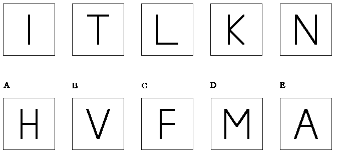

### Opciones disponibles

- **A.** A
- **B.** B
- **C.** C
- **D.** D
- **E.** E

---

### Respuesta y explicacion

La respuesta correcta es la **D**: D

The letters themselves are irrelevant: the pattern concerns the number of lines they comprise.

In every even-numbered diagram, the number of component lines increases by one.

By diagram five, there are three lines in each letter, so the correct answer (diagram six) must have four.

## Pregunta 195

Fuente: https://www.epsoprep.com/practice/attempt/en/UXVlc3Rpb25Qb29sQXR0ZW1wdDpXQVF0bW1zZldVajJwZ2plMHIwTnVR/review?q=5

### Enunciado

From the options available, please choose which diagram would come next in the series.

### Imagen

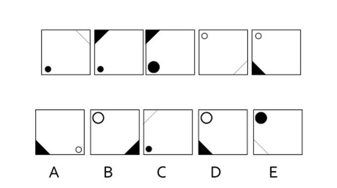

### Opciones disponibles

- **A.** A
- **B.** B
- **C.** C
- **D.** D
- **E.** E

---

### Respuesta y explicacion

La respuesta correcta es la **D**: D

Circle stays small two frames, then becomes large, then moves from the bottom to the top and changes colour, where it also stays small two frames, then becomes large.

The triangle is in one location, then moves to the other side and becomes black, then stays that way. In frame four, the triangle moves from top to bottom and the process is repeated.

## Pregunta 196

Fuente: https://www.epsoprep.com/practice/attempt/en/UXVlc3Rpb25Qb29sQXR0ZW1wdDpXQVF0bW1zZldVajJwZ2plMHIwTnVR/review?q=6

### Enunciado

From the options available, please choose which diagram would come next in the series.

### Imagen

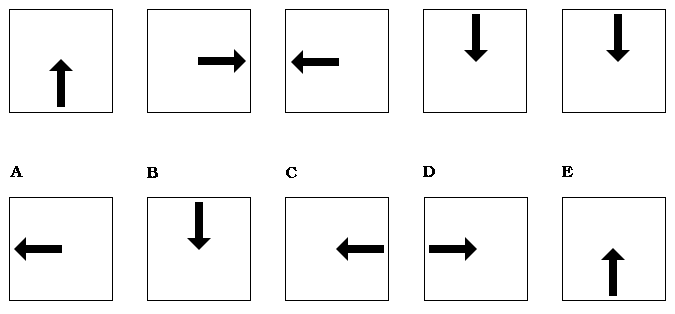

### Opciones disponibles

- **A.** A
- **B.** B
- **C.** C
- **D.** D
- **E.** E

---

### Respuesta y explicacion

La respuesta correcta es la **A**: A

The diagrams rotate anticlockwise by increasing multiples of 90 degrees.

The arrows point outward if they are in a horizontal position (pointing left or right) and inward towards the center of the diagram if they are vertical (pointing up or down)

## Pregunta 197

Fuente: https://www.epsoprep.com/practice/attempt/en/UXVlc3Rpb25Qb29sQXR0ZW1wdDpXQVF0bW1zZldVajJwZ2plMHIwTnVR/review?q=7

### Enunciado

From the options available, please choose which diagram would come next in the series.

### Imagen

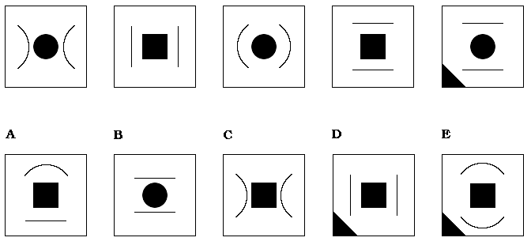

### Opciones disponibles

- **A.** A
- **B.** B
- **C.** C
- **D.** D
- **E.** E

---

### Respuesta y explicacion

La respuesta correcta es la **E**: E

The central item is alternately either a circle or a square.

There is no specific pattern to the position or orientation of the lines/arcs surrounding the shape, but circles must always have arcs, and squares straight lines.

An exception appears in diagram five: the black triangle in the corner indicates that the typical rule has not been followed (a circle appears with straight lines rather than arcs).

The correct answer may thus be any diagram that obeys the established rules.

Only E does so, showing a square with arcs, marked correctly as an exception.

## Pregunta 198

Fuente: https://www.epsoprep.com/practice/attempt/en/UXVlc3Rpb25Qb29sQXR0ZW1wdDpXQVF0bW1zZldVajJwZ2plMHIwTnVR/review?q=8

### Enunciado

From the options available, please choose which diagram would come next in the series.

### Imagen

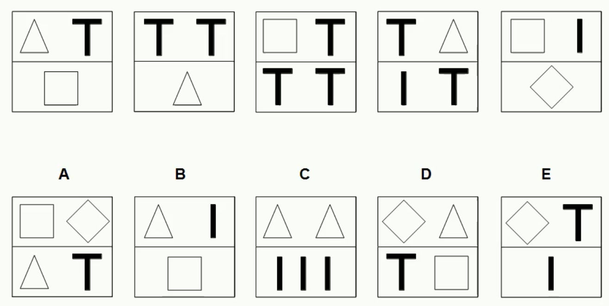

### Opciones disponibles

- **A.** A
- **B.** B
- **C.** C
- **D.** D
- **E.** E

---

### Respuesta y explicacion

La respuesta correcta es la **C**: C

There is no pattern to the items, except as follows: each diagram represents a pair of numbers (one derived from the items above the horizontal bar. And another from those below), which must always be equal.

In each case, the number above the bar is equal to the total number of lines forming the shapes present (e.g. 2 for a T shape. 3 for a triangle. etc.); the number below the bar is calculated from the number of lines, plus the number of shapes.

The correct answer may thus be any diagram in which the two numbers, calculated as above, are equal; this is true only in C because per our rules we see that option C has a two triangles (3) meaning the number above the bar is 6.

The shapes below the bar are a 3 I´s = 3 and to that we add the number of shapes which is also 3. The number below the bar is thus 3+3=6.

## Pregunta 199

Fuente: https://www.epsoprep.com/practice/attempt/en/UXVlc3Rpb25Qb29sQXR0ZW1wdDpXQVF0bW1zZldVajJwZ2plMHIwTnVR/review?q=9

### Enunciado

From the options available, please choose which diagram would come next in the series.

### Imagen

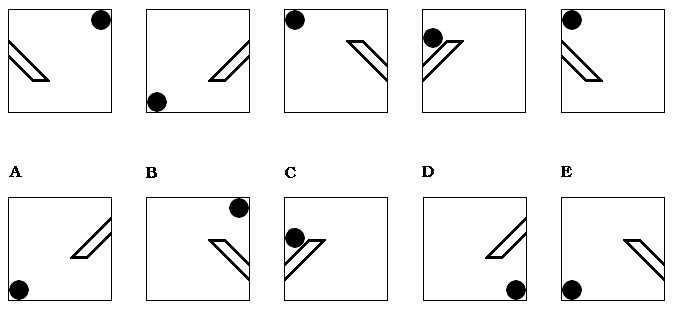

### Opciones disponibles

- **A.** A
- **B.** B
- **C.** C
- **D.** D
- **E.** E

---

### Respuesta y explicacion

La respuesta correcta es la **A**: A

The white shape is mirrored alternately in the y axis (i.e., moving horizontally from one side of the diagram to the other) or in the x axis (i.e. inverting its vertical orientation).

Only after the white shape has been mirrored into its new position/orientation each time, does ‘gravity’ consider its position and affect the ball. From an upwards direction in odd-numbered diagrams to a downwards direction in even-numbered diagrams.

When the ball hits the white shape, it either rolls along it to the opposite corner (e.g. diagram two) or is stuck (e.g. diagram four), depending on the white shape’s orientation, In the correct answer, the white shape has moved away before the gravity inversion, so the ball misses it.

## Pregunta 200

Fuente: https://www.epsoprep.com/practice/attempt/en/UXVlc3Rpb25Qb29sQXR0ZW1wdDpXQVF0bW1zZldVajJwZ2plMHIwTnVR/review?q=10

### Enunciado

From the options available, please choose which diagram would come next in the series.

### Imagen

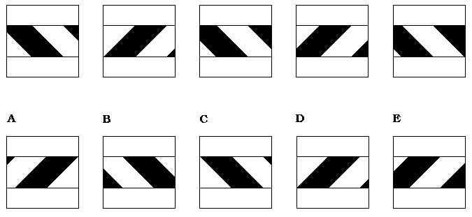

### Opciones disponibles

- **A.** A
- **B.** B
- **C.** C
- **D.** D
- **E.** E

---

### Respuesta y explicacion

La respuesta correcta es la **E**: E

The odd-numbered diagrams form one sequence, the even-numbered diagrams (including the correct answer) another.

Within each sequence, the three diagrams, if placed adjacently in a single horizontal line, form a pattern of evenly-sized, evenly-spaced, white, and black diagonal stripes.

The correct answer must therefore fit to the right of diagram four.

## Pregunta 201

Fuente: https://www.epsoprep.com/practice/attempt/en/UXVlc3Rpb25Qb29sQXR0ZW1wdDpXQVF0bW1zZldVajJwZ2plMHIwTnVR/review?q=11

### Enunciado

From the options available, please choose which diagram would come next in the series.

### Imagen

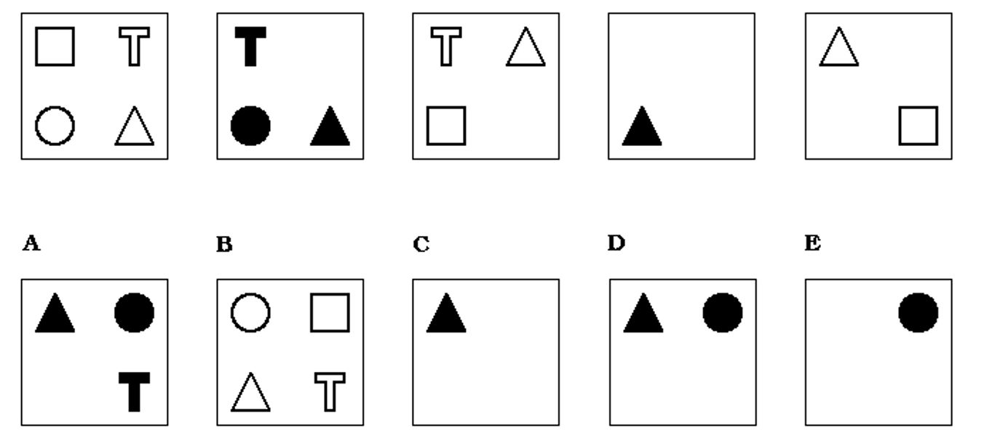

### Opciones disponibles

- **A.** A
- **B.** B
- **C.** C
- **D.** D
- **E.** E

---

### Respuesta y explicacion

La respuesta correcta es la **C**: C

The white and black shapes appear in alternate diagrams.

The white shapes always move anticlockwise compared with the previous position, the black shapes clockwise.

If a shape appears in the same location as its matching counterpart from the previous diagram (as with the T shape in diagrams two and three), that shape is permanently removed from both black and white shapes.

## Pregunta 202

Fuente: https://www.epsoprep.com/practice/attempt/en/UXVlc3Rpb25Qb29sQXR0ZW1wdDpXQVF0bW1zZldVajJwZ2plMHIwTnVR/review?q=12

### Enunciado

From the options available, please choose which diagram would come next in the series.

### Imagen

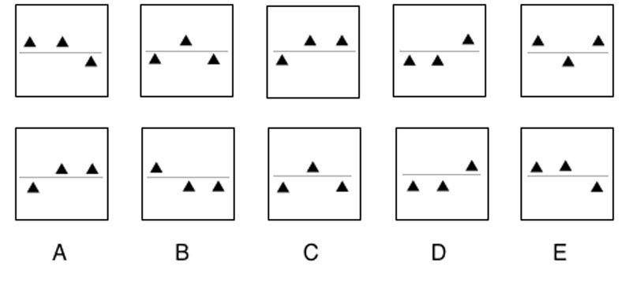

### Opciones disponibles

- **A.** A
- **B.** B
- **C.** C
- **D.** D
- **E.** E

---

### Respuesta y explicacion

La respuesta correcta es la **B**: B

In each frame, only one of the triangles moves. First, the left triangle moves to the other side of the line.

Then the right triangle moves to the other side of the line. Then the middle triangle moves to the other side of the line. Each time a triangle moves below the line it stays there for three frames.

This process is repeated.

## Pregunta 203

Fuente: https://www.epsoprep.com/practice/attempt/en/UXVlc3Rpb25Qb29sQXR0ZW1wdDpXQVF0bW1zZldVajJwZ2plMHIwTnVR/review?q=13

### Enunciado

From the options available, please choose which diagram would come next in the series.

### Imagen

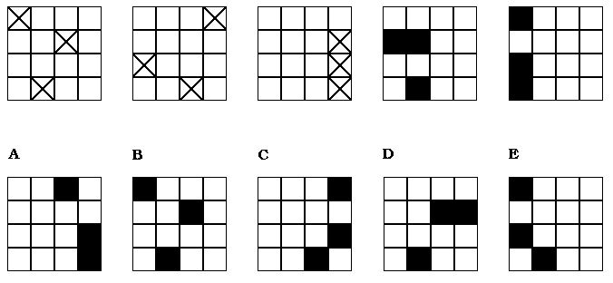

### Opciones disponibles

- **A.** A
- **B.** B
- **C.** C
- **D.** D
- **E.** E

---

### Respuesta y explicacion

La respuesta correcta es la **C**: C

In each of the first three diagrams, three squares are marked with Xs, making nine squares in total.

In the following diagrams (four to six) black squares appear horizontally oppposite one of the Xs. The "mirror" one of the positions of the X squares. The chronological order in which of the Xs the black squares mirror from the diagrams one to three is random.

For example, the top left square in frame 5 is the opposite of the top-right cross in frame 2.

The correct answer must thus have shaded squares in the positions horizontally opposite the three Xs which have not been used for diagrams four or five.

## Pregunta 204

Fuente: https://www.epsoprep.com/practice/attempt/en/UXVlc3Rpb25Qb29sQXR0ZW1wdDpXQVF0bW1zZldVajJwZ2plMHIwTnVR/review?q=14

### Enunciado

From the options available, please choose which diagram would come next in the series.

### Imagen

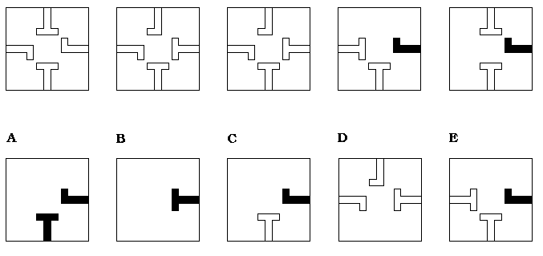

### Opciones disponibles

- **A.** A
- **B.** B
- **C.** C
- **D.** D
- **E.** E

---

### Respuesta y explicacion

La respuesta correcta es la **B**: B

The four L-shaped objects move independently according to different patterns; when two identical shapes overlap each other, they turn black and lock permanently into their current position.

One of the L-shapes (the right in diagram one) moves anticlockwise twice, then flips to the opposite side: the other (left in diagram one) is stationary, and then moves clockwise twice.

Since the L-shapes end up overlapping in diagram four, they lock up and become black and are no longer moving for that reason their patterns are irrelevant in determining the answer.

One of the T shapes (beginning at the top) moves clockwise each time: the other (beginning at the bottom) follows a repeating three-diagram pattern: bottom, bottom, right. In the correct answer, both T shapes are on the right, they overlap, lock, and turn black.

They also end up overlapping the previously locked L-shapes.

## Pregunta 205

Fuente: https://www.epsoprep.com/practice/attempt/en/UXVlc3Rpb25Qb29sQXR0ZW1wdDpXQVF0bW1zZldVajJwZ2plMHIwTnVR/review?q=15

### Enunciado

From the options available, please choose which diagram would come next in the series.

### Imagen

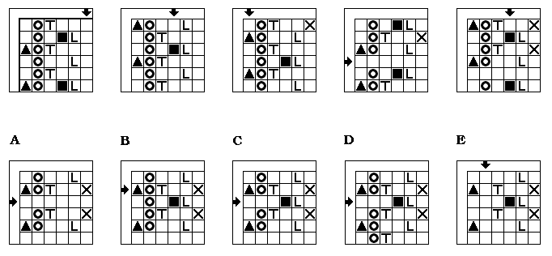

### Opciones disponibles

- **A.** A
- **B.** B
- **C.** C
- **D.** D
- **E.** E

---

### Respuesta y explicacion

La respuesta correcta es la **C**: C

There are six types of items, each with its own column. Every time, all items move down by one square, and are removed once they move below the bottom.

New items are placed in the top row: every diagram for rings: every two diagrams for Ls, Ts and Xs; every three for triangles, and every four for squares.

The arrow indicating a column or row each time, moves anticlockwise around the diagram (looping from the bottom row back to the right column) by the number of positions equal to the diagram number (i.e., 2, 3, 4, etc.).

After its movement each time, it ‘fires’, removing all items in the indicated column/row. Shaded items (triangles/squares) are immune, blocking the effect.

## Pregunta 206

Fuente: https://www.epsoprep.com/practice/attempt/en/UXVlc3Rpb25Qb29sQXR0ZW1wdDpXQVF0bW1zZldVajJwZ2plMHIwTnVR/review?q=16

### Enunciado

From the options available, please choose which diagram would come next in the series.

### Imagen

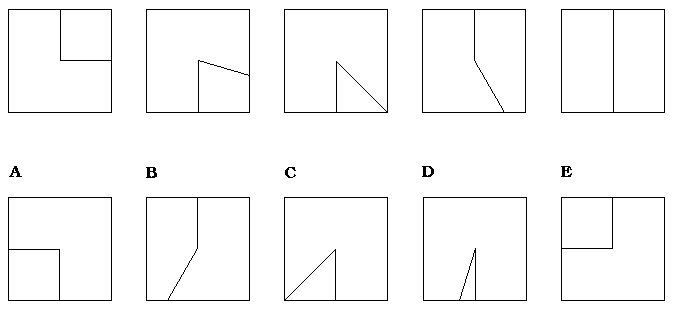

### Opciones disponibles

- **A.** A
- **B.** B
- **C.** C
- **D.** D
- **E.** E

---

### Respuesta y explicacion

La respuesta correcta es la **D**: D

The diagram is a clock, one line (vertical in diagram one) representing the minute hand, the other the hour hand.

The ‘time’ begins at three o'clock.

Then advances alternately by half an hour, then an hour.

## Pregunta 207

Fuente: https://www.epsoprep.com/practice/attempt/en/UXVlc3Rpb25Qb29sQXR0ZW1wdDpXQVF0bW1zZldVajJwZ2plMHIwTnVR/review?q=17

### Enunciado

From the options available, please choose which diagram would come next in the series.

### Imagen

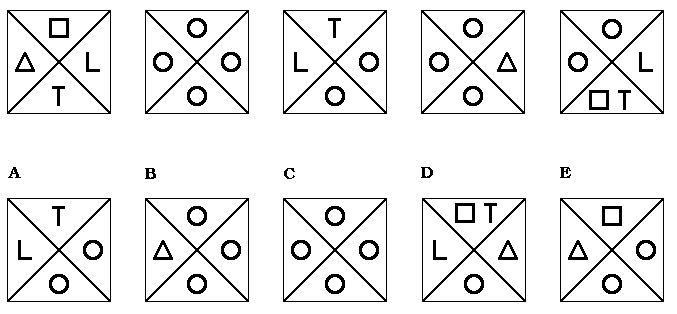

### Opciones disponibles

- **A.** A
- **B.** B
- **C.** C
- **D.** D
- **E.** E

---

### Respuesta y explicacion

La respuesta correcta es la **C**: C

Each of the four items from the first diagram reappears every n diagrams thereafter, n being equal to the number of straight lines forming the item.

The diagrams are divided into quadrants, each time an item reappears, it is in the quadrant opposite its previous appearance.

A circle appears in every empty quadrant.

Thus the square appears every four diagrams after its first appearance, the triangle every three, and the L and T shapes every two.

No shapes are due to appear in the answer which therefore contains four circles.

## Pregunta 208

Fuente: https://www.epsoprep.com/practice/attempt/en/UXVlc3Rpb25Qb29sQXR0ZW1wdDpXQVF0bW1zZldVajJwZ2plMHIwTnVR/review?q=18

### Enunciado

From the options available, please choose which diagram would come next in the series.

### Imagen

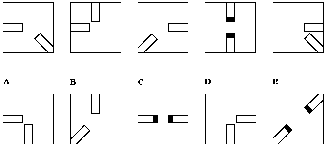

### Opciones disponibles

- **A.** A
- **B.** B
- **C.** C
- **D.** D
- **E.** E

---

### Respuesta y explicacion

La respuesta correcta es la **A**: A

The two rectangles move independently according to different patterns.

One of them (on the left in the first diagram) moves 90 degrees clockwise each time.

The other moves 45 degrees anticlockwise each time, then (only in even-numbered diagrams) also flips to the opposite side.

When the two rectangles are opposite each other, the rules that govern them are swapped.

Also, black ends are added to the rectangles.

## Pregunta 209

Fuente: https://www.epsoprep.com/practice/attempt/en/UXVlc3Rpb25Qb29sQXR0ZW1wdDpXQVF0bW1zZldVajJwZ2plMHIwTnVR/review?q=19

### Enunciado

From the options available, please choose which diagram would come next in the series.

### Imagen

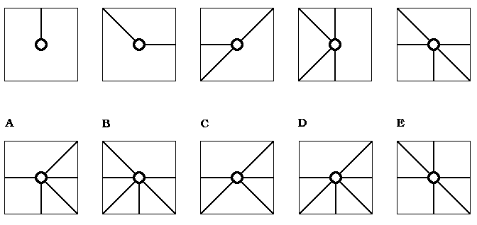

### Opciones disponibles

- **A.** A
- **B.** B
- **C.** C
- **D.** D
- **E.** E

---

### Respuesta y explicacion

La respuesta correcta es la **D**: D

The primary line (i.e., the line appearing in diagram one) rotates clockwise in each diagram, alternately by 90 degrees and 135 degrees.

After the primary line’s rotation, an additional line is created in its previous position.

In each diagram, every line except the primary line (and including the newly created one) rotates 45 degrees anticlockwise.

## Pregunta 210

Fuente: https://www.epsoprep.com/practice/attempt/en/UXVlc3Rpb25Qb29sQXR0ZW1wdDpXQVF0bW1zZldVajJwZ2plMHIwTnVR/review?q=20

### Enunciado

From the options available, please choose which diagram would come next in the series.

### Imagen

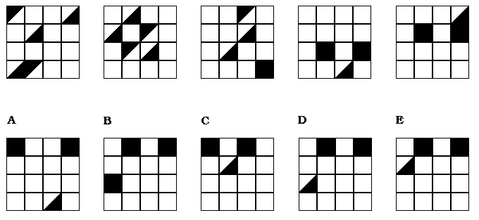

### Opciones disponibles

- **A.** A
- **B.** B
- **C.** C
- **D.** D
- **E.** E

---

### Respuesta y explicacion

La respuesta correcta es la **E**: E

The diagrams are divided into a 4x4 grid. Initially, there are two types of items within the grid, each moving according to its own rules.

Each time, the half-shaded (top left black) squares move up two and right one; while the half-shaded (bottom right black) squares move down one and right one.

When one of each of the two half-shaded types ends their respective moves in the same location, they fuse into a fully-shaded square.

Thereafter, this square moves with the combination of both the previous rules: i.e., tip one, left two.

## Pregunta 211

Fuente: https://www.epsoprep.com/practice/attempt/en/UXVlc3Rpb25Qb29sQXR0ZW1wdDpzNHROdWdpWFNFVG93UWplMHIwTnVR/review?q=1

### Enunciado

From the options available, please choose which diagram would come next in the series.

### Imagen

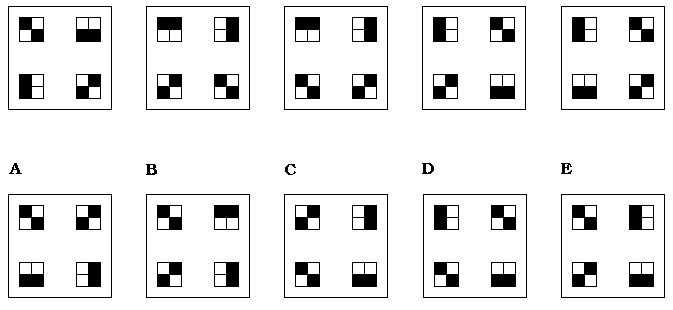

### Opciones disponibles

- **A.** A
- **B.** B
- **C.** C
- **D.** D
- **E.** E

---

### Respuesta y explicacion

La respuesta correcta es la **B**: B

In even-numbered diagrams (including the correct answer), the entire diagram is rotated 180 degrees, then the top left and bottom left items change places.

In odd-numbered diagrams, there is no rotation, and the bottom left and bottom right items change places.

## Pregunta 212

Fuente: https://www.epsoprep.com/practice/attempt/en/UXVlc3Rpb25Qb29sQXR0ZW1wdDpzNHROdWdpWFNFVG93UWplMHIwTnVR/review?q=2

### Enunciado

From the options available, please choose which diagram would come next in the series.

### Imagen

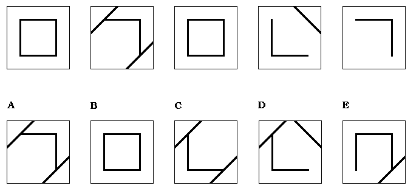

### Opciones disponibles

- **A.** A
- **B.** B
- **C.** C
- **D.** D
- **E.** E

---

### Respuesta y explicacion

La respuesta correcta es la **A**: A

The four lines move and rotate independently.

The first (the top horizontal line in diagram one) moves clockwise and rotates 90 degrees each time, making a four-diagram repeating pattern. Similarly, the second (the right vertical line in diagram one) moves anticlockwise and rotates 90 degrees each time.

The third (beginning as the bottom horizontal line) moves clockwise and rotates 45 degrees anticlockwise each time (it is thus the bottom right diagonal line in the second diagram, the right vertical line in the third, and so on).

Similarly, the fourth line (beginning as the left vertical) moves anticlockwise and rotates 45 degrees clockwise.

## Pregunta 213

Fuente: https://www.epsoprep.com/practice/attempt/en/UXVlc3Rpb25Qb29sQXR0ZW1wdDpzNHROdWdpWFNFVG93UWplMHIwTnVR/review?q=3

### Enunciado

From the options available, please choose which diagram would come next in the series.

### Imagen

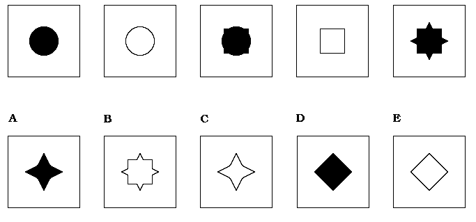

### Opciones disponibles

- **A.** A
- **B.** B
- **C.** C
- **D.** D
- **E.** E

---

### Respuesta y explicacion

La respuesta correcta es la **C**: C

In each odd-numbered diagram, a new black shape appears, superimposed over the preceding black shape (if any).

In each even-numbered diagram (including the correct answer), the most recently added shape appears in the outline, and the preceding shape is permanently discarded.

## Pregunta 214

Fuente: https://www.epsoprep.com/practice/attempt/en/UXVlc3Rpb25Qb29sQXR0ZW1wdDpzNHROdWdpWFNFVG93UWplMHIwTnVR/review?q=4

### Enunciado

From the options available, please choose which diagram would come next in the series.

### Imagen

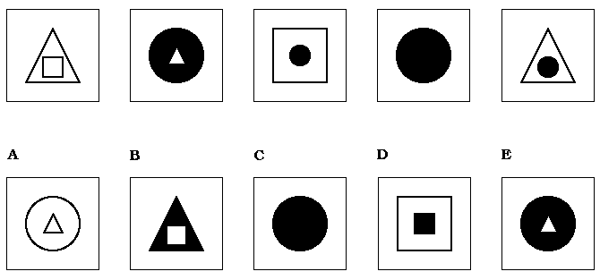

### Opciones disponibles

- **A.** A
- **B.** B
- **C.** C
- **D.** D
- **E.** E

---

### Respuesta y explicacion

La respuesta correcta es la **E**: E

The outer shape follows a repeating four-diagram pattern: triangle, circle, square, circle.

The smaller, inner shape follows a repeating three-part pattern: first, it matches the (outer) shape from two diagrams ahead, then the shape from the previous diagram, twice.

Circles (of either size) are always shaded, triangles, and squares always unshaded.

## Pregunta 215

Fuente: https://www.epsoprep.com/practice/attempt/en/UXVlc3Rpb25Qb29sQXR0ZW1wdDpzNHROdWdpWFNFVG93UWplMHIwTnVR/review?q=5

### Enunciado

From the options available, please choose which diagram would come next in the series.

### Imagen

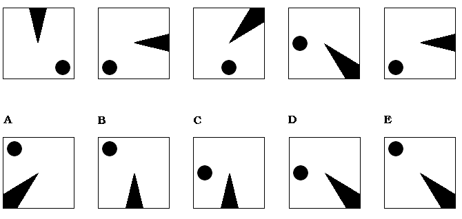

### Opciones disponibles

- **A.** A
- **B.** B
- **C.** C
- **D.** D
- **E.** E

---

### Respuesta y explicacion

La respuesta correcta es la **B**: B

The arrow moves alternately 90 degrees clockwise, then 45 degrees anticlockwise.

The arrow always points towards where the circle will appear two diagrams ahead.

## Pregunta 216

Fuente: https://www.epsoprep.com/practice/attempt/en/UXVlc3Rpb25Qb29sQXR0ZW1wdDpzNHROdWdpWFNFVG93UWplMHIwTnVR/review?q=6

### Enunciado

From the options available, please choose which diagram would come next in the series.

### Imagen

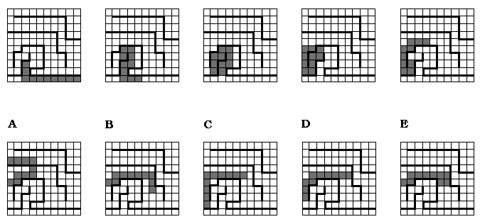

### Opciones disponibles

- **A.** A
- **B.** B
- **C.** C
- **D.** D
- **E.** E

---

### Respuesta y explicacion

La respuesta correcta es la **B**: B

The ten grey blocks begin at the bottom right of the grid: each time, they move (always as a single contiguous item) towards the top of the diagram by the most efficient route. The thicker black grid lines are impassable.

In odd-numbered diagrams, the grey blocks move three squares. In even-numbered diagrams (including the correct answer), they move five.

In option B, the grey blocks move towards the "exit" while in block E the last grey block is not as close to the "exit" as in block B and therefore doesn't move as efficiently.

## Pregunta 217

Fuente: https://www.epsoprep.com/practice/attempt/en/UXVlc3Rpb25Qb29sQXR0ZW1wdDpzNHROdWdpWFNFVG93UWplMHIwTnVR/review?q=7

### Enunciado

From the options available, please choose which diagram would come next in the series.

### Imagen

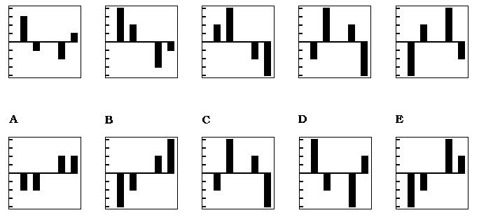

### Opciones disponibles

- **A.** A
- **B.** B
- **C.** C
- **D.** D
- **E.** E

---

### Respuesta y explicacion

La respuesta correcta es la **E**: E

Each black column represents a number between 4 and -4, as indicated by the scale to the left.

The columns are paired: the two on the left of the diagram interact with each other, and likewise the two on the right. Each time, the columns new values are calculated.

The first (left-most) column has the second column’s value subtracted from it: likewise, the third column has the fourth column’s value subtracted from it.

Meanwhile, the second has the first’s added to it, while the fourth has the third’s added to it.

Normal mathematical rules apply (e.g. subtracting a negative value equates to addition). Any addition above 4 or subtraction below -4 is ignored.

## Pregunta 218

Fuente: https://www.epsoprep.com/practice/attempt/en/UXVlc3Rpb25Qb29sQXR0ZW1wdDpzNHROdWdpWFNFVG93UWplMHIwTnVR/review?q=8

### Enunciado

From the options available, please choose which diagram would come next in the series.

### Imagen

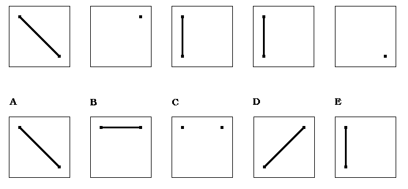

### Opciones disponibles

- **A.** A
- **B.** B
- **C.** C
- **D.** D
- **E.** E

---

### Respuesta y explicacion

La respuesta correcta es la **D**: D

There are two dots, moving independently around four possible locations: top left, top right, bottom left and bottom right.

One of these (beginning at top left in diagram one) moves clockwise alternately by one position, then by two.

The other (bottom right in diagram one) always moves one position anticlockwise.

Whenever the two dots are at different locations from one another, a line is drawn between them.

## Pregunta 219

Fuente: https://www.epsoprep.com/practice/attempt/en/UXVlc3Rpb25Qb29sQXR0ZW1wdDpzNHROdWdpWFNFVG93UWplMHIwTnVR/review?q=9

### Enunciado

From the options available, please choose which diagram would come next in the series.

### Imagen

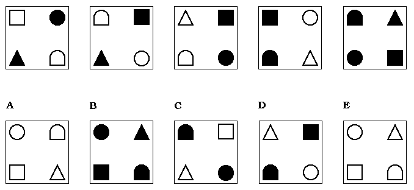

### Opciones disponibles

- **A.** A
- **B.** B
- **C.** C
- **D.** D
- **E.** E

---

### Respuesta y explicacion

La respuesta correcta es la **E**: E

There are two entirely unrelated patterns, In odd-numbered diagrams, the items all move clockwise each time (from their position in the previous odd-numbered diagram), then the top two items each have their shading inverted (i.e., if they were shaded in the previous odd-numbered diagram, they become unshaded and vice versa).

The even-numbered diagrams (including the correct answer) follow the opposite pattern: the items all rotate anticlockwise, then the bottom two items have their shading inverted.

## Pregunta 220

Fuente: https://www.epsoprep.com/practice/attempt/en/UXVlc3Rpb25Qb29sQXR0ZW1wdDpzNHROdWdpWFNFVG93UWplMHIwTnVR/review?q=10

### Enunciado

From the options available, please choose which diagram would come next in the series.

### Imagen

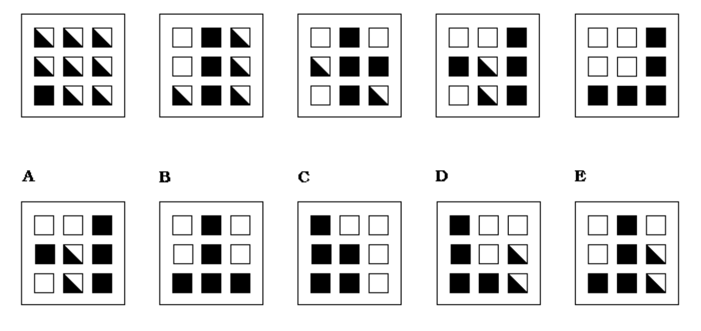

### Opciones disponibles

- **A.** A
- **B.** B
- **C.** C
- **D.** D
- **E.** E

---

### Respuesta y explicacion

La respuesta correcta es la **E**: E

In even-numbered diagrams (including the correct answer), every block shifts right one position (looping from the right to the left), then each block in the left column attempts to move right again.

Only white squares are considered “empty” and permit this second movement, which is otherwise prevented. The only exception is if one hall-shaded block attempts to move into another: the two half-shaded blocks fuse into a solid black block in the destination square.

In odd-numbered diagrams, every block shifts down one position, then each block in the top row attempts to move down one, following the same rules.

## Pregunta 221

Fuente: https://www.epsoprep.com/practice/attempt/en/UXVlc3Rpb25Qb29sQXR0ZW1wdDpvVEVrTmt6QzFrZm5Wd2plMHIwTnVR/review?q=1

### Enunciado

From the options available, please choose which diagram would come next in the series.

### Imagen

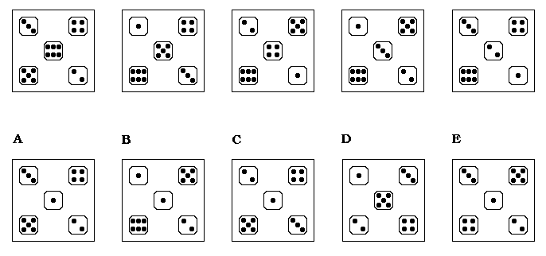

### Opciones disponibles

- **A.** A
- **B.** B
- **C.** C
- **D.** D
- **E.** E

---

### Respuesta y explicacion

La respuesta correcta es la **C**: C

The items represent the faces of a standard six-sided dice. In each diagram, the side displaying the number of that diagram (1-6. including the correct answer) is missing and the side which displays 7 minus that number (e.g. the number 6 in diagram 1, etc.) is in the center.

Of the remaining sides, the highest number is always in the bottom left, and the next highest diagonally opposite. Finally, the remaining numbers are made to add up to 7 horizontally and then vertically as the sequence progresses.

What that means practically is that:

Option B  is excluded as we are looking for the sixth frame it cannot include the number 6 on any dice side, as per the first rule.

Option D is excluded as we are looking for the middle dice to display -1 (or rather one dot in our case) because as per the second rule we are looking to have 6-7. That is because we need to take the number of the frame and subtract it with 7.

Option E is excluded as the highest value always has to be in the bottom left.

Option A is excluded as the sum of the vertical values is not 7. Remember we need to have the sum 7 vertical and then horizontally and as this is the sixth frame we are looking for vertical values.

Option C is the only remaining option

## Pregunta 222

Fuente: https://www.epsoprep.com/practice/attempt/en/UXVlc3Rpb25Qb29sQXR0ZW1wdDpvVEVrTmt6QzFrZm5Wd2plMHIwTnVR/review?q=2

### Enunciado

From the options available, please choose which diagram would come next in the series.

### Imagen

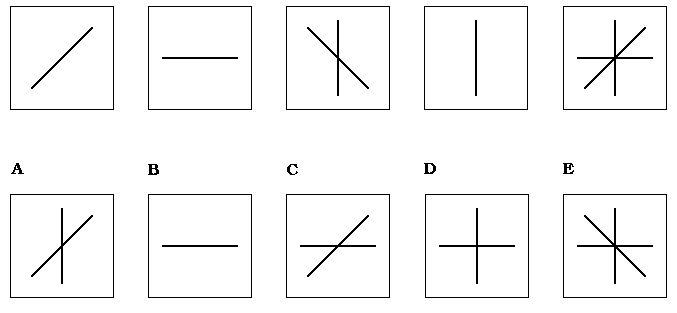

### Opciones disponibles

- **A.** A
- **B.** B
- **C.** C
- **D.** D
- **E.** E

---

### Respuesta y explicacion

La respuesta correcta es la **D**: D

Each time, the line rotates by 45 degrees clockwise.

In addition, in every other diagram (beginning with the third), a new line is created at right angles to the first line’s previous position.

The original line is the only one which ever moves.

## Pregunta 223

Fuente: https://www.epsoprep.com/practice/attempt/en/UXVlc3Rpb25Qb29sQXR0ZW1wdDpvVEVrTmt6QzFrZm5Wd2plMHIwTnVR/review?q=3

### Enunciado

From the options available, please choose which diagram would come next in the series.

### Imagen

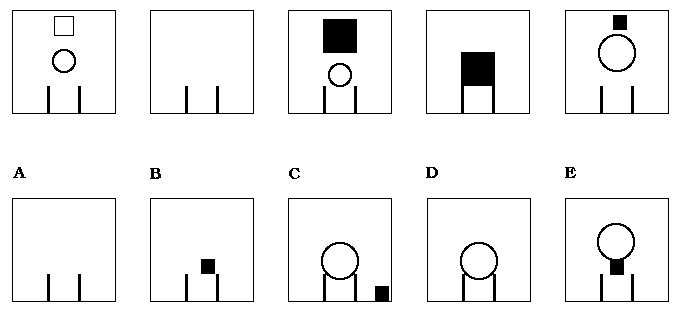

### Opciones disponibles

- **A.** A
- **B.** B
- **C.** C
- **D.** D
- **E.** E

---

### Respuesta y explicacion

La respuesta correcta es la **C**: C

The diagrams are in pairs. The two vertical lines represent the entrance to a box (or chute, etc.) into which the objects above can fall and disappear.

The shading of objects is irrelevant - the determining factor is their size. If they are too large to fit between the horizontal lines, they land on top of the chute and block it (as with the square in diagram four).

Thus in the correct answer, the large circle from diagram five has blocked the chute, such that neither it nor the square (which would otherwise have been small enough) can pass through; the square has landed on the circle and fallen to one side, as in C.

## Pregunta 224

Fuente: https://www.epsoprep.com/practice/attempt/en/UXVlc3Rpb25Qb29sQXR0ZW1wdDpvVEVrTmt6QzFrZm5Wd2plMHIwTnVR/review?q=4

### Enunciado

From the options available, please choose which diagram would come next in the series.

### Imagen

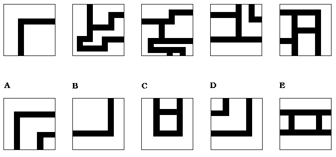

### Opciones disponibles

- **A.** A
- **B.** B
- **C.** C
- **D.** D
- **E.** E

---

### Respuesta y explicacion

La respuesta correcta es la **D**: D

The six diagrams represent a road map.

When arranged as tiles with the odd-numbered diagrams in one row and the even-numbered diagrams (including the correct answer) in another row below the roads join up.

The correct answer is thus the tile which fits to the right of diagram four, and below diagram five.

## Pregunta 225

Fuente: https://www.epsoprep.com/practice/attempt/en/UXVlc3Rpb25Qb29sQXR0ZW1wdDpvVEVrTmt6QzFrZm5Wd2plMHIwTnVR/review?q=5

### Enunciado

From the options available, please choose which diagram would come next in the series.

### Imagen

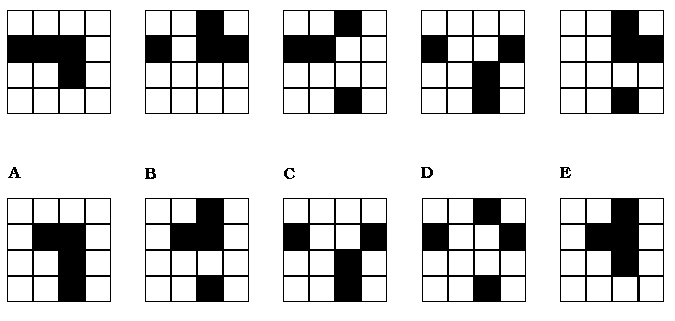

### Opciones disponibles

- **A.** A
- **B.** B
- **C.** C
- **D.** D
- **E.** E

---

### Respuesta y explicacion

La respuesta correcta es la **A**: A

The black blocks behave as two (rather than four) items: one row of two blocks, and one column of two blocks.

Each time, both items move: first, the row moves left one position (looping from left to right), then the column moves up one position (looping from top to bottom).

Whenever the movement of either item is blocked by the other item occupying one of the destination squares. its direction of movement is reversed for that move (i.e. the row moves right one if the leftward movement is blocked, while the column moves down one if the upward movement is blocked).

## Pregunta 226

Fuente: https://www.epsoprep.com/practice/attempt/en/UXVlc3Rpb25Qb29sQXR0ZW1wdDpvVEVrTmt6QzFrZm5Wd2plMHIwTnVR/review?q=6

### Enunciado

From the options available, please choose which diagram would come next in the series.

### Imagen

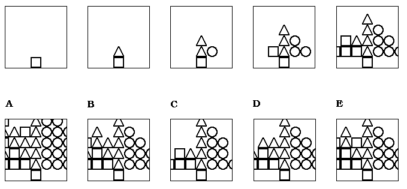

### Opciones disponibles

- **A.** A
- **B.** B
- **C.** C
- **D.** D
- **E.** E

---

### Respuesta y explicacion

La respuesta correcta es la **B**: B

Each time, every shape which was present in the previous diagram generates a new additional shape, according to specific rules:

A) each square adds a triangle on top of its column:

B) each triangle adds a circle to the right of its row:

C) each circle adds a square to the left of its row.

As diagram five indicates, squares take effect (adding triangles to the column) before circles (adding squares to the row).

The collection of shapes eventually expands beyond the area shown in the diagram.

## Pregunta 227

Fuente: https://www.epsoprep.com/practice/attempt/en/UXVlc3Rpb25Qb29sQXR0ZW1wdDpvVEVrTmt6QzFrZm5Wd2plMHIwTnVR/review?q=7

### Enunciado

From the options available, please choose which diagram would come next in the series.

### Imagen

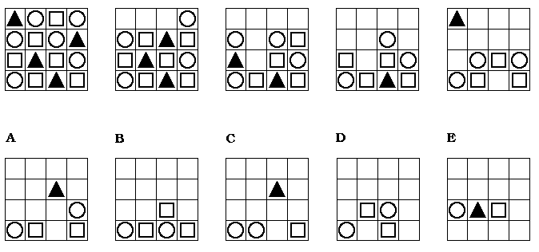

### Opciones disponibles

- **A.** A
- **B.** B
- **C.** C
- **D.** D
- **E.** E

---

### Respuesta y explicacion

La respuesta correcta es la **A**: A

Each time, one of each type of shape moves first a triangle, then a circle, then a square.

The individual item (of each type) which moves is always the one closest to the top of the diagram, or if there is more than one in the highest row the one closer to the left.

The triangle always moves right two and down one (looping from bottom to top and right to left). The circle moves left one and down one.

The square moves right one and down one. If a shape already occupies the destination

position of any move, it is permanently removed, as are any identical shapes which are directly adjacent (horizontally or vertically) to the destination position.

## Pregunta 228

Fuente: https://www.epsoprep.com/practice/attempt/en/UXVlc3Rpb25Qb29sQXR0ZW1wdDpvVEVrTmt6QzFrZm5Wd2plMHIwTnVR/review?q=8

### Enunciado

From the options available, please choose which diagram would come next in the series.

### Imagen

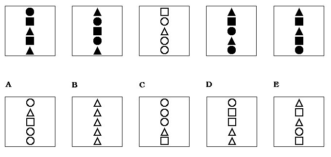

### Opciones disponibles

- **A.** A
- **B.** B
- **C.** C
- **D.** D
- **E.** E

---

### Respuesta y explicacion

La respuesta correcta es la **D**: D

The frames should be viewed in the sets of three frames. Every third frame includes white shapes and is a result of the two previous frames.

Each shape is determined the shapes in the same position in the previous two frames.

For example, the frames four and five have a black triangle on the top.

Frames one and two included a triangle on the bottom which resulted in a circle at the bottom in frame three.

So we should be looking for a frame with a circle on the top.  The third object in frames 4 & 5 is a circle and a triangle and from the first two frames, we learn that this combination resulted in a square. If we look at the fourth object from the top in frame 4 & 5 we see that they include a triangle and a square.

When we had those two shapes in frames 1 and 2 they resulted in a triangle.

Option D is the only option that meets the criteria of a circle as the first object, a square as third, and a triangle as the fourth.

## Pregunta 229

Fuente: https://www.epsoprep.com/practice/attempt/en/UXVlc3Rpb25Qb29sQXR0ZW1wdDpvVEVrTmt6QzFrZm5Wd2plMHIwTnVR/review?q=9

### Enunciado

From the options available, please choose which diagram would come next in the series.

### Imagen

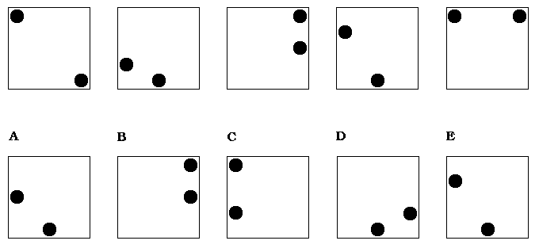

### Opciones disponibles

- **A.** A
- **B.** B
- **C.** C
- **D.** D
- **E.** E

---

### Respuesta y explicacion

La respuesta correcta es la **E**: E

There are two balls bouncing independently around the diagram.

One (in the top left corner in the first diagram) moves to the bottom centre in the second, the top right in the third, back to the bottom centre in the fourth, and so on: a repeating four-part pattern.

The other ball (the bottom right in diagram one) follows what would be a repeating eight-diagram pattern, whereby it moves to the left (a little above the bottom) in diagram two, to the right (centre) in diagram three, and so on, always bouncing at the same angle between the left and right sides until it reaches the top right corner (diagram five) and begins to return towards its starting point.

## Pregunta 230

Fuente: https://www.epsoprep.com/practice/attempt/en/UXVlc3Rpb25Qb29sQXR0ZW1wdDpvVEVrTmt6QzFrZm5Wd2plMHIwTnVR/review?q=10

### Enunciado

From the options available, please choose which diagram would come next in the series.

### Imagen

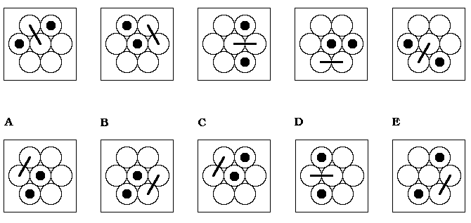

### Opciones disponibles

- **A.** A
- **B.** B
- **C.** C
- **D.** D
- **E.** E

---

### Respuesta y explicacion

La respuesta correcta es la **A**: A

The diagrams form a repeating six-part pattern.

The Line moves and rotates in alternate steps.

First, the whole line moves clockwise (diagrams two, four, and six): then the line rotates, as one of the ends of the line moves to an adjacent circle, while the other end remains stationary (diagrams one, three and five).

One small black circle moves one position around the edge each time.

The other circle moves according to a six diagram pattern, going into the middle and out to different edge circles.

## Pregunta 231

Fuente: https://www.epsoprep.com/practice/attempt/en/UXVlc3Rpb25Qb29sQXR0ZW1wdDo1S0JKVVpIWEowemxVd2plMHIwTnVR/review?q=1

### Enunciado

From the options available, please choose which diagram would come next in the series.

### Imagen

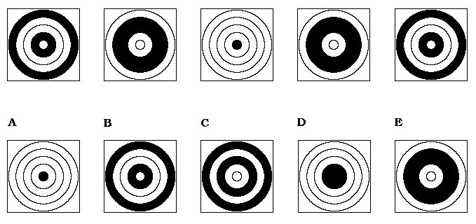

### Opciones disponibles

- **A.** A
- **B.** B
- **C.** C
- **D.** D
- **E.** E

---

### Respuesta y explicacion

La respuesta correcta es la **B**: B

There are five rings in each frame and two of them are shaded.

In the first frame the fifth (outermost) and second ring are shaded. Each frame the ring that was the outmost in frame 1 moves inwards by two rings while the other one moves outwards by two.

They keep looping If they reach the center or the last circle.

## Pregunta 232

Fuente: https://www.epsoprep.com/practice/attempt/en/UXVlc3Rpb25Qb29sQXR0ZW1wdDo1S0JKVVpIWEowemxVd2plMHIwTnVR/review?q=2

### Enunciado

From the options available, please choose which diagram would come next in the series.

### Imagen

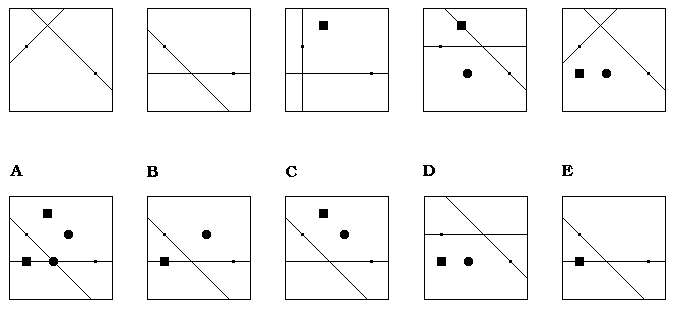

### Opciones disponibles

- **A.** A
- **B.** B
- **C.** C
- **D.** D
- **E.** E

---

### Respuesta y explicacion

La respuesta correcta es la **B**: B

There are two lines, rotating in a simple, four-diagram sequence.

One of these (centered on the marked point towards the left of the diagram) rotates in turn by 90 degrees, 45 degrees clockwise, 90 degrees, and 45 degrees anticlockwise.

The other rotates 45 degrees anticlockwise, then it is stationary, then 45 degrees clockwise, then is stationary again.

Shapes appear at the lines’ intersection point two diagrams later, a square if the angle of the intersection was 90 degrees, a circle otherwise.

These shapes remain in subsequent diagrams until the lines intersect at that point again.

The correct answer is B because the lines cross where the circle was in frame 5 which removes the circle. Furthermore a circle needs to appear where the lines crossed in frame four.

## Pregunta 233

Fuente: https://www.epsoprep.com/practice/attempt/en/UXVlc3Rpb25Qb29sQXR0ZW1wdDo1S0JKVVpIWEowemxVd2plMHIwTnVR/review?q=3

### Enunciado

From the options available, please choose which diagram would come next in the series.

### Imagen

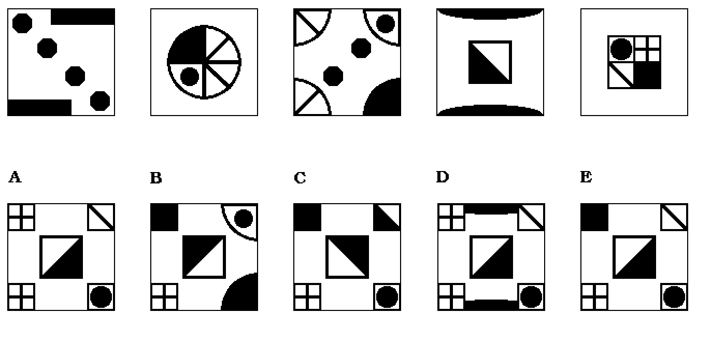

### Opciones disponibles

- **A.** A
- **B.** B
- **C.** C
- **D.** D
- **E.** E

---

### Respuesta y explicacion

La respuesta correcta es la **E**: E

Elements of the first and second diagrams are used to construct the third.

The quarters of diagram two are each moved to the diagonally opposite corners of diagram three.

The center of the third diagram is formed by mirroring horizontally the centre of the first, the other objects in the first diagram are ignored.

Diagrams four-six represent a new sequence: the correct answer is formed from elements of diagrams four and five, following the same rules.

## Pregunta 234

Fuente: https://www.epsoprep.com/practice/attempt/en/UXVlc3Rpb25Qb29sQXR0ZW1wdDo1S0JKVVpIWEowemxVd2plMHIwTnVR/review?q=4

### Enunciado

From the options available, please choose which diagram would come next in the series.

### Imagen

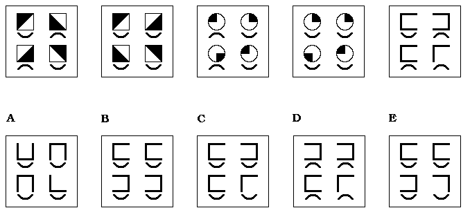

### Opciones disponibles

- **A.** A
- **B.** B
- **C.** C
- **D.** D
- **E.** E

---

### Respuesta y explicacion

La respuesta correcta es la **E**: E

The diagrams are in pairs. In the first of each pair, the curve below each item indicates whether or not it is ‘correct’: an upward curve for correct, a downward curve for incorrect.

Correct items are reproduced exactly in the second diagram of the pair, while incorrect items are mirrored in the y-axis (i.e. flipped horizontally).

## Pregunta 235

Fuente: https://www.epsoprep.com/practice/attempt/en/UXVlc3Rpb25Qb29sQXR0ZW1wdDo1S0JKVVpIWEowemxVd2plMHIwTnVR/review?q=5

### Enunciado

From the options available, please choose which diagram would come next in the series.

### Imagen

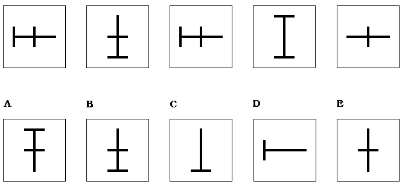

### Opciones disponibles

- **A.** A
- **B.** B
- **C.** C
- **D.** D
- **E.** E

---

### Respuesta y explicacion

La respuesta correcta es la **C**: C

The long bar which is the horizontal line in diagram one, rotates 90 degrees clockwise each time.

The two short lines move in relation to the long bar, in different patterns.

One of them follows a repeating three-diagram pattern: it is at one end of the bar (the left in diagram one), then the middle, then the other end.

The other short line alternates between two positions: the middle, as in diagram one, and the end of the bar which would have been on the right in diagram one.

The trick in these types of questions is to first identify the patterns and then visually keep track of the two identical lines.

## Pregunta 236

Fuente: https://www.epsoprep.com/practice/attempt/en/UXVlc3Rpb25Qb29sQXR0ZW1wdDo1S0JKVVpIWEowemxVd2plMHIwTnVR/review?q=6

### Enunciado

From the options available, please choose which diagram would come next in the series.

### Imagen

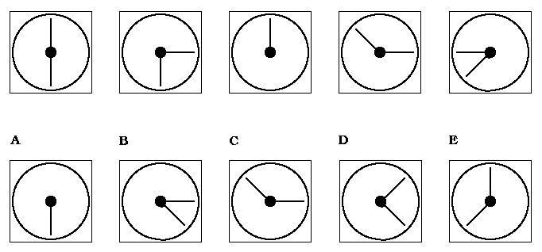

### Opciones disponibles

- **A.** A
- **B.** B
- **C.** C
- **D.** D
- **E.** E

---

### Respuesta y explicacion

La respuesta correcta es la **B**: B

Beginning in diagram two, both lines rotate around the midpoint in repeating three-diagram patterns.

One (pointing towards the top in diagram one) rotates clockwise: 180 degrees, 180 degrees, and then 90 degrees.

The other rotates in the opposite direction, and always by half the rotation of the other line (i.e. anticlockwise 90 degrees, 90 degrees, 45 degrees.)

## Pregunta 237

Fuente: https://www.epsoprep.com/practice/attempt/en/UXVlc3Rpb25Qb29sQXR0ZW1wdDo1S0JKVVpIWEowemxVd2plMHIwTnVR/review?q=7

### Enunciado

From the options available, please choose which diagram would come next in the series.

### Imagen

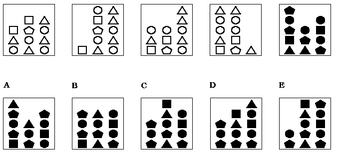

### Opciones disponibles

- **A.** A
- **B.** B
- **C.** C
- **D.** D
- **E.** E

---

### Respuesta y explicacion

La respuesta correcta es la **E**: E

There are three stacks, each holding a maximum of five items. In each diagram one of these stacks collapses (the left stack in the second diagram, then the middle, then the right). It does so as follows:

First, the item in the stack with the highest number of sides is identified. The top item in the stack (if there were more than one) becomes the bottom item, with the items which were below it being removed.

Then these items are replaced into the diagram in order (lowest items in the collapsed stack being replaced first), being added to the top of the stack on the right; if that stack is full, it is placed on the next stack to the right, and so on.

Diagram five is the start of a new sequence.

## Pregunta 238

Fuente: https://www.epsoprep.com/practice/attempt/en/UXVlc3Rpb25Qb29sQXR0ZW1wdDo1S0JKVVpIWEowemxVd2plMHIwTnVR/review?q=8

### Enunciado

From the options available, please choose which diagram would come next in the series.

### Imagen

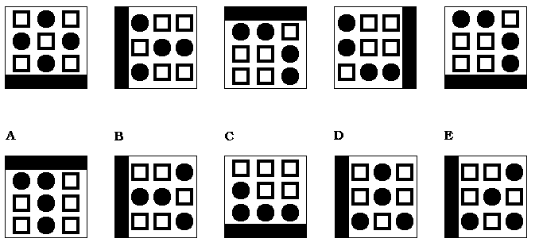

### Opciones disponibles

- **A.** A
- **B.** B
- **C.** C
- **D.** D
- **E.** E

---

### Respuesta y explicacion

La respuesta correcta es la **D**: D

Each time, the entire diagram rotates 90 degrees clockwise, then the circles move according to an alternating pattern.

ln even-numbered diagrams (including the correct answer), all circles move down one space (looping back to the top).

In odd-numbered diagrams, all circles move left one space (looping back to the right). The black bar is the ground.

All movement is relative to the ground.

## Pregunta 239

Fuente: https://www.epsoprep.com/practice/attempt/en/UXVlc3Rpb25Qb29sQXR0ZW1wdDo1S0JKVVpIWEowemxVd2plMHIwTnVR/review?q=9

### Enunciado

From the options available, please choose which diagram would come next in the series.

### Imagen

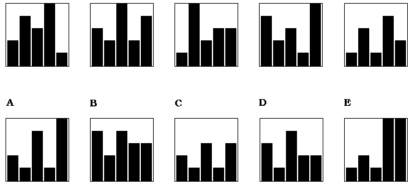

### Opciones disponibles

- **A.** A
- **B.** B
- **C.** C
- **D.** D
- **E.** E

---

### Respuesta y explicacion

La respuesta correcta es la **A**: A

There are five possible height settings for each column.

The heights of the four left-most columns change according to varying rules.

The first change (diagram two) causes the first (left-most) column to increase in height by one setting, the second to decrease two, the third to increase three, and the fourth to decrease three.

In each diagram thereafter, these rules shift one position left (but only between these four columns; e.g., in diagram three, the changes for columns one-four are: down two, up three, down three, up one).

The fifth (right) column always undergoes the opposite change to the fourth.

## Pregunta 240

Fuente: https://www.epsoprep.com/practice/attempt/en/UXVlc3Rpb25Qb29sQXR0ZW1wdDo1S0JKVVpIWEowemxVd2plMHIwTnVR/review?q=10

### Enunciado

From the options available, please choose which diagram would come next in the series.

### Imagen

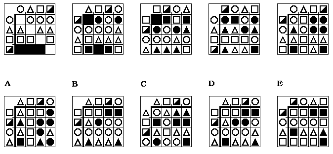

### Opciones disponibles

- **A.** A
- **B.** B
- **C.** C
- **D.** D
- **E.** E

---

### Respuesta y explicacion

La respuesta correcta es la **D**: D

The four items along the top shift one position left each time. The four items on the left follow a three-diagram pattern: shifting down, down again, then resetting.

There are 16 ‘cells’, the natures of which (i.e. shape and shading) are changed each time by the items on the left.

The circle, triangle, and square items each set shape: every cell in the row is set to match that shape.

The hall-shaded square item inverts the shading (shaded/unshaded) of every cell in the row.

The items along the top have no effect, except to negate the usual change when they match the item on the left (e.g. the cell for which the left and top items are BOTH triangles will retain its previous shape, rather than becoming a triangle).

## Pregunta 241

Fuente: https://www.epsoprep.com/practice/attempt/en/UXVlc3Rpb25Qb29sQXR0ZW1wdDp6M08zX1UyTlVrN2tQZ2plMHIwTnVR/review?q=1

### Enunciado

From the options available, please choose which diagram would come next in the series.

### Imagen

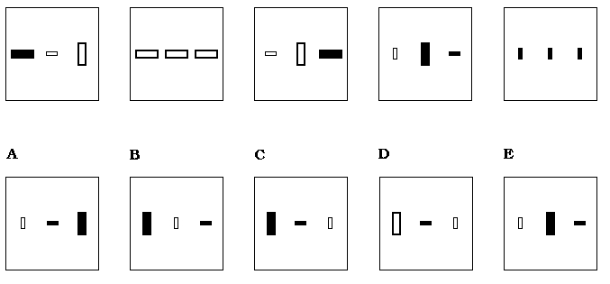

### Opciones disponibles

- **A.** A
- **B.** B
- **C.** C
- **D.** D
- **E.** E

---

### Respuesta y explicacion

La respuesta correcta es la **C**: C

In each diagram, every item undergoes an inversion, either of shading (shaded to unshaded, or vice versa), rotation (horizontal/vertical) or size (large/small).

The first set of changes (diagram two) inverts the shading of the first (left) item, the size of the second, and the rotation of the third.

In every diagram thereafter, the inversion rules shift left (e.g. in diagram three, the first item inverts size, the second rotation, and the third shading).

By diagram 6 (the correct answer), the appropriate pattern of inversions is: size, rotation, shading (1st, 2nd and 3rd items, respectively).

## Pregunta 242

Fuente: https://www.epsoprep.com/practice/attempt/en/UXVlc3Rpb25Qb29sQXR0ZW1wdDp6M08zX1UyTlVrN2tQZ2plMHIwTnVR/review?q=5

### Enunciado

From the options available, please choose which diagram would come next in the series.

### Imagen

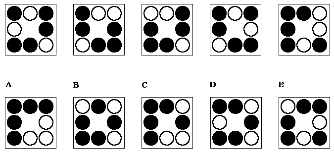

### Opciones disponibles

- **A.** A
- **B.** B
- **C.** C
- **D.** D
- **E.** E

---

### Respuesta y explicacion

La respuesta correcta es la **A**: A

The circles move alternately within their rows and columns (the central space is considered not to be a row or column, so in each diagram, there are always two circles which do not move).

Movement is determined according to a repeating four-diagram pattern: first, the six circles in columns move DOWN (looping from bottom to top); second, circles in rows move LEFT; third, circles in columns move UP, finally, circles in rows move RIGHT.

The correct answer is therefore the position in which the six circles in columns move down (only one of these movements is visible).

## Pregunta 243

Fuente: https://www.epsoprep.com/practice/attempt/en/UXVlc3Rpb25Qb29sQXR0ZW1wdDp6M08zX1UyTlVrN2tQZ2plMHIwTnVR/review?q=7

### Enunciado

From the options available, please choose which diagram would come next in the series.

### Imagen

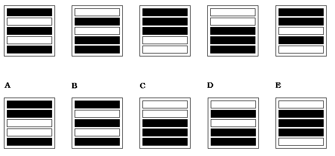

### Opciones disponibles

- **A.** A
- **B.** B
- **C.** C
- **D.** D
- **E.** E

---

### Respuesta y explicacion

La respuesta correcta es la **B**: B

There are five rectangles in a stack: three black and two white, in various configurations.

Each time, the order of the entire stack reverses, and then two further changes are made: the first (top) rectangle swaps position with the second (i.e. the one immediately below it), and the third (middle) swaps position with the fourth.

## Pregunta 244

Fuente: https://www.epsoprep.com/practice/attempt/en/UXVlc3Rpb25Qb29sQXR0ZW1wdDp6M08zX1UyTlVrN2tQZ2plMHIwTnVR/review?q=10

### Enunciado

From the options available, please choose which diagram would come next in the series.

### Imagen

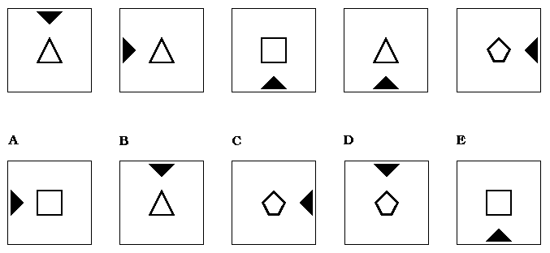

### Opciones disponibles

- **A.** A
- **B.** B
- **C.** C
- **D.** D
- **E.** E

---

### Respuesta y explicacion

La respuesta correcta es la **E**: E

The black triangle moves (always clockwise) around the outside of the diagram, in 90-degree increments.

The number of such increments is determined by the number of sides of the central shape in the previous diagram (e.g, a total of 270 degrees (3x90) for a triangle, or 360 degrees (4x90) for a square).

The nature of the central shape each time is random.

In the fifth diagram, the central shape is a pentagon.

The correct answer thus shows the black triangle having rotated a total of 450 degrees clockwise (5x90) from its position in diagram five; i.e. 90 degrees clockwise.

## Pregunta 245

Fuente: https://www.epsoprep.com/practice/attempt/en/UXVlc3Rpb25Qb29sQXR0ZW1wdDo0ajF5MlNtYzNrRE1LZ2plMHIwTnVR/review?q=1

### Enunciado

From the options available, please choose which diagram would come next in the series.

### Imagen

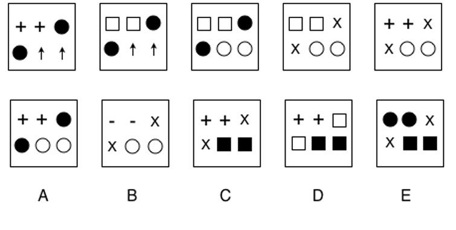

### Opciones disponibles

- **A.** A
- **B.** B
- **C.** C
- **D.** D
- **E.** E

---

### Respuesta y explicacion

La respuesta correcta es la **C**: C

In the first transition, the top left and top middle shapes change. In the case of the first frame, those are the crosses.

In the second transition, the bottom right and bottom middle shapes change. In the case of the second frame, the affected objects are the arrows.

In the third transition, the top right and bottom left shapes change. In the case of the third frame, the affected objects are the black dots.

This pattern repeats so we should be expecting the bottom middle and right shape to change while the others as usual stay unchanged.

## Pregunta 246

Fuente: https://www.epsoprep.com/practice/attempt/en/UXVlc3Rpb25Qb29sQXR0ZW1wdDo0ajF5MlNtYzNrRE1LZ2plMHIwTnVR/review?q=2

### Enunciado

From the options available, please choose which diagram would come next in the series.

### Imagen

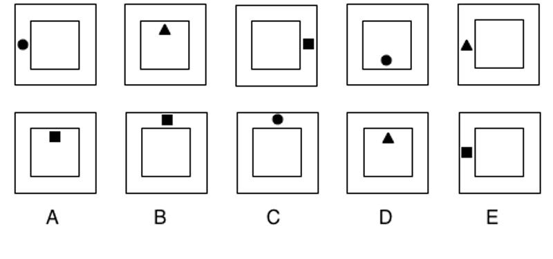

### Opciones disponibles

- **A.** A
- **B.** B
- **C.** C
- **D.** D
- **E.** E

---

### Respuesta y explicacion

La respuesta correcta es la **A**: A

The black shape moves clockwise at ¼ circle per frame.

It alternates between being inside or outside the square. Its shape follows the pattern circle – triangle – square – circle – triangle – square – etc.

## Pregunta 247

Fuente: https://www.epsoprep.com/practice/attempt/en/UXVlc3Rpb25Qb29sQXR0ZW1wdDo0ajF5MlNtYzNrRE1LZ2plMHIwTnVR/review?q=4

### Enunciado

From the options available, please choose which diagram would come next in the series.

### Imagen

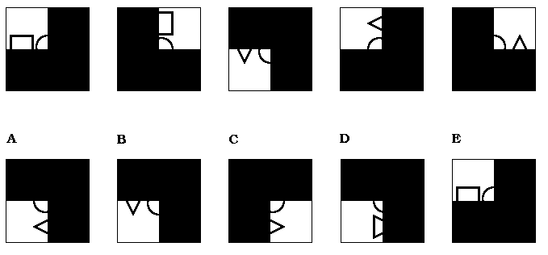

### Opciones disponibles

- **A.** A
- **B.** B
- **C.** C
- **D.** D
- **E.** E

---

### Respuesta y explicacion

La respuesta correcta es la **D**: D

In the background of each diagram are three large shapes: a square on the left, a circle in the middle. and a triangle on the right.

This entire background rotates by 90 degrees clockwise in each successive diagram making a four-diagram repeating pattern.

In the foreground is a black L-shape which occludes three-quarters of the background.

The quarter which remains visible moves according to a repeating three-diagram pattern: top left, top right, bottom left.

## Pregunta 248

Fuente: https://www.epsoprep.com/practice/attempt/en/UXVlc3Rpb25Qb29sQXR0ZW1wdDo0ajF5MlNtYzNrRE1LZ2plMHIwTnVR/review?q=6

### Enunciado

From the options available, please choose which diagram would come next in the series.

### Imagen

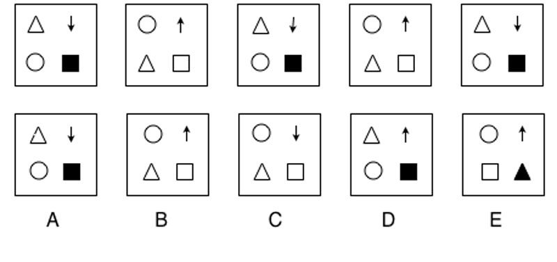

### Opciones disponibles

- **A.** A
- **B.** B
- **C.** C
- **D.** D
- **E.** E

---

### Respuesta y explicacion

La respuesta correcta es la **B**: B

The circle alternates between the bottom left and top left.

The triangle alternates between the top left and bottom left. The arrow stays top right and alternates between pointing down and up.

The square stays bottom right and alternates between black and white.

## Pregunta 249

Fuente: https://www.epsoprep.com/practice/attempt/en/UXVlc3Rpb25Qb29sQXR0ZW1wdDo0ajF5MlNtYzNrRE1LZ2plMHIwTnVR/review?q=8

### Enunciado

From the options available, please choose which diagram would come next in the series.

### Imagen

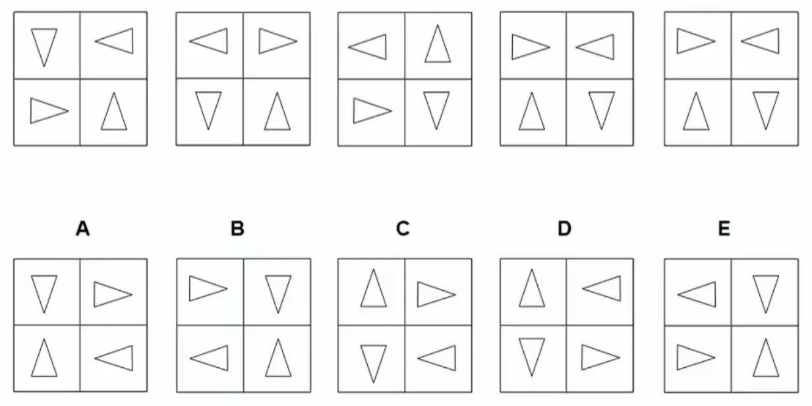

### Opciones disponibles

- **A.** A
- **B.** B
- **C.** C
- **D.** D
- **E.** E

---

### Respuesta y explicacion

La respuesta correcta es la **B**: B

Each of the 5 diagrams is divided into four tiles. Each tile may move horizontally or vertically, displacing (i.e. exchanging places) with the other tile in its row or column, respectively.

When moving (rather than being displaced by a move), a tile always moves in the direction indicated by its arrow symbol.

Each diagram represents the result of two such moves, compared with the previous diagram.

The first tile to move, each time, is chosen according to a repeating four-part sequence: the down arrow then the up arrow then left, and then right.

The second tile to move is the one displaced by the first move.

So for example, in the first diagram, the arrow pointing down will move straight down in the second diagram. Because it displaces the tile pointing right, that tile first moves where the first tile was and then in the direction it is pointing.

## Pregunta 250

Fuente: https://www.epsoprep.com/practice/attempt/en/UXVlc3Rpb25Qb29sQXR0ZW1wdDo0ajF5MlNtYzNrRE1LZ2plMHIwTnVR/review?q=10

### Enunciado

From the options available, please choose which diagram would come next in the series.

### Imagen

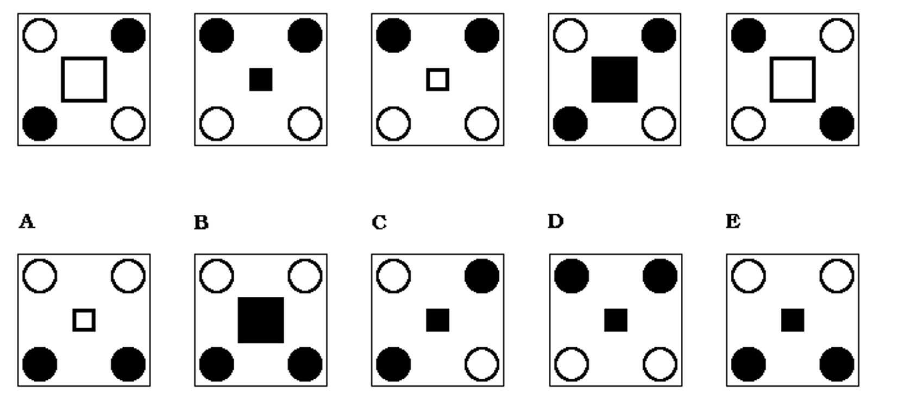

### Opciones disponibles

- **A.** A
- **B.** B
- **C.** C
- **D.** D
- **E.** E

---

### Respuesta y explicacion

La respuesta correcta es la **E**: E

In odd-numbered diagrams, the circles each move horizontally (i.e., the top left circle exchanges positions with the top right circle).

In even-numbered diagrams, including the correct answer, the circles on the left of the diagram exchange positions (top left with bottom left), and the circles on the right do not move.

The central square alternates between being shaded and unshaded.

In addition, it is large when the black circles are diagonally opposite one another and small otherwise.
