# Numerical Reasoning

Formato deduplicado para estudio.

## Pregunta 1

Fuente: https://www.epsoprep.com/practice/attempt/en/UXVlc3Rpb25Qb29sQXR0ZW1wdDp5VkVabFlLd1JFMnlYUWplMHIwTnVn/review?q=1

### Enunciado

In 2010, what was the ratio of GDP in the UK to that in Sweden?

### Imagen

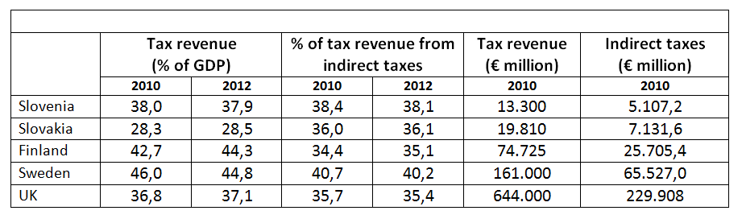

### Opciones disponibles

- **A.** 1 : 5
- **B.** 2 : 1
- **C.** 3 : 1
- **D.** 1 : 2
- **E.** 5 : 1

---

### Respuesta y explicacion

La respuesta correcta es la **E**: 5 : 1

Step 1 – Calculate the GDP in the UK in 2010

644.000/0,368 = 1.750.000

Step 2 – Calculate the GDP in Sweden in 2010

161.000/0,46 = 350.000

Step 3 – Calculate the ratio of UK’s GDP to Sweden’s

1.750.000 : 350.000 = 5 : 1

## Pregunta 2

Fuente: https://www.epsoprep.com/practice/attempt/en/UXVlc3Rpb25Qb29sQXR0ZW1wdDp5VkVabFlLd1JFMnlYUWplMHIwTnVn/review?q=2

### Enunciado

In 2007, the average productivity in the EU postal market, measured in terms of turnover per person, was 12% higher than in 2004. Given that employment in 2007 in the EU was down 2% from 2004, what was the turnover in 2004?

### Imagen

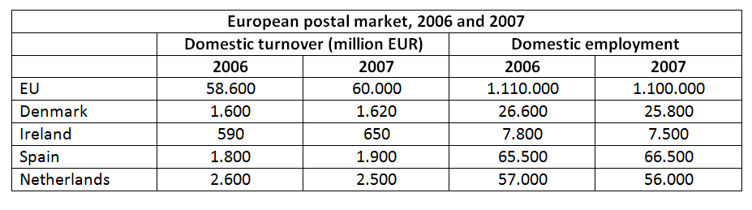

### Opciones disponibles

- **A.** 65.856 million Euro
- **B.** 52.500.000 Euro
- **C.** 54.665 million Euro
- **D.** 54.664.723.030 Euro
- **E.** 52.500 million Euro

---

### Respuesta y explicacion

La respuesta correcta es la **D**: 54.664.723.030 Euro

Step 1 – Work out the average productivity in the EU in 2007

60.000.000.000/1.100.000 = 54.545,45455

Step 2 – Work out the average productivity in the EU in 2004

54.545,45455/1,12 = 48.701,2987

Step 3 – Work out employment in the EU in 2004

1.100.000/0,98 = 1.122.448,98

Step 4 – Work out the turnover in the EU in 2004

1.122.448,98 x 48.701,2987 = 54.664.723.030

## Pregunta 3

Fuente: https://www.epsoprep.com/practice/attempt/en/UXVlc3Rpb25Qb29sQXR0ZW1wdDp5VkVabFlLd1JFMnlYUWplMHIwTnVn/review?q=3

### Enunciado

In 2011 in the EU, in terms of average expenditure per trip, the oldest group spent a little less than the ’45-64’ group, € 580 and €610 respectively. Given that the average total expenditure per trip was € 560, what was the average expenditure per trip for the ’15-44’ group?

### Imagen

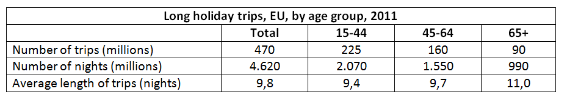

### Opciones disponibles

- **A.** € 620
- **B.** € 513
- **C.** € 504
- **D.** € 523
- **E.** € 540

---

### Respuesta y explicacion

La respuesta correcta es la **C**: € 504

Step 1 – Calculate the total expenditure

470 x 560 = 263.200 million

Step 2 – Calculate the expenditure in the 45-64 and 65+ age groups

(remember we need to take into consideration the number of trips of each age group as the questions asks for expenditure per trip)

45-64: 160 x 610 = 97.600 million

65+: 90 x 580 = 52.200

Step 3 – Calculate the expenditure in the 15-44 age group

263.200 – (97.600 + 52.200) = 113.400

Step 4 – Calculate the average expenditure per trip in the 15-44 age group

113.400/225 = € 504

## Pregunta 4

Fuente: https://www.epsoprep.com/practice/attempt/en/UXVlc3Rpb25Qb29sQXR0ZW1wdDp5VkVabFlLd1JFMnlYUWplMHIwTnVn/review?q=4

### Enunciado

Between 2011 and 2012, the number of natural gas companies with a market share of 5% or more in the EU decreased by ¹⁄₁₅, while the total number of natural gas companies increased by 12%. By what percentage have companies, with a market share of less than 5%, increased between 2003 and 2012 in the EU?

### Imagen

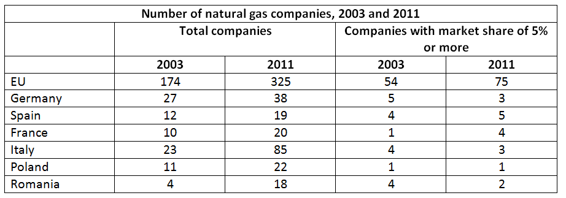

### Opciones disponibles

- **A.** 29,6%
- **B.** 108,3%
- **C.** 109,2%
- **D.** 166,7%
- **E.** 145,0%

---

### Respuesta y explicacion

La respuesta correcta es la **E**: 145,0%

Step 1 – Work out figures for 2012 in the EU

Companies 5%+: 75 x 14/15 = 70

Total companies: 325 x 1,12 = 364

Step 2 – Calculate the number of companies, with market share of less than 5% in 2003 and 2012

2003: 174 – 54 = 120

2012: 364 – 70 = 294

Step 3 – Work out the percentage increase between 2003 and 2012 for companies with market share of less than 5%

294/120 = 2,45 (145%)

## Pregunta 5

Fuente: https://www.epsoprep.com/practice/attempt/en/UXVlc3Rpb25Qb29sQXR0ZW1wdDp5VkVabFlLd1JFMnlYUWplMHIwTnVn/review?q=5

### Enunciado

In 2010, the average personnel costs across all businesses in the EU were EUR 30,9 thousand per employee. By how much did the average cost per employee across the whole motor and motorcycle trade differ from this overall business average in 2010?

### Imagen

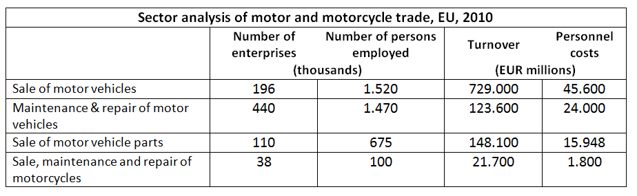

### Opciones disponibles

- **A.** 7,7 thousand lower
- **B.** 0,9 thousand lower
- **C.** 4,6 thousand higher
- **D.** 7,3 thousand lower
- **E.** 8,9 thousand lower

---

### Respuesta y explicacion

La respuesta correcta es la **A**: 7,7 thousand lower

Step 1 – Total the personnel costs across the motor trade

45.600 + 24.000 + 15.948 + 1.800 = 87.348 million

Step 2 – Total the number of persons employed across the motor trade

1.520 + 1.470 + 675 + 100 = 3.765 thousand

Step 3 – Work out the average cost per employee across the motor trade

87.348.000.000/3.765.000 = 23.200

Or 87.348/3.765 = 23,2 thousand

Step 4 – Work out the difference

30,9 – 23,2 = 7,7 thousand lower

## Pregunta 6

Fuente: https://www.epsoprep.com/practice/attempt/en/UXVlc3Rpb25Qb29sQXR0ZW1wdDp5VkVabFlLd1JFMnlYUWplMHIwTnVn/review?q=6

### Enunciado

If the population aged 20 – 64 in Ireland is growing by 18 thousand a year, how many more people would have needed to be employed in 2012 to have achieved the target 68,5% employment rate for that age group?

### Imagen

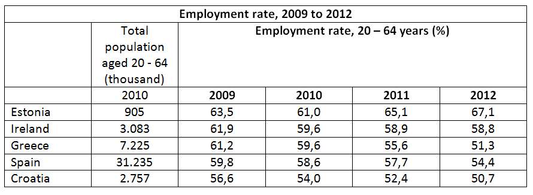

### Opciones disponibles

- **A.** 230 thousand
- **B.** 206 thousand
- **C.** 341 thousand
- **D.** 303 thousand
- **E.** 299 thousand

---

### Respuesta y explicacion

La respuesta correcta es la **D**: 303 thousand

Step 1 – Calculate the total population, aged 20 – 64, in 2012

3.083 + 18 + 18 = 3.119 thousand

Step 2 – Calculate the number needed to be employed in 2012 to meet 68,5% target

3.119 x 0,685 = 2.136,515 thousand

Step 3 – Calculate the actual number employed in 2012

3.119 x 0,588 = 1.833,972 thousand

Step 4 – Calculate the difference

2.136,515 – 1.833,972 = 302,543 thousand

## Pregunta 7

Fuente: https://www.epsoprep.com/practice/attempt/en/UXVlc3Rpb25Qb29sQXR0ZW1wdDp5VkVabFlLd1JFMnlYUWplMHIwTnVn/review?q=7

### Enunciado

The population of Romania decreased by 5% between 2005 and 2010. What percentage of Romania’s population were in tertiary education in 2010, given that 18,1% of the population were pupils or students in 2005?

### Imagen

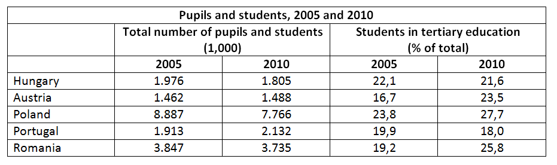

### Opciones disponibles

- **A.** 4,8%
- **B.** 18,5%
- **C.** 4,3%
- **D.** 19,6
- **E.** 4,2%

---

### Respuesta y explicacion

La respuesta correcta es la **A**: 4,8%

Step 1 – Calculate the total population in Romania in 2005

3.847/0,181 = 21.254,14365 thousand

Step 2 – Calculate the total population in Romania in 2010

21.254,14365 x 0,95 = 20.191,43646 thousand

Step 3 – Calculate how students were in tertiary education in 2010

3.735 x 0,258 = 963,63

Step 4 – Calculate the students in tertiary education as a percentage of the total population

963,63/20.191,43646 x 100 = 4,772468774% (4,8%)

## Pregunta 8

Fuente: https://www.epsoprep.com/practice/attempt/en/UXVlc3Rpb25Qb29sQXR0ZW1wdDp5VkVabFlLd1JFMnlYUWplMHIwTnVn/review?q=8

### Enunciado

In 2010 in the EU, the average turnover per employee in the motor market was ⅕ lower than the overall business average but 2% higher than the retail business average in the EU. What was the difference between the overall business average and the retail business average?

### Imagen

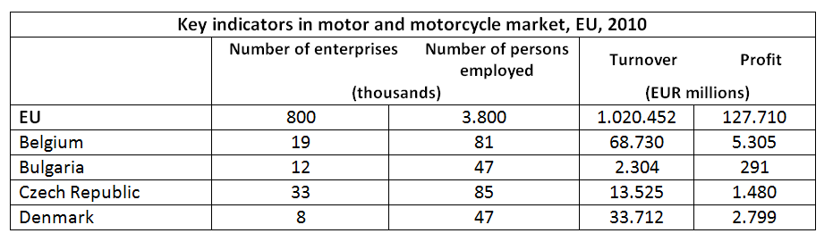

### Opciones disponibles

- **A.** 72,4
- **B.** 73.849
- **C.** 73,8
- **D.** 67.135
- **E.** 72.400

---

### Respuesta y explicacion

La respuesta correcta es la **E**: 72.400

Step 1 – Work out the average turnover per employee in the motor market

1.020.452.000.000/3.800.000 = 268.540

Step 2 – Work out the overall business average

268.540/(4/5) = 335.675

Step 3 – Work out the retail business average

268.540/1,02 = 263.274,5098

Step 4 – Work out the difference between them

335.675 - 263.274,5098 = 72.400,4902

## Pregunta 9

Fuente: https://www.epsoprep.com/practice/attempt/en/UXVlc3Rpb25Qb29sQXR0ZW1wdDp5VkVabFlLd1JFMnlYUWplMHIwTnVn/review?q=9

### Enunciado

What is the size (in km2) of Canada and United States combined?

### Imagen

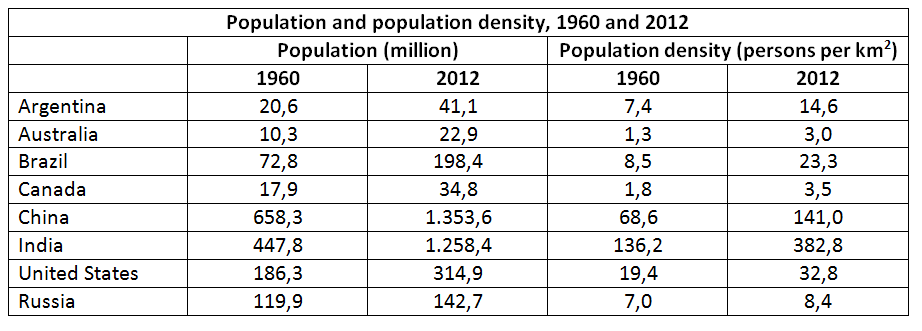

### Opciones disponibles

- **A.** 3.646.000
- **B.** 19.500.000
- **C.** 10.450.000
- **D.** 9.500.000
- **E.** 13.000.000

---

### Respuesta y explicacion

La respuesta correcta es la **B**: 19.500.000

Step 1 – Work out the area in km2 of Canada (you can use either year)

Population/area = population density

Area = Population/population density

1960: 17,9/1,8 = 9,944444444 million km2

2012: 34,8/3,5 = 9,942857143 million km2

The differences are due to rounding errors

Step 2 – Work out the area in sq km of the United States (you can use either year)

1960: 186,3/19,4 = 9,603092784 million km2

2012: 314,9/32,8 = 9,600609756 million km2

Step 3 – Add the two together

1960: 9,944444444 + 9,603092784 = 19,54753723 million km2

2012: 9,942857143 + 9,600609756 = 19,5434669 million km2

## Pregunta 10

Fuente: https://www.epsoprep.com/practice/attempt/en/UXVlc3Rpb25Qb29sQXR0ZW1wdDp5VkVabFlLd1JFMnlYUWplMHIwTnVn/review?q=10

### Enunciado

In 2010 in the EU, 32% of teachers were in secondary education. How many teachers were not in secondary education in the EU in 2010?

### Imagen

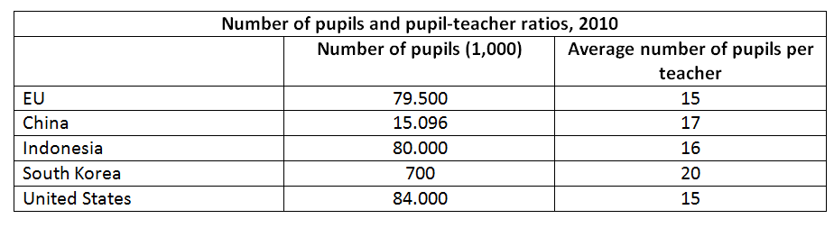

### Opciones disponibles

- **A.** 1.696.000
- **B.** 1.696
- **C.** 3.604
- **D.** 3.604.000
- **E.** 856.800

---

### Respuesta y explicacion

La respuesta correcta es la **D**: 3.604.000

Step 1 – Work out the how many teachers were in education in the EU in 2010

79.500/15 = 5.300 thousand

Step 2 – Work out the number of pupils not in secondary education in 2010

100 – 32 = 68%

5.300 x 0,68 = 3.604 thousand

## Pregunta 11

Fuente: https://www.epsoprep.com/practice/attempt/en/UXVlc3Rpb25Qb29sQXR0ZW1wdDp3bG0zNy1ZRmpFcXR3d2plMHIwTnVn/review?q=1

### Enunciado

The top 5 countries in the table below represented 52% of all permits issued in the EU in 2013. As there was an increase of 5,6% permits in 2013 compared to the previous year, how many permits were issued in the EU in 2012?

### Imagen

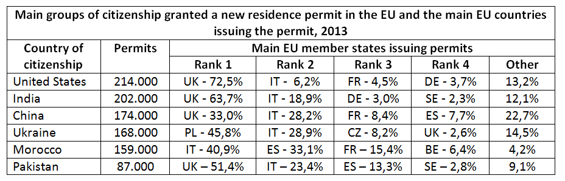

### Opciones disponibles

- **A.** 1.828.380
- **B.** 1.130.424
- **C.** 451.553
- **D.** 1.237.673
- **E.** 1.669.945

---

### Respuesta y explicacion

La respuesta correcta es la **E**: 1.669.945

Step 1 – Add up the top 5 countries

214.000 + 202.000 + 174.000 + 168.000 + 159.000 = 917.000

Step 2 – Work out the total number of permits issued in 2013

917.000 represent 52%

So 917.000/0,52 = 1.763.461,538

Step 3 – Calculate the number of permits issues in 2012

1.763.461,358/1,056 = 1.669.944,639

## Pregunta 12

Fuente: https://www.epsoprep.com/practice/attempt/en/UXVlc3Rpb25Qb29sQXR0ZW1wdDp3bG0zNy1ZRmpFcXR3d2plMHIwTnVn/review?q=2

### Enunciado

In 2010 GDP in Estonia was 2,5% up on 2009. How much more did Estonia need to spend on R & D to meet the target of 3% of GDP in 2009?

### Imagen

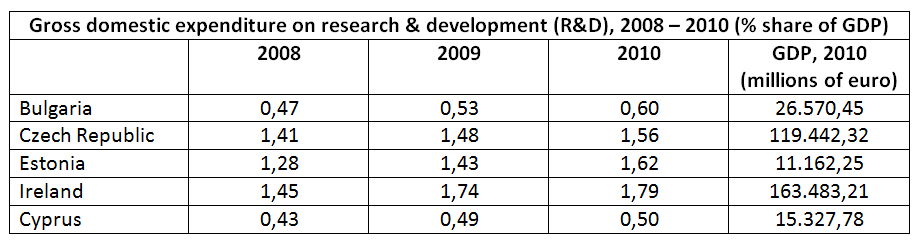

### Opciones disponibles

- **A.** 154,00 million Euros
- **B.** 170,97 million Euros
- **C.** 170,86 million Euros
- **D.** 150,28 million Euros
- **E.** 187,31 million Euros

---

### Respuesta y explicacion

La respuesta correcta es la **B**: 170,97 million Euros

Step 1 – Calculate GDP in Estonia in 2009

Since GDP grew by 2.5% from 2009 to 2010, we divide the 2010 value by 1.025 to reverse the increase and find the original value. This is the correct method when working backwards from a percentage increase.

11.162,25/1,025 = 10.890 million (inverted percentages)

Step 2 – Calculate how much Estonia spent on R & D in 2009

10.890 x 0,0143 = 155,727 million

Step 3 – Calculate how much the 3% target would have been in 2009

10.890 x 0,03 = 326,70 million

Step 4 – Work out how much Estonia needed to spend to meet 3% target

326,7 – 155,727 million = 170,973 million

## Pregunta 13

Fuente: https://www.epsoprep.com/practice/attempt/en/UXVlc3Rpb25Qb29sQXR0ZW1wdDp3bG0zNy1ZRmpFcXR3d2plMHIwTnVn/review?q=3

### Enunciado

In 2008, if 20.000 more people had been employed in fish and crustaceans and 40.000 more people had been employed in bakery products, what turnover would these two activities have made assuming that the same level of productivity could be maintained?

### Imagen

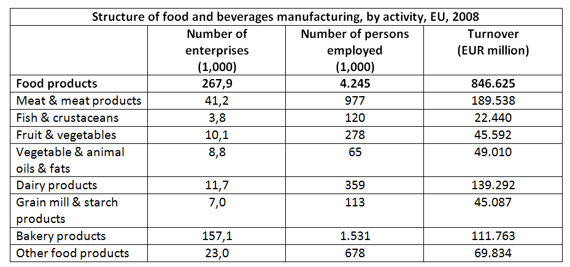

### Opciones disponibles

- **A.** 140.863 million Euros
- **B.** 676.282 million Euros
- **C.** 308.056 million Euros
- **D.** 78.332 million Euros
- **E.** 105.350 million Euros

---

### Respuesta y explicacion

La respuesta correcta es la **A**: 140.863 million Euros

Step 1 – Work out turnover per person in fish & crustaceans and thus turnover with 20.000 more people

22.440/120 = 187

187 x 140 = 26.180 (120 + 20 = 140)

Step 2 – Work out turnover per person in bakery products and thus turnover with 40.000 more people

111.763/1531 = 73

73 x 1571 = 114.683 (1531 + 40 = 1571)

Step 3 – Calculate the turnover for both activities

26.180 + 114.683 = 140.863 million

## Pregunta 14

Fuente: https://www.epsoprep.com/practice/attempt/en/UXVlc3Rpb25Qb29sQXR0ZW1wdDp3bG0zNy1ZRmpFcXR3d2plMHIwTnVn/review?q=4

### Enunciado

Between 2006 and 2011, the trade balance (the difference between exports and imports) decreased by 25% while total imports increased by 25%. By what percentage did exports change between 2006 and 2011?

### Imagen

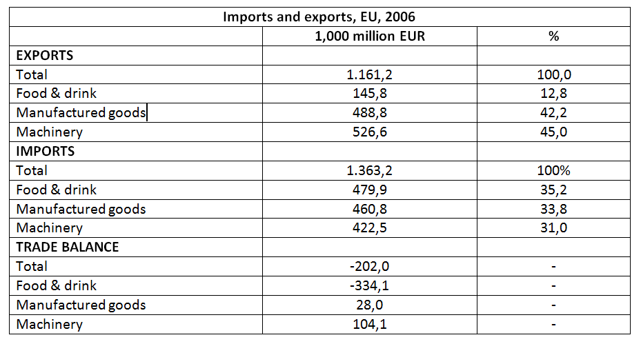

### Opciones disponibles

- **A.** 25,0%
- **B.** 74,9%
- **C.** 25,1%
- **D.** 58,8%
- **E.** 33,7%

---

### Respuesta y explicacion

La respuesta correcta es la **E**: 33,7%

Step 1 – Calculate total imports in 2011

1.363,2 x 1,25 = 1.704,0 thousand million

Step 2 – Calculate the trade balance in 2011

In 2011, Trade Balance decreased by 25%, so we need to multiply it with 0,75 (marking a 25% decrease)

-202,0 x 0,75 = -151,5 thousand million

Step 3 – Calculate total exports in 2011

1704,0 – 151,5 = 1.552,5 thousand million

Step 4 – Calculate the % change in exports between 2006 and 2011

1.552,5/1.161,2 = 1,336978987 (33,698%)

## Pregunta 15

Fuente: https://www.epsoprep.com/practice/attempt/en/UXVlc3Rpb25Qb29sQXR0ZW1wdDp3bG0zNy1ZRmpFcXR3d2plMHIwTnVn/review?q=5

### Enunciado

In the EU in social sciences, the ratio of male students was 0,80 for each female student. What percentage of female graduates studied social science?

### Imagen

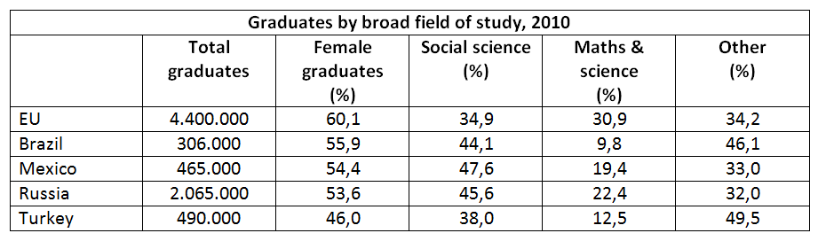

### Opciones disponibles

- **A.** 21,0%
- **B.** 34,9%
- **C.** 25,8%
- **D.** 28,6%
- **E.** 32,3%

---

### Respuesta y explicacion

La respuesta correcta es la **E**: 32,3%

Step 1 – Work out the number of students who graduated in social science in the EU in 2010

4.400.000 x 0,349 = 1.535.600

Step 2 – Work out the number of females who graduated in social science

Ratio is 0,8 to 1,0 so total parts is 1,8

1.535.600 x 1,0/1,8 =853.111,1111 (females 1 part out of 1,8)

Step 3 – Work out total number of female graduates

4.400.000 x 0,601 = 2.644.400

Step 4 – Work out share of female graduates who studied social science

853.111,1111/2.644.400 x 100 = 0,322610464 (32,3%)

## Pregunta 16

Fuente: https://www.epsoprep.com/practice/attempt/en/UXVlc3Rpb25Qb29sQXR0ZW1wdDp3bG0zNy1ZRmpFcXR3d2plMHIwTnVn/review?q=6

### Enunciado

In 2007, Poland and Romania accounted for 40% of the EU’s farming workforce. Poland and Romania’s labour force were in the ratio of 10:13. What country had 30% of Romania’s workforce?

### Imagen

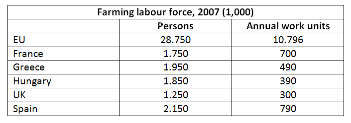

### Opciones disponibles

- **A.** France
- **B.** Greece
- **C.** Hungary
- **D.** UK
- **E.** Spain

---

### Respuesta y explicacion

La respuesta correcta es la **B**: Greece

Step 1 – Work out 40% of the total EU workforce

28.750 x 0,4 = 11.500

Step 2 – Work out the workforce in Romania

10:13 means 23 parts in total and Romania has 13 parts out of 23

11.500 x 13/23 = 6.500

Step 3 – Calculate 30% of Romania’s workforce and identify the country

6.500 x 0,3 = 1.950 Greece

## Pregunta 17

Fuente: https://www.epsoprep.com/practice/attempt/en/UXVlc3Rpb25Qb29sQXR0ZW1wdDp3bG0zNy1ZRmpFcXR3d2plMHIwTnVn/review?q=7

### Enunciado

In 2009, pig meat production was 2,8 times as high as beef production and 35 times higher than the production of sheep meat. How much higher was cereal production than meat production in the EU in 2009?

### Imagen

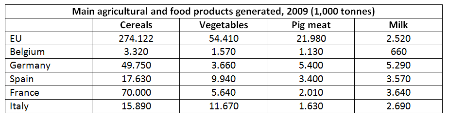

### Opciones disponibles

- **A.** 6 times
- **B.** 3 times
- **C.** 12 times
- **D.** 9 times
- **E.** ¹⁄₉ times

---

### Respuesta y explicacion

La respuesta correcta es la **D**: 9 times

Step 1 – Work out how much beef was produced in 2009

21.980/2,8 = 7.850

Step 2 – Work out how much sheep meat was produced in 2009

21.980/35 = 628

Step 3 – Calculate the total meat production in 2009

21.980 + 7.850 + 628 = 30.458

Step 4 – Work out how much more cereal was produced than meat

274.122/30.458 = 9

## Pregunta 18

Fuente: https://www.epsoprep.com/practice/attempt/en/UXVlc3Rpb25Qb29sQXR0ZW1wdDp3bG0zNy1ZRmpFcXR3d2plMHIwTnVn/review?q=8

### Enunciado

In 2007, 70% of the total turnover of postal operators in the EU was created by Germany, France, the UK and Italy. Given that the postal turnover for the EU as a whole was 0,5% of the EU GDP, what was the EU GDP in 2007?

### Imagen

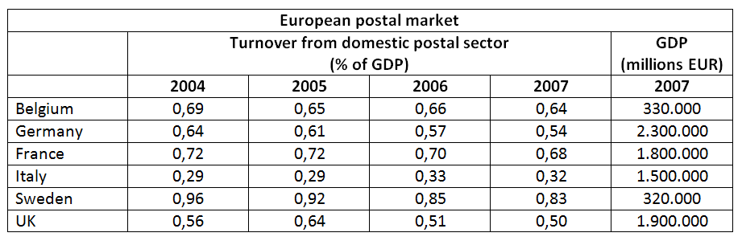

### Opciones disponibles

- **A.** 7.792.000 million Euro
- **B.** 1.113.142 million Euro
- **C.** 111.314.286 million Euro
- **D.** 11.131.429 million Euro
- **E.** 1.113.142.857 million Euro

---

### Respuesta y explicacion

La respuesta correcta es la **D**: 11.131.429 million Euro

Step 1 – Work out the turnover in Germany, France, Italy and UK in 2007

Germany: 2.300.000 x 0,0054 = 12.420 million (be careful with the percentage!)

France: 1.800.000 x 0,0068 = 12.240 million

Italy: 1.500.000 x 0,0032 = 4.800 million

UK: 1.900.000 x 0,005 = 9.500 million

Step 2 – Work out the total postal turnover in the EU in 2007

12.240 + 12.240 + 4.800 + 9.500 = 38.960 is 70% of total EU turnover

38.960/0,7 = 55.657,14286

Step 3 – Work out the EU GDP in 2007

55.657,14286/0,005 = 11.131.428,57 million

## Pregunta 19

Fuente: https://www.epsoprep.com/practice/attempt/en/UXVlc3Rpb25Qb29sQXR0ZW1wdDp3bG0zNy1ZRmpFcXR3d2plMHIwTnVn/review?q=9

### Enunciado

Between 1990 and 2011, the total electricity generated from renewable sources increased by 119%. How much electricity was generated from renewable sources in 1990?

### Imagen

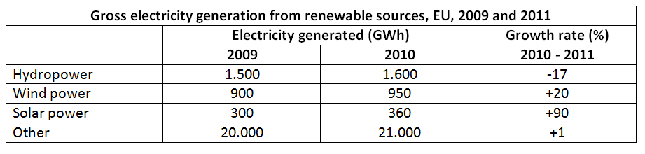

### Opciones disponibles

- **A.** 11.987
- **B.** 11.124
- **C.** 20.472
- **D.** 22.061
- **E.** 10.642

---

### Respuesta y explicacion

La respuesta correcta es la **B**: 11.124

Step 1 – Work out how much electricity was generated in 2011

Hydropower: 1.600 x 0,83 = 1.328 (100 – 17 = 83%)

Wind power: 950 x 1,2 = 1.140

Solar power: 360 x 1,90 = 684

Other: 21.000 x 1,01 = 21.210

Step 2 – Total the electricity generated in 2011

1.328 + 1.140 + 684 + 21.210 = 24.362

Step 3 – Work out the electricity generated in 1990

24.362/2,19 = 11.124,20091

## Pregunta 20

Fuente: https://www.epsoprep.com/practice/attempt/en/UXVlc3Rpb25Qb29sQXR0ZW1wdDp3bG0zNy1ZRmpFcXR3d2plMHIwTnVn/review?q=10

### Enunciado

In 2011, how many households in Turkey had children as a percentage of households in Europe with children?

### Imagen

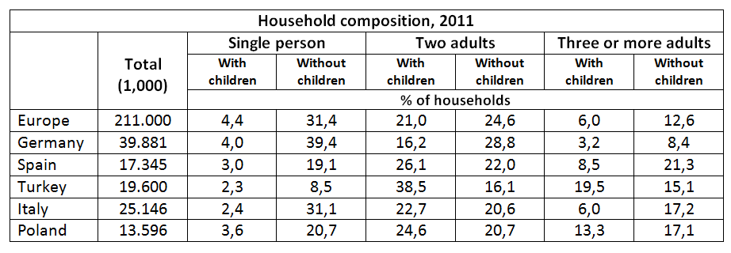

### Opciones disponibles

- **A.** 19,9%
- **B.** 17,8%
- **C.** 17,0%
- **D.** 30,2%
- **E.** 9,3%

---

### Respuesta y explicacion

La respuesta correcta es la **B**: 17,8%

Step 1 – Work out the percentage of households have children in Turkey and from this the number of households

2,3 + 38,5 + 19,5 = 60,3%

So 19.600 x 0,603 = 11.818,8 thousand households

Step 2 – Work out the percentage of households have children in Europe and from this the number of households

4,4 + 21,0 + 6,0 = 31,4%

So 211.000 x 0,314 = 66.254 thousand households

Step 3 – Work out Turkey’s share as a percentage of Europe

11.818,8/66.254 x 100 = 17,83862106%

## Pregunta 21

Fuente: https://www.epsoprep.com/practice/attempt/en/UXVlc3Rpb25Qb29sQXR0ZW1wdDpQZnQ2SjU0Q09VVmZvQWplMHIwTnVn/review?q=1

### Enunciado

EU imports of natural gas grew by 46% between 2001 and 2011. In 2011, Russia was the principal supplier with a 30% share of total natural gas, which compared to its 2001 share, is down by 15 percentage points. How much natural gas was imported from Russia in 2001?

### Imagen

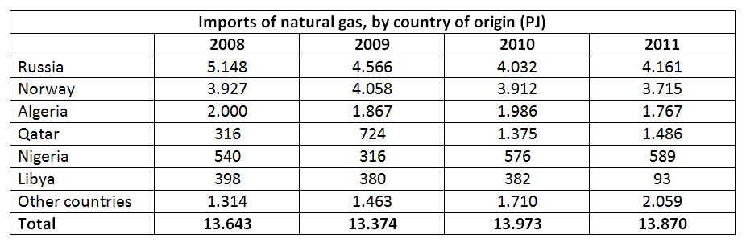

### Opciones disponibles

- **A.** 3.353 PJ
- **B.** 6.242 PJ
- **C.** 3.370 PJ
- **D.** 5.673 PJ
- **E.** 4.275 PJ

---

### Respuesta y explicacion

La respuesta correcta es la **E**: 4.275 PJ

Step 1 – Work out the total imports in 2001

13.870/1,46 = 9.500

Step 2 – Work out Russia’s share in 2001

30 + 15 = 45%

Step 3 – Calculate amount imported from Russia in 2001

9.500 x 0,45 = 4.275

## Pregunta 22

Fuente: https://www.epsoprep.com/practice/attempt/en/UXVlc3Rpb25Qb29sQXR0ZW1wdDpQZnQ2SjU0Q09VVmZvQWplMHIwTnVn/review?q=2

### Enunciado

In 2012, in Poland, the average number of days training for persons aged 25 to 64 years was 20 days. Females in that age group had an average 15 days training. How many days of training on average did males aged 25 to 64 years have in Poland?

### Imagen

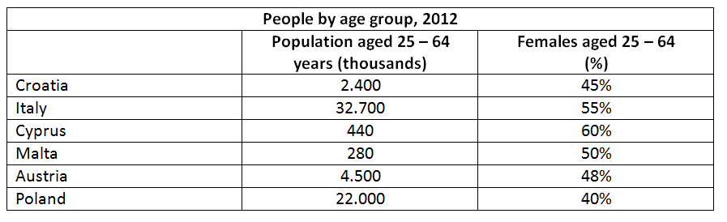

### Opciones disponibles

- **A.** 23,3 days
- **B.** 25 days
- **C.** 14 days
- **D.** 26,5 days
- **E.** 23⅓ days

---

### Respuesta y explicacion

La respuesta correcta es la **E**: 23⅓ days

Step 1 – Calculate the total number of training days.

22.000 x 20 = 440.000

Step 2 – Calculate the number of females and males aged 25 to 64 years in Poland.

22.000 x 0,4 = 8.800 females

So there are 22.000 – 8,800 = 13.200 males

Step 3 – Work out total training days for females.

8.800 x 15 = 132.000

Step 4 – Work out average training days for males aged 25 to 64 years.

(440.000 – 132.000)/13.200 = 23 ⅓ days

Note: 23,3 is not the same as 23⅓ which is 23,333333 recurring.

Answer 23⅓ is more accurate.

## Pregunta 23

Fuente: https://www.epsoprep.com/practice/attempt/en/UXVlc3Rpb25Qb29sQXR0ZW1wdDpQZnQ2SjU0Q09VVmZvQWplMHIwTnVn/review?q=3

### Enunciado

Between 2001 and 2008, EU net imports of solid fuels grew by 27%, followed by an 18% decrease between 2008 and 2009. From 2009 to 2010, they presented a further decline of 2 percentage points while in 2011 they marked an 8% increase compared to 2010. What were the net imports of solid fuels in 2001?

### Imagen

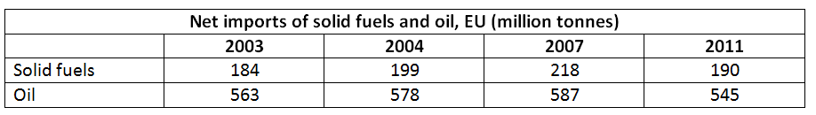

### Opciones disponibles

- **A.** 235 million tonnes
- **B.** 171 million tonnes
- **C.** 172 million tonnes
- **D.** 798 million tonnes
- **E.** 169 million tonnes

---

### Respuesta y explicacion

La respuesta correcta es la **C**: 172 million tonnes

Step 1 – Work out the net imports for 2010

190/1,08 = 175,9259259

Step 2 – Calculate the net imports for 2009

175,9259259/0,98 = 179,5162509

Step 3 – Calculate the net imports for 2008

179,5162509/0,82 = 218,9222572

Step 4 – Calculate the net imports for 2001

218,9222572/1,27 = 172,3797301 (million tonnes)

Note: Students should not round up or down between calculations

## Pregunta 24

Fuente: https://www.epsoprep.com/practice/attempt/en/UXVlc3Rpb25Qb29sQXR0ZW1wdDpQZnQ2SjU0Q09VVmZvQWplMHIwTnVn/review?q=4

### Enunciado

In Sweden, the number of nights spent in hotels in 2013 was 10% of Spain’s. Between 2012 and 2013 the number of nights spent in hotels in Sweden grew by 1,5 percentage points more than the percentage change experienced by Spain in the same period. How many nights were spent in hotels in Sweden in 2012?

### Imagen

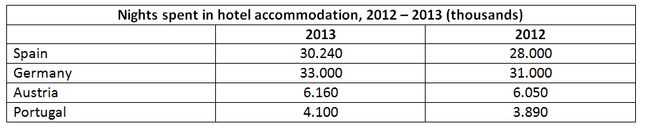

### Opciones disponibles

- **A.** 2.777
- **B.** 2.557
- **C.** 2.797
- **D.** 2.762
- **E.** 2.443

---

### Respuesta y explicacion

La respuesta correcta es la **D**: 2.762

Step 1 – Work out the number of nights spent in hotels in Sweden in 2013

30.240 x 0,1 = 3.024

Step 2 – Work out percentage change in the number of hotel nights in Spain between 2012 and 2013 and thus the percentage change for Sweden

30.240/28.000 = 1,08 (or 8%)

So 8 + 1,5 = 9,5% is Sweden’s percentage change

Step 3 – Work out the number of nights spent in hotels in Sweden in 2012

3.024/1,095 = 2.761,643836

## Pregunta 25

Fuente: https://www.epsoprep.com/practice/attempt/en/UXVlc3Rpb25Qb29sQXR0ZW1wdDpQZnQ2SjU0Q09VVmZvQWplMHIwTnVn/review?q=5

### Enunciado

What was the highest public expenditure on education as a percentage of GDP in 2009?

### Imagen

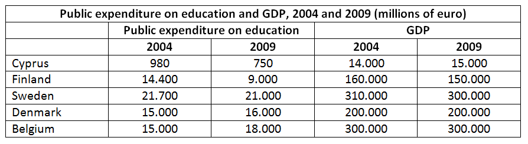

### Opciones disponibles

- **A.** 5%
- **B.** 6%
- **C.** 7%
- **D.** 8%
- **E.** 9%

---

### Respuesta y explicacion

La respuesta correcta es la **D**: 8%

This can be worked out quickly using mental estimation and comparing across countries:

Cyprus: 75/1500 = 5%

Finland: 9/150 = 6%

Sweden: 21/300 = 7%

Denmark: 16/200 = 8%

Belgium: 18/300 = 6%

It is possible to exclude many countries before performing the calculations: Belgium can be quickly dismissed as it spends less than Sweden with the same GDP.

Cyprus can also be dismissed as its GDP is 1⁄10 of that of Finland so Cyprus’s expenditure is going to be a smaller percentage than Finland's.

Also, Finland has a GDP half of Sweden’s and yet its expenditure is less than half of Sweden’s

This leaves Sweden and Denmark.

## Pregunta 26

Fuente: https://www.epsoprep.com/practice/attempt/en/UXVlc3Rpb25Qb29sQXR0ZW1wdDpQZnQ2SjU0Q09VVmZvQWplMHIwTnVn/review?q=6

### Enunciado

Between 1991 and 2011, the share of the population aged less than 15 years in Estonia decreased by 6,9 percentage points, while the share of the older population (65 years and above) increased by 5,4 percentage points. At the same time the population in Estonia decreased by 16%. How many people were aged between 15 and 64 years in 1991 in Estonia?

### Imagen

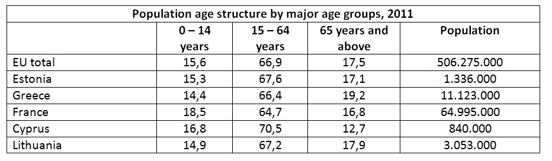

### Opciones disponibles

- **A.** 1.071.600
- **B.** 1.024.391
- **C.** 761.290
- **D.** 741.800
- **E.** 1.051.305

---

### Respuesta y explicacion

La respuesta correcta es la **E**: 1.051.305

Step 1 – Work out the share of the population aged between 15 and 64 in Estonia in 1991

100 – (15,3 + 6,9) – (17,1 – 5,4) = 66,1%

Or -6,9 + 5,4 = -1,5 so 67,6 – 1,5 = 66,1%

Step 2 – Work out the population in Estonia in 1991

1.336.000/0,84 = 1.590.476,19

Step 3 – Work out the number of people aged between 15 and 64 in Estonia in 1991

1.590.476,19 x 0,661 = 1.051.304,762

## Pregunta 27

Fuente: https://www.epsoprep.com/practice/attempt/en/UXVlc3Rpb25Qb29sQXR0ZW1wdDpQZnQ2SjU0Q09VVmZvQWplMHIwTnVn/review?q=7

### Enunciado

In Cyprus, in 2009 the ratio of total milk production to total meat production was 18:7. Within meat production, the ratio of cattle to pigs to sheep was in the same ratio as in 2011. Total agricultural production in Cyprus in 2009 was 225 thousand tonnes. How much pig and sheep meat was produced in 2009?

### Imagen

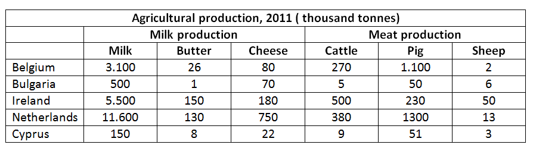

### Opciones disponibles

- **A.** 54 thousand tonnes
- **B.** 372 thousand tonnes
- **C.** 58 thousand tonnes
- **D.** 162 thousand tonnes
- **E.** 51 thousand tonnes

---

### Respuesta y explicacion

La respuesta correcta es la **A**: 54 thousand tonnes

Step 1 – Calculate total meat production.

Total parts across milk and meat production: 18 + 7 = 25

So meat production is 7 parts of 25 of the total: 7/25 x 225 = 63

Step 2 – Work out the ratio of cattle to pigs to sheep in 2009

9 : 51 : 3 = 3 : 17 : 1

So the total parts is 3 + 17 + 1 = 21

Step 3 - Work out the share of pig and sheep meat production.

Pig meat is 17 parts of 21 = 17/21 x 63 = 51

Sheep meat is 1 part of 21 = 1/21 x 63 = 3

Step 4 – The total of pig and sheep meat production in 2009.

51 + 3 = 54 (thousand tonnes)

## Pregunta 28

Fuente: https://www.epsoprep.com/practice/attempt/en/UXVlc3Rpb25Qb29sQXR0ZW1wdDpQZnQ2SjU0Q09VVmZvQWplMHIwTnVn/review?q=8

### Enunciado

What was the total percentage growth rate in the transport of goods in Belgium between 2011 and 2012?

### Imagen

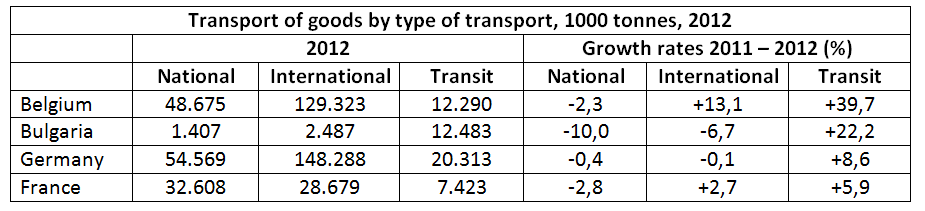

### Opciones disponibles

- **A.** +12,6%
- **B.** -16,8%
- **C.** -10,0%
- **D.** +10,0%
- **E.** +16,8%

---

### Respuesta y explicacion

La respuesta correcta es la **D**: +10,0%

Step 1 - Work out the national, international and transit totals in 2011

National: 48.675/0,977 = 49.820,88025 (100 – 2,3 = 97,7%)

International: 129.323/1,131 = 114.343,9434

Transit: 12.290/1,397 = 8.797,423049

Step 2 – Work out the total transport in 2011 and 2012

2011 49.820,88025 + 114.343,9434 + 8.797,423049 = 172.962,2467

2012 48.675 + 129.323 + 12.290 = 190.288

Step 3 – Calculate the percentage change

190.288/172.962,2467 = 1,100170723 (+10%)

## Pregunta 29

Fuente: https://www.epsoprep.com/practice/attempt/en/UXVlc3Rpb25Qb29sQXR0ZW1wdDpQZnQ2SjU0Q09VVmZvQWplMHIwTnVn/review?q=9

### Enunciado

In 2010, it cost the Netherlands €100 to process each asylum applicant. The cost per applicant has reduced by 4% every year since then. How much did the Netherlands spend on asylum applicants in 2013?

### Imagen

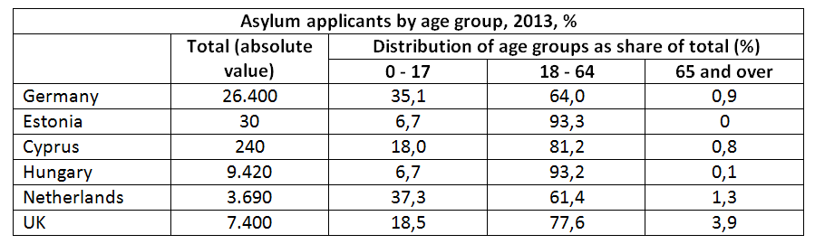

### Opciones disponibles

- **A.** €326.468
- **B.** €326.454
- **C.** €324.720
- **D.** €354.240
- **E.** €340.070

---

### Respuesta y explicacion

La respuesta correcta es la **A**: €326.468

Steps 1 to 3 – Find the cost per applicant in 2013.

2011: 100 x 0,96 = 96

2012: 96 x 0,96 = 92,16

2013: 92,16 x 0,96 = 88,4736

Step 4 –

Find the total amount spent per applicant in 2013

3.690 x 88,4736 = €326.467,58

Tip 1:

Steps 1 to 3 can be completed in one step by using the following formula to work out the compound percentage over three years.

Any student who knows this can save time. 100 x (0,96)3 = €88,47

(To calculate (0,96)3 on a calucalator simply do 0,96*0,96*0,96)

Tip 2:

If the student rounds down the final percentage in Step 3 to 88,47, he/she will arrive at the answer €326.454.

You should not round intermediate answers.

## Pregunta 30

Fuente: https://www.epsoprep.com/practice/attempt/en/UXVlc3Rpb25Qb29sQXR0ZW1wdDpQZnQ2SjU0Q09VVmZvQWplMHIwTnVn/review?q=10

### Enunciado

In France, there was a 24% decline in transport volumes between 2008 and 2009 followed by a 32% recovery in 2010. What was the percentage change in transport volumes in France in between 2008 and 2012?

### Imagen

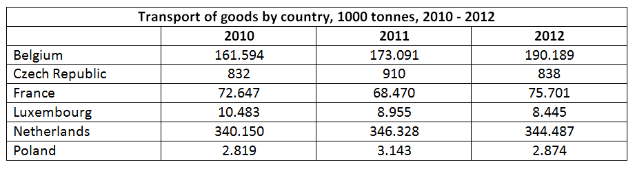

### Opciones disponibles

- **A.** -4,5%
- **B.** +53,9%
- **C.** +4,5%
- **D.** +12,3%
- **E.** +1,8%

---

### Respuesta y explicacion

La respuesta correcta es la **C**: +4,5%

Step 1 - Work out the transport volumes in France in 2009

72.647/1,32 = 55.035,60606

Step 2 – Work out transport volumes in France in 2008

55.035,60606/0,76 = 72.415,27113 (100 – 24 = 76%)

Step 3 – Calculate the percentage change between 2008 and 2012

75.701/72.415,27113 = 1,045373425 (4,5%)

## Pregunta 31

Fuente: https://www.epsoprep.com/practice/attempt/en/UXVlc3Rpb25Qb29sQXR0ZW1wdDo3ZHlWMVA0QlNFTkI4d2plMHIwTnVn/review?q=1

### Enunciado

In 2011, total greenhouse gas emissions in the EU had dropped by 20% from 1990. Transport was the only sector to increase from 1990, rising by 20%. Given that agriculture and industry reduced by 30%, and waste and solvent decreased by 50% in the same period, by what percentage has the energy sector increased or decreased between 1990 and 2011?

### Imagen

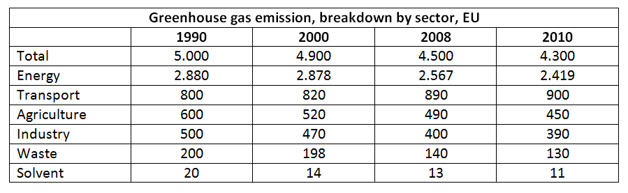

### Opciones disponibles

- **A.** 75% decrease
- **B.** 67% decrease
- **C.** 25% decrease
- **D.** 75% increase
- **E.** 25% increase

---

### Respuesta y explicacion

La respuesta correcta es la **C**: 25% decrease

Step 1 – Work out the values for 2011

Total: 5.000 x 0,8 = 4.000

Transport: 800 x 1,2 = 960 (10% is 80 so 800 + (2 x 80) = 960)

Agriculture: 600 x 0,7 = 420 (10% is 60 so 600 – (3 x 60) = 420)

Industry: 500 x 0,7 = 350 (10% is 50 so 500 – (3 x 50) = 350)

Waste: 200 x 0,5 = 100

Solvent: 20 x 0,5 = 10

Step 2 – Work out the energy figure for 2011

4.000 – (960 + 420 + 350 + 100 + 10) = 2.160

Step 3 – Work out the percentage increase/decrease

2.160/2.880 = 75% so it has decreased by 25%

Note: no calculator is required. Answers (d) and (e) can be discounted as they are increases.

## Pregunta 32

Fuente: https://www.epsoprep.com/practice/attempt/en/UXVlc3Rpb25Qb29sQXR0ZW1wdDo3ZHlWMVA0QlNFTkI4d2plMHIwTnVn/review?q=3

### Enunciado

In 2010, Germany, the UK, Italy and the Czech Republic accounted for 55% of businesses in the IT sector in the EU but accounted for 15 percentage points less of total turnover in the EU. What was the average turnover per IT business in the EU in 2010?

### Imagen

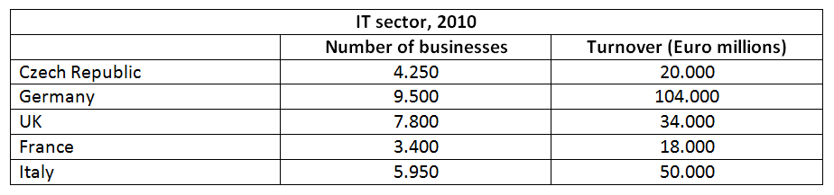

### Opciones disponibles

- **A.** €27,7 million
- **B.** €10,1 million
- **C.** €10,4 million
- **D.** €8,9 million
- **E.** €6,4 million

---

### Respuesta y explicacion

La respuesta correcta es la **C**: €10,4 million

Step 1 – Work out the total number of IT businesses in the EU in 2010

(4.250 + 9.500 + 7.800 + 5.950)/0,55 = 50.000

Step 2 – Calculate the turnover in the EU in 2010

Percentage of total is 55 – 15 = 40%

(Remember, 15 here represents 15 percentage points less of total turnover in the EU)

(20.000 + 104.000 + 34.000 + 50.000)/0,4 = 520.000 million

Step 3 – Calculate average turnover per IT business

520.000/50.000 = 10,4 million

## Pregunta 33

Fuente: https://www.epsoprep.com/practice/attempt/en/UXVlc3Rpb25Qb29sQXR0ZW1wdDo3ZHlWMVA0QlNFTkI4d2plMHIwTnVn/review?q=7

### Enunciado

In 2011, the volume of fish catches in the EU fell by 2% from 2010. This represented a decline of 40% since 1995. What was the difference in the weight of catches between 1995 and 2011?

### Imagen

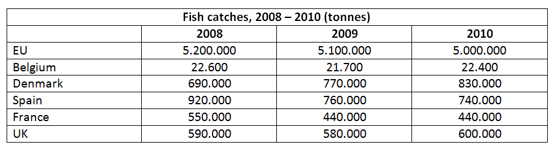

### Opciones disponibles

- **A.** 3.266.667 tonnes
- **B.** 3.401.361 tonnes
- **C.** 3.400.000 tonnes
- **D.** 7.350.000 tonnes
- **E.** 3.166.667 tonnes

---

### Respuesta y explicacion

La respuesta correcta es la **A**: 3.266.667 tonnes

Step 1 – Work out the total number of catches in the EU in 2011

5.000.000 x 0,98 = 4.900.000

Step 2 – Work out the total number of catches in the EU in 1995

4.900.000/0,6 = 8.166.666,667 (a 40% reduction since 1995)

Step 3 – Work out the difference between 1995 and 2011

8.166.666,667 – 4.900.000 = 3.266.666,667

## Pregunta 34

Fuente: https://www.epsoprep.com/practice/attempt/en/UXVlc3Rpb25Qb29sQXR0ZW1wdDo3ZHlWMVA0QlNFTkI4d2plMHIwTnVn/review?q=8

### Enunciado

In 2011, total EU milk production was 240 million tonnes. The amount of cheese produced in the EU was in the same proportion as that of Germany’s cheese production to the proportion of Germany’s total milk products in 2011. The amount of butter produced in the EU was in the same proportion to that of France’s production of butter as a proportion of France’s total milk products in 2011. And the amount of cream produced as in the same proportion to Italy’s production of cream as a proportion of Italy’s total milk products. The remaining was used as drinking milk. How much drinking milk was produced in the EU in 2011?

### Imagen

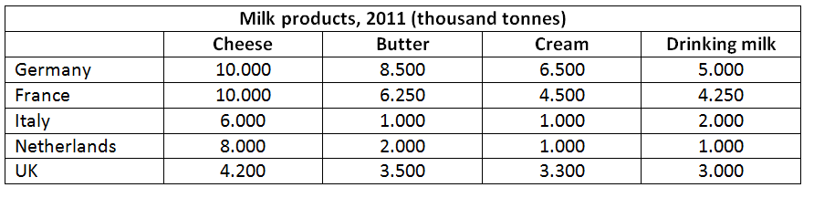

### Opciones disponibles

- **A.** 51 million tonnes
- **B.** 48 million tonnes
- **C.** 40 million tonnes
- **D.** 76 million tonnes
- **E.** 76 thousand tonnes

---

### Respuesta y explicacion

La respuesta correcta es la **D**: 76 million tonnes

Step 1 – Calculate how much cheese was made in the EU.

10.000/30.000 x 240 = 80 million tonnes

Step 2 – Calculate how much butter was produced in the EU.

6.250/25.000 x 240 = 60 million tonnes

Step 3 – Work out how much cream was produced in the EU.

1.000/10.000 x 240 = 24 million tonnes

Step 4 – From this, work out how much drinking milk was produced.

240 – (80 + 60 + 24) = 76 million tonnes

Tip: You could work out the percentages for each and take away from 100%

100% - (33⅓ % + 25% + 10%) = 31⅔ %

31⅔ x 240 = 76 million tonnes

## Pregunta 35

Fuente: https://www.epsoprep.com/practice/attempt/en/UXVlc3Rpb25Qb29sQXR0ZW1wdDo3ZHlWMVA0QlNFTkI4d2plMHIwTnVn/review?q=10

### Enunciado

In 2009, of Finland’s catch, 65% was fish with the remainder being crustaceans. Fish was priced at €2500 per 1 tonne and crustaceans were priced at €3500 per 1 tonne. How much did Finland turnover in 2009?

### Imagen

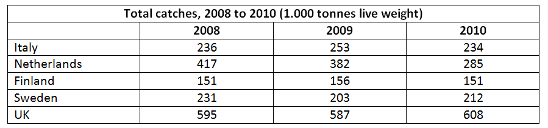

### Opciones disponibles

- **A.** 444.600.000
- **B.** 444.600
- **C.** 253.500
- **D.** 191.100
- **E.** 491.400.000

---

### Respuesta y explicacion

La respuesta correcta es la **A**: 444.600.000

Step 1 – Calculate the number of fish caught in 2009.

156 x 0,65 = 101,4

So the number of crustaceans caught = 156 – 101,4 = 54,6

Step 2 – Calculate the value of fish caught.

101,4 x 2500 x 1.000 = 253.500.000

Step 3 – Calculate the value of crustaceans caught.

54,6 x 3500 x 1.000 = 191.100.000

Step 4 – Work out the total turnover for Finland

253.500.000 + 191.100.000 = 444.600.000

## Pregunta 36

Fuente: https://www.epsoprep.com/practice/attempt/en/UXVlc3Rpb25Qb29sQXR0ZW1wdDo3ZHlWMVA0QlNFTkI4d2plMHIwTnVn/review?q=12

### Enunciado

Compared with 2010, Slovenia recorded the greatest increase in inland freight transport relative to GDP, with its index ¹⁰⁄₉ higher in 2011. In Denmark, the ratio of inland freight transport to GDP fell between 2010 and 2011 by 10%. By what percentage was Slovenia’s index larger than Denmark’s?

### Imagen

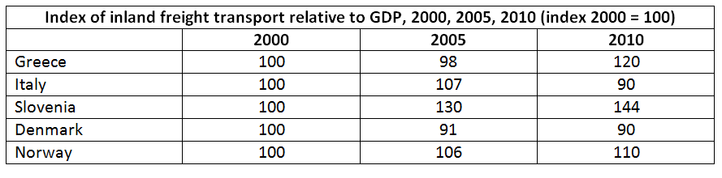

### Opciones disponibles

- **A.** 50,1%
- **B.** 200%
- **C.** 60,7%
- **D.** 97,8%
- **E.** 97,5%

---

### Respuesta y explicacion

La respuesta correcta es la **E**: 97,5%

Step 1 – Calculate the index in Slovenia in 2011

144 x  ¹⁰⁄₉ = 160

Step 2 – Calculate the index in Denmark

90 x 0,9 = 81

Step 3 – Work out the percentage difference

160/81 = 1,975308642

In percent: 1,975308642-1 = 97,5%

## Pregunta 37

Fuente: https://www.epsoprep.com/practice/attempt/en/UXVlc3Rpb25Qb29sQXR0ZW1wdDo3ZHlWMVA0QlNFTkI4d2plMHIwTnVn/review?q=16

### Enunciado

In 2009, how many more births would be required to meet the ideal fertility rate of 2,1 births per woman?

### Imagen

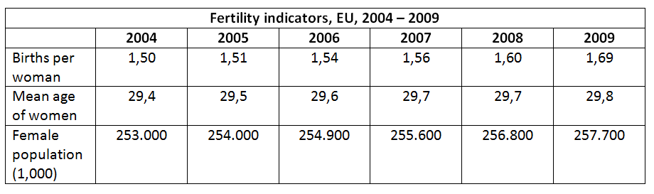

### Opciones disponibles

- **A.** 107.466
- **B.** 107.466.079
- **C.** 105.657
- **D.** 105.657.000
- **E.** 151.800.000

---

### Respuesta y explicacion

La respuesta correcta es la **D**: 105.657.000

Step 1 – Work out the number of births in 2009

1,69 x 257.700 = 435.513 thousand

Step 2 – Work out the ideal number of births in 2009

2,1 x 257.700 = 541.170 thousand

Step 3 – Work out the difference

541.170 – 435.513 = 105.657 thousand

## Pregunta 38

Fuente: https://www.epsoprep.com/practice/attempt/en/UXVlc3Rpb25Qb29sQXR0ZW1wdDo3ZHlWMVA0QlNFTkI4d2plMHIwTnVn/review?q=17

### Enunciado

The forest that Cyprus planted in 2011 has been planted as a square. In 2012, Cyprus decided to increase the sides of this square plantation by 10%. By how much did the area of this forest increase in 2012?

### Imagen

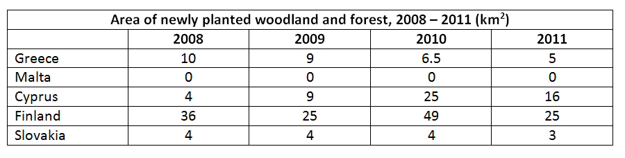

### Opciones disponibles

- **A.** 10%
- **B.** 100%
- **C.** 21%
- **D.** 17%
- **E.** 45%

---

### Respuesta y explicacion

La respuesta correcta es la **C**: 21%

Step 1 – Calculate the size of one side of the square Cyprus forest in 2011.

√16 = 4 km

Step 2 – Calculate how much the side of the forest increased in 2012.

4 x 1,10 = 4,4 km

Step 3 – Calculate the area of the forest in 2012.

4,4 x 4,4 = 19,36 km2

Step 4 – Work out how much the area has increased from 2011 to 2012.

(19,36 – 16)/16 x 100 = 21% or

19,36/16 x 100 = 121% (or 21% increase)

Tip: You could work out the linear scale factor and from this the area scale factor

Ratio of sides of squares: 1,1/1

Ratio of areas = (1,1/1)2 = 1,21/100 or 21% increase

## Pregunta 39

Fuente: https://www.epsoprep.com/practice/attempt/en/UXVlc3Rpb25Qb29sQXR0ZW1wdDo3ZHlWMVA0QlNFTkI4d2plMHIwTnVn/review?q=18

### Enunciado

In 2013 compared to 2012, youth unemployment in the EU decreased by 120.000. How many more young people were unemployed in 2013 compared to 2010?

### Imagen

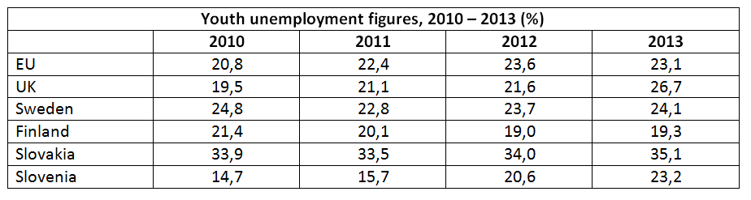

### Opciones disponibles

- **A.** 552.000
- **B.** 240.000
- **C.** 52.174
- **D.** 168.000
- **E.** 672.000

---

### Respuesta y explicacion

La respuesta correcta es la **A**: 552.000

Step 1 – Work out how much 120.000 represents as a percentage

120.000 = 0,5% (23,6 – 23,1 = 0,5%)

So 120.000/0,5 = 1%

Step 2 – Work out the percentage points difference in youth unemployment between 2013 and 2010

23,1 – 20,8 = 2,3%

Step 3 – Work out how many people this represents

120.000/0,5 x 2,3 = 552.000

Note: you can also work this out by finding the total and then working out the percentage unemployed, eg

120.000/0,5 x 100 = 24.000.000 is 100%

24.000.000 x 0,231 = 5.544.000 in 2010

24.000.000 x 0,208 = 4.992.000 in 2013

5.544.000 – 4.992.000 = 552.000

But the approach above is quicker.

## Pregunta 40

Fuente: https://www.epsoprep.com/practice/attempt/en/UXVlc3Rpb25Qb29sQXR0ZW1wdDo3ZHlWMVA0QlNFTkI4d2plMHIwTnVn/review?q=19

### Enunciado

In 2010, UK had ⅕ of the field crops of Spain, twice as many horticulture holdings as Sweden and 25% of permanent crops as Austria. Given UK total holdings were 186.800 in 2010, how much was grazing livestock?

### Imagen

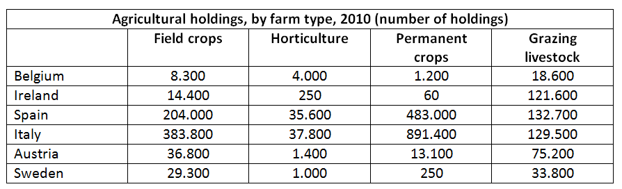

### Opciones disponibles

- **A.** 40.800
- **B.** 46.075
- **C.** 140.725
- **D.** 78.200
- **E.** 146.000

---

### Respuesta y explicacion

La respuesta correcta es la **C**: 140.725

Step 1 – Find the UK field crops.

204.000/5 = 40.800

Step 2 – Calculate the UK horticulture.

1.000 x 2 = 2.000

Step 3 – Calculate the UK permanent crops.

13.100 x 0,25 = 3.275

Step 4 – Work out the UK grazing livestock.

186.800 – (40.800 + 2.000 + 3.275) = 140.725

## Pregunta 41

Fuente: https://www.epsoprep.com/practice/attempt/en/UXVlc3Rpb25Qb29sQXR0ZW1wdDo3ZHlWMVA0QlNFTkI4d2plMHIwTnVn/review?q=20

### Enunciado

In 2012, if a male earns an average of €25 per hour in Slovenia and Spain, how much would a female earn on average for 10 hours of work in each country (20 hours total), based on the gender pay gap? (negative % represents females earning more than males)?

### Imagen

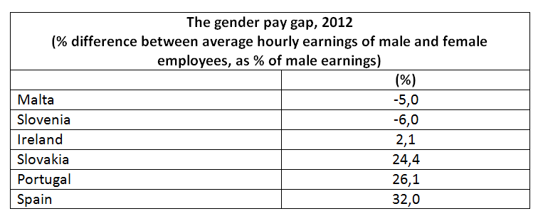

### Opciones disponibles

- **A.** 435 Euros
- **B.** 565 Euros
- **C.** 43,5 Euros
- **D.** 56,5 Euros
- **E.** 510 Euros

---

### Respuesta y explicacion

La respuesta correcta es la **A**: 435 Euros

Step 1 – Work out how much a female would earn in Slovenia for 10 hours work

25 x 1,06 = €26,5 per hour

So 26,5 x 10 = 265 Euros for 10 hours work

Step 2 – Work out how much a female would earn in Spain for 10 hours work

25 x 0,68 = €17 per hour

So 17 x 10 = 170 Euros for 10 hour works

Step 3 – Add the two together

265 + 170 = 435 Euros

## Pregunta 42

Fuente: https://www.epsoprep.com/practice/attempt/en/UXVlc3Rpb25Qb29sQXR0ZW1wdDo3ZHlWMVA0QlNFTkI4d2plMHIwTnVn/review?q=21

### Enunciado

What was the difference in birth rate (number of births per 1.000 inhabitants) between 1960 and 2011 in the EU?

### Imagen

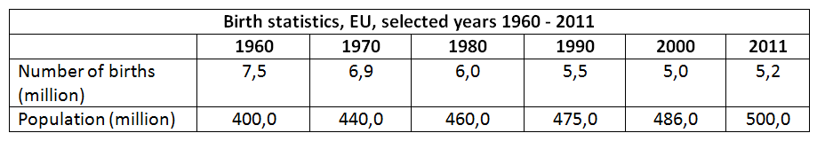

### Opciones disponibles

- **A.** 42,8
- **B.** 0,4
- **C.** 400
- **D.** 0,00835
- **E.** 8,35

---

### Respuesta y explicacion

La respuesta correcta es la **E**: 8,35

Step 1 – Work out the birth rate in 2011

500,00/1.000 = 0,5 as birth rate is per 1.000 inhabitants

5,2/0,5 = 10,4 number of births per 1.000 inhabitants

Step 2 – Work out the birth rate in 1960

400,0/1.000 = 0,4 as birth rate is per 1.000 inhabitants

7,5/0,4 = 18,75 number of births per 1.000 inhabitants

Step 3 – Work out the difference

18,75 – 10,40 = 8,35

## Pregunta 43

Fuente: https://www.epsoprep.com/practice/attempt/en/UXVlc3Rpb25Qb29sQXR0ZW1wdDo3ZHlWMVA0QlNFTkI4d2plMHIwTnVn/review?q=23

### Enunciado

In 2011, fishery production in Norway was 3,6% higher than its level in 2007. In contrast, fishery production in Iceland in 2011 was a fifth below its level of 2007. What was the % increase or decrease in total fishery production in Norway together with Iceland between 2007 and 2011?

### Imagen

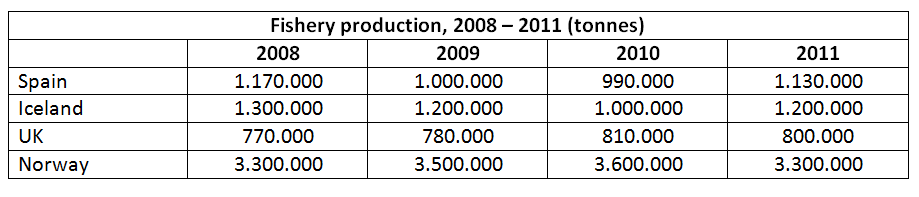

### Opciones disponibles

- **A.** 3,96% increase
- **B.** 51,0% decrease
- **C.** 4,12% decrease
- **D.** 3,96% decrease
- **E.** 51,0% increase

---

### Respuesta y explicacion

La respuesta correcta es la **D**: 3,96% decrease

Step 1 – Work out fishery production in Norway in 2007

3.300.000/1,036 = 3.185.328,185

Step 2 – Work out fishery production in Iceland in 2007

1.200.000/0,8 = 1.500.000 (⅕ = 20% below)

Step 3 – Work out total production in Norway and Iceland in 2007 and 2011

2007: 3.185.328,185 + 1.500.000 = 4.685.328,185

2011: 1.200.000 + 3.300.000 = 4.500.000

Step 4 – Work out % difference between 2011 and 2007

4.500.000/4.685.328,185 x 100= 96,04449939

So 100 – 96,04449939 = 3,95550061% decrease

## Pregunta 44

Fuente: https://www.epsoprep.com/practice/attempt/en/UXVlc3Rpb25Qb29sQXR0ZW1wdDo3ZHlWMVA0QlNFTkI4d2plMHIwTnVn/review?q=24

### Enunciado

In 2011, UK invested in an initiative to help those unemployed, allocating a fixed amount per unemployed person, depending on the age group. The UK decided to continue this investment into 2012 but unemployment in 15 – 24 years is expected to reduce by 500 thousand, unemployment in 25 – 54 years is expected to increase by 300 thousand and the unemployment in 55 – 64 years is expected to increase by 100 thousand. How much did the UK invest across the three age groups in 2012?

### Opciones disponibles

- **A.** €881.000
- **B.** €890.000
- **C.** €874.000
- **D.** €882.000
- **E.** €883.000

---

### Respuesta y explicacion

La respuesta correcta es la **C**: €874.000

Step 1 – Work out how much was invested per age group in 2011.

360.000/4.000 = €90 (15 – 24 years)

520.000/6.500 = €80 (25 – 54 years)

10.000/200 = €50 (55 – 64 years)

Step 2 – Calculate the amount of unemployed in each category in 2012.

4.000 – 500 = 3.500 (15 – 24 years)

6.500 + 300 = 6.800 (25 – 54 years)

200 + 100 = 300 (55 – 64 years)

Step 3 – Calculate the amount invested in 2012.

(3.500 x 90) + (6.800 x 80) + (300 x 50) = 874.000

## Pregunta 45

Fuente: https://www.epsoprep.com/practice/attempt/en/UXVlc3Rpb25Qb29sQXR0ZW1wdDo3ZHlWMVA0QlNFTkI4d2plMHIwTnVn/review?q=25

### Enunciado

During the period, 2002 to 2006, the total number of EU patent applications increased by a constant 2,8% per annum, while during the period 2006 to 2010, the reduction in number of patent applications was a constant 1,3% per annum. How many patent applications were there in 2010?

### Opciones disponibles

- **A.** 60.417
- **B.** 32.998
- **C.** 54.449
- **D.** 30.682
- **E.** 72.896

---

### Respuesta y explicacion

La respuesta correcta es la **C**: 54.449

Step 1 – Calculate the growth in EU patent applications between 2002 and 2006

51.375 x 1,0284 = 57.375,21071

(2,8% x 4 years = 1,0284)

Step 2 – Calculate the reduction in EU applications between 2006 and 2010

57.375,21071 x 0,9874 = 54.449,37564

(reduction of 1,3% for 4 years = (100%-1,3%)4 = 0,9874

Note: The student can calculate each year separately, but the use of compound percentages is far quicker

Also observe that the technology patent applications are only a subgroup of all applications and therefore not relevant to the questions as they are already included among "patent applications"

## Pregunta 46

Fuente: https://www.epsoprep.com/practice/attempt/en/UXVlc3Rpb25Qb29sQXR0ZW1wdDo3ZHlWMVA0QlNFTkI4d2plMHIwTnVn/review?q=26

### Enunciado

In 2006, Spain missed its target recycling rate by 4 percentage points but improved its recycling rate by 15% in 2007. In 2007, the number of end-of-life vehicles in Spain was 90% of the 2006 figure. What was the difference in number of recycled vehicles between 2006 and 2007 in Spain?

### Imagen

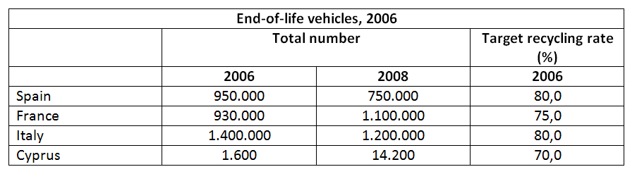

### Opciones disponibles

- **A.** 25.270 decrease
- **B.** 25.536 increase
- **C.** 66.500 decrease
- **D.** 25.536 decrease
- **E.** 25.270 increase

---

### Respuesta y explicacion

La respuesta correcta es la **E**: 25.270 increase

Step 1 – Work out how many end-of-life vehicles were recycled in Spain in 2006

80 – 4 = 76% (missed target by 4 percentage points)

950.000 x 0,76 = 722.000

Step 2 – Work out how many end-of-life vehicles were in Spain in 2007

950.000 x 0,9 = 855.000

Step 3 – Work out recycling rate in Spain and number of end-of-life vehicles recycled in 2007

76 x 1,15 = 87,4

So 855.000 x 0,874 = 747.270

Step 4 – Work out difference in number of end-of-life vehicles recycled between 2006 and 2007

747.270 – 722.000 = 25.270

## Pregunta 47

Fuente: https://www.epsoprep.com/practice/attempt/en/UXVlc3Rpb25Qb29sQXR0ZW1wdDo3ZHlWMVA0QlNFTkI4d2plMHIwTnVn/review?q=27

### Enunciado

In 2007, 730 out of 1.000 people questioned in a survey about obstacles to participation in training cited lack of time or conflict with work schedule, 180 cited expense and remainder cited distance as the main issue. In a 2009 survey, the number who cited expense as the main obstacle had gone up by 84 but expense’s relative percentage share of the total obstacles had gone up by a third. How many people took part in the 2009 survey?

### Imagen

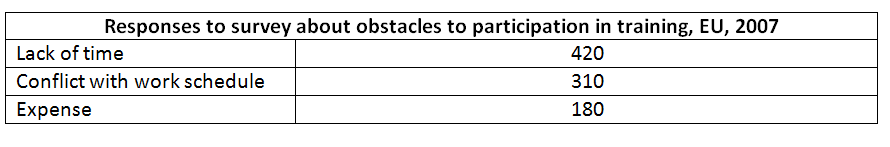

### Opciones disponibles

- **A.** 1.100
- **B.** 1.240
- **C.** 1.250
- **D.** 1.467
- **E.** 792

---

### Respuesta y explicacion

La respuesta correcta es la **A**: 1.100

Step 1 – Work out the share of obstacles as a percentage of the total in 2007.

180/1.000 = 18%

Step 2 – Work out what percentage share expenses were of the total in 2009.

18 + (⅓ x 18) = 24%

Step 3 – Work out how many people cited expense as the main obstacle in 2009.

180 + 84 = 264

Step 4 – Calculate how many people were in the 2009 survey.

264/0,24 = 1.100

## Pregunta 48

Fuente: https://www.epsoprep.com/practice/attempt/en/UXVlc3Rpb25Qb29sQXR0ZW1wdDo3ZHlWMVA0QlNFTkI4d2plMHIwTnVn/review?q=28

### Enunciado

In 2010, one in every 12 holdings in the EU maintained hedges. What percentage of total EU holdings maintained their stone walls in 2010?

### Imagen

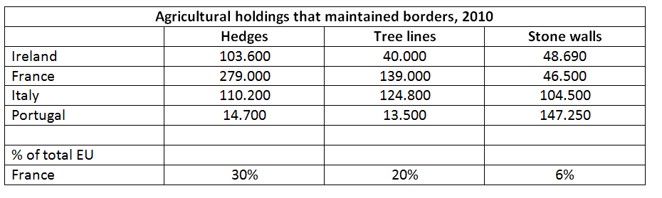

### Opciones disponibles

- **A.** 8,3%
- **B.** 9,3%
- **C.** 6,9%
- **D.** 12,2%
- **E.** 11,8%

---

### Respuesta y explicacion

La respuesta correcta es la **C**: 6,9%

Step 1 – Work out the total number of hedges maintained in the EU in 2010

279.000/0,30 = 930.000 (using the % of total EU for France)

Step 2 – Work out the total number of holdings in the EU in 2010

930.000 x 12 = 11.160.000

Step 3 – Work out the total number of stone walls maintained in the EU in 2010

46.500/0,06 = 775.000 (using the % of total EU for France)

Step 4 – Calculate the % of stone walls maintained in the EU as a share of the total holdings

775.000/11.160.000 x 100 = 6,9444444

## Pregunta 49

Fuente: https://www.epsoprep.com/practice/attempt/en/UXVlc3Rpb25Qb29sQXR0ZW1wdDo3ZHlWMVA0QlNFTkI4d2plMHIwTnVn/review?q=29

### Enunciado

What has been the overall percentage decline in the absolute number of marriages in the EU between 1970 and 2010?

### Imagen

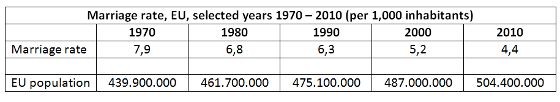

### Opciones disponibles

- **A.** 63,9%
- **B.** 17,8%
- **C.** 36,1%
- **D.** 105,9%
- **E.** 41,3%

---

### Respuesta y explicacion

La respuesta correcta es la **C**: 36,1%

Step 1 – Work out the number of marriages in the EU in 2010

504.400.000 x 4,4/1.000 = 2.219.360 (marriage rate is per 1.000 inhabitants)

Step 2 – Work out the number of marriages in the EU in 1970

439.900.000 x 7,9/1.000 = 3.475.210

Step 3 – Work out the percentage decline in marriages

2.219.360/3.475.210 x 100 = 63,8626155%

So 100 – 63,8626155 = 36,1373845% decrease in marriages

## Pregunta 50

Fuente: https://www.epsoprep.com/practice/attempt/en/UXVlc3Rpb25Qb29sQXR0ZW1wdDo3ZHlWMVA0QlNFTkI4d2plMHIwTnVn/review?q=30

### Enunciado

How much bigger was Germany’s population than Sweden’s in 2010?

### Imagen

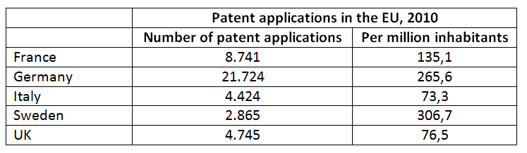

### Opciones disponibles

- **A.** 49,5 million
- **B.** 81,7 million
- **C.** 56,8 million
- **D.** 72,5 million
- **E.** 62,9 million

---

### Respuesta y explicacion

La respuesta correcta es la **D**: 72,5 million

Step 1 – Calculate Germany’s population in 2010

Number of patents/population (in millions) = patents per million inhabitants

So Number of patents/patents per million inhabitants = population in millions

21.724/265,6 = 81,79216867 million

Step 2 – Calculate Sweden’s population in 2010

2.865/306,7 = 9,341375937 million

Step 3 – Calculate the difference in populations

81,79216867 - 9,341375937 = 72,45079273 million

## Pregunta 51

Fuente: https://www.epsoprep.com/practice/attempt/en/UXVlc3Rpb25Qb29sQXR0ZW1wdDo3ZHlWMVA0QlNFTkI4d2plMHIwTnVn/review?q=32

### Enunciado

There was a 50% increase in organic farming in the EU between 2005 and 2009 and organic farming grew by a further 1,9 percentage points between 2009 and 2011. In 2011, the percentage of organic farming in the EU was 500% greater than that of Canada. What percentage of organic farming did Canada have in 2011?

### Imagen

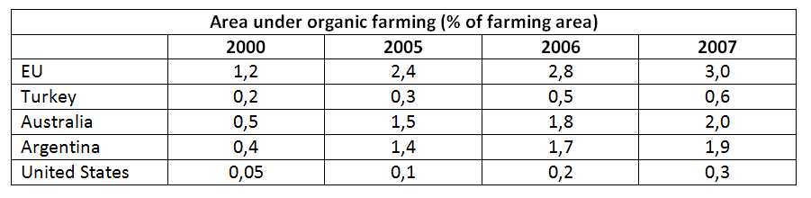

### Opciones disponibles

- **A.** 0,86%
- **B.** 27,5%
- **C.** 0,62%
- **D.** 0,92 %
- **E.** 1,86%

---

### Respuesta y explicacion

La respuesta correcta es la **D**: 0,92 %

Step 1 – Work out the percentage increase for the EU between 2005 and 2009

2,4 x 1,5 = 3,6%

Step 2 – Work out the percentage increase for EU between 2009 and 2011

3,6 + 1,9 = 5,5%

Step 3 – Work out the percentage of organic farming in Canada in 2011

5,5 ÷ 6 = 0,9167 %

Note: We are told that in 2011, the percentage of organic farming in the EU was 500% greater than in Canada. This does not mean that the EU was simply 5 times greater — but 500% greater, which means 6 times as much. This is why we need to divide 5,5 with 6.

## Pregunta 52

Fuente: https://www.epsoprep.com/practice/attempt/en/UXVlc3Rpb25Qb29sQXR0ZW1wdDo3ZHlWMVA0QlNFTkI4d2plMHIwTnVn/review?q=34

### Enunciado

With 360.000 permits, Italy issued 45% of the permits issued for employment reasons in 2010. Total residence permits issued in 2010 was 12% less then it was 2008. How many residence permits were issued for family reasons in 2008?

### Imagen

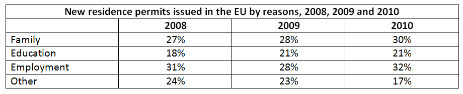

### Opciones disponibles

- **A.** 880.682
- **B.** 767.045
- **C.** 511.364
- **D.** 681.818
- **E.** 859.091

---

### Respuesta y explicacion

La respuesta correcta es la **B**: 767.045

Step 1 – Work out the total permits issued for employment reasons in 2010

360.000/0,45 = 800.000 permits for employment reasons (as Italy issued 45% in 2010)

Step 2 – Work out the total number of permits issued in 2010

800.000/0,32 = 2.500.000 (as employment was 32% of total in 2010)

Step 3 – Calculate the total number of permits in 2008

2.500.000/0,88 = 2.840.909,091

Step 4 – Calculate the number of permits issued for family reasons in 2008

2.840.909,091 x 0,27 = 767.045,4545

## Pregunta 53

Fuente: https://www.epsoprep.com/practice/attempt/en/UXVlc3Rpb25Qb29sQXR0ZW1wdDo3ZHlWMVA0QlNFTkI4d2plMHIwTnVn/review?q=35

### Enunciado

In 1980, the EU measured the gap between the highest rate of live births and the lowest rate of live births. In 1990, this difference had decreased to 65% and by 2011 it had narrowed by a further ⅕. What was the difference between the highest and lowest rate of live births in 2011?

### Imagen

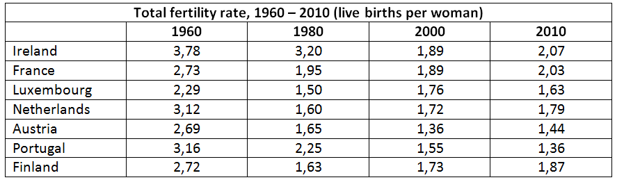

### Opciones disponibles

- **A.** 1,70
- **B.** 1,105
- **C.** 0,884
- **D.** 0,221
- **E.** 0,7748

---

### Respuesta y explicacion

La respuesta correcta es la **C**: 0,884

Step 1 – Identify the highest and lowest rates for 1980 and calculate the difference.

3,20 (Ireland) – 1,50 (Luxembourg) = 1,70

Step 2 – Calculate the difference in live birth rates in 1990.

1,70 x 0,65 = 1,105 (65% of 1,70)

Step 3 – Calculate the difference in live birth rates in 2011.

⅘ x 1,105 = 0,884

## Pregunta 54

Fuente: https://www.epsoprep.com/practice/attempt/en/UXVlc3Rpb25Qb29sQXR0ZW1wdDo3ZHlWMVA0QlNFTkI4d2plMHIwTnVn/review?q=36

### Enunciado

In 2011, social protection expenditure per capita in Portugal was a third of that spent in the Netherlands and the Netherlands’ expenditure per capita was nine times higher than Bulgaria’s. What was the ratio of social expenditure per capita between Bulgaria and Romania?

### Imagen

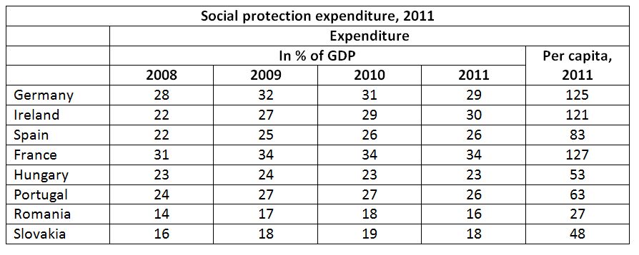

### Opciones disponibles

- **A.** 1 : 63
- **B.** 7 : 9
- **C.** 3 : 7
- **D.** 1 : 7
- **E.** 1 : 3

---

### Respuesta y explicacion

La respuesta correcta es la **B**: 7 : 9

Step 1 – Calculate the spending per capita in the Netherlands.

63 x 3 = 189

Step 2 – Work out the spending per capita in Bulgaria.

189/9 = 21

Step 3 – Work out the ratio of per capita spending between Bulgaria and Romania. We have already in Step 2 calculated tha the ratio per capita spending for Bulgaria was 21.

We can also in the table see that the per capita spending for Romania is 27 thus the ratio is 21 : 27.

To simplify this ratio, divide both by 3:

21 ÷ 3 = 7

27 ÷ 3 = 9

So the simplified ratio is:

7 : 9

## Pregunta 55

Fuente: https://www.epsoprep.com/practice/attempt/en/UXVlc3Rpb25Qb29sQXR0ZW1wdDo3ZHlWMVA0QlNFTkI4d2plMHIwTnVn/review?q=37

### Enunciado

The young age dependency ratio is calculated by dividing the percentage of young people (0 to 14 years old) by the percentage of people of working age (15 to 64 years old), and the old age dependency ratio is calculated by dividing the percentage of older people (65 or more years old) by the percentage of people of working age (15 to 64 years old). In 2011, young people made up 15,6% of the EU total population. What percentage share did older people account for of the EU total population in 2011?

### Imagen

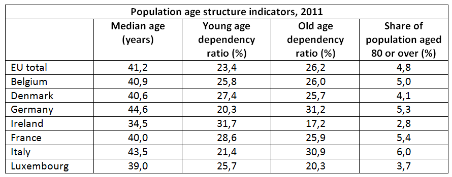

### Opciones disponibles

- **A.** 1,5%
- **B.** 39,3%
- **C.** 26,2%
- **D.** 17,5%
- **E.** 2,5%

---

### Respuesta y explicacion

La respuesta correcta es la **D**: 17,5%

Step 1 – Identify the percentage share of the working-age population. We know that

15,6/(% working-age population) = 23,4

Step 2 – So rearranging the equation to find the percentage of the working-age population.

15,6/23,4 = 0,6666667 (66,7%)

Step 3 – Using the percentage of the working population, find the percentage of older people.

(% older people)/0,6666667 = 26,2

Step 4 - So rearranging the equation to find the percentage of older people

% older people = 26,2 x 0,6666667 = 17,466%

## Pregunta 56

Fuente: https://www.epsoprep.com/practice/attempt/en/UXVlc3Rpb25Qb29sQXR0ZW1wdDo3ZHlWMVA0QlNFTkI4d2plMHIwTnVn/review?q=38

### Enunciado

In 2011, the UK recorded a net surplus in service transactions which represented 70% of the total net surplus registered by the EU as a whole. Germany recorded debits which were 45% of the total debits for the EU. How much did the EU record as total credits in 2011?

### Imagen

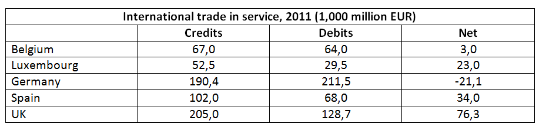

### Opciones disponibles

- **A.** 579 thousand million
- **B.** 523 thousand million
- **C.** 361 thousand million
- **D.** 204 thousand million
- **E.** 149 thousand million

---

### Respuesta y explicacion

La respuesta correcta es la **A**: 579 thousand million

Step 1 – Work out the total net surplus for the EU

76,3/0,7 = 109 thousand million

Step 2 – Work out the total debits for the EU

211,5/0,45 = 470 thousand million

Step 3 – Calculate the total credits for the EU

470 + 109 = 579 thousand million

## Pregunta 57

Fuente: https://www.epsoprep.com/practice/attempt/en/UXVlc3Rpb25Qb29sQXR0ZW1wdDo3ZHlWMVA0QlNFTkI4d2plMHIwTnVn/review?q=39

### Enunciado

In 2008, food and beverages manufacturing contributed 26,0% of profit in the EU. What was the average profit per food and beverages manufacturing enterprise in the EU in 2008?

### Imagen

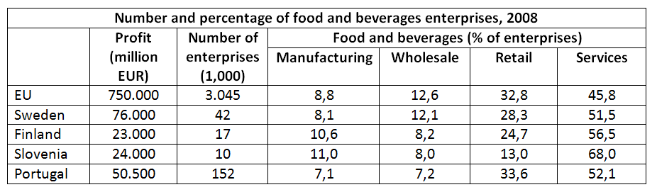

### Opciones disponibles

- **A.** 7.277.205
- **B.** 7.277
- **C.** 72,77
- **D.** 727,72
- **E.** 727.721

---

### Respuesta y explicacion

La respuesta correcta es la **E**: 727.721

Step 1 – Work out % profit for food and beverages manufacturing in 2008

750.000 x 0,26 = 195.000 million

Step 2 – Work out the number of enterprises in food and beverages manufacturing 2008

3.045 x 0,088 = 267,96 thousand

Step 3 – Calculate the average profit per enterprise

195.000.000.000/267.960 = 727.720,553

## Pregunta 58

Fuente: https://www.epsoprep.com/practice/attempt/en/UXVlc3Rpb25Qb29sQXR0ZW1wdDo3ZHlWMVA0QlNFTkI4d2plMHIwTnVn/review?q=40

### Enunciado

In 2010, France and Germany together accounted for ⅖ of the EU’s passenger rail travel. The number of passenger-kilometers travelled by France rail passengers was twice the level for Germany which in turn recorded a figure that was 2,5 times as high as that for the UK? How many passenger-kilometres were travelled by UK rail passengers in 2010?

### Imagen

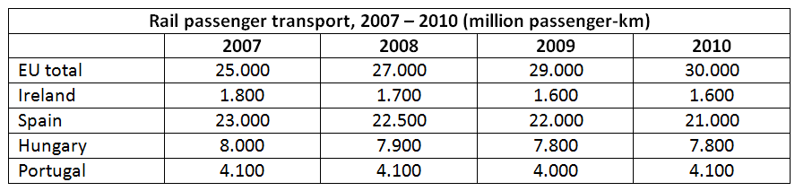

### Opciones disponibles

- **A.** 1.600
- **B.** 10.000
- **C.** 2.400
- **D.** 3.200
- **E.** 4.000

---

### Respuesta y explicacion

La respuesta correcta es la **A**: 1.600

Step 1 – Calculate France and Germany’s share of EU passenger rail travel

⅖ x 30.000 = 12.000

Step 2 – Calculate Germany’s share of 12.000

12.000 x ⅓ = 4.000

Step 3 – Calculate UK’s passenger-kilometres

4.000/2,5 = 1.600

Note: there is no need for a calculator.

## Pregunta 59

Fuente: https://www.epsoprep.com/practice/attempt/en/UXVlc3Rpb25Qb29sQXR0ZW1wdDpBc3lDNmdMSGRVTXdfZ2plMHIwTnVn/review?q=1

### Enunciado

In 2011, total EU foreign direct investment (FDI) flows showed signs of recovery. Outward flows of FDI increased for the first time in four years, rising by 154% when compared with 2010. At the same time, inward flows of FDI more than doubled compared with the previous year – up 117%. What was the net difference between outward and inward FDI in 2011?

### Opciones disponibles

- **A.** 3.008 thousand million
- **B.** 2.188 thousand million
- **C.** 5.508 thousand million
- **D.** 2.188 million
- **E.** 3.008 million

---

### Respuesta y explicacion

La respuesta correcta es la **A**: 3.008 thousand million

Step 1 – Calculate outward FDI for 2011

3.320 x 1,54 = 5.112,80 (54% increase)

3.320 + 5.112,80 = 8.432,80 (154% increase)

Or simply 3.320 x 2,54 (154% increase) = 8.432,80

Step 2 – Calculate inward FDI for 2011

2.500 x 1,17 = 2.925 (17% increase)

2.500 + 2.925 = 5.425 (117% increase)

Step 3 – Calculate difference

8.432,80 – 5.425 = 3.007,80 thousand million

Tip: You can complete steps 1 and 2 in one stage by using a multiplier:

For example: 3.320 x 2,54 = 8.432,80

## Pregunta 60

Fuente: https://www.epsoprep.com/practice/attempt/en/UXVlc3Rpb25Qb29sQXR0ZW1wdDpBc3lDNmdMSGRVTXdfZ2plMHIwTnVn/review?q=2

### Enunciado

Among partner countries and regions in 2011, the EU’s current account deficit was largest with China, which was twice as large as the deficit with Russia and five times the deficit with Japan What percentage of the total EU current account deficit of 242.800 million did these three countries represent?

### Opciones disponibles

- **A.** 50%
- **B.** 4%
- **C.** 400%
- **D.** 75%
- **E.** 85%

---

### Respuesta y explicacion

La respuesta correcta es la **E**: 85%

Step 1 – Find the deficit with Russia.

121.400/2 = 60.700

Step 2 – Find the deficit with Japan.

121.400/5 = 24.280

Step 3 – Find the total deficit across the three countries.

121.400 + 60.700 + 24.280 = 206.380

Step 4 – Find the percentage of the total deficit this represents

206.380/242.800 x 100 = 85%

## Pregunta 61

Fuente: https://www.epsoprep.com/practice/attempt/en/UXVlc3Rpb25Qb29sQXR0ZW1wdDpBc3lDNmdMSGRVTXdfZ2plMHIwTnVn/review?q=4

### Enunciado

In 2012, the majority of EU countries recorded a higher gender pay gap in the private sector than in the public sector, apart from four countries as seen in the table below. For these four countries, what was the difference between the average public gender pay gap and the average private gender pay gap?

### Imagen

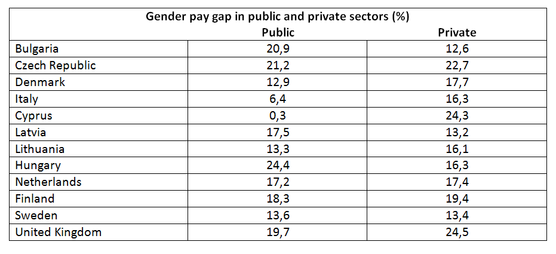

### Opciones disponibles

- **A.** 1,975%
- **B.** 20,9%
- **C.** 5,225%
- **D.** 7,85%
- **E.** 15,4%

---

### Respuesta y explicacion

La respuesta correcta es la **C**: 5,225%

Step 1 – Identify the four countries with a higher gender gap in the public sector than the private sector

Bulgaria, Latvia, Hungary and Sweden

Step 2 – For these four countries, calculate the average gender pay gap in the public sector

(20,9 + 17,5 + 24,4 + 13,6)/4 = 19,1 %

Step 3 – For these four countries, calculate the average gender pay gap in the private sector

(12,6 + 13,2 + 16,3 + 13,4)/4 = 13,875 %

Step 4 – Calculate the difference between the averages

19,1 – 13,875 = 5,225 %

## Pregunta 62

Fuente: https://www.epsoprep.com/practice/attempt/en/UXVlc3Rpb25Qb29sQXR0ZW1wdDpBc3lDNmdMSGRVTXdfZ2plMHIwTnVn/review?q=6

### Enunciado

In 2009, ⅓ of all maths, science & technology (MST) graduates were female and MST graduates made up 10% of all graduates. How many graduates did not study MST in 2009?

### Imagen

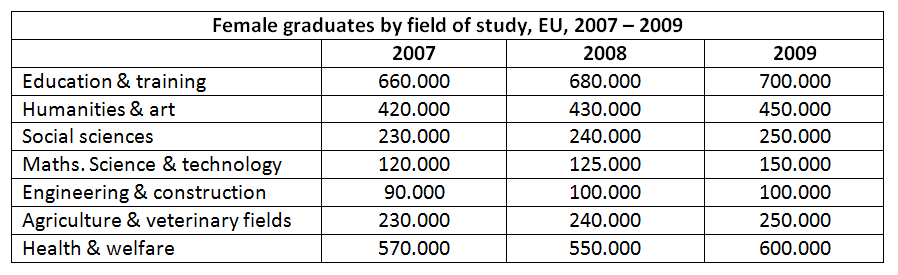

### Opciones disponibles

- **A.** 4.050.000
- **B.** 1.350.000
- **C.** 450.000
- **D.** 4.500.000
- **E.** 135.000

---

### Respuesta y explicacion

La respuesta correcta es la **A**: 4.050.000

Step 1 – Work out the total number of MST graduates in 2009.

150.000 x 3 = 450.000

Step 2 – Work out the total number of graduates in 2009.

450.000/10 x 100 = 4.500.000

Step 3 – Work out the number of graduates who did not study MST.

4.500.000 x 0,9 = 4.050.000

Tip: Students who have good mental arithmetic may be able to get to step 3 quicker by recognising that the total number of graduates is 10 x 450.000

## Pregunta 63

Fuente: https://www.epsoprep.com/practice/attempt/en/UXVlc3Rpb25Qb29sQXR0ZW1wdDpBc3lDNmdMSGRVTXdfZ2plMHIwTnVn/review?q=7

### Enunciado

Government spending on health in 2010 across Denmark, France, Netherlands and Norway had fallen by 25% compared with 2005. France spent 224.000 million in 2005. What percentage of the four countries' health spending did France account for in 2005?

### Imagen

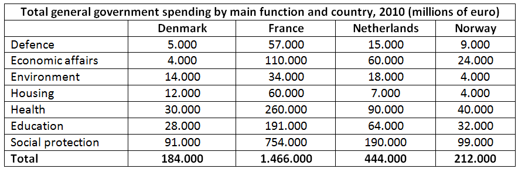

### Opciones disponibles

- **A.** 10%
- **B.** 15%
- **C.** 20%
- **D.** 40%
- **E.** 50%

---

### Respuesta y explicacion

La respuesta correcta es la **D**: 40%

Step 1 – Calculate the total spending on health across the four countries

30.000 + 260.000 + 90.000 + 40.000 = 420.000 million

Step 2 – Work out the total spending on health in 2005.

420.000/75 x 100 = 560.000 million

Step 3 – Work out the percentage share of health spending by France in 2005.

224.000/560.000 = 40%

## Pregunta 64

Fuente: https://www.epsoprep.com/practice/attempt/en/UXVlc3Rpb25Qb29sQXR0ZW1wdDpBc3lDNmdMSGRVTXdfZ2plMHIwTnVn/review?q=8

### Enunciado

In 2012, Netherland’s loaded container transport grew by 12% from 2011 and represented 50% of total EU loaded transport. In 2012, loaded container movements were 2.5 times the number of empty container movements. How much empty container transport was there in the EU in 2012?

### Imagen

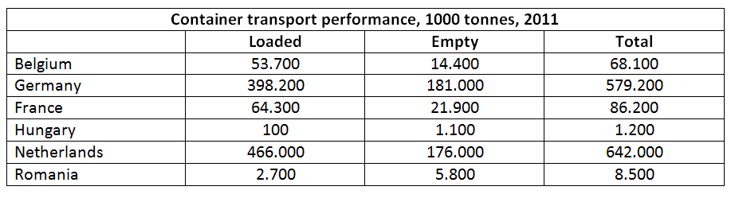

### Opciones disponibles

- **A.** 157.696 thousand tonnes
- **B.** 298.240 thousand tonnes
- **C.** 575.232 thousand tonnes
- **D.** 372.800 thousand tonnes
- **E.** 2.609.600 thousand tonnes

---

### Respuesta y explicacion

La respuesta correcta es la **B**: 298.240 thousand tonnes

Step 1 - Work out the loaded container volume in Netherlands in 2012

466.000 x 1,12 = 521.920 (thousand tonnes)

Step 2 – Work out total EU loaded container volumes in 2012

521.920 x 2 = 1.043.840 (thousand tonnes)

Step 3 – Calculate the total EU empty container volumes in 2012

1.043.840/3,5 = 298.240 (thousand tonnes)

-----

It’s important to note that we need to divide by 3,5, not 2,5.

This is because the number of loaded container movements was 2.5 times greater than the number of empty container movements.

Therefore, the total number of container movements (loaded + empty) is equal to:

1 empty movement + 2.5 loaded movements = 3.5 total movements per unit:

298.240 +(298.240*2,5)= 1.043.840 thousand tonnes

## Pregunta 65

Fuente: https://www.epsoprep.com/practice/attempt/en/UXVlc3Rpb25Qb29sQXR0ZW1wdDpBc3lDNmdMSGRVTXdfZ2plMHIwTnVn/review?q=10

### Enunciado

The ratio between the highest and lowest selling prices for chickens in 2012 is the same as the ratio between the selling prices of eggs in two other countries.  For these two countries, what is the ratio between the higher and lower selling prices for cows?

### Opciones disponibles

- **A.** 6:1
- **B.** 3:1
- **C.** 4:1
- **D.** 8:1
- **E.** 7:1

---

### Respuesta y explicacion

La respuesta correcta es la **B**: 3:1

Step 1

Calculate the ratio between the highest and lowest selling prices for chickens.

Ratio is 375,00 : 62.50 (Luxembourg : Portugal) = 6 : 1

Step2

Find which pair of countries has the same 6:1 ratio.

To quickly find the values, multiply the lower values by 6 to find the pair of countries.

We can see that the only two countries that have the ratio 6:1 are UK and Greece as 21,00 : 3.50 = 6 : 1

Step 3

Identify the values for the higher and lower selling prices for Greece and UK and calculate the ratio

150 : 50 = 3:1 (Greece: UK)

## Pregunta 66

Fuente: https://www.epsoprep.com/practice/attempt/en/UXVlc3Rpb25Qb29sQXR0ZW1wdDpBc3lDNmdMSGRVTXdfZ2plMHIwTnVn/review?q=11

### Enunciado

In 2010, France, Spain, UK, and Germany represented one half of all land used in agriculture across the EU. What percentage was used for agricultural use in Poland, Romania and Italy?

### Opciones disponibles

- **A.** 55%
- **B.** 48%
- **C.** 6%
- **D.** 12%
- **E.** 24%

---

### Respuesta y explicacion

La respuesta correcta es la **E**: 24%

Step 1 – Find the total utilised agricultural area across France, Spain, UK and Germany.

28.000 + 23.700 + 16.900 + 16.700 = 85.300

Step 2 – Calculate the total agricultural land in the EU.

85.300 x 2 = 170.600

Step 3 – Find the total utilised agricultural area across Poland, Romania and Italy.

14.500 + 13.300 + 12.800 = 40.600

Step 4 – Find the agricultural land in Poland, Romania and Italy as a percentage of the total EU agricultural land.

40.600/170.600 x 100 = 23,8%

## Pregunta 67

Fuente: https://www.epsoprep.com/practice/attempt/en/UXVlc3Rpb25Qb29sQXR0ZW1wdDpBc3lDNmdMSGRVTXdfZ2plMHIwTnVn/review?q=12

### Enunciado

The world population doubled between 1960 and 2000 and increased by a further 20% from 2000 to 2012. The world population is projected to grow by 35% by 2060 from 2012 figures. What is the predicted growth in world population between 1960 and 2060?

### Imagen

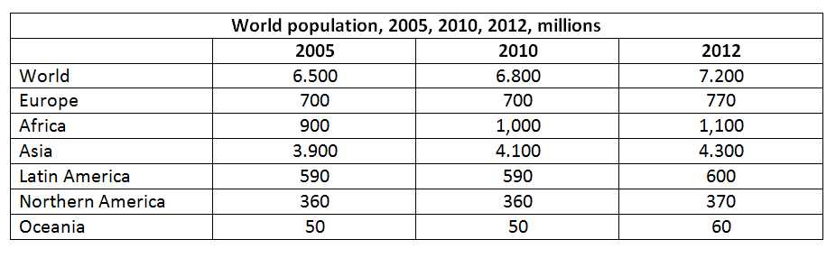

### Opciones disponibles

- **A.** 2.333 million
- **B.** 5.400 million
- **C.** 3.720 million
- **D.** 6.720 million
- **E.** 9.830 million

---

### Respuesta y explicacion

La respuesta correcta es la **D**: 6.720 million

Step 1 – Work out the world population in 1960 from 2012 figures

7.200/1,20 = 6.000 million in 2000

So 6.000/2 = 3.000 million in 1960

Step 2 – Calculate the predicted world population in 2060 from 2012 figures

7.200 x 1,35 = 9.720 million in 2060

Step 3 – Work out growth between 1960 and 2060

9.720 – 3.000 = 6.720 million

## Pregunta 68

Fuente: https://www.epsoprep.com/practice/attempt/en/UXVlc3Rpb25Qb29sQXR0ZW1wdDpBc3lDNmdMSGRVTXdfZ2plMHIwTnVn/review?q=13

### Enunciado

The table shows energy savings in the EU from 2010 to 2012, along with the target for 2020. What would be the difference in energy consumed between 2012 and 2020 if the energy savings were not achieved in either year?

### Imagen

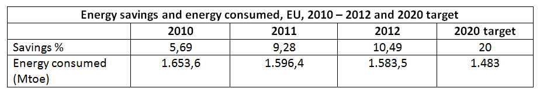

### Opciones disponibles

- **A.** 94,0
- **B.** 9,3
- **C.** 100,4
- **D.** 15,7
- **E.** 84,7

---

### Respuesta y explicacion

La respuesta correcta es la **E**: 84,7

Step 1 - Work out energy consumed in 2012 if savings not achieved

100 – 10,49 = 89,51%

1.583,5/0,8951 = 1.769,076081

Step 2 – Work out the energy consumed in 2020 if savings not achieved

100 – 20 = 80%

1.483/0,8 = 1.853,75

Step 3 – Calculate the difference between the two

1.853,75 – 1769,076081 = 84,673919

## Pregunta 69

Fuente: https://www.epsoprep.com/practice/attempt/en/UXVlc3Rpb25Qb29sQXR0ZW1wdDpBc3lDNmdMSGRVTXdfZ2plMHIwTnVn/review?q=14

### Enunciado

In 2000, on average one (per 100.000) Italian physician was able to handle 28 hospital discharges. In 1990 there 20% fewer physicians but ⅛ more discharges in Italy. How many discharges would one physician (per 100.000) be able to handle on average in Italy in 1990?

### Imagen

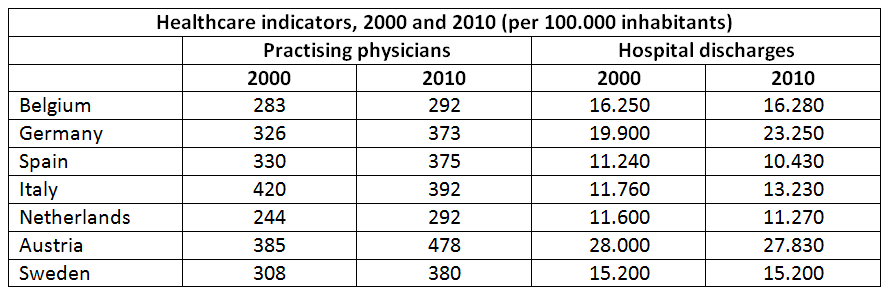

### Opciones disponibles

- **A.** 26
- **B.** 31
- **C.** 20
- **D.** 39
- **E.** 28

---

### Respuesta y explicacion

La respuesta correcta es la **D**: 39

Step 1 – Calculate the number of physicians in 1990.

420 x 0,80 = 336

Step 2 – Calculate the number of hospital discharges in 1990

11.760 + (⅛ x 11.760) = 13.230

Step 3 – Calculate how many discharges on average one physician would handle in

13.230/336 = 39,375

## Pregunta 70

Fuente: https://www.epsoprep.com/practice/attempt/en/UXVlc3Rpb25Qb29sQXR0ZW1wdDpBc3lDNmdMSGRVTXdfZ2plMHIwTnVn/review?q=15

### Enunciado

The total bovine population has grown by 10% between 2004 and 2011. In the same period, female cattle aged 2 years and over have grown by 7,5%. What percentage of the total bovine population was female aged over 2 years in 2004?

### Imagen

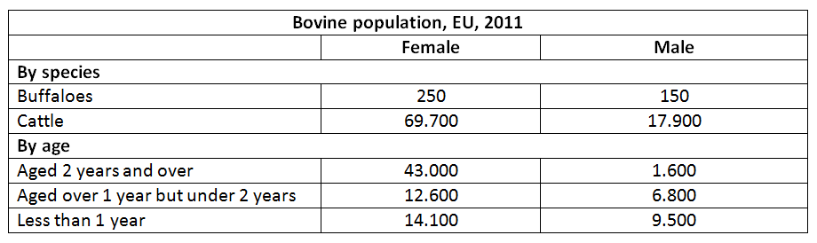

### Opciones disponibles

- **A.** 49%
- **B.** 63%
- **C.** 54%
- **D.** 45%
- **E.** 50%

---

### Respuesta y explicacion

La respuesta correcta es la **E**: 50%

Step 1 - Work out the bovine population in 2004

(250 + 150 + 69.700 +17.900) = 88.000

88.000/1,1 = 80.000

Step 2 – Work out the female population aged 2 years and over in 2004

43.000/1,075 = 40.000

Step 3 – Calculate the share of females aged over 2 years as a percentage of the total bovine population

40.000/80.000 x 100 = 50%

## Pregunta 71

Fuente: https://www.epsoprep.com/practice/attempt/en/UXVlc3Rpb25Qb29sQXR0ZW1wdDpBc3lDNmdMSGRVTXdfZ2plMHIwTnVn/review?q=17

### Enunciado

In 2010, the number of healthy life years for men and women in the EU as a whole represented 80% and 75% of total life expectancy for men and women respectively. What is the difference between the total life expectancy between men and women?

### Imagen

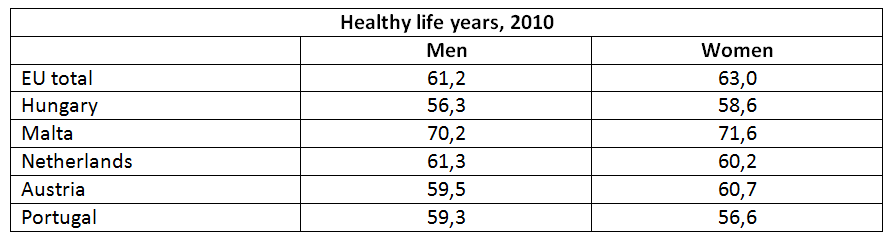

### Opciones disponibles

- **A.** 7,5 years
- **B.** 1,8 years
- **C.** 1,71 years
- **D.** 2,85 years
- **E.** 4,65 years

---

### Respuesta y explicacion

La respuesta correcta es la **A**: 7,5 years

Step 1 – Work out what life expectancy for men

61,2/0,8 = 76,5 (80% of 76,5 = 61,2)

Step 2 – Work out the life expectancy for women.

63/0,75 = 84 (75% of 84 = 63)

Step 3 – Calculate the difference between women’s and men’s life expectancy.

84 – 76,5 = 7,5

## Pregunta 72

Fuente: https://www.epsoprep.com/practice/attempt/en/UXVlc3Rpb25Qb29sQXR0ZW1wdDpBc3lDNmdMSGRVTXdfZ2plMHIwTnVn/review?q=18

### Enunciado

The combined average length of education across France and Sweden was 18 years in 2005. In 2005, France had a population 6,5 times larger than Sweden’s population of 10 million. What was the average length of education in Sweden in 2005?

### Opciones disponibles

- **A.** 20,5 years
- **B.** 24,5 years
- **C.** 22,5 years
- **D.** 23 years
- **E.** 21 years

---

### Respuesta y explicacion

La respuesta correcta es la **B**: 24,5 years

Step 1 – Work out France’s population

10 x 6,5 = 65 million

Step 2 – Work out the total number of education years across Sweden and France.

The total population in France and Sweden: 65 +10 = 75 million, so total education years is

(75 x 18) = 1.350 million

Step 3 – Calculate the total number of education years in France.

(65 x 17) = 1.105 million

So the total number of education years in Sweden is:

1.350 – 1.105 = 245 million

Step 4 – Work out the average number of years of education in Sweden.

245/10 = 24,5 years

## Pregunta 73

Fuente: https://www.epsoprep.com/practice/attempt/en/UXVlc3Rpb25Qb29sQXR0ZW1wdDpBc3lDNmdMSGRVTXdfZ2plMHIwTnVn/review?q=19

### Enunciado

Euro member states pledge to keep government debt below 60% of GDP. However, in 2011 many member states exceeded this threshold. Greece’s GDP in 2011 was €215.000 million. By how much did Greece need to reduce government debt (as an amount) to meet its target?

### Opciones disponibles

- **A.** €237.790.000
- **B.** €129.000.000
- **C.** €366.790.000.000
- **D.** €237.790
- **E.** €237.790.000.000

---

### Respuesta y explicacion

La respuesta correcta es la **E**: €237.790.000.000

Step 1 – Calculate Greece’s government debt in 2011.

1,706 x 215.000 = 366.790 million

Step 2 – Calculate 60% of GDP (government debt threshold).

215.000 x 0,6 = 129.000 million

Step 3 – Calculate by how much Greece needed to reduce government debt to meet its threshold.

366.790 – 129.000 = 237.790 million

## Pregunta 74

Fuente: https://www.epsoprep.com/practice/attempt/en/UXVlc3Rpb25Qb29sQXR0ZW1wdDpBc3lDNmdMSGRVTXdfZ2plMHIwTnVn/review?q=20

### Enunciado

In 2012, Belgium represented 2,5% of the total EU output value of the agricultural industry. In 2013, the total EU output value is expected to grow by 15%. Given France is expected to increase its total share by 5 percentage points, what is France’s expected output value in 2013?

### Opciones disponibles

- **A.** 102.000
- **B.** 97.750
- **C.** 117.300
- **D.** 391.000
- **E.** 102

---

### Respuesta y explicacion

La respuesta correcta es la **C**: 117.300

Step 1 – Find the total EU output value for 2012. If 8.500 is 2,5%, then the total EU output value is 340.000 (8.500/2,5 x 100 = 340.000).

Step 2 – Calculate what percentage of the EU total France represents. 85.000/340.000 x 100 = 25%

Step 3 – Calculate the expected increase in total EU output value in 2013: 340.000 x 1,15 = 391.000

Remember, 1,15 represents the 15% expected growth.

Step 4 – Calculate France’s expected share of the EU total: 25% + 5% = 30%

30% of 391.000 = 117.300

Tip: You can calculate France’s percentage share (in step 2) directly as it is ten times bigger than Belgium's (85.000/8.500 )

## Pregunta 75

Fuente: https://www.epsoprep.com/practice/attempt/en/UXVlc3Rpb25Qb29sQXR0ZW1wdDpBc3lDNmdMSGRVTXdfZ2plMHIwTnVn/review?q=21

### Enunciado

How much bigger is the area of China than the area of the EU?

### Opciones disponibles

- **A.** 132.081 km²
- **B.** 5.350.000 km²
- **C.** 5,35 km²
- **D.** 132.081.000.000 km²
- **E.** 132.081.000 km²

---

### Respuesta y explicacion

La respuesta correcta es la **B**: 5.350.000 km²

Step 1 – Calculate the area of China

Population/area = population density

So Population/population density = area

1.353,6/141,0 = 9,6

9,6 x 1.000.000 = 9.600.000 km2 (as population is in millions)

Step 2 – Calculate the area of the EU using the method above

499,8/117,6 = 4,25

4,25 x 1.000.000 = 4.250.000 km2

Step 3 – Work out how much bigger China is than the EU

9.600.000 – 4.250.000 = 5.350.000 km2

## Pregunta 76

Fuente: https://www.epsoprep.com/practice/attempt/en/UXVlc3Rpb25Qb29sQXR0ZW1wdDpBc3lDNmdMSGRVTXdfZ2plMHIwTnVn/review?q=22

### Enunciado

The table shows the number of dairy cows and the average milk yield per cow. What was the difference in total milk production between the country with the highest yield per cow and the country with the lowest yield per cow in 2011 in tonnes (where 1 tonne is equivalent to 1.000 kilograms)?

### Opciones disponibles

- **A.** 5.875.200 tonnes
- **B.** 3.145.000 tonnes
- **C.** 3.145 tonnes
- **D.** 5.875 tonnes
- **E.** 4.085 tonnes

---

### Respuesta y explicacion

La respuesta correcta es la **C**: 3.145 tonnes

Step 1 - Work out the milk production in the country with the highest yield per cow

8.500 x 580 = 4.930.000 kg (Denmark)

Step 2 – Work out the milk production in the country with the lowest yield per cow

5.100 x 350 = 1.785.000 kg (Lithuania)

Step 3 – Work out the difference

4.930.000 – 1.785.000 = 3.145.000 kg

Step 4 – Convert to tonnes

3.145.000/1000 = 3.145 tonnes

## Pregunta 77

Fuente: https://www.epsoprep.com/practice/attempt/en/UXVlc3Rpb25Qb29sQXR0ZW1wdDpBc3lDNmdMSGRVTXdfZ2plMHIwTnVn/review?q=23

### Enunciado

The country with the lowest levels of internet access in 2013 would like to grow this figure by 20 percentage points in the next two years. Given that its number of households is ¹⁄₉ of the size of the UK’s, which is 63 million, by how much does it under or over achieve against this target if it has 5,6 million households with internet in 2015 (assuming the population does not change)?

### Opciones disponibles

- **A.** 0,28 million over
- **B.** 0,42 million under
- **C.** 0,28 million under
- **D.** 1,06 million under
- **E.** 0,42 million over

---

### Respuesta y explicacion

La respuesta correcta es la **E**: 0,42 million over

Step 1 – Identify the country with the lowest level of internet usage and add on 20 percentage points.

54 (Bulgaria) + 20 = 74%

Step 2 – Calculate the size of Bulgaria’s population.

63/9 = 7 million

Step 3 – Calculate the target internet users.

7 x 0,74 = 5,18 million

Step 4 - Calculate the difference between the target and the actual figure.

5,6 – 5,18 = 0,42 million

This means that if the actual number of households with internet is 5,6 million two years later it has overachieved the target with 0,42 million.

## Pregunta 78

Fuente: https://www.epsoprep.com/practice/attempt/en/UXVlc3Rpb25Qb29sQXR0ZW1wdDpBc3lDNmdMSGRVTXdfZ2plMHIwTnVn/review?q=24

### Enunciado

In 2009, GDP contracted considerably as a result of the global financial and economic crisis, but recovered across all countries by 8% in 2010. In Germany, GDP grew by 20% between 2001 and 2012. What was the percentage growth in GDP in Germany between 2009 and 2012?

### Opciones disponibles

- **A.** 10%
- **B.** 11%
- **C.** 12%
- **D.** 13%
- **E.** 14%

---

### Respuesta y explicacion

La respuesta correcta es la **E**: 14%

Step 1 – Calculate the GDP in Germany in 2009.

2.538/1,08 = 2.350

Step 2 – Calculate the GDP in Germany in 2012.

2.232,5 x 1,2 = 2.679

Step 3 – Calculate the percentage growth in GDP between 2009 and 2012.

2.679/2350 x 100 = 1,14 (14% growth)

## Pregunta 79

Fuente: https://www.epsoprep.com/practice/attempt/en/UXVlc3Rpb25Qb29sQXR0ZW1wdDpBc3lDNmdMSGRVTXdfZ2plMHIwTnVn/review?q=25

### Enunciado

In 2010, the total pupils in upper secondary education in Sweden was ⅙ of the total pupils in the UK and in that year ¼ of UK pupils studied French. How many pupils in Sweden and UK studied French in 2010?

### Imagen

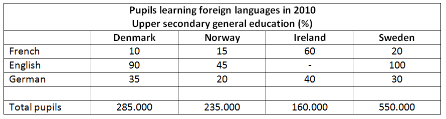

### Opciones disponibles

- **A.** 825.000
- **B.** 110.000
- **C.** 3.300.000
- **D.** 935.000
- **E.** 247.500

---

### Respuesta y explicacion

La respuesta correcta es la **D**: 935.000

Step 1 – Find the total pupils in the UK – six times that of Sweden:   550.000 x 6 = 3.300.000.

Step 2 – Find the number of UK pupils who studied French in 2010:   ¼ x 3.300.000 = 825.000

Step 3 – Find the number of Swedish pupils who studied French in 2010:  0,2 x 550.000 = 110.000

Step 4 – Find the total of UK and Swedish pupils who studied French in 2010: 825.000 + 110.000 = 935.000

## Pregunta 80

Fuente: https://www.epsoprep.com/practice/attempt/en/UXVlc3Rpb25Qb29sQXR0ZW1wdDpBc3lDNmdMSGRVTXdfZ2plMHIwTnVn/review?q=26

### Enunciado

Of the total business in the tourism industry in the EU in 2010, 56% were located in four countries - Italy, Spain, France and Germany. In terms of numbers employed, these four countries represented 49% of the total. What was the average number of people employed per business in Italy, Spain, France and Germany in 2010?

### Imagen

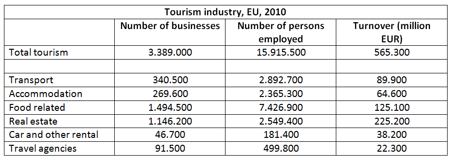

### Opciones disponibles

- **A.** 4,7
- **B.** 4,1
- **C.** 4,0
- **D.** 5,4
- **E.** 5,2

---

### Respuesta y explicacion

La respuesta correcta es la **B**: 4,1

Step 1 - Work out the number of business in France, Spain, Italy and Germany

3.389.000 x 0,56 = 1.897.840

Step 2 – Work out the number of persons employed in these four countries

15.915.500 x 0,49 = 7.798.595

Step 3 – Calculate the average number of people employed per business in these four countries

7.798.595/1.897.840 = 4,10919519

## Pregunta 81

Fuente: https://www.epsoprep.com/practice/attempt/en/UXVlc3Rpb25Qb29sQXR0ZW1wdDpBc3lDNmdMSGRVTXdfZ2plMHIwTnVn/review?q=27

### Enunciado

Total exports grew by 1% between 2012 and 2013 while imports shrunk by 3% in the same period. What was the trade balance in 2012?

### Imagen

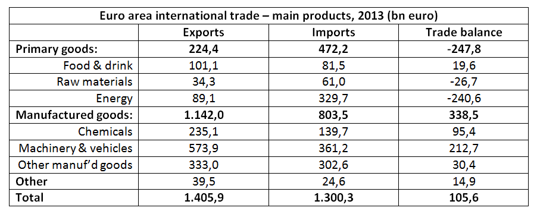

### Opciones disponibles

- **A.** 51,5
- **B.** 52,5
- **C.** 107,7
- **D.** 105,6
- **E.** 103,5

---

### Respuesta y explicacion

La respuesta correcta es la **A**: 51,5

Step 1 – Calculate the total exports for 2012.

1.405,9/1,01 = 1391,98

Step 2 – Calculate the total imports for 2012.

1.300,3/0,97 = 1.340,515

Step 3 – From this, work out the trade balance for 2012

1.391,98 – 1.340,515 = 51,465

## Pregunta 82

Fuente: https://www.epsoprep.com/practice/attempt/en/UXVlc3Rpb25Qb29sQXR0ZW1wdDpBc3lDNmdMSGRVTXdfZ2plMHIwTnVn/review?q=28

### Enunciado

Female unemployment rates in 2008 were 76% of the rate in 2000 while male unemployment rates were 30% higher in 2012 than 2008. What was the difference in percentage points between male and female unemployment rates in 2008?

### Imagen

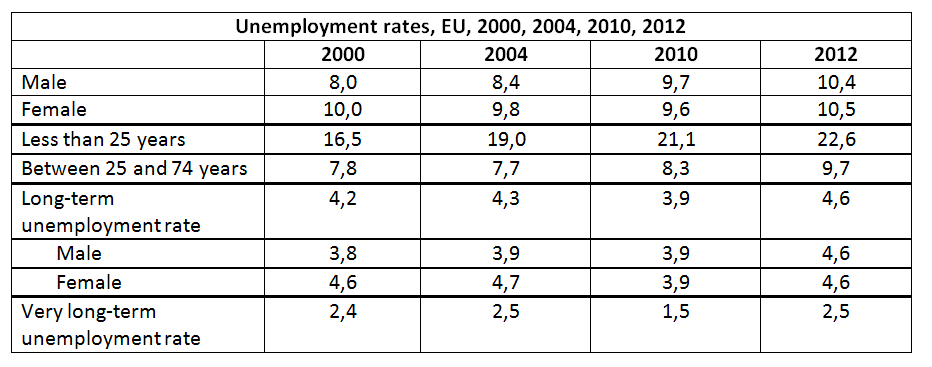

### Opciones disponibles

- **A.** 0,4 percentage points
- **B.** 4,0 percentage points
- **C.** 5,3 percentage points
- **D.** 95,0 percentage points
- **E.** 5,0 percentage points

---

### Respuesta y explicacion

La respuesta correcta es la **A**: 0,4 percentage points

Step 1 - Work out the female unemployment rate in 2008

10,0 x 0,76 = 7,6%

Step 2 – Work out the male unemployment rate in 2008

10,4/1,3 = 8,0%

Step 3 – Work out the difference in percentage points

8,0 – 7,6 = 0,4 percentage points

## Pregunta 83

Fuente: https://www.epsoprep.com/practice/attempt/en/UXVlc3Rpb25Qb29sQXR0ZW1wdDpBc3lDNmdMSGRVTXdfZ2plMHIwTnVn/review?q=29

### Enunciado

Milk storage tanks in Sweden have the same shape (that is, the corresponding lengths are in the same ratio) as those in Denmark apart from the fact that the average length of storage in Sweden is 3 meters shorter. What is the average volume of Sweden’s milk storage?

### Imagen

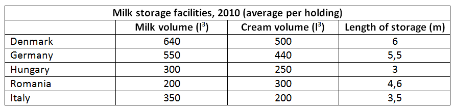

### Opciones disponibles

- **A.** 80 l³
- **B.** 320l³
- **C.** 1280l³
- **D.** 160
- **E.** 62,5 l³

---

### Respuesta y explicacion

La respuesta correcta es la **A**: 80 l³

Step 1 – Calculate the ratio of lengths of storage for Denmark and Sweden to give the linear scale factor.

6/3 = 2 (the linear scale factor)

Step 2 – Calculate the ratio of volumes based on the linear scale factor.

23 = 8 (volume scale factor) – the linear scale factor is cubed as volume has three dimensions

Step 3 – Calculate the volume of Sweden’s smaller storage facility based on the volume of Denmark’s milk storage.

640/8 = 80 l3

Tip: You need to remember to cube the linear scale factor as volume has three dimensions

## Pregunta 84

Fuente: https://www.epsoprep.com/practice/attempt/en/UXVlc3Rpb25Qb29sQXR0ZW1wdDpBc3lDNmdMSGRVTXdfZ2plMHIwTnVn/review?q=30

### Enunciado

In 2012, how many more individuals need to be employed for Norway to meet its target?

### Imagen

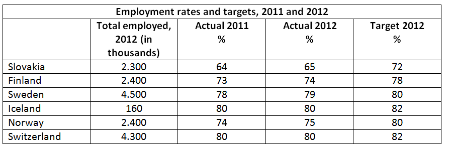

### Opciones disponibles

- **A.** 2.560
- **B.** 160
- **C.** 120.000
- **D.** 2.560.000
- **E.** 160.000

---

### Respuesta y explicacion

La respuesta correcta es la **E**: 160.000

Step 1 – Work out what 1% of Norway’s employed is

2.400/75 = 32 (thousand)

Step 2 – Work out the total employed if Norway met its target.

32 x 80 = 2.560 (thousand)

Step 3 – Calculate the difference between the target number of employed and the actual number of employed.

2.560 – 2.400 = 160 (thousand)

## Pregunta 85

Fuente: https://www.epsoprep.com/practice/attempt/en/UXVlc3Rpb25Qb29sQXR0ZW1wdDpBc3lDNmdMSGRVTXdfZ2plMHIwTnVn/review?q=32

### Enunciado

Total energy consumption increased between 1990 and 2012 by 0,9%. In the same period, the consumption of fossil fuels decreased by 35,4%, oil decreased by 12% and gas increased by 34,4%. By what percentage did renewables change between 1990 and 2012?

### Imagen

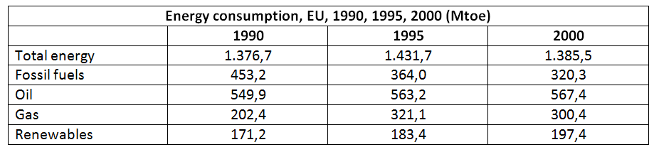

### Opciones disponibles

- **A.** 163,9%
- **B.** 420,2%
- **C.** 59,0%
- **D.** 98,8%
- **E.** 117,3%

---

### Respuesta y explicacion

La respuesta correcta es la **D**: 98,8%

Step 1 - Work out energy consumed in 2012

Total 1.376,7 x 1,009 = 1.389,0903

Fossil 453,2 x 0,646 = 292,7672 (100 – 35,4 = 64,6%)

Oil 549,9 x 0,88 = 483,912 (100 – 12 = 88%)

Gas 202,4 x 1,344 = 272,0256

Step 2 – Work out renewables consumed in 2012

1.389,0903 – (292,7672 + 483,912 + 272,0256) = 340,3855

Step 3 – Calculate the percentage change in renewable between 1990 and 2012

340,3855/171,2 = 1,988233061 (98,8%)

## Pregunta 86

Fuente: https://www.epsoprep.com/practice/attempt/en/UXVlc3Rpb25Qb29sQXR0ZW1wdDpBc3lDNmdMSGRVTXdfZ2plMHIwTnVn/review?q=33

### Enunciado

In 2009, construction and manufacturing accounted for a large percentage of total fatal accidents. By 2011, construction had reduced its share of fatal accidents by 5% and manufacturing had lowered its percentage share of fatal accidents by 10%. In 2011, the number fatal accidents were 5.580. How many were in the construction and manufacturing sectors?

### Imagen

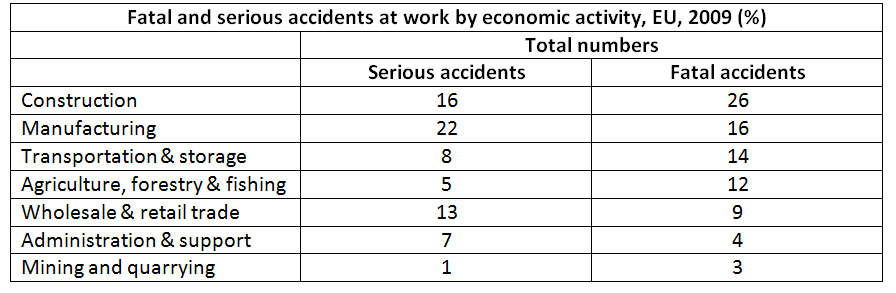

### Opciones disponibles

- **A.** 162
- **B.** 1.507
- **C.** 3.457
- **D.** 958
- **E.** 2.182

---

### Respuesta y explicacion

La respuesta correcta es la **E**: 2.182

Step 1

Work out the percentage share of fatal accidents in construction in 2011.

26 x 0,95 = 24,7% (or 26 – (0,05 x 26) = 24,7%)

Step 2

Work out the percentage share of fatal accidents in manufacturing in 2011.

16 x 0,90 = 14,4% (or 16 – (0,10 x 16) = 14,4%)

Step 3

Work out the total share of construction and manufacturing in 2011.

24,7 + 14,4 = 39,1%

Step 4

Calculate the number of fatal accidents in construction and manufacturing in 2011.

5.580 x 0,391 = 2.181,78

## Pregunta 87

Fuente: https://www.epsoprep.com/practice/attempt/en/UXVlc3Rpb25Qb29sQXR0ZW1wdDpBc3lDNmdMSGRVTXdfZ2plMHIwTnVn/review?q=34

### Enunciado

Population growth is anticipated to be a constant 2% per annum in Italy and a constant 1% per annum in the UK. In what year is the population of Italy expected to exceed that of the UK?

### Imagen

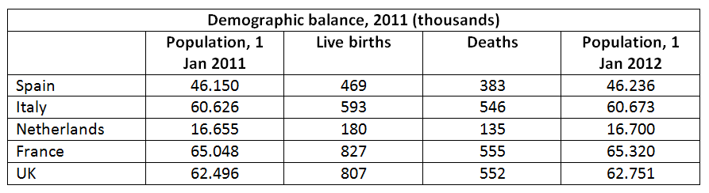

### Opciones disponibles

- **A.** 2013
- **B.** 2014
- **C.** 2015
- **D.** 2016
- **E.** 2017

---

### Respuesta y explicacion

La respuesta correcta es la **D**: 2016

Step 1 – Calculate the % growth in the UK and Italy for year one (2013)

Italy 60.673 x 1,02 = 61.886,46

UK 62.751 x 1,01 = 63.378,51

Step 2, etc – Keep on calculating the percentage growth for both countries

until Italy’s population exceeds the UK’s.

For year two (2014):

Italy 61.886,46 x 1,02 = 63.124,1892

UK 63.378,51 x 1,01 = 64.012,2951

Italy                        UK

2013                61.886,46                   63.378,51

2014                63.124,19                   64.012,30

2015                64.386,67                   64.652,42

2016                65.674,41                   65.298,94

Tip: It is easier to calculate the compound percentages using 1,01n where n is the number of years. So for example, in year two (2014), Italy’s population will be:

60.673 x 1,022 = 63.124,1892

Using this approach, it is easy to use trial and error to find the correct year.

## Pregunta 88

Fuente: https://www.epsoprep.com/practice/attempt/en/UXVlc3Rpb25Qb29sQXR0ZW1wdDpBc3lDNmdMSGRVTXdfZ2plMHIwTnVn/review?q=36

### Enunciado

Having peaked in 2001 with 450.000 applications, the number of asylum applications within the EU fell by ⁴⁄₉ by 2006. By how much has the number of asylum applications risen between 2006 and 2011?

### Imagen

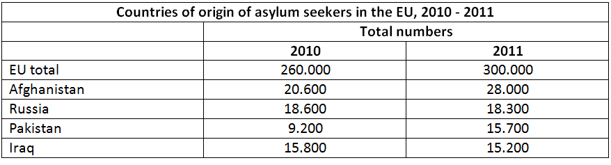

### Opciones disponibles

- **A.** ⅓
- **B.** ⅙
- **C.** ⅔
- **D.** ⅕
- **E.** ¼

---

### Respuesta y explicacion

La respuesta correcta es la **D**: ⅕

Step 1 – Work out how many applications there were in 2006.

450.000 - ((⁴⁄₉)*450.000) = 250.000

Step 2 – Work out the difference between applications in 2011 and 2006.

300.000 – 250.000 = 50.000

Step 3 – Work out the growth in applications.

50.000/250.000 = ⅕

## Pregunta 89

Fuente: https://www.epsoprep.com/practice/attempt/en/UXVlc3Rpb25Qb29sQXR0ZW1wdDpBc3lDNmdMSGRVTXdfZ2plMHIwTnVn/review?q=38

### Enunciado

In 2010, the average number of months worked by working-age individuals in Bulgaria was 7,3 months, but the average number of months worked by females of working age was 7,8. Of Bulgaria’s working population, 1,4 million were female. What was the average number of months worked by the male working-age population?

### Imagen

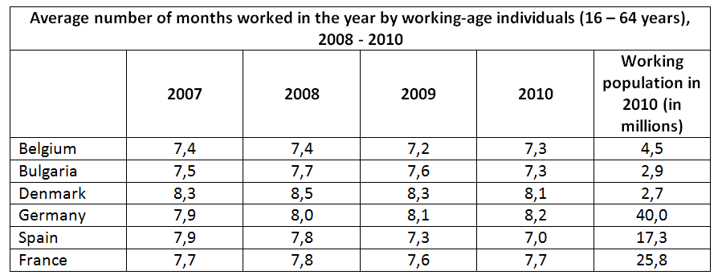

### Opciones disponibles

- **A.** 7,3
- **B.** 6,5
- **C.** 7,4
- **D.** 6,8
- **E.** 6,9

---

### Respuesta y explicacion

La respuesta correcta es la **D**: 6,8

Step 1 – Find the total number of months worked in Bulgaria across the working-age population.

2,9 x 7,3 = 21,17 million

Step 2 – Find the total number of months worked by the female working-age population.

1,4 x 7,8 = 10,92 million

Step 3 – Calculate the total number of months worked by the male working-age population.

21,17 – 10,92 = 10,25 million

Step 4 – Work out the average number of months worked by the male working-age population.

10,25/(2,9 – 1,4) = 6,83333

## Pregunta 90

Fuente: https://www.epsoprep.com/practice/attempt/en/UXVlc3Rpb25Qb29sQXR0ZW1wdDpBc3lDNmdMSGRVTXdfZ2plMHIwTnVn/review?q=39

### Enunciado

In July 2013, the four-month moving average for Germany was 1,4 and in June 2013 it was 1,6. What was the percentage change in production for Germany in April 2013 and March 2013?

### Imagen

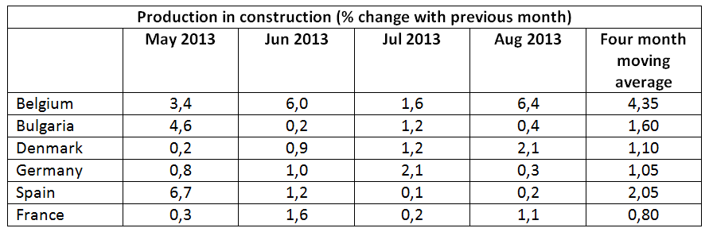

### Opciones disponibles

- **A.** 1,7 and 2,9
- **B.** 1,5 and 2,0
- **C.** 0,9 and 1,1
- **D.** 1,5 and 2,3
- **E.** 1,7 and 2,8

---

### Respuesta y explicacion

La respuesta correcta es la **A**: 1,7 and 2,9

Step 1 – Find the total on which the moving average was based in July 2013

We know that four month moving average was 1,4

1,4 x 4 = 5,6

Step 2 – Subtract from this total the three pieces of data you have for Germany to find April’s figure.

5,6 – (0,8 + 1,0 + 2,1) = 1,7 (Use the May, Jun and Jul figures)

Step 3 – Now using the same method find the total on which the moving average was based in June 2013.

1,6 x 4 = 6,4

Step 4 – Subtract from this total the three pieces of data you have to find March’s figure.

6,4 – (1,7 + 0,8 + 1,0) = 2,9 (Apr, May and Jun)

## Pregunta 91

Fuente: https://www.epsoprep.com/practice/attempt/en/UXVlc3Rpb25Qb29sQXR0ZW1wdDpBc3lDNmdMSGRVTXdfZ2plMHIwTnVn/review?q=40

### Enunciado

Germany’s total population has decreased by 2% between 2009 and 2013. By how many people has the total population reduced over this period?

### Imagen

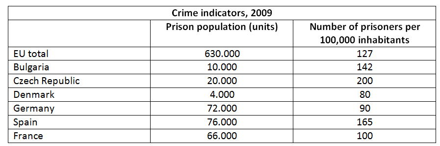

### Opciones disponibles

- **A.** 80.000.000
- **B.** 12.960.000
- **C.** 160.000
- **D.** 1.600.000
- **E.** 1.440

---

### Respuesta y explicacion

La respuesta correcta es la **D**: 1.600.000

Step 1 – Calculate the population of Germany in 2009

72.000/90 x 100.000 = 80.000.000

Step 2 – Calculate the population of Germany in 2013

80.000.000 x 0,98 = 78.400.000

Step 3 – Work out the difference between the two populations

80.000.000 – 78.400.000 = 1.600.000

## Pregunta 92

Fuente: https://www.epsoprep.com/practice/attempt/en/UXVlc3Rpb25Qb29sQXR0ZW1wdDpIcGV4X3RxaUJFVXdLQWplMHIwTnVn/review?q=8

### Enunciado

In 2011, UK invested in an initiative to help those unemployed, allocating a fixed amount per unemployed person, depending on the age group. The UK decided to continue this investment into 2012 but unemployment in 15 – 24 years is expected to reduce by 500 thousand, unemployment in 25 – 54 years is expected to increase by 300 thousand and the unemployment in 55 – 64 years is expected to increase by 100 thousand. How much did the UK invest across the three age groups in 2012?

### Imagen

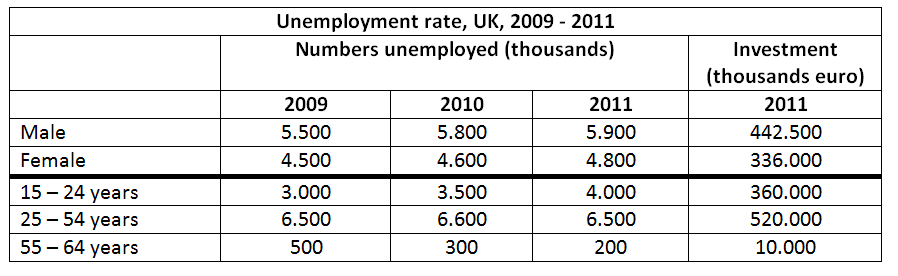

### Opciones disponibles

- **A.** €881.000
- **B.** €890.000
- **C.** €874.000
- **D.** €882.000
- **E.** €883.000

---

### Respuesta y explicacion

La respuesta correcta es la **C**: €874.000

Step 1 – Work out how much was invested per age group in 2011.

360.000/4.000 = €90 (15 – 24 years)

520.000/6.500 = €80 (25 – 54 years)

10.000/200 = €50 (55 – 64 years)

Step 2 – Calculate the amount of unemployed in each category in 2012.

4.000 – 500 = 3.500 (15 – 24 years)

6.500 + 300 = 6.800 (25 – 54 years)

200 + 100 = 300 (55 – 64 years)

Step 3 – Calculate the amount invested in 2012.

(3.500 x 90) + (6.800 x 80) + (300 x 50) = 874.000

## Pregunta 93

Fuente: https://www.epsoprep.com/practice/attempt/en/UXVlc3Rpb25Qb29sQXR0ZW1wdDpIcGV4X3RxaUJFVXdLQWplMHIwTnVn/review?q=9

### Enunciado

The range shows the difference between the country with the highest life expectancy and the country with the lowest life expectancy. What is the ratio between the range for men and the range for women in 2011?

### Imagen

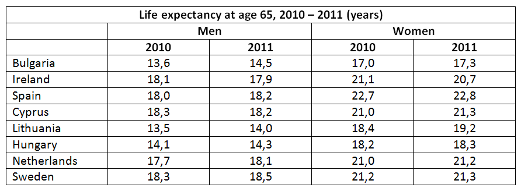

### Opciones disponibles

- **A.** 4 : 5
- **B.** 9:11
- **C.** 11 : 9
- **D.** 5 : 4
- **E.** 3 : 4

---

### Respuesta y explicacion

La respuesta correcta es la **B**: 9:11

Step 1 – Work out the range for men.

Highest is 65 + 18,5 = 83,5

(Sweden) and lowest is 65 + 14 = 79

(Lithuania) 83,5 – 79 = 4,5

Step 2 – Work out the range for women.

Highest is 65 + 22,8 = 87,8

(Spain) and lowest is 65 + 17,3 = 82,3

(Bulgaria) 87,8 – 82,3 = 5,5

Step 3 – Work out the ratio between men and women.

4,5 : 5,5 = 9:11

## Pregunta 94

Fuente: https://www.epsoprep.com/practice/attempt/en/UXVlc3Rpb25Qb29sQXR0ZW1wdDpIcGV4X3RxaUJFVXdLQWplMHIwTnVn/review?q=11

### Enunciado

Over the period 2006 to 2013, the annual growth rate of the euro area house price index reached a maximum of 200% of Estonia’s Q2 2013 figure and a minimum of 1,1 percentage points below than Ireland’s Q1 2013 figure. What was the difference between the minimum and maximum growth rate from 2006 to 2013?

### Imagen

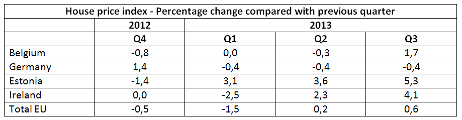

### Opciones disponibles

- **A.** 5,8
- **B.** 10,8
- **C.** 3,6
- **D.** 7,9
- **E.** 1,1

---

### Respuesta y explicacion

La respuesta correcta es la **B**: 10,8

Step 1 – Work out the house price index maximum

3,6 x 2  = 7,2

Step 2 – Work out the house price index minimum

-2,5 – 1,1 = -3,6

Step 3 – Calculate the difference between the maximum and minimum

7,2 – (-3,6) = 10,8

## Pregunta 95

Fuente: https://www.epsoprep.com/practice/attempt/en/UXVlc3Rpb25Qb29sQXR0ZW1wdDpIcGV4X3RxaUJFVXdLQWplMHIwTnVn/review?q=14

### Enunciado

In 2010, 34% of the 20 million students in tertiary education were studying social sciences. Of this, 3,9 million were female. What percentage of students in tertiary education were males studying social science?

### Imagen

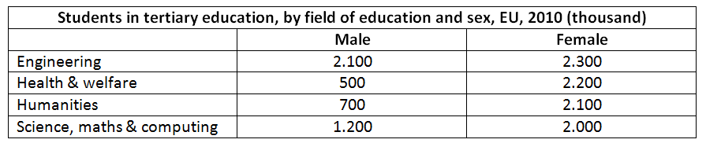

### Opciones disponibles

- **A.** 34%
- **B.** 43%
- **C.** 19,5%
- **D.** 14,5%
- **E.** 22,5%

---

### Respuesta y explicacion

La respuesta correcta es la **D**: 14,5%

Step 1 – Calculate the total number of students studying social sciences.

0,34 x 20 = 6,8 million

Step 2 – Calculate the number of males studying social science.

6,8 – 3,9 = 2,9 million

Step 3 – Work out the percentage of students in tertiary education that are males studying social science.

2,9/20 x 100 = 14,5%

## Pregunta 96

Fuente: https://www.epsoprep.com/practice/attempt/en/UXVlc3Rpb25Qb29sQXR0ZW1wdDpIcGV4X3RxaUJFVXdLQWplMHIwTnVn/review?q=15

### Enunciado

In 2000, the number of students per teacher in Portugal is half that of France and the number of students per teacher in France is ⅘ of that of the UK. In 2000, the number of students in France was 16.000.000. What was the total number of students across Portugal, France and the UK in 2000?

### Imagen

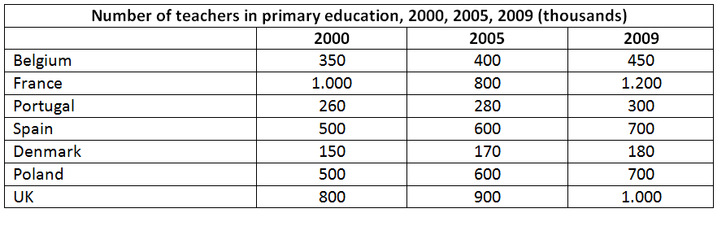

### Opciones disponibles

- **A.** 13.920.000
- **B.** 28.320.000
- **C.** 34.080.000
- **D.** 22.400.000
- **E.** 44.100.000

---

### Respuesta y explicacion

La respuesta correcta es la **C**: 34.080.000

Step 1 – Work out the number of students per teacher in France.

16.000 to 1.000 (or 16.000.000 to 1.000.000) = 16 to 1

Step 2 – Work out the number of students per teacher ratio in Portugal.

16/2 = 8 so the ratio is 8 to 1

Step 3 – Work out the number of students per teacher in the UK.

16 x ⁵⁄₄= 20 (note: it is not ⁴⁄₅) so the ratio is 20 to 1

Step 4 – Calculate the total number of students across France, Portugal, and the UK.

16.000.000 + (260.000 x 8) + (800.000 x 20) = 34.080.000

## Pregunta 97

Fuente: https://www.epsoprep.com/practice/attempt/en/UXVlc3Rpb25Qb29sQXR0ZW1wdDpIcGV4X3RxaUJFVXdLQWplMHIwTnVn/review?q=18

### Enunciado

An average car in the UK does 14 km per litre and a litre of petrol costs £1,30 per litre. How much does an average family, living 50 km from the sea, spend on petrol on round trips to the seaside each summer in Euros (£1 = 1,20 Euros)?

### Imagen

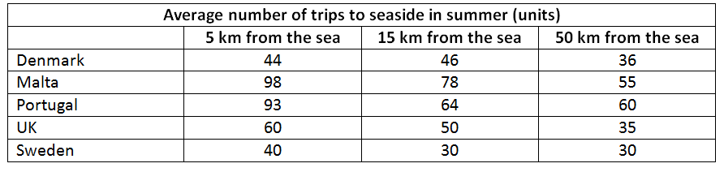

### Opciones disponibles

- **A.** €270
- **B.** €390
- **C.** €326
- **D.** €195
- **E.** €66

---

### Respuesta y explicacion

La respuesta correcta es la **B**: €390

Step 1 – Work out the number of km travelled.

50 x 35 x 2 = 3.500 km (remember round trips)

Step 2 – Calculate how many liters used to travel this distance.

3.500/14 = 250 litres

Step 3 – Calculate the cost of the petrol used in £s.

250 x 1,30 = £325,00

Step 4 – Calculate the cost in Euros.

325,00 x 1,20 = €390

## Pregunta 98

Fuente: https://www.epsoprep.com/practice/attempt/en/UXVlc3Rpb25Qb29sQXR0ZW1wdDpIcGV4X3RxaUJFVXdLQWplMHIwTnVn/review?q=29

### Enunciado

The table shows the number of dairy cows and the average milk yield per cow. What was the difference in total milk production between the country with the highest yield per cow and the country with the lowest yield per cow in 2011 in tonnes (where 1 tonne is equivalent to 1.000 kilograms)?

### Imagen

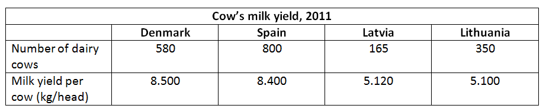

### Opciones disponibles

- **A.** 5.875.200 tonnes
- **B.** 3.145.000 tonnes
- **C.** 3.145 tonnes
- **D.** 5.875 tonnes
- **E.** 4.085 tonnes

---

### Respuesta y explicacion

La respuesta correcta es la **C**: 3.145 tonnes

Step 1 - Work out the milk production in the country with the highest yield per cow

8.500 x 580 = 4.930.000 kg (Denmark)

Step 2 – Work out the milk production in the country with the lowest yield per cow

5.100 x 350 = 1.785.000 kg (Lithuania)

Step 3 – Work out the difference

4.930.000 – 1.785.000 = 3.145.000 kg

Step 4 – Convert to tonnes

3.145.000/1000 = 3.145 tonnes

## Pregunta 99

Fuente: https://www.epsoprep.com/practice/attempt/en/UXVlc3Rpb25Qb29sQXR0ZW1wdDpIcGV4X3RxaUJFVXdLQWplMHIwTnVn/review?q=30

### Enunciado

The combined average length of education across France and Sweden was 18 years in 2005. In 2005, France had a population 6,5 times larger than Sweden’s population of 10 million. What was the average length of education in Sweden in 2005?

### Imagen

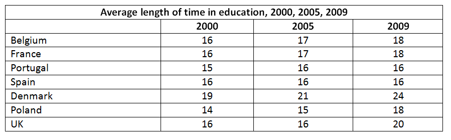

### Opciones disponibles

- **A.** 20,5 years
- **B.** 24,5 years
- **C.** 22,5 years
- **D.** 23 years
- **E.** 21 years

---

### Respuesta y explicacion

La respuesta correcta es la **B**: 24,5 years

Step 1 – Work out France’s population

10 x 6,5 = 65 million

Step 2 – Work out the total number of education years across Sweden and France.

The total population in France and Sweden: 65 +10 = 75 million, so total education years is

(75 x 18) = 1.350 million

Step 3 – Calculate the total number of education years in France.

(65 x 17) = 1.105 million

So the total number of education years in Sweden is:

1.350 – 1.105 = 245 million

Step 4 – Work out the average number of years of education in Sweden.

245/10 = 24,5 years

## Pregunta 100

Fuente: https://www.epsoprep.com/practice/attempt/en/UXVlc3Rpb25Qb29sQXR0ZW1wdDpIcGV4X3RxaUJFVXdLQWplMHIwTnVn/review?q=32

### Enunciado

The UK, Italy, the Netherlands and Spain handled 50% of total EU seaborne freight in 2011. The UK handled the largest amount. The ratio of the UK’s seaborne freight to Italy’s was 21:20 and the ratio of the Netherlands ’ seaborne freight to Spain’s was 9:8. How many million tonnes did these four countries handle in 2011?

### Imagen

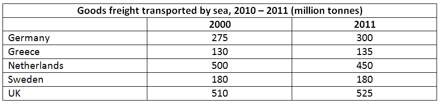

### Opciones disponibles

- **A.** 2.032 million tonnes
- **B.** 1.550 million tonnes
- **C.** 1.443 million tonnes
- **D.** 1.875 million tonnes
- **E.** 2.100 million tonnes

---

### Respuesta y explicacion

La respuesta correcta es la **D**: 1.875 million tonnes

Step 1 – Work out Italy’s seaborne freight

If 525 is 21 parts out of the total, then one part is 525/21 = 25

So Italy’s freight is 20 x 25 = 500 (20 parts x 25)

Step 2 – Work out Spain’s seaborne freight

If 450 is 9 parts out the total, then one part is 450/9 = 50

So Spain’s freight is 8 x 50 = 400 (8 parts x 50)

Step 3 – Calculate the total seaborne freight across the four countries

525 + 500 + 450 + 400 = 1.875 million tonnes

Note: this can be carried out without a calculator by a student with very good mental calculation skills

## Pregunta 101

Fuente: https://www.epsoprep.com/practice/attempt/en/UXVlc3Rpb25Qb29sQXR0ZW1wdDpIcGV4X3RxaUJFVXdLQWplMHIwTnVn/review?q=35

### Enunciado

In 2012, Europe had double the population density of the United States and a population 3,9 times the size of Brazil. What is the area of Europe?

### Imagen

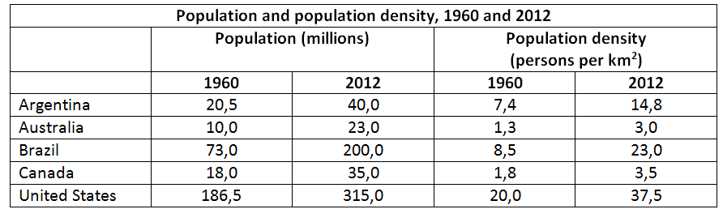

### Opciones disponibles

- **A.** 16.380.000 km²
- **B.** 58.500.000.000 km²
- **C.** 10.400.000 km²
- **D.** 10,4 km²
- **E.** 16,380 km²

---

### Respuesta y explicacion

La respuesta correcta es la **C**: 10.400.000 km²

Step 1 – Work out the population density of Europe.

37,5 x 2 = 75

Step 2 – Work out the population of Europe.

200 x 3,9 = 780 million

Step 3 – Calculate the area of Europe

780.000.000/75 = 10.400.000 km2

## Pregunta 102

Fuente: https://www.epsoprep.com/practice/attempt/en/UXVlc3Rpb25Qb29sQXR0ZW1wdDpIcGV4X3RxaUJFVXdLQWplMHIwTnVn/review?q=36

### Enunciado

In 2001, the unemployment rate for women in the EU was 9,6%, while the rate for men was 2 percentage points lower. By 2003, this gender gap had narrowed to 70% of the 2001 gap but the male unemployment rate was now higher than the female unemployment rate. The unemployment rate for men in 2003 was the same as the average of the male rate across Belgium, Denmark, Germany and France in 2011. What was the female unemployment rate in 2003?

### Imagen

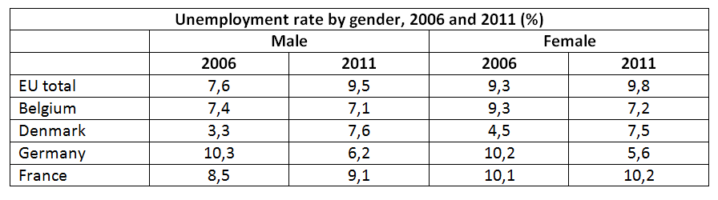

### Opciones disponibles

- **A.** 5,9 %
- **B.** 8,9 %
- **C.** 6,9 %
- **D.** 8,1 %
- **E.** 6,1 %

---

### Respuesta y explicacion

La respuesta correcta es la **E**: 6,1 %

Step 1 – Work out the gender gap in 2003.

2 x 0,7 = 1,4 (70% of 2 percentage points)

Step 2 – Work out the male unemployment rate in 2003.

(7,1 + 7,6 + 6,2 +9,1)/4 = 7,5

Step 3 – Calculate the female unemployment rate.

7,5 – 1,4 = 6,1

## Pregunta 103

Fuente: https://www.epsoprep.com/practice/attempt/en/UXVlc3Rpb25Qb29sQXR0ZW1wdDpIcGV4X3RxaUJFVXdLQWplMHIwTnVn/review?q=37

### Enunciado

In 2005, Finland, UK, Austria and Sweden had an average of 46% of subsidies across all four countries. In 2005, Austria had 5 percentage points more subsidies than Sweden, and Finland’s subsidies were 100% more than the Czech Republic’s. What percentage share of subsidies did UK have in 2005?

### Imagen

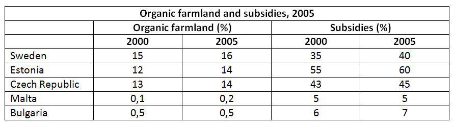

### Opciones disponibles

- **A.** 54%
- **B.** 19%
- **C.** 45%
- **D.** 90%
- **E.** 9%

---

### Respuesta y explicacion

La respuesta correcta es la **E**: 9%

Step 1 – Work out the total percentage subsidies across the four countries

46 x 4 = 184

Step 2 – Work out Austria’s and Sweden’s percentages

Sweden is 40% so Austria is 45% (40 + 5 percentage points = 45)

Step 3 – Work out Finland’s percentage

45 x 2 = 90% (Czech Republic is 45% in 2005)

Step 4 – Work out UK’s percentage

184 – (40 + 45 + 90) = 9%

## Pregunta 104

Fuente: https://www.epsoprep.com/practice/attempt/en/UXVlc3Rpb25Qb29sQXR0ZW1wdDpIcGV4X3RxaUJFVXdLQWplMHIwTnVn/review?q=38

### Enunciado

In Austria, the share of inland freight that was transported by road fell by 8,5 percentage points between 2000 and 2010 while total inland freight transport grew by 18% in the same period. How much road freight did Austria have in 2010?

### Imagen

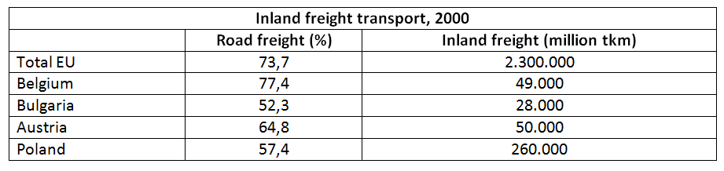

### Opciones disponibles

- **A.** 33.217 million tkm
- **B.** 34.982 million tkm
- **C.** 1.769.528 million tkm
- **D.** 1.830.199 million tkm
- **E.** 27.238 million tkm

---

### Respuesta y explicacion

La respuesta correcta es la **A**: 33.217 million tkm

Step 1 – Work out the total inland freight in Austria in 2010

50.000 x 1,18 = 59.000

Step 2 – Calculate the % road freight in Austria in 2010

64,8 – 8,5 = 56,3%

Step 3 – Calculate the amount of road freight in Austria in 2010

59.000 x 0,563 = 33.217 (million tkm)

## Pregunta 105

Fuente: https://www.epsoprep.com/practice/attempt/en/UXVlc3Rpb25Qb29sQXR0ZW1wdDpIcGV4X3RxaUJFVXdLQWplMHIwTnVn/review?q=39

### Enunciado

In 2011, Italy was the top importer of electricity, with its imports being 3 times above the imports of the second top importer Finland. In 2011, France was the main net exporter, with exports of 2½ times of the second biggest exporter Czech Republic. What was the net difference between Italy’s and France’s imports and exports in 2011?

### Imagen

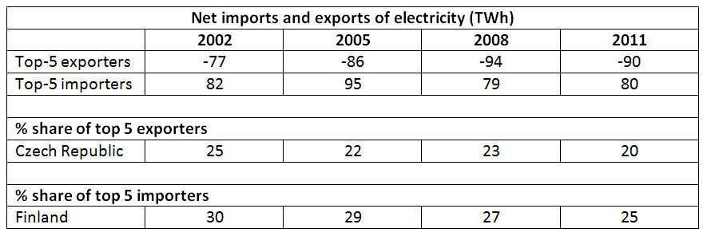

### Opciones disponibles

- **A.** 120
- **B.** 15
- **C.** -15
- **D.** 2
- **E.** -2

---

### Respuesta y explicacion

La respuesta correcta es la **B**: 15

Step 1 – Work out how much Finland imported and thus what Italy imported in 2011

Finland imported: 80 x 0,25 = 20

So Italy imported: 20 x 3 = 60

Step 2 – Work out how much Czech Republic exported and thus what France exported in 2011

Czech Rep exported: -90 x 0,20 = -18

So France exported: -18 x 2,5 = -45

Step 3 – Calculate the net difference

60 – 45 = 15

## Pregunta 106

Fuente: https://www.epsoprep.com/practice/attempt/en/UXVlc3Rpb25Qb29sQXR0ZW1wdDpIcGV4X3RxaUJFVXdLQWplMHIwTnVn/review?q=40

### Enunciado

In 2009, there were 6.000 enterprises in the EU producing 150 million tonnes of milk. How much on average was produced by medium-sized enterprises (those not small or large)?

### Imagen

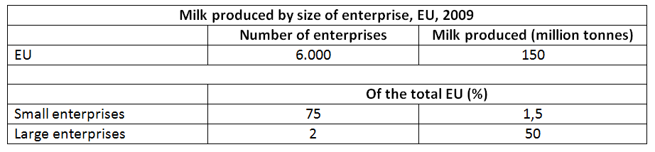

### Opciones disponibles

- **A.** 52.717 tonnes
- **B.** 500 tonnes
- **C.** 625.000 tonnes
- **D.** 1.125 tonnes
- **E.** 1.125.000 tonnes

---

### Respuesta y explicacion

La respuesta correcta es la **A**: 52.717 tonnes

Step 1 – Work out the number of enterprises and how much milk is produced by small enterprises

0,75 x 6.000 = 4.500 enterprises

0,015 x 150.000.000 = 2.250.000 tonnes of milk

Step 2 – Work out the number of enterprises and how much milk is produced by large enterprises

0,02 x 6.000 = 120 enterprises

0,50 x 150.000.000 = 75.000.000

Step 3 – Calculate the number of enterprises and how much milk is produced by medium enterprises

6.000 – (4.500 + 120) = 1.380 enterprises

150.000.000 – (75.000.000 + 2.250.000) = 72.750.000

Step 4 – Work out the average milk produced by a medium sized enterprise

72.750.000/1.380 = 52.717,3913

## Pregunta 107

Fuente: https://www.epsoprep.com/practice/attempt/en/UXVlc3Rpb25Qb29sQXR0ZW1wdDo2NFh1dzBfanVFRXY3UWplMHIwTnVn/review?q=3

### Enunciado

In 2010, France, Spain, UK, and Germany represented one half of all land used in agriculture across the EU. What percentage was used for agricultural use in Poland, Romania and Italy?

### Imagen

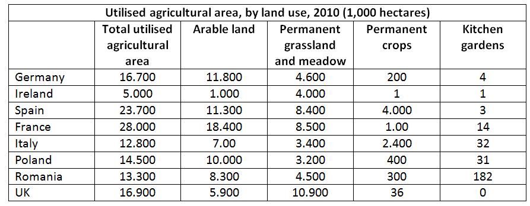

### Opciones disponibles

- **A.** 55%
- **B.** 48%
- **C.** 6%
- **D.** 12%
- **E.** 24%

---

### Respuesta y explicacion

La respuesta correcta es la **E**: 24%

Step 1 – Find the total utilised agricultural area across France, Spain, UK and Germany.

28.000 + 23.700 + 16.900 + 16.700 = 85.300

Step 2 – Calculate the total agricultural land in the EU.

85.300 x 2 = 170.600

Step 3 – Find the total utilised agricultural area across Poland, Romania and Italy.

14.500 + 13.300 + 12.800 = 40.600

Step 4 – Find the agricultural land in Poland, Romania and Italy as a percentage of the total EU agricultural land.

40.600/170.600 x 100 = 23,8%

## Pregunta 108

Fuente: https://www.epsoprep.com/practice/attempt/en/UXVlc3Rpb25Qb29sQXR0ZW1wdDo2NFh1dzBfanVFRXY3UWplMHIwTnVn/review?q=6

### Enunciado

5% of the total shipment weight for the day is made up of packaging. How many kilograms does the packaging weigh?

### Imagen

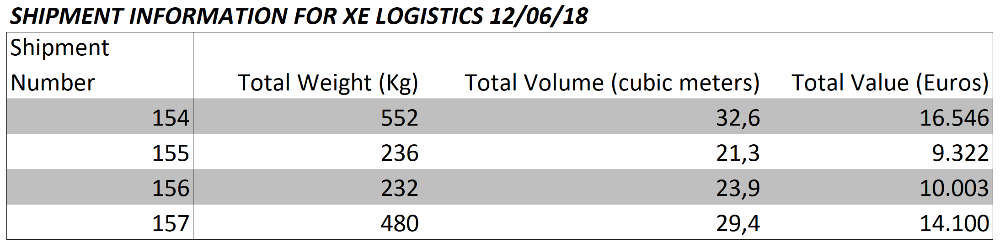

### Opciones disponibles

- **A.** 75
- **B.** 80
- **C.** 78,00
- **D.** 68
- **E.** 74

---

### Respuesta y explicacion

La respuesta correcta es la **A**: 75

Step 1 : Find the total weight by summing the values in the weight column:552+236+232+480=1.500.

Step 2 : Divide this value by 10 to find 10%: 1.500/10=150.

Step 3 : Divide the 10% value by 2 to find 5%: 150/2=75. This calculation can be figured out using a calculator, but will likely be a lot quicker to work out mentally.

## Pregunta 109

Fuente: https://www.epsoprep.com/practice/attempt/en/UXVlc3Rpb25Qb29sQXR0ZW1wdDo2NFh1dzBfanVFRXY3UWplMHIwTnVn/review?q=9

### Enunciado

The ratio between the highest and lowest selling prices for chickens in 2012 is the same as the ratio between the selling prices of eggs in two other countries.  For these two countries, what is the ratio between the higher and lower selling prices for cows?

### Imagen

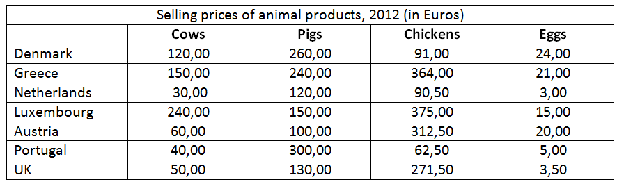

### Opciones disponibles

- **A.** 6:1
- **B.** 3:1
- **C.** 4:1
- **D.** 8:1
- **E.** 7:1

---

### Respuesta y explicacion

La respuesta correcta es la **B**: 3:1

Step 1

Calculate the ratio between the highest and lowest selling prices for chickens.

Ratio is 375,00 : 62.50 (Luxembourg : Portugal) = 6 : 1

Step2

Find which pair of countries has the same 6:1 ratio.

To quickly find the values, multiply the lower values by 6 to find the pair of countries.

We can see that the only two countries that have the ratio 6:1 are UK and Greece as 21,00 : 3.50 = 6 : 1

Step 3

Identify the values for the higher and lower selling prices for Greece and UK and calculate the ratio

150 : 50 = 3:1 (Greece: UK)

## Pregunta 110

Fuente: https://www.epsoprep.com/practice/attempt/en/UXVlc3Rpb25Qb29sQXR0ZW1wdDo2NFh1dzBfanVFRXY3UWplMHIwTnVn/review?q=10

### Enunciado

In Ireland, the inflation rate in Jul 2013 was 0,3%. What was the four-month average rate in Oct 2013?

### Imagen

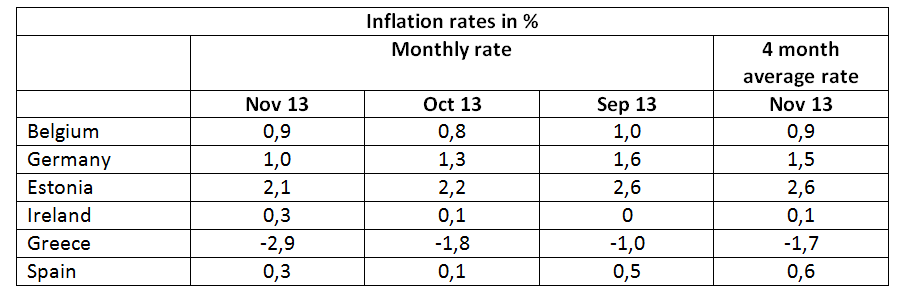

### Opciones disponibles

- **A.** 0,4
- **B.** 0
- **C.** 0,1
- **D.** 0,3
- **E.** 0,5

---

### Respuesta y explicacion

La respuesta correcta es la **C**: 0,1

Step 1 – Calculate the total rate for Ireland for period Aug – Nov 2013

0,1 x 4 = 0,4

Step 2 – Work out monthly inflation rate for Aug 2013

0,4 – (0,3 + 0,1 + 0) = 0 (Total rate - (Jul + Oct + Sep) = Aug)

Step 3 – Calculate the 4 month average rate for Oct 2013 using the figures provided.

(0,1 + 0 + 0 +0,3)/4 = 0,1

## Pregunta 111

Fuente: https://www.epsoprep.com/practice/attempt/en/UXVlc3Rpb25Qb29sQXR0ZW1wdDo2NFh1dzBfanVFRXY3UWplMHIwTnVn/review?q=11

### Enunciado

In 2010, an average household spent €100 per month on each of the items below. In 2011, what was the difference in spending between the item with the highest price increase and the one with the lowest price increase?

### Imagen

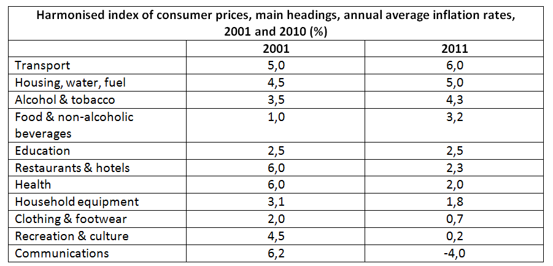

### Opciones disponibles

- **A.** €10
- **B.** €2
- **C.** €4
- **D.** €12
- **E.** €8

---

### Respuesta y explicacion

La respuesta correcta es la **A**: €10

Step 1 – Find the item with the highest price rise in 2011 and calculate how much it now costs.

100 x 1,06 (transport) = 106

Step 2 – Find the item with the lowest price rise in 2011 and calculate how much it now costs.

100 x 0,96 (communications) = 96

Step 3 – Calculate the difference between the two items

106 – 96 = 10€

## Pregunta 112

Fuente: https://www.epsoprep.com/practice/attempt/en/UXVlc3Rpb25Qb29sQXR0ZW1wdDo2NFh1dzBfanVFRXY3UWplMHIwTnVn/review?q=13

### Enunciado

In 2011, in Spain the number of physicians dropped by 1⁄16 and the number of hospital beds dropped by 1⁄13 compared to the previous year. In 2012, hospital beds in Spain were expected to increase by 200. How many physicians will be required in 2012 assuming the same ratio of doctors to beds as in 2011.

### Imagen

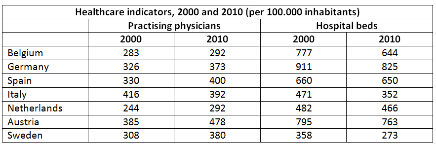

### Opciones disponibles

- **A.** 430
- **B.** 860
- **C.** 800
- **D.** 1280
- **E.** 500

---

### Respuesta y explicacion

La respuesta correcta es la **E**: 500

Step 1 – Calculate the number of physicians in 2011. 400 x 15⁄16 = 375

Step 2 – Calculate the number of hospital beds in 2011. 650 x12⁄13 = 600

Step 3 – Calculate the proportion of physicians to hospital beds in 2011 in Spain. 375 physicians can support 600 beds, so 1 physician can support 1,6 beds (600/375 = 1,6)

Step 4 – Calculate the expected increase in hospital beds in 2011. 600 + 200 = 800 beds

Step 5 – Apply the proportion calculation to the new hospital bed total 800/1,6 = 500 doctors

## Pregunta 113

Fuente: https://www.epsoprep.com/practice/attempt/en/UXVlc3Rpb25Qb29sQXR0ZW1wdDo2NFh1dzBfanVFRXY3UWplMHIwTnVn/review?q=16

### Enunciado

In Germany between 2009 and 2013, the number of police officers rose by 12% while the number of crimes recorded reduced by 15% in the same time. What was the ratio of police officers to crimes recorded in Germany in 2013?

### Imagen

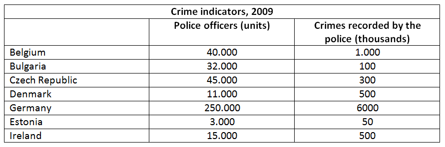

### Opciones disponibles

- **A.** 1 : 24
- **B.** 280.000 : 5.100
- **C.** 14 : 255
- **D.** 280 : 510
- **E.** 10 : 240

---

### Respuesta y explicacion

La respuesta correcta es la **C**: 14 : 255

Step 1 – Work out how many police officers there are in Germany in 2013.

250.000 x 1,12 = 280.000 (this can be completed in two steps)

Step 2 – Work out the number of crimes recorded in Germany in 2013.

6.000.000 x 0,85 = 5.100.000

Step 3 – Work out the ratio of police officers to crimes recorded.

280.000 : 5.100.000 (remember the crimes recorded are in thousands)

Step 4 – Express the ratio in its simplest form 14 : 255

In this case it is also possible to express the value as a decimal 280,000 / 5,100,000 = 0.0549 and see which of the ratio options also has the same decimal value as 14: 255

## Pregunta 114

Fuente: https://www.epsoprep.com/practice/attempt/en/UXVlc3Rpb25Qb29sQXR0ZW1wdDo2NFh1dzBfanVFRXY3UWplMHIwTnVn/review?q=20

### Enunciado

In 1960, Asia had 40% of the population that it had in 2012 and in 2012 its percentage share of the world population had increased by 4 percentage points from 1960. What percentage of the world’s population was Europe in 2012 with 740 million people?

### Imagen

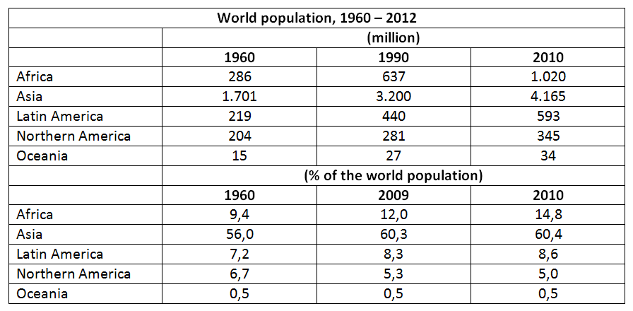

### Opciones disponibles

- **A.** 18,6%
- **B.** 10,1%
- **C.** 10,4%
- **D.** 12,3%
- **E.** 21,7%

---

### Respuesta y explicacion

La respuesta correcta es la **C**: 10,4%

Step 1 – Calculate Asia’s population in 2012

1701/40 = 42,525 (1%)

42,525 x 100 = 4.252,5

Step 2 – Calculate percentage share of Asia’s world population

56,0 + 4 = 60

Step 3 – Calculate the world population

4.252,5/60 = 70,875 (1%)

70,875 x 100 = 7.087,5

Step 4 –Calculate Europe’s percentage share of the world’s population

740/7087,5 x 100 = 10,441

## Pregunta 115

Fuente: https://www.epsoprep.com/practice/attempt/en/UXVlc3Rpb25Qb29sQXR0ZW1wdDo2NFh1dzBfanVFRXY3UWplMHIwTnVn/review?q=22

### Enunciado

By what percentage does the interest rate increase on the Boost Plus credit card after 12 months?

### Imagen

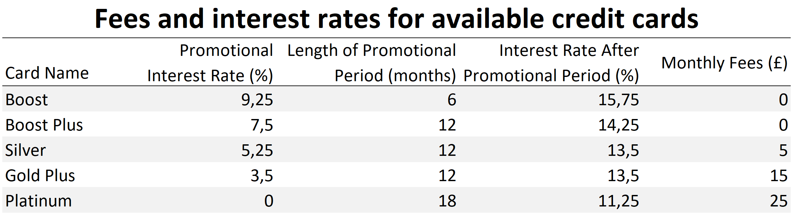

### Opciones disponibles

- **A.** 90
- **B.** 85
- **C.** 67,5
- **D.** 6,75
- **E.** 32,5

---

### Respuesta y explicacion

La respuesta correcta es la **A**: 90

As we are finding the percentage change we need to calculate the increase in percentage between the rate before and after the change at 12 months.

Step 1 : Identify the promotional interest percentage (7,5) and interest percent after the promotional period (14,25).

Step 2 : Use the formula to find the percentage change between these numbers: ((14,25-7,5)/7,5)*100=(6,75/7,5)*100=90.

## Pregunta 116

Fuente: https://www.epsoprep.com/practice/attempt/en/UXVlc3Rpb25Qb29sQXR0ZW1wdDo2NFh1dzBfanVFRXY3UWplMHIwTnVn/review?q=24

### Enunciado

Among partner countries and regions in 2011, the EU’s current account deficit was largest with China, which was twice as large as the deficit with Russia and five times the deficit with Japan What percentage of the total EU current account deficit of 242.800 million did these three countries represent?

### Imagen

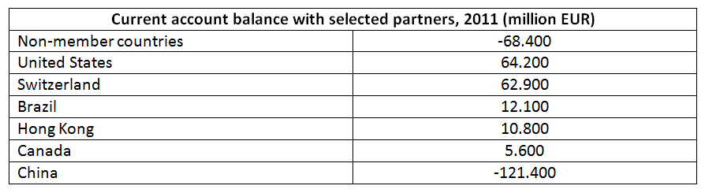

### Opciones disponibles

- **A.** 50%
- **B.** 4%
- **C.** 400%
- **D.** 75%
- **E.** 85%

---

### Respuesta y explicacion

La respuesta correcta es la **E**: 85%

Step 1 – Find the deficit with Russia.

121.400/2 = 60.700

Step 2 – Find the deficit with Japan.

121.400/5 = 24.280

Step 3 – Find the total deficit across the three countries.

121.400 + 60.700 + 24.280 = 206.380

Step 4 – Find the percentage of the total deficit this represents

206.380/242.800 x 100 = 85%

## Pregunta 117

Fuente: https://www.epsoprep.com/practice/attempt/en/UXVlc3Rpb25Qb29sQXR0ZW1wdDo2NFh1dzBfanVFRXY3UWplMHIwTnVn/review?q=25

### Enunciado

In 2012, Belgium represented 2,5% of the total EU output value of the agricultural industry. In 2013, the total EU output value is expected to grow by 15%. Given France is expected to increase its total share by 5 percentage points, what is France’s expected output value in 2013?

### Imagen

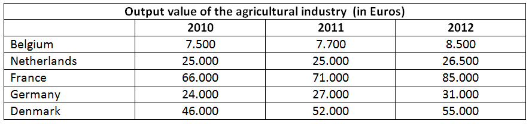

### Opciones disponibles

- **A.** 102.000
- **B.** 97.750
- **C.** 117.300
- **D.** 391.000
- **E.** 102

---

### Respuesta y explicacion

La respuesta correcta es la **C**: 117.300

Step 1 – Find the total EU output value for 2012. If 8.500 is 2,5%, then the total EU output value is 340.000 (8.500/2,5 x 100 = 340.000).

Step 2 – Calculate what percentage of the EU total France represents. 85.000/340.000 x 100 = 25%

Step 3 – Calculate the expected increase in total EU output value in 2013: 340.000 x 1,15 = 391.000

Remember, 1,15 represents the 15% expected growth.

Step 4 – Calculate France’s expected share of the EU total: 25% + 5% = 30%

30% of 391.000 = 117.300

Tip: You can calculate France’s percentage share (in step 2) directly as it is ten times bigger than Belgium's (85.000/8.500 )

## Pregunta 118

Fuente: https://www.epsoprep.com/practice/attempt/en/UXVlc3Rpb25Qb29sQXR0ZW1wdDo2NFh1dzBfanVFRXY3UWplMHIwTnVn/review?q=26

### Enunciado

In 2011, total EU foreign direct investment (FDI) flows showed signs of recovery. Outward flows of FDI increased for the first time in four years, rising by 154% when compared with 2010. At the same time, inward flows of FDI more than doubled compared with the previous year – up 117%. What was the net difference between outward and inward FDI in 2011?

### Imagen

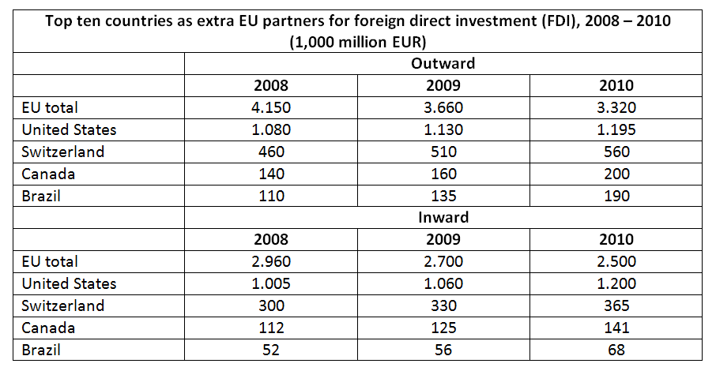

### Opciones disponibles

- **A.** 3.008 thousand million
- **B.** 2.188 thousand million
- **C.** 5.508 thousand million
- **D.** 2.188 million
- **E.** 3.008 million

---

### Respuesta y explicacion

La respuesta correcta es la **A**: 3.008 thousand million

Step 1 – Calculate outward FDI for 2011

3.320 x 1,54 = 5.112,80 (54% increase)

3.320 + 5.112,80 = 8.432,80 (154% increase)

Or simply 3.320 x 2,54 (154% increase) = 8.432,80

Step 2 – Calculate inward FDI for 2011

2.500 x 1,17 = 2.925 (17% increase)

2.500 + 2.925 = 5.425 (117% increase)

Step 3 – Calculate difference

8.432,80 – 5.425 = 3.007,80 thousand million

Tip: You can complete steps 1 and 2 in one stage by using a multiplier:

For example: 3.320 x 2,54 = 8.432,80

## Pregunta 119

Fuente: https://www.epsoprep.com/practice/attempt/en/UXVlc3Rpb25Qb29sQXR0ZW1wdDo2NFh1dzBfanVFRXY3UWplMHIwTnVn/review?q=28

### Enunciado

Euro member states pledge to keep government debt below 60% of GDP. However, in 2011 many member states exceeded this threshold. Greece’s GDP in 2011 was €215.000 million. By how much did Greece need to reduce government debt (as an amount) to meet its target?

### Imagen

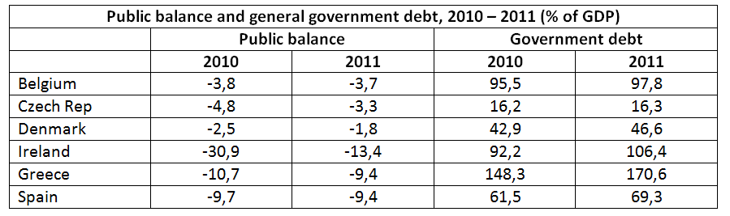

### Opciones disponibles

- **A.** €237.790.000
- **B.** €129.000.000
- **C.** €366.790.000.000
- **D.** €237.790
- **E.** €237.790.000.000

---

### Respuesta y explicacion

La respuesta correcta es la **E**: €237.790.000.000

Step 1 – Calculate Greece’s government debt in 2011.

1,706 x 215.000 = 366.790 million

Step 2 – Calculate 60% of GDP (government debt threshold).

215.000 x 0,6 = 129.000 million

Step 3 – Calculate by how much Greece needed to reduce government debt to meet its threshold.

366.790 – 129.000 = 237.790 million

## Pregunta 120

Fuente: https://www.epsoprep.com/practice/attempt/en/UXVlc3Rpb25Qb29sQXR0ZW1wdDo2NFh1dzBfanVFRXY3UWplMHIwTnVn/review?q=29

### Enunciado

In 2009, GDP contracted considerably as a result of the global financial and economic crisis, but recovered across all countries by 8% in 2010. In Germany, GDP grew by 20% between 2001 and 2012. What was the percentage growth in GDP in Germany between 2009 and 2012?

### Imagen

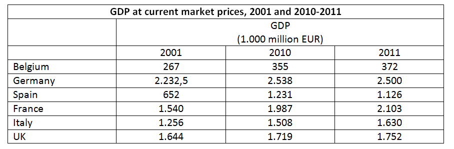

### Opciones disponibles

- **A.** 10%
- **B.** 11%
- **C.** 12%
- **D.** 13%
- **E.** 14%

---

### Respuesta y explicacion

La respuesta correcta es la **E**: 14%

Step 1 – Calculate the GDP in Germany in 2009.

2.538/1,08 = 2.350

Step 2 – Calculate the GDP in Germany in 2012.

2.232,5 x 1,2 = 2.679

Step 3 – Calculate the percentage growth in GDP between 2009 and 2012.

2.679/2350 x 100 = 1,14 (14% growth)

## Pregunta 121

Fuente: https://www.epsoprep.com/practice/attempt/en/UXVlc3Rpb25Qb29sQXR0ZW1wdDo2NFh1dzBfanVFRXY3UWplMHIwTnVn/review?q=35

### Enunciado

The country with the lowest levels of internet access in 2013 would like to grow this figure by 20 percentage points in the next two years. Given that its number of households is ¹⁄₉ of the size of the UK’s, which is 63 million, by how much does it under or over achieve against this target if it has 5,6 million households with internet in 2015 (assuming the population does not change)?

### Imagen

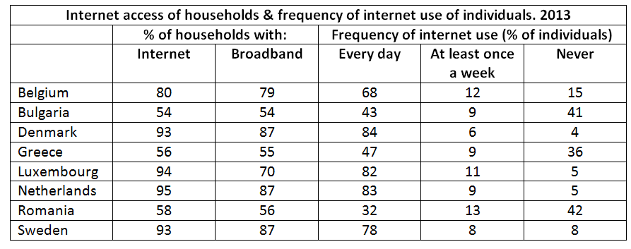

### Opciones disponibles

- **A.** 0,28 million over
- **B.** 0,42 million under
- **C.** 0,28 million under
- **D.** 1,06 million under
- **E.** 0,42 million over

---

### Respuesta y explicacion

La respuesta correcta es la **E**: 0,42 million over

Step 1 – Identify the country with the lowest level of internet usage and add on 20 percentage points.

54 (Bulgaria) + 20 = 74%

Step 2 – Calculate the size of Bulgaria’s population.

63/9 = 7 million

Step 3 – Calculate the target internet users.

7 x 0,74 = 5,18 million

Step 4 - Calculate the difference between the target and the actual figure.

5,6 – 5,18 = 0,42 million

This means that if the actual number of households with internet is 5,6 million two years later it has overachieved the target with 0,42 million.

## Pregunta 122

Fuente: https://www.epsoprep.com/practice/attempt/en/UXVlc3Rpb25Qb29sQXR0ZW1wdDo2NFh1dzBfanVFRXY3UWplMHIwTnVn/review?q=38

### Enunciado

In 2010, Italy had a third of the number of national immigrants as the UK. In the UK national immigrants represented 16% of total immigrants. Of the remainder, ⅓ were citizens of other EU Member States. How many immigrants to UK were citizens of other non-member countries?

### Imagen

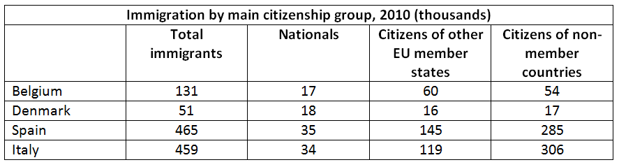

### Opciones disponibles

- **A.** 357.000
- **B.** 178.500
- **C.** 637.500
- **D.** 212.500
- **E.** 425.000

---

### Respuesta y explicacion

La respuesta correcta es la **A**: 357.000

Step 1 – Find the number of UK national immigrants.

34.000 x 3 = 102.000

Step 2 – Find the total immigrants to UK.

102.000/16 x 100 = 637.500

Step 3 – Find the number of non-national immigrants to UK.

637.500 – 102.000 = 535.500

Step 4 – Calculate how many immigrants were citizens of non-member counties.

⅔ x 535.500 = 357.000

or

535.500 – (⅓ x 535.500) = 357.000

## Pregunta 123

Fuente: https://www.epsoprep.com/practice/attempt/en/UXVlc3Rpb25Qb29sQXR0ZW1wdDo2NFh1dzBfanVFRXY3UWplMHIwTnVn/review?q=40

### Enunciado

The crude marriage rate in the EU declined from 7,9 marriages per thousand inhabitants in 1970 to 4,4 marriages per thousand inhabitants by 2010. What was the percentage overall decline in the absolute number of marriages?

### Imagen

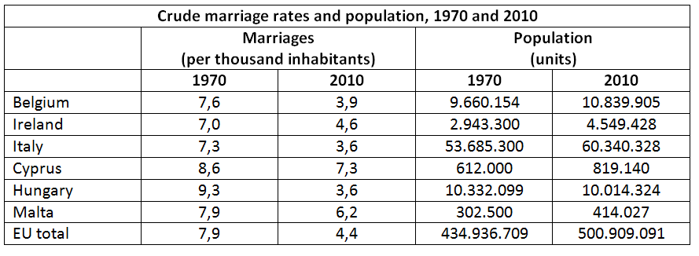

### Opciones disponibles

- **A.** 36%
- **B.** 46%
- **C.** 42%
- **D.** 53%
- **E.** 56%

---

### Respuesta y explicacion

La respuesta correcta es la **A**: 36%

Step 1 – Work out the number of marriages in 1970.

434.936.709/1000 x 7,9 = 3.436.000

Step 2 – Work out the number of marriages in 2010.

500.909.091/1000 x 4,4 = 2.204.000

Step 3 – Calculate the difference between the number of marriages in 1970 and 2010.

3.436.000 – 2.204.000 = 1.232.000

Step 4 – Work out the % decline in marriages over the period 1970 to 2010.

1.232.000/3.436.000 x 100 = 35,9%

## Pregunta 124

Fuente: https://www.epsoprep.com/practice/attempt/en/UXVlc3Rpb25Qb29sQXR0ZW1wdDpfUHRuempKOFNVb3ZjQWplMHIwTnVn/review?q=1

### Enunciado

Jaime walks from Bampton to Corbry and then from Corbry to Gorman. What distance in miles does he walk in total?

### Imagen

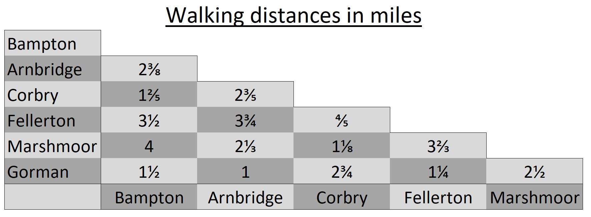

### Opciones disponibles

- **A.** 4 3/20
- **B.** 4 1/20
- **C.** 4 1/10
- **D.** 3 5/9
- **E.** 3 9/10

---

### Respuesta y explicacion

La respuesta correcta es la **A**: 4 3/20

Step 1 : Convert both mixed numbers into improper fractions: 1 2/5=7/5, 2 3/4= 11/4.

Step 2 : Multiply the denominators of the fractions to give the denominator of the answer: 4*5=20.

Step 3 : Multiply the numerators of the fractions by the opposite denominators: 7*4=28, 11*5=55.

Step 4 : Add the two numbers from

Step 3 to give the numerator of the fraction: 28+55=83.

Step 5 : Write the fraction: 83/20.

Step 6 : Rewrite the fraction as a mixed number: 83/20=4 3/20.

## Pregunta 125

Fuente: https://www.epsoprep.com/practice/attempt/en/UXVlc3Rpb25Qb29sQXR0ZW1wdDpfUHRuempKOFNVb3ZjQWplMHIwTnVn/review?q=2

### Enunciado

By how much must the average number of books read by 18-24 year olds increase between 2010 and 2020 in order for the target from 2000 to 2020 to be met?

### Imagen

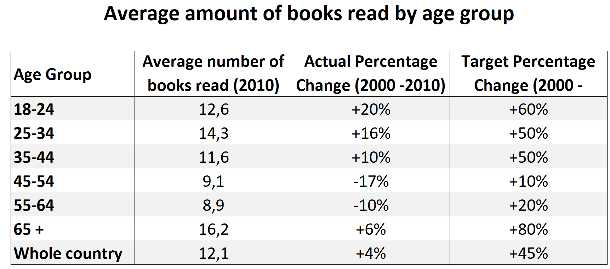

### Opciones disponibles

- **A.** 4,2
- **B.** 5,04
- **C.** 7,56
- **D.** 3,53
- **E.** 10,08

---

### Respuesta y explicacion

La respuesta correcta es la **A**: 4,2

Step 1 : Find the multiplier associated with the 20% increase in the average number of books read by 18-24 year-olds: 1+(20/100)=1.2.

Step 2 : Divide the average number of books read by this age group in 2010 by this multiplier to find the average number read in 2000: 12,6/1,2=10.5.

Step 3 : find the multiplier for the targeted 60% increase between 2000 and 2020: 1+(60/100)=1,6.

Step 4 : Multiply the average number for 2000 by this multiplier to get the target average for 2020: 1,6*10,5=16,8.

Step 5 : Subtract this number from the average number read in 2010: 16,8-12,6=4,2.

## Pregunta 126

Fuente: https://www.epsoprep.com/practice/attempt/en/UXVlc3Rpb25Qb29sQXR0ZW1wdDpfUHRuempKOFNVb3ZjQWplMHIwTnVn/review?q=3

### Enunciado

40% of the "ingredients" spending in January was used spent on meat products. What was the total spending on meat products?

### Imagen

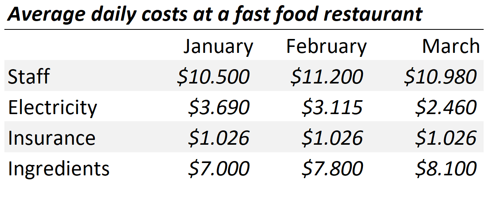

### Opciones disponibles

- **A.** $2 800
- **B.** $3 400
- **C.** $3 800
- **D.** $4 900
- **E.** $5 250

---

### Respuesta y explicacion

La respuesta correcta es la **A**: $2 800

Step 1 : Divide the ingredient costs for January by 10 to find 10%: 7.000/10=700.

Step 2 : multiply the 10% figure by 4 to find 40%: 700*4=280. These calculations can be done with a calculator, but you may be able to do them quicker mentally.

## Pregunta 127

Fuente: https://www.epsoprep.com/practice/attempt/en/UXVlc3Rpb25Qb29sQXR0ZW1wdDpfUHRuempKOFNVb3ZjQWplMHIwTnVn/review?q=4

### Enunciado

What fraction of the total seats at the Broadwell Theatre are located in the balcony or stalls sections?

### Imagen

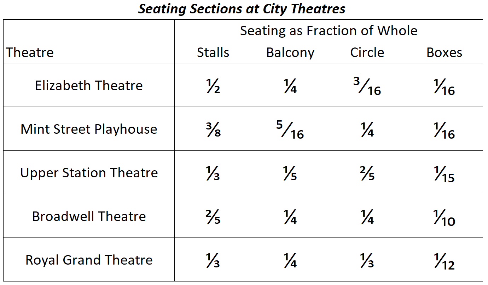

### Opciones disponibles

- **A.** 13/20
- **B.** 1/3
- **C.** 3/20
- **D.** 7/10
- **E.** 9/20

---

### Respuesta y explicacion

La respuesta correcta es la **A**: 13/20

Step 1 : Identify the two fractions to be added as 2/5 and 1/4.

Step 2 : Multiply the denominators of the fractions to give the denominator of the answer: 5*4=20.

Step 3 : multiply the numerators of the fractions by the opposite denominators: 2*4=8, 1*5=5.

Step 4 : Add the two numbers from

Step 3 to give the numerator of the fraction: 8+5=13.

Step 5 : Write the fraction: 13/20.

## Pregunta 128

Fuente: https://www.epsoprep.com/practice/attempt/en/UXVlc3Rpb25Qb29sQXR0ZW1wdDpfUHRuempKOFNVb3ZjQWplMHIwTnVn/review?q=5

### Enunciado

Assuming sample A continued to grow by the same factor, which of the following is the best estimate of the number of days required for the weight of sample A to double?

### Imagen

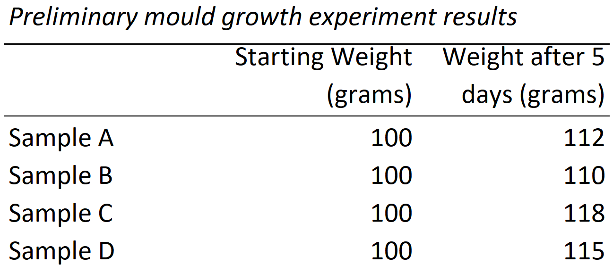

### Opciones disponibles

- **A.** 30
- **B.** 35
- **C.** 40
- **D.** 25
- **E.** 20

---

### Respuesta y explicacion

La respuesta correcta es la **A**: 30

We can estimate this value using the rule of 72.

Step 1 : Find the rate of increase and compounding period for the weight of sample A: The rate of increase is (112-100)=12% and its compounding period is 5 days.

Step 2 : Divide 72 by the rate of increase to find an estimate of the number of compounding periods needed to double the amount: 72/12=6.

Step 3 : Multiply this answer by the length of the compounding period in days: 6*5=30.

## Pregunta 129

Fuente: https://www.epsoprep.com/practice/attempt/en/UXVlc3Rpb25Qb29sQXR0ZW1wdDpfUHRuempKOFNVb3ZjQWplMHIwTnVn/review?q=6

### Enunciado

Marcus has a bank account with a balance of €1.341. What is the total amount in euros left in Marcus's account after he buys a ticket from Paris to Los Angeles including all taxes and fees?

### Imagen

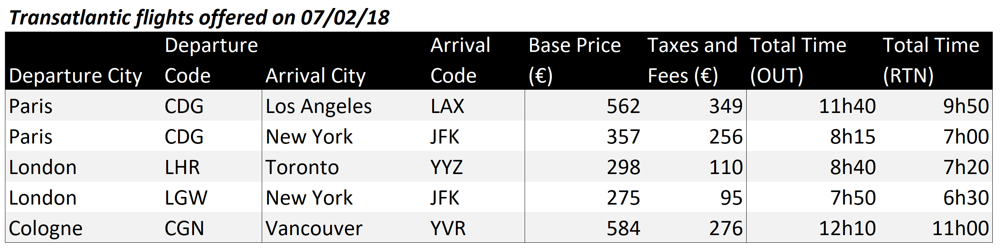

### Opciones disponibles

- **A.** 430
- **B.** 420
- **C.** 442
- **D.** 426
- **E.** 450

---

### Respuesta y explicacion

La respuesta correcta es la **A**: 430

Step 1 : Identify the base price (562) and taxes and fees price (349) in euros of the Paris to Los Angeles Flight.

Step 2 : Add these two prices: 562+349=911.

Step 3 : subtract this value from the total account balance in euros: 1341-911=430. Some calculations can be done faster mentally than on a calculator. For example 562+349 can be calculated by splitting up the numbers 562 and 349 to (500+60+2) and (300+40+9). Then500+300=800, 800+60+40=900 and then 900+9+2=911.

## Pregunta 130

Fuente: https://www.epsoprep.com/practice/attempt/en/UXVlc3Rpb25Qb29sQXR0ZW1wdDpfUHRuempKOFNVb3ZjQWplMHIwTnVn/review?q=7

### Enunciado

What fraction of the instruments sold are guitars or bass guitars?

### Imagen

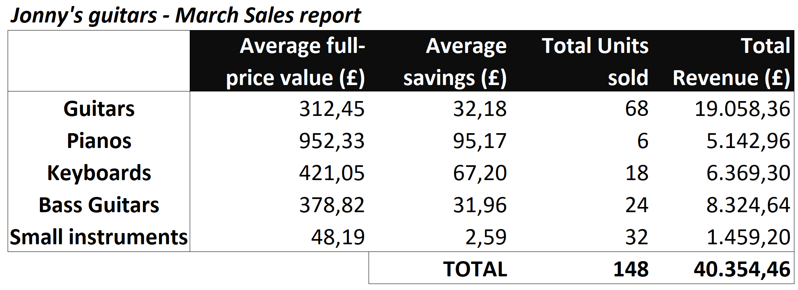

### Opciones disponibles

- **A.** 23/37
- **B.** 6/37
- **C.** 17/37
- **D.** 1/2
- **E.** 19/74

---

### Respuesta y explicacion

La respuesta correcta es la **A**: 23/37

Step 1 : Identify the number of guitars sold (68) and the number of bass guitars sold (24).

Step 2 : Add the numbers of guitars and bass guitars sold: 68+24=92.

Step 3 : Write this as a fraction over the total number of instruments sold: 92/148.

Step 3 : Simplify this fraction by dividing the numerator and denominator by 4: (92/4)/(148/4)=23/37. The addition in this question can be done faster mentally than on a calculator by splitting up the numbers 68 and 24 to (60+8) and (20+4). Then 60+20=80, 80+8=88 and 88+4=92.

## Pregunta 131

Fuente: https://www.epsoprep.com/practice/attempt/en/UXVlc3Rpb25Qb29sQXR0ZW1wdDpfUHRuempKOFNVb3ZjQWplMHIwTnVn/review?q=8

### Enunciado

What fraction of the total time spent on the project was spent developing sketches?

### Imagen

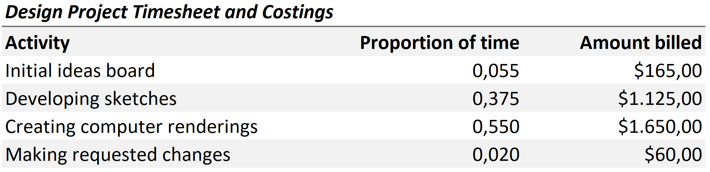

### Opciones disponibles

- **A.** 3/8
- **B.** 1/25
- **C.** 5/37
- **D.** 2/5
- **E.** 3/7

---

### Respuesta y explicacion

La respuesta correcta es la **A**: 3/8

Step 1 : Multiply the decimal representing the time spent developing sketches by 100: 0,375*100=37,5.

Step 2  : Write a fraction with this number as the numerator, and 100 as the denominator: 37,5/1.00.

Step 3 : Simplify this fraction by dividing both the numerator and denominator by 12,5: 37,5/100=3/8.

## Pregunta 132

Fuente: https://www.epsoprep.com/practice/attempt/en/UXVlc3Rpb25Qb29sQXR0ZW1wdDpfUHRuempKOFNVb3ZjQWplMHIwTnVn/review?q=9

### Enunciado

If the value of KG investment's group gold investment grows by a fixed percentage each year, what is the approximate value of this percentage?

### Imagen

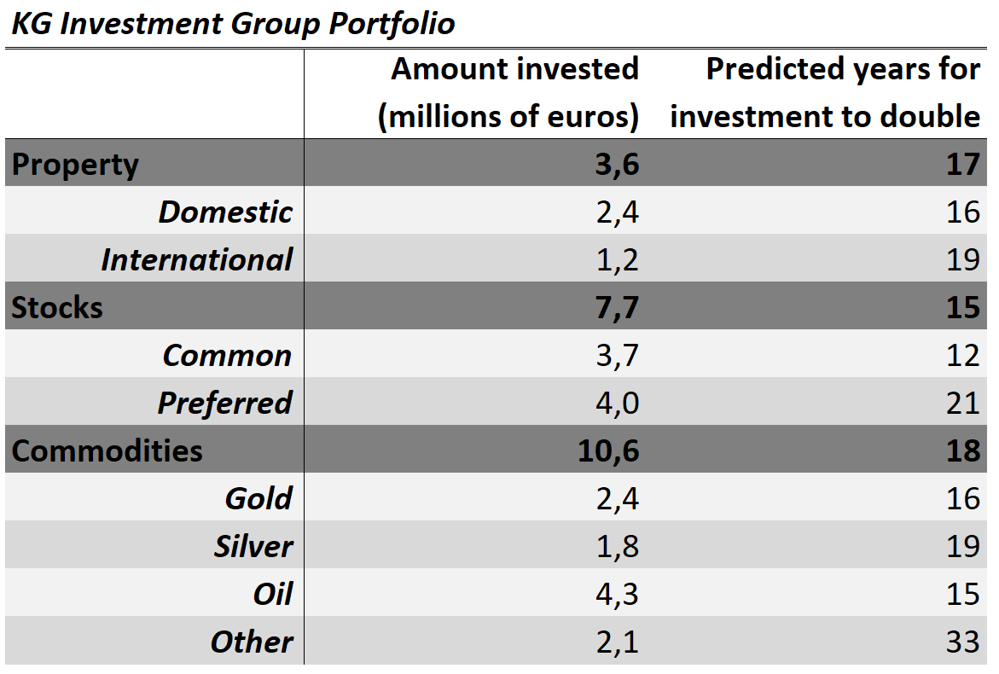

### Opciones disponibles

- **A.** 4,5
- **B.** 4,1
- **C.** 4,2
- **D.** 4,8
- **E.** 5,0

---

### Respuesta y explicacion

La respuesta correcta es la **A**: 4,5

The rule of 72 tells us that an investment which gains interest at p% anually would take approximately t=72/p years to double.

Step 1 :Rearrange the rule of 72 by multiplying both sides by p and then dividing both sides by t. p=72/t.

Step 2 : Interpret this statement: To find the percentage increase each year we can divide 72 by the number of years it takes the investment to double.

Step 3 : Complete this calculation; divide 72 by the years it will take the gold investment to double (16): 72/16=4,5.

## Pregunta 133

Fuente: https://www.epsoprep.com/practice/attempt/en/UXVlc3Rpb25Qb29sQXR0ZW1wdDpfUHRuempKOFNVb3ZjQWplMHIwTnVn/review?q=10

### Enunciado

What was the percentage point decrease in the proportion of passengers choosing to upgrade on the Barcelona route between 2012 and 2014?

### Imagen

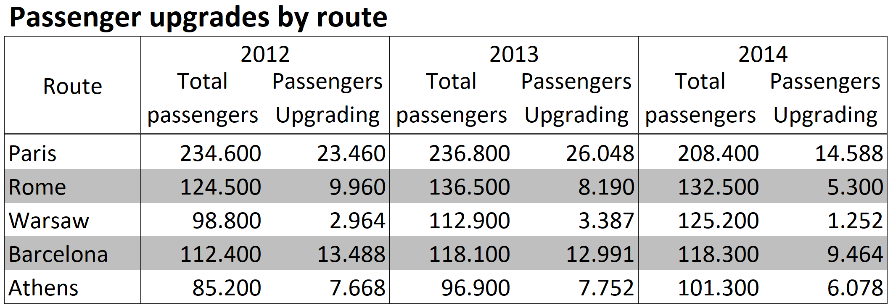

### Opciones disponibles

- **A.** 4
- **B.** 30
- **C.** 33
- **D.** 8
- **E.** 12

---

### Respuesta y explicacion

La respuesta correcta es la **A**: 4

As we are finding the "percentage point decrease" we just need the difference in the percentages between 2012 and 2014.

Step 1 : Find the percentage of passengers on the Barcelona route who upgraded in 2012: (13.488/112.400)*100=12.

Step 2 : Find the percentage of passengers on the Barcelona route who upgraded in 2014: (9.464/118.300)*100=8.

Step 3 : Subtract the 2014 percentage from the 2012 percentage: 12-8=4.

## Pregunta 134

Fuente: https://www.epsoprep.com/practice/attempt/en/UXVlc3Rpb25Qb29sQXR0ZW1wdDpfUHRuempKOFNVb3ZjQWplMHIwTnVn/review?q=11

### Enunciado

In which group is the ratio of boys to girls in the same proportion as the ratio in year 3?

### Imagen

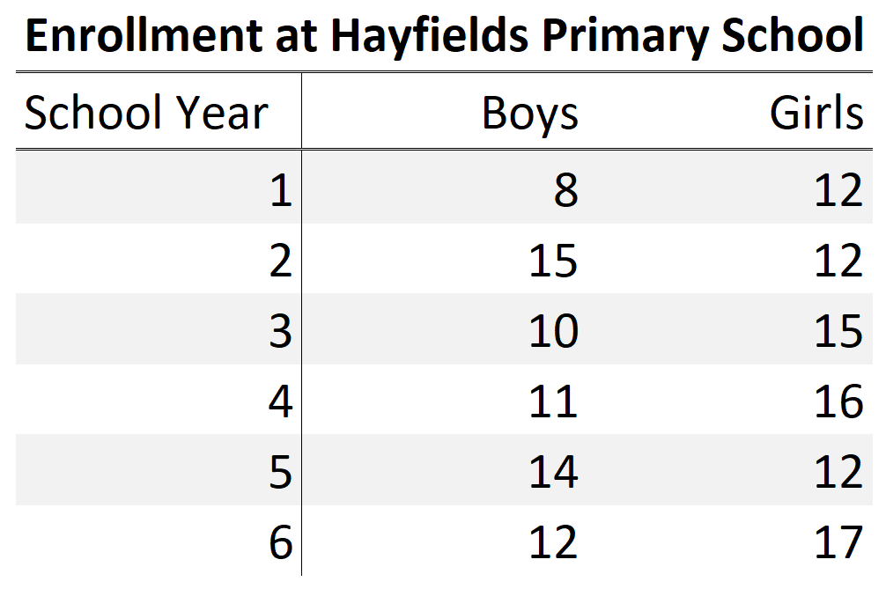

### Opciones disponibles

- **A.** Year 1
- **B.** Year 2
- **C.** Year 4
- **D.** Year 5
- **E.** Year 6

---

### Respuesta y explicacion

La respuesta correcta es la **A**: Year 1

First exclude all of the years in which there are more boys then boys than girls (years 2 and 5) as these obviously cannot be in the same ratio. Now for each remaining year in the table the following trick can be used to test if the ratios are the same. These are the steps for year 1:

Step 1 : Write the ratios in year 1 and year 3 as fractions: 8/12 and 10/15.

Step 2 : Multiply the numerator of the first fraction by the denominator of the second: 8*15= 120.

Step 3 : Multiply the denominator of the first fraction by the numerator of the second: 12*10= 120.

Step 4 : Compare the values from Steps 2 and 3: As these multiplications gave the same values, the ratios are in the same proportion.

## Pregunta 135

Fuente: https://www.epsoprep.com/practice/attempt/en/UXVlc3Rpb25Qb29sQXR0ZW1wdDpfUHRuempKOFNVb3ZjQWplMHIwTnVn/review?q=12

### Enunciado

By what percentage has the proportion of the population who are classed as obese increased by between 1990 and 2000?

### Imagen

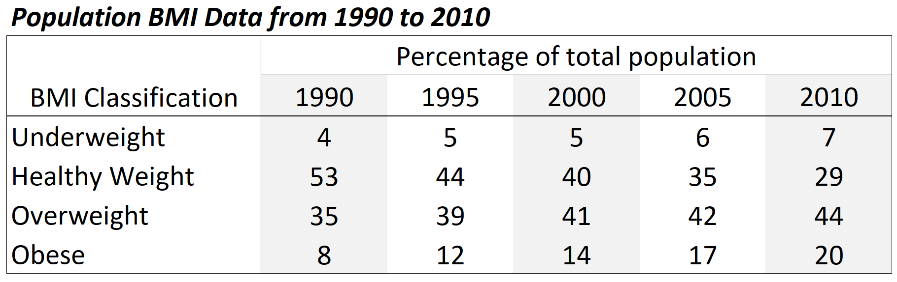

### Opciones disponibles

- **A.** 75
- **B.** 6
- **C.** 12
- **D.** 60
- **E.** 67

---

### Respuesta y explicacion

La respuesta correcta es la **A**: 75

As we are finding the percentage change we need to calculate the increase in percentage between 1990 and 2000 as a percentage of the 1990 percentage.

Step 1 : Identify the percentage of the population which was obese in 1990 (8) and 2000 (14).

Step 2 : Use the formula to find the percentage change between these numbers: ((14-8)/8)*100=(6/8)*100=75.

## Pregunta 136

Fuente: https://www.epsoprep.com/practice/attempt/en/UXVlc3Rpb25Qb29sQXR0ZW1wdDpfUHRuempKOFNVb3ZjQWplMHIwTnVn/review?q=13

### Enunciado

3/5 of the staff members in the marketing department at Technix work part time. What fraction of the total staff are part timestaff members in the marketing department?

### Imagen

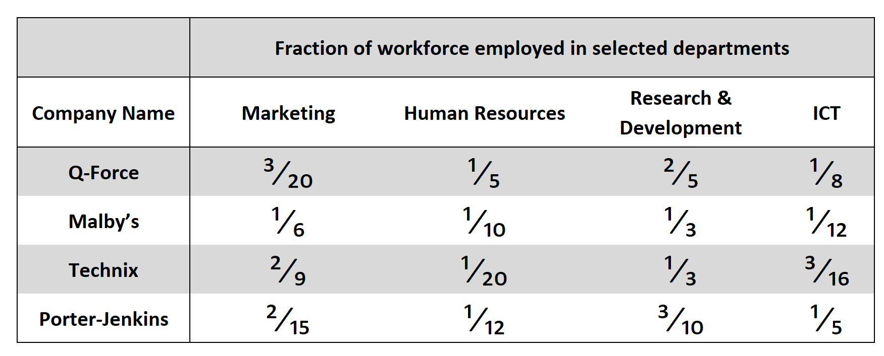

### Opciones disponibles

- **A.** 2/15
- **B.** 1/15
- **C.** 1/9
- **D.** 5/9
- **E.** 37/45

---

### Respuesta y explicacion

La respuesta correcta es la **A**: 2/15

Step 1 : Write the multiplication required: 3/5 of 2/9 = (3/5)*(2/9).

Step 2 : Multiply the numerators to find the numerator of the answer: 3*2=6.

Step 3 : Multiply the denominators to find the denominator of the answer: 5*9=45.

Step 4 : Write the answer as a fraction: 6/45.

Step 5 : simplify this fraction by dividing the numerator and denominator by any common factors: 6/45=(6/3)/(45/3)=2/15.

## Pregunta 137

Fuente: https://www.epsoprep.com/practice/attempt/en/UXVlc3Rpb25Qb29sQXR0ZW1wdDpfUHRuempKOFNVb3ZjQWplMHIwTnVn/review?q=14

### Enunciado

In May, approximately 2/3 of the income from taxes was from a property tax. What fraction of the total income was from the property tax?

### Imagen

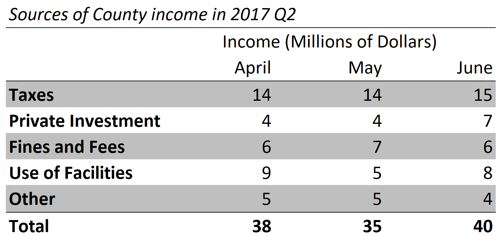

### Opciones disponibles

- **A.** 4/15
- **B.** 8/19
- **C.** 15/16
- **D.** 3/5
- **E.** 2/5

---

### Respuesta y explicacion

La respuesta correcta es la **A**: 4/15

Step 1 : Find and simplify the fraction of income which was from taxes: 14/35=2/5.

Step 2 : Write the multiplication required: 2/3 of 2/5 = (2/3)*(2/5).

Step 3 : Multiply the numerators to find the numerator of the answer: 2*2=4.

Step 4 : Multiply the denominators to find the denominator of the answer: 5*3=15.

Step 5 : Write the answer as a fraction: 4/15.

## Pregunta 138

Fuente: https://www.epsoprep.com/practice/attempt/en/UXVlc3Rpb25Qb29sQXR0ZW1wdDpfUHRuempKOFNVb3ZjQWplMHIwTnVn/review?q=15

### Enunciado

What amount in euros did the council spend on education in 2016?

### Imagen

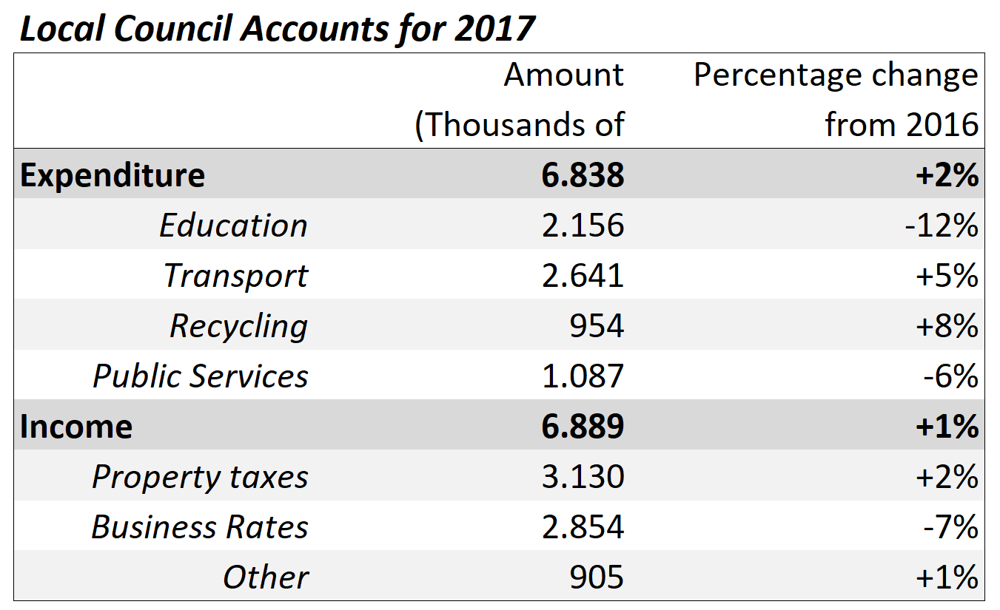

### Opciones disponibles

- **A.** 2.450
- **B.** 2.415
- **C.** 2.168
- **D.** 1.897
- **E.** 2.515

---

### Respuesta y explicacion

La respuesta correcta es la **A**: 2.450

Step 1 : Find the multiplier associated with a 12% decrease: 1-(12/100)=0,88.

Step 2 : Divide the amount spent on education in 2017 by this multiplier: 2.156/0,88=2.450.

## Pregunta 139

Fuente: https://www.epsoprep.com/practice/attempt/en/UXVlc3Rpb25Qb29sQXR0ZW1wdDpfUHRuempKOFNVb3ZjQWplMHIwTnVn/review?q=16

### Enunciado

The government has a target to increase the total area of protected land (both nationally and locally protected) by 50% between 2009 and 2029. What area of land, in square kilometers, will need to be protected in 2029 to meet this target?

### Imagen

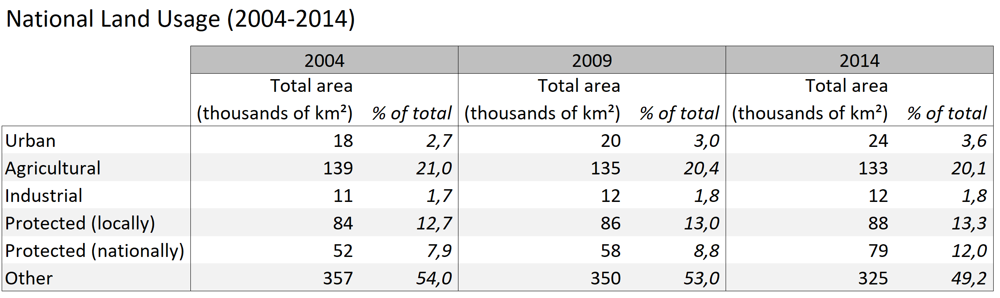

### Opciones disponibles

- **A.** 216.000
- **B.** 218.000
- **C.** 212.000
- **D.** 208.000
- **E.** 210.000

---

### Respuesta y explicacion

La respuesta correcta es la **A**: 216.000

Step 1 : Identify the number of thousand square kilometers of locally protected land (86) and nationally protected land (58) in 2009.

Step 2 : Add these two numbers: 58+86=144.

Step 3 : Increase this number by 50% by finding half of the number and adding this on: 144+(144/2)=144+72=216.

Step 4 : Multiply this number by 1 000: 216*1 000=216 000. Some calculations in this problem can be done faster mentally than on a calculator. For example we can calculate 86+58 by splitting up the numbers 86 and 58 to (80+6) and (50+8). Then 80+50=130, 130+6=136 and 136+8=144.

## Pregunta 140

Fuente: https://www.epsoprep.com/practice/attempt/en/UXVlc3Rpb25Qb29sQXR0ZW1wdDpfUHRuempKOFNVb3ZjQWplMHIwTnVn/review?q=17

### Enunciado

What is the ratio of hours of Mathematics lessons to hours of History lessons at Widecombe Academy?

### Imagen

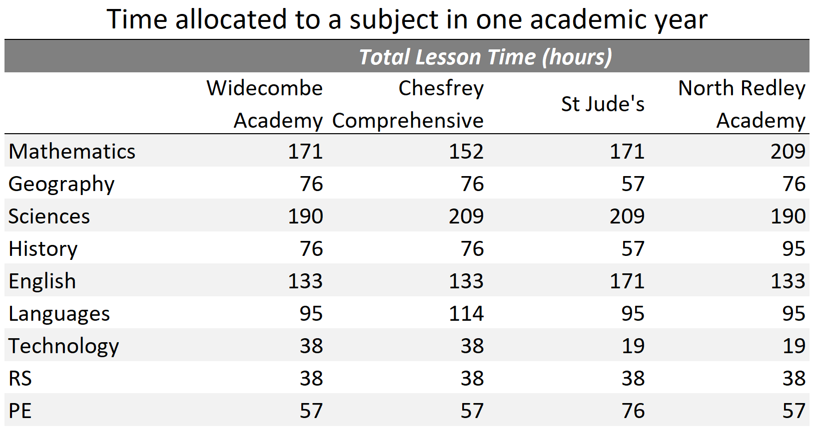

### Opciones disponibles

- **A.** 9:4
- **B.** 3:1
- **C.** 2:1
- **D.** 5:2
- **E.** 7:3

---

### Respuesta y explicacion

La respuesta correcta es la **A**: 9:4

Step 1 : Write the hours of mathematics lessons to the hours of history lessons at Widecombe High as a ratio: 171:76.

Step 2 : Find the factors of the numbers on each side of the ratio: 171 has factors 1, 3, 9, 19, 57, 171 while 76 has factors 1, 2, 4, 19, 38, 76.

Step 3 : Reduce the ratio to its simplest form by dividing both sides by the highest common factor of 171 and 76 (19): (171/19):(76/19)=9:4. Remember that a factor is any number which your number can be divided by and they usually come in pairs, e.g. 4 and 6 are both factors of 24 because 4*6=24. A common factor of two numbers is a factor of both numbers.

## Pregunta 141

Fuente: https://www.epsoprep.com/practice/attempt/en/UXVlc3Rpb25Qb29sQXR0ZW1wdDpfUHRuempKOFNVb3ZjQWplMHIwTnVn/review?q=18

### Enunciado

Between 2010 and 2015 the number of full time junior lecturers in the Humanities faculty increased by 10%. How many full time Junior lecturers were there at the faculty in 2010?

### Imagen

### Opciones disponibles

- **A.** 30
- **B.** 29
- **C.** 31
- **D.** 23
- **E.** 43

---

### Respuesta y explicacion

La respuesta correcta es la **A**: 30

Step 1 : Find the multiplier associated with a 10% decrease: 1+(10/100)=1,1.

Step 2 : Divide the number of Junior Lecturers in 2015 by this multiplier:33/1,1=30.

## Pregunta 142

Fuente: https://www.epsoprep.com/practice/attempt/en/UXVlc3Rpb25Qb29sQXR0ZW1wdDpfUHRuempKOFNVb3ZjQWplMHIwTnVn/review?q=19

### Enunciado

What is the ratio of revenue generated from rentals to income generated from admissions in May?

### Imagen

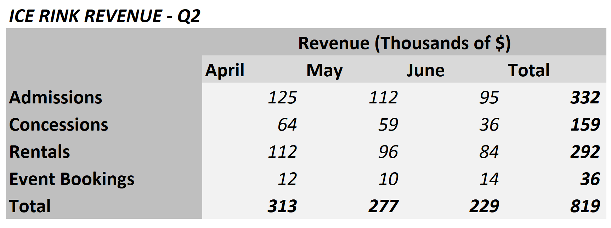

### Opciones disponibles

- **A.** 6:7
- **B.** 6:13
- **C.** 1:17
- **D.** 9:25
- **E.** 1:1

---

### Respuesta y explicacion

La respuesta correcta es la **A**: 6:7

Step 1 : Write the income from admissions to the income from concessions in may as a ratio: 96:112.

Step 2 : Find the factors of the numbers on each side of the ratio: 96 has factors 1, 2, 3, 4, 6, 8, 12, 16, 24, 32, 48, 96 while 112 has factors 1, 2, 4, 7, 8, 14, 16, 28, 56, 112.

Step 3 : Reduce the ratio to its simplest form by dividing both sides by the highest common factor of 96 and 112 (16): (96/16):(112/16)=6:7. Remember that a factor is any number which your number can be divided by and they usually come in pairs, e.g. 4 and 6 are both factors of 24 because 4*6=24. A common factor of two numbers is a factor of both numbers.

## Pregunta 143

Fuente: https://www.epsoprep.com/practice/attempt/en/UXVlc3Rpb25Qb29sQXR0ZW1wdDpfUHRuempKOFNVb3ZjQWplMHIwTnVn/review?q=20

### Enunciado

After driving his shift, Zbigniew must rest for 3 hours to ensure that he meets regulations. How many hours will Hans have to rest so that his ratio of driving to rest is the same as Zbigniew's?

### Imagen

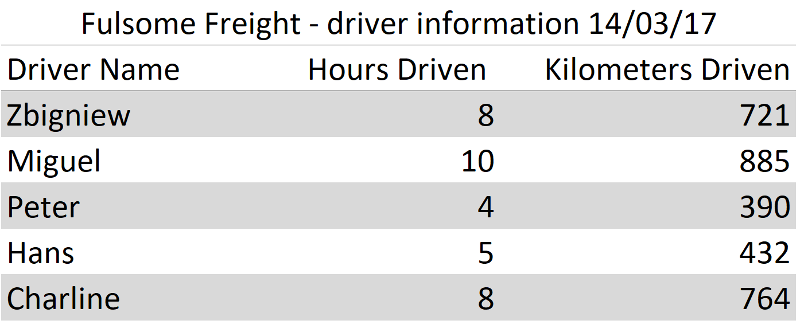

### Opciones disponibles

- **A.** 1 7/8
- **B.** 4 4/5
- **C.** 1
- **D.** 1 2/3
- **E.** 1 5/8

---

### Respuesta y explicacion

La respuesta correcta es la **A**: 1 7/8

Step 1 : Let the number of hours Hans must rest be x, and then write Zbigniew's and Hans's ratios of driving to rest: Zbigniew - 8:3, Hans - 5:x.

Step 2 : Write each of these ratios as a fraction and set them equal to one another: 8/3=5/x.

Step 3 : multiply both sides of the ratio by x, cancelling the x in the denominator of the right hand side: (8/3)*x=5.

Step 4 : multiply both sides of the equation by 3/8, cancelling the factor of 8/3 on the left hand side: x=5*(3/8).

Step 5 : Calculate the value of the multiplication on the right-hand side as a fraction: x=5*(3/8)=15/8.

Step 6 : Convert this to a mixed number: x=15/8=1 7/8.

## Pregunta 144

Fuente: https://www.epsoprep.com/practice/attempt/en/UXVlc3Rpb25Qb29sQXR0ZW1wdDpfUHRuempKOFNVb3ZjQWplMHIwTnVn/review?q=21

### Enunciado

What is the mean average amount in pounds invested in the 3 transport projects?

### Imagen

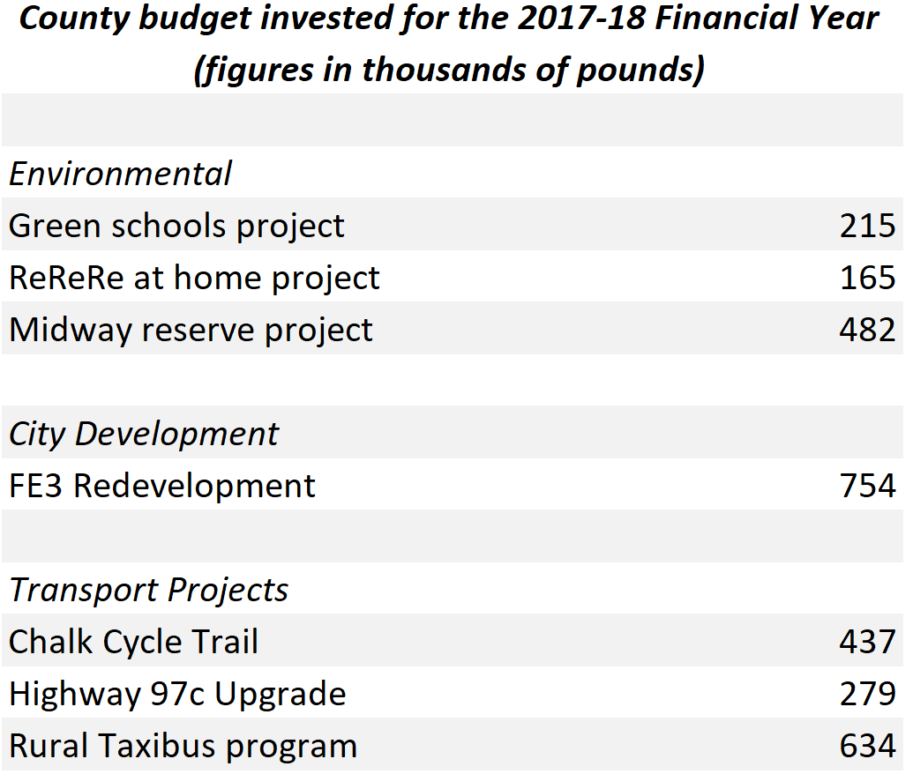

### Opciones disponibles

- **A.** 450.000
- **B.** 451.000
- **C.** 449.000
- **D.** 452.000
- **E.** 453.000

---

### Respuesta y explicacion

La respuesta correcta es la **A**: 450.000

Step 1 : Identify the amounts spent in thousands of pounds on the three transport projects: 437, 279 and 634.

Step 2 : Add these three numbers: 437+279+634=1.350.

Step 3 : Divide this total by 3: 1.350/3=450.

Step 3 : Multiply this total by 1.000: 450*1.000=450.000. The addition can be done faster mentally than on a calculator by splitting up the numbers 437, 279 and 634 to (400+30+7), (200+70+9) and (600+30+4). Then 400+600+200=1.200, 1.200+70+30=1.300, 1.300+30=1.330 and 1.320+7+4+9=1.350.

## Pregunta 145

Fuente: https://www.epsoprep.com/practice/attempt/en/UXVlc3Rpb25Qb29sQXR0ZW1wdDpfUHRuempKOFNVb3ZjQWplMHIwTnVn/review?q=22

### Enunciado

What is the ratio of the hours Angus worked shelf stocking to the hours he worked on the deli counter?

### Imagen

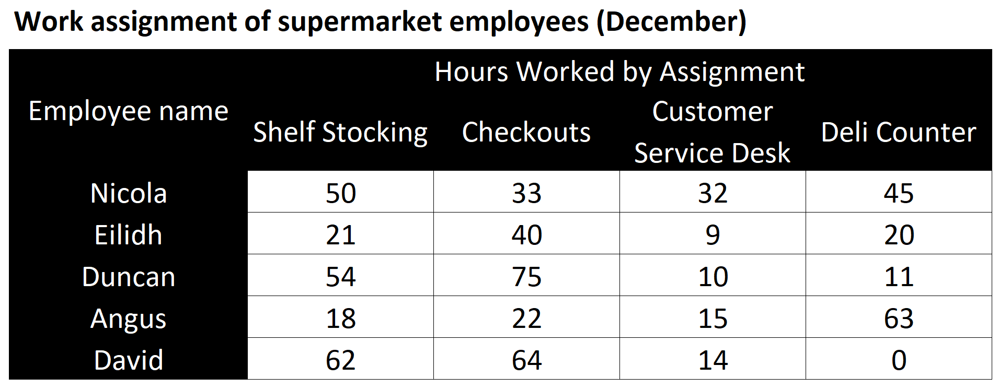

### Opciones disponibles

- **A.** 2:7
- **B.** 3:10
- **C.** 6:9
- **D.** 3:8
- **E.** 3:7

---

### Respuesta y explicacion

La respuesta correcta es la **A**: 2:7

Step 1 : Write the number of hours Angus worked shelf stocking to the number of hourse he worked on the deli counter as a ratio: 18:63.

Step 2 : Find the factors of the numbers on each side of the ratio: 18 has factors 1, 2, 3, 6, 9, 18 while 63 has factors 1, 3, 7, 9, 21, 63.

Step 3 : Reduce the ratio to its simplest form by dividing both sides by the highest common factor of 18 and 63 (9): (18/9):(63/9)=2:7. Remember that a factor is any number which your number can be divided by and they usually come in pairs, e.g. 4 and 6 are both factors of 24 because 4*6=24. A common factor of two numbers is a factor of both numbers.

## Pregunta 146

Fuente: https://www.epsoprep.com/practice/attempt/en/UXVlc3Rpb25Qb29sQXR0ZW1wdDpfUHRuempKOFNVb3ZjQWplMHIwTnVn/review?q=23

### Enunciado

What fraction of her time did Didem spend practising speaking and listening?

### Imagen

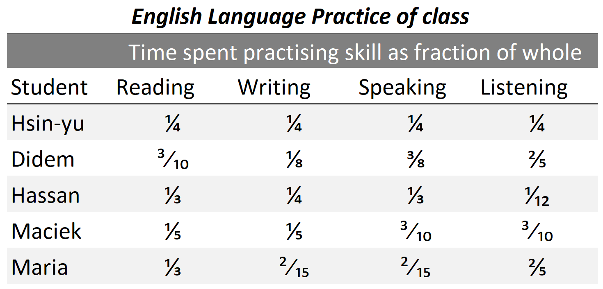

### Opciones disponibles

- **A.** 31/40
- **B.** 5/13
- **C.** 13/40
- **D.** 17/20
- **E.** 6/31

---

### Respuesta y explicacion

La respuesta correcta es la **A**: 31/40

Step 1 : Identify the two fractions to be added as 3/8 and 2/5.

Step 2 : Multiply the denominators of the fractions to give the denominator of the answer: 8*5=40.

Step 3 : multiply the numerators of the fractions by the opposite denominators: 3*5=15, 2*8=16.

Step 4 : Add the two numbers from

Step 3 to give the numerator of the fraction: 15+16=31.

Step 5 : Write the fraction: 31/40.

## Pregunta 147

Fuente: https://www.epsoprep.com/practice/attempt/en/UXVlc3Rpb25Qb29sQXR0ZW1wdDpfUHRuempKOFNVb3ZjQWplMHIwTnVn/review?q=24

### Enunciado

What is the probability, expressed as a fraction, of a random treasure chest in the game containing gold (either 10 or 20)?

### Imagen

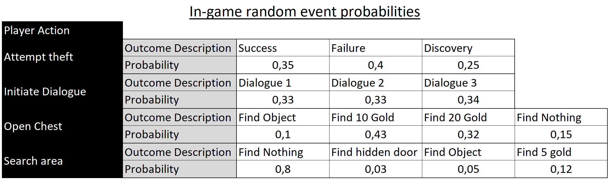

### Opciones disponibles

- **A.** 3/4
- **B.** 1/75
- **C.** 8/25
- **D.** 1/3
- **E.** 2/3

---

### Respuesta y explicacion

La respuesta correcta es la **A**: 3/4

Step 1 : Add the probabilities of finding 10 or 20 Gold: 0,43+0,32=0,75.

Step 2 : Multiply this decimal by 100: 0,75*100=75.

Step 3 : Write a fraction with this number as the numerator, and 100 as the denominator: 75/100.

Step 4 : Simplify this fraction by dividing both the numerator and denominator by 25: 75/100=3/4.

## Pregunta 148

Fuente: https://www.epsoprep.com/practice/attempt/en/UXVlc3Rpb25Qb29sQXR0ZW1wdDpfUHRuempKOFNVb3ZjQWplMHIwTnVn/review?q=25

### Enunciado

How much greater is the total floor space in square metres of the three flats at 128 Burgreen Gardens than the total floor space in square metres of the two flats at 14 Marten Close?

### Imagen

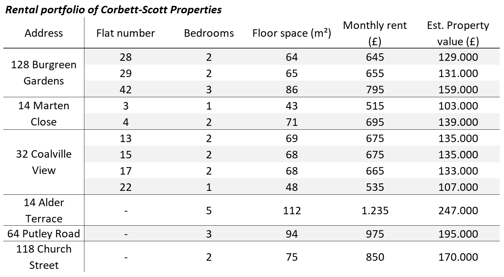

### Opciones disponibles

- **A.** 101
- **B.** 98
- **C.** 103
- **D.** 100
- **E.** 96

---

### Respuesta y explicacion

La respuesta correcta es la **A**: 101

Step 1 : Add the floor space figures for the three flats at 128 Burgreen Gardens: 64+65+86=215.

Step 2 : Add the floor space figures for the two flats at 14 Marten Close: 43+71=114.

Step 3 : subtract the total floorspace at 14 Marten Close from the total floorspace at 128 Burgreen Gardens: 215-114=101. These calculations may be done faster mentally than on a calculator. For example we can calculate 64+65+86 by splitting up the numbers 64, 65 and 86 to (60+4), (60+5) and (80+6). Then 60+60+80=200, 200+4+6=210 and 210+5=215.

## Pregunta 149

Fuente: https://www.epsoprep.com/practice/attempt/en/UXVlc3Rpb25Qb29sQXR0ZW1wdDpfUHRuempKOFNVb3ZjQWplMHIwTnVn/review?q=26

### Enunciado

Approximately how many years would it take for the population of Vernon to double assuming the predicted growth rates continue?

### Imagen

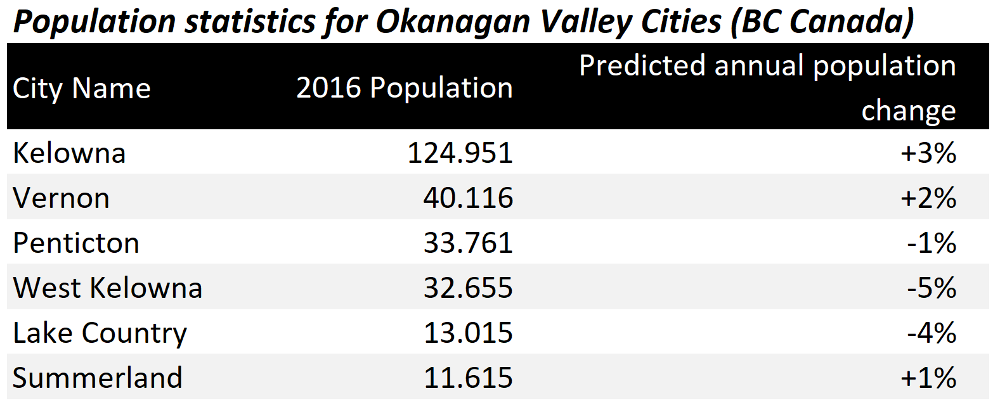

### Opciones disponibles

- **A.** 36
- **B.** 50
- **C.** 40
- **D.** 24
- **E.** 48

---

### Respuesta y explicacion

La respuesta correcta es la **A**: 36

We can estimate this value using the rule of 72.

Step 1 : Find the rate of increase and compounding period for the population of Vernon: The rate of increase is 2% and its compounding period is 1 year (as it is an annual increase).

Step 2 : Divide 72 by the rate of increase to find an estimate of the number of compounding periods needed to double the amount: 72/2=36.

## Pregunta 150

Fuente: https://www.epsoprep.com/practice/attempt/en/UXVlc3Rpb25Qb29sQXR0ZW1wdDpfUHRuempKOFNVb3ZjQWplMHIwTnVn/review?q=27

### Enunciado

Approximately how many years would it take a deposit of £1.000 to be doubled if placed in the Gold account?

### Imagen

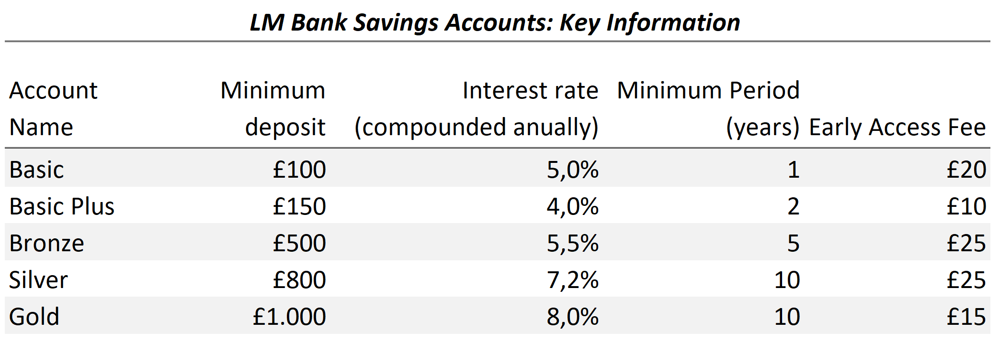

### Opciones disponibles

- **A.** 9
- **B.** 11
- **C.** 7
- **D.** 12
- **E.** 14

---

### Respuesta y explicacion

La respuesta correcta es la **A**: 9

We can estimate this value using the rule of 72.

Step 1 : Find the interest rate and compounding period for the Gold Account: The interest is 8% and its compounding period is 1 year.

Step 2 : Divide 72 by the interest rate to find an estimate of the number of compounding periods needed to double the amount: 72/8=9.

## Pregunta 151

Fuente: https://www.epsoprep.com/practice/attempt/en/UXVlc3Rpb25Qb29sQXR0ZW1wdDpfUHRuempKOFNVb3ZjQWplMHIwTnVn/review?q=28

### Enunciado

What is the total number of students enrolled in schools other than Chesham Primary and Chesham Comprehensive?

### Imagen

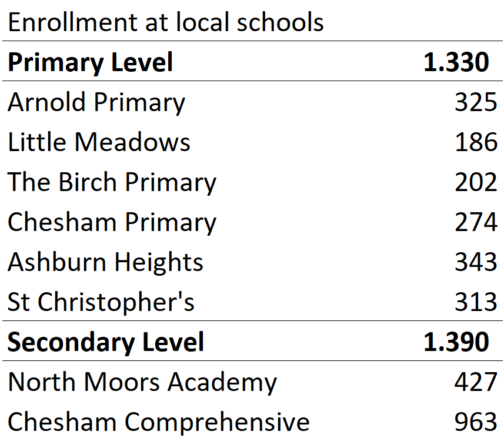

### Opciones disponibles

- **A.** 1.483
- **B.** 1.477
- **C.** 1.476
- **D.** 1.450
- **E.** 1.469

---

### Respuesta y explicacion

La respuesta correcta es la **A**: 1.483

Step 1 : Add the number of students enrolled at Chesham Primary (274) and Chesham Comprehensive (963): 274+963=1.237.

Step 2 : Find the total number of students enrolled by adding the nubers enrolled at Primary (1.330) and Secondary (1.389) level: 1.330+1.390=2.720.

Step 3 : Subtract the number of students enrolled at the two Chesham schools from the total number of students: 2.720-1.237=1.483.

This calculation can be done faster mentally than on a calculator by splitting up the numbers 274 and 963 to (200+70+4) and (900+60+3). Then 200+900=1.100, 1.100+70=1.170, 1 170+60=1.230 and 1.230+4+3=1.237.

## Pregunta 152

Fuente: https://www.epsoprep.com/practice/attempt/en/UXVlc3Rpb25Qb29sQXR0ZW1wdDpfUHRuempKOFNVb3ZjQWplMHIwTnVn/review?q=29

### Enunciado

15% of the products (excluding items in the groceries department) are to be placed on sale. Approximately how many products will be placed on sale?

### Imagen

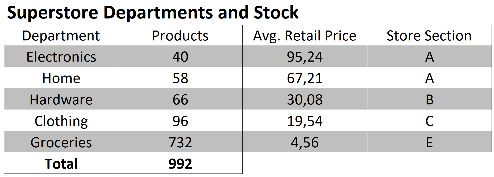

### Opciones disponibles

- **A.** 39
- **B.** 30
- **C.** 32
- **D.** 18
- **E.** 28

---

### Respuesta y explicacion

La respuesta correcta es la **A**: 39

Step 1 : Subtract the number of products in groceries from the total: 992-732=260.

Step 2 : Divide this total by 10 to find 10%: 260/10=26.

Step 3 : Divide the 10% figure by 2 to find 5%: 26/2=13.

Step 4 : add the 10% and 5% figures to find 15%: 26+13=39. The percentage calculations can be done with a calculator, but may be done a lot quicker mentally.

## Pregunta 153

Fuente: https://www.epsoprep.com/practice/attempt/en/UXVlc3Rpb25Qb29sQXR0ZW1wdDpfUHRuempKOFNVb3ZjQWplMHIwTnVn/review?q=30

### Enunciado

In 2012, 80% by weight of the potatoes and sweet potatoes grown were exported. What was the total weight of potatoes and sweet potatoes grown on the farm which were exported in 2012?

### Imagen

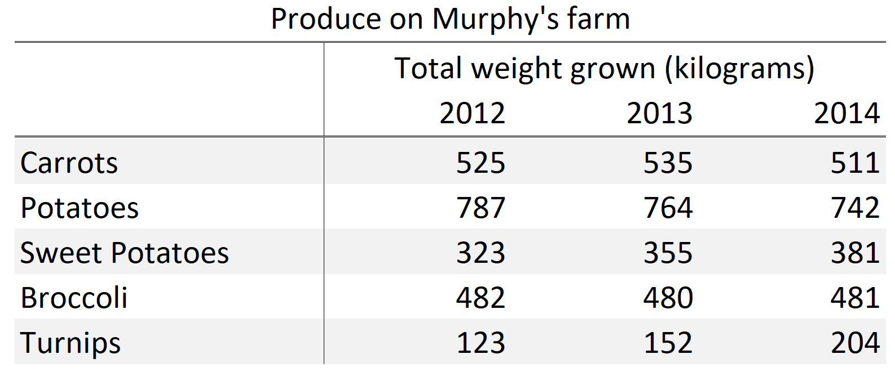

### Opciones disponibles

- **A.** 888
- **B.** 896
- **C.** 892
- **D.** 884
- **E.** 880

---

### Respuesta y explicacion

La respuesta correcta es la **A**: 888

Step 1 : Identify the weight in kilograms of potatoes (787) and sweet potatoes (323) grown in 2012.

Step 2 : Add these two weights: 787+323=1 110.

Step 3 : divide this number by 10 and then multiply by 8 to find 80%:(1.110/10)*8=111*8=888. Some calculations can be done faster mentally than on a calculator. For example we can calculate 787+323 by splitting up the numbers 787 and 323 to (700+80+7) and (300+20+3). Then 700+300=1.000, 1.000+80+20=1.100 and 1.100+3+7=1.110.

## Pregunta 154

Fuente: https://www.epsoprep.com/practice/attempt/en/UXVlc3Rpb25Qb29sQXR0ZW1wdDpfUHRuempKOFNVb3ZjQWplMHIwTnVn/review?q=31

### Enunciado

By how many minutes must Helen reduce her average time between June and December to meet the target she set from January to December?

### Imagen

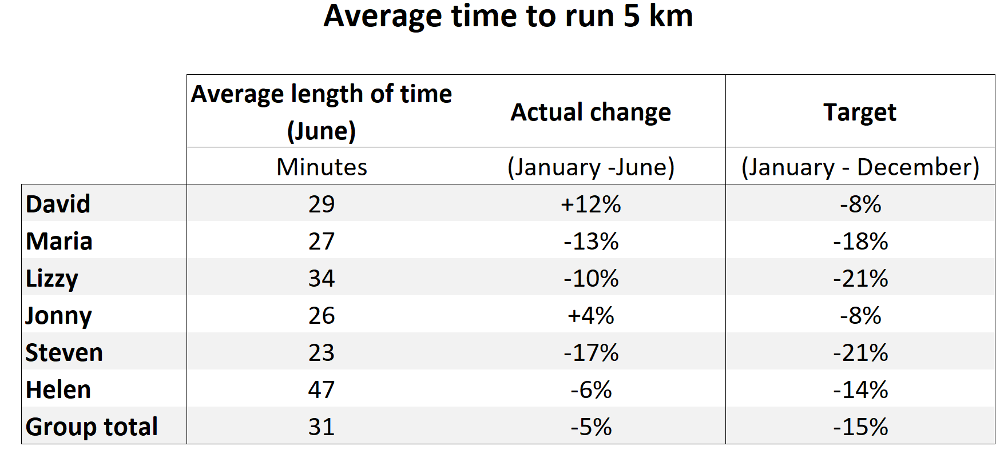

### Opciones disponibles

- **A.** 4,0
- **B.** 6,6
- **C.** 4,2
- **D.** 2,8
- **E.** 9,4

---

### Respuesta y explicacion

La respuesta correcta es la **A**: 4,0

Step 1 : Find the multiplier associated with the 6% decrease in Helen's time between January and June: 1-(6/100)=0,94.

Step 2 : Divide Helen's June time by this multiplier to find her January time: 47/0,94=50.

Step 3 : find the multiplier for her targeted 14% decrease between January and December: 1-(14/100)=0,86.

Step 4 : Multiply her January time by this multiplier to get her target time for December: 50*0,86=43. Step5: Subtract this time from her June time to find the amount she still has to decrease her time by: 47-43=4.

## Pregunta 155

Fuente: https://www.epsoprep.com/practice/attempt/en/UXVlc3Rpb25Qb29sQXR0ZW1wdDpfUHRuempKOFNVb3ZjQWplMHIwTnVn/review?q=32

### Enunciado

In 2015, 3/4 of the hardware spending was on new equipment. What fraction of the total spending was on new equipment?

### Imagen

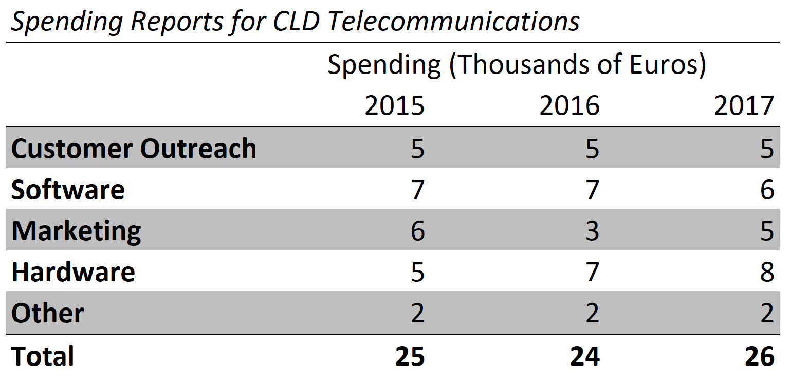

### Opciones disponibles

- **A.** 3/20
- **B.** 19/20
- **C.** 4/15
- **D.** 1/3
- **E.** 4/9

---

### Respuesta y explicacion

La respuesta correcta es la **A**: 3/20

Step 1 : Find and simplify the fraction of spending which was on hardware: 5/25=1/5.

Step 2 : Write the multiplication required: 3/4 of 1/5 = (3/4)*(1/5).

Step 3 : Multiply the numerators to find the numerator of the answer: 3*1=3.

Step 4 : Multiply the denominators to find the denominator of the answer: 5*4=20.

Step 5 : Write the answer as a fraction: 3/20.

## Pregunta 156

Fuente: https://www.epsoprep.com/practice/attempt/en/UXVlc3Rpb25Qb29sQXR0ZW1wdDpfUHRuempKOFNVb3ZjQWplMHIwTnVn/review?q=33

### Enunciado

What is the total number of cups of the liquid ingredients (milk and water) required to make 16 Yorkshire puddings?

### Imagen

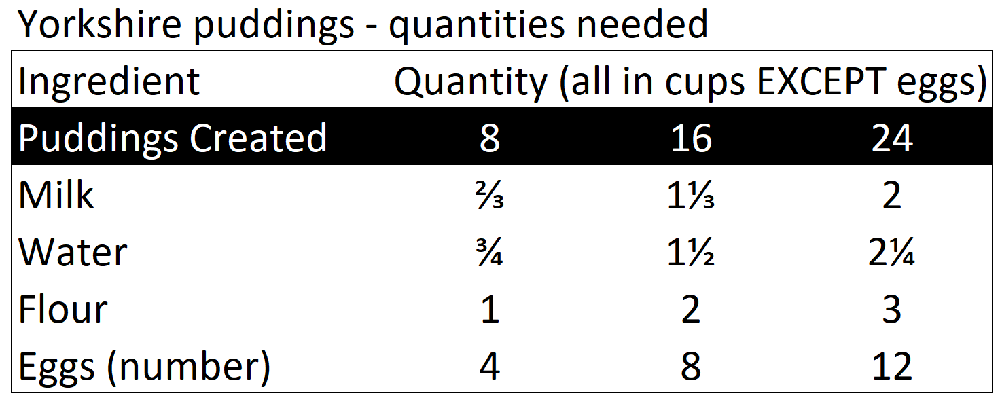

### Opciones disponibles

- **A.** 2 5/6
- **B.** 2 2/5
- **C.** 2 1/3
- **D.** 2 1/6
- **E.** 3 1/3

---

### Respuesta y explicacion

La respuesta correcta es la **A**: 2 5/6

Step 1 : Convert both mixed numbers into improper fractions: 1 1/3=4/3, 1 1/2= 3/2.

Step 2 : Multiply the denominators of the fractions to give the denominator of the answer: 3*2=6.

Step 3 : Multiply the numerators of the fractions by the opposite denominators: 4*2=8, 3*3=9.

Step 4 : Add the two numbers from

Step 3 to give the numerator of the fraction: 8+9=17.

Step 5 : Write the fraction: 17/6.

Step 6 : Rewrite the fraction as a mixed number: 17/6=2 5/6.

## Pregunta 157

Fuente: https://www.epsoprep.com/practice/attempt/en/UXVlc3Rpb25Qb29sQXR0ZW1wdDpfUHRuempKOFNVb3ZjQWplMHIwTnVn/review?q=34

### Enunciado

In which room is the ratio of the width to the length of the room in the same proportion as in the bathroom?

### Imagen

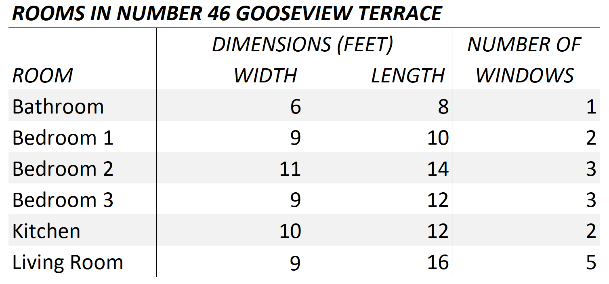

### Opciones disponibles

- **A.** Bedroom 3
- **B.** Bedroom 2
- **C.** Bedroom 1
- **D.** Kitchen
- **E.** Living Room

---

### Respuesta y explicacion

La respuesta correcta es la **A**: Bedroom 3

For each room in the table the following trick can be used to test if the ratios are the same. These are the steps for Bedroom 3:

Step 1 : Write the ratios of the width to height Bathroom and Bedroom 3 as fractions: 6/8 and 9/12.

Step 2 : Multiply the numerator of the first fraction by the denominator of the second: 6*12= 72.

Step 3 : Multiply the denominator of the first fraction by the numerator of the second: 8*9=72.

Step 4 : Compare the values from Steps 2 and 3: As these multiplications gave the same values, the ratios are in the same proportion.

## Pregunta 158

Fuente: https://www.epsoprep.com/practice/attempt/en/UXVlc3Rpb25Qb29sQXR0ZW1wdDpfUHRuempKOFNVb3ZjQWplMHIwTnVn/review?q=35

### Enunciado

What fraction of the last 7 days of snow fell between 24 hours and 3 days before the time of the snow report?

### Imagen

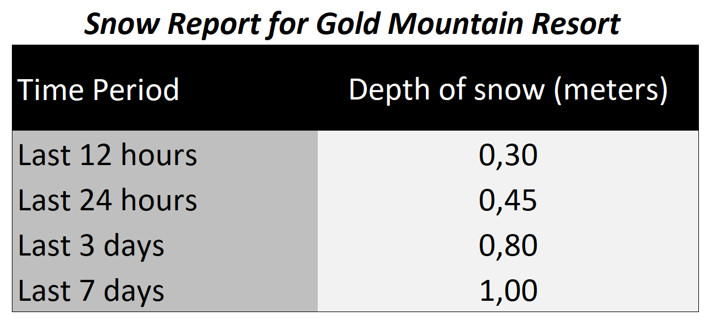

### Opciones disponibles

- **A.** 7/20
- **B.** 4/5
- **C.** 9/20
- **D.** 1/35
- **E.** 1/45

---

### Respuesta y explicacion

La respuesta correcta es la **A**: 7/20

As the total snow is 1 meter, we may find the amount of snow in meters during this fraction and convert this to a fraction.

Step 1 : Subtract the depth of snow in the last 24 hours from the depth in the last 3 days: 0,8-0,45=0,35.

Step 2 : Multiply this decimal by 100: 0,35*100=35.

Step 3 : Write a fraction with this number as the numerator, and 100 as the denominator: 35/100.

Step 4 : Simplify this fraction by dividing both the numerator and denominator by 5: 35/100=7/20.

## Pregunta 159

Fuente: https://www.epsoprep.com/practice/attempt/en/UXVlc3Rpb25Qb29sQXR0ZW1wdDpfUHRuempKOFNVb3ZjQWplMHIwTnVn/review?q=36

### Enunciado

There were a total of 180 tickets available for the 14:20 tour departure. How many of these tickets were NOT sold?

### Imagen

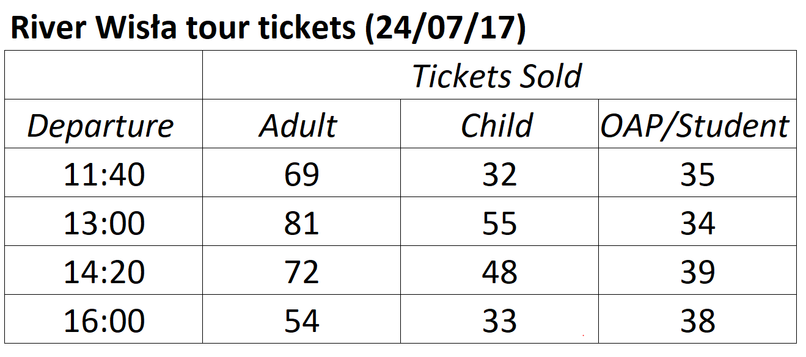

### Opciones disponibles

- **A.** 21
- **B.** 11
- **C.** 18
- **D.** 23
- **E.** 25

---

### Respuesta y explicacion

La respuesta correcta es la **A**: 21

Step 1 : Identify the number of adult (72), child (48) and OAP/student (39) tickets sold for the 14:20 departure.

Step 2 : Add these three numbers: 72+48+39=159. Some of these calculations can be done faster mentally than on a calculator. For example 72+48+39 can be calculated by splitting up the numbers 72, 48 and 39 to (70+2), (40+8) and (30+9). Then 70+30=100, 100+40=140, 140+2+8=150 and 150+9=159.

## Pregunta 160

Fuente: https://www.epsoprep.com/practice/attempt/en/UXVlc3Rpb25Qb29sQXR0ZW1wdDpfUHRuempKOFNVb3ZjQWplMHIwTnVn/review?q=37

### Enunciado

What is the ratio of the total number of trains travelling north to the total number of trains travelling south in one day from Queensford station?

### Imagen

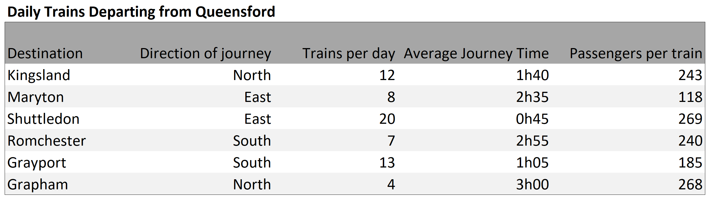

### Opciones disponibles

- **A.** 4:5
- **B.** 5:4
- **C.** 12:7
- **D.** 3:5
- **E.** 1:5

---

### Respuesta y explicacion

La respuesta correcta es la **A**: 4:5

Step 1 : Add the number of trains per day for each of the journeys which have a direction of north: 12+4=16.

Step 2 : Add the number of trains per day for each of the journeys which have a direction of south: 13+7=20.

Step 3 : Find the factors of the numbers on each side of the ratio: 16 has factors 1, 2, 4, 8, 16 while 20 has factors 1, 2, 4, 5, 10, 20.

Step 4 : Reduce the ratio to its simplest form by dividing both sides by the highest common factor of 16 and 20 (4): (16/4:20/4)=4:5. Remember that a factor is any number which your number can be divided by and they usually come in pairs, e.g. 4 and 6 are both factors of 24 because 4*6=24. A common factor of two numbers is a factor of both numbers.

## Pregunta 161

Fuente: https://www.epsoprep.com/practice/attempt/en/UXVlc3Rpb25Qb29sQXR0ZW1wdDpfUHRuempKOFNVb3ZjQWplMHIwTnVn/review?q=38

### Enunciado

Excluding the invertebrates, what is the mean average number of species present in each family of animals?

### Imagen

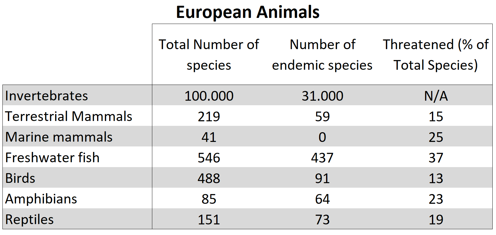

### Opciones disponibles

- **A.** 255
- **B.** 219
- **C.** 16.922
- **D.** 14.504
- **E.** 306

---

### Respuesta y explicacion

La respuesta correcta es la **A**: 255

Step 1 : Sum the numbers of species in each group excluding the invertebrates:219+41+546+488+85+151=.

Step 2 : divide this answer by the number of different animal families: 1.530/6=255.

## Pregunta 162

Fuente: https://www.epsoprep.com/practice/attempt/en/UXVlc3Rpb25Qb29sQXR0ZW1wdDpfUHRuempKOFNVb3ZjQWplMHIwTnVn/review?q=39

### Enunciado

The ratio of the weight in tonnes to the volume of the container in cubic meters for the shipments on Tuesday and Wednesday were the same. If the volume of the container on Wednesday was 22 cubic metres, what was its weight in tonnes?

### Imagen

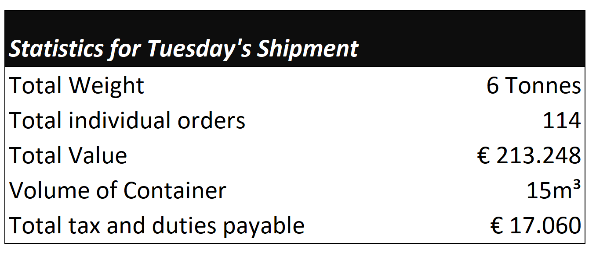

### Opciones disponibles

- **A.** 8 4/5
- **B.** 13
- **C.** 8 3/5
- **D.** 9 2/5
- **E.** 8 1/5

---

### Respuesta y explicacion

La respuesta correcta es la **A**: 8 4/5

Step 1 : Let the weight of the shipment on Wednesday be x, and then write Tuesday's and Wednesday's ratios of weight to volume: Tuesday - 6:15, Wednesday - x:22.

Step 2 : Write each of these ratios as a fraction and set them equal to one another: 6/15=x/22.

Step 3 : simplify the fraction 6/15 on the left-hand side to 2/5 by dividing the numerator and the denominator by 3: 2/5=x/22.

Step 4 : multiply both sides of the equation by 22, cancelling the factor of 22 on the right hand side: (2/5)*22=x.

Step 5 : Calculate the value of the multiplication on the left-hand side as a fraction: x=(2/5)*22=44/5.

Step 6 : Convert this to a mixed number: x=44/5=8 4/5.

## Pregunta 163

Fuente: https://www.epsoprep.com/practice/attempt/en/UXVlc3Rpb25Qb29sQXR0ZW1wdDpfUHRuempKOFNVb3ZjQWplMHIwTnVn/review?q=40

### Enunciado

What fraction of the charity's spending is not spent on admin costs?

### Imagen

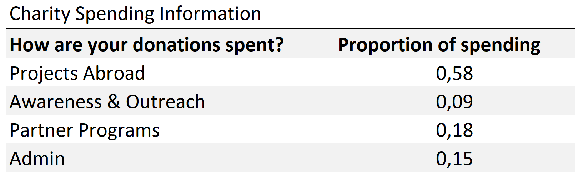

### Opciones disponibles

- **A.** 17/20
- **B.** 3/20
- **C.** 1/85
- **D.** 3/17
- **E.** 1/5

---

### Respuesta y explicacion

La respuesta correcta es la **A**: 17/20

Step 1 : Subtract the decimal representing the proportion of spending on admin from 1: 1-0,15=0,85.

Step 2 : Multiply this decimal by 100: 0,85*100=85.

Step 3 : Write a fraction with this number as the numerator, and 100 as the denominator: 85/100.

Step 4 : Simplify this fraction by dividing both the numerator and denominator by 5: 85/100=17/20.

## Pregunta 164

Fuente: https://www.epsoprep.com/practice/attempt/en/UXVlc3Rpb25Qb29sQXR0ZW1wdDozMHM2TXdTR0RVd3ZLQWplMHIwTnVn/review?q=1

### Enunciado

Given that there are 4 automatic vehicles for every manual vehicle, what is the average mileage of all vehicles on the lot?

### Imagen

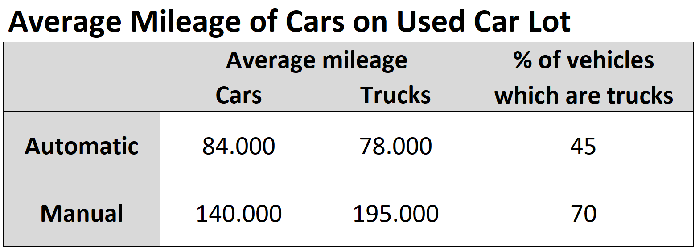

### Opciones disponibles

- **A.** 100.740
- **B.** 159.060
- **C.** 129.900
- **D.** 81.300
- **E.** 178.500

---

### Respuesta y explicacion

La respuesta correcta es la **A**: 100.740

Step 1 : Find the percentage of automatic vehicles which are cars by subtracting 45 from 100: 100-45=55.

Step 2 : Find the percentage of manual vehicles which are cars by subtracting 70 from 100: 100-70=30.

Step 3 : Find the average mileage of the automatic vehicles by multiplying the average mileage of the two types of automatic vehicles by the percentage (as a decimal) of each type and summing the results: 0,55*84.000+0,45*78.000=81.300.

Step 4 : Find the average mileage of the manual vehicles by multiplying the average mileage of the two types of manual vehicles by the percentage (as a decimal) of each type and summing the results: 0,3*140.000+0,7*195.000=178.500.

Step 5 : Work out the fractions of manual and automatic cars from the given ratio of 1:4: 1/(1+4)=1/5 are manual and 4/(1+4)=4/5 are automatic.

Step 6 : Find these fractions of the relevant average mileages of both types and add the results: (4/5)*81.300+(1/5)*178.500=100.740.

## Pregunta 165

Fuente: https://www.epsoprep.com/practice/attempt/en/UXVlc3Rpb25Qb29sQXR0ZW1wdDozMHM2TXdTR0RVd3ZLQWplMHIwTnVn/review?q=2

### Enunciado

Approximately how much greater was the revenue generated per customer at Trattoria Verde than at Spaghetteria?

### Imagen

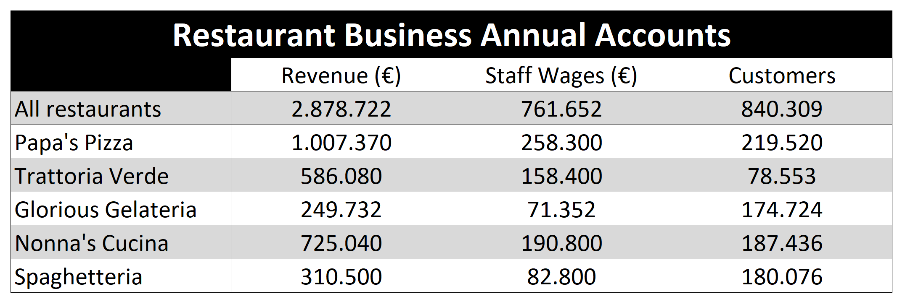

### Opciones disponibles

- **A.** 5,74 €
- **B.** 3,59 €
- **C.** 2,86 €
- **D.** 6,03 €
- **E.** 2,14 €

---

### Respuesta y explicacion

La respuesta correcta es la **A**: 5,74 €

Step 1 : Divide the total revenue of Trattoria Verde by the number of customers at Trattoria Verde: 586.080/78.553=7,4610.

Step 2 : Divide the total revenue of Spaghetteria by the number of customers at Spaghetteria:310.500/180.076=1,7243 .

Step 3 : Subtract the revenue per customer figure for Spaghetteria from the same figure for Trattoria Verde: 7,4610-1,7243=5,7367.

Step 4 : Round this to €5,74.

## Pregunta 166

Fuente: https://www.epsoprep.com/practice/attempt/en/UXVlc3Rpb25Qb29sQXR0ZW1wdDozMHM2TXdTR0RVd3ZLQWplMHIwTnVn/review?q=3

### Enunciado

Which free-range farm has the most square meters of open-air range per hen?

### Imagen

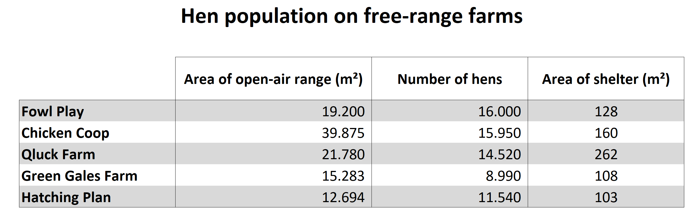

### Opciones disponibles

- **A.** Chicken Coop
- **B.** Fowl Play
- **C.** Qluck Farm
- **D.** Green Gales Farm
- **E.** Hatching Plan

---

### Respuesta y explicacion

La respuesta correcta es la **A**: Chicken Coop

Step 1 : For each farm, divide the number of square meters of open-air range by the total number of hens on that farm: Fowl Play: 19.200/16.000=1,2, Chicken Coop:39.875/15.950=2,5, Qluck Farm: 21.780/14.520=1,5, Green Galse Farm: 15.283/8.990=1,7, Hatching Plan: 12.694/11.540=1,1.

Step 2 : Compare these values to see which is the highest: the value for Chicken Coop is highest at 2.5.

## Pregunta 167

Fuente: https://www.epsoprep.com/practice/attempt/en/UXVlc3Rpb25Qb29sQXR0ZW1wdDozMHM2TXdTR0RVd3ZLQWplMHIwTnVn/review?q=4

### Enunciado

The metro system of the City of Toulouse carried a total of 122 million passengers in 2015. How many more passengers did the Toulouse metro carry than the Marseille metro?

### Imagen

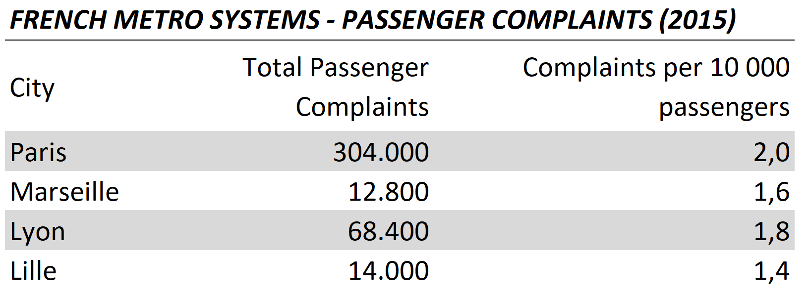

### Opciones disponibles

- **A.** 42.000.000
- **B.** 12.480.000
- **C.** 3.000.000
- **D.** 22.000.000
- **E.** 114.000.000

---

### Respuesta y explicacion

La respuesta correcta es la **A**: 42.000.000

Step 1 : Divide the total number of passenger complaints by the number who complained per 10 000 passengers in Marseille: 12.800/1,6=8.000.

Step 2 : Multiply this number by 10.000 to find the total number of passengers for the Marseille metro: 8.000*10.000=80.000.000.

Step 3 : Subtract this number from the 122 million Toulouse metro passengers: 122.000.000-80.000.000=42.000.000.

## Pregunta 168

Fuente: https://www.epsoprep.com/practice/attempt/en/UXVlc3Rpb25Qb29sQXR0ZW1wdDozMHM2TXdTR0RVd3ZLQWplMHIwTnVn/review?q=5

### Enunciado

Approximately how much greater was the average number of books borrowed per visitor at Fulbourn Library than at Central Library?

### Imagen

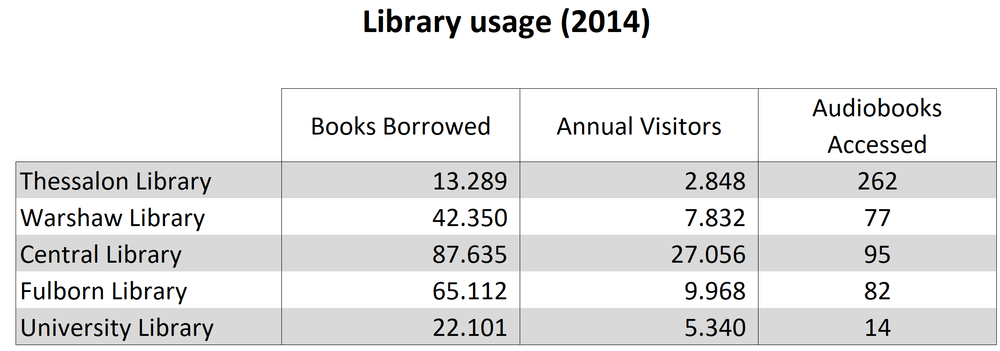

### Opciones disponibles

- **A.** 3,29
- **B.** 4,67
- **C.** 2,17
- **D.** 2,39
- **E.** 0,74

---

### Respuesta y explicacion

La respuesta correcta es la **A**: 3,29

Step 1 : Divide the total number of books borrowed at Central Library by the total number of visitors: 87.635/27.056=3,2390.

Step 2 : Divide the total number of books borrowed at Fulbourn Library by the total number of visitors: 65.112/9.968=6,5321.

Step 3 : Subtract the smaller number from the larger: 6.5321-3,2390=3,2931.

Step 4 : Round this answer to 3,29.

## Pregunta 169

Fuente: https://www.epsoprep.com/practice/attempt/en/UXVlc3Rpb25Qb29sQXR0ZW1wdDozMHM2TXdTR0RVd3ZLQWplMHIwTnVn/review?q=6

### Enunciado

Approximately how much greater is the GDP per person of Bavaria than the GDP per person of Hesse?

### Imagen

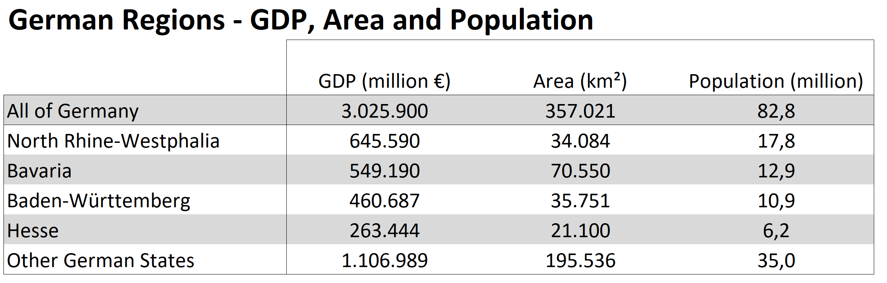

### Opciones disponibles

- **A.** 82 €
- **B.** 285 €
- **C.** 6.028 €
- **D.** 308 €
- **E.** 226 €

---

### Respuesta y explicacion

La respuesta correcta es la **A**: 82 €

Step 1 : Divide the GDP of Bavaria (in millions of €) by the population of Bavaria (in millions) to find the GDP per person: 549.190/12,9=42.572,87.

Step 2 : Divide the GDP of Hesse (in millions of €) by the population of Hesse (in millions) to find the GDP per person: 263.444/6,2=42.490,97.

Step 3 : Subtract the GDP per peson of Hesse from the GDP per person of Bavaria: 42.572,87-42.490,97=81,90.

Step 4 : Round this to €82.

## Pregunta 170

Fuente: https://www.epsoprep.com/practice/attempt/en/UXVlc3Rpb25Qb29sQXR0ZW1wdDozMHM2TXdTR0RVd3ZLQWplMHIwTnVn/review?q=7

### Enunciado

Which country has the highest number of mobile phones per person?

### Imagen

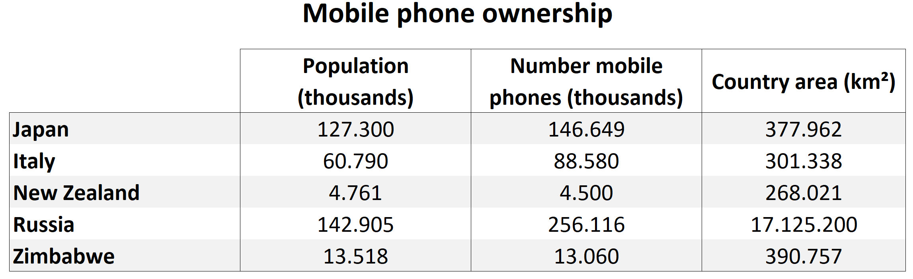

### Opciones disponibles

- **A.** Russia
- **B.** Japan
- **C.** Italy
- **D.** New Zealand
- **E.** Zimbabwe

---

### Respuesta y explicacion

La respuesta correcta es la **A**: Russia

Step 1 : For each country, divide the number of mobile phones (in thousands) by the total population (also in thousands): Japan: 146.649/127.300=1,152, Italy:88.580/60.790=1,457, New Zealand: 4.500/4.761=0,945, Russia: 256.116/142.905=1,792, Zimbabwe: 13.060/13.518=0,966.

Step 2 : Compare these values to see which is the highest: the value for Russia is highest at 1,792.

## Pregunta 171

Fuente: https://www.epsoprep.com/practice/attempt/en/UXVlc3Rpb25Qb29sQXR0ZW1wdDozMHM2TXdTR0RVd3ZLQWplMHIwTnVn/review?q=8

### Enunciado

How many more participants were there in the study looking for gene B than for gene D?

### Imagen

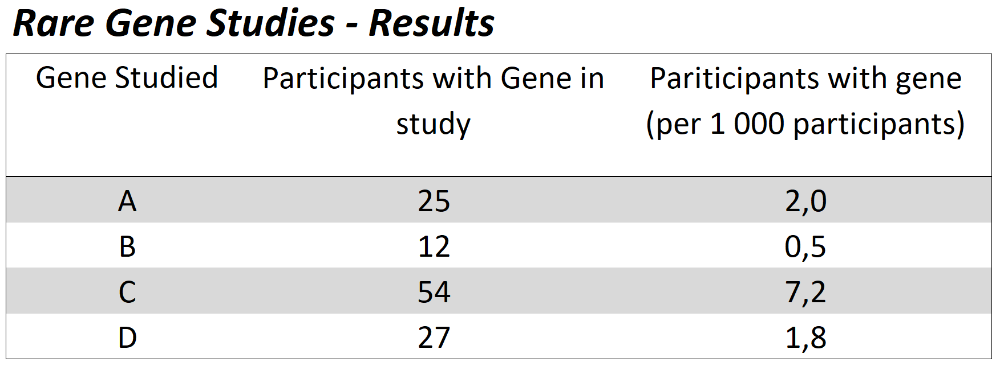

### Opciones disponibles

- **A.** 9.000
- **B.** 13.000
- **C.** 15.000
- **D.** 900
- **E.** 1.500

---

### Respuesta y explicacion

La respuesta correcta es la **A**: 9.000

Step 1 : Divide the total number of participants with gene B by the number of participants per 1.000 with this gene in the relevant study: 12/0,5=24.

Step 2 : Multiply this number by 1.000 to find the total number of participants in the study: 24*1.000=24.000.

Step 3 : Divide the total number of participants with gene D by the number of participants per 1.000 with this gene in the relevant study: 27/1,8=15.

Step 4 : Multiply this number by 1.000 to find the total number of participants in the study: 15*1.000=15.000.

Step 5 : Subtract the number of participants in the study of gene D from the number in the study of gene B: 24.000-15.000=9.000.

## Pregunta 172

Fuente: https://www.epsoprep.com/practice/attempt/en/UXVlc3Rpb25Qb29sQXR0ZW1wdDozMHM2TXdTR0RVd3ZLQWplMHIwTnVn/review?q=9

### Enunciado

Approximately how many more trees per square kilometer are there in National Park areas than in Provincial Forest areas?

### Imagen

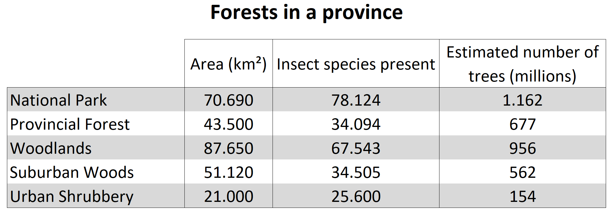

### Opciones disponibles

- **A.** 875
- **B.** 485
- **C.** 342
- **D.** 4.656
- **E.** 87

---

### Respuesta y explicacion

La respuesta correcta es la **A**: 875

Step 1 : Find the number of trees per kilometers in millions in the national park and provincial forest areas by multiplying both figures by 1.000.000:1.162* 1.000.000=1.162.000.000 and 677*1.000.000=667.000.000.

Step 2 : Divide the total number of trees in each region by the total area of that region: National park: 1.162.000.000/70.690=16.437,97, Provincial Forest: 677.000/43.500=15.563,22.

Step 3 : Subtract the smaller number from the larger: 16.437,97-15.563,22=874,75.

Step 4 : Round this answer to 875.

## Pregunta 173

Fuente: https://www.epsoprep.com/practice/attempt/en/UXVlc3Rpb25Qb29sQXR0ZW1wdDozMHM2TXdTR0RVd3ZLQWplMHIwTnVn/review?q=10

### Enunciado

All the schools except Elizabeth College and Rose Meadows are participating in an interschool competition. What is the mean average number of students at the schools taking part in the competition?

### Imagen

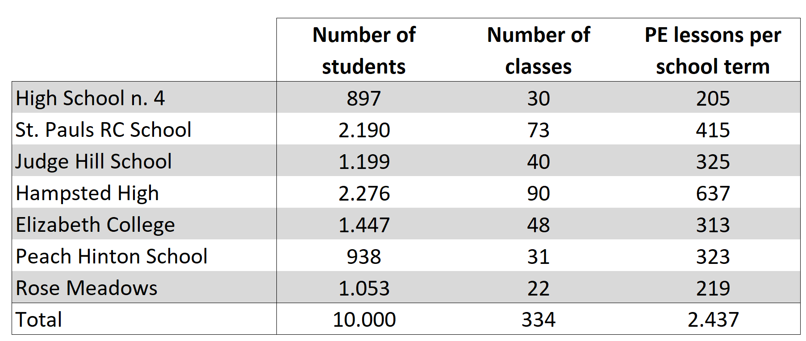

### Opciones disponibles

- **A.** 1.500
- **B.** 1.429
- **C.** 2.000
- **D.** 1.071
- **E.** 2.500

---

### Respuesta y explicacion

La respuesta correcta es la **A**: 1.500

Step 1 : Subtract the numbers of students in the schools not taking part in the competition from the total number of students: 10.000-1.447-1.053=7.500.

Step 2 : divide this answer by the number of schools in the competition: 7.500/5=1.500.

## Pregunta 174

Fuente: https://www.epsoprep.com/practice/attempt/en/UXVlc3Rpb25Qb29sQXR0ZW1wdDpaU09YaF8zd25rQXZGZ2plMHIwTnVn/review?q=1

### Enunciado

The table shows passenger numbers for the 5 most popular trains from Neuss to Dusseldorf on two days in one week. On Tuesday the 07:43 carried 15% of the passengers who took a train from Neuss to Dusseldorf that day. On Wednesday there were 4% fewer passengers who took a train from Neuss to Dusseldorf. What percentage of passengers taking a train from Neuss to Dusseldorf on Wednesday took the 07:43 and travelled first class?

### Imagen

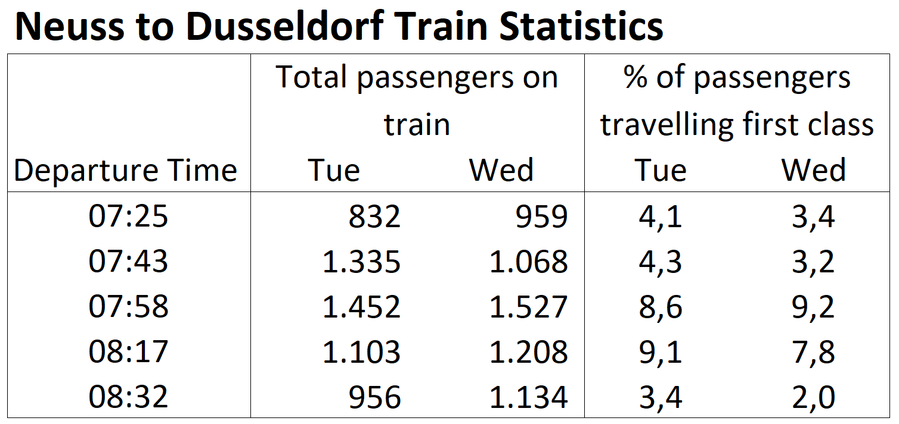

### Opciones disponibles

- **A.** 0,40%
- **B.** 3,20%
- **C.** 12,50%
- **D.** 0,65%
- **E.** 0,48%

---

### Respuesta y explicacion

La respuesta correcta es la **A**: 0,40%

Step 1 : Find 15% as a decimal: 15/100=0,15.

Step 2 : Divide the number of passengers on the Tuesday 07:43 by this decimal to find the total number of passengers on Tuesday: 1.335/0,15=8.900.

Step 3 : Find the multiplier for a 4% decrease: 1-(4/100)=0,96.

Step 4 : Multiply the total passengers on Tuesday by this figure to find the total passengers on Wednesday: 8.900*0,96=8.544.

Note that the question asks for the total number of passangers on Wednesday and not only for the 5 most popular trains which is why we need to find the total number of passangers.

Step 5 : Find the number of passengers on the 07:43 as a percentage of this figure: (1.068/8.544)*100=12,5. Find 3,2 percent of 12,5 percent by multiplying 12,5 by the decimal 0,032: 12,5*0,032=0,4.

## Pregunta 175

Fuente: https://www.epsoprep.com/practice/attempt/en/UXVlc3Rpb25Qb29sQXR0ZW1wdDpaU09YaF8zd25rQXZGZ2plMHIwTnVn/review?q=2

### Enunciado

How many tickets were sold for Saturday performances of The Lion King?

### Imagen

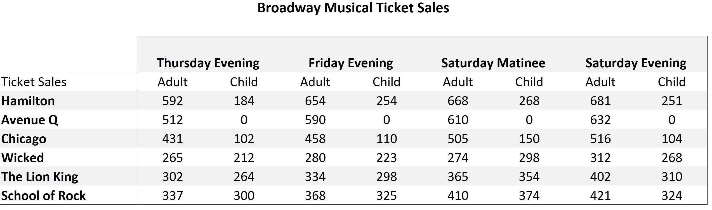

### Opciones disponibles

- **A.** 1.431
- **B.** 2.629
- **C.** 767
- **D.** 719
- **E.** 712

---

### Respuesta y explicacion

La respuesta correcta es la **A**: 1.431

Step 1 : Identify the 4 cells which correspond to tickets sold for Lin King Saturday performances (Adult matinee, Child Matinee, Adult Evening, Child Evening).

Step 2 : Add the 4 values in these cells: 365+354+402+310=1.431.

## Pregunta 176

Fuente: https://www.epsoprep.com/practice/attempt/en/UXVlc3Rpb25Qb29sQXR0ZW1wdDpaU09YaF8zd25rQXZGZ2plMHIwTnVn/review?q=3

### Enunciado

How much did Jorge's average earnings per hour increase by from 2016 to 2017?

### Imagen

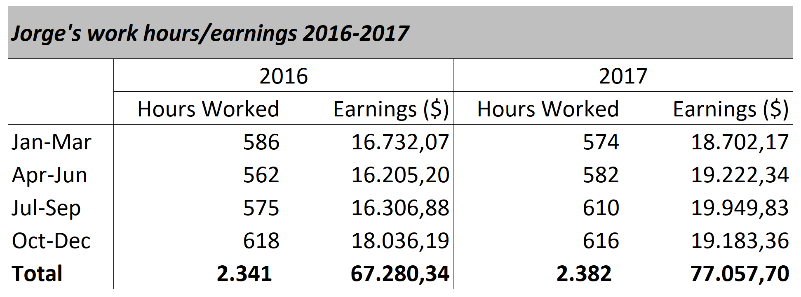

### Opciones disponibles

- **A.** $3,61
- **B.** $4,03
- **C.** $4,19
- **D.** $4,34
- **E.** $1,96

---

### Respuesta y explicacion

La respuesta correcta es la **A**: $3,61

Step 1 : Find Jorge's average earnings per hour in 2016 by dividing his total earning by the total number of hours he worked: 67.280,34/2.341=28,74.

Step 2 : Find Jorge's average earnings per hour in 2016 by dividing his total earning by the total number of hours he worked: 77.057,70/2.382=32,35.

Step 3 : Subtract the 2016 average from the 2017 average to find the differene: 32,35-28,74=3,61.

## Pregunta 177

Fuente: https://www.epsoprep.com/practice/attempt/en/UXVlc3Rpb25Qb29sQXR0ZW1wdDpaU09YaF8zd25rQXZGZ2plMHIwTnVn/review?q=4

### Enunciado

On Wednesday how much greater was the average donation collected by Brian than the average donation collected by Meghna?

### Imagen

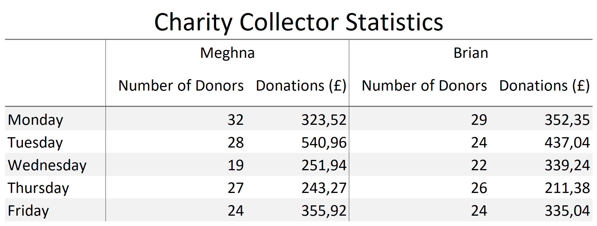

### Opciones disponibles

- **A.** 2,16 £
- **B.** 1,11 £
- **C.** 0,88 £
- **D.** 0,89 £
- **E.** 2,04 £

---

### Respuesta y explicacion

La respuesta correcta es la **A**: 2,16 £

Step 1 : Find the average donation collected by Meghna on Wednesday by dividing the total amount donated by the total number of donors: 251,94/19=13,26.

Step 1 : Find the average donation collected by Brian on Wednesday by dividing the total amount donated by the total number of donors: 339,24/22=15,42.

Step 3 : Subtract the Meghna's average from Brian's average to find the differene: 15,42-13,26=2,16

## Pregunta 178

Fuente: https://www.epsoprep.com/practice/attempt/en/UXVlc3Rpb25Qb29sQXR0ZW1wdDpaU09YaF8zd25rQXZGZ2plMHIwTnVn/review?q=5

### Enunciado

How many students were enrolled in sixth form colleges in Carford in 2017?

### Imagen

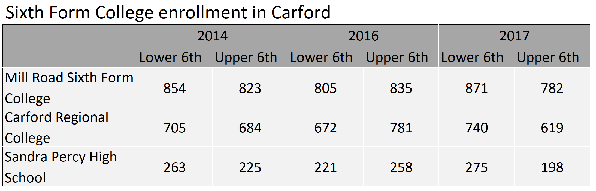

### Opciones disponibles

- **A.** 3.485
- **B.** 1.886
- **C.** 1.599
- **D.** 3.572
- **E.** 3.554

---

### Respuesta y explicacion

La respuesta correcta es la **A**: 3.485

Step 1 : Add the numbers in the "2017 Lower 6th" column: 871+740+275=1.886.

Step 2 : Add the numbers in the "2017 Upper 6th" column: 782+619+198=1.599.

Step 3 : Add the total number of students in lower and upper 6th in 2017: 1.886+1.599= 3.485.

## Pregunta 179

Fuente: https://www.epsoprep.com/practice/attempt/en/UXVlc3Rpb25Qb29sQXR0ZW1wdDpaU09YaF8zd25rQXZGZ2plMHIwTnVn/review?q=6

### Enunciado

Gigatech's wage bill in 2017 was $22.446.000. If the average employee wage at Gigatech was the same in 2016 and 2017, how many employee's were there at Gigatech in 2017?

### Imagen

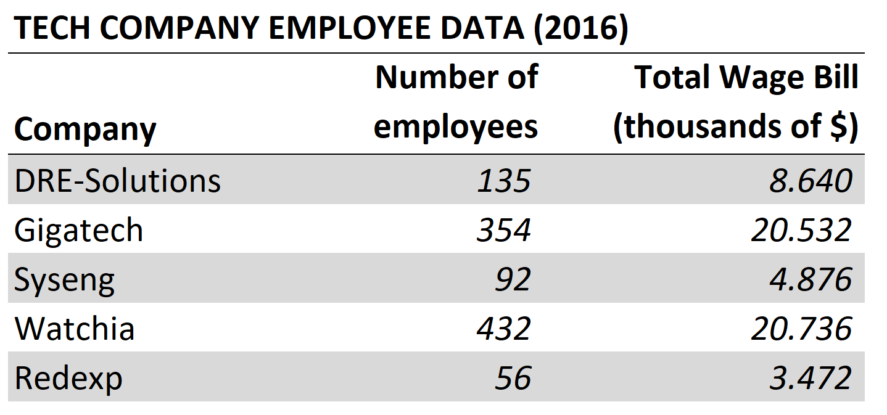

### Opciones disponibles

- **A.** 387
- **B.** 351
- **C.** 424
- **D.** 468
- **E.** 362

---

### Respuesta y explicacion

La respuesta correcta es la **A**: 387

Step 1 : Find the average employee wage (in thousands of dollars) at Gigatech in 2016 by dividing the total wage bill by the number of employees: 20.532/354=58.

Step 2 : multiply by 1.000 to get the actual average employee wage: 58*1.000=58.000.

Step 3 : Divide the total wage bill in 2017 by this average wage: 22.446.000/58.000=387

## Pregunta 180

Fuente: https://www.epsoprep.com/practice/attempt/en/UXVlc3Rpb25Qb29sQXR0ZW1wdDpaU09YaF8zd25rQXZGZ2plMHIwTnVn/review?q=7

### Enunciado

At UGS combined school, there are 3 teachers for every 2 teaching assistants employed. What is the average pay in euros of all teaching staff at UGS combined school?

### Imagen

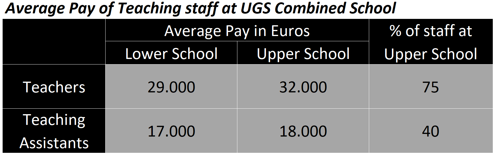

### Opciones disponibles

- **A.** 25.710
- **B.** 24.000
- **C.** 24.325
- **D.** 22.940
- **E.** 20.313

---

### Respuesta y explicacion

La respuesta correcta es la **A**: 25.710

Step 1 : Find the percentage of teachers at the lower school by subtracting 75 from 100: 100-75=25.

Step 2 : Find the percentage of teaching assistants at the lower school by subtracting 40 from 100: 100-40=60.

Step 3 : Find the average pay of the teachers by multiplying the average pay of teachers at the two schools by the percentage (as a decimal) of teachers at each and summing the results: 0,25*29.000+0,75*32.000=31.250.

Step 4 : Find the average pay of the teaching assistants by multiplying the average pay of teaching assistants at the two schools by the percentage (as a decimal) of teaching assistants at each and summing the results: 0,6*17.000+0,4*18.000=17.400.

Step 5 : Work out the fractions of teachers and teaching assistants from the given ratio of 3:2: 3/(2+3)=3/5 are teachers and 2/(2+3)=2/5 are teaching asistants.

Step 6 : Find these fracations of the relevant average pay of both groups and add the results: (3/5)*31.250+(2/5)*17.400=25.710.

## Pregunta 181

Fuente: https://www.epsoprep.com/practice/attempt/en/UXVlc3Rpb25Qb29sQXR0ZW1wdDpaU09YaF8zd25rQXZGZ2plMHIwTnVn/review?q=8

### Enunciado

What is the average height of an adult in Colombia to the nearest 0,1cm?

### Imagen

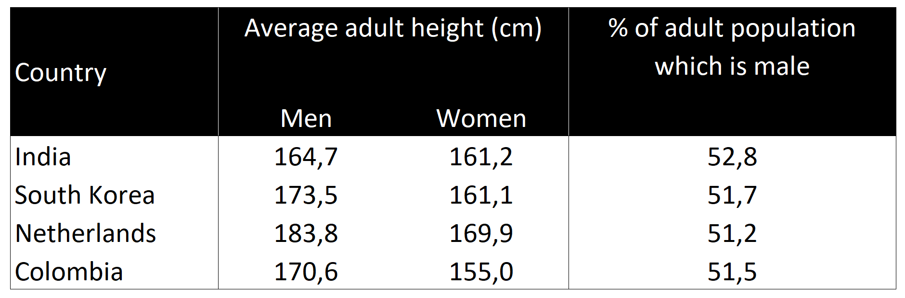

### Opciones disponibles

- **A.** 163
- **B.** 162,8
- **C.** 170,6
- **D.** 155
- **E.** 162,6

---

### Respuesta y explicacion

La respuesta correcta es la **A**: 163

Step 1 : Find the percentage of women in the country by subtracting the percentage of men from 100: 100-51,5=48,5.

Step 2 : Find 51,5% of the average men's height: 0,515*170,6=87,859.

Step 3 : Find 48,5% of the average women's height: 0,485*155=75,175.

Step 4 : Add the two results: 87,859+75,175=163,034.

Step 5 : Round this to the nearest 0,1cm: 163.

## Pregunta 182

Fuente: https://www.epsoprep.com/practice/attempt/en/UXVlc3Rpb25Qb29sQXR0ZW1wdDpaU09YaF8zd25rQXZGZ2plMHIwTnVn/review?q=9

### Enunciado

The table above shows the budget allotted to selected departments in a large company. A report shows that the company budget increased by 15% between 2012 and 2013, and that spending on marketing made up 20% of all spending at the company in 2012. What percentage of the total budget for 2013 was allocated for staff costs in marketing?

### Imagen

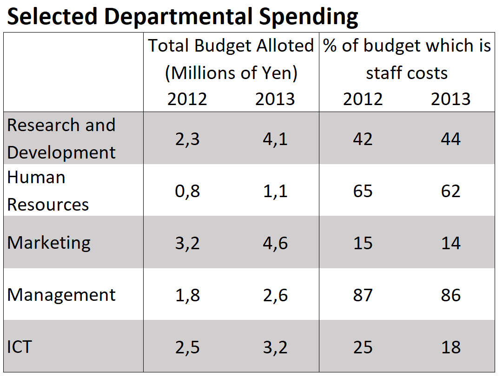

### Opciones disponibles

- **A.** 3,50%
- **B.** 3,75%
- **C.** 3%
- **D.** 3,25%
- **E.** 4%

---

### Respuesta y explicacion

La respuesta correcta es la **A**: 3,50%

Step 1 : Find 20% as a decimal: 20/100=0,2.

Step 2 : Divide the 2012 Marketing budget by this to find the total budget for 2012 (in millions of Yen): 3,2/0,2=16.

Step 3 : Find the multiplier for a 15% increase: 1+(15/100)=1,15.

Step 4 : Multiply the 2012 budget by this multiplier to find the 2013 budget: 16*1,15=18,4.

Step 5 : Find the marketing budget as a percentage of this figure: (4,6/18,4)*100=25. Find 14 percent of 25 percent by multiplying 25 by the decimal 0,14%: 25*0,14%=3,5%

## Pregunta 183

Fuente: https://www.epsoprep.com/practice/attempt/en/UXVlc3Rpb25Qb29sQXR0ZW1wdDpaU09YaF8zd25rQXZGZ2plMHIwTnVn/review?q=10

### Enunciado

Each year Mr Jones's class sits a final exam on which they choose 1 of 3 questions to answer. What was the average score by students in Mr Jones's class in 2015?

### Imagen

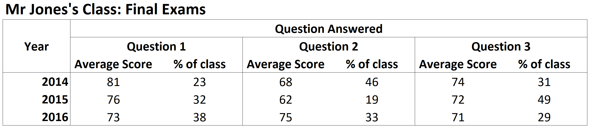

### Opciones disponibles

- **A.** 71,38
- **B.** 70
- **C.** 72,85
- **D.** 73,08
- **E.** 33,33

---

### Respuesta y explicacion

La respuesta correcta es la **A**: 71,38

Step 1 : Find 32% of the average score of those who answered question 1 in 2015: 0,32*76=24,32.

Step 2 : Find 19% of the average score of those who answered question 2 in 2015: 0,19*62=11,78.

Step 3 : Find 49% of the average score of those who answered question 3 in 2015: 0,49*72=35,28.

Step 4 : Add the three results: 24,32+11,78+35,28=71,38.

## Pregunta 184

Fuente: https://www.epsoprep.com/practice/attempt/en/UXVlc3Rpb25Qb29sQXR0ZW1wdDpZRVZtdXJFOUlVY3U4Z2plMHIwTnVn/review?q=1

### Enunciado

How many of the companies in the table were net importers in 2017 (the value of their imports exceeded the value of their exports)?

### Imagen

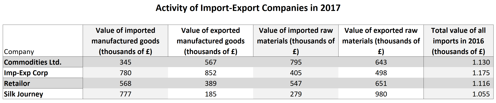

### Opciones disponibles

- **A.** 1
- **B.** 0
- **C.** 2
- **D.** 3
- **E.** 4

---

### Respuesta y explicacion

La respuesta correcta es la **A**: 1

Step 1 : Sum the exports for each company in 2017: Commodities Ltd: 567+643=1.210, Imp-Exp Corp: 852+498=1.350, Retailor: 389+651=1.040, Silk Journey: 185+980=1.165.

Step 2 : Compare the value of the exports and the imports to see for how many countries the imports value was higher than the exports value:  imports 1.040< exports 1.116, so Realtailor is a net importer.

All the other companies are net exporters, so there is just one net importer.

## Pregunta 185

Fuente: https://www.epsoprep.com/practice/attempt/en/UXVlc3Rpb25Qb29sQXR0ZW1wdDpZRVZtdXJFOUlVY3U4Z2plMHIwTnVn/review?q=2

### Enunciado

In 2011, what was the approximate ratio of the total spending at Sovereign Science to the total spending at Medic Basics?

### Imagen

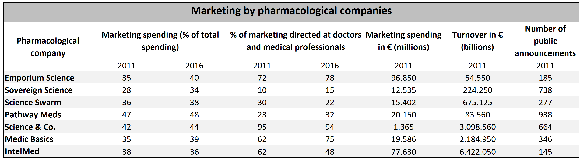

### Opciones disponibles

- **A.** 4:5
- **B.** 3:5
- **C.** 1:2
- **D.** 5:6
- **E.** 3:4

---

### Respuesta y explicacion

La respuesta correcta es la **A**: 4:5

Step 1 : Write 28% as a decimal:28/100=0,28.

Step 2 : find the total spending (in millions of euros) at Sovereign Science in 2011 by dividing the marketing spending by 0,28: 12.535/0,28=44.767,86 (to 2dp).

Step 3 : Write 35% as a decimal:35/100=0,35.

Step 4 : find the total spending (in millions of euros) at Medic Basics in 2011 by dividing the marketing spending by 0,35: 19.586/0,35=55.960.

Step 5 : Find the ratio between the two amounts as a decimal: 44.767,86/55.960=0,8 (to 2dp).

Step 6 : Write the ratio in the form 0,8:1

Step 7 : multiply both sides of the ratio by 5: 0,8:1=4:5.

## Pregunta 186

Fuente: https://www.epsoprep.com/practice/attempt/en/UXVlc3Rpb25Qb29sQXR0ZW1wdDpZRVZtdXJFOUlVY3U4Z2plMHIwTnVn/review?q=3

### Enunciado

The total number of admissions at Greenwood college increased by 176 each year between 2014 and 2016. In 2016 Greenwood had a target of 25% of their admissions being from disadvantaged backgrounds. How many more of the admissions at Greenwood would have needed to be from disadvantaged backgrounds in order for them to have met their target?

### Imagen

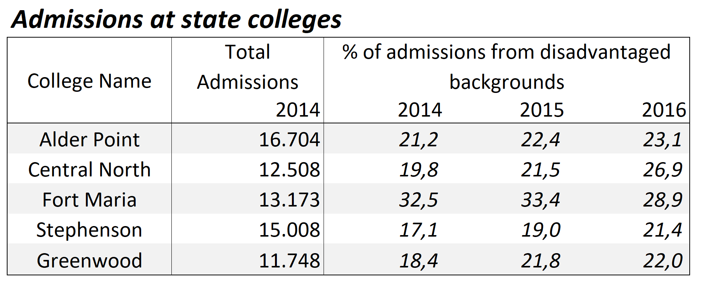

### Opciones disponibles

- **A.** 363
- **B.** 352
- **C.** 358
- **D.** 382
- **E.** 376

---

### Respuesta y explicacion

La respuesta correcta es la **A**: 363

Step 1 : Find the total number of admissions at Greenwood college in 2016 by adding twice the yearly increase to the 2014 admissions: 11.748+2*176=12.100.

Step 2 : Calculate the increase in percentage points needed to reach the target: 25-22=3.

Step 3 : find 3% of the total admissions in 2016: 0,03*12.100=363.

## Pregunta 187

Fuente: https://www.epsoprep.com/practice/attempt/en/UXVlc3Rpb25Qb29sQXR0ZW1wdDpZRVZtdXJFOUlVY3U4Z2plMHIwTnVn/review?q=4

### Enunciado

For which type of cookies is the ratio of the sales price to the total cost the highest?

### Imagen

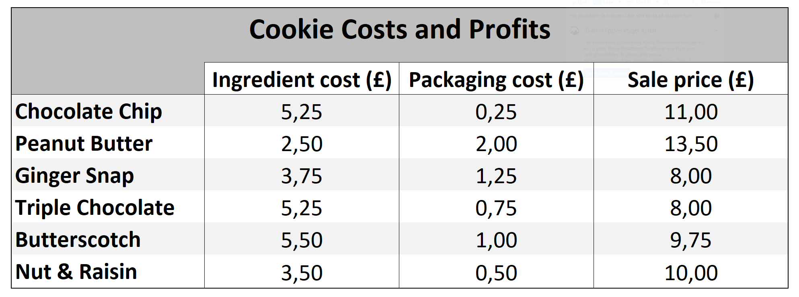

### Opciones disponibles

- **A.** Peanut Butter
- **B.** Chocolate Chip
- **C.** Ginger Snap
- **D.** Triple Chocolate
- **E.** Nut & Raisin

---

### Respuesta y explicacion

La respuesta correcta es la **A**: Peanut Butter

Step 1 : Add the ingredient costs and packaging costs to find the total cost for each type: Chocolate chip: 5,25+0,25=5,5, Peanut Butter: 2,5+2=4,5, Ginger Snap: 3,75+1,25=5, Triple Chocolate: 5,25+0,75=6, Butterscotch: 5,5+1=6,5, Nut and Raisin: 3,5+0,5=4.

Step 2 : calculate the sale price to cost ratio by dividing the sale price by the costs for each type of cookies: Chocolate chip: 11/5,5=2, Peanut Butter: 13,5/4,5=3, Ginger Snap: 8/5=1,6, Triple Chocolate: 8/6=1,333..., Butterscotch: 9,75/6,5=1,5, Nut and Raisin: 10/4=2,5.

Step 3 : Compare these values to find the cookies with the highest value (peanut butter).

## Pregunta 188

Fuente: https://www.epsoprep.com/practice/attempt/en/UXVlc3Rpb25Qb29sQXR0ZW1wdDpZRVZtdXJFOUlVY3U4Z2plMHIwTnVn/review?q=5

### Enunciado

What is the total GDP of China and Japan combined?

### Imagen

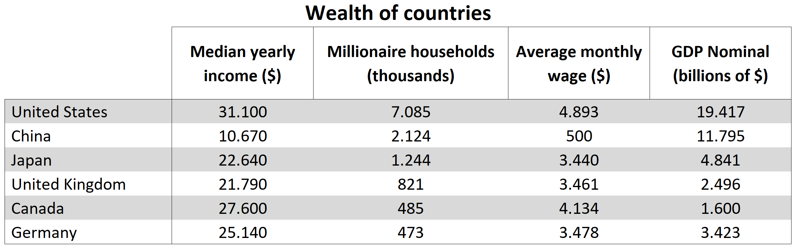

### Opciones disponibles

- **A.** $16.636.000.000.000
- **B.** $16.636.000.000
- **C.** $6.954.000.000.000
- **D.** $6.954.000.000
- **E.** $3.368.000.000.000

---

### Respuesta y explicacion

La respuesta correcta es la **A**: $16.636.000.000.000

Step 1 : Sum the values of GDP (in billions of dollars) for China and Japan from the table: 11.795+4.841=16.636.

Step 2 : multiply this number by 1 billion: 16.636*1.000.000.000=16.636.000.000.000.

## Pregunta 189

Fuente: https://www.epsoprep.com/practice/attempt/en/UXVlc3Rpb25Qb29sQXR0ZW1wdDpZRVZtdXJFOUlVY3U4Z2plMHIwTnVn/review?q=6

### Enunciado

At which school is the ratio of students to teachers the lowest?

### Imagen

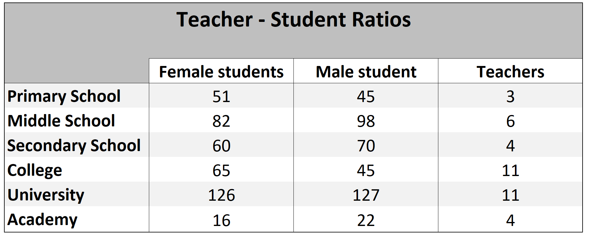

### Opciones disponibles

- **A.** Academy
- **B.** Primary School
- **C.** Secondary School
- **D.** College
- **E.** University

---

### Respuesta y explicacion

La respuesta correcta es la **A**: Academy

Step 1 : Add the number of male and female students to find the total number of students at each school: Primary School: 51+45=96, Middle School: 82+98=180, Secondary School: 60+70=130, College: 65+45= 110, University: 126+127=253, Academy: 16+22=38.

Step 2 : calculate the student to teacher ratio by dividing the number of students by the number of teachers at each school: Primary School: 96/3=32, Middle School: 180/6=30..., Secondary School: 130/4=32,5, College:110/11=10, University: 253/11=23, Academy: 38/4=9,5.

Step 3 : Compare these values to find the school with the lowest value (Academy).

## Pregunta 190

Fuente: https://www.epsoprep.com/practice/attempt/en/UXVlc3Rpb25Qb29sQXR0ZW1wdDpZRVZtdXJFOUlVY3U4Z2plMHIwTnVn/review?q=7

### Enunciado

The total amount of energy used by Jenysys increased by 153.000 kWh each year between 2013 and 2015. In 2015 the company had a target of 40% of their energy used being from renewable sources. How many more kWh of the energy Jenysys used would have needed to be generated from renewable sources in order for them to have met their target?

### Imagen

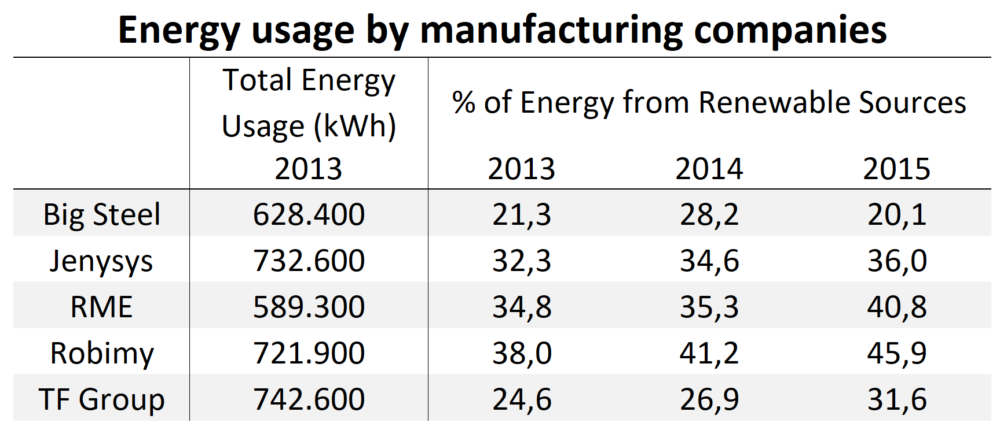

### Opciones disponibles

- **A.** 41.544
- **B.** 29.304
- **C.** 35.424
- **D.** 566.784
- **E.** 664.704

---

### Respuesta y explicacion

La respuesta correcta es la **A**: 41.544

Step 1 : Find the total amount of energy by Jenysys in by adding twice the yearly increase to the 2013 figure: 732.600+(2*153.000)=1.038.600.

Step 2 : Calculate the increase in percentage points needed to reach the target: 40%-36%=4%.

Step 3 : find 4% of the total energy used in 2016: 0,04*1.038.600=41.544.

## Pregunta 191

Fuente: https://www.epsoprep.com/practice/attempt/en/UXVlc3Rpb25Qb29sQXR0ZW1wdDpZRVZtdXJFOUlVY3U4Z2plMHIwTnVn/review?q=8

### Enunciado

In 2015, what was the ratio of the total revenue of Monies Bank to the total revenue of DSB?

### Imagen

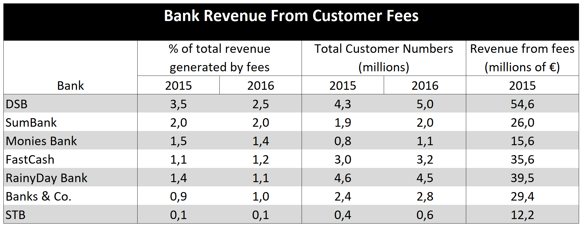

### Opciones disponibles

- **A.** 2:3
- **B.** 1:3
- **C.** 1:2
- **D.** 2:5
- **E.** 1:4

---

### Respuesta y explicacion

La respuesta correcta es la **A**: 2:3

Step 1 : Write 1,5% as a decimal:1,5/100=0,015.

Step 2 : find the total revenue (in millions of euros) at Monies Bank in 2011 by dividing the revenue from fees by 0,015: 15,6/0,015=1.040.

Step 3 : Write 3,5% as a decimal:3,5/100=0,035.

Step 4 : find the total revenue (in millions of euros) at DSB in 2011 by dividing the revenue from fees by 0,035: 54,6/0,035=1.560.

Step 5 : write the two revenues as a ratio: 1.040:1.560.

Step 7 : Simplify the ratio by dividing both sides of the ratio by 520: (1.040/520):(1.560/520)=2:3

## Pregunta 192

Fuente: https://www.epsoprep.com/practice/attempt/en/UXVlc3Rpb25Qb29sQXR0ZW1wdDpZRVZtdXJFOUlVY3U4Z2plMHIwTnVn/review?q=9

### Enunciado

What is the combined number of students at Dance Stage, Twinkle Danz and Ballet Gravity?

### Imagen

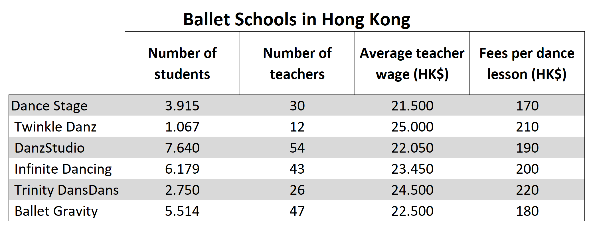

### Opciones disponibles

- **A.** 10.496
- **B.** 9.429
- **C.** 4.982
- **D.** 6.581
- **E.** 12.622

---

### Respuesta y explicacion

La respuesta correcta es la **A**: 10.496

Step 1 : Sum the numbers of students from the relevant rows in the table: 3.915+ 1.067+5.514=10.496.

## Pregunta 193

Fuente: https://www.epsoprep.com/practice/attempt/en/UXVlc3Rpb25Qb29sQXR0ZW1wdDpZRVZtdXJFOUlVY3U4Z2plMHIwTnVn/review?q=10

### Enunciado

According to the table, how many megatonnes of the world's plastic waste was not recycled?

### Imagen

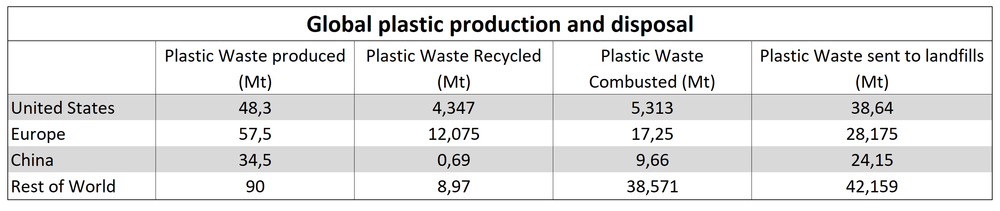

### Opciones disponibles

- **A.** 204,218
- **B.** 133,124
- **C.** 159,206
- **D.** 96,876
- **E.** 70,794

---

### Respuesta y explicacion

La respuesta correcta es la **A**: 204,218

Step 1 : Sum the total amount of plastic waste produced: 48,3+57,5+34,5+90=230,3

Step 2 : Sum the amount of plastic waste that was recycled: 4,347+12,075+0,69+8,97=26,082.

Step 3 : Subtract the amount which was recycled from the total amount: 230,3-26,082=204,218

## Pregunta 194

Fuente: https://www.epsoprep.com/practice/attempt/en/UXVlc3Rpb25Qb29sQXR0ZW1wdDoxTzM4MWpURWZVOHV0d2plMHIwTnVn/review?q=1

### Enunciado

By how many euros must Agnieszka Zielinksa increase her sales from 2016-2017 to meet the target she has been set?

### Imagen

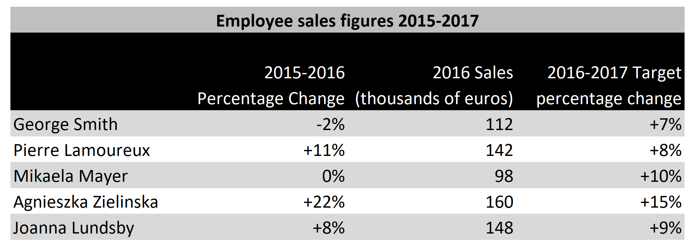

### Opciones disponibles

- **A.** 24.000
- **B.** 16.000
- **C.** 8.000
- **D.** 10.666
- **E.** 24.0000

---

### Respuesta y explicacion

La respuesta correcta es la **A**: 24.000

Step 1 : Convert 15% (Agnieszka's target) to a decimal: 15/100=0.15.

Step 2 : Multiply Agnieszka's 2016 total by this number to find 15% of this total: 0,15*160.000=24.000.

## Pregunta 195

Fuente: https://www.epsoprep.com/practice/attempt/en/UXVlc3Rpb25Qb29sQXR0ZW1wdDoxTzM4MWpURWZVOHV0d2plMHIwTnVn/review?q=2

### Enunciado

The percentage of Panjabi speakers who are first-generation immigrants is the same in British Columbia and Alberta. If there are 64.022 Panjabi speakers in British Columbia who are first-generation immigrants, how many Panjabi speakers in Alberta are first-generation immigrants?

### Imagen

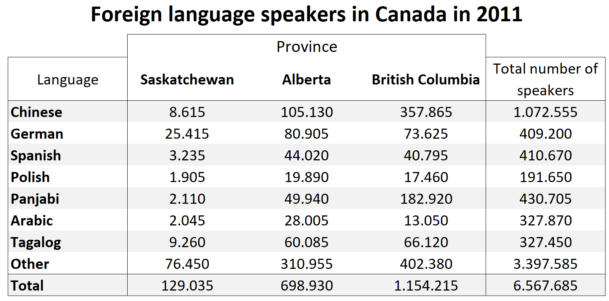

### Opciones disponibles

- **A.** 17.479
- **B.** 64.022
- **C.** 38.768
- **D.** 32.461
- **E.** 118.898

---

### Respuesta y explicacion

La respuesta correcta es la **A**: 17.479

Step 1 : Find the percentage of Panjabi speakers who are first-generation immigrants: (64.022/182.920)*100=35%.

Step 2 : Find 35% of the number of Panjabi speakers in Alberta: 0,35*49.940=17.479.

## Pregunta 196

Fuente: https://www.epsoprep.com/practice/attempt/en/UXVlc3Rpb25Qb29sQXR0ZW1wdDoxTzM4MWpURWZVOHV0d2plMHIwTnVn/review?q=3

### Enunciado

A survey is conducted of the number of books a group of people read during the year 2016. In the 45-54 age group, 165 of the participants were men and the rest were women. The men aged 45-54 read an average of 9 books in the year 2016. What was the average number of books read by women in the survey aged 45-54?

### Imagen

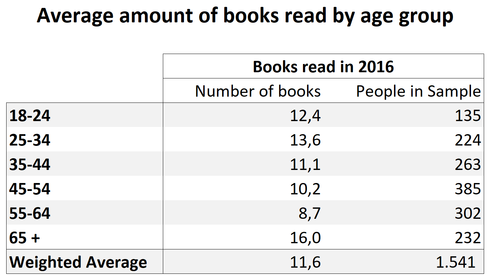

### Opciones disponibles

- **A.** 11,1
- **B.** 10,2
- **C.** 11,4
- **D.** 10,7
- **E.** 10,5

---

### Respuesta y explicacion

La respuesta correcta es la **A**: 11,1

Step 1 : Find the number of women aged 45-54: 385-165=220.

Step 2 : Calculate the total number of books read by those aged 45-54 by multiplying the average number they read by the number in the sample: 10,2*385=3.927.

Step 3 : Calculate the total number of books read by the men aged 45-54 by multiplying the average number read by them by the number of men aged 45-54: 165*9=1.485.

Step 4 : subtract this from the total number read by those aged 45-54 to give the total number of books read by the women aged 45-54: 3.927-1.485=2.442.

Step 5 : Divide the total number of books read by the women aged 45-54 by the number of women aged 45-54 to give the average: 2.442/220=11,1.

## Pregunta 197

Fuente: https://www.epsoprep.com/practice/attempt/en/UXVlc3Rpb25Qb29sQXR0ZW1wdDoxTzM4MWpURWZVOHV0d2plMHIwTnVn/review?q=4

### Enunciado

Of those who booked a rafting holiday between 2012 and 2015, 65% booked a 7-day rafting package and 35% booked a 10-day rafting package. How many individual days of rafting were booked by customers between 2012 and 2015?

### Imagen

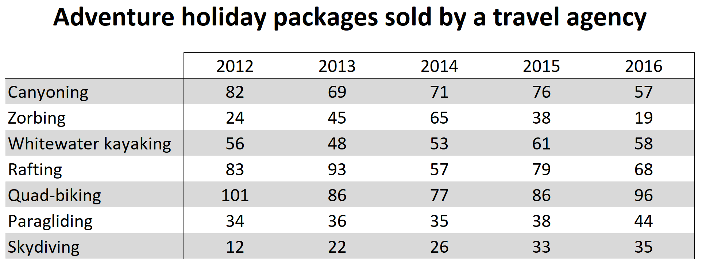

### Opciones disponibles

- **A.** 2.511,6
- **B.** 1.729
- **C.** 1.330
- **D.** 3.800
- **E.** 2.660

---

### Respuesta y explicacion

La respuesta correcta es la **A**: 2.511,6

Step 1 : Add the numbers of people who booked rafting holidays between 2012 and 2015 to find the total number: 83+93+57+79=312.

Step 2 : Find the number who booked 7-day rafting holidays by finding 65% of 312: 0,65*312=202,8.

Step 3 : Find the total number of days on the 7-day holidays by multiplying 202,8 by 7: 247*7=1.419,6

Step 4 : Find the number who booked 10-day rafting holidays by finding 35% of 312: 0,35*312=109,2.

Step 5 : Find the total number of days on the 10-day holidays by multiplying 109,2 by 10: 109,2*10= 1.092.

Step 6 : Add the number of days from the 7-day and 10-day holidays: 1.419,6 +1.092=2 511,6.

## Pregunta 198

Fuente: https://www.epsoprep.com/practice/attempt/en/UXVlc3Rpb25Qb29sQXR0ZW1wdDoxTzM4MWpURWZVOHV0d2plMHIwTnVn/review?q=5

### Enunciado

In 2014 The publisher released 10 fewer fiction books than in 2015. In 2014 the number of non-fiction books released by the publisher was 3 times higher than the number of fiction books. How many more non-fiction books were released in 2014 than in 2015.

### Imagen

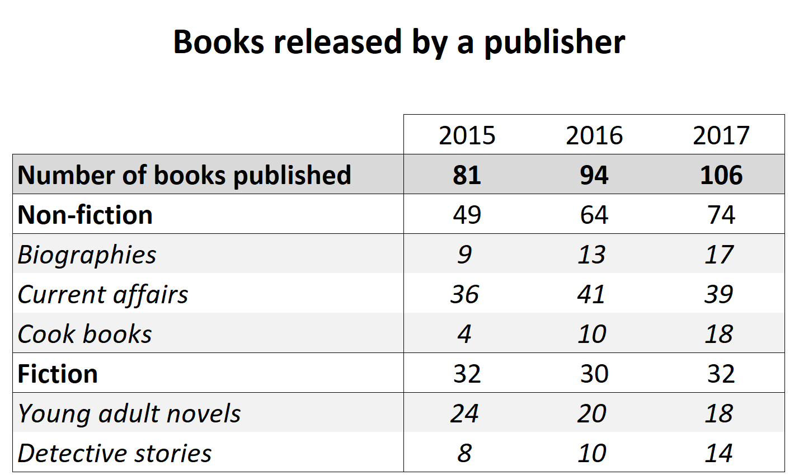

### Opciones disponibles

- **A.** 17
- **B.** 27
- **C.** 34
- **D.** 37
- **E.** 22

---

### Respuesta y explicacion

La respuesta correcta es la **A**: 17

Step 1 : Find the number of fiction books released in 2014 by subtracting 10 from the number released in 2015: 32-10=22.

Step 2 : Find the number of non-fiction books released in 2014 by multiplying the number of fiction books by 3: 22*3=66.

Step 3 : Find the difference between the number of non-fiction books released in 2014 and 2015: 66-49=17.

## Pregunta 199

Fuente: https://www.epsoprep.com/practice/attempt/en/UXVlc3Rpb25Qb29sQXR0ZW1wdDoxTzM4MWpURWZVOHV0d2plMHIwTnVn/review?q=6

### Enunciado

What was the mean average spending of business members (both associate and full) in 2016?

### Imagen

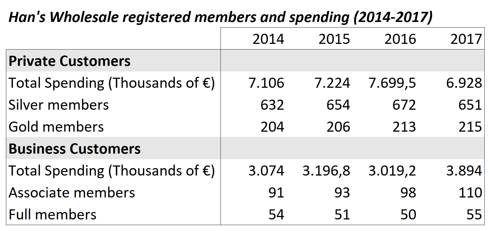

### Opciones disponibles

- **A.** 20.400 €
- **B.** 8.700 €
- **C.** 60.384 €
- **D.** 30.808 €
- **E.** 23.600 €

---

### Respuesta y explicacion

La respuesta correcta es la **A**: 20.400 €

Step 1 : Find the total number of business members in 2016: 98+50=148.

Step 2 : Find the total spent by business members in 2016: 3.019*1.000=3.019.000.

Step 3 : Divide the total spent by the total number of members: 3.019 000/148=20.400.

## Pregunta 200

Fuente: https://www.epsoprep.com/practice/attempt/en/UXVlc3Rpb25Qb29sQXR0ZW1wdDoxTzM4MWpURWZVOHV0d2plMHIwTnVn/review?q=7

### Enunciado

Between 1995 and 2015 the total number of civil servants employed at the administrative level across the 5 countries in the table decreased by 50%. If in 1995 there were 32.000 civil servants employed at the administrative level in Ireland, what percentage of the total number of administrative level civil servants in 1995 were employed in Ireland?

### Imagen

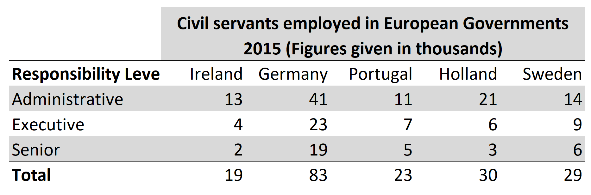

### Opciones disponibles

- **A.** 16%
- **B.** 18%
- **C.** 15%
- **D.** 11%
- **E.** 9,50%

---

### Respuesta y explicacion

La respuesta correcta es la **A**: 16%

Step 1 : Find the total number of administrative level civil servants, in thousands, employed in 2015: 13+41+11+21+14=100.

Step 2 : Find the multiplier associated with a 50% decrease: 1-(50/100)=0.5.

Step 3 : Divide the 2015 total (in thousands) by the multiplier to find the number of administrative civil servants in 2015: 100/0,5=200.

Step 4 : Write the fraction of these which were employed in Ireland: 32/200.

Step 5 : Convert this value into a percentage: 32/200=16/100=16%.

## Pregunta 201

Fuente: https://www.epsoprep.com/practice/attempt/en/UXVlc3Rpb25Qb29sQXR0ZW1wdDoxTzM4MWpURWZVOHV0d2plMHIwTnVn/review?q=8

### Enunciado

In 2015, how many Penguins were there at Aqualand?

### Imagen

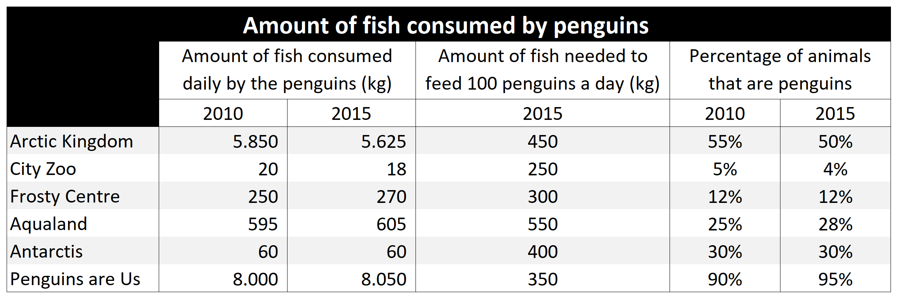

### Opciones disponibles

- **A.** 110
- **B.** 120
- **C.** 100
- **D.** 130
- **E.** 140

---

### Respuesta y explicacion

La respuesta correcta es la **A**: 110

Step 1 : Divide the total amount of fish consumed at Aqualand by the amount of fish needed to feed 100 penguins: 605/550=1,1.

Step 2 : Multiply this number by 100: 1,1*100=110.

## Pregunta 202

Fuente: https://www.epsoprep.com/practice/attempt/en/UXVlc3Rpb25Qb29sQXR0ZW1wdDoxTzM4MWpURWZVOHV0d2plMHIwTnVn/review?q=9

### Enunciado

One quarter of all of the songs played on Today's music in the month were in the top 20 chart at the time of being played. Given that a total of 8.370 songs were not in the top 20 chart at the time of being played, how long on average did each song played on Today's Music last?

### Imagen

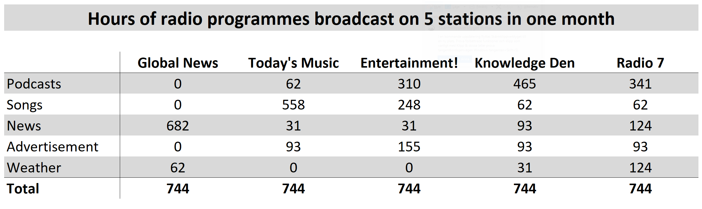

### Opciones disponibles

- **A.** 3 minutes
- **B.** 2 minutes
- **C.** 4 minutes
- **D.** 5 minutes
- **E.** 6 minutes

---

### Respuesta y explicacion

La respuesta correcta es la **A**: 3 minutes

Step 1 : Find the fraction of songs which were not in the top 20 when played: 1-(1/4)=3/4.

Step 2 : Find the total number of songs played in the month: (8.370/3)*4=11.160.

Step 3 : Find the total number of minutes for which music was played: 558*60=33.480.

Step 4 : Divide the total time in minutes by the number of songs: 33.480/11.160=3.

## Pregunta 203

Fuente: https://www.epsoprep.com/practice/attempt/en/UXVlc3Rpb25Qb29sQXR0ZW1wdDoxTzM4MWpURWZVOHV0d2plMHIwTnVn/review?q=10

### Enunciado

The average price of an opera ticket in 2000 was €120. This price increased by 10% each year between 2000 and 2003 (three years). By how much did the average price of an opera ticket increase between 2000 and 2003?

### Imagen

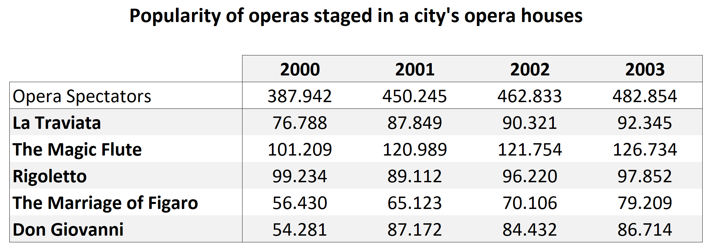

### Opciones disponibles

- **A.** €39,72
- **B.** 36,00 €
- **C.** 24,00 €
- **D.** 25,20 €
- **E.** 44,61 €

---

### Respuesta y explicacion

La respuesta correcta es la **A**: €39,72

Step 1 : Find the percentage multiplier associated with a 10% increase: 1+(10/100)=1,1.

Step 2 : Multiply the price in 2000 by this multiplier cubed to give the price for 2003: 120*1,1^3=159,72.

Step 3 : Subtract the 2000 ticket price from the 2003 price to find the increase in ticket price: 159,72-120=39,72

## Pregunta 204

Fuente: https://www.epsoprep.com/practice/attempt/en/UXVlc3Rpb25Qb29sQXR0ZW1wdDoxTzM4MWpURWZVOHV0d2plMHIwTnVn/review?q=11

### Enunciado

The average income tax paid by someone with a university degree in South Africa in 2011 was equivalent to 5.000 USD. This figure increased by 10% in each of the years between 2011 and 2014. In 2014 in South Africa there were 9.100.000 25-34 year-olds, 6.400.000 35-44 year-olds, 4.800.000 45-54 year-olds and 3.200.000 55-64 year-olds. What was the total of the income tax paid by all people with a university degree aged 25-64 in South Africa in 2014, measured in USD?

### Imagen

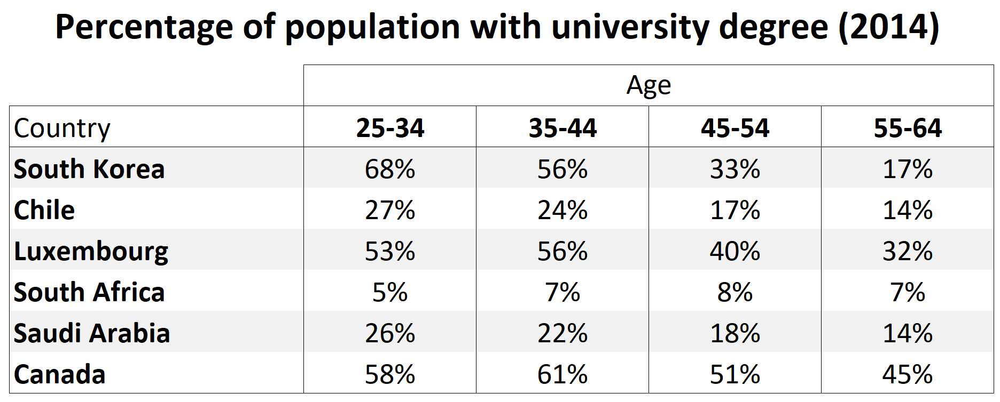

### Opciones disponibles

- **A.** 10.055.705.000
- **B.** 9.821.500.000
- **C.** 7.819.625.000
- **D.** 10.947.475.000
- **E.** 12.511.400.000

---

### Respuesta y explicacion

La respuesta correcta es la **A**: 10.055.705.000

Step 1 : Find the percentage multiplier for a 10% increase: 1+(10/100)=1.1. Setp 2: multiply the 2011 average tax by this value cubed to give the average 2014 tax: 5.000*1,1^3=6.655.

Step 3 : Find the number of people with degrees in each age group: 0,05*9.100.000=455.000 25-34 year-olds, 0,07*6.400.000=448.000 35-44 year-olds, 0,08*4.800.000=384.000 45-54 year-olds, 0,07*3.200.000=224.000 55-64 year-olds.

Step 4 : Add these figures to find the total number of people with a degree in South Africa in 2014: 455.000+448.000+384.000+224.000=1.511.000.

Step 5 : Multiply the total number of degree holders by the average tax paid by each: 1.511.000*6.655=10.055.705.000.

## Pregunta 205

Fuente: https://www.epsoprep.com/practice/attempt/en/UXVlc3Rpb25Qb29sQXR0ZW1wdDoxTzM4MWpURWZVOHV0d2plMHIwTnVn/review?q=12

### Enunciado

Between 2016 and 2017, the total spending by "Inspire Food" increased by 4%. By what percentage did the marketing spending funded by income from adverts at "Inspire Food" increase by between 2016 and 2017?

### Imagen

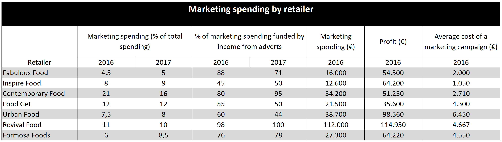

### Opciones disponibles

- **A.** 30%
- **B.** 5%
- **C.** 7,50%
- **D.** 21%
- **E.** 29,70%

---

### Respuesta y explicacion

La respuesta correcta es la **A**: 30%

Step 1 : Write 8% as a decimal:8/100=0,08.

Step 2 : find the total 2016 spending by dividing the marketing spending by 0,08:12.600/0,08=157.500.

Step 3 : Find the 2017 spending by increasing the 2016 spending by 4%: 1,04*157.500=163.800.

Step 4 : Find the marketing spending in 2017 by finding 9% of the total spending: 0,09*163.800=14.742.

Step 5 : Find the amount funded by advert income in 2016 by finding 45% of the spending on marketing: 0,45*12.600=5.670.

Step 6 : Find the amount funded by advert income in 2017 by finding 50% of the spending on marketing: 0,5*14.742=7.371.

Step 7 : Calculate the percentage difference between the 2016 and 2017 figure: ((7.371-5.670)/5.670)*100=30.

## Pregunta 206

Fuente: https://www.epsoprep.com/practice/attempt/en/UXVlc3Rpb25Qb29sQXR0ZW1wdDoxTzM4MWpURWZVOHV0d2plMHIwTnVn/review?q=13

### Enunciado

In 2014 the average house floor area in New Zealand was 60 square meters. Between 2014 and 2016 this value decreased by 5% each year. In 2016 there were 1,2 million people aged 18-34 in New Zealand, 1,8 million aged 35-64, and 0,9 million aged 65+. What was the total floor space in square meters of all the houses owned in New Zealand in 2016? (You may assume that each homeowner owns exactly one house)

### Imagen

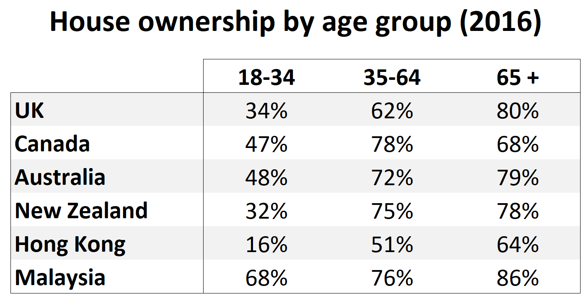

### Opciones disponibles

- **A.** 131.909.400
- **B.** 131.544.000
- **C.** 121.512.600
- **D.** 91.296.900
- **E.** 158.388.750

---

### Respuesta y explicacion

La respuesta correcta es la **A**: 131.909.400

Step 1 : Find the percentage multiplier for a 5% decrease: 1-(5/100)=0.95.

Step 2 : multiply the 2014 average floor area by this value squared to give the average 2016 floor area: 60*0,95^2=54,15.

Step 3 : Find the number of homeowners in each age group: 0,32*1.200.000=384.000 18-34 year-olds, 0,75*1.800.000=1.350.000 35-64 year-olds, 0,78*900.000=702.000 65+ year-olds.

Step 4 : Add these figures to find the total number of homeowners/houses owned in New Zealand: 384.000+1.350.000+702.000=2.436.000.

Step 5 : Multiply the total number of houses by the average floorspace: 2.436.000*54,15=131.909.400.

## Pregunta 207

Fuente: https://www.epsoprep.com/practice/attempt/en/UXVlc3Rpb25Qb29sQXR0ZW1wdDoxTzM4MWpURWZVOHV0d2plMHIwTnVn/review?q=14

### Enunciado

The Humanities department of a university is given a budget of €500.000 euros in 2013. This is cut by 3% each year between 2013 and 2015 (two years). What was the Humanities department's budget in 2015?

### Imagen

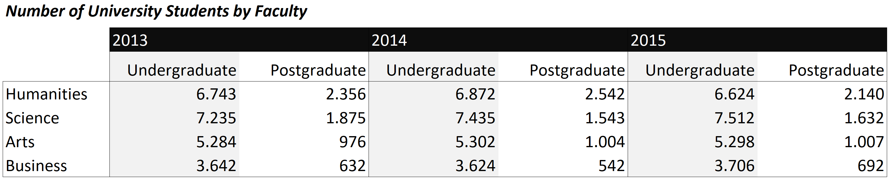

### Opciones disponibles

- **A.** 470.450 €
- **B.** 470.000 €
- **C.** 8.561 €
- **D.** 467.350 €
- **E.** 8.764 €

---

### Respuesta y explicacion

La respuesta correcta es la **A**: 470.450 €

Step 1 : Find the percentage multiplier associated with a 3% decrease: 1-(3/100)=0.97.

Step 2 : Multiply the budget from 2013 by this multiplier squared to give the budget for 2015: 500.000*(0,97)^2=470.450.

## Pregunta 208

Fuente: https://www.epsoprep.com/practice/attempt/en/UXVlc3Rpb25Qb29sQXR0ZW1wdDoxTzM4MWpURWZVOHV0d2plMHIwTnVn/review?q=15

### Enunciado

From 2016 onwards, beet sugar production in Poland is expected to decrease by 27% each year, while in the Netherlands it is expected to increase by 12% each year. In what year will the Netherlands first produce more sugar beet than Poland?

### Imagen

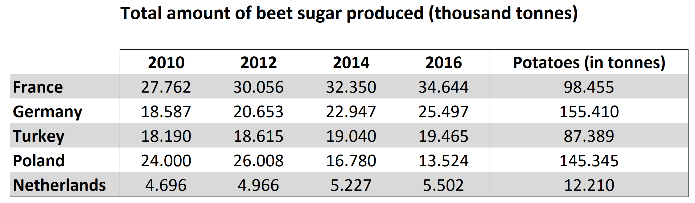

### Opciones disponibles

- **A.** 2019
- **B.** 2018
- **C.** 2020
- **D.** 2021
- **E.** 2022

---

### Respuesta y explicacion

La respuesta correcta es la **A**: 2019

Step 1 : Calculate the percentage multiplier for a 27% decrease: 1-(27/100)=0,73.

Step 2 : Calculate the percentage multiplier for a 12% increase: 1+(12/100)=1,12.

Step 3 : Write an expression for the total sugar beet produced in Poland n years after 2016: 13.524*0,73^n.

Step 4 : Write an expression for the total sugar beet produced in the Netherlands n years after 2016: 5.502*1,12^n.

Step 5 : substitute increasing values of n into the expression until one gives a higher total for the Netherlands than for Poland: 13.524*0,73^3=5.261 while 5.502*1,12^3=7.730.

Step 6 : Add this value of n to 2016 to find the year: 2016+3=2019.

## Pregunta 209

Fuente: https://www.epsoprep.com/practice/attempt/en/UXVlc3Rpb25Qb29sQXR0ZW1wdDoxTzM4MWpURWZVOHV0d2plMHIwTnVn/review?q=16

### Enunciado

The increase in full-time students between the years 2012 and 2016 was half the increase between 2008 and 2016. If the number of female full-time students remained constant between 2008 and 2012, how many male full-time students were there in 2012?

### Imagen

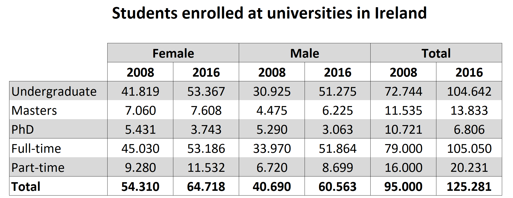

### Opciones disponibles

- **A.** 46.995
- **B.** 92.025
- **C.** 34.425
- **D.** 33.970
- **E.** 7.920

---

### Respuesta y explicacion

La respuesta correcta es la **A**: 46.995

Step 1 : Find the increase in full-time students between 2008 and 2016: 105.050-79.000=26.050.

Step 2 : Divide this by 2 to find the increase between 2012 and 2016: 26.050/2=13.025.

Step 3 : Find the number of full-time students in 2012 by subtracting this number from the figure for 2016: 105.050-13.025 = 92.025.

Step 4 : subtract the number of full-time female students in 2012 (the same as the number in 2008): 92.025-45.030=46.995.

## Pregunta 210

Fuente: https://www.epsoprep.com/practice/attempt/en/UXVlc3Rpb25Qb29sQXR0ZW1wdDoxTzM4MWpURWZVOHV0d2plMHIwTnVn/review?q=17

### Enunciado

In April, the number of visits to the rugby page of the website "maxsports" was 15% lower than the number of visits in March and the average length of each visit to the rugby page was 12% higher. What was the total browsing time spent by users on the rugby page in April?

### Imagen

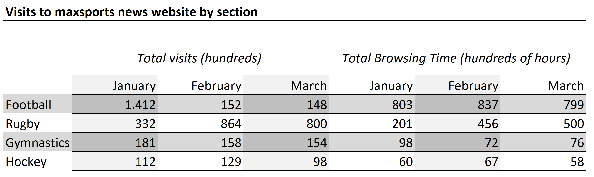

### Opciones disponibles

- **A.** 47.600
- **B.** 48.700
- **C.** 56.000
- **D.** 42.500
- **E.** 506.000

---

### Respuesta y explicacion

La respuesta correcta es la **A**: 47.600

Step 1 : Find the average length of a visit in March to the rugby page by dividing the total browsing time by the total number of visits (both are measured in hundreds):500/800=0,625 hours.

Step 2 : Find the average length of a visit in April by increasing the average length of a visit in March by 12%: 1,12*0,625=0,7 hours.

Step 3 : Find the total number of visits in April by decreasing the number of visits in March by 15%: 800*0,85=680.

Step 4 : multiply these figures together to get the total browsing time in hundreds of hours: 0,7*680=476.

Step 5 : Multiply by 100 to find the total browsing time in hours: 476*100=47.600.

## Pregunta 211

Fuente: https://www.epsoprep.com/practice/attempt/en/UXVlc3Rpb25Qb29sQXR0ZW1wdDoxTzM4MWpURWZVOHV0d2plMHIwTnVn/review?q=18

### Enunciado

The table above shows the presence of contaminants in 4 water sources measured in parts per million. This is the number of grams of the substance that would be present in 1 million grams of water. How many grams of sulphate would be expected to be present in Spinney Lake if the total mass of the water in the lake is 20.000.000 grams?

### Imagen

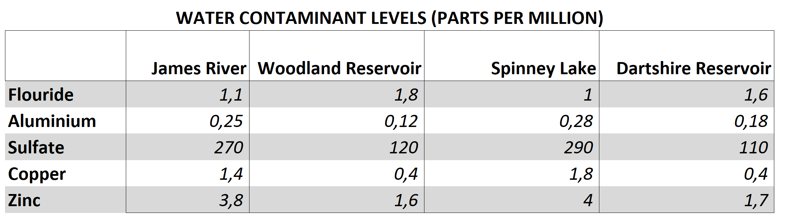

### Opciones disponibles

- **A.** 5.800
- **B.** 580
- **C.** 58
- **D.** 2.900
- **E.** 290

---

### Respuesta y explicacion

La respuesta correcta es la **A**: 5.800

Step 1 : Find the factor by which 20.000.000 (20 million) is larger than 1.000.000 (1 million): 20.000.000/1.000.000=20.

Step 3 : Multiply the contaminatnt level by this factor: 290*20=5.800.

## Pregunta 212

Fuente: https://www.epsoprep.com/practice/attempt/en/UXVlc3Rpb25Qb29sQXR0ZW1wdDoxTzM4MWpURWZVOHV0d2plMHIwTnVn/review?q=19

### Enunciado

One fifth of the small mammals owned in Belgium in 2010 were rabbits and the rest were rodents. If one eighth of the rodents were rats, how many rodents which were not rats were owned in Belgium in 2010?

### Imagen

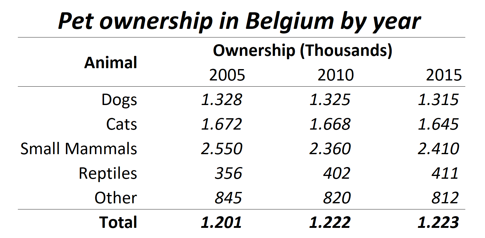

### Opciones disponibles

- **A.** 1.652
- **B.** 1.888
- **C.** 472
- **D.** 236
- **E.** 413

---

### Respuesta y explicacion

La respuesta correcta es la **A**: 1.652

Step 1 : Find the number of rabbits: 2.360/5=472.

Step 2 : Find the number of rodents: 2.360-472=1.888.

Step 3 : Find the number of rats: 1.888/8=236.

Step 4 : Find the number of rodents which are not rats: 1.888-236=1.652.

## Pregunta 213

Fuente: https://www.epsoprep.com/practice/attempt/en/UXVlc3Rpb25Qb29sQXR0ZW1wdDoxTzM4MWpURWZVOHV0d2plMHIwTnVn/review?q=20

### Enunciado

The total number of tickets sold across the three theme parks was 25% higher in 2017 than in 2015. Given that 16 Million tickets were sold at Culture City in 2015, what percentage of the tickets sold in 2015 were at Culture City?

### Imagen

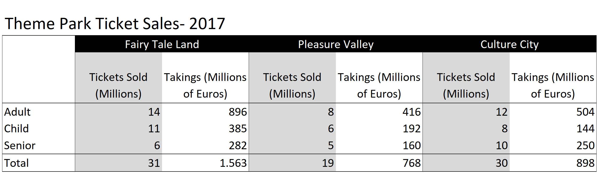

### Opciones disponibles

- **A.** 25%
- **B.** 27%
- **C.** 16%
- **D.** 38%
- **E.** 20%

---

### Respuesta y explicacion

La respuesta correcta es la **A**: 25%

Step 1 : Find the total number of tickets, in millions, sold in 2017: 31+19+30=80.

Step 2 : Find the multiplier associated with a 25% increase: 1+(25/100)=1,25.

Step 3 : Divide the 2017 total (in millions) by the multiplier to find the number of tickets in 2015: 80/1,25=64.

Step 4 : Write the fraction of these which were sold at Culture City: 16/64=1/4.

Step 5 : Convert this value into a percentage: 1/4=25/100=25%.

## Pregunta 214

Fuente: https://www.epsoprep.com/practice/attempt/en/UXVlc3Rpb25Qb29sQXR0ZW1wdDoxTzM4MWpURWZVOHV0d2plMHIwTnVn/review?q=21

### Enunciado

In Tiegansville the number of victims of serious crimes per 10.000 inhabitants decreased by 0,3 victims between 2005 and 2015. What was the population of Tiegansville in 2005

### Imagen

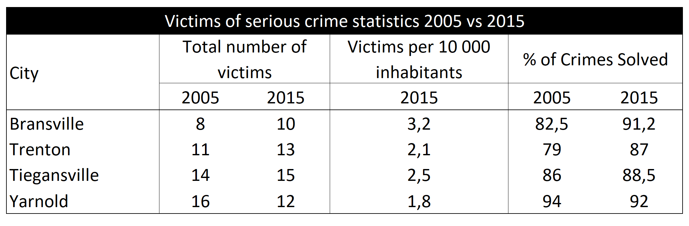

### Opciones disponibles

- **A.** 50.000
- **B.** 64.000
- **C.** 60.000
- **D.** 56.000
- **E.** 54.000

---

### Respuesta y explicacion

La respuesta correcta es la **A**: 50.000

Step 1 : Find the number of victims per 10.000 inhabitants in Tiegansville in 2005 by adding 0,3 to the figure for 2015: 2,5+0,3=2,8.

(Remember that the number of victims decreased from 2005 to 2015 which is why the number must be higher in 2005)

Step 2 : Divide the total number of victims in 2005 by the number of victims per 10.000: 14/2,8=5.

Step 3 : Multiply this answer by 10.000: 5*10.000=50.000.

## Pregunta 215

Fuente: https://www.epsoprep.com/practice/attempt/en/UXVlc3Rpb25Qb29sQXR0ZW1wdDoxTzM4MWpURWZVOHV0d2plMHIwTnVn/review?q=22

### Enunciado

The table shows average times and attendances for a weekly 5km run. Of the runners on the 18th February, 60 belonged to a running club, and these runners recorded an average time of 23,8 minutes. What was the average time of those who did not belong to a running club on the 18th February?

### Imagen

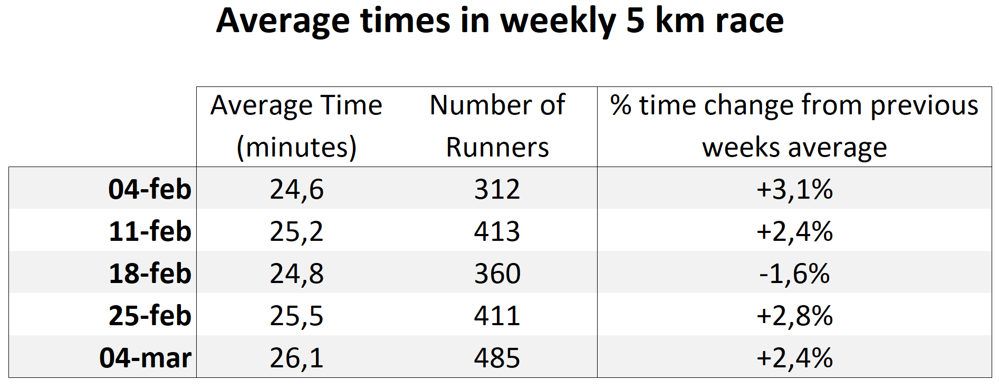

### Opciones disponibles

- **A.** 25
- **B.** 25,8
- **C.** 25,2
- **D.** 25,4
- **E.** 25,6

---

### Respuesta y explicacion

La respuesta correcta es la **A**: 25

Step 1 : Find the number of runners who were not in a club: 360-60=300.

Step 2 : Calculate the total of all times on this day by multiplying the average time by the number of runners: 24,8*360=8.928 minutes.

Step 3 : Calculate the total of the times recorded by running club members by multiplying the number of these members by their average time: 23,8*60=1.428.

Step 4 : subtract this from the total of all times to give the total of times recorded by those not in a running club: 8.928-1.428=7.500.

Step 5 : Divide the total time of non-members by the number of non-members to get their average time: 7.500/300=25.

## Pregunta 216

Fuente: https://www.epsoprep.com/practice/attempt/en/UXVlc3Rpb25Qb29sQXR0ZW1wdDoxTzM4MWpURWZVOHV0d2plMHIwTnVn/review?q=23

### Enunciado

The farm grew 5 tons more of peas in 2017 than in 2016. The farm also grew fruit in 2016 and 2017. They grew 10 tons more fruit in 2017 than in 2016. If the total weight of fruit grown in 2017 was 4 times the weight of the peas grown in 2017, how many tons of fruit were grown in 2016?

### Imagen

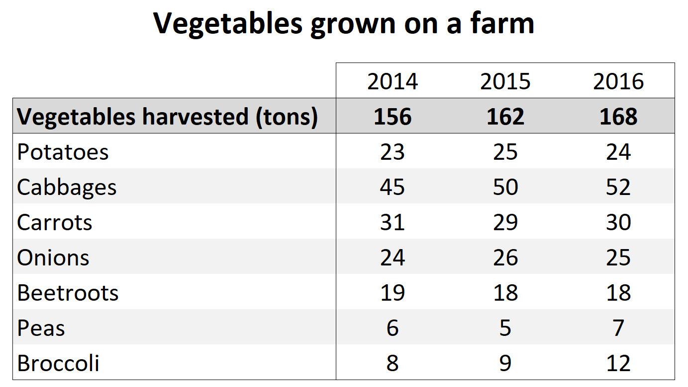

### Opciones disponibles

- **A.** 38
- **B.** 48
- **C.** 28
- **D.** 18
- **E.** 58

---

### Respuesta y explicacion

La respuesta correcta es la **A**: 38

Step 1 : Find the weight of peas grown in 2017 by adding 5 to the weight grown in 2016: 7+5=12 tons.

Step 2 : Find the weight of fruit grown in 2017 by multiplying the weight of the peas in tons by 4: 12*4=48.

Step 3 : Find the weight of fruit grown in 2016 by subtracting 10 from the weight of fruit grown in 2017: 48-10=38

## Pregunta 217

Fuente: https://www.epsoprep.com/practice/attempt/en/UXVlc3Rpb25Qb29sQXR0ZW1wdDoxTzM4MWpURWZVOHV0d2plMHIwTnVn/review?q=24

### Enunciado

What will be the decrease in the value of UK pharmaceutical exports between 2017 and 2018 if the value changes as predicted by the table?

### Imagen

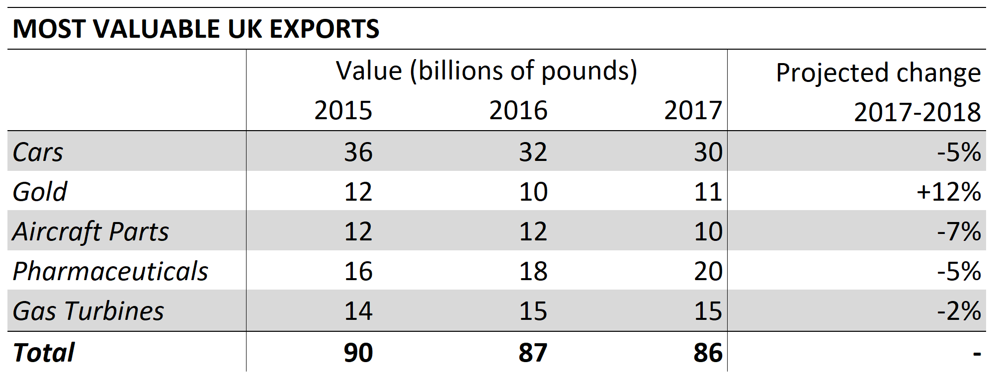

### Opciones disponibles

- **A.** 1.000.000.000 £
- **B.** 1.000.000 £
- **C.** 2.000.000.000 £
- **D.** 500.000.000 £
- **E.** 100.000.000 £

---

### Respuesta y explicacion

La respuesta correcta es la **A**: 1.000.000.000 £

Step 1 : Convert 5% (the projected percentage decrease in pharmaceutical exports) to a decimal: 5/100=0,05.

Step 2 : Multiply the 2018 pharmaceutical exports value by this number to find 5% of this total: 0,05*20=1.

Step 3 : As this represents billions of pounds, multiply by 1 billion: 1 billion=1.000.000.000.

## Pregunta 218

Fuente: https://www.epsoprep.com/practice/attempt/en/UXVlc3Rpb25Qb29sQXR0ZW1wdDoxTzM4MWpURWZVOHV0d2plMHIwTnVn/review?q=25

### Enunciado

In 2013, 60% of the photos of puffins contained a single puffin, 25% contained 2 puffins and 15% contained 3 or more puffins. What is the minimum number of puffins which appear in photographs in year 2013?

### Imagen

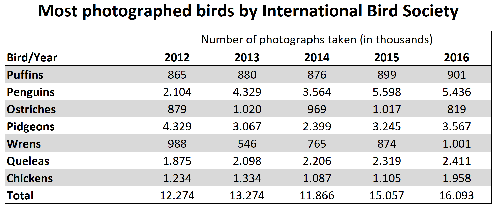

### Opciones disponibles

- **A.** 1.364
- **B.** 880
- **C.** 968
- **D.** 2.640
- **E.** 1.760

---

### Respuesta y explicacion

La respuesta correcta es la **A**: 1.364

Step 1 : Find the number of photos with one puffin in by finding 60% of 880: 0,6*880=528. There are 528 puffins in these photos.

Step 2 : Find the number of photos with two puffins in by finding 25% of 880: 0,25*880=220.

Step 3 : Find the total number of puffins appearing in photos with 2 puffins in by multiplying 220 by 2: 2*220=440.

Step 2 : Find the number of photos with three of more puffins in by finding 15% of 880: 0,15*880=132.

Step 5 : Find the minimum number of puffins appearing in photos with 3 or more puffins in by multiplying 132 by 3: 3*132=396.

Step 6 : Add the number of puffins appearing in photos with 1 and 2 puffins to the minimum number in photos with 3 or more puffins: 528+440+396=1.364. Note: We do not know how many puffins there are in total in the photos in the group "3 or more" which is why we have to say minimum.

## Pregunta 219

Fuente: https://www.epsoprep.com/practice/attempt/en/UXVlc3Rpb25Qb29sQXR0ZW1wdDoxTzM4MWpURWZVOHV0d2plMHIwTnVn/review?q=26

### Enunciado

One quarter of the "technical" staff in Szczecin hospitals in 2016 worked at the East General Hospital Of these, one third were MRI technicians. How many Pharmaceutical Staff worked at the East General Hospital in 2016?

### Imagen

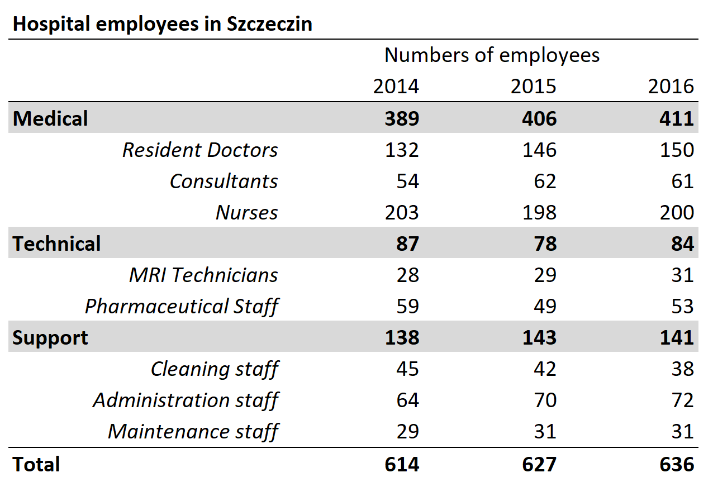

### Opciones disponibles

- **A.** 14
- **B.** 7
- **C.** 21
- **D.** 13
- **E.** 8

---

### Respuesta y explicacion

La respuesta correcta es la **A**: 14

Step 1 : Work out how many technical staff worked at the East General Hospital in 2016 by finding one quarter of 84: 84/4=21.

Step 2 : work out how many of these were MRI technicians by finding one third of 21: 21/3=7.

Step 3 : Work out how many of the East General technical staff were pharmaceutical staff: 21-7=14.

## Pregunta 220

Fuente: https://www.epsoprep.com/practice/attempt/en/UXVlc3Rpb25Qb29sQXR0ZW1wdDoxTzM4MWpURWZVOHV0d2plMHIwTnVn/review?q=27

### Enunciado

Between 2016 and 2017, the spending at Urban Food increased by 3%. By what percentage did the total inventory spending being funded by savings at Urban Food decrease by between 2016 and 2017?

### Imagen

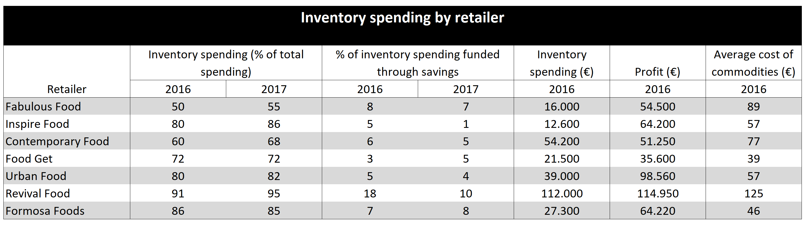

### Opciones disponibles

- **A.** 15,54%
- **B.** 20%
- **C.** 2,50%
- **D.** 12,20%
- **E.** 5,60%

---

### Respuesta y explicacion

La respuesta correcta es la **A**: 15,54%

Step 1 : Write 80% as a decimal:80/100=0,8.

Step 2 : find the total spending (in euros) in 2016 by dividing the inventory spending by 0,8: 39.000/0,8=48.750.

Step 3 : Find the total spending (in euros) in 2017 by increasing the total 2016 spending by 3%: 1,03*48.750=50.212,5.

Step 4 : Find the total inventory spending (in euros) in 2017 by finding 82% of the total spending: 0,82*50.212,5=41.174,25.

Step 5 : Find the total inventory spending (in euros) funded by savings in 2016 by finding 5% of the inventory spending in 2016: 0,05*39.000=1.950.

Step 6 : Find the total inventory spending (in euros) funded by savings in 2017 by finding 4% of the inventory spending in 2017: 0,04*41.174,25=1.647.

Step 7 : Calculate the percentage difference between the 2016 and 2017 figure: ((1.950-1.647)/1.950)*100=15,54.

## Pregunta 221

Fuente: https://www.epsoprep.com/practice/attempt/en/UXVlc3Rpb25Qb29sQXR0ZW1wdDoxTzM4MWpURWZVOHV0d2plMHIwTnVn/review?q=28

### Enunciado

Participants in several UK cities take part in a competition to track their steps for charity. The total number of participants doubled, while the total number of steps increased by 25% between week 5 and week 6. By how much did the average number of steps per participant decrease between week 5 and week 6?

### Imagen

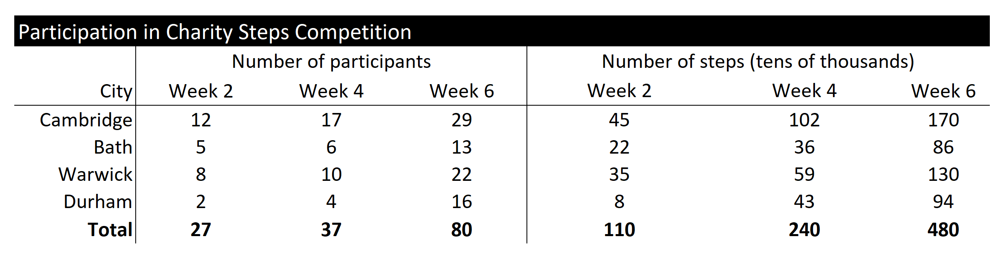

### Opciones disponibles

- **A.** 36.000
- **B.** 10.000
- **C.** 22.500
- **D.** 30.000
- **E.** 48.000

---

### Respuesta y explicacion

La respuesta correcta es la **A**: 36.000

Step 1 : Calculate the average number of steps per participant in week 6: (480/80)*10 000=60 000.

Step 2 : calculate the number of participants in week 5: 80/2=40.

Step 3 : Calculate the percentage multiplier for a 25% increase: 1+(25/100)=1.25.

Step 4 : Calculate the number of steps (in tens of thousands) in week 5: 480/1.25=384.

Step 5 : Calculate the average number of steps per participant in week 5: (384/40)*10 000=96 000.

Step 6 : Calculate the decrease in the number of steps per participant: 96 000-60 000=36 000.

## Pregunta 222

Fuente: https://www.epsoprep.com/practice/attempt/en/UXVlc3Rpb25Qb29sQXR0ZW1wdDoxTzM4MWpURWZVOHV0d2plMHIwTnVn/review?q=29

### Enunciado

Based on the data in the table, what would be the predicted turnover in pounds of a retailer who sold 10.000 CDs and 5000 Vinyls in 2015?

### Imagen

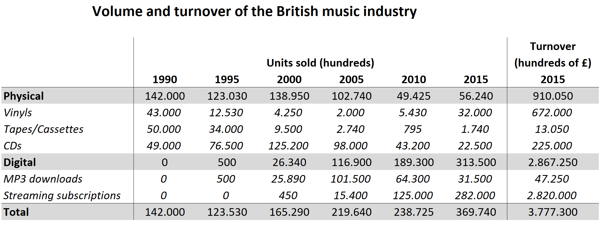

### Opciones disponibles

- **A.** 205.000
- **B.** 100.000
- **C.** 250.000
- **D.** 246.881
- **E.** 150.000

---

### Respuesta y explicacion

La respuesta correcta es la **A**: 205.000

Step 1 : Find the average turnover per CD sold by dividing the turnover from CDs by the number of CDs sold: 225.000/22.500=10.

Step 2 : Use this to work out the estimated turnover from selling 10.000 CDs: 10*10.000=100.000.

Step 3 : Find the average turnover per vinyl sold by dividing the turnover from vinyls by the number of vinyls sold: 672.000/32.000=21.

Step 4 : Use this to work out the estimated turnover from selling 5.000 vinyls: 21*5 000=105.000.

Step 5 : Add the estimated turnover from the CDs and vinyls to find the total estimated turnover: 100.000+105.000=205.000

## Pregunta 223

Fuente: https://www.epsoprep.com/practice/attempt/en/UXVlc3Rpb25Qb29sQXR0ZW1wdDoxTzM4MWpURWZVOHV0d2plMHIwTnVn/review?q=30

### Enunciado

Between 2010 and 2015, the spending at Emporium Science increased by 2%. By what percentage did the total research spending being funded by investors at Emporium Science increase by between 2010 and 2015?

### Imagen

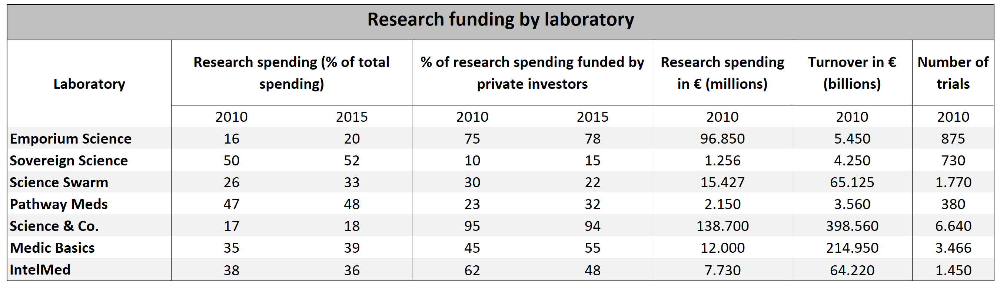

### Opciones disponibles

- **A.** 32,60%
- **B.** 27,50%
- **C.** 4,20%
- **D.** 25%
- **E.** 30%

---

### Respuesta y explicacion

La respuesta correcta es la **A**: 32,60%

Step 1 : Write 16% as a decimal:16/100=0,16.

Step 2 : find the total spending (in millions of euros) in 2010 by dividing the research spending by 0,16:96.850/0,16=605.312,5.

Step 3 : Find the total spending (in millions of euros) in 2015 by increasing the total 2010 spending by 2%: 1,02*605.312,5=617.418,75.

Step 4 : Find the total research spending (in millions of euros) in 2015 by finding 20% of the total spending: 0,2*617.418,75=123.483,75.

Step 5 : Find the total research spending (in millions of euros) funded by investors in 2010 by finding 75% of the research spending in 2010: 0,75*96.850=72.637,5.

Step 6 : Find the total research spending (in millions of euros) funded by investors in 2015 by finding 78% of the research spending in 2015: 0,78*123.483,75=96.317,325.

Step 7 : Calculate the percentage difference between the 2010 and 2015 figure: ((96.317,325-72.637,5)/72.637,5)*100=32,6.

## Pregunta 224

Fuente: https://www.epsoprep.com/practice/attempt/en/UXVlc3Rpb25Qb29sQXR0ZW1wdDoxTzM4MWpURWZVOHV0d2plMHIwTnVn/review?q=31

### Enunciado

From 2012 onwards the growth in renewable energy in Poland each year was 10%. From 2012 onwards the growth in renewable energy in the UK was 16% each year. In what year was the amount of renewable energy generated in the UK first greater than the amount of renewable energy generated in Poland?

### Imagen

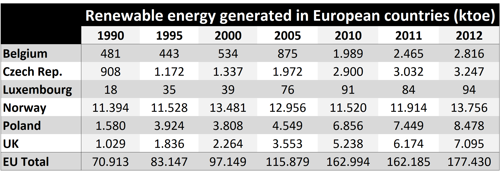

### Opciones disponibles

- **A.** 2016
- **B.** 2017
- **C.** 2015
- **D.** 2014
- **E.** 2013

---

### Respuesta y explicacion

La respuesta correcta es la **A**: 2016

Step 1 : Calculate the percentage multiplier for a 10% increase: 1+(10/100)=1,1.

Step 2 : Calculate the percentage multiplier for a 16% increase: 1+(16/100)=1,16.

Step 3 : Write an expression for the total renewable energy generated in Poland n years after 2012: 8.478*1,1^n.

Step 4 : Write an expression for the total renewable energy generated in the UK n years after 2012: 7.095*1,16^n.

Step 5 : substitute increasing values of n into the expression until one gives a higher total for the UK than for Poland: 8.478*1,1^4=12.412,6 while 7.095*1,16^4=12.846,5

Step 6 : Add this value of n to 2012 to find the year: 2012+4=2016.

## Pregunta 225

Fuente: https://www.epsoprep.com/practice/attempt/en/UXVlc3Rpb25Qb29sQXR0ZW1wdDoxTzM4MWpURWZVOHV0d2plMHIwTnVn/review?q=32

### Enunciado

On Monday Melissa spent 30 minutes of her weights time completing bench presses and the rest of the time using free weights. She split her cardio time between using a treadmill and using an elliptical trainer. She was using the treadmill for the same amount of time as she was using the free weights. How long was she using the elliptical trainer for?

### Imagen

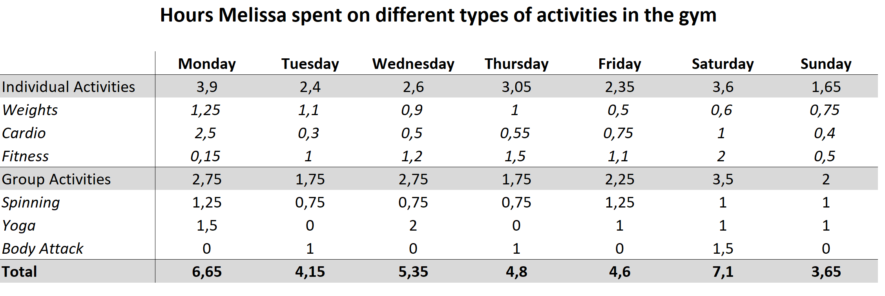

### Opciones disponibles

- **A.** 1 hour 45 minutes
- **B.** 45 minutes
- **C.** 1 hour 55 minutes
- **D.** 2 hours
- **E.** 1 hour 30 minutes

---

### Respuesta y explicacion

La respuesta correcta es la **A**: 1 hour 45 minutes

Step 1 : Convert 30 minutes to a decimal hour form: 30/60=0,5.

Step 2 : Find the time spent on free weights by subtracting the time spent completing bench presses from the total weights time: 1,25-0,5=0,75.

Step 3 : Find the time spent on the elliptical machine by subtracting the time spent on the treadmill (0,75 hours) from the cardio time: 2.5-0.75=1.75.

Step 4 : convert this time into hours and minutes: 1,75hours= 1 hour +0,75*60 minutes=1 hour 45 minutes.

## Pregunta 226

Fuente: https://www.epsoprep.com/practice/attempt/en/UXVlc3Rpb25Qb29sQXR0ZW1wdDoxTzM4MWpURWZVOHV0d2plMHIwTnVn/review?q=33

### Enunciado

Between 2014 and 2015, the total number of cases taken by Jenkins and Associates increased by 5%. By what percentage did the total number of appeals cases which resulted in a win increase at Jenkins and Associates between 2014 and 2015?

### Imagen

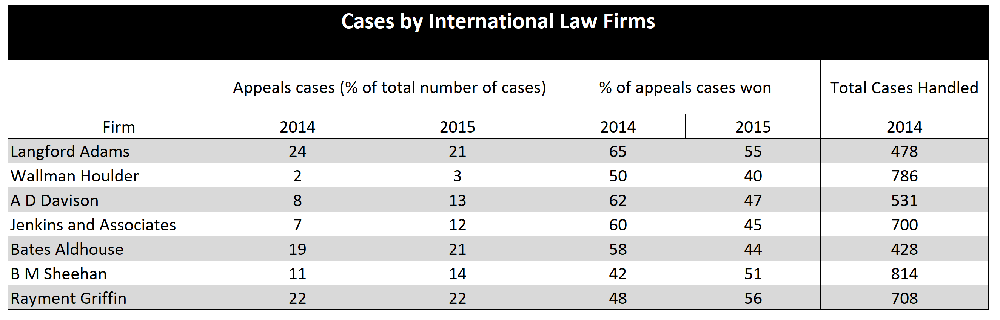

### Opciones disponibles

- **A.** 35%
- **B.** 30%
- **C.** 32%
- **D.** 36%
- **E.** 37%

---

### Respuesta y explicacion

La respuesta correcta es la **A**: 35%

Note that the question asks for appeal cases won:

From the table we are able to find the number of appeal cases which resulted in a win at Jenkins and Associates for year 2014. We do that by:

Step 1:  First finding the number of total cases in 2014 which is 700 and multiplying it with the percentage of the appeal cases: 700 * 0,07 = 49

Step 2: Now we need to calculate how many of those appeal cases were won: 49*0,6= 29,4

Now we need to do the same for 2015.

Step 4: We do not know how many total cases there were in 2015 but we do know there were 5% more than in 2015. We can therefore conclude that 700*1,05=735

step 5: Calculate how many appeal cases there were in 2015 by multiplying the total number of cases with the Appeals cases percent for 2014:  735 * 0,12= 88,2

step 6: Calculate number of appeal cases won in 2015 by multiplying the number of appeals cases for 2014 (above) by the percentage of appeals cases won  88,2* 0,45=39,7

Step 7: Calculate percentage by which the total number of appeals cases which resulted in a win increased at Jenkins and Associates between 2014 and 2015:  39,7/29,4=1,35 which is equal to 35% more appeal cases won in 2015

## Pregunta 227

Fuente: https://www.epsoprep.com/practice/attempt/en/UXVlc3Rpb25Qb29sQXR0ZW1wdDoxTzM4MWpURWZVOHV0d2plMHIwTnVn/review?q=34

### Enunciado

Based on the data in the table, what was the total number of inhabitants in India in 2015?

### Imagen

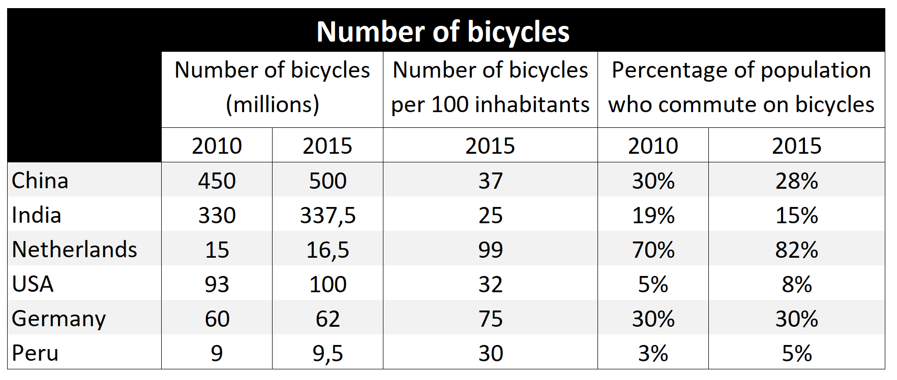

### Opciones disponibles

- **A.** 1.350.000.000
- **B.** 337.600.000
- **C.** 150.000.000
- **D.** 1.332.000.000
- **E.** 1.688.000.000

---

### Respuesta y explicacion

La respuesta correcta es la **A**: 1.350.000.000

Step 1 : Write out the total number of bicycles in India by multiplying the figure in the table by 1 million: 337,5*1.000.000=337.500.000.

Step 2 : Divide the total amount of bicycles in India by the number of bikes per 100 inhabitants: 337.500 000/25=13.500.000.

Step 3 : Multiply this number by 100: 13.500.000*100=1.350.000.000. Another way of solving the question is to simply multiply the number of bicycles by 4 as we can see that every fourth person in India owns a bicycle (25 of 100) hence 4*337.500.000 = 1.350.000.000 (rounded down)

## Pregunta 228

Fuente: https://www.epsoprep.com/practice/attempt/en/UXVlc3Rpb25Qb29sQXR0ZW1wdDoxTzM4MWpURWZVOHV0d2plMHIwTnVn/review?q=35

### Enunciado

The percentage of France's gold medals which were in Judo was the same at the 2016 and 1996 Olympics. If France won 3 gold medals in Judo at the 1996 Olympics, how many gold medals in Judo did they win at the 2016 Olympics?

### Imagen

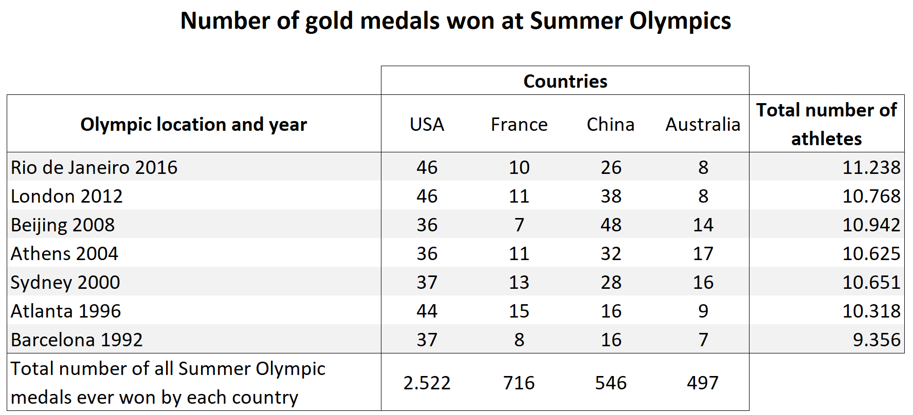

### Opciones disponibles

- **A.** 2
- **B.** 3
- **C.** 1
- **D.** 4
- **E.** 5

---

### Respuesta y explicacion

La respuesta correcta es la **A**: 2

Step 1 : Find the percentage of France's gold medals which were in Judo at the 1996 Olympics: (3/15)*100=20%.

Step 2 : Find 20% of the total number of gold medals won by Frane at the 2016 Olympics: 0,2*10=2.

## Pregunta 229

Fuente: https://www.epsoprep.com/practice/attempt/en/UXVlc3Rpb25Qb29sQXR0ZW1wdDoxTzM4MWpURWZVOHV0d2plMHIwTnVn/review?q=36

### Enunciado

The volume of diesel sold at V11 Garage in 2017 is 20% higher than the volume sold in 2016. The average cost of diesel at V11 Garage in 2017 is 25% higher than the average cost sold in 2016. What is the turnover from diesel sales at V11 Garage in 2017?

### Imagen

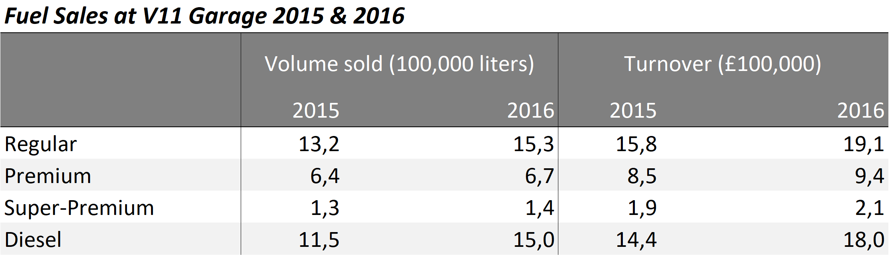

### Opciones disponibles

- **A.** 2.700.000
- **B.** 2.160.000
- **C.** 2.250.000
- **D.** 1.728.000
- **E.** 1.875.000

---

### Respuesta y explicacion

La respuesta correcta es la **A**: 2.700.000

Step 1 : Find the average cost of diesel sold in 2016 by dividing the 2016 turnover from diesel by the 2016 volume for diesel (both are measured in thousands):18/15=1,2. 18.

Step 2 : Find the average cost of diesel sold in 2017 by increasing the cost in 2016 by 25%: 1,2*1,25=1,5.

Step 3 : Find the volume of diesel sold in 2017 by increasing the amount sold in 2016 by 20%: 15*1,2=18.

Step 4 : multiply these figures together to get the turnover in hundreds of thousands of pounds: 18*1,5=27.

Step 5 : write this out in full: 27 hundred thousand=2.700.000.

## Pregunta 230

Fuente: https://www.epsoprep.com/practice/attempt/en/UXVlc3Rpb25Qb29sQXR0ZW1wdDoxTzM4MWpURWZVOHV0d2plMHIwTnVn/review?q=37

### Enunciado

The table above shows data on the rate of defects in cell phones produced at a factory. Suppose that in a particular week, 1.000.000 phone of the "X2" model are produced. How many would be predicted to have a defect that was NOT an aesthetic issue?

### Imagen

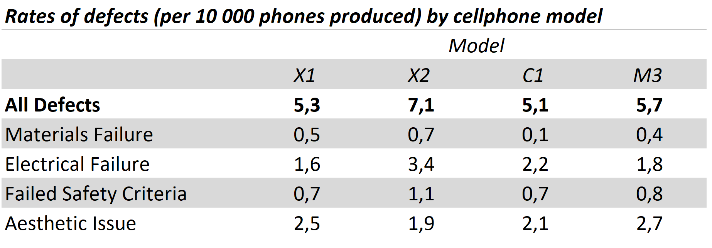

### Opciones disponibles

- **A.** 520
- **B.** 710
- **C.** 190
- **D.** 52
- **E.** 19

---

### Respuesta y explicacion

La respuesta correcta es la **A**: 520

Step 1 : Calculate the rate of defects which are not aesthetic issues by subtracting the rate of aesthetic issues per 10.000 defects from the total rate: 7,1-1,9=5,2.

Step 2 : Find the factor by which 1.000.000 is larger than 10.000: 1.000.000/10.000=100.

Step 3 : Multiply the rate by this factor: 5,2*100=520.

## Pregunta 231

Fuente: https://www.epsoprep.com/practice/attempt/en/UXVlc3Rpb25Qb29sQXR0ZW1wdDoxTzM4MWpURWZVOHV0d2plMHIwTnVn/review?q=38

### Enunciado

Based on the data in the table, what would be the predicted turnover in euros of the restaurant on a day in 2017 where it sold only 200 pizzas and 50 lasagna mains?

### Imagen

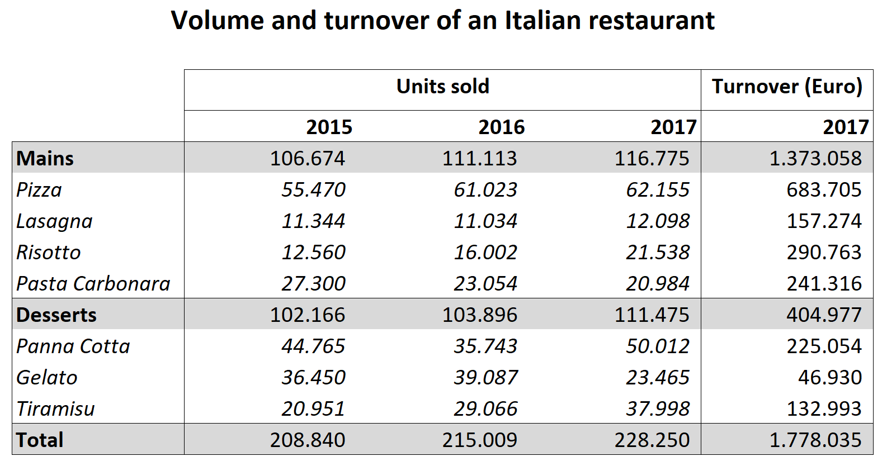

### Opciones disponibles

- **A.** 2.850
- **B.** 2.200
- **C.** 650
- **D.** 3.000
- **E.** 2.831

---

### Respuesta y explicacion

La respuesta correcta es la **A**: 2.850

Step 1 : Find the average turnover per pizza sold by dividing the turnover from selling pizzas by the number of pizzas sold: 683.705/62.155=11.

Step 2 : Use this to work out the estimated turnover from selling 200 pizzas: 11*200=2.200.

Step 3 : Find the average turnover per lasagna sold by dividing the turnover from selling lasagnas by the number of lasagnas sold: 157.274/12.098=13.

Step 4 : Use this to work out the estimated turnover from selling 50 lasagnas: 13*50=650.

Step 5 : Add the estimated turnover from the pizzas and lasagnas to find the total estimated turnover: 2.200+650=2.850

## Pregunta 232

Fuente: https://www.epsoprep.com/practice/attempt/en/UXVlc3Rpb25Qb29sQXR0ZW1wdDoxTzM4MWpURWZVOHV0d2plMHIwTnVn/review?q=39

### Enunciado

The increase in services employees between 1985 and 2000 in Estonia was double the increase between 2000 and 2015. If the number of services employees who were men remained constant between 1985 and 2000, how many women were employed in the services sector in 1985?

### Imagen

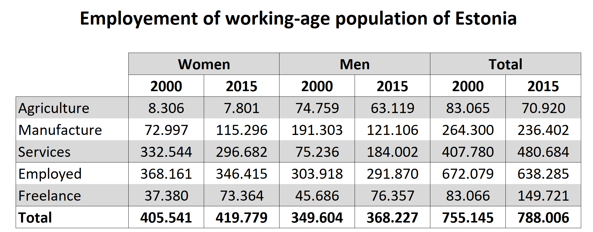

### Opciones disponibles

- **A.** 186.736
- **B.** 261.972
- **C.** 259.640
- **D.** 260.820
- **E.** 128.654

---

### Respuesta y explicacion

La respuesta correcta es la **A**: 186.736

Step 1 : Find the increase in services employees between 2000 and 2015: 480.684-407.780=72.904.

Step 2 : Multiply this by 2 to find the increase between 1985 and 2000: 72.904*2=145.808.

Step 3 : Find the number of services employees by subtracting this number from the figure for 2000: 407.780-145.808 = 261.972.

Step 4 : subtract the number of employees who were men in 1985 (the same as the number who were men in 2000): 261.972-75.236=186.736.

## Pregunta 233

Fuente: https://www.epsoprep.com/practice/attempt/en/UXVlc3Rpb25Qb29sQXR0ZW1wdDoxTzM4MWpURWZVOHV0d2plMHIwTnVn/review?q=40

### Enunciado

What was the mean attendance at events at the Olympic Stadium in 2015?

### Imagen

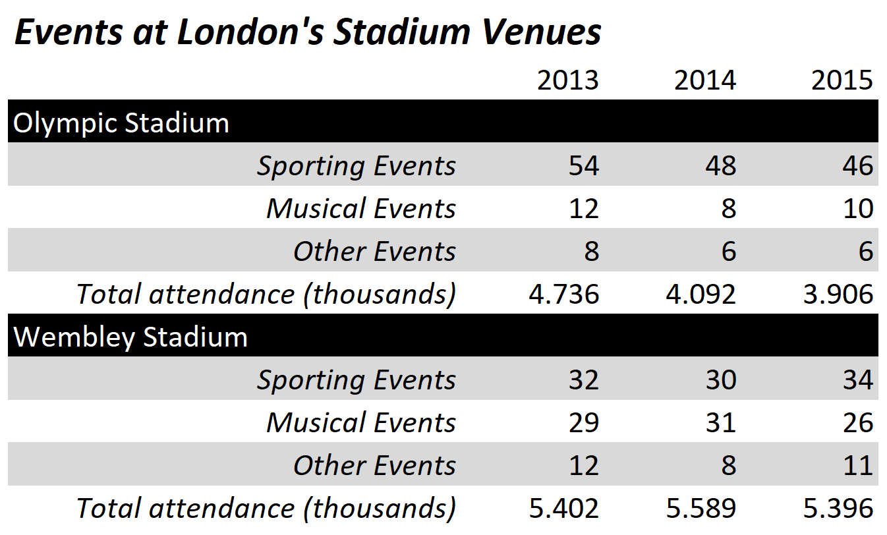

### Opciones disponibles

- **A.** 63.000
- **B.** 84.913
- **C.** 87.000
- **D.** 66.000
- **E.** 64.000

---

### Respuesta y explicacion

La respuesta correcta es la **A**: 63.000

Step 1 : Find the total attendance at events at the Olympic Stadium in 2015: 46+10+6=62.

Step 2 : Find the total attendance at the Olympic Stadium in 2015: 3.906*1.000=3.906.000.

Step 3 : Divide the total attendance by the total number of events: 3.906.000/62=63.000.

## Pregunta 234

Fuente: https://www.epsoprep.com/practice/attempt/en/UXVlc3Rpb25Qb29sQXR0ZW1wdDprSFdqYkw3ZkxFd3Vod2plMHIwTnVn/review?q=1

### Enunciado

Between 1990 and 2011, total emissions dropped by 20%. Between 1990 and 2000, the reduction in waste emissions was 7,5 percentage points greater than between 2000 and 2011. What percentage of total emissions was from waste in 1990?

### Imagen

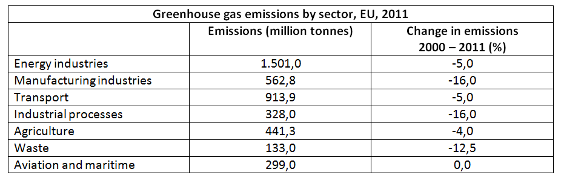

### Opciones disponibles

- **A.** 3,9%
- **B.** 2,8%
- **C.** 3,0%
- **D.** 3,2%
- **E.** 3,6%

---

### Respuesta y explicacion

La respuesta correcta es la **E**: 3,6%

Step 1 – Calculate the total emissions in 2011

1.501,0 + 562,8 + 913,9 + 328,0 + 441,3 + 133,0 + 299,0 = 4.179

Step 2 – Calculate the total emissions in 1990

4.179/0,80 = 5.223,75

Step 3 – Calculate the emissions from waste in 2000 and 1990

2000: 133,0/0,875 = 152 (100 – 12,5 = 87,5%)

1990: 12,5 + 7,5 = 20%

152/0,8 = 190 (100 – 20 = 80%)

Step 4 – Calculate the percentage of total from waste

190/5.223,75 x 100 = 3,630284213 (3,6%)

## Pregunta 235

Fuente: https://www.epsoprep.com/practice/attempt/en/UXVlc3Rpb25Qb29sQXR0ZW1wdDprSFdqYkw3ZkxFd3Vod2plMHIwTnVn/review?q=2

### Enunciado

In the world as a whole, GDP grew by 50% between 2005 and 2012 while GDP per capita grew by 25%. By how much has the population of the world grown in the same period?

### Imagen

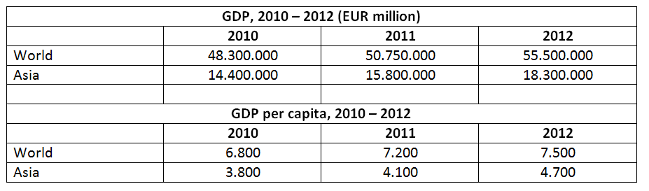

### Opciones disponibles

- **A.** 5%
- **B.** 20%
- **C.** 50%
- **D.** 12,5%
- **E.** 2%

---

### Respuesta y explicacion

La respuesta correcta es la **B**: 20%

Step 1 – Work out the GDP of the world in 2005

55.500.000/1,5 = 37.000.000 million

Step 2 – Work out the GDP per capita in 2005

7.500/1,25 = 6.000

Step 3 – Calculate the population of the world in 2005 and 2012

2005: 37.000.000/6.000 = 6.166,666667 million

2012: 55.500.000/7.500 = 7.400 million

Step 4 – Calculate the difference in world population

7.400/6.166,666667 = 1,2 (20%)

Tip: GDP/population = GDP per capita so GDP/GDP per capita = population.

So as a result, the increase (or decrease) in population is a factor of GDP/GDP per capita.

If the GDP grew by 50% and the GDP per capita grew by 25%, then the population grew by 1,5/1,25 = 1,2 (20%).

## Pregunta 236

Fuente: https://www.epsoprep.com/practice/attempt/en/UXVlc3Rpb25Qb29sQXR0ZW1wdDprSFdqYkw3ZkxFd3Vod2plMHIwTnVn/review?q=3

### Enunciado

If Ireland’s bovine population decreased by 3% between 2006 and 2011, how much did the dairy cow population change in the same period?

### Imagen

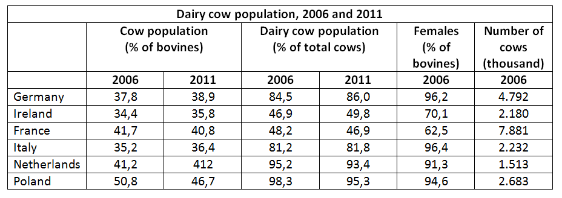

### Opciones disponibles

- **A.** 13,9%
- **B.** 3,0%
- **C.** 6,7%
- **D.** 7,2%
- **E.** 12,4%

---

### Respuesta y explicacion

La respuesta correcta es la **D**: 7,2%

Step 1 – Calculate the bovine population in 2006 and 2011 in Ireland

2006: 2.180/0,344 = 6.337,209302 thousand

2011: 6.337,209302 x 0,97 = 6.147,093023 thousand

Step 2 – Calculate the number of cows in Ireland in 2011

6.147,093023 x 0,358 = 2.200,659302 thousand

Step 3 – Calculate the dairy cow population in 2006 and 2011

2006: 2.180 x 0,469 = 1.022,42

2011: 2.200,659302 x 0,498 = 1.095,928332

Step 4 – Calculate the % change in dairy cows in Ireland between 2006 and 2011

1.095,928332/1.022,42 = 1,071896415 (7,2%)

## Pregunta 237

Fuente: https://www.epsoprep.com/practice/attempt/en/UXVlc3Rpb25Qb29sQXR0ZW1wdDprSFdqYkw3ZkxFd3Vod2plMHIwTnVn/review?q=4

### Enunciado

In 2013 compared to 2012, employment in Bulgaria for the age group 20 to 64 years increased by 640.000. How many more people would have needed to be employed in 2012 in Bulgaria to meet the 2020 target?

### Imagen

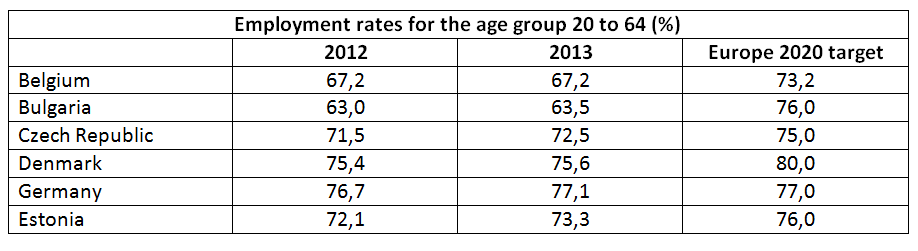

### Opciones disponibles

- **A.** 2.080.000
- **B.** 14.720.000
- **C.** 16.000.0000
- **D.** 2.240.000
- **E.** 16.640.000

---

### Respuesta y explicacion

La respuesta correcta es la **E**: 16.640.000

Step 1 – Work out how much 640.000 people represents as a percentage

640.000 = 0,5% (63,5 – 63,0)

1% is therefore 640.000/0,5 = 1.280.000

Step 2 – Work out the percentage points difference in employment between 2012 and the 2020 target

76,0 – 63,0 = 13,0%

Step 3 – Work out how many people this represents

1.280.000 x 13,0 = 16.640.000

## Pregunta 238

Fuente: https://www.epsoprep.com/practice/attempt/en/UXVlc3Rpb25Qb29sQXR0ZW1wdDprSFdqYkw3ZkxFd3Vod2plMHIwTnVn/review?q=5

### Enunciado

What was the percentage increase in the spending on commercial construction between 2003 and 2007, given that the increase between 2006 and 2007 was 20%?

### Imagen

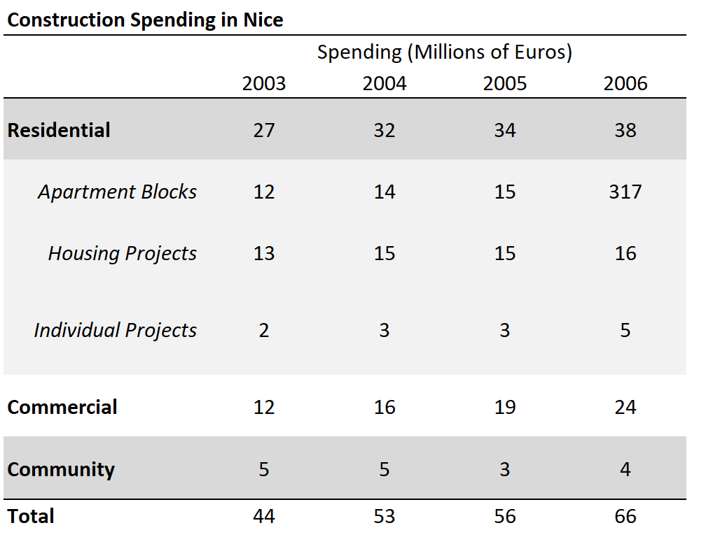

### Opciones disponibles

- **A.** 140%
- **B.** 240%
- **C.** 120%
- **D.** 80%
- **E.** 60%

---

### Respuesta y explicacion

La respuesta correcta es la **A**: 140%

The question is best answered by using percentage multipliers.

Step 1 : Find the multiplier for the increase between 2003 and 2006: 24/12=2.

Step 2 : Find the multiplier for a 20% increase: 1+(20/100)=1,2.

Step 3 : multiply these multipliers together: 2*1,2=2,4.

Step 4 : convert this multiplier to a percentage increase: 100(2,4-1)=140.

## Pregunta 239

Fuente: https://www.epsoprep.com/practice/attempt/en/UXVlc3Rpb25Qb29sQXR0ZW1wdDprSFdqYkw3ZkxFd3Vod2plMHIwTnVn/review?q=6

### Enunciado

What was the difference in crimes reported by the police between Germany and Belgium in 2007?

### Imagen

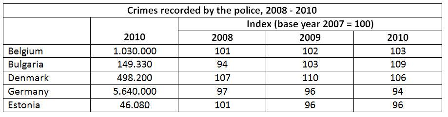

### Opciones disponibles

- **A.** 448%
- **B.** 499%
- **C.** 600%
- **D.** 399%
- **E.** 500%

---

### Respuesta y explicacion

La respuesta correcta es la **E**: 500%

Step 1 – Calculate the crimes recorded by police in Belgium in 2007

1.030.000/1,03 = 1.000.000

(index 103=1,03)

Step 2 – Calculate the crimes recorded by police in Germany in 2007

5.640.000/0,94 = 6.000.000

(index 94=0,94)

Step 3 – Calculate the % difference in crimes recorded between Germany and Belgium

6.000.000/1.000.000 = 6 which equals a 500% increase

Note that the columns for 2008,2009 and 2010 are index numbers as stated above the columns.

## Pregunta 240

Fuente: https://www.epsoprep.com/practice/attempt/en/UXVlc3Rpb25Qb29sQXR0ZW1wdDprSFdqYkw3ZkxFd3Vod2plMHIwTnVn/review?q=7

### Enunciado

How much more did residents of Denmark spend on trips to Spain per night than residents of Belgium?

### Imagen

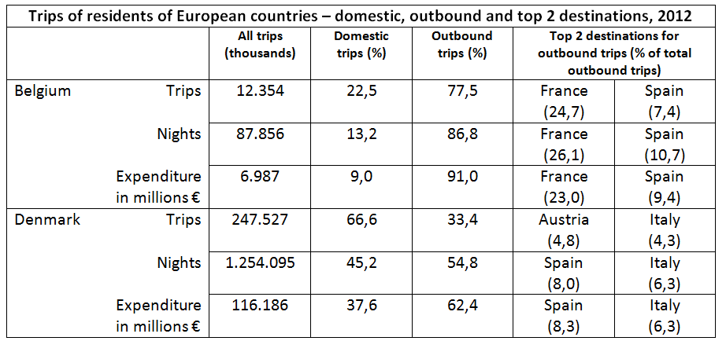

### Opciones disponibles

- **A.** €4,9
- **B.** €36
- **C.** €48
- **D.** €260
- **E.** €12

---

### Respuesta y explicacion

La respuesta correcta es la **B**: €36

Step 1 – Work out the total nights spent in Spain and the total expenditure in Spain by residents of Belgium and then the average spend per night

Nights: 87.856 x 0,868 x 0,107 = 8.159,713856 thousand

Expenditure: 6.987 x 0,91 x 0,094 = 597,66798 million

Average spend/per night: 597,66798/8.159,713856 x 1.000 = 73,2461935

Step 2 – Work out the total nights spent in Spain and the total expenditure in Spain by residents of Denmark

Nights: 1.254.095 x 0,548 x 0,08 = 54.979,5248 thousand

Expenditure: 116.186 x 0,624 x 0,083 = 6.017,505312 million

Average spend/per night: 6.017,505312/54.979,5248 x 1.000 = 109,4499331

Step 3 – Calculate the difference between the average spend between Denmark and Belgium

109,4499331 – 73,2461935 = 36,20373961

## Pregunta 241

Fuente: https://www.epsoprep.com/practice/attempt/en/UXVlc3Rpb25Qb29sQXR0ZW1wdDprSFdqYkw3ZkxFd3Vod2plMHIwTnVn/review?q=8

### Enunciado

What was the percentage increase in users of the tennis courts from January to April, given that the increase in users between March and April was 100%?

### Imagen

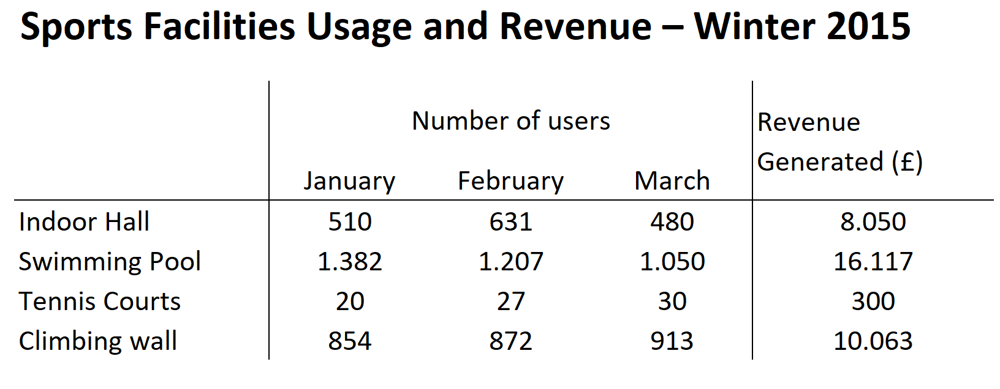

### Opciones disponibles

- **A.** 200%
- **B.** 300%
- **C.** 150%
- **D.** 75%
- **E.** 400%

---

### Respuesta y explicacion

La respuesta correcta es la **A**: 200%

The question is best answered by using percentage multipliers.

Step 1 : Find the multiplier for the increase between January and March: 30/20=1,5.

Step 2 : Find the multiplier for a 100% increase: 1+(100/100)=2.

Step 3 : multiply these multipliers together: 1,5*2=3.

Step 4 : convert this multiplier to a percentage increase: 100(3-1)=200.

Remember: a three fold increase does not equal 300% but a 200% increase.

## Pregunta 242

Fuente: https://www.epsoprep.com/practice/attempt/en/UXVlc3Rpb25Qb29sQXR0ZW1wdDprSFdqYkw3ZkxFd3Vod2plMHIwTnVn/review?q=9

### Enunciado

What was the percentage difference in the average number of passengers per flight in Frankfurt Main between 2009 and 2010?

### Imagen

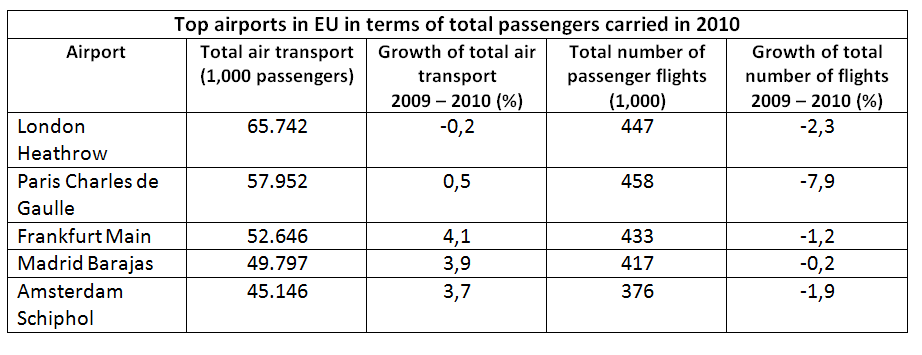

### Opciones disponibles

- **A.** 5,95% increase
- **B.** 2,90% increase
- **C.** 5,36% increase
- **D.** 5,95% decrease
- **E.** 5,36% decrease

---

### Respuesta y explicacion

La respuesta correcta es la **C**: 5,36% increase

Step 1 – Calculate the total air transport in 2009 in Frankfurt

52.646/1,041 = 50.572,52642 thousand

Step 2 – Calculate the total number of passenger flights in Frankfurt in 2009

100 – 1,2 = 98,8%

433/0,988 = 438,2591093 thousand

Step 3 – Calculate the average number of passengers per flight in 2009 and 2010

2009: 50.572,52642/438,2591093 = 115,394125

2010: 52.646/433 = 121,5842956

Step 4 – Calculate the percentage difference between 2009 and 2010

121,5842956/115,394125 = 1,053643724 (5,36% increase)

## Pregunta 243

Fuente: https://www.epsoprep.com/practice/attempt/en/UXVlc3Rpb25Qb29sQXR0ZW1wdDprSFdqYkw3ZkxFd3Vod2plMHIwTnVn/review?q=10

### Enunciado

What was the percentage growth in spending on full-time unemployment benefits between 2008 and 2011?

### Imagen

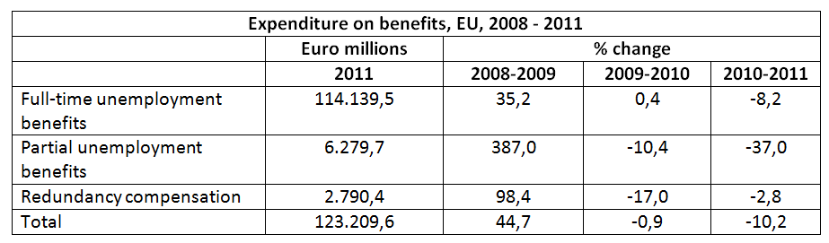

### Opciones disponibles

- **A.** 9,1%
- **B.** 11,2%
- **C.** 35,8%
- **D.** 20,1%
- **E.** 24,6%

---

### Respuesta y explicacion

La respuesta correcta es la **E**: 24,6%

Step 1 – Calculate the benefit paid in 2010

100 – 8,2 = 91,8%

114.139,5/0,918 = 124.334,9673 million

Step 2 – Calculate the benefit paid in 2009

100 + 0,4 = 100,4%

124.334,9673/1,004 = 123.839,6089 million

Step 3 – Calculate the benefit paid in 2008

100 + 35,2 = 135,2

123.839,6089/1,352 = 91.597,34383 million

Step 4 – Work out the % growth in benefit paid between 2008 and 2011

114.139,5/91.597,34383 = 1,246100544 (24,6%)

## Pregunta 244

Fuente: https://www.epsoprep.com/practice/attempt/en/UXVlc3Rpb25Qb29sQXR0ZW1wdDprSFdqYkw3ZkxFd3Vod2plMHIwTnVn/review?q=11

### Enunciado

Given that people aged 0-24 years make up 15% of the total EU population and people aged 25-54 years make up 65% of the total EU population, what percentage of the total who used the internet at least once a week were aged 55+?

### Imagen

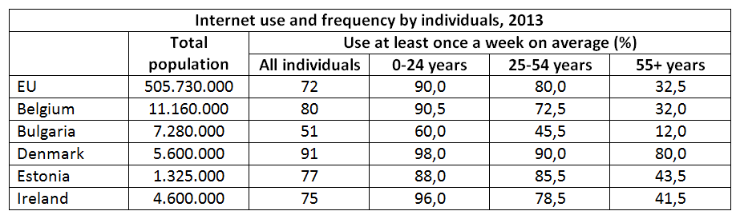

### Opciones disponibles

- **A.** 19,1%
- **B.** 9,0%
- **C.** 29,2%
- **D.** 10,3%
- **E.** 4,6%

---

### Respuesta y explicacion

La respuesta correcta es la **B**: 9,0%

Step 1 – Calculate the percentage of people aged 55+ in the EU and from this the number

100 – (15 + 65) = 20%

505.730.000 x 0,2 = 101.146.000

Step 2 – Calculate the percentage of people aged 55+ who use the internet at least once a week

101.146.000 x 0,325 = 32.872.450

Step 3 – Work out total individuals who use the internet at least once a week

505.730.000 x 0,72 = 364.125.600

Step 4 – Work out the % of total who use internet at least once a week who are aged 55+

32.872.450/364.125.600 x 100 = 9,027777778%

## Pregunta 245

Fuente: https://www.epsoprep.com/practice/attempt/en/UXVlc3Rpb25Qb29sQXR0ZW1wdDprSFdqYkw3ZkxFd3Vod2plMHIwTnVn/review?q=12

### Enunciado

What was the percentage change in nights spent across both tourist accommodation and hotels in Belgium between 2012 and 2013?

### Imagen

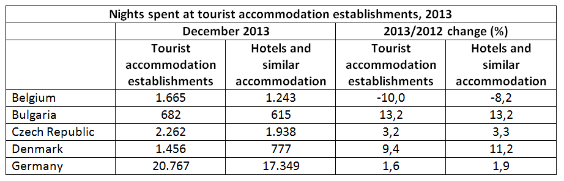

### Opciones disponibles

- **A.** -9,2%
- **B.** -90,8%
- **C.** -9,1%
- **D.** -10,2%
- **E.** 10,2%

---

### Respuesta y explicacion

La respuesta correcta es la **A**: -9,2%

Step 1 – Calculate the nights spent in tourist accommodation establishments in 2012 in Belgium

1.665/0,9 = 1.850 (100 – 10 = 90%)

Step 2 – Calculate the nights spent in hotels in 2012 in Belgium

100 – 8,2 = 91,8%

1.243/0,918 = 1.354,030501

Step 3 – Total the nights spent in both forms of accommodation in 2012 and 2013

2012: 1.850 + 1.354,030501 = 3.204,030501 nights

2013: 1.665 + 1.243 = 2.908 nights

Step 4 – Calculate the percentage change between 2012 and 2013

2.908/3.204,030501 x 100 = 90,76068405%

100 - 90,76068405 = 9,239315946% decrease

## Pregunta 246

Fuente: https://www.epsoprep.com/practice/attempt/en/UXVlc3Rpb25Qb29sQXR0ZW1wdDprSFdqYkw3ZkxFd3Vod2plMHIwTnVn/review?q=13

### Enunciado

Given that tax revenue increased by 35% in Spain between 2002 and 2012, what was the change in GDP in Spain in the same period

### Imagen

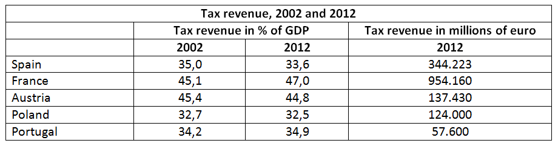

### Opciones disponibles

- **A.** 40,6%
- **B.** 34,3%
- **C.** 34,5%
- **D.** 41,7%
- **E.** 29,6%

---

### Respuesta y explicacion

La respuesta correcta es la **A**: 40,6%

Step 1 – Calculate the tax revenue in Spain in 2002

344.223/1,35 = 254.980

Step 2 – Calculate the GDP in Spain in 2002 and 2012

2002: 254.980/0,35= 728.514,2857

2012: 344.223/0,336 = 1.024.473,214

Step 3 – Calculate the percentage change in GDP in Spain between 2002 and 2012

1.024.473,214/728.514,2857 = 1,40625 (40,6%)

## Pregunta 247

Fuente: https://www.epsoprep.com/practice/attempt/en/UXVlc3Rpb25Qb29sQXR0ZW1wdDprSFdqYkw3ZkxFd3Vod2plMHIwTnVn/review?q=14

### Enunciado

In 2013, the seven countries in the table below accounted for 77% of total EU28 CO2 emissions in 2013. Total emissions in 2012 were 3.439 million tons. What percentage did these countries make up of the total in 2012?

### Imagen

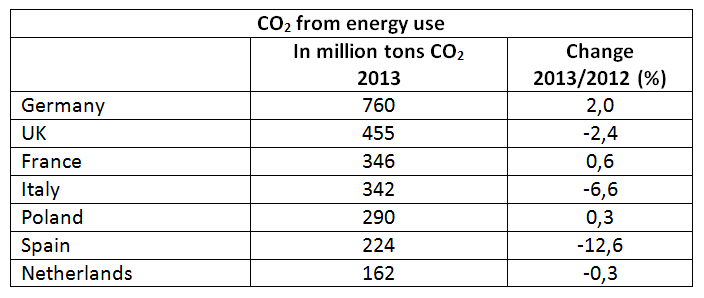

### Opciones disponibles

- **A.** 72%
- **B.** 76%
- **C.** 78%
- **D.** 73%
- **E.** 79%

---

### Respuesta y explicacion

La respuesta correcta es la **B**: 76%

Step 1 – Calculate the emissions in these countries in 2012

Germany :760/1,02 = 745,0980392

UK : 455/0,976 = 466,1885246 (100 – 2,4 = 97,6)

France : 346/1,006 = 343,9363817

Italy : 342/0,934 = 366,1670236

Poland : 290/1,003 = 289,1326022

Spain : 224/0,874 = 256,2929062

Netherlands : 162/.997 = 162,4874624

Step 2 – Add up the total

745,0980392 + 466,1885246 + 343,9363817 + 366,1670236 + 289,1326022 + 256,2929062 +162,4874624 = 2629,30294

Step 3 – Calculate the % share of the total emissions these countries made in 2012

2629,30294/3.439 x 100 = 76,45545042%

## Pregunta 248

Fuente: https://www.epsoprep.com/practice/attempt/en/UXVlc3Rpb25Qb29sQXR0ZW1wdDprSFdqYkw3ZkxFd3Vod2plMHIwTnVn/review?q=15

### Enunciado

Between 2010 and 2012, expenditure on public order and safety in Switzerland grew by 21%, a 0,1 percentage point increase in GDP and a 1 percentage point increase in total expenditure. What was total government expenditure as a percentage of GDP in Switzerland in 2012?

### Imagen

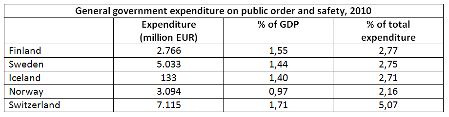

### Opciones disponibles

- **A.** 8,7%
- **B.** 29,8%
- **C.** 11,0%
- **D.** 78,9%
- **E.** 33,7%

---

### Respuesta y explicacion

La respuesta correcta es la **B**: 29,8%

Step 1 – Calculate expenditure on public order and safety in Switzerland in 2012

7.115 x 1,21 = 8.609,15 million

Step 2 – Calculate the GDP in Switzerland in 2012

1,71 + 0,1 = 1,81%

8.609,15/0,0181 = 475.643,6464 million

Step 3 – Calculate total government expenditure in Switzerland in 2012

5,07 +1,0 = 6,07%

8.609,15/0,0607 = 141.831,1367 million

Step 4 – Calculate total government expenditure as a % of GDP in Switzerland in 2012

141.831,1367/475.643,6464 x 100 = 29,81878089 (29,8%)

## Pregunta 249

Fuente: https://www.epsoprep.com/practice/attempt/en/UXVlc3Rpb25Qb29sQXR0ZW1wdDprSFdqYkw3ZkxFd3Vod2plMHIwTnVn/review?q=16

### Enunciado

Given the GDP in the EU18 was 2.937.500 million EUR in Q4 2013, what was the GDP in Q3 2012?

### Imagen

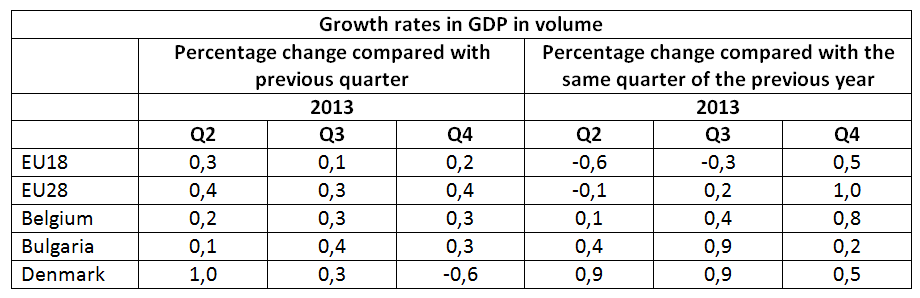

### Opciones disponibles

- **A.** 2.919.957 million EUR
- **B.** 2.943.375 million EUR
- **C.** 2.934.545 million EUR
- **D.** 2.940.458 million EUR
- **E.** 2.922.886 billion EUR

---

### Respuesta y explicacion

La respuesta correcta es la **D**: 2.940.458 million EUR

Step 1 – Calculate the GDP in EU18 in Q3 2013

2.937.500/1,002 = 2.931.636,727

Step 2 – Calculate the GDP in EU18 in Q3 2012

2.931.636,727/0,997 = 2.940.458,101 (100 – 0,3 = 99,7%)

## Pregunta 250

Fuente: https://www.epsoprep.com/practice/attempt/en/UXVlc3Rpb25Qb29sQXR0ZW1wdDprSFdqYkw3ZkxFd3Vod2plMHIwTnVn/review?q=17

### Enunciado

In 2011 in the EU28, 3 in 25 people were aged 15 – 24 while in Algeria 1 in 5 people were aged 15 – 24 years. In 2006 in EU28 the share of the population aged 15 – 24 was 0,6 percentage points higher than in 2011 while in Algeria the share of the population aged 15 – 24 was 2 percentage points higher than in 2011. How much bigger was the EU28 than Algeria in 2006?

### Imagen

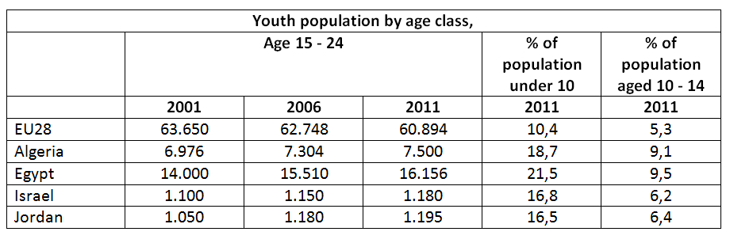

### Opciones disponibles

- **A.** 16 times
- **B.** 15 times
- **C.** 14 times
- **D.** 13 times
- **E.** 12 times

---

### Respuesta y explicacion

La respuesta correcta es la **B**: 15 times

Step 1 – Work out the percentage share of population aged 15 – 24 in EU and Algeria in 2011

EU: 3 in 25 = 12 in 100 = 12%

Algeria: 1 in 5 = 20 in 100 = 20%

Step 2 – Work out the percentage share of population aged 15 – 24 in EU and Algeria in 2006

EU: 12 + 0,6 = 12,6%

Algeria: 20 + 2 = 22%

Step 3 – Calculate the total population in EU and Algeria in 2006

EU: 62.748/0,126 = 498.000

Algeria: 7.304/0,22 = 33.200

Step 4 – Work out how much bigger the EU was than Algeria in 2006

498.000/33.200 = 15 times

## Pregunta 251

Fuente: https://www.epsoprep.com/practice/attempt/en/UXVlc3Rpb25Qb29sQXR0ZW1wdDprSFdqYkw3ZkxFd3Vod2plMHIwTnVn/review?q=18

### Enunciado

Given that the EU population grew by 2,5% between 2005 and 2010, how many prisoners were there in the EU in 2005?

### Imagen

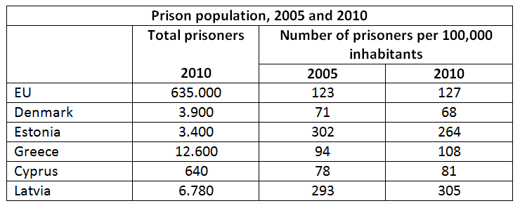

### Opciones disponibles

- **A.** 590.000
- **B.** 650.000
- **C.** 600.000
- **D.** 620.000
- **E.** 580.000

---

### Respuesta y explicacion

La respuesta correcta es la **C**: 600.000

Step 1 – Calculate the EU population in 2010

Number of prisoners/(population/100.000) = number of prisoners per 100.000 inhabitants

So number of prisoners/number of prisoners per 100.000

inhabitants = population/100.000

635.000/127 = 5.000 (which is 500 million inhabitants)

Step 2 – Calculate the EU population in 2005

5000/1,025 = 4.878,04878 (which is 487,804878 million inhabitants)

1,025 here represents the 2,5% population growth. Remember, we need to find the number that grew by 2,5% and resulted in 5000 million inhabitants. So, X *1,025 =5000 million. That is done by dividing the result (5000) with the percent it grow by. Not by simply multiplying 5000 with (1-0,025)

Step 3 – Calculate the number of prisoners in 2005

Number of prisoners per 100.000 inhabitants x population/100.000 = number of prisoners

So 123 x 4.878,04878 = 600.000

Note: You can also work this out as follows: 127/123 = 1,032520325 % change in prison population per 100.000 between 2005 and 2010

1,032520325 x 1,025 = 1,058333333 combined with the percentage change in population between 2005 and 2010

635.000/1,058333333 = 600.000

## Pregunta 252

Fuente: https://www.epsoprep.com/practice/attempt/en/UXVlc3Rpb25Qb29sQXR0ZW1wdDprSFdqYkw3ZkxFd3Vod2plMHIwTnVn/review?q=19

### Enunciado

In Belgium in 2012, the average length of domestic trips was 4,26 nights. What was the average length of non-domestic trips?

### Imagen

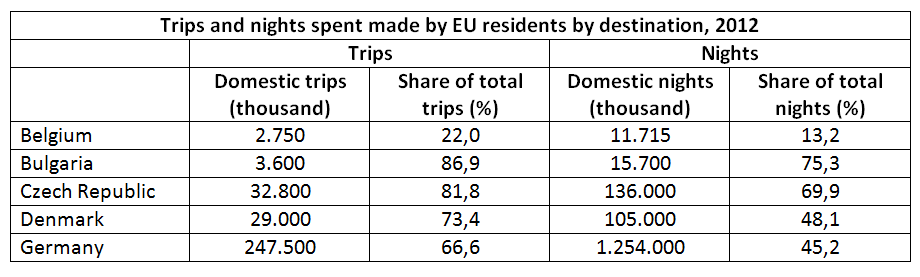

### Opciones disponibles

- **A.** 3,5 nights
- **B.** 8,3 nights
- **C.** 4,7 nights
- **D.** 7,1 nights
- **E.** 7,9 nights

---

### Respuesta y explicacion

La respuesta correcta es la **E**: 7,9 nights

Step 1 – Calculate the total number of trips and from this the number of non-domestic trips

2.750/0,22 = 12.500

12.500 x 0,78 = 9.750 (100 – 22 = 78%)

Or 12.500 – 2.750 = 9.750

Step 2 – Calculate the total number of nights and from this the number of non-domestic nights

11.715/0,132 = 88.750

88.750 x 0,868 = 77.035 (100 – 13,2 = 86,8%)

Or 88.750 – 11.715 = 77.035

Step 3 – Calculate the average number of nights spent on non-domestic trips

77.035/9.750 = 7,901025641 nights

## Pregunta 253

Fuente: https://www.epsoprep.com/practice/attempt/en/UXVlc3Rpb25Qb29sQXR0ZW1wdDprSFdqYkw3ZkxFd3Vod2plMHIwTnVn/review?q=20

### Enunciado

Of the total 250.000 million vehicle loads in Poland in 2007, 50.000 million were for international transport with an average vehicle load of 15,4 tonnes. The remaining vehicle loads were for national transport. What was the average vehicle load for national transport in Poland in 2007?

### Imagen

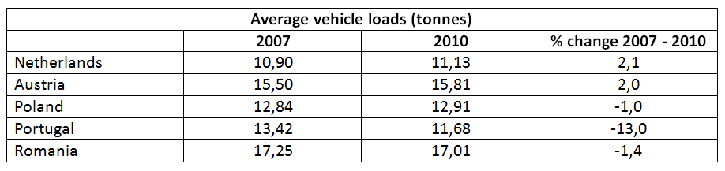

### Opciones disponibles

- **A.** 15,8 tonnes
- **B.** 11,7 tonnes
- **C.** 13,6 tonnes
- **D.** 12,2 tonnes
- **E.** 14,1 tonnes

---

### Respuesta y explicacion

La respuesta correcta es la **D**: 12,2 tonnes

Step 1 – Calculate the total vehicle loads in tonnes in Poland in 2007

12,84 x 250.000 = 3.210.000 million

Step 2 – Calculate the total vehicle loads in tonnes for international transport in Poland in 2007

15,4 x 50.000 = 770.000 million

Step 3 – Calculate the total vehicle loads in tonnes for national transport in Poland in 2007

3.210.000 – 770.000 = 2.440.000 million

Step 4 – Work out the average vehicle load for national transport

2.440.000/200.000 = 12,2 tonnes

## Pregunta 254

Fuente: https://www.epsoprep.com/practice/attempt/en/UXVlc3Rpb25Qb29sQXR0ZW1wdDprSFdqYkw3ZkxFd3Vod2plMHIwTnVn/review?q=21

### Enunciado

Expenditure on education grew by 5,7% between 2011 and 2012 in the UK. What was the GDP in the UK in 2011?

### Imagen

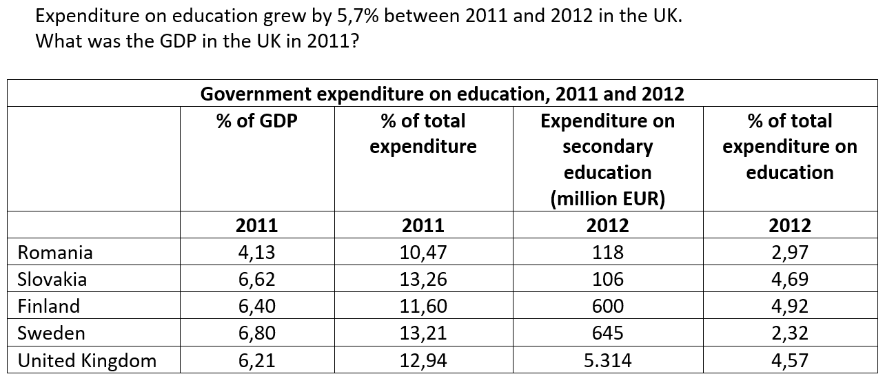

### Opciones disponibles

- **A.** 850.151,86 million EUR
- **B.** 1.771.490,23 million EUR
- **C.** 1.871.490,34 million EUR
- **D.** 625.634,57 million EUR
- **E.** 1.872.465,41 million EUR

---

### Respuesta y explicacion

La respuesta correcta es la **B**: 1.771.490,23 million EUR

Step 1 – Calculate the total amount spent on education in 2012

5.314/0,0457 = 116.280,0875 million

Step 2 – Calculate the total amount spent on education in 2011

116.280,0875/1,057 = 110.009,5435 million

Step 3 – Work out the GDP in the UK in 2011

110.009,5435/0,0621 = 1.771.490,23 million

## Pregunta 255

Fuente: https://www.epsoprep.com/practice/attempt/en/UXVlc3Rpb25Qb29sQXR0ZW1wdDprSFdqYkw3ZkxFd3Vod2plMHIwTnVn/review?q=22

### Enunciado

In 2013, in Sweden, 74,6% of men aged between 15 and 64 years were employed. What percentage of women aged between 15 and 64 years were employed in Sweden?

### Imagen

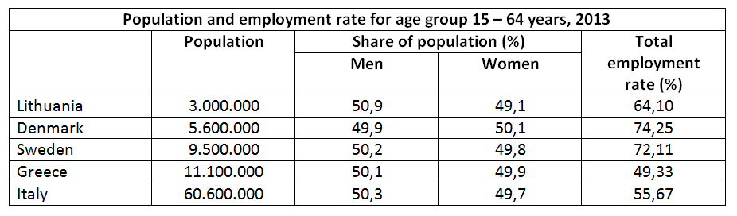

### Opciones disponibles

- **A.** 69,6%
- **B.** 73,5%
- **C.** 72,2%
- **D.** 67,8%
- **E.** 68,4%

---

### Respuesta y explicacion

La respuesta correcta es la **A**: 69,6%

Step 1 – Calculate the total population employed in Sweden

9.500.000 x 0,7211 = 6.850.450

Step 2 – Calculate the total male population (15 – 64) in Sweden and from this the female population

Male: 9.500.000 x 0,502 = 4.769.000

Female: 9.500.000 – 4.769.000 = 4.731.000

Step 3 – Work out the total male population employed and from this the total female population employed

Male: 4.769.000 x 0,746 = 3.557.674

Female: 6.580.450 – 3.557.674 = 3.292.776

Step 4 – Work out the percentage of women aged 15 – 64 that were employed

3.292.776/4.731.000 x 100 = 69,6%

## Pregunta 256

Fuente: https://www.epsoprep.com/practice/attempt/en/UXVlc3Rpb25Qb29sQXR0ZW1wdDprSFdqYkw3ZkxFd3Vod2plMHIwTnVn/review?q=23

### Enunciado

A chain of supermarkets in a US city records the number of customers and the total spent by customers each year at different branches. Between 2010 and 2015 the number of customers at the Green Park store increased by one third, while the customer spending at the same store increased by 20%. By how many dollars did the average amount spent by each customer at the Green Park store decrease in that period?

### Imagen

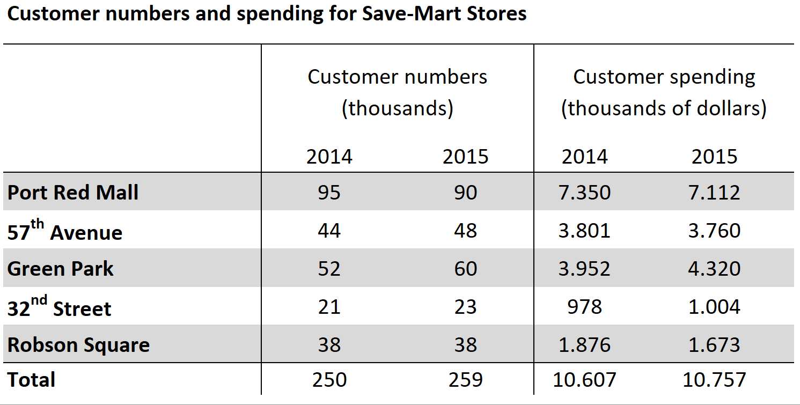

### Opciones disponibles

- **A.** $8
- **B.** $7
- **C.** $6
- **D.** $5
- **E.** $9

---

### Respuesta y explicacion

La respuesta correcta es la **A**: $8

Step 1 : Calculate the average spending per customer in 2015: We may just divide the relevant figures from the table as both figures are in thousands: 4.320/60=72.

Step 2 : Calculate the multiplier for an increase of 1/3: 1+(1/3)=4/3.

Step 3 : calculate the number of customers in 2010: 60/(4/3)=(3/4)*60=45.

Step 4 : Calculate the percentage multiplier for a 20% increase: 1+(20/100)=1.2.

Step 5 : Calculate the customer spending in 2010: 4.320/1,2=3.600.

Step 6 : Calculate the average spending per customer in 2010: 3.600/45=80.

Step 7 : Calculate the decrease in spending per customer: 80-72=8 dollars.

Tip: As both customer numbers and customer spending are stated in thousands you can save time by for example only writing 42 instead of 42.000 in the calculator.

## Pregunta 257

Fuente: https://www.epsoprep.com/practice/attempt/en/UXVlc3Rpb25Qb29sQXR0ZW1wdDprSFdqYkw3ZkxFd3Vod2plMHIwTnVn/review?q=24

### Enunciado

If Spain’s total area given to oil seeds rose by 2% between 2000 and 2007, how much did the organic area specialising in sunflowers increase during this period?

### Imagen

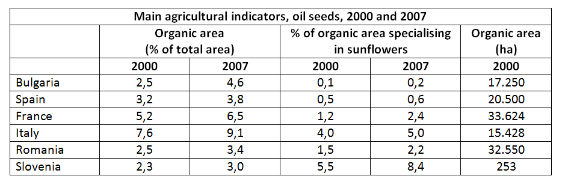

### Opciones disponibles

- **A.** 21%
- **B.** 3%
- **C.** 16%
- **D.** 58%
- **E.** 45%

---

### Respuesta y explicacion

La respuesta correcta es la **E**: 45%

Step 1 – Calculate the total area given to oil seeds in 2000 and 2007

2000: 20.500/0,032 = 640.625

2007: 640.625 x 1,02 = 653.437,5

Step 2 – Calculate the organic area given to oil seeds in 2007

653.437,5 x 0,038 = 24.830,625

Step 3 – Work out how much was given to sunflowers in 2000 and 2007

2000: 20.500 x 0,005 = 102,5

2007: 24.830,625 x 0,006 = 148,98375

Step 4 – Calculate the increase in organic sunflower production between 2000 and 2007

148,98375/102,5 = 1,4535 (45%)

## Pregunta 258

Fuente: https://www.epsoprep.com/practice/attempt/en/UXVlc3Rpb25Qb29sQXR0ZW1wdDprSFdqYkw3ZkxFd3Vod2plMHIwTnVn/review?q=25

### Enunciado

In the EU27 despite the decline in the number of cows by 16% between 2001 and 2011, the production of milk increased by 1,5% in the same period. By what percentage did the average cows’ milk yield increase between 2001 and 2011?

### Imagen

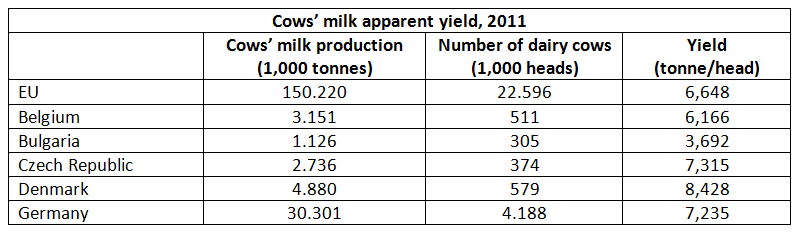

### Opciones disponibles

- **A.** 21,6%
- **B.** 20,4%
- **C.** 22,3%
- **D.** 20,8%
- **E.** 19,7%

---

### Respuesta y explicacion

La respuesta correcta es la **D**: 20,8%

Step 1 – Calculate the number of dairy cows in 2001 in the EU

22.596/0,84 = 26.900 (100 – 16 = 84%)

Step 2 – Calculate the milk production in 2001 in the EU

150.220/1,015 = 148.000

Step 3 – Calculate the yield in 2001 in the EU

148.000/26.900 = 5,501858736

Step 4 – Calculate the percentage increase between 2001 and 2011

6,648/5,501858736 = 1,208318919 (20,8%)

## Pregunta 259

Fuente: https://www.epsoprep.com/practice/attempt/en/UXVlc3Rpb25Qb29sQXR0ZW1wdDprSFdqYkw3ZkxFd3Vod2plMHIwTnVn/review?q=26

### Enunciado

In 2009, 2.000.000 children under 18 lacked fruit and vegetables in the EU. Given the EU population, aged 18 and under grew by 2% between 2009 and 2011, how many children under 18 were at risk of poverty in the EU in 2011?

### Imagen

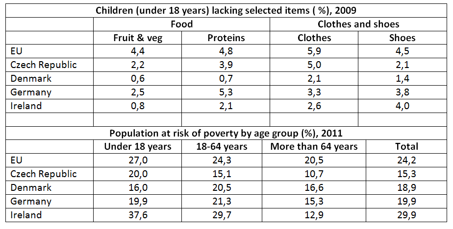

### Opciones disponibles

- **A.** 12,5 million
- **B.** 12,3 million
- **C.** 12,1 million
- **D.** 12,7 million
- **E.** 11,9 million

---

### Respuesta y explicacion

La respuesta correcta es la **A**: 12,5 million

Step 1 – Calculate the number of children under 18 in the EU in 2009

2.000.000/0,044 = 45.454.545,45

Step 2 – Calculate the population under 18 in the EU in 2011

45.454.545,45 x 1,02 = 46.363.636,36

Step 3 – Calculate the number of children under 18 at risk of poverty in 2011

46.363.636,36 x 0,27 = 12.518.181,82

## Pregunta 260

Fuente: https://www.epsoprep.com/practice/attempt/en/UXVlc3Rpb25Qb29sQXR0ZW1wdDprSFdqYkw3ZkxFd3Vod2plMHIwTnVn/review?q=27

### Enunciado

If Greece’s GDP shrunk by 2% between 2009 and 2010, how much did tax revenue from income tax decrease during this period?

### Imagen

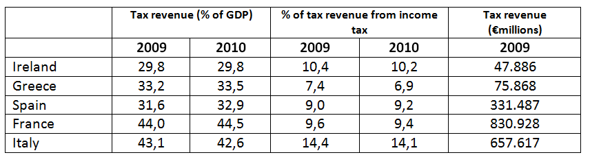

### Opciones disponibles

- **A.** 12,79%
- **B.** 4,13%
- **C.** 7,82%
- **D.** 3,04%
- **E.** 5,44%

---

### Respuesta y explicacion

La respuesta correcta es la **C**: 7,82%

Step 1 – Calculate GDP in Greece in 2009

75.868/0,332 = 228.518,0723 million

Step 2 – Calculate the GDP in Greece in 2010

228.518,0723 x 0,98 = 223.947,7108 million

Step 3 – Calculate the tax revenue in Greece in 2010

223.947,7108 x 0,335 = 75.002,48313 million

Step 4 – Work out the tax revenue from income tax in 2009 and from this the % change

2009: 75.868 x 0,074 = 5.614,232

2010: 75.002,48313 x 0,069 = 5.175,171336

% change: 5.175,171336/5.614,232 = 0,9217950623

1 - 0,9217950623 = 0,07820493774 (7,8% decrease)

## Pregunta 261

Fuente: https://www.epsoprep.com/practice/attempt/en/UXVlc3Rpb25Qb29sQXR0ZW1wdDprSFdqYkw3ZkxFd3Vod2plMHIwTnVn/review?q=28

### Enunciado

What was the average inflation rate in Belgium in the 8 months between May and December 2013?

### Imagen

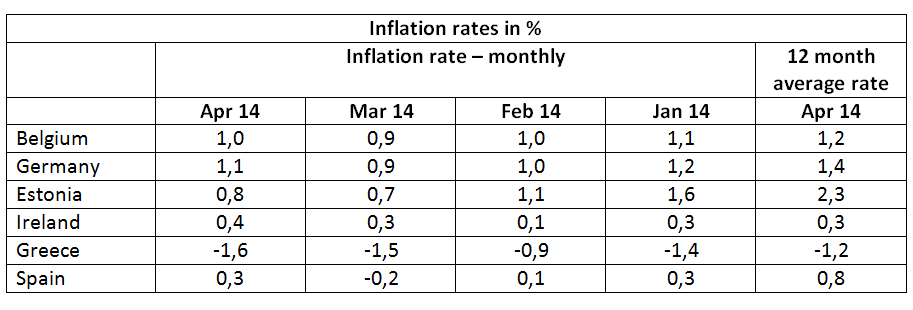

### Opciones disponibles

- **A.** 1,3
- **B.** 1,0
- **C.** 1,1
- **D.** 1,2
- **E.** 0,9

---

### Respuesta y explicacion

La respuesta correcta es la **A**: 1,3

Step 1 – Calculate the total inflation rate over 12 months between May 2013 and Apr 2014 in Belgium

1,2 x 12 = 14,4

Step 2 – Calculate the total inflation rate in the four months Jan – Apr 2014

1,0 + 0,9 +1,0 +1,1 = 4,0

Step 3 – Calculate the total inflation rate between May 2013 and Dec 2013

14,4 – 4,0 = 10,4

Step 4 – Work out the average inflation rate between May and Dec 2013

10,4/8 = 1,3

## Pregunta 262

Fuente: https://www.epsoprep.com/practice/attempt/en/UXVlc3Rpb25Qb29sQXR0ZW1wdDprSFdqYkw3ZkxFd3Vod2plMHIwTnVn/review?q=29

### Enunciado

The total crop output value was 43.890 million euro in 2012 at a price of EUR 13,2 thousand per tonne. What was the difference in the total crop value between 2011 and 2012?

### Imagen

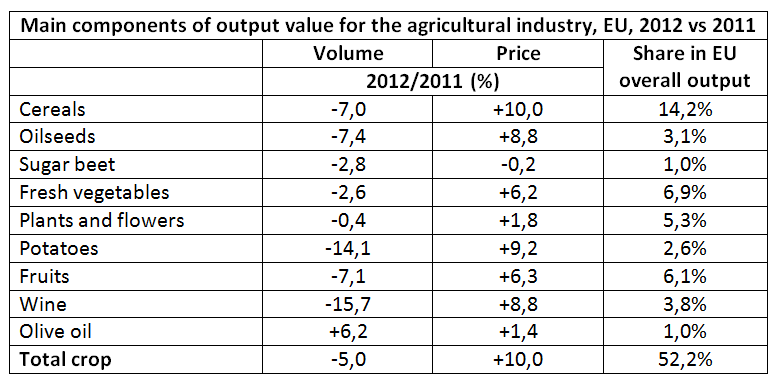

### Opciones disponibles

- **A.** +5,0%
- **B.** +4,5%
- **C.** +5,2%
- **D.** -4,5%
- **E.** -5,0%

---

### Respuesta y explicacion

La respuesta correcta es la **B**: +4,5%

Step 1 – Calculate the total crop volume in 2012

43.890/13,2 = 3.325 thousand tonnes (million/thousand = thousand)

Step 2 – Calculate the total crop volume in 2011

3.325/0,95 = 3.500 thousand tonnes

Step 3 – Work out the price in 2011

13,2/1,1 = EUR 12 thousand per tonne

Step 4 – Calculate the total crop output in 2011 and from this the difference between 2011 and 2012

3.500 x 12 = 42.000 million tonnes

43.890/42.000 = 1,045 (4,5% increase)

## Pregunta 263

Fuente: https://www.epsoprep.com/practice/attempt/en/UXVlc3Rpb25Qb29sQXR0ZW1wdDprSFdqYkw3ZkxFd3Vod2plMHIwTnVn/review?q=30

### Enunciado

In 2013 in Denmark, there were 2.805.600 men aged 15 -64 years making up 50,1% of the total population in that age group. How much more did men of that age, as a group earn on average per month than women of the same group in Denmark?

### Imagen

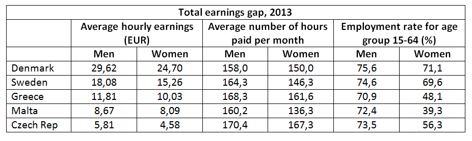

### Opciones disponibles

- **A.** 1,6 thousand million EUR
- **B.** 3,2 thousand million EUR
- **C.** 2,8 thousand million EUR
- **D.** 2,6 thousand million EUR
- **E.** 1,8 thousand million EUR

---

### Respuesta y explicacion

La respuesta correcta es la **D**: 2,6 thousand million EUR

Step 1 – Work out the total population (15 – 64) and from this the total female population

2.805.600/0,501 = 5.600.000

So 5.600.000 x 0,499 = 2.794.400 (or 5.600.000 – 2.805.600 = 2.794.400)

Step 2 – Calculate the average monthly earnings in the male working population

2.805.600 x 29,62 x 158 x 0,756 = 9.926.352.407

Step 3 – Calculate the average monthly earnings in the female population

2.794.400 x 24,7 x 150 x 0,711 = 7.361.162.172

Step 4 – Work out the difference in earnings

9.926.352.407 - 7.361.162.172 = 2.565.190.235 EUR

## Pregunta 264

Fuente: https://www.epsoprep.com/practice/attempt/en/UXVlc3Rpb25Qb29sQXR0ZW1wdDprSFdqYkw3ZkxFd3Vod2plMHIwTnVn/review?q=31

### Enunciado

In 2012 compared to 2011, GDP in Belgium dropped by 327,6 million euros. What was the difference in GDP in Belgium between 2009 and 2012?

### Imagen

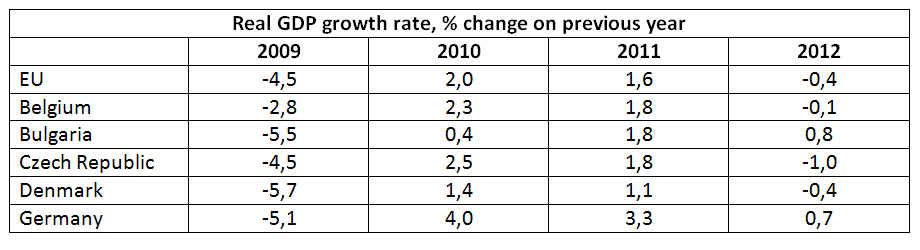

### Opciones disponibles

- **A.** 13.028 million
- **B.** 3.638 million
- **C.** 14.286 million
- **D.** 12.700 million
- **E.** 5.465 million

---

### Respuesta y explicacion

La respuesta correcta es la **D**: 12.700 million

Step 1 – Work out the GDP in Belgium in 2012 and 2011

327,6 represents a 0,1% drop

So 3.276 = 1%

And 3.276 x 99,9 = 327.272,4 million (100 – 0,1 = 99,9%) is GDP in 2012

From above, we can see that the GDP in 2011 was:

3.276 x 100 = 327.600 million

Step 2 – Work out the GDP in 2010

327.600 represents a 1,8% growth between 2010 and 2011

So 327.600/1,018 = 321.807,4656 million

Step 3 – Work out the GDP in 2009

321.807,4656 represents a 2,3% growth between 2009 and 2010

so 321.807,4656/1,023 = 314.572,3027 million

Step 4 – Calculate the difference between 2012 and 2009

327.272,4 – 314.572,3027 = 12.700,0973 million

## Pregunta 265

Fuente: https://www.epsoprep.com/practice/attempt/en/UXVlc3Rpb25Qb29sQXR0ZW1wdDprSFdqYkw3ZkxFd3Vod2plMHIwTnVn/review?q=32

### Enunciado

In 2010 in the EU, 7.400 large enterprises with e-commerce made a turnover of 45.000.000 EUR. The total number of large enterprises in 2010 is at the same level as 2008 but large enterprise turnover from e-commerce has increased by 20% in the same period. What was the average total turnover (both e-commerce and non-e-commerce) per large enterprise in 2008?

### Imagen

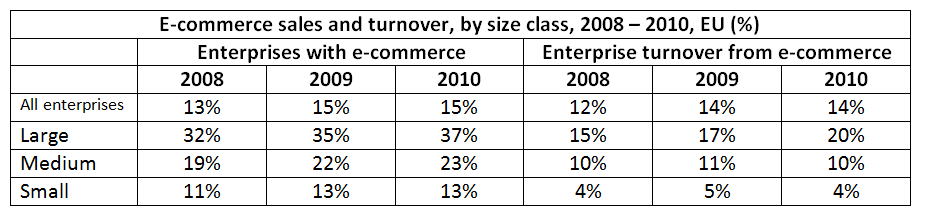

### Opciones disponibles

- **A.** 8.400 EUR
- **B.** 33.800 EUR
- **C.** 5.900 EUR
- **D.** 12.500 EUR

---

### Respuesta y explicacion

La respuesta correcta es la **D**: 12.500 EUR

Step 1 – Calculate the total number of large enterprises in 2008 and 2010

7.400/0,37 = 20.000

Step 2 – Calculate the turnover from e-commerce in 2008

45.000.000/1,2 = 37.500.000

Step 3 – Calculate the total turnover for large enterprises in 2008

37.500.000/0,15 = 250.000.000

Step 4 – Calculate the average total turnover per large enterprise in 2008

250.000.000/20.000 = 12.500

## Pregunta 266

Fuente: https://www.epsoprep.com/practice/attempt/en/UXVlc3Rpb25Qb29sQXR0ZW1wdDprSFdqYkw3ZkxFd3Vod2plMHIwTnVn/review?q=33

### Enunciado

Egypt saw a threefold increase in the number of tourists between 2001 and 2010 while the percentage of tourists from the EU has shrunk by 30% in the same period. How many tourists from the EU did Egypt have in 2001?

### Imagen

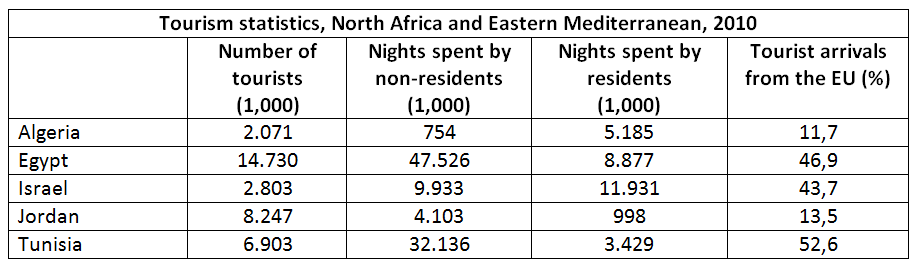

### Opciones disponibles

- **A.** 6.908.370
- **B.** 1.611.953
- **C.** 3.289.700
- **D.** 9.869.100
- **E.** 7.675.967

---

### Respuesta y explicacion

La respuesta correcta es la **C**: 3.289.700

Step 1 – Calculate the number of tourists in Egypt in 2001

14.730/3 = 4.910

Step 2 – Calculate the percentage of tourists from the EU in 2001

100 – 30 = 70%

46,9/0,7 = 67%

Step 3 – Calculate the number of tourists from the EU in 2001

4.910 x 0,67 = 3.289,7 thousand

## Pregunta 267

Fuente: https://www.epsoprep.com/practice/attempt/en/UXVlc3Rpb25Qb29sQXR0ZW1wdDprSFdqYkw3ZkxFd3Vod2plMHIwTnVn/review?q=34

### Enunciado

In 2010 in the EU, 6.048 more non-residents stayed in hotels between June and September than in 2011. What percentage of the total that stayed in hotels in the EU in 2010 were residents?

### Imagen

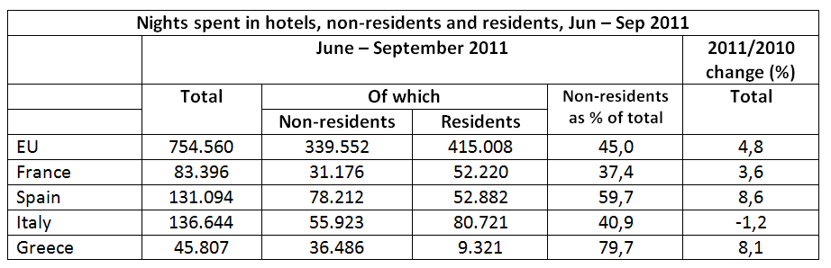

### Opciones disponibles

- **A.** 47%
- **B.** 48%
- **C.** 52%
- **D.** 55%
- **E.** 53%

---

### Respuesta y explicacion

La respuesta correcta es la **C**: 52%

Step 1 – Calculate the number of non-residents in 2010 in the EU

339.552 + 6.048 = 345.600

Step 2 – Calculate the total hotel residents in the EU in 2010

754.560/1,048 = 720.000

Step 3 – Calculate the percentage of residents in the EU in 2010

345.600/720.000 x 100 = 48% is non-residents so 52% are residents

or (720.000 – 345.600)/720.000 x 100 = 52%

## Pregunta 268

Fuente: https://www.epsoprep.com/practice/attempt/en/UXVlc3Rpb25Qb29sQXR0ZW1wdDprSFdqYkw3ZkxFd3Vod2plMHIwTnVn/review?q=35

### Enunciado

Total emissions in 1999 were 5.060 million tonnes. By how much did energy as a total change as the source of greenhouse gas emissions between 1999 and 2008?

### Imagen

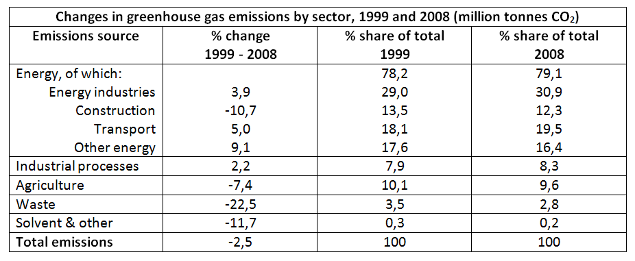

### Opciones disponibles

- **A.** 51 million tonnes
- **B.** 356 million tonnes
- **C.** 55 million tonnes
- **D.** 25 million tonnes
- **E.** 36 million tonnes

---

### Respuesta y explicacion

La respuesta correcta es la **C**: 55 million tonnes

Step 1 – Calculate the total emissions in 2008

100 – 2,5 = 97,5%

(2,5 represents the percentage change as found in the table)

5.060 x 0,975 = 4933,5

Step 2 – Calculate the share of energy as a source in 1999

5.060 x 0,782 = 3.956,92

Step 3 – Calculate the energy as a source in 2008

4933,5 x 0,791 = 3.902,3985

Step 4 – Calculate the change in energy as a source of energy emission between 1999 and 2008

3.956,92 – 3.902,3985 = 54,5215

## Pregunta 269

Fuente: https://www.epsoprep.com/practice/attempt/en/UXVlc3Rpb25Qb29sQXR0ZW1wdDprSFdqYkw3ZkxFd3Vod2plMHIwTnVn/review?q=36

### Enunciado

General government expenditure was EUR 6.380 billion in 2012 in the EU. GDP grew by 3,2% between 2009 and 2012 while the percentage spent on social protection dropped by 1 percentage point in the same period. How much was spent on social protection in 2009 in the EU?

### Imagen

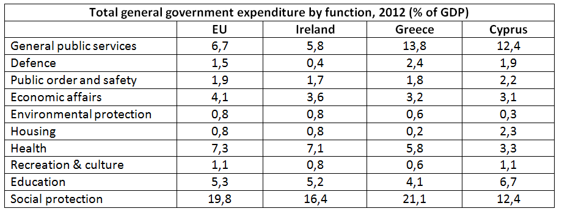

### Opciones disponibles

- **A.** 2.353 billion
- **B.** 2.772 billion
- **C.** 2.557 billion
- **D.** 2.503 billion
- **E.** 2.608 billion

---

### Respuesta y explicacion

La respuesta correcta es la **E**: 2.608 billion

Step 1 – Work out the percentage of GDP spent on general government expenditure in the EU in 2012

6,7 + 1,5 + 1,9 + 4,1 + 0,8 + 0,8 + 7,3 + 1,1 + 5,3 + 19,8 = 49,3%

Step 2 – Work out the GDP in 2012

6.380/0,493 = 12.941,17647 billion

Step 3 – Work out the GDP in 2009

12.941,17647/1,032 = 12.539,89968 billion

Step 4 – Calculate the amount spent on social protection in 2009

(remember we need to find the number before it dropped by 1 percent)

19,8 + 1,0 = 20,8%

12.539,89968 x 0,208 = 2.608,299134 billion

## Pregunta 270

Fuente: https://www.epsoprep.com/practice/attempt/en/UXVlc3Rpb25Qb29sQXR0ZW1wdDprSFdqYkw3ZkxFd3Vod2plMHIwTnVn/review?q=37

### Enunciado

Between the second half of 2012 and the second half of 2013, the highest percentage increase in household electricity prices were registered in one country in the table below and the highest percentage decreases in electricity prices were registered in another country in the table below. What was the difference in the average price per 100 kWh between these two countries in the second half of 2011?

### Imagen

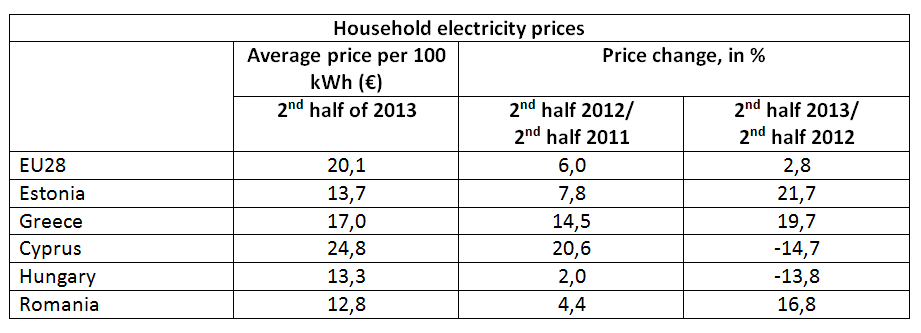

### Opciones disponibles

- **A.** 11,7
- **B.** 17,8
- **C.** 12,0
- **D.** 15,6
- **E.** 13,7

---

### Respuesta y explicacion

La respuesta correcta es la **E**: 13,7

Step 1 – Identify the two countries with the highest increase and the highest decrease between 2nd half of 2012 and 2013

Highest increase: Estonia 21,7%

Highest decrease: Cyprus -14,7%

Step 2 – Calculate the average price per 100 kWh in the 2nd half of 2012 for both countries

Estonia: 13,7/1,217 = 11,25718981

Cyprus: 24,8/0,853 = 29,07385698 (100 - 14,7 = 85,3%)

Step 3 – Calculate the average price per 100 kWh in the 2nd half of 2011

Estonia: 11,25718981/1,078 = 10,44266216

Cyprus: 29,07385698/1,206 = 24,10767577

Step 4 – Work out the difference between the two prices in 2011

24,10767577 – 10,44266216 = 13,66501361

## Pregunta 271

Fuente: https://www.epsoprep.com/practice/attempt/en/UXVlc3Rpb25Qb29sQXR0ZW1wdDprSFdqYkw3ZkxFd3Vod2plMHIwTnVn/review?q=38

### Enunciado

Between 2001 and 2011 in Estonia, the bovine population dropped by 10% while the percentage share of cow population and dairy cow population dropped by 3,2 and 12,5 percentage points respectively. How many dairy cows were there in Estonia in 2001?

### Imagen

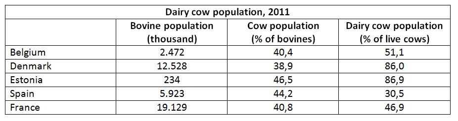

### Opciones disponibles

- **A.** 104 thousand
- **B.** 84 thousand
- **C.** 136 thousand
- **D.** 128 thousand
- **E.** 68 thousand

---

### Respuesta y explicacion

La respuesta correcta es la **D**: 128 thousand

Step 1 – Calculate the bovine population in Estonia in 2001

234/0,9 = 260 thousand (100 – 10 = 90%)

Step 2 – Calculate the percentage of cow population and the number of cows in Estonia in 2001

46,5 + 3,2 = 49,7%

260 x 0,497 = 129,22

Step 3 – Calculate the percentage of dairy cows and the number of dairy cows in Estonia in 2001

86,9 + 12,5 = 99,4%

129,22 x 0,994 = 128,44468

## Pregunta 272

Fuente: https://www.epsoprep.com/practice/attempt/en/UXVlc3Rpb25Qb29sQXR0ZW1wdDprSFdqYkw3ZkxFd3Vod2plMHIwTnVn/review?q=39

### Enunciado

In the second half of 2011, what was the difference in the average price per 100 kWh between the two countries which had the lowest and highest prices per 100 kWh in the second half of 2013?

### Imagen

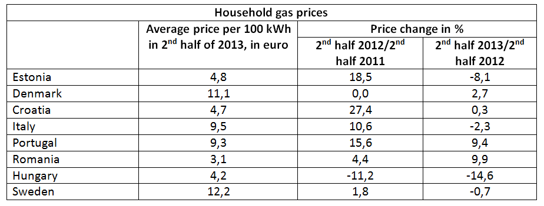

### Opciones disponibles

- **A.** €9,4
- **B.** €6,5
- **C.** €9,5
- **D.** €8,1
- **E.** €5,3

---

### Respuesta y explicacion

La respuesta correcta es la **A**: €9,4

Step 1 – Identify the two countries with the lowest and highest prices per 100 kWh in 2nd half of 2013

Lowest: Romania – €3,1

Highest: Sweden – €12,2

Step 2 – Work out the average prices for these two countries in the second half of 2012

Romania: 3,1/1,099 = 2,820746133

Sweden: 12,2/0,993 = 12,28600201 (100 – 0,7 = 99,3%)

Step 3 – Work out the average prices for these two countries in the second half of 2011

Romania: 2,820746133/1,044 = 2,701864112

Sweden: 12,28600201/1,018 = 12,06876425

Step 4 – Calculate the difference between the average prices in these two countries in the 2nd half of 2011

12,06876425 – 2,701864112 = 9,366900141 (€9,4)

## Pregunta 273

Fuente: https://www.epsoprep.com/practice/attempt/en/UXVlc3Rpb25Qb29sQXR0ZW1wdDprSFdqYkw3ZkxFd3Vod2plMHIwTnVn/review?q=40

### Enunciado

What was the change in the difference between median incomes in the fifth and first quintiles in Austria between 2009 and 2010?

### Imagen

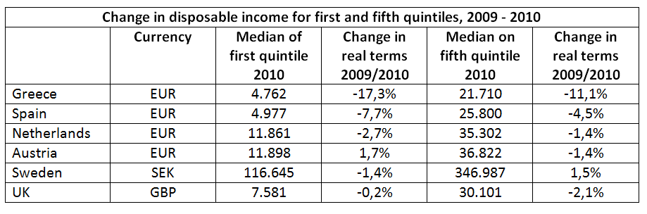

### Opciones disponibles

- **A.** -2,9%
- **B.** +2,8%
- **C.** +2,9%
- **D.** -2,8%
- **E.** +1,5%

---

### Respuesta y explicacion

La respuesta correcta es la **D**: -2,8%

Step 1 – Calculate the median of the first quintile in 2009 in Austria

11.898/1,017 = 11.699,11504

Step 2 – Calculate the median of the fifth quintile in Austria in 2009

100 – 1,4 = 98,6%

36.822/0,986 = 37.344,82759

Step 3 – Calculate the difference between the fifth and first quintiles in 2009 and 2010

2009: 37.344,82759 – 11.699,11504 = 25.645,71255

2010: 36.822 – 11.898 = 24.924

Step 4: Calculate the % change between 2009 and 2010

24.924/25.645,71255 x 100 = 97,18583545%

100 – 97,18583445 = 2,814164545% decrease

## Pregunta 274

Fuente: https://www.epsoprep.com/practice/attempt/en/UXVlc3Rpb25Qb29sQXR0ZW1wdDpnd2pTU1g5XzFFd3RJUWplMHIwTnVn/review?q=1

### Enunciado

In Belgium, the percentage of the population aged 65 years and over is expected to increase by 45% from 2010 to 2060 while the percentage of the population aged 80 years and over is expected to increase by 5 percentage points. If the total population is expected to grow by 2,5% over the same period, how many people are expected to be aged between 65 to 79 years in 2060?

### Imagen

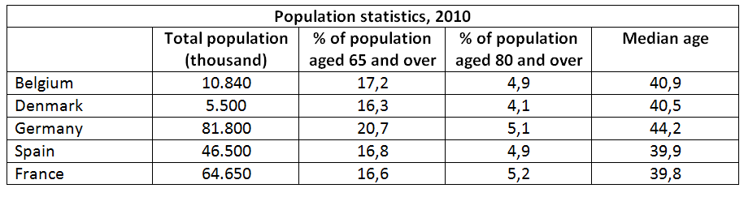

### Opciones disponibles

- **A.** 1.671 thousand
- **B.** 2.199 thousand
- **C.** 1.100 thousand
- **D.** 2.771 thousand
- **E.** 1.587 thousand

---

### Respuesta y explicacion

La respuesta correcta es la **A**: 1.671 thousand

Step 1 – Calculate the expected total population in 2060

10.840 x 1,025 = 11.111 thousand

Step 2 – Calculate the % of the population aged 65+ in 2060 and from this the population

17,2 x 1,45 = 24,94%

11.111 x 0,2494 = 2.771,0834

Step 3 – Calculate the % of the population aged 80+ and from this the population

4,9 + 5 = 9,9%

11.111 x 0,099 = 1.099,989

Step 4 – Calculate the number of people aged 65 to 79

2.771,0834 – 1.099,989 = 1.671,0944 thousand

## Pregunta 275

Fuente: https://www.epsoprep.com/practice/attempt/en/UXVlc3Rpb25Qb29sQXR0ZW1wdDpnd2pTU1g5XzFFd3RJUWplMHIwTnVn/review?q=2

### Enunciado

10% more people in the 65+ age group participated in tourism in 2011 than in 2006. This age group increased by 6% in the same period. The EU population in 2011 was 506 million. What percentage of the 65+ age group participated in tourism in 2006?

### Imagen

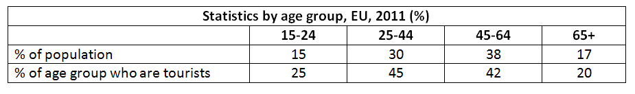

### Opciones disponibles

- **A.** 13,92%
- **B.** 21,20%
- **C.** 17,20%
- **D.** 20,75%
- **E.** 19,27%

---

### Respuesta y explicacion

La respuesta correcta es la **E**: 19,27%

Step 1 – Calculate how many people were in the 65+ age group from the population as a whole in 2011 and 2006

2011: 506 x 0,17 = 86,02 million

2006: 86,02/1,06 = 81,1509434 million

Step 2 – Calculate the number of people 65+ that were tourists in 2011 and 2006

2011: 86,02 x 0,2 = 17,204

2006: 17,204/1,1 = 15,64

Step 3 – Calculate the percentage of 65+ age group who were tourists in 2006

15,64/81,1509434 x 100 = 19,27272727%

## Pregunta 276

Fuente: https://www.epsoprep.com/practice/attempt/en/UXVlc3Rpb25Qb29sQXR0ZW1wdDpnd2pTU1g5XzFFd3RJUWplMHIwTnVn/review?q=3

### Enunciado

How much more milk would Portugal have to produce in 2011 to match the same yield per cow as Denmark?

### Imagen

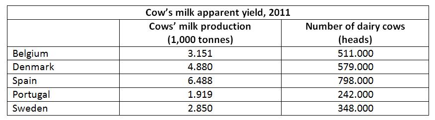

### Opciones disponibles

- **A.** 35 thousand tonnes
- **B.** 121 thousand tonnes
- **C.** 48 thousand tonnes
- **D.** 427 thousand tonnes
- **E.** 62 thousand tonnes

---

### Respuesta y explicacion

La respuesta correcta es la **B**: 121 thousand tonnes

Step 1 – Calculate the yield per cow in Denmark

4.880.000/579.000 = 8,428324698 tonnes per cow

Step 2 – Calculate the milk that needed to be produced in Portugal to match Denmark’s yield

Yield = Milk production/number of cows

So Yield x number of cows = Milk production

8,428324698 x 242.000 = 2.039.654,577 tonnes (or 2.039,654577 thousand tonnes)

Step 3 – Calculate how much more milk would need to have been produced in Portugal to meet this yield

2.039,654577 – 1.919 = 120,6545769 thousand tonnes

## Pregunta 277

Fuente: https://www.epsoprep.com/practice/attempt/en/UXVlc3Rpb25Qb29sQXR0ZW1wdDpnd2pTU1g5XzFFd3RJUWplMHIwTnVn/review?q=4

### Enunciado

During 2013, a farmer sold 40 tonnes of wheat and 25 tonnes of barley. What was his turnover in euros?

### Imagen

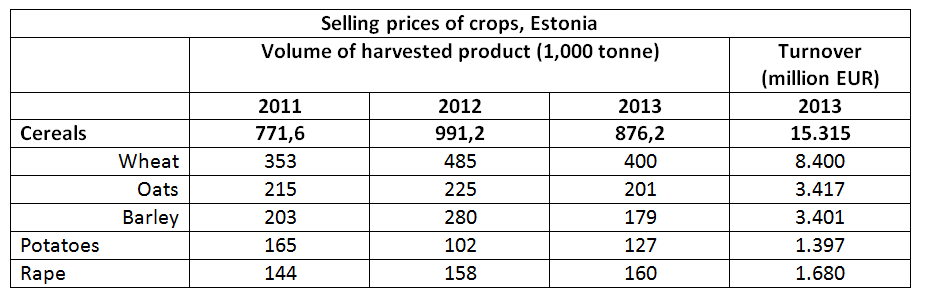

### Opciones disponibles

- **A.** EUR 1.155
- **B.** EUR 1.265
- **C.** EUR 1.265.000
- **D.** EUR 1.315.000
- **E.** EUR 1.315

---

### Respuesta y explicacion

La respuesta correcta es la **D**: EUR 1.315.000

Step 1 – Calculate the price of wheat

8.400/400 = 21 thousand per tonne

Step 2 - Calculate the price of barley

3401/179 = 19 thousand per tonne

Step 3 – Calculate the farmer’s turnover

(40 x 21) + (25 x 19) =1.315 thousand euros

## Pregunta 278

Fuente: https://www.epsoprep.com/practice/attempt/en/UXVlc3Rpb25Qb29sQXR0ZW1wdDpnd2pTU1g5XzFFd3RJUWplMHIwTnVn/review?q=6

### Enunciado

In 2011 in the EU, € 26 billion was spent on holiday trips by tourists aged 65 or over, 20% of the total spending of EU residents. What percentage of tourists were 65 and over?

### Imagen

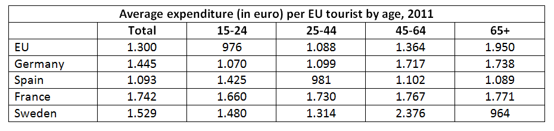

### Opciones disponibles

- **A.** 17,63%
- **B.** 13,33%
- **C.** 25,43%
- **D.** 34,22%
- **E.** 11,55%

---

### Respuesta y explicacion

La respuesta correcta es la **B**: 13,33%

Step 1 – Calculate the total amount spent on holiday trips in the EU

26/0,2 = 130 billion

Step 2 – Work out the total number of tourists in the EU

130.000.000.000/1.300 = 100.000.000

Step 3 – Calculate the number of tourists 65+

26.000.000.000/1950 = 13.333.333,33

Step 4 – Calculate the percentage of tourists over 65+

13.333.333,33/100.000.000 x 100 = 13,33%

## Pregunta 279

Fuente: https://www.epsoprep.com/practice/attempt/en/UXVlc3Rpb25Qb29sQXR0ZW1wdDpnd2pTU1g5XzFFd3RJUWplMHIwTnVn/review?q=7

### Enunciado

Italy’s new electricity capacity in 2012 was 37% of the total of Germany’s and Spain’s capacity in 2012, a growth rate of 25% in 2007. What was Italy’s new electricity capacity in 2007?

### Imagen

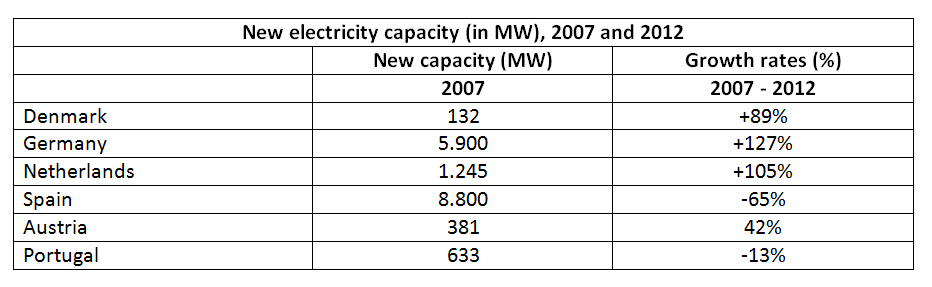

### Opciones disponibles

- **A.** 7.619
- **B.** 3.911
- **C.** 3.130
- **D.** 4.876
- **E.** 6.095

---

### Respuesta y explicacion

La respuesta correcta es la **D**: 4.876

Step 1 – Work out the new capacity in Germany in 2012

We have to multiply the capacity from 2007 with the growth in the period 2007-2012 which was 127% per the table. Keep in mind that the multiplier in that case is 2,27 and not 1,27 as 1,27 would suggest only a 27% increase.

5.900 x 2,27 = 13.393

Step 2 – Work out the new capacity in Spain in 2012

8.800 x 0,35 = 3.080 (100 – 65 = 35%)

Step 3 – Work out the new capacity in Italy in 2012

13.393 + 3.080 = 16.473

16.473 x 0,37 = 6.095,01

Step 4 – Work out the new capacity in 2007

6.095,01/1,25 = 4.876,008

## Pregunta 280

Fuente: https://www.epsoprep.com/practice/attempt/en/UXVlc3Rpb25Qb29sQXR0ZW1wdDpnd2pTU1g5XzFFd3RJUWplMHIwTnVn/review?q=8

### Enunciado

In 2009 in the EU, the number of serious accidents was down 12,5% and the number of fatal accidents was down 20% on the previous year but the breakdown between male and female accidents remained the same. How many more men were injured or killed in 2008?

### Imagen

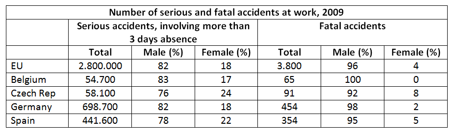

### Opciones disponibles

- **A.** 328.912
- **B.** 176.760
- **C.** 72.038
- **D.** 289.918
- **E.** 467.233

---

### Respuesta y explicacion

La respuesta correcta es la **A**: 328.912

Step 1 – Work out the number of serious accidents in 2008 and from this, the number of additional men hurt

2.800.000/0,875 = 3.200.000 (100 – 12,5 = 87,5%)

So (3.200.000 – 2.800.000) x 0,82 = 328.000

Step 2 – Work out the number of fatal accidents in 2008 and from this the number of additional men killed

3.800/0,80 = 4.750 (100 – 20 = 80%)

So (4.750 – 3.800) x 0,96 = 912

Step 3 – Add the two figures

328.000 + 912 = 328.912

## Pregunta 281

Fuente: https://www.epsoprep.com/practice/attempt/en/UXVlc3Rpb25Qb29sQXR0ZW1wdDpnd2pTU1g5XzFFd3RJUWplMHIwTnVn/review?q=9

### Enunciado

In 2011, Norway’s share of energy from renewable sources exceeds Estonia’s by 160% and is 162,5 times bigger than Malta’s share. What is the difference between Norway’s share and Malta’s share?

### Imagen

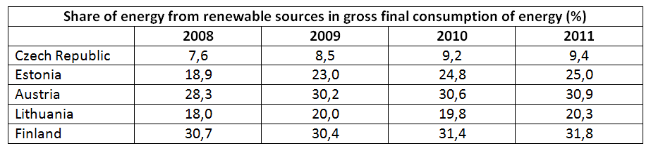

### Opciones disponibles

- **A.** 39,8
- **B.** 64,8
- **C.** 39,6
- **D.** 25,8
- **E.** 64,6

---

### Respuesta y explicacion

La respuesta correcta es la **E**: 64,6

Step 1 – Work out Norway’s share of energy resources in 2011

25,0 x 2,60 = 65,0

Step 2 – Work out the Malta’s share of energy resources in 2011

65,0/162,5 = 0,4

Step 3 – Work out difference between Norway and Malta

65,0 – 0,4 = 64,6

## Pregunta 282

Fuente: https://www.epsoprep.com/practice/attempt/en/UXVlc3Rpb25Qb29sQXR0ZW1wdDpnd2pTU1g5XzFFd3RJUWplMHIwTnVn/review?q=10

### Enunciado

Between 2002 and 2009, the euro appreciated in percentage terms against the Romanian leu by 5 times more than between 2009 and 2012. How many more leu could you buy for €100 in 2012 compared to 2002?

### Imagen

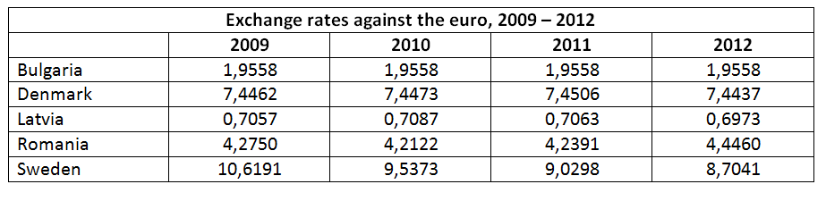

### Opciones disponibles

- **A.** 17,10 leu
- **B.** 68,40 leu
- **C.** 35,84 leu
- **D.** 88,35 leu
- **E.** 102,60 leu

---

### Respuesta y explicacion

La respuesta correcta es la **D**: 88,35 leu

Step 1 – Work out by how much the Romanian leu appreciated between 2009 and 2012

4,4460/4,2750 = 1,04 (4%)

Step 2 – Work out the exchange rate in 2002

4 x 5 = 20%

We now know that the EUR appriciated 20% between 2002 and 2009.

Knowing that and the 2009 exchange rate we have to apply reverse pecentages to find the starting exchage rate from 2002.

We do this by dividing the 2009 exchange rate with 1,2 (representing 20%)

4,2750/1,2 = 3,5625

Step 3 – Work out the difference in leu for €100 between 2002 and 2012

2012: 100 x 4,4460 = 444,60 leu

2002: 100 x 3,5625 = 356,25 leu

444,60 – 356,25 = 88,35 leu

## Pregunta 283

Fuente: https://www.epsoprep.com/practice/attempt/en/UXVlc3Rpb25Qb29sQXR0ZW1wdDpnd2pTU1g5XzFFd3RJUWplMHIwTnVn/review?q=14

### Enunciado

In 2011 in Belgium, 474.320 children, aged 16 and under, were living with their mother only. How many children, aged 16 and under, lived without either parent?

### Imagen

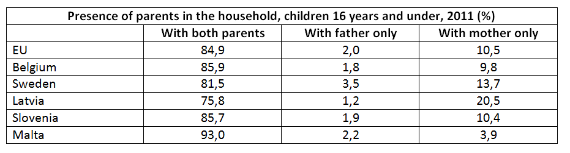

### Opciones disponibles

- **A.** 121.000
- **B.** 4.157.560
- **C.** 87.120
- **D.** 658.778
- **E.** 12.100

---

### Respuesta y explicacion

La respuesta correcta es la **A**: 121.000

Step 1 – Calculate the total number of children aged 16 and under in Belgium

474.320/0,098 = 4.840.000

Or 474.320/9,8 = 48.400

Step 2 – Calculate the percentage without parents

100 – (85,9 + 1,8 +9,8) = 2,5%

Step 3 – Calculate the children not living with either parent

4.840.000 x 0,025 = 121.000

Or 48.400 x 2,5 = 121.000

## Pregunta 284

Fuente: https://www.epsoprep.com/practice/attempt/en/UXVlc3Rpb25Qb29sQXR0ZW1wdDpnd2pTU1g5XzFFd3RJUWplMHIwTnVn/review?q=15

### Enunciado

Between 2004 and 2007, the number of letter-post items dropped in Italy and the Netherlands by 8% and 11% respectively while the price per letter increased by 20% and 10% respectively. How much did Italy and the Netherlands spend on posting letters in 2004?

### Imagen

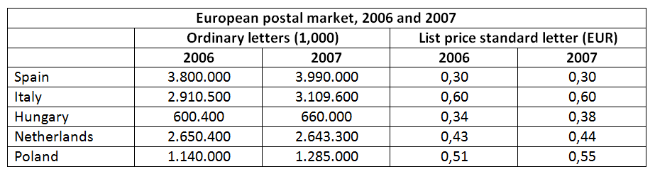

### Opciones disponibles

- **A.** 2.837.000 thousand Euros
- **B.** 3.987.000 thousand Euros
- **C.** 2.878.000 thousand Euros
- **D.** 2.852.809 thousand Euros
- **E.** 4.333.403 thousand Euros

---

### Respuesta y explicacion

La respuesta correcta es la **C**: 2.878.000 thousand Euros

Step 1 – Work out how number of letters in 2004 in Italy and Netherlands

Italy: 3.109.600/0,92 = 3.380.000 thousand (100 – 8 = 92%)

Netherlands: 2.643.300/0,89 = 2.970.000 thousand (100 – 11 = 89%)

Step 2 – Work out price per letter in 2004 in Italy and Netherlands

Italy: 0,60/1,2 = 0,50

Netherlands: 0,44/1,1 = 0,40

Step 3 – Work out how much Italy and the Netherlands spent in 2004

Italy: 3.380.000 x 0,5 =1.690.000 thousand

Netherlands: 2.970.000 x 0,4 = 1.188.000 thousand

Step 4 – Work out the total spent in Italy and the Netherlands

1.690.000 + 1.188.000 = 2.878.000 thousand

## Pregunta 285

Fuente: https://www.epsoprep.com/practice/attempt/en/UXVlc3Rpb25Qb29sQXR0ZW1wdDpnd2pTU1g5XzFFd3RJUWplMHIwTnVn/review?q=16

### Enunciado

In the EU27 in 2012, the amount of total expenditure on central government shrunk by 0,9 percentage points while the % share of GDP spent on central government grew by 1%. The total expenditure in 2012 was EUR 213.332.000 million. What was the GDP in EU27 in 2012?

### Imagen

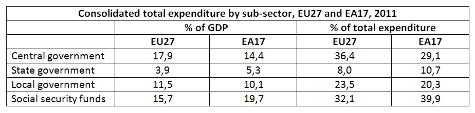

### Opciones disponibles

- **A.** EUR 1.192.545.350 million
- **B.** EUR 3.274.000.000 million
- **C.** EUR 1.800.540.055 million
- **D.** EUR 3.271.980.021 million
- **E.** 418.899.607,279 million

---

### Respuesta y explicacion

La respuesta correcta es la **E**: 418.899.607,279 million

Step 1 – Calculate the amount of total expenditure spent on the central government in 2012 in EU27

36,4-0,9 = 35,5%

213.332.000*0,355 = 75.732.860 million

Step 2 – Calculate the % of GDP spent on the central government in 2012 in EU27

17,9 x 1,01 = 18,079%

Step 2 – Calculate the GDP in the EU27 in 2012

75.732.860/0,18079 = 418.899.607,279 million

## Pregunta 286

Fuente: https://www.epsoprep.com/practice/attempt/en/UXVlc3Rpb25Qb29sQXR0ZW1wdDpnd2pTU1g5XzFFd3RJUWplMHIwTnVn/review?q=18

### Enunciado

In 2010, there were 86,6 million pupils in the EU within pre-primary to secondary levels of education. How many girls were in education in the EU in 2010?

### Imagen

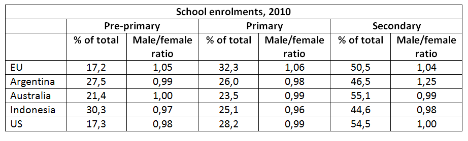

### Opciones disponibles

- **A.** 42,28 million
- **B.** 27,97 million
- **C.** 44,36 million
- **D.** 43,73 million

---

### Respuesta y explicacion

La respuesta correcta es la **A**: 42,28 million

Step 1 – Work out by how many pupils were in pre-primary education in the EU in 2010 and from this the number of girls

86,6 x 0,172 = 14,8952 million

Ratio is 1,05 boys to 1,00 girl so 2,05 parts in total

14,8952 x 1,00/2,05 = 7,26595122 million girls

Step 2 – Work out pupils were in primary education and from this the number of girls

86,6 x 0,323 = 27,9718 million

Ratio is 1,06 to 1,00 girl so 2,06 parts in total

27,9718 x 1,00/2,06 = 13,57854369 million girls

Step 3 – Work out pupils were in secondary education and from this the number of girls

86,6 x 0,505 = 43,733 million

Ratio is 1,04 to 1,00 girl so 2,04 parts in total

43,733 x 1,00/2,04 = 21,4377451 million girls

Step 4 – Calculate the total number of girls in education

7,26595122 + 13,57854369 + 21,4377451 = 42,28224001 million

## Pregunta 287

Fuente: https://www.epsoprep.com/practice/attempt/en/UXVlc3Rpb25Qb29sQXR0ZW1wdDpnd2pTU1g5XzFFd3RJUWplMHIwTnVn/review?q=19

### Enunciado

In 2011 in Ireland, there were 150.000 third-country nationals spread across the three age groups in the ratio 5:6:4. What percentage of the total third-country nationals acquired citizenship in 2011?

### Imagen

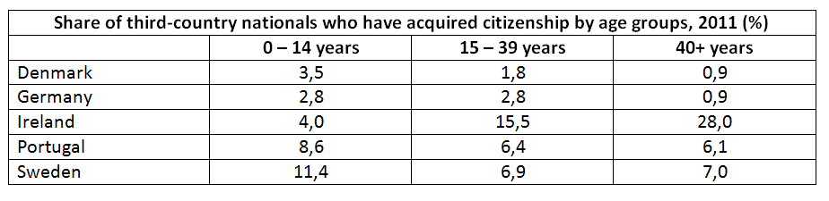

### Opciones disponibles

- **A.** 15,8%
- **B.** 15,0%
- **C.** 27,0%
- **D.** 25,0%
- **E.** 50,0%

---

### Respuesta y explicacion

La respuesta correcta es la **B**: 15,0%

Step 1 – Work out the number of third-country nationals in each age category in Ireland

5:6:4 = 15 parts in total

So 0 – 14 years: 5/15 x 150.000 = 50.000 (5 parts of 15)

15 – 39 years: 6/15 x 150.000 = 60.000 (6 parts of 15)

40+ years: 4/15 x 150.000 = 40.000 (4 parts of 15)

Step 2 – Calculate the number of third-country nationals who have acquired citizenship for each age group

0 – 14 years: 50.000 x 0,04 = 2.000

15 – 39 years: 60.000 x 0,155 = 9.300

40+ years: 40.000 x 0,28 = 11.200

Step 3 – Calculate the percentage of total third-country nationals who have acquired citizenship in Ireland

2.000 + 9.300 + 11.200 = 22.500

22.500/150.000 x 100 = 15%

## Pregunta 288

Fuente: https://www.epsoprep.com/practice/attempt/en/UXVlc3Rpb25Qb29sQXR0ZW1wdDpnd2pTU1g5XzFFd3RJUWplMHIwTnVn/review?q=20

### Enunciado

In heat one, the winner accelerated to full speed over the first 40 m and then ran at a constant speed, crossing the line at 13,56 m/s. How long did it take the winner to reach full speed?

### Imagen

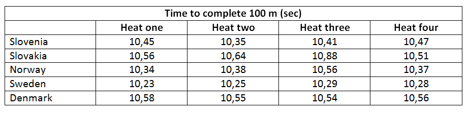

### Opciones disponibles

- **A.** 6,03 s
- **B.** 6,14 s
- **C.** 5,81 s
- **D.** 5,92 s
- **E.** 6,16 s

---

### Respuesta y explicacion

La respuesta correcta es la **C**: 5,81 s

Step 1 – Calculate the time taken once the winner had reached full speed

Speed = distance/time

So 13,56 = (100-40)/time (winner reached constant speed for the last 60m of the race)

Time = 60/13,56 = 4,424778761 seconds

Step 2 – Work out how long it took to reach top speed

10,23 (fastest time) – 4,424778761 = 5,805221239 seconds

## Pregunta 289

Fuente: https://www.epsoprep.com/practice/attempt/en/UXVlc3Rpb25Qb29sQXR0ZW1wdDpnd2pTU1g5XzFFd3RJUWplMHIwTnVn/review?q=21

### Enunciado

Between 1990 and 2011, electricity generation from hydropower increased by 7% while its share of total renewable electricity generation shrank to 40% over the same period. Wind power generation doubled over the same period. What share of total renewable electricity generation did wind power have in 2011?

### Imagen

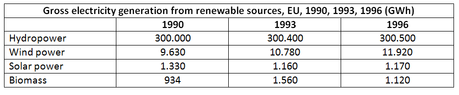

### Opciones disponibles

- **A.** 2,4%
- **B.** 15,0%
- **C.** 2,7%
- **D.** 18,3%
- **E.** 7,4%

---

### Respuesta y explicacion

La respuesta correcta es la **A**: 2,4%

Step 1 – Work out how hydropower was generated in 2011

300.000 x 1,07 = 321.000

Step 2 – Work how much total renewable electricity was generated in 2011

321.000/0,40 = 802.500

Step 3 – Work out much wind power was generated in 2011

9.630 x 2 = 19.260

Step 4 – Work out the share of total renewable electricity from wind power 2011

19.260/802.500 x 100 = 2,4%

## Pregunta 290

Fuente: https://www.epsoprep.com/practice/attempt/en/UXVlc3Rpb25Qb29sQXR0ZW1wdDpnd2pTU1g5XzFFd3RJUWplMHIwTnVn/review?q=22

### Enunciado

What was the total turnover of the activity with the most people employed per enterprise and the activity with the highest turnover per person employed?

### Imagen

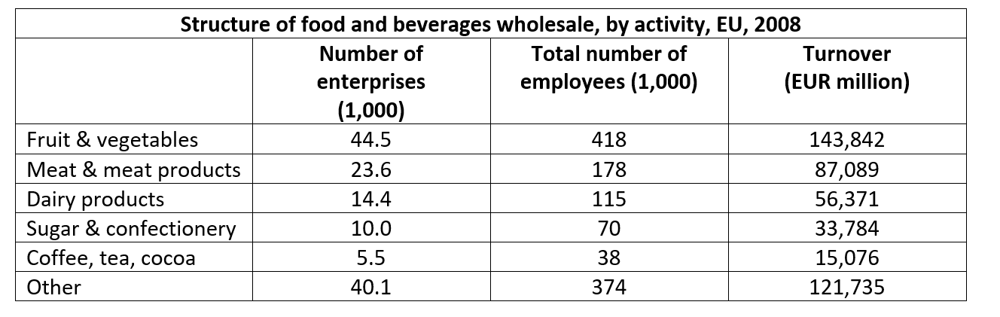

### Opciones disponibles

- **A.** 230.931 million Euros
- **B.** 178.106 million Euros
- **C.** 200.213 million Euros
- **D.** 177.626 million Euros
- **E.** 265.577 million Euros

---

### Respuesta y explicacion

La respuesta correcta es la **C**: 200.213 million Euros

Step 1 – Work out the number of persons employed per enterprise

Activity                      Number of employees per enterprise

Fruit & vegetables                        418/44,5 = 9,39

Meat & meat products                 178/23,6 = 7,54

Dairy products                              115/14,4 = 7,98

Sugar & confectionery                  70/10 = 7

Coffee, tea, cocoa                         38/5,5 = 6,91

Other                                            374/40,1 = 9,33

Fruit & vegetables has the most people employed per enterprise.

Note: Sugar & confectionery and coffee, tea, cocoa can be quickly discarded.

Step 2 – Work out the turnover per employee

Activity                                            Turnover per employee

Fruit & vegetables                                    143.842/418 = 344,12

Meat & meat products                             87.089/178 = 489,26

Dairy products                                          56.371/115 = 490,18

Sugar & confectionery                              33.784/70 = 482,63

Coffee, tea, cocoa                                     15.076/38 = 396,74

Other                                                        121.735/374 = 325,49

Dairy products has the highest turnover per employee

Step 3 – Calculate the turnover for both activities

143.842 + 56.371 = 200.213 million

## Pregunta 291

Fuente: https://www.epsoprep.com/practice/attempt/en/UXVlc3Rpb25Qb29sQXR0ZW1wdDpnd2pTU1g5XzFFd3RJUWplMHIwTnVn/review?q=24

### Enunciado

In 2011, the average life expectancy of males in Slovakia was 72,3 years. What was the average life expectancy of females in Slovakia in 2011?

### Imagen

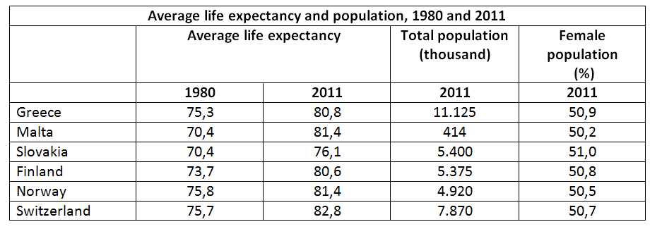

### Opciones disponibles

- **A.** 76,9 years
- **B.** 81,4 years
- **C.** 78,5 years
- **D.** 80,2 years
- **E.** 79,8 years

---

### Respuesta y explicacion

La respuesta correcta es la **E**: 79,8 years

Step 1 – Calculate the total life expectancy for the population

76,1 x 5.400 = 410.940 years

Step 2 – Work out the male and female population

Females: 5.400 x 0,51 = 2.754

Males: 5.400 x 0,49 = 2.646 (or 5.400 – 2.754)

Step 3 – Calculate the total life expectancy of the male population

2.646 x 72,3 = 191.305,8

Step 4 – Calculate the average life expectancy of the female population

410.940 – 191.305,8 = 219.634,2 total life expectancy of females

219.634,2/2.754 = 79,75098039

## Pregunta 292

Fuente: https://www.epsoprep.com/practice/attempt/en/UXVlc3Rpb25Qb29sQXR0ZW1wdDpnd2pTU1g5XzFFd3RJUWplMHIwTnVn/review?q=25

### Enunciado

The number of passengers who travelled by rail in France grew by 60% between 2005 and 2011, while turnover doubled during the same period. What was the rise in the average price of rail travel per passenger in France between 2005 and 2011?

### Imagen

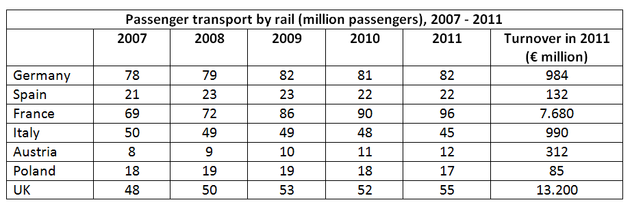

### Opciones disponibles

- **A.** EUR 4,40
- **B.** EUR 1,20
- **C.** EUR 2,40
- **D.** EUR 16,00
- **E.** EUR 48,00

---

### Respuesta y explicacion

La respuesta correcta es la **D**: EUR 16,00

Step 1 – Calculate the number of passengers in France in 2005

96/1,6 = 60

Step 2 – Calculate the turnover in France in 2005

7.680/2 = 3.840 million euro

Step 3 – Calculate the average price per passenger in 2005 and 2011

2005: 3.840/60 = € 64

2011: 7.680/96 = € 80

Step 4 – Calculate the difference between the two averages

80 – 64 = € 16

## Pregunta 293

Fuente: https://www.epsoprep.com/practice/attempt/en/UXVlc3Rpb25Qb29sQXR0ZW1wdDpnd2pTU1g5XzFFd3RJUWplMHIwTnVn/review?q=26

### Enunciado

If France’s GDP increased by 3% between 2004 and 2009, how much did spending on primary education increase during this period?

### Imagen

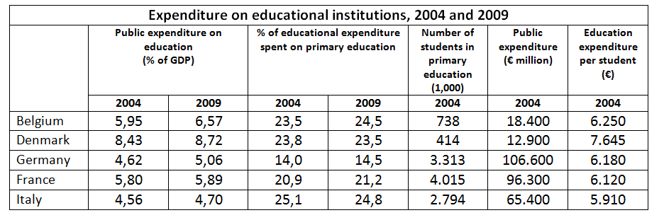

### Opciones disponibles

- **A.** 4,60%
- **B.** 5,20%
- **C.** 6,10%
- **D.** 4,89%
- **E.** 7,25%

---

### Respuesta y explicacion

La respuesta correcta es la **C**: 6,10%

Step 1 – Calculate the GDP in France in 2004 and 2009

2004: 96.300/0,058 = 1.660.344,828 million

2009: 1.660.344,828 x 1,03 = 1.710.155,172 million

Step 2 – Calculate public expenditure in education in France in 2009

1.710.155,172 x 0,0589 = 100.728,1397

Step 3 – Calculate the spending on primary education in 2004 and 2009

2004: 96.300 x 0,209 = 20.126,7

2009: 100.728,1397 x 0,212 = 21.354,36561

Step 4 – Calculate the percentage change in spending on primary education between 2004 and 2009

21.354,36531/20.126,7 = 1,060996865 (6,1%)

## Pregunta 294

Fuente: https://www.epsoprep.com/practice/attempt/en/UXVlc3Rpb25Qb29sQXR0ZW1wdDpnd2pTU1g5XzFFd3RJUWplMHIwTnVn/review?q=27

### Enunciado

If the Czech Republic’s GDP increased by 6,6% between 2006 and 2010, how much did business R&D increase during this period?

### Imagen

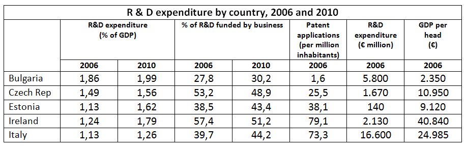

### Opciones disponibles

- **A.** 2,59%
- **B.** 3,90%
- **C.** 7,28%
- **D.** 3,26%
- **E.** 2,34%

---

### Respuesta y explicacion

La respuesta correcta es la **A**: 2,59%

Step 1 – Calculate the GDP in Czech Republic in 2006 and 2010

2006: 1.670/0,0149 = 112.080,5369

2010: 112.080,5369 x 1,066 = 119.477,8523

Step 2 – Calculate the R&D expenditure in Czech Rep in 2010

119.477,8523 x 0,0156 = 1.863,854496

Step 3 – Calculate the business spending on R&D spending in 2006 and 2010

2006: 1.670 x 0,532 = 888,44

2010: 1.863,854496 x 0,489 = 911,4248485

Step 4 – Calculate the percentage change in business spending on R&D between 2006 and 2010

911,4248485/888,44 = 1,025871019 (2,59%)

## Pregunta 295

Fuente: https://www.epsoprep.com/practice/attempt/en/UXVlc3Rpb25Qb29sQXR0ZW1wdDpnd2pTU1g5XzFFd3RJUWplMHIwTnVn/review?q=30

### Enunciado

The population in the EU in 2011 was 506 million. If the Czech Republic had the same GDP per capita as the EU, what size of the population would have been big enough to produce the Czech Republic’s GDP in 2011?

### Imagen

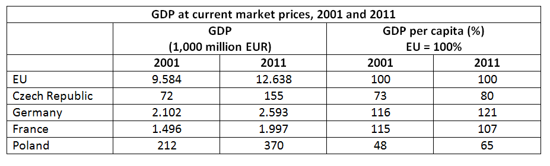

### Opciones disponibles

- **A.** 2,9 million
- **B.** 14,8 million
- **C.** 6,2 million
- **D.** 7,8 million
- **E.** 8,5 million

---

### Respuesta y explicacion

La respuesta correcta es la **C**: 6,2 million

Step 1 – Calculate the GDP per capita in the EU in 2011

12.638.000/506 = 24.976,28458 (note: million/million)

Step 2 – Calculate the population required in the Czech Republic to make the GDP, assuming the same GDP per capita as the EU

GDP per capita = GDP/population

So Population = GDP/GDP per capita

155.000/24.976,28458 = 6,205887007 million

## Pregunta 296

Fuente: https://www.epsoprep.com/practice/attempt/en/UXVlc3Rpb25Qb29sQXR0ZW1wdDpnd2pTU1g5XzFFd3RJUWplMHIwTnVn/review?q=31

### Enunciado

In 2010 in the United States, the pupil-teacher ratio was 40% higher than that of Saudi Arabia while the number of teachers was 8⅓ times more than Saudi Arabia. How many pupils were there in Saudi Arabia in 2010?

### Imagen

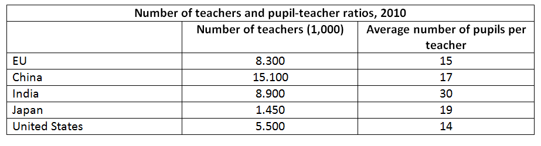

### Opciones disponibles

- **A.** 6.600
- **B.** 6.600.000
- **C.** 13.000
- **D.** 13.000.000
- **E.** 77.000.000

---

### Respuesta y explicacion

La respuesta correcta es la **B**: 6.600.000

Step 1 – Work out the pupil–teacher ratio in Saudi Arabia

From the table, we can see that the ratio for the United States is 14. We also know that this is 40% higher than the ratio for Saudi Arabia.

To find the ratio for Saudi Arabia, we need to apply reverse percentage calculations as shown below:

14 ÷ 1.40 = 10

Step 2 – Work out the number of teachers in Saudi Arabia

According to the table, the United States has 5,500 thousand teachers, and we know that this is 8⅓ times more than the number in Saudi Arabia.

5,500 ÷ 8⅓ = 660 thousand

Step 3 – Work out the number of pupils in Saudi Arabia

Now that we have both figures, we can easily calculate the number of pupils in Saudi Arabia.'

660 × 10 = 6,600 thousand

## Pregunta 297

Fuente: https://www.epsoprep.com/practice/attempt/en/UXVlc3Rpb25Qb29sQXR0ZW1wdDpnd2pTU1g5XzFFd3RJUWplMHIwTnVn/review?q=33

### Enunciado

How many more people needed to be employed in Cyprus to achieve the target set?

### Imagen

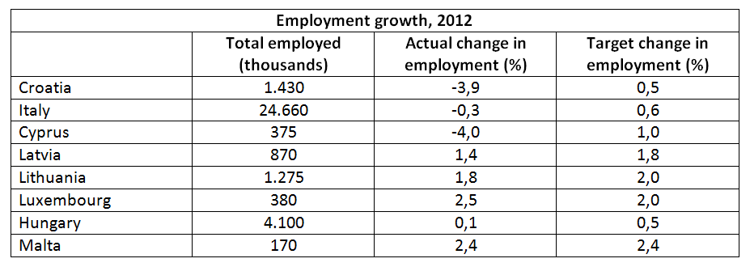

### Opciones disponibles

- **A.** 15,63 thousand
- **B.** 3,91 thousand
- **C.** 3,60 thousand
- **D.** 18,75 thousand
- **E.** 19,53 thousand

---

### Respuesta y explicacion

La respuesta correcta es la **E**: 19,53 thousand

Step 1 – Calculate the total employed the previous year, 2011, in Cyprus

375/0,96 = 390,625 (100 – 4 = 96%)

Step 2 – Calculate the total employed if target had been reached

390,625 x 1,01 = 394,53125

Step 3 – Calculate the difference between target total and actual total

394,53125 – 375 = 19,53125

Note: Another way is to find 1% and work from there:

375/96 = 3,90625 (1%)

Difference between -4% and 1% is 5%

3,90625 x 5 = 19,53125

## Pregunta 298

Fuente: https://www.epsoprep.com/practice/attempt/en/UXVlc3Rpb25Qb29sQXR0ZW1wdDpnd2pTU1g5XzFFd3RJUWplMHIwTnVn/review?q=38

### Enunciado

In 2011 the total expenditure on tourism was € 25,5 billion in the EU. How much was spent on package travel in 2011?

### Imagen

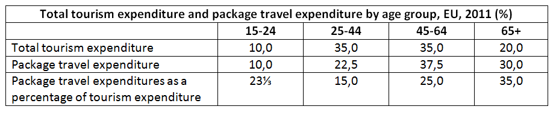

### Opciones disponibles

- **A.** € 9,56 billion
- **B.** € 5,74 billion
- **C.** € 2,55 billion
- **D.** € 5,95 billion
- **E.** € 7,65 billion

---

### Respuesta y explicacion

La respuesta correcta es la **D**: € 5,95 billion

Step 1 – Find the amount of total tourism expenditure for one of the age groups:

15-24: 25,5 x 0,1 = 2,55

25-44: 25,5 x 0,35 = 8,925

45-64: same as 25-64

65+: 25,5 x 0,2 = 5,1

Step 2 – Find the amount spent on package travel as a percentage of tourism expenditure for one of the age groups:

15-24: 2,55 x 23⅓/100 = 0,595

25-44: 8,925 x 0,15 = 1,33875

45-64: 8,925 x 0,25 = 2,23125

65+: 5,1 x 0,35 = 1,785

Step 3 – Find total spent on package travel

15-24: 0,595/0,1 = 5,95

25-44: 1,33875/0,225 = 5,95

45-64: 2,23125/0,375 = 5,95

65+: 1,785/0,3 = 5,95

## Pregunta 299

Fuente: https://www.epsoprep.com/practice/attempt/en/UXVlc3Rpb25Qb29sQXR0ZW1wdDphZmgxdGtoa3RFc2tLZ2plMHIwTnVn/review?q=4

### Enunciado

During the period, 2002 to 2006, the total number of EU patent applications increased by a constant 2,8% per annum, while during the period 2006 to 2010, the reduction in number of patent applications was a constant 1,3% per annum. How many patent applications were there in 2010?

### Imagen

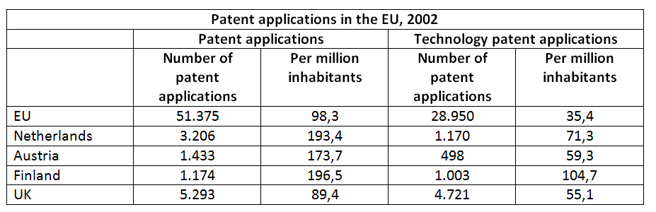

### Opciones disponibles

- **A.** 60.417
- **B.** 32.998
- **C.** 54.449
- **D.** 30.682
- **E.** 72.896

---

### Respuesta y explicacion

La respuesta correcta es la **C**: 54.449

Step 1 – Calculate the growth in EU patent applications between 2002 and 2006

51.375 x 1,0284 = 57.375,21071

(2,8% x 4 years = 1,0284)

Step 2 – Calculate the reduction in EU applications between 2006 and 2010

57.375,21071 x 0,9874 = 54.449,37564

(reduction of 1,3% for 4 years = (100%-1,3%)4 = 0,9874

Note: The student can calculate each year separately, but the use of compound percentages is far quicker

Also observe that the technology patent applications are only a subgroup of all applications and therefore not relevant to the questions as they are already included among "patent applications"

## Pregunta 300

Fuente: https://www.epsoprep.com/practice/attempt/en/UXVlc3Rpb25Qb29sQXR0ZW1wdDpFM01tTERzOVhrc2RwUWplMHIwTnVn/review?q=7

### Enunciado

How much bigger is the area of China than the area of the EU?

### Imagen

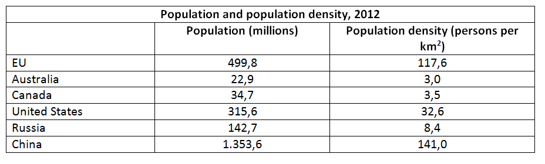

### Opciones disponibles

- **A.** 132.081 km²
- **B.** 5.350.000 km²
- **C.** 5,35 km²
- **D.** 132.081.000.000 km²
- **E.** 132.081.000 km²

---

### Respuesta y explicacion

La respuesta correcta es la **B**: 5.350.000 km²

Step 1 – Calculate the area of China

Population/area = population density

So Population/population density = area

1.353,6/141,0 = 9,6

9,6 x 1.000.000 = 9.600.000 km2 (as population is in millions)

Step 2 – Calculate the area of the EU using the method above

499,8/117,6 = 4,25

4,25 x 1.000.000 = 4.250.000 km2

Step 3 – Work out how much bigger China is than the EU

9.600.000 – 4.250.000 = 5.350.000 km2

## Pregunta 301

Fuente: https://www.epsoprep.com/practice/attempt/en/UXVlc3Rpb25Qb29sQXR0ZW1wdDpabUwtdkZHNFhFckxtQWplMHIwTnVR/review?q=4

### Enunciado

What were the exports in the EU28 area in January 2014?

### Imagen

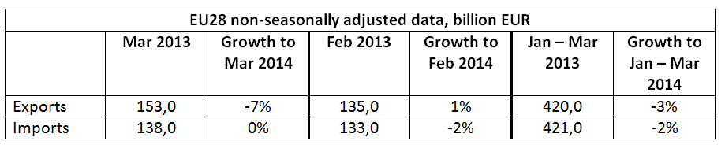

### Opciones disponibles

- **A.** 135,2 billion EUR
- **B.** 128,8 billion EUR
- **C.** 144,2 billion EUR
- **D.** 155,8 billion EUR
- **E.** 123,5 billion EUR

---

### Respuesta y explicacion

La respuesta correcta es la **B**: 128,8 billion EUR

Step 1 – Calculate the exports in the period Jan to Mar 2014

420,0 x 0,97 = 407,4

Step 2 – Calculate the exports in Mar 2014

153,0 x 0,93 = 142,29

Step 3 – Calculate the exports in Feb 2014

135,0 x 1,01 = 136,35

Step 4 – Calculate the exports in Jan 2014

407,4 – (142,29 + 136,35) = 128,76

## Pregunta 302

Fuente: https://www.epsoprep.com/practice/attempt/en/UXVlc3Rpb25Qb29sQXR0ZW1wdDpabUwtdkZHNFhFckxtQWplMHIwTnVR/review?q=5

### Enunciado

What is the percentage point decrease in approval of the government between March and July?

### Imagen

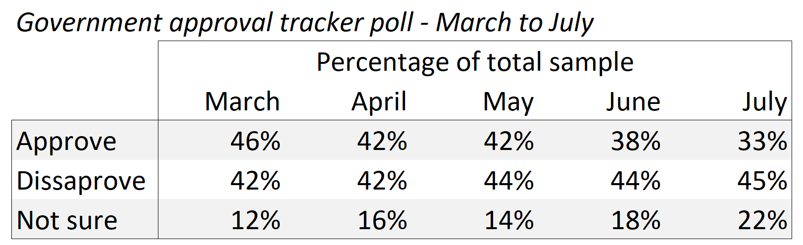

### Opciones disponibles

- **A.** 13
- **B.** 28
- **C.** 23
- **D.** 8
- **E.** 4

---

### Respuesta y explicacion

La respuesta correcta es la **A**: 13

As we are finding the "percentage point decrease" we just need the difference in the percentages between March and July.

Step 1 : Identify the percentage who approved of the government in March (46) and July (33).

Step 2 : Subtract the percentage approval in July from the percentage approval in March: 46-33=13.

## Pregunta 303

Fuente: https://www.epsoprep.com/practice/attempt/en/UXVlc3Rpb25Qb29sQXR0ZW1wdDpabUwtdkZHNFhFckxtQWplMHIwTnVR/review?q=7

### Enunciado

What is the total area of a "D323" size photo in square inches?

### Imagen

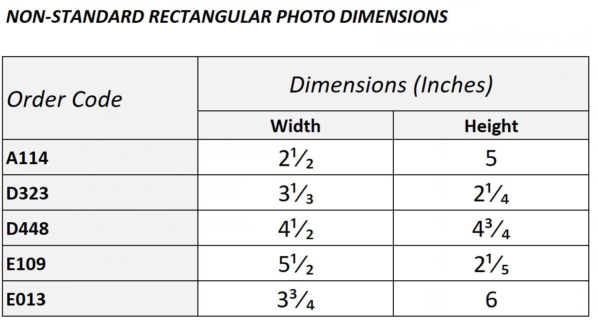

### Opciones disponibles

- **A.** 7 1/2
- **B.** 7
- **C.** 5 7/12
- **D.** 6 1/12
- **E.** 7 3/4

---

### Respuesta y explicacion

La respuesta correcta es la **A**: 7 1/2

Step 1 : Write the width and height of the photo as improper fractions: 3 1/3=10/3, 2 1/4=9/4.

Step 2 : Multiply the numerators to find the numerator of the answer: 10*9=90.

Step 3 : Multiply the denominators to find the denominator of the answer: 3*4=12.

Step 4 : Write the answer as an improper fraction and simplify: 90/12=(90/6)/(12/6)=15/2.

Step 5 : Write the improper fraction as a mixed number: 15/2=7 1/2.

## Pregunta 304

Fuente: https://www.epsoprep.com/practice/attempt/en/UXVlc3Rpb25Qb29sQXR0ZW1wdDpabUwtdkZHNFhFckxtQWplMHIwTnVR/review?q=8

### Enunciado

On the 28th June, items weighing 32,58 million kilograms were shipped. The average weight of each item was the same as for the items shipped on the 18th June. How many items were shipped on the 28th June?

### Imagen

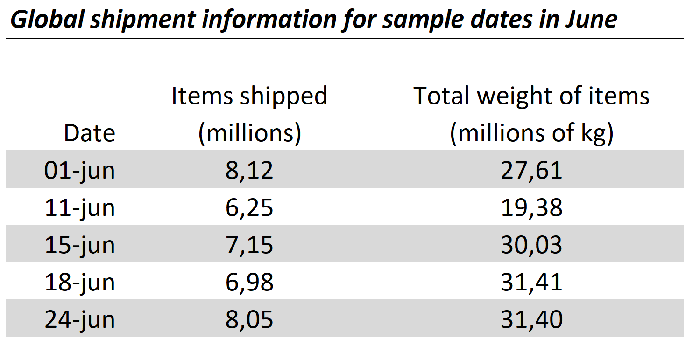

### Opciones disponibles

- **A.** 7.240.000
- **B.** 9.582.000
- **C.** 10.509.000
- **D.** 7.757.000
- **E.** 8.354.000

---

### Respuesta y explicacion

La respuesta correcta es la **A**: 7.240.000

Step 1 : Find the average weight of an item on 18th June by dividing the total weight by the number of items (both measured in millions: 31,41/6,98=4,5 kilograms.

Step 2 : Divide the total weight on 28th June by this average weight: 32,58/4,5=7,24.

Step 3 : Convert this into millions by multiplying by 1.000.000: 7,24*1.000.000=7.240.000.
